Most real-world applications are **read-heavy**. For every user who posts a tweet, thousands read it. For every product listing created, millions view it. For every article published, countless readers access it. The read-to-write ratio in production systems often exceeds 100:1.

This creates a problem. Databases are designed for durability and consistency, not for serving millions of read requests per second. A typical PostgreSQL instance might handle 10,000 queries per second on a good day. But when a tweet goes viral, it needs to be served millions of times within minutes. No single database can keep up.

The gap between what databases can deliver and what users expect is where system design gets interesting. Bridging this gap requires a layered approach, one that intercepts requests before they ever reach your database and serves them from progressively faster sources.

**Handling high read traffic** is one of the most common patterns in system design interviews. Whether you're designing Twitter, Netflix, Amazon, or a URL shortener, the interviewer expects you to demonstrate strategies for scaling reads. More importantly, they want to see that you understand the trade-offs involved.

---

# Where This Pattern Shows Up

> [!PAYWALL] This content is for premium members only.

High read traffic handling appears in virtually every user-facing system at scale:

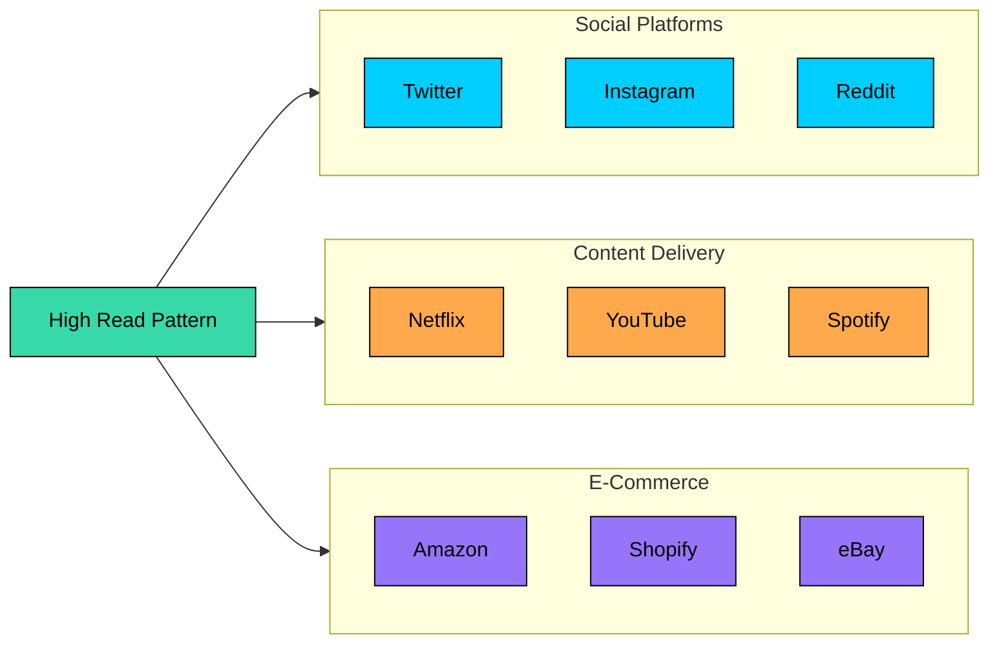

| Problem | Why High Read Handling Matters |
|---------|-------------------------------|
| **Design Twitter/Instagram** | Timelines read millions of times per second, writes are relatively rare |
| **Design Netflix/YouTube** | Catalog and metadata read constantly, video uploads are infrequent |
| **Design Amazon/E-commerce** | Product pages viewed millions of times, purchases are a tiny fraction |
| **Design URL Shortener** | URLs created once, redirected thousands or millions of times |
| **Design News Feed** | Content published once, consumed by millions of readers |
| **Design Search System** | Index updated periodically, queries arrive constantly |

---

# 1. Understanding the Read Problem

Before jumping to solutions, it helps to understand exactly why high read traffic is so challenging. The problem has three dimensions: scale, latency, and cost.

### 1.1 The Scale Problem

Consider a social media platform with 100 million daily active users. If each user checks their feed 10 times per day, and each feed load requires fetching data from multiple sources, the numbers quickly become staggering.

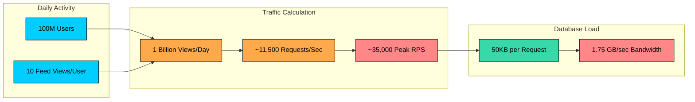

A single database instance simply cannot handle this load. Even a well-optimized PostgreSQL server tops out around 10,000 QPS. At 35,000 requests per second during peak hours, you need a fundamentally different approach.

### 1.2 The Latency Problem

Scale is only half the story. Even if your database could theoretically handle the load, it wouldn't be fast enough. Users have developed expectations about how quickly pages should load, and those expectations are measured in milliseconds.

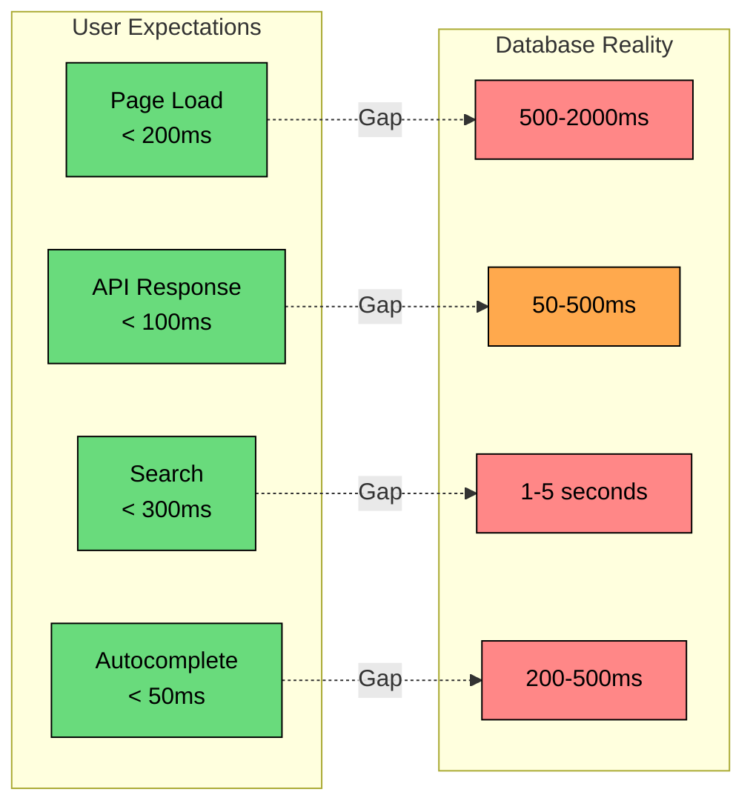

The gap between user expectations and database reality is significant. Database queries involve disk I/O, network hops, query parsing, and execution planning. All of this takes time. For user-facing applications, database queries are simply too slow to serve directly.

### 1.3 The Cost Problem

There's also an economic dimension to consider. Database instances are expensive. A high-performance RDS instance can cost $5,000-15,000 per month. Memory-optimized instances for caching run $1,000-3,000 per month. CDN bandwidth, by comparison, is dramatically cheaper than origin bandwidth.

Serving all reads from the database isn't just technically challenging, it's economically unviable at scale. The math simply doesn't work. This economic pressure is what drove companies like Netflix and Twitter to develop the caching architectures we'll explore in this article.

### 1.4 Why Systems Are Read-Heavy

Before we dive into solutions, it's worth understanding why this pattern is so common:

| System | Read:Write Ratio | Why |
|--------|------------------|-----|
| Social media feed | 1000:1 | Many viewers, few posters |
| E-commerce catalog | 10000:1 | Millions browse, few buy |
| News website | 100000:1 | Content created once, read forever |
| Video streaming | 10000:1 | Upload once, stream millions of times |
| URL shortener | 100:1 | Create once, redirect many times |

The pattern is consistent: content is created once but consumed many times. This asymmetry is what makes read optimization so critical. The good news is that this same asymmetry creates opportunities for optimization. If the same data is being read repeatedly, we can cache it. If reads don't need to be perfectly fresh, we can serve slightly stale data. If reads are geographically distributed, we can replicate data closer to users.

These observations lead us to the toolkit we'll explore next.

---

# 2. The Read Scaling Toolkit

When facing high read traffic, you have several tools at your disposal. Each addresses a different aspect of the problem, and in practice, you'll use them in combination.

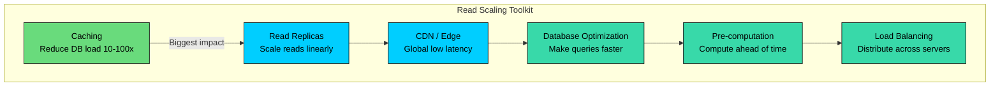

| Technique | What It Does | Impact |
|-----------|--------------|--------|
| **Caching** | Stores frequently-accessed data in fast storage | 10-100x reduction in DB load |
| **Read Replicas** | Distributes reads across multiple DB instances | Linear scaling with replica count |
| **CDN / Edge** | Serves content from locations close to users | Dramatic latency reduction globally |
| **Database Optimization** | Makes queries faster through indexes and schema design | 10-100x faster queries |
| **Pre-computation** | Computes expensive results ahead of time | Instant reads for complex data |
| **Load Balancing** | Distributes traffic across multiple servers | Prevents hotspots |

The order matters. Caching provides the biggest impact and should be your first consideration. CDN comes next for any globally distributed system. Read replicas help with what remains. Database optimization and pre-computation address specific bottlenecks.

Let's explore each technique in depth, starting with the most impactful.

---

# 3. Caching: The First Line of Defense

Caching is the single most effective technique for handling read traffic. A well-implemented cache can absorb 90% or more of read requests, reducing database load by an order of magnitude. This is why caching appears in virtually every high-scale system architecture.

The fundamental insight behind caching is simple: if you're going to read the same data repeatedly, store it somewhere faster than your database. Memory is faster than disk. Local is faster than remote. The question is where to cache and how to keep the cache consistent with your source of truth.

### 3.1 The Caching Hierarchy

Modern systems use multiple layers of caching, each optimized for different access patterns:

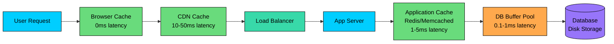

Each layer intercepts requests before they reach the next, reducing load on downstream components. The key insight is that you want to serve as many requests as possible from the fastest layers.

| Cache Layer | Latency | Capacity | Best For |
|-------------|---------|----------|----------|
| Browser cache | 0ms (local) | Limited per user | Static assets, user-specific data |
| CDN cache | 10-50ms | Massive (distributed) | Static content, regional data |
| Application cache | 1-5ms | Medium (memory-bound) | Database query results, sessions |
| Database cache | 0.1-1ms | Small (RAM-limited) | Query plans, hot data pages |

### 3.2 Application-Level Caching

The most common and versatile caching layer uses Redis or Memcached. This is where you cache database query results, computed values, and session data.

The **cache-aside pattern** (also called lazy loading) is the most widely used approach:

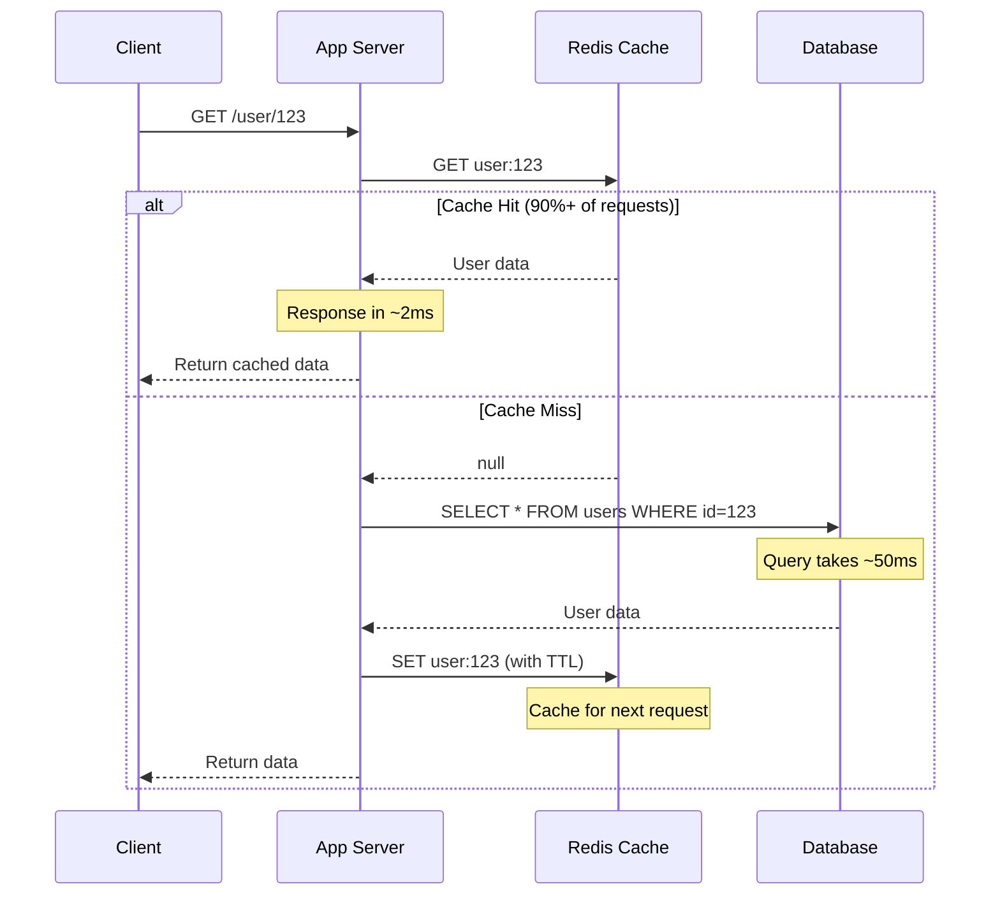

The beauty of this pattern is its simplicity. On every read, you check the cache first. If the data is there, you return it immediately. If not, you fetch from the database and populate the cache for next time.

With a 90% cache hit rate, you've just reduced your database load by 10x. That's the power of caching.

### 3.3 Cache Invalidation Strategies

Here's where caching gets interesting. The data in your cache is a copy of your source of truth. When the source changes, the copy becomes stale. Managing this staleness is the hardest part of caching.

Phil Karlton famously said, "There are only two hard things in Computer Science: cache invalidation and naming things." He wasn't wrong.

You have several strategies to choose from, each with different trade-offs:

**Strategy 1: Time-to-Live (TTL)**

The simplest approach is to let cached data expire automatically after a fixed period.

```mermaid
flowchart LR
    W[Write to DB]:::primary --> C[Data in Cache]:::green
    C --> T[TTL Countdown]:::orange
    T --> E[Cache Expires]:::red
    E --> M[Next Read = Miss]:::secondary
    M --> R[Refresh from DB]:::purple

    classDef primary fill:#00ceff,stroke:#000,color:#000
    classDef secondary fill:#38d9a9,stroke:#000,color:#000
    classDef green fill:#69db7c,stroke:#000,color:#000
    classDef orange fill:#ffa94d,stroke:#000,color:#000
    classDef red fill:#ff8787,stroke:#000,color:#000
    classDef purple fill:#9775fa,stroke:#000,color:#000
```

TTL-based expiration is simple and works well when some staleness is acceptable. A 5-minute TTL means your data might be up to 5 minutes out of date. For a news feed or product catalog, this is usually fine. For a bank balance, it's not.

**Strategy 2: Write-Through**

With write-through caching, you update the cache synchronously whenever you update the database.

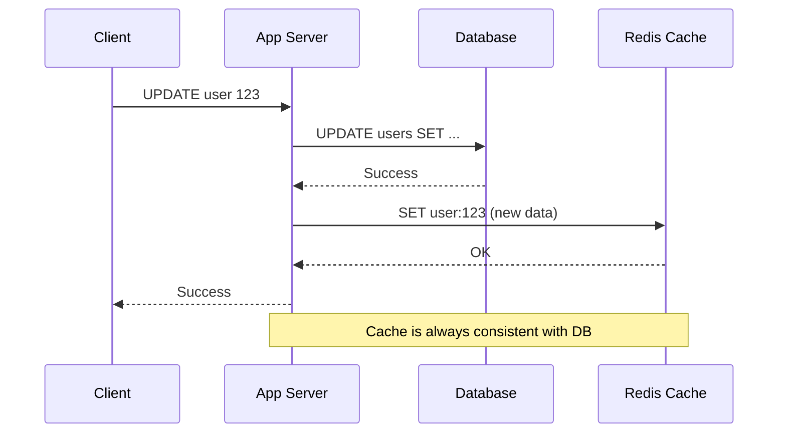

This approach guarantees consistency. The cache always reflects the current database state. The trade-off is increased write latency (you're writing to two places) and potentially caching data that's never read.

**Strategy 3: Event-Based Invalidation**

For complex systems, especially microservices architectures, event-based invalidation provides flexibility:

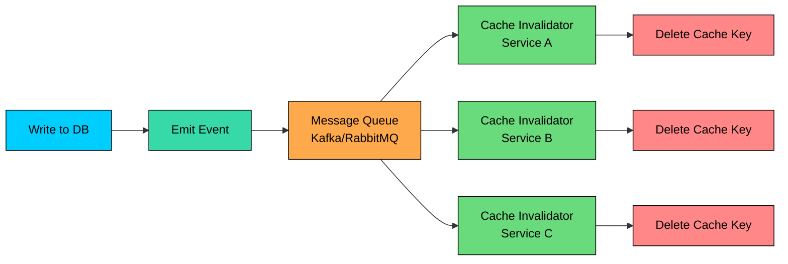

When data changes, you publish an event. Subscribers receive the event and invalidate their local caches. This decouples the writer from the cache, making it easier to add new services or cache layers.

### 3.4 Choosing the Right Strategy

The right strategy depends on your consistency requirements and system complexity:

| Pattern | Consistency | Write Speed | Complexity | Best For |
|---------|-------------|-------------|------------|----------|
| Cache-aside + TTL | Eventual | Fast | Low | Most applications, feeds, catalogs |
| Write-through | Strong | Slower | Medium | Financial data, inventory counts |
| Event-based | Eventual | Fast | High | Microservices, multiple cache layers |

For most applications, start with cache-aside and TTL. It's simple, effective, and handles the majority of use cases. Move to stronger consistency patterns only when the business requires it.

### 3.5 What to Cache (and What Not To)

Not everything benefits from caching. Good cache candidates share certain characteristics: they're read frequently, change infrequently, and tolerate some staleness.

| Good Cache Candidates | Poor Cache Candidates |
|-----------------------|-----------------------|
| User profiles | Real-time stock prices |
| Product details | Bank account balances |
| News feed content | One-time authentication tokens |
| Search results | Highly personalized data |
| Configuration data | Large binary blobs (use CDN instead) |
| Session data | Data with very low read rates |

The key question is: does caching this data provide enough benefit to justify the complexity of keeping it consistent" For frequently-read, slowly-changing data, the answer is almost always yes.

---

# 4. Read Replicas: Scaling Database Reads

Caching handles the majority of read traffic, but some percentage of requests will always miss the cache and hit your database. When the remaining load is still too high for a single database instance, read replicas provide a path forward.

The concept is straightforward: instead of one database handling all reads and writes, you maintain multiple copies. Writes go to a single primary (also called master), and changes replicate to one or more replicas. Reads are distributed across the replicas.

### 4.1 Primary-Replica Architecture

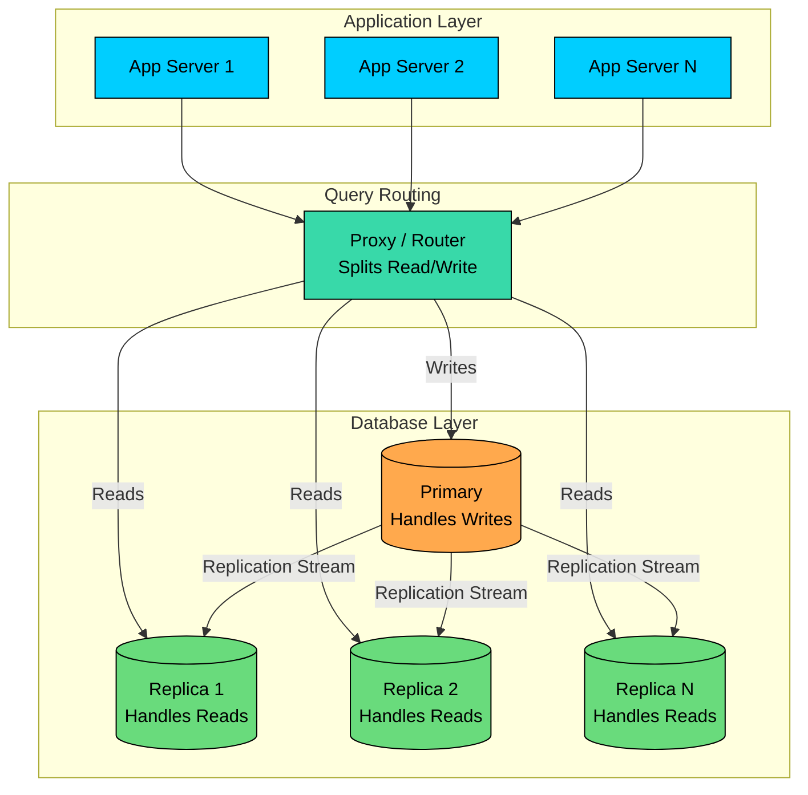

This architecture scales reads linearly. If one replica handles 10,000 QPS, three replicas handle 30,000 QPS. Need more capacity" Add another replica. The primary only handles writes, which are typically a small fraction of total traffic.

### 4.2 Replication Methods

The key design decision is how changes propagate from primary to replicas. You have two main options, and the choice affects both performance and consistency.

**Asynchronous Replication:**

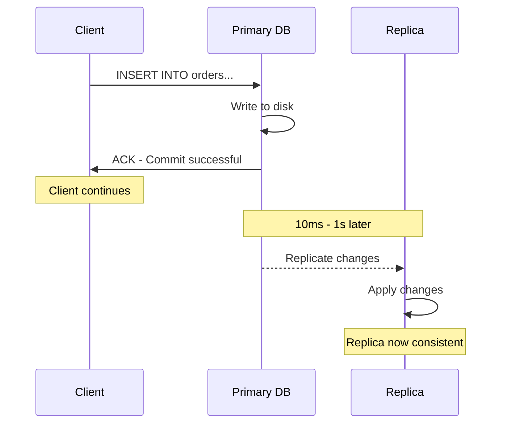

With async replication, the primary acknowledges writes immediately without waiting for replicas. This keeps write latency low but introduces **replication lag**. The replica might be slightly behind the primary, meaning reads from the replica might return stale data.

| Pros | Cons |
|------|------|
| No impact on write latency | Replication lag (potential stale reads) |
| Primary doesn't wait for replicas | Data loss possible if primary fails before replication |
| Simple to configure | Read-your-writes inconsistency |

**Synchronous Replication:**

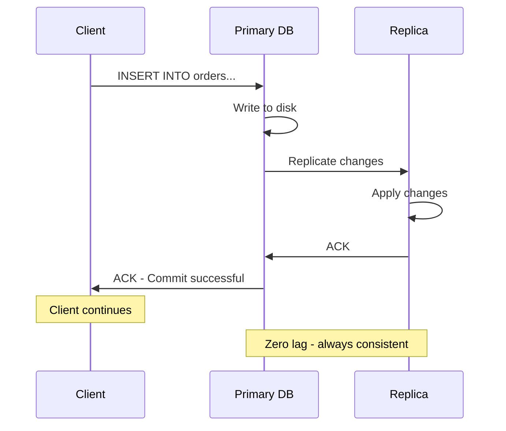

Synchronous replication waits for at least one replica to confirm the write before acknowledging to the client. This guarantees consistency but increases write latency.

| Pros | Cons |
|------|------|
| No replication lag | Higher write latency |
| Strong consistency | Replica failure can block writes |
| No data loss on failover | More complex coordination |

Most production systems use asynchronous replication and design their applications to tolerate brief inconsistency. Synchronous replication is reserved for cases where data loss is absolutely unacceptable.

### 4.3 Handling Replication Lag

Replication lag creates a frustrating user experience. A user updates their profile, refreshes the page, and sees the old data. The write went to the primary, but the read came from a lagging replica.

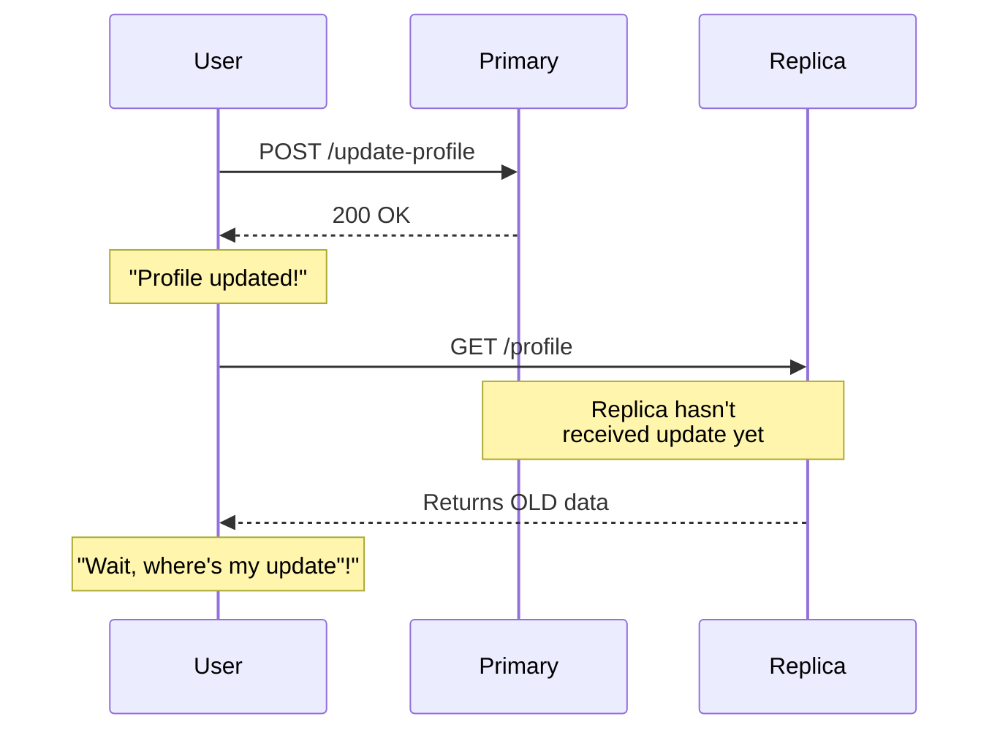

Several patterns address this problem:

**Read-Your-Writes Consistency:**

Track when each user last wrote data, and route their reads to the primary for a short period afterward.

**Monotonic Reads:**

Use sticky sessions to ensure a user always reads from the same replica. This prevents them from seeing data go "backward" if they hit replicas with different lag.

**Lag Monitoring:**

Track replication lag on each replica and only route reads to replicas with acceptable lag. If a replica falls too far behind, remove it from the rotation until it catches up.

| Solution | How It Works | Trade-off |
|----------|--------------|-----------|
| Read-your-writes | Route recent writers to primary | Primary gets more load |
| Monotonic reads | Sticky sessions to same replica | Uneven replica distribution |
| Lag monitoring | Only use low-lag replicas | Reduces available replicas |

### 4.4 Read Routing Strategies

How do you actually route reads to replicas" Two main approaches exist:

**Application-Level Routing:**

Your application explicitly chooses where to send each query. This gives you fine-grained control but requires changes to your application code.

**Proxy-Based Routing:**

A database proxy sits between your application and database, automatically routing queries based on type.

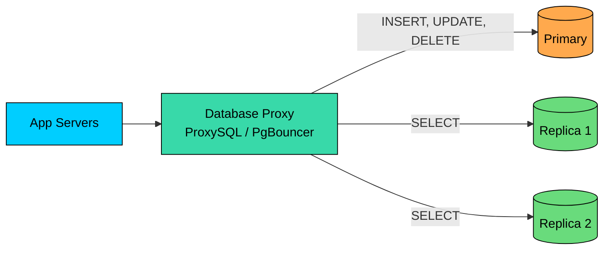

The proxy inspects each query and routes it appropriately. Your application doesn't need to know about replicas at all. Tools like ProxySQL (for MySQL) and PgBouncer (for PostgreSQL) handle this transparently.

---

# 5. CDN: Serving Content at the Edge

So far, we've focused on reducing load on your database and application servers. But there's another dimension to the read problem: latency caused by physical distance.

When a user in Tokyo requests data from servers in San Francisco, the request travels thousands of miles. Even at the speed of light, this takes time. A round trip across the Pacific is about 150 milliseconds of pure network latency, before your server even starts processing the request.

A **Content Delivery Network (CDN)** solves this by caching content at edge locations around the world. Instead of traveling to your origin server, users are served from the nearest edge location.

### 5.1 How CDN Works

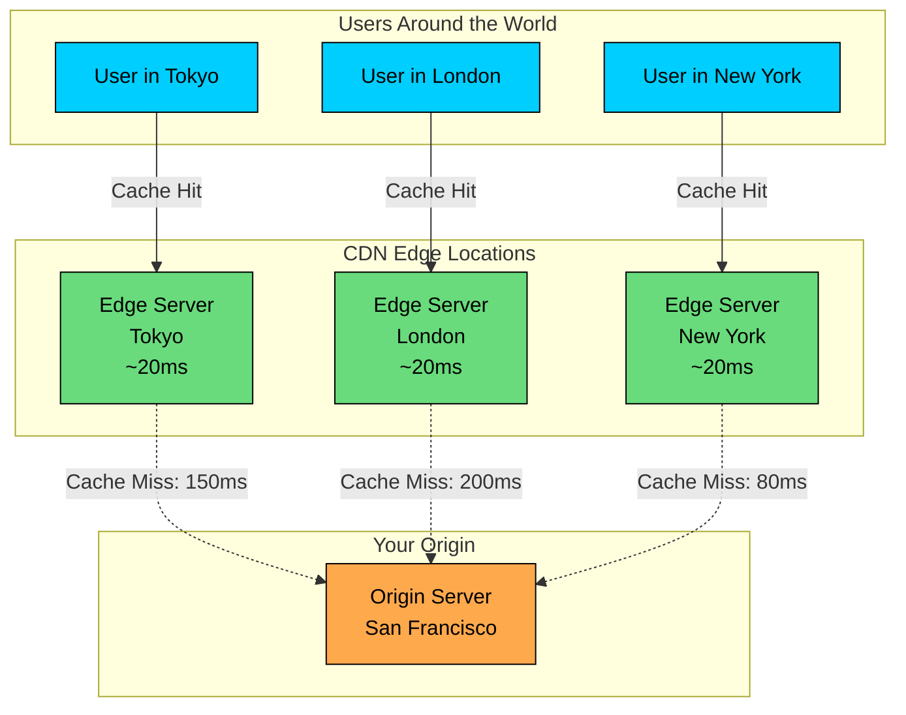

The improvement is dramatic:

- **Without CDN:** User in Tokyo → Origin in San Francisco = 150ms
- **With CDN:** User in Tokyo → Edge in Tokyo = 20ms

That's an 85% reduction in latency, and it compounds. A page that loads 10 resources saves 1.3 seconds of network latency alone.

### 5.2 What to Put on CDN

CDNs excel at serving static content, but modern CDNs can cache dynamic content too:

| Content Type | Recommended TTL | Cache-Control Header |
|--------------|-----------------|----------------------|
| Static images | 1 year | `max-age=31536000, immutable` |
| CSS/JS (versioned) | 1 year | `max-age=31536000, immutable` |
| HTML pages | 5-60 minutes | `max-age=300, stale-while-revalidate=60` |
| API responses | 1-5 minutes | `max-age=60, s-maxage=300` |
| User-specific data | Don't cache | `private, no-store` |

The key insight for static assets is **content addressing**. If you include a content hash in the filename (like `app.abc123.js`), you can cache forever. When the content changes, the filename changes, and users automatically get the new version.

### 5.3 CDN Caching Strategies

**Strategy 1: Static Asset Caching**

For images, JavaScript, and CSS, cache aggressively and use versioned URLs. The browser and CDN will cache these forever, and you update by deploying new filenames.

**Strategy 2: API Response Caching**

For read-heavy APIs with acceptable staleness, cache at the edge:

**Strategy 3: Edge Computing**

Modern CDNs can run code at the edge, enabling dynamic personalization without going to origin:

```mermaid
flowchart LR
    U[User Request]:::primary --> E[Edge Server]:::green
    E --> EF[Edge Function<br/>Cloudflare Worker<br/>Lambda@Edge]:::orange
    EF --> C{Cached"}:::secondary
    C -->|Yes| R[Return Cached<br/>+ Personalization]:::green
    C -->|No| O[Fetch from Origin]:::purple
    O --> Cache[Cache at Edge]:::green
    Cache --> R

    classDef primary fill:#00ceff,stroke:#000,color:#000
    classDef secondary fill:#38d9a9,stroke:#000,color:#000
    classDef green fill:#69db7c,stroke:#000,color:#000
    classDef orange fill:#ffa94d,stroke:#000,color:#000
    classDef purple fill:#9775fa,stroke:#000,color:#000
```

Edge functions can add personalization (like user's country), A/B test variations, or authentication checks, all without the latency of reaching your origin servers.

### 5.4 CDN Cache Invalidation

When content changes, you need to update the CDN cache. Several methods exist:

**TTL-Based Expiration:** Let content expire naturally. Simple but coarse-grained.

**Purge by URL:** Explicitly invalidate specific URLs when they change.

**Purge by Tag:** Tag content when caching, then invalidate by tag.

**Versioned URLs:** The cleanest approach. Change the URL when content changes. No invalidation needed.

---

# 6. Database Optimization

Despite caching, CDN, and read replicas, some requests will always hit your database. When they do, you want those queries to be as fast as possible.

### 6.1 Indexing

Indexes are the single most impactful database optimization. They're the difference between scanning millions of rows and looking up a handful.

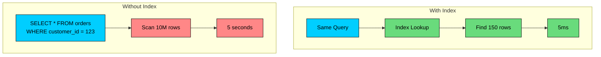

An index on `customer_id` turns a 5-second full table scan into a 5-millisecond lookup. That's a 1000x improvement from a single line of SQL.

**Composite Indexes:**

For queries that filter on multiple columns, a composite index can be even more effective:

The index order should match your query patterns: filter columns first, then sort columns.

### 6.2 Denormalization

Normalized database schemas minimize data redundancy but require JOINs to reassemble data. JOINs are expensive at scale.

Denormalization trades storage for read performance by pre-joining data:

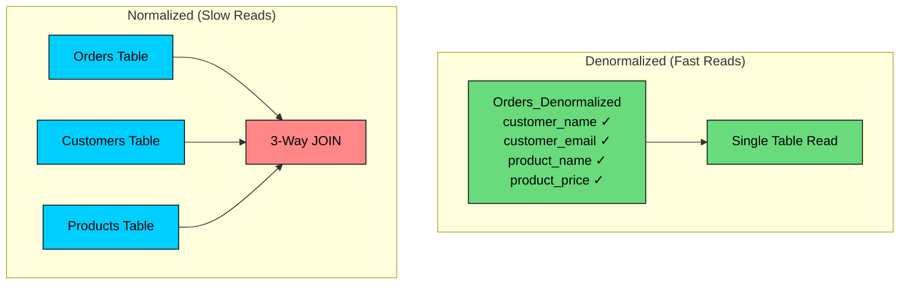

| Aspect | Normalized | Denormalized |
|--------|------------|--------------|
| Read speed | Slower (requires JOINs) | Faster (single table) |
| Write speed | Faster | Slower (update multiple copies) |
| Storage | Efficient | Redundant |
| Consistency | Automatic | Must maintain manually |
| Use case | OLTP, write-heavy | Analytics, read-heavy |

Denormalization is a trade-off. Use it when read performance is critical and you can afford the complexity of keeping redundant data consistent.

### 6.3 Query Optimization

When queries are slow, use `EXPLAIN ANALYZE` to understand why:

Common optimizations:

| Problem | Solution |
|---------|----------|
| Full table scan | Add appropriate index |
| Too many JOINs | Denormalize or use materialized view |
| Large result set | Add LIMIT, implement pagination |
| N+1 queries | Use JOIN or batch fetching |
| Expensive aggregations | Pre-compute in materialized view |

---

# 7. Pre-computation and Materialized Views

Some queries are inherently expensive. Aggregating millions of rows, computing rankings, or joining dozens of tables takes time regardless of optimization. For these cases, the solution is to compute results ahead of time.

### 7.1 Materialized Views

A **materialized view** stores the result of a query as a physical table. Instead of computing the result on every request, you compute it once and read the pre-computed result.

The trade-off is freshness for speed. The materialized view is only as current as the last refresh.

### 7.2 Pre-computed Data Stores

For more complex scenarios, you can build dedicated data stores optimized for specific read patterns:

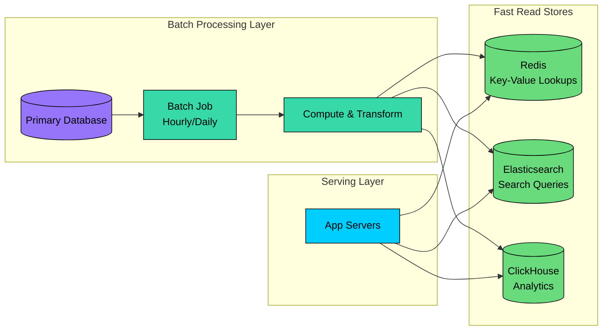

Different stores are optimized for different access patterns:

- **Redis** for key-value lookups and leaderboards
- **Elasticsearch** for full-text search
- **ClickHouse/Druid** for real-time analytics

### 7.3 Feed Pre-generation (Fanout-on-Write)

For social media feeds and timelines, you can flip the computation from read time to write time:

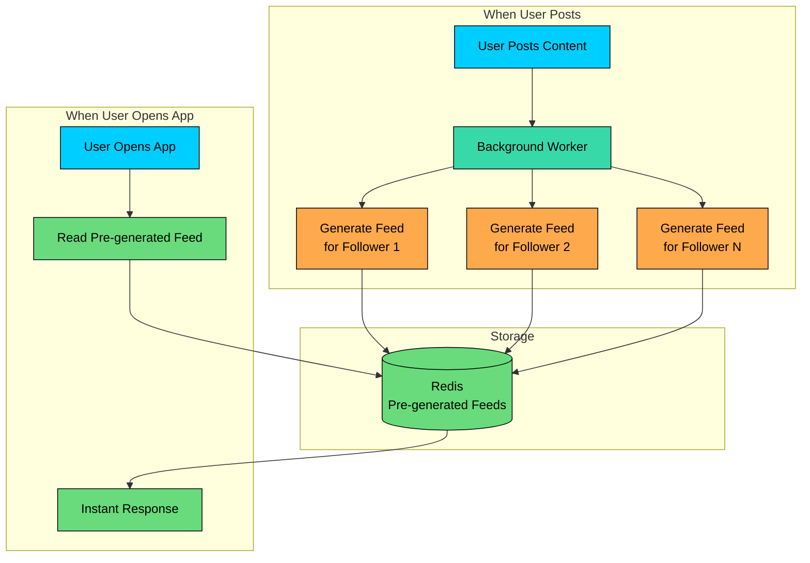

Instead of computing the feed when the user opens the app, you pre-compute it when content is posted. The read becomes a simple cache lookup.

This approach works well for most users, but celebrities with millions of followers require a hybrid approach (fanout-on-read for their posts to avoid overwhelming the write path).

---

# 8. Load Balancing and Connection Pooling

With multiple servers and replicas, you need to distribute traffic effectively.

### 8.1 Load Balancing Reads

```mermaid
flowchart TD
    C[Incoming Requests]:::primary --> LB[Load Balancer]:::secondary

    LB --> A1[App Server 1]:::green
    LB --> A2[App Server 2]:::green
    LB --> A3[App Server N]:::green

    A1 --> CP1[Connection Pool]:::orange
    A2 --> CP2[Connection Pool]:::orange
    A3 --> CP3[Connection Pool]:::orange

    CP1 --> R1[(Replica 1)]:::purple
    CP2 --> R2[(Replica 2)]:::purple
    CP3 --> R3[(Replica 3)]:::purple

    classDef primary fill:#00ceff,stroke:#000,color:#000
    classDef secondary fill:#38d9a9,stroke:#000,color:#000
    classDef green fill:#69db7c,stroke:#000,color:#000
    classDef orange fill:#ffa94d,stroke:#000,color:#000
    classDef purple fill:#9775fa,stroke:#000,color:#000
```

Common load balancing algorithms:

| Algorithm | How It Works | Best For |
|-----------|--------------|----------|
| Round-robin | Rotate through servers sequentially | Uniform request sizes |
| Least connections | Send to server with fewest active connections | Variable request duration |
| Weighted | Assign more traffic to more capable servers | Mixed hardware |
| IP hash | Same client always goes to same server | Session affinity |

### 8.2 Connection Pooling

Database connections are expensive to establish. Opening a new connection for each request adds significant overhead:

```mermaid
flowchart LR

    subgraph with["With Pool"]
        R2[Request]:::primary --> G[Get from Pool<br/>0.1ms]:::green
        G --> Q2[Query]:::secondary
        Q2 --> Return[Return to Pool]:::green
    end

    subgraph without["Without Pool"]
        R1[Request]:::primary --> C1[Create Connection<br/>50ms overhead]:::red
        C1 --> Q1[Query]:::secondary
        Q1 --> X1[Close Connection]:::red
    end

    classDef primary fill:#00ceff,stroke:#000,color:#000
    classDef secondary fill:#38d9a9,stroke:#000,color:#000
    classDef green fill:#69db7c,stroke:#000,color:#000
    classDef red fill:#ff8787,stroke:#000,color:#000
```

A connection pool maintains a set of pre-established connections. Requests borrow connections from the pool and return them when done. This eliminates connection establishment overhead.

---

# 9. Putting It All Together

Here's how all these techniques layer together in a complete architecture:

```mermaid
flowchart TD
    subgraph client["1. Client Layer"]
        U[Users]:::primary
        BC[Browser Cache<br/>Static assets, some API]:::green
    end

    subgraph edge["2. Edge Layer"]
        CDN[CDN Edge Servers<br/>Worldwide]:::green
    end

    subgraph app["3. Application Layer"]
        LB[Load Balancer]:::secondary
        A1[App Server Cluster]:::primary
        RC[Redis Cache Cluster<br/>Query Results<br/>Session Data]:::green
    end

    subgraph data["4. Data Layer"]
        PR[(Primary<br/>Writes Only)]:::orange
        R1[(Replica 1)]:::purple
        R2[(Replica 2)]:::purple
        R3[(Replica 3)]:::purple
        MV[Materialized Views<br/>Pre-computed Data]:::purple
    end

    U --> BC
    BC -->|Cache Miss| CDN
    CDN -->|Cache Miss| LB
    LB --> A1
    A1 --> RC
    RC -->|Cache Miss| R1
    RC -->|Cache Miss| R2
    RC -->|Cache Miss| R3
    A1 -->|Writes| PR
    PR -->|Async Replication| R1
    PR -->|Async Replication| R2
    PR -->|Async Replication| R3

    classDef primary fill:#00ceff,stroke:#000,color:#000
    classDef secondary fill:#38d9a9,stroke:#000,color:#000
    classDef green fill:#69db7c,stroke:#000,color:#000
    classDef orange fill:#ffa94d,stroke:#000,color:#000
    classDef purple fill:#9775fa,stroke:#000,color:#000
```

**Request Flow:**

1. **Browser cache:** Check local cache first (0ms)
2. **CDN:** Serve static assets and cached API responses (~20ms)
3. **Load balancer:** Route to available app server (~1ms)
4. **Application cache:** Check Redis for cached data (~2ms)
5. **Read replica:** Query database if cache miss (~10ms)
6. Return response through the layers

**Traffic Reduction at Each Layer:**

```mermaid
flowchart TD
    subgraph funnel["Traffic Reduction Funnel"]
        T1[1,000,000 Requests]:::primary
        B[Browser Cache<br/>-20%]:::green
        T2[800,000]:::orange
        C[CDN<br/>-60%]:::green
        T3[320,000]:::orange
        A[App Cache<br/>-80%]:::green
        T4[64,000]:::orange
        R[Read Replicas<br/>Distributed]:::purple
        T5[~21,000 per replica]:::red
    end

    T1 --> B --> T2 --> C --> T3 --> A --> T4 --> R --> T5

    classDef primary fill:#00ceff,stroke:#000,color:#000
    classDef green fill:#69db7c,stroke:#000,color:#000
    classDef orange fill:#ffa94d,stroke:#000,color:#000
    classDef purple fill:#9775fa,stroke:#000,color:#000
    classDef red fill:#ff8787,stroke:#000,color:#000
```

The database sees only 6.4% of original traffic. That's the power of layered caching.

---

# 12. Key Takeaways

1. **Most systems are read-heavy.** Design for reads first, then optimize writes. The read:write ratio often exceeds 100:1.
2. **Caching is your biggest lever.** A 90% cache hit rate reduces database load by 10x. Start here.
3. **Use the full caching hierarchy.** Browser → CDN → Application cache → Database buffer pool. Each layer reduces load on the next.
4. **Read replicas scale reads linearly.** If one replica handles 10K QPS, three handle 30K. Plan for replication lag.
5. **CDN isn't just for images.** Cache API responses at the edge for global low latency. Use edge computing for personalization.
6. **Pre-compute expensive queries.** Move computation from read time to write time when possible.
7. **Every technique has trade-offs.** Staleness, complexity, and cost vary. Choose based on your specific requirements.
8. **Measure everything.** Cache hit rates, latency percentiles, and database load should guide your optimization efforts.

---

# References

- [Scaling Memcache at Facebook](https://www.usenix.org/system/files/conference/nsdi13/nsdi13-final170_update.pdf) - Classic paper on caching at scale
- [TAO: Facebook's Distributed Data Store](https://www.usenix.org/system/files/conference/atc13/atc13-bronson.pdf) - Graph caching for social networks
- [Netflix Open Connect](https://openconnect.netflix.com/en/) - How Netflix delivers video globally
- [High Scalability Blog](http://highscalability.com/) - Architecture case studies from major tech companies
- [Amazon Aurora Read Replicas](https://docs.aws.amazon.com/AmazonRDS/latest/AuroraUserGuide/Aurora.Replication.html) - Managed read replica implementation
- [Cloudflare Workers](https://developers.cloudflare.com/workers/) - Edge computing for dynamic content

---

# Quiz
