What happens when Cristiano Ronaldo posts to his 650+ million Instagram followers"

Within seconds, millions of users try to view the same post. The cache node holding that post gets hammered with requests while other nodes sit idle. The single Redis server responsible for that key becomes the bottleneck, and response times spike across the entire platform.

This is the **hot key problem**, and it's one of the most common ways distributed systems fail in production. You can have a perfectly designed, horizontally scaled system with 100 cache nodes, and a single hot key can reduce your effective capacity to what one node can handle.

The problem is deceptively simple to understand but surprisingly difficult to solve. Hot keys appear everywhere: a viral tweet, a flash sale product, a breaking news article, a popular live stream, a celebrity's profile page. Any time traffic concentrates on a single piece of data, you have a hot key waiting to take down your system.

What makes hot keys particularly dangerous is that they often strike without warning. A tweet that was ordinary five minutes ago can become the center of a global conversation. A product that saw normal traffic all year can suddenly receive a million concurrent requests during a flash sale. Your system needs to handle these situations gracefully, not just survive them.

---

# Where This Pattern Shows Up

> [!PAYWALL] This content is for premium members only.

Hot keys appear wherever traffic concentrates on a single piece of data:

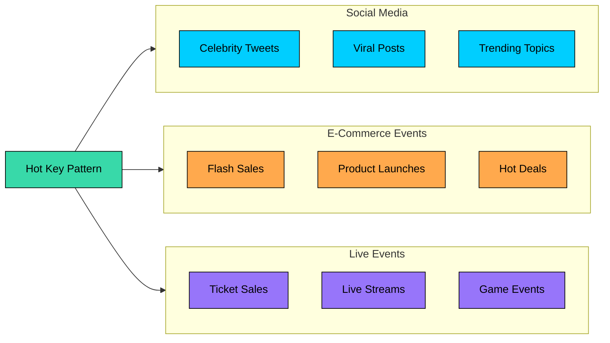

| Problem | Why Hot Key Handling Matters |
|---------|------------------------------|
| **Design Twitter** | Celebrity tweets can receive millions of requests per second on a single key |
| **Design Flash Sale System** | One product ID receives all the traffic during the sale |
| **Design Ticketmaster** | Single concert release hammers one inventory key |
| **Design Live Streaming** | Popular live stream metadata becomes a hot key |
| **Design Reddit/News** | Front page posts create hot keys for comments and votes |
| **Design Rate Limiter** | Global counters can become bottlenecks |

Understanding hot keys helps you answer the fundamental question: when your distributed system with 100 nodes is overwhelmed by traffic to a single key, how do you spread that load"

---

# 1. Understanding Hot Keys

### 1.1 What Makes a Key "Hot""

In a distributed system, data is spread across multiple nodes. A hash function determines which node stores which key, and in a well-designed system, this distribution is roughly uniform. Each node handles its fair share of the load, and you scale by adding more nodes.

A **hot key** breaks this assumption. It's a single key that receives a disproportionate amount of traffic, creating a load imbalance that no amount of horizontal scaling can fix.

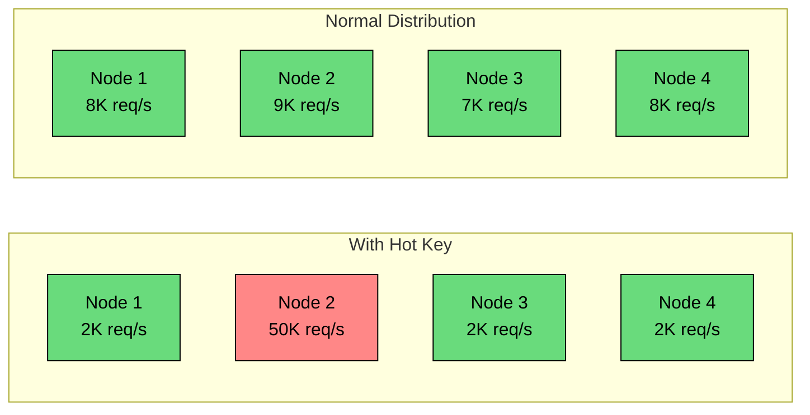

The math here is what makes hot keys so problematic. Imagine you have a cache cluster with 5 nodes, each capable of handling 10,000 requests per second. Your total capacity is 50,000 requests per second. Under normal conditions, load is distributed evenly, and you're comfortably within capacity.

Now a tweet goes viral. That single key, `tweet:12345`, suddenly receives 50,000 requests per second. But only one node stores that key. That node is now handling 5x its capacity while the other four nodes sit nearly idle. Your effective capacity hasn't increased at all since adding more nodes won't help. The bottleneck is the single key, and until you address that, you're stuck.

### 1.2 Why Hot Keys Are Dangerous

The danger of hot keys goes beyond simple overload. They trigger cascading failures that can take down your entire system.

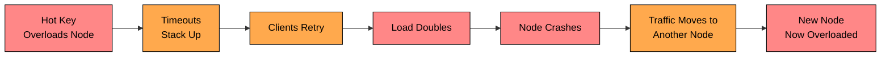

Here's how the cascade typically unfolds:

**Stage 1: Overload.** The hot key exceeds the node's capacity. Response times increase as the node struggles to keep up.

**Stage 2: Timeouts.** Clients start timing out. They assume the request failed and retry, which adds even more load to the already overwhelmed node.

**Stage 3: Collapse.** The node runs out of memory or connections and crashes. If you have failover configured, traffic moves to a replica or another node.

**Stage 4: Propagation.** The failover node now receives all the hot key traffic plus its normal traffic. It quickly becomes overloaded, and the cycle repeats.

What started as one overloaded node can cascade through your entire cluster. The irony is that your monitoring might show low average CPU across the cluster while one node is drowning and the rest are idle.

### 1.3 Where Hot Keys Occur

Hot keys can appear at any layer of your system where data is partitioned:

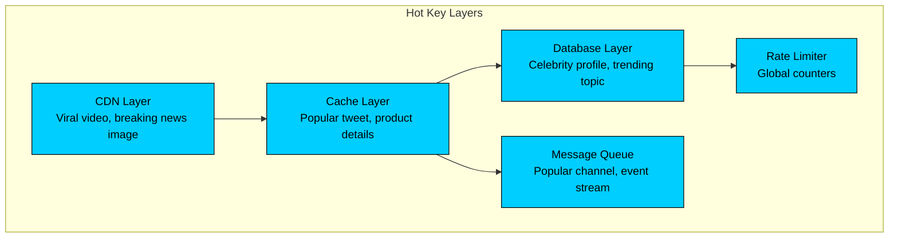

| Layer | Example Hot Key | What Happens |
|-------|-----------------|--------------|
| **CDN** | Viral video, breaking news | Edge cache overwhelmed, origin hammered |
| **Cache (Redis/Memcached)** | Celebrity tweet, flash sale product | Single cache node saturated |
| **Database** | Popular user profile, trending topic | Single shard overloaded |
| **Message Queue** | High-volume channel | Single partition backed up |
| **Rate Limiter** | Global request counter | Counter becomes bottleneck |

The cache layer is typically where hot keys cause the most immediate pain. Cache nodes have lower capacity than databases, so they saturate faster. But the pattern is the same at every layer: any time data is partitioned by key, you're vulnerable to hot keys.

### 1.4 Common Hot Key Scenarios

Some hot keys are predictable. Others strike without warning:

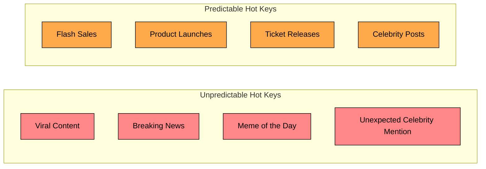

**Predictable hot keys** give you time to prepare. You know when the flash sale starts. You know when Taylor Swift is scheduled to post. You can pre-warm caches, allocate dedicated resources, and have your team on standby.

**Unpredictable hot keys** are harder. A random tweet goes viral. A news story breaks. A meme spreads across the internet. These require automatic detection and dynamic response.

The distinction matters because your solution strategy differs. For predictable hot keys, you can be proactive. For unpredictable ones, you need systems that detect and adapt in real-time.

---

# 2. Detecting Hot Keys

You can't fix what you can't see. Before you can handle a hot key, you need to know it exists.

### 2.1 Proactive Detection

The goal of proactive detection is to identify hot keys before they cause problems. This means monitoring access patterns continuously and alerting when something looks unusual.

**Monitor key access frequency:**

Most cache systems provide ways to track which keys are accessed most frequently. In Redis, the `MONITOR` command shows real-time access patterns:

**Use built-in hot key detection:**

Redis 4.0+ has a `--hotkeys` option that samples the keyspace and reports frequently accessed keys:

This is sampling-based, so it won't catch every hot key, but it's a good starting point for identifying the most obvious ones.

### 2.2 Reactive Detection

Reactive detection means identifying hot keys when they're actively causing problems. This is your safety net when proactive detection misses something.

**Watch for load imbalance:**

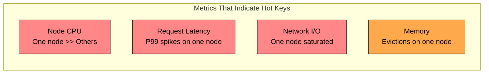

The key pattern is **imbalance**. If one node is at 80% CPU while others are at 10%, something is wrong. If P99 latency on one node is 10x higher than others, you likely have a hot key.

| Metric | Normal Pattern | Hot Key Pattern |
|--------|----------------|-----------------|
| Node CPU | All nodes similar (within 20%) | One node >> others |
| Request latency | Uniform across nodes | One node has high P99 |
| Network I/O | Evenly distributed | One node saturated |
| Cache evictions | Low across all nodes | High on one node |

**Set up alerts for imbalance:**

The alert should trigger investigation, not necessarily action. Sometimes load imbalance has other causes (like a misconfigured client). The next step is to identify the specific key causing the problem.

### 2.3 Predictive Detection

For scheduled events like flash sales or product launches, you can predict hot keys in advance and prepare for them.

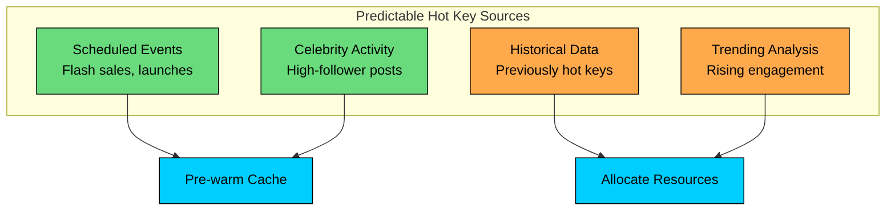

**Pre-warming strategy:**

The difference between a successful flash sale and an outage often comes down to this preparation work.

---

# 3. Solution Patterns

Now for the core of the article: how do you actually handle hot keys" There's no single solution that works for every case. Instead, you have a toolkit of patterns, each with different trade-offs.

### 3.1 Local Caching

The simplest and often most effective solution is to cache hot data in application server memory. Instead of every request hitting the distributed cache, most requests are served from local memory.

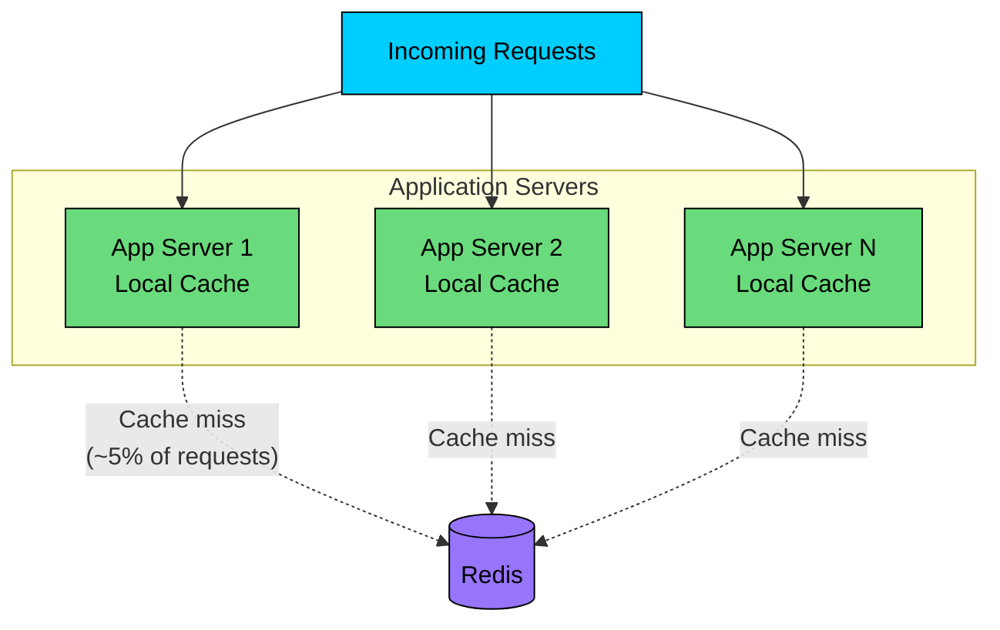

The key insight is that if you have 100 application servers, each with a local cache, you've spread the load across 100 caches instead of hitting one Redis node. Even with a short TTL of 5 seconds, you can reduce Redis calls by 90% or more.

**The trade-off is staleness.** With a 5-second TTL, data might be up to 5 seconds out of date. For a tweet's like count, this is usually fine. For an inventory count during a flash sale, it might not be.

| Pros | Cons |
|------|------|
| Dramatically reduces cache calls | Data can be stale |
| Sub-millisecond latency | Memory overhead per app server |
| No infrastructure changes needed | Inconsistent reads across servers |
| Scales with app server count | Requires TTL tuning |

**Best for:** Read-heavy hot keys where slight staleness is acceptable. Think tweets, product descriptions, user profiles, article content.

### 3.2 Key Replication

If staleness is unacceptable, you can replicate the hot key across multiple cache nodes and load-balance reads across them.

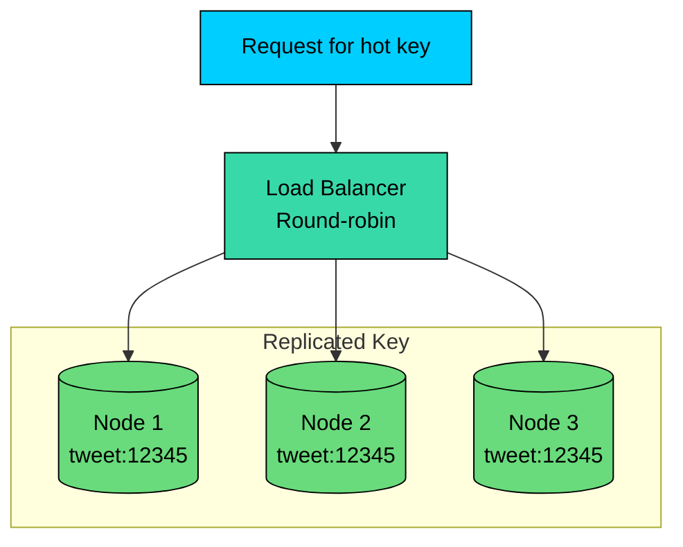

The implementation stores the same data under multiple keys, each hashing to a different node:

With 5 replicas, you've spread the read load across 5 nodes instead of 1. Your capacity for this key increases 5x.

**The trade-off is write amplification.** Every update must write to all replicas, and you must invalidate all of them on changes. This works well for read-heavy data that changes infrequently.

| Pros | Cons |
|------|------|
| Consistent data across reads | 5x storage for replicated keys |
| No application memory needed | Must update all replicas on write |
| Predictable scaling | Write amplification |
| Simple to understand | Complexity in key management |

**Best for:** Hot keys with high read-to-write ratios where consistency matters. Think user profiles, product details, configuration data.

### 3.3 Key Splitting (Sharded Counters)

For write-heavy hot keys like counters, the challenge is different. You can't just replicate because every write would need to update all replicas, creating the same bottleneck.

The solution is to split the key into multiple shards and aggregate on read:

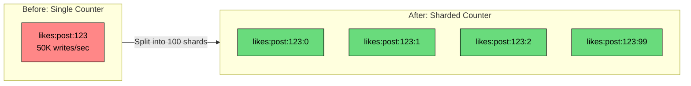

With 100 shards, your write capacity increases 100x. Each write goes to a random shard, spreading the load evenly across nodes.

**The trade-off is read complexity.** Getting the total requires reading 100 keys and summing them. For real-time display, you might cache the aggregated value with a short TTL rather than computing it on every read.

| Pros | Cons |
|------|------|
| Distributes write load evenly | Reads require aggregation |
| Scales linearly with shards | More complex client logic |
| Works for counters, sets, lists | Not suitable for atomic reads |
| No single bottleneck | Ordering may be lost |

**Best for:** Write-heavy counters, rate limiters, append-only data structures. Think like counts, view counts, rate limit counters.

### 3.4 Request Coalescing

When a cache key expires or is missing, multiple concurrent requests might all try to fetch and populate it simultaneously. This "thundering herd" or "cache stampede" can overwhelm your database.

Request coalescing ensures that only one request actually fetches the data; others wait and share the result:

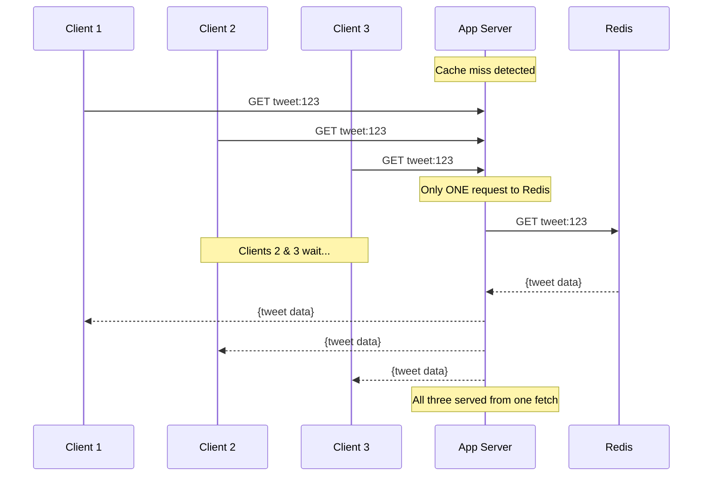

This pattern is sometimes called "singleflight" (after the Go package that popularized it):

**The trade-off is scope.** Request coalescing only helps with concurrent requests on the same server. It doesn't help with sustained load, and it doesn't coordinate across servers.

| Pros | Cons |
|------|------|
| Eliminates thundering herd | Only helps concurrent requests |
| No storage overhead | Single server only |
| Works transparently | Doesn't help sustained load |
| Great for cache misses | Adds coordination complexity |

**Best for:** Cache stampedes, cold cache warming, bursty traffic patterns.

### 3.5 Read-Through Cache with Locking

Building on request coalescing, you can use distributed locking to coordinate across servers. When the cache is empty, only one server acquires the lock and populates it; others wait or serve stale data.

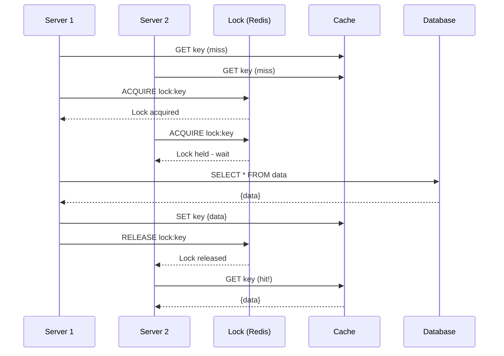

**The trade-off is latency.** Servers that don't acquire the lock must wait. You can mitigate this by serving stale data while refreshing in the background.

| Pros | Cons |
|------|------|
| Coordinates across servers | Waiters experience latency |
| Protects database from stampedes | Lock management complexity |
| Works with TTL-based caching | Potential for deadlock if careless |

**Best for:** Expensive database queries, cache refresh storms, coordinated cache warming.

### 3.6 Rate Limiting Per Key

Sometimes the best you can do is limit the damage. If a hot key is overwhelming your system, rate limiting ensures it doesn't take everything down.

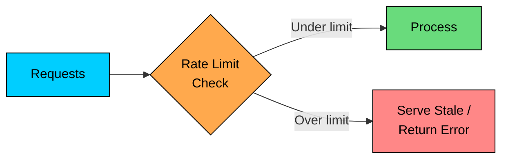

**The trade-off is user experience.** Some users won't get fresh data, or they'll see errors. But this beats taking down the entire system.

| Pros | Cons |
|------|------|
| Protects system from overload | Some users see errors or stale data |
| Simple to implement | Doesn't solve the underlying problem |
| Graceful degradation | Requires per-key tuning |

**Best for:** Last line of defense, combined with other strategies.

---

# 4. Choosing the Right Solution

Different hot key characteristics call for different solutions. Here's a decision framework:

```mermaid
flowchart TD
    Start[Hot Key Detected]:::primary --> RW{Read or Write<br/>Heavy"}

    RW -->|"Read Heavy"| Stale{Staleness<br/>Acceptable"}
    RW -->|"Write Heavy"| Type{Data Type"}
    RW -->|"Both"| Both[Combine:<br/>Split writes +<br/>Cache reads]:::orange

    Stale -->|"Yes"| LC[Local Cache<br/>5-30s TTL]:::green
    Stale -->|"No"| KR[Key Replication<br/>5+ replicas]:::green

    Type -->|"Counter"| KS[Key Splitting<br/>100 shards]:::green
    Type -->|"Other"| Async[Async Processing<br/>+ Batching]:::green

    Start --> Pattern{Traffic<br/>Pattern"}
    Pattern -->|"Bursty"| RC[Request Coalescing<br/>+ Locking]:::green
    Pattern -->|"Sustained"| Multi[Multiple Strategies<br/>+ Rate Limiting]:::orange
    Pattern -->|"Predictable"| PW[Pre-warming<br/>+ Dedicated Resources]:::green

    classDef primary fill:#00ceff,stroke:#000,color:#000
    classDef green fill:#69db7c,stroke:#000,color:#000
    classDef orange fill:#ffa94d,stroke:#000,color:#000
```

**Quick reference:**

| Scenario | Primary Solution | Secondary Solution |
|----------|------------------|-------------------|
| Viral tweet (read-heavy, staleness OK) | Local cache | Key replication |
| Flash sale inventory (write-heavy counter) | Key splitting | Approximate counting |
| Live score updates (read + write) | Local cache + write-behind | Key replication |
| Cache stampede (bursty) | Request coalescing | Locking |
| Celebrity profile (read-heavy, fresh) | Key replication | CDN caching |
| Rate limiter counter | Key splitting | Sliding window |

---

# 5. Combining Strategies

In production, you rarely use just one strategy. Instead, you build layers of defense:

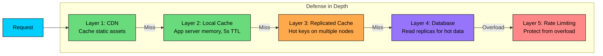

**Example: Complete viral tweet handling:**

Each layer reduces the load on the next. By the time requests reach the database, they're a tiny fraction of the original traffic.

---

# 6. Key Takeaways

1. **Hot keys break horizontal scaling.** Even with 100 nodes, one hot key means one node does all the work. Adding more nodes doesn't help.
2. **Detection is essential.** You can't fix what you can't see. Monitor for load imbalance across nodes and track top accessed keys.
3. **Local caching is your first defense.** A 5-second TTL in app server memory can eliminate 90%+ of cache calls for hot keys.
4. **Key replication spreads read load.** Store the same data on multiple nodes and load-balance reads across them.
5. **Key splitting handles write-heavy hot keys.** Shard counters across multiple keys and aggregate on read.
6. **Request coalescing prevents stampedes.** When many requests arrive simultaneously, only execute one fetch and share the result.
7. **Layer your defenses.** Production systems use CDN + local cache + replicated cache + rate limiting together.
8. **Plan for predictable hot keys.** Flash sales and product launches can be pre-warmed with dedicated resources ready.

---

# References

- [Scaling Memcache at Facebook](https://www.usenix.org/system/files/conference/nsdi13/nsdi13-final170_update.pdf) - How Facebook handles hot keys in their cache layer
- [Twitter's Timelines at Scale](https://www.infoq.com/presentations/Twitter-Timeline-Scalability/) - Handling celebrity tweets and viral content
- [Amazon DynamoDB Adaptive Capacity](https://docs.aws.amazon.com/amazondynamodb/latest/developerguide/bp-partition-key-design.html) - Hot partition handling in DynamoDB
- [Redis Hot Keys Detection](https://redis.io/docs/management/optimization/memory-optimization/) - Built-in tools for finding hot keys
- [Singleflight Pattern in Go](https://pkg.go.dev/golang.org/x/sync/singleflight) - Request coalescing implementation
- [Discord: How Discord Stores Billions of Messages](https://discord.com/blog/how-discord-stores-billions-of-messages) - Handling hot channels through bucketing

---

# Quiz
