Your e-commerce platform handles 1,000 requests per second on a normal day. Then Black Friday hits, and suddenly you're getting 50,000 requests per second. Servers crash, the database melts down, and thousands of customers see error pages instead of the deals they came for.

This is the challenge of **traffic spikes**, and it's one of the most common ways production systems fail.

What makes traffic spikes particularly treacherous is that they expose every weakness in your architecture simultaneously. That database query that takes 50ms under normal load" It takes 5 seconds when the connection pool is exhausted. That service that gracefully handles 1,000 concurrent users" It falls over at 10,000. The system that passed all your load tests" It crumbles under real-world traffic patterns you never anticipated.

In this chapter, we'll explore why traffic spikes are so dangerous, the complete toolkit for handling them, and how to combine strategies into a resilient architecture.

---

# Where This Pattern Shows Up

> [!PAYWALL] This content is for premium members only.

Traffic spike handling is critical for any system with predictable or unpredictable bursts:

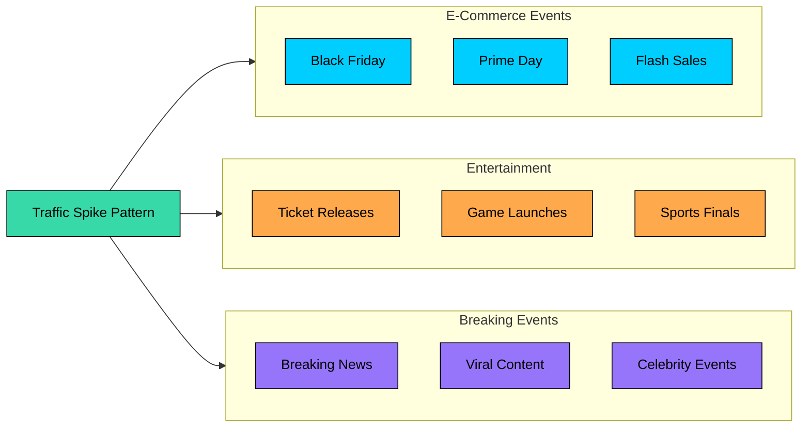

| Problem | Why Traffic Spike Handling Matters |
|---------|-----------------------------------|
| **Design Flash Sale System** | Millions try to buy at the exact same second |
| **Design Ticketmaster** | Concert ticket releases create 100x normal traffic instantly |
| **Design Twitter** | Viral tweets and trending topics cause sudden load surges |
| **Design Live Sports Streaming** | Game day traffic is 50x higher than normal |
| **Design E-commerce Platform** | Holiday shopping events can overwhelm unprepared systems |
| **Design News Website** | Breaking news brings traffic from zero to millions in minutes |

---

# 1. Understanding Traffic Spikes

Before diving into solutions, it helps to understand the different types of spikes you'll face. Each type requires a different response strategy.

### 1.1 The Three Types of Spikes

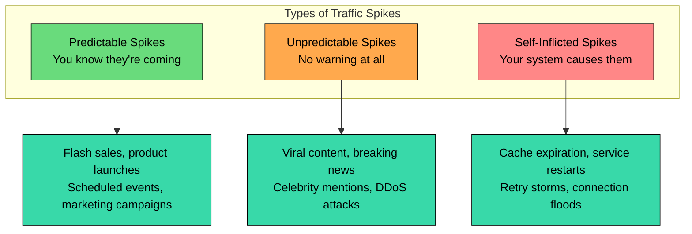

**Predictable spikes** are the easiest to handle because you have time to prepare. You know Black Friday is coming. You know when the new iPhone launches. You know when the Super Bowl ad airs. With advance warning, you can scale infrastructure, warm caches, and have your team on standby.

| Event | Example | Spike Pattern |
|-------|---------|---------------|
| Flash sales | Black Friday, Prime Day | Massive spike at sale start, then sustained high load |
| Product launches | iPhone release, game launches | High sustained load for hours or days |
| Scheduled content | TV show finale, sports finals | Spike around broadcast time |
| Marketing campaigns | Super Bowl ads, influencer posts | Spike 30-60 minutes after promotion |

**Unpredictable spikes** are harder because you have no preparation time. A tweet goes viral. A news story breaks. A celebrity mentions your product. By the time you notice, your system is already under stress.

| Event | Example | Challenge |
|-------|---------|-----------|
| Viral content | Tweet goes viral, Reddit front page | No warning, must react in real-time |
| Breaking news | Major event, celebrity news | Instant massive load |
| External mentions | Hacker News, TV mention | Traffic from unexpected source |
| DDoS attacks | Malicious traffic flood | Distinguishing real vs fake traffic |

**Self-inflicted spikes** are the most frustrating because your own system causes them. These are the "thundering herd" problems that catch even experienced engineers off guard.

| Trigger | What Happens |
|---------|--------------|
| Cache expiration | All clients miss cache simultaneously, database overwhelmed |
| Service restart | All connections reconnect at once, connection storm |
| Error recovery | All clients retry at the same moment, retry storm |
| Cron job overlap | Multiple scheduled jobs compete for resources |

Understanding which type of spike you're facing determines your response. Predictable spikes can be addressed proactively. Unpredictable spikes require automatic detection and response. Self-inflicted spikes require fixing the root cause in your architecture.

### 1.2 Anatomy of a Spike

Traffic spikes don't just appear and disappear. They follow a lifecycle, and each phase presents different challenges:

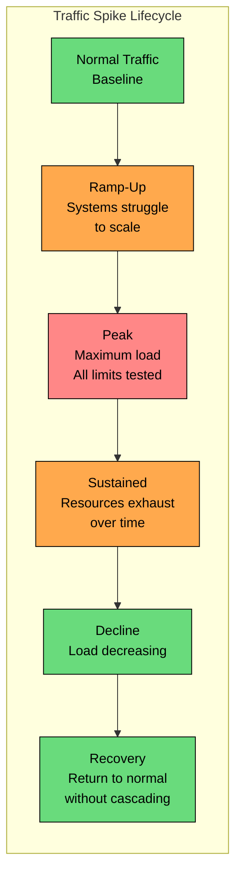

**Ramp-up** is when traffic starts increasing but auto-scaling hasn't caught up. This is the danger zone where new servers are launching but not yet ready.

**Peak** is maximum load. Every component is at its limit. If you've sized correctly, you survive. If not, things start failing.

**Sustained** is the phase that often catches people by surprise. You survived the peak, but now you're running at high load for hours. Thread pools exhaust. Memory slowly leaks. Connection limits hit. This is where "death by a thousand cuts" happens.

**Recovery** seems like it should be easy, but it's not. As traffic drops, you might have backed-up queues to drain, corrupted caches to rebuild, or overwhelmed databases that need time to catch up. Scaling down too fast can cause its own problems.

### 1.3 Why Spikes Are Dangerous

A system that handles 10,000 requests per second might completely fail at 15,000. Why isn't it just 50% slower" The answer lies in how systems behave under overload.

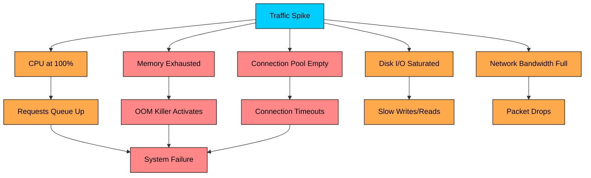

**Every component has limits.** When any limit is exceeded, the system doesn't degrade gracefully, it cliff dives. CPU at 100% means requests queue up. Memory exhausted means the OOM killer starts terminating processes. Connection pool empty means new requests fail immediately.

**Failures cascade.** When one component fails, it takes others with it:

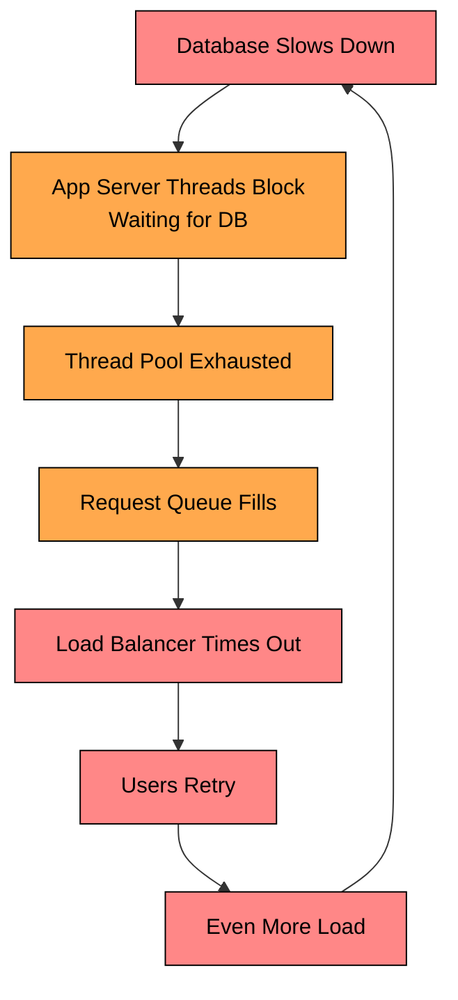

This death spiral is why a small overload can lead to total system failure. The database slows down, causing app servers to wait, causing timeouts, causing retries, causing more load, making the database even slower. Each failure makes the next one more likely.

**The math of overload is brutal.** If your system can handle 10,000 requests per second and you're receiving 15,000, you're not just 50% overloaded. Those extra 5,000 requests per second are accumulating as a backlog. After one minute, you have 300,000 queued requests. After five minutes, 1.5 million. Your system will never catch up.

---

# 2. Strategy 1: Auto-Scaling

Auto-scaling automatically adds or removes resources based on demand. It's the foundation of handling variable load, but it's not a complete solution on its own.

### 2.1 How Auto-Scaling Works

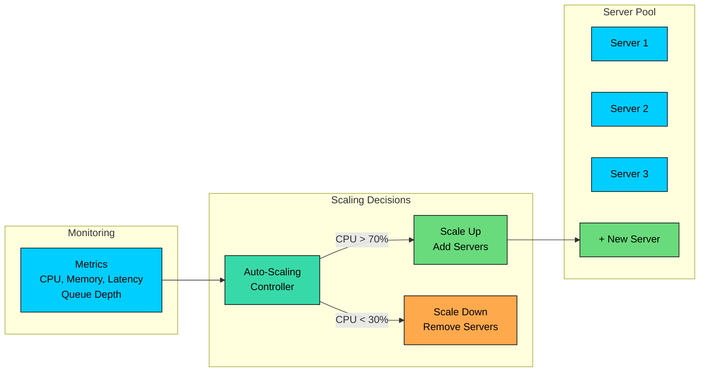

The auto-scaler watches metrics like CPU utilization, memory usage, request latency, or queue depth. When metrics exceed thresholds, it launches new instances. When load decreases, it terminates instances to save costs.

### 2.2 Scaling Policies

Different policies work for different scenarios:

| Policy | How It Works | Best For |
|--------|--------------|----------|
| **Target tracking** | Maintain CPU at 70% | General purpose, steady growth |
| **Step scaling** | Add 2 servers when CPU > 80%, add 5 when > 90% | Variable spike sizes |
| **Scheduled scaling** | Add capacity at 9 AM, remove at 6 PM | Known daily patterns |
| **Predictive scaling** | ML forecasts future load based on history | Gradual, repeating patterns |

For traffic spikes, **step scaling** is often most useful. You want aggressive scaling when load increases rapidly, with multiple thresholds triggering increasingly aggressive responses.

### 2.3 The Fundamental Problem: Scaling Lag

Here's why auto-scaling alone isn't sufficient:

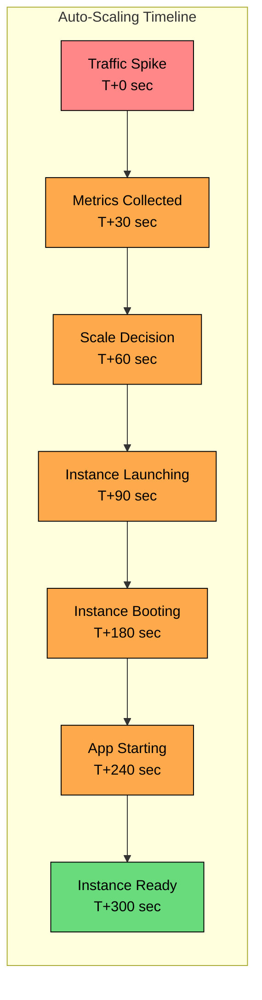

From traffic spike to new server ready: **3-7 minutes**. During that window, your existing servers must handle all the load. If the spike exceeds their capacity, they fail before new servers arrive.

Auto-scaling is essential, but think of it as your second line of defense. You need other strategies to survive the gap between when the spike hits and when new capacity comes online.

| Pros | Cons |
|------|------|
| Automatic, no manual intervention | Slow to react (minutes, not seconds) |
| Cost-efficient (pay for what you use) | Cold start adds latency to first requests |
| Handles gradual growth well | Doesn't help with instant spikes |
| Scales down when load decreases | Can't scale faster than instance launch time |

---

# 3. Strategy 2: Load Shedding

When your system is overwhelmed, you have a choice: try to serve everyone poorly, or serve some people well and reject the rest. Load shedding chooses the latter.

The insight is simple: a failed request that returns quickly is better than a request that hangs for 30 seconds before timing out. At least the fast failure lets the client retry or show an error message. The slow timeout ties up resources and provides a terrible user experience.

### 3.1 How Load Shedding Works

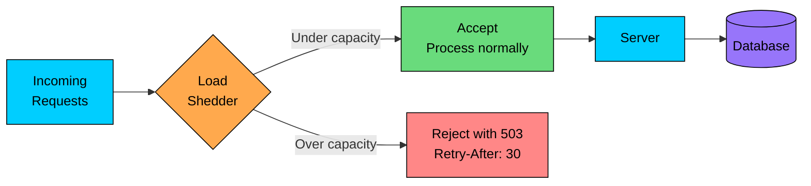

When the system detects it's approaching overload (high CPU, growing queue, increasing latency), it starts rejecting requests at the edge. The key is rejecting early, before the request consumes significant resources, and returning a 503 with a Retry-After header so clients know when to come back.

### 3.2 Priority-Based Shedding

Not all requests are equal. A payment completion is worth more than a recommendation request. Priority-based shedding ensures you protect what matters most:

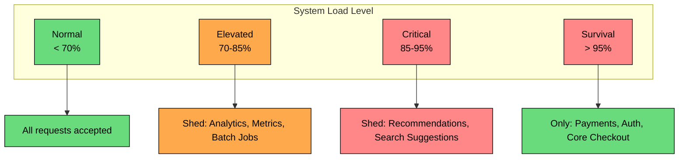

| Priority | Examples | Shed When |
|----------|----------|-----------|
| **P0: Critical** | Payments, authentication, checkout completion | Never (or only at extreme survival mode) |
| **P1: Important** | Search, product pages, cart operations | > 95% load |
| **P2: Enhancement** | Recommendations, reviews, personalization | > 85% load |
| **P3: Background** | Analytics, metrics collection, batch jobs | > 70% load |

The key is deciding these priorities before the crisis, not during it. Document which endpoints are which priority, and implement the shedding logic in advance.

### 3.3 Implementing Load Shedding

Several approaches work:

**Queue-based:** When the request queue exceeds a threshold, reject new requests. Simple but effective.

**Latency-based:** When response time exceeds a threshold (e.g., P99 > 500ms), start shedding. This is more responsive to actual system health.

**Adaptive:** Continuously adjust the accept rate based on current capacity. Start shedding when you see early signs of overload, increase shedding as load increases.

| Pros | Cons |
|------|------|
| Instant protection | Some users see errors |
| Prevents cascading failures | Needs careful priority tuning |
| Protects critical functions | Can cause retry storms if clients aren't well-behaved |
| Simple to implement | Must be tested under real load conditions |

---

# 4. Strategy 3: Rate Limiting

While load shedding protects the system from total overload, rate limiting ensures fair access. It prevents any single client from consuming more than their share of resources.

### 4.1 The Difference from Load Shedding

Load shedding says: "The system is overloaded, reject excess requests." Rate limiting says: "This client is sending too many requests, throttle them specifically."

Both are important, but they serve different purposes. Rate limiting prevents abuse and ensures fairness even under normal load. Load shedding is the emergency brake when total load exceeds capacity.

### 4.2 How Rate Limiting Works

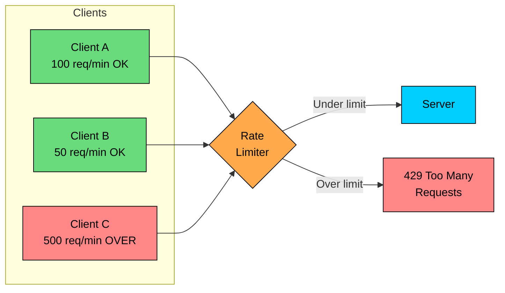

### 4.3 Rate Limiting Algorithms

The choice of algorithm affects how strictly limits are enforced:

| Algorithm | How It Works | Behavior |
|-----------|--------------|----------|
| **Token Bucket** | Tokens refill steadily; each request consumes a token | Allows short bursts up to bucket size |
| **Leaky Bucket** | Requests drain at constant rate; excess is queued or rejected | Smooth, constant output rate |
| **Fixed Window** | Count requests in fixed time intervals (e.g., per minute) | Simple but allows 2x at window boundary |
| **Sliding Window** | Rolling count over sliding time period | Accurate but more memory/compute |

**Token bucket** is the most common choice because it allows legitimate bursts. If a user is inactive for a minute, they've accumulated tokens for a brief spike of activity. This matches real usage patterns better than strict constant-rate limiting.

### 4.4 Where to Apply Limits

Layer your rate limits for defense in depth:

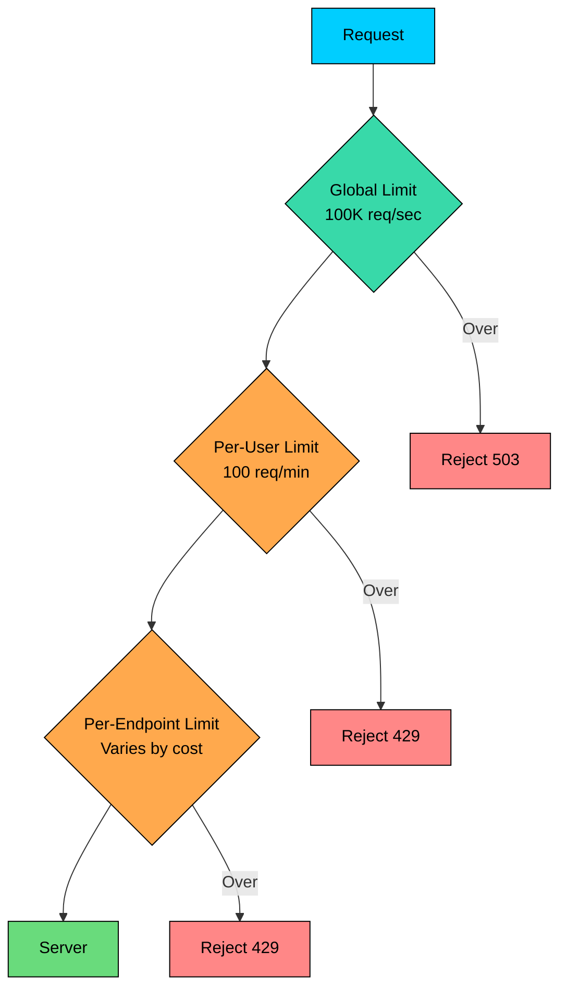

| Level | Purpose | Example |
|-------|---------|---------|
| **Global** | Protect infrastructure | 100,000 requests/second total |
| **Per-user** | Prevent abuse, ensure fairness | 100 requests/minute per user |
| **Per-IP** | Block scrapers, bots | 1,000 requests/minute per IP |
| **Per-endpoint** | Protect expensive operations | 10 search queries/minute |
| **Per-API-key** | Enable tiered pricing | Different limits for different plans |

### 4.5 Client Communication

Always return helpful headers so clients can self-regulate:

Clients that respect these headers will back off automatically, reducing load on your system.

| Pros | Cons |
|------|------|
| Fair access for all clients | Doesn't help when ALL users spike at once |
| Prevents abuse and scrapers | Needs distributed state for consistency |
| Enables tiered pricing models | Can frustrate legitimate power users |
| Works even under normal load | Doesn't protect against flash crowds |

---

# 5. Strategy 4: Caching

Caching is your highest-leverage defense against traffic spikes. A well-designed cache can absorb 99% of read traffic, reducing your backend load from 100,000 requests per second to 1,000. Under a spike, the cache is often the difference between survival and failure.

### 5.1 The Cache Hierarchy

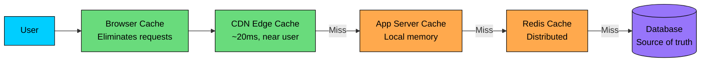

Each layer reduces load on the layer behind it:

| Layer | What to Cache | TTL | Impact |
|-------|---------------|-----|--------|
| **Browser** | Static assets, some API responses | Hours to days | Eliminates requests entirely |
| **CDN** | Images, videos, static pages, API responses | Minutes to hours | Handles 80-95% of static traffic |
| **Application** | Session data, computed values | Seconds to minutes | Reduces compute and cache calls |
| **Redis/Memcached** | Database query results | Seconds to hours | Protects database |

### 5.2 Cache Warming for Predictable Spikes

For predictable events like flash sales, don't wait for the spike to hit a cold cache. Warm it in advance:

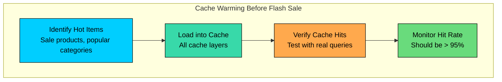

### 5.3 Preventing Cache Stampede

The most dangerous moment for a cache is when a popular entry expires. Suddenly, thousands of requests that were hitting the cache all miss simultaneously and hit the database:

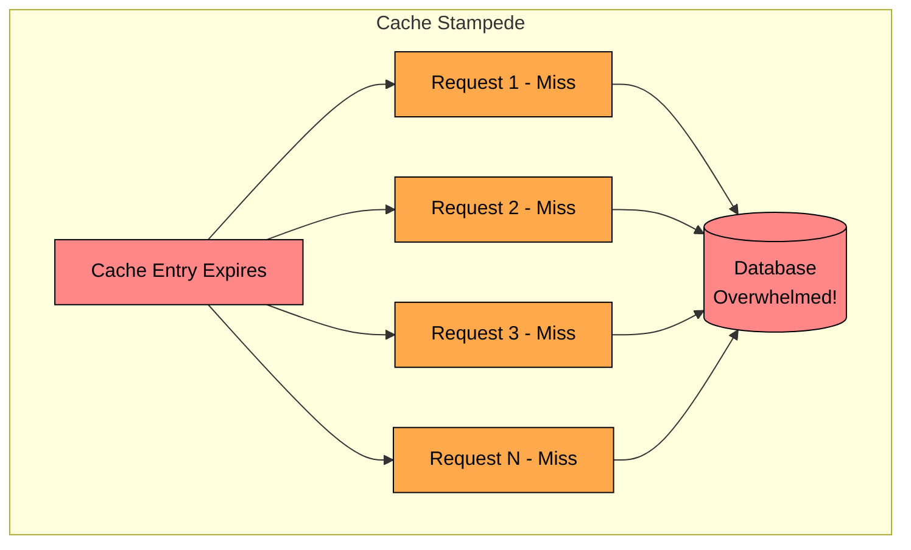

#### **Solutions:**

**Staggered TTLs:** Instead of all cache entries expiring at exactly 300 seconds, use 300 +/- random(30). Entries expire gradually rather than all at once.

**Background refresh:** Refresh cache entries before they expire. If TTL is 300 seconds, start refreshing at 270 seconds. The old value serves traffic while the new value loads.

**Distributed locking:** When cache misses, only one request fetches from the database. Others wait for that request to populate the cache.

| Pros | Cons |
|------|------|
| Massive throughput increase | Risk of serving stale data |
| Microsecond latency | Cache invalidation is complex |
| Protects database from spikes | Cold cache after restart is dangerous |
| Scales to millions of requests/second | Requires careful TTL management |

---

# 6. Strategy 5: Queue-Based Load Leveling

For write-heavy operations, caching doesn't help. You can't cache a purchase or an order submission. Instead, you can use queues to absorb spikes and process work at a sustainable rate.

### 6.1 How Queue-Based Leveling Works

The key insight is separating "accepting work" from "doing work." Your API accepts requests quickly and puts them on a queue. Workers process the queue at whatever rate the database can handle. The queue absorbs the difference.

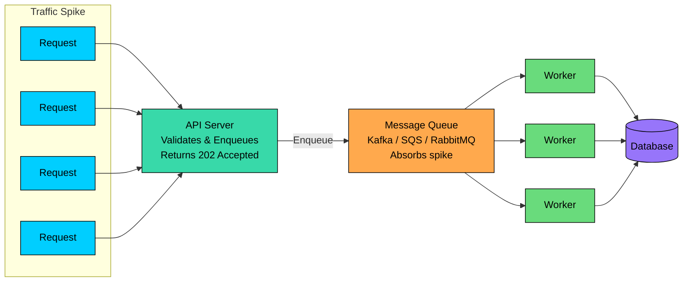

**The flow:**

1. Request arrives at API server
2. API validates the request (fast, stateless)
3. API enqueues the request and returns 202 Accepted
4. Client can check status via polling or receives notification when done
5. Workers process the queue at a sustainable rate
6. Database never sees the spike directly

### 6.2 Queue Configuration

| Strategy | How It Works | Use Case |
|----------|--------------|----------|
| **FIFO** | First in, first out | Fair processing, most common |
| **Priority queue** | VIP requests processed first | Tiered service levels |
| **Delay queue** | Process after specified delay | Rate limiting, scheduled tasks |
| **Dead letter queue** | Failed messages go here | Error handling, debugging |

### 6.3 Backpressure

Queues aren't infinite. When the queue fills up, you need backpressure to slow down producers:

```mermaid
flowchart TD
    Q{Queue Depth"}:::primary

    Q --> |"< 50% capacity"| A[Accept normally]:::green
    Q --> |"50-80% capacity"| W[Accept + Alert ops team]:::orange
    Q --> |"80-95% capacity"| S[Slow down acceptance<br/>Add delays]:::orange
    Q --> |"> 95% capacity"| R[Reject with 503<br/>Retry-After header]:::red

    classDef primary fill:#00ceff,stroke:#000,color:#000
    classDef green fill:#69db7c,stroke:#000,color:#000
    classDef orange fill:#ffa94d,stroke:#000,color:#000
    classDef red fill:#ff8787,stroke:#000,color:#000
```

The key is monitoring queue depth and responding before it overflows. When the queue reaches 80% capacity, you should already be scaling up workers. When it reaches 95%, you should start rejecting new requests.

### 6.4 Best Use Cases

Queue-based leveling works well for:

- Order processing and fulfillment
- Email and notification sending
- Report generation and exports
- Data imports and bulk operations
- Any operation where immediate response isn't critical

It doesn't work well for:

- Real-time queries (search, recommendations)
- Interactive operations requiring immediate response
- Low-latency requirements

| Pros | Cons |
|------|------|
| Absorbs spikes naturally | Responses are asynchronous |
| Workers process at steady, sustainable rate | Added infrastructure complexity |
| Queue persists work if workers crash | Must monitor queue depth |
| Easy to scale workers independently | Message ordering can be tricky |

---

# 7. Strategy 6: Graceful Degradation

When load exceeds all your defenses, graceful degradation ensures you fail partially rather than completely. The core principle: it's better to serve a degraded experience than no experience at all.

### 7.1 Feature Priority Matrix

Before a crisis, decide which features can be disabled under load:

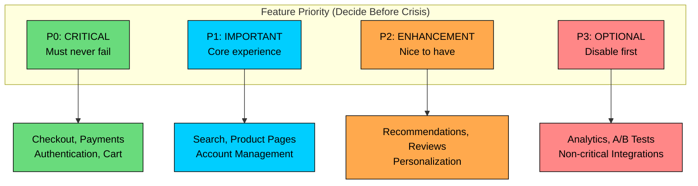

### 7.2 Degradation Levels

Configure your system to automatically degrade based on load:

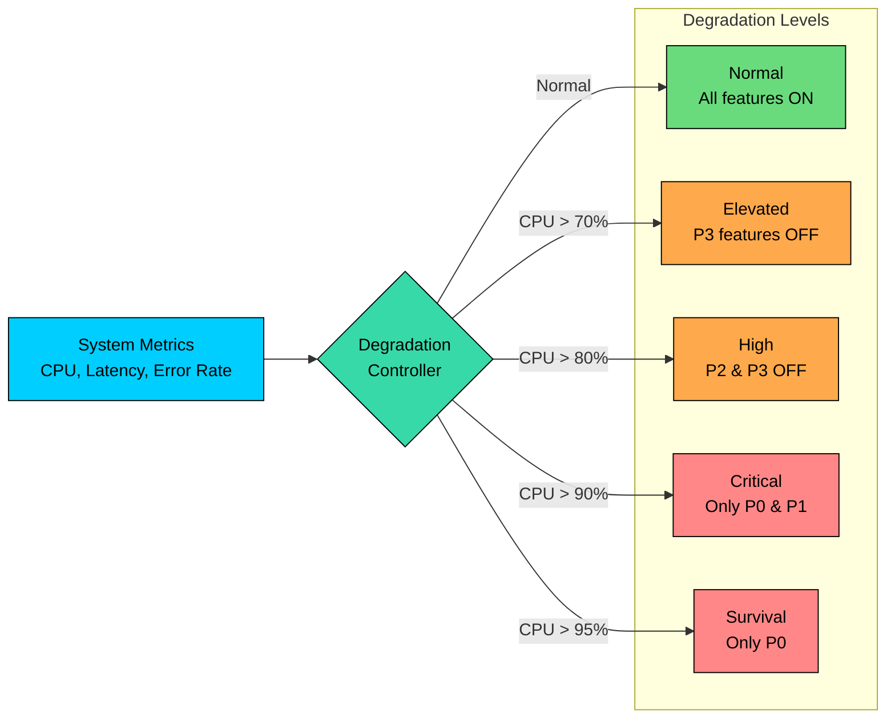

| Load Level | What Happens | User Experience |
|------------|--------------|-----------------|
| **Normal** | All features enabled | Full experience |
| **Elevated** | Disable analytics, metrics, A/B tests | Invisible to users |
| **High** | Disable recommendations, personalization | Slightly generic experience |
| **Critical** | Static pages where possible, simplified search | Functional but basic |
| **Survival** | Only checkout, payments, authentication | Bare minimum |

### 7.3 Implementation Patterns

**Feature flags:** Use a feature flag system to disable features quickly. During a crisis, flip flags rather than deploying code.

**Static fallbacks:** Pre-generate static versions of key pages. When dynamic generation is too expensive, serve static versions from CDN.

**Timeouts with fallbacks:** When a service doesn't respond quickly, return a degraded response rather than waiting or failing.

| Pros | Cons |
|------|------|
| Partial service beats complete failure | Some features unavailable |
| Protects critical functionality | Many code paths to test |
| Automatic recovery when load drops | Users may be confused by missing features |
| Buys time for scaling to catch up | Requires upfront planning |

---

# 8. Strategy 7: Database Protection

The database is often the bottleneck during traffic spikes. Unlike stateless app servers, you can't just spin up more databases in minutes. Protect it aggressively.

### 8.1 Connection Pooling

Every database connection consumes memory and resources. Under high load, connection exhaustion is a common failure mode.

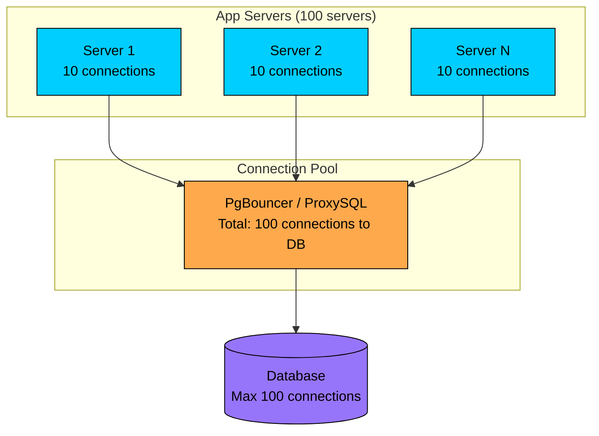

Without pooling, 100 app servers with 10 connections each would open 1,000 database connections. With a connection pooler like PgBouncer, you can multiplex those 1,000 logical connections onto 100 actual database connections.

### 8.2 Read Replicas

Separate read traffic from write traffic. Writes go to the primary; reads go to replicas:

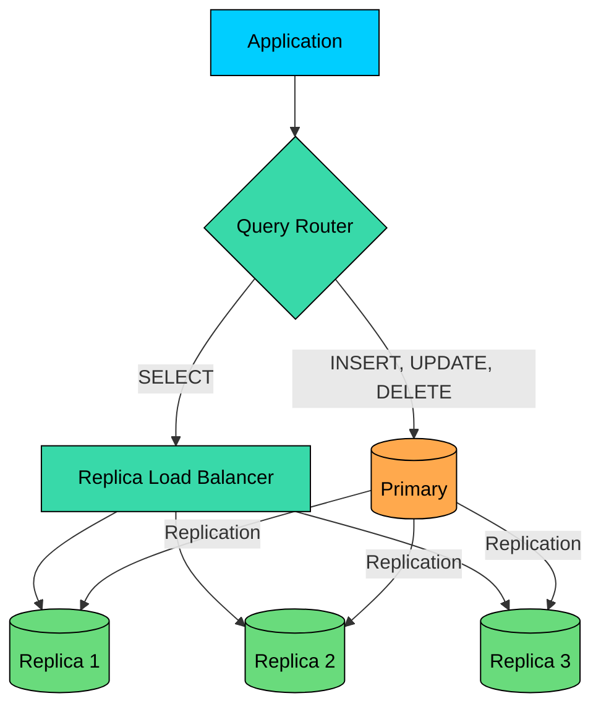

With three read replicas, you've quadrupled your read capacity. Under a traffic spike, this might be the difference between survival and database meltdown.

### 8.3 Circuit Breakers

When the database is struggling, hammering it with more requests makes things worse. A circuit breaker stops the bleeding:

```mermaid
flowchart LR
    C[Closed<br/>Normal operation]:::green --> |"5 failures in 10s"| O[Open<br/>Reject all DB calls<br/>Serve cached/fallback]:::red
    O --> |"30s cooldown"| HO[Half-Open<br/>Try one request]:::orange
    HO --> |"Success"| C
    HO --> |"Failure"| O

    classDef green fill:#69db7c,stroke:#000,color:#000
    classDef red fill:#ff8787,stroke:#000,color:#000
    classDef orange fill:#ffa94d,stroke:#000,color:#000
```

When the circuit is open, requests immediately return cached data or a fallback response. This gives the database time to recover without additional load.

### 8.4 Query Timeouts

Long-running queries during a spike consume connections and resources. Set aggressive timeouts:

---

# 9. Strategy 8: Pre-Warming and Capacity Planning

For predictable spikes, preparation is your best weapon. You know when Black Friday is. You know when the product launches. Use that knowledge.

#### 9.1 Capacity Estimation

Calculate what you need with a safety buffer:

### 9.2 Pre-Warming Checklist

```mermaid
flowchart TD
    subgraph prep["Preparation Timeline"]
        D7[Day -7<br/>Capacity planning complete]:::primary
        D3[Day -3<br/>Infrastructure scaled]:::secondary
        D1[Day -1<br/>Caches warmed]:::orange
        H2[Hour -2<br/>Team assembled]:::orange
        H0[Event Start<br/>Monitor & respond]:::green
    end

    D7 --> D3 --> D1 --> H2 --> H0

    classDef primary fill:#00ceff,stroke:#000,color:#000
    classDef secondary fill:#38d9a9,stroke:#000,color:#000
    classDef orange fill:#ffa94d,stroke:#000,color:#000
    classDef green fill:#69db7c,stroke:#000,color:#000
```

**Day -7: Capacity planning**

- Calculate expected peak traffic
- Determine required resources
- Order additional capacity if needed
- Plan for worst-case scenarios

**Day -3: Infrastructure**

- Scale up app servers
- Add database read replicas
- Increase cache cluster size
- Verify auto-scaling configuration

**Day -1: Warming**

- Pre-populate caches with hot data
- Prime CDN with static content
- Run load tests at expected peak
- Prepare static fallback pages

**Hour -2: Team**

- Assemble war room (virtual or physical)
- Review escalation procedures
- Verify monitoring dashboards
- Test communication channels

**Event start: Execute**

- Monitor dashboards continuously
- Have feature flags ready to toggle
- Scale up further if needed
- Document issues for post-mortem

### 9.3 Scheduled Scaling

Don't rely on auto-scaling for predictable events. Scale proactively:

| Time | Action |
|------|--------|
| Event - 2 hours | Scale to 10x normal capacity |
| Event start | Maintain high capacity |
| Event + 1 hour | Monitor, scale further if needed |
| Event + 4 hours | Begin gradual scale-down |
| Event + 24 hours | Return to normal if load permits |

This avoids the auto-scaling lag entirely. When the spike hits, capacity is already there waiting.

---

# 10. Key Takeaways

1. **Traffic spikes expose every weakness.** Systems that work fine under normal load can completely fail under spikes. Design for your worst day, not your average day.
2. **Auto-scaling is necessary but not sufficient.** The minutes it takes to scale can be fatal. You need other strategies to survive the gap.
3. **Load shedding saves the system.** It's better to serve some users well than all users poorly. Reject excess load to protect what you can serve.
4. **Rate limiting ensures fairness.** Prevent any single client from consuming more than their share of resources.
5. **Caching is your highest-leverage defense.** A well-warmed cache can absorb 99% of read traffic. Under spikes, the cache is often the difference between survival and failure.
6. **Queues level write load.** For writes, separate accepting work from doing work. The queue absorbs spikes.
7. **Degrade gracefully.** When all else fails, disable non-critical features to protect core functionality.
8. **Protect your database.** Connection pooling, read replicas, circuit breakers, and query timeouts keep the database alive.
9. **Prepare for predictable spikes.** If you know when the spike is coming, scale in advance, warm caches, and have your team ready.
10. **Layer your defenses.** No single strategy handles everything. Use CDN + caching + rate limiting + load shedding + graceful degradation together.

---

# References

- [AWS Auto Scaling Documentation](https://docs.aws.amazon.com/autoscaling/) - Configuring auto-scaling policies
- [Google SRE Book - Handling Overload](https://sre.google/sre-book/handling-overload/) - Load shedding and graceful degradation
- [Netflix Tech Blog](https://netflixtechblog.com/) - Performance engineering at scale
- [Martin Fowler - Circuit Breaker](https://martinfowler.com/bliki/CircuitBreaker.html) - Circuit breaker pattern
- [Designing Data-Intensive Applications](https://dataintensive.net/) by Martin Kleppmann - Comprehensive coverage of distributed systems

---

# Quiz
