A user tries to upload a 2 GB video file. After 45 minutes at 80% progress, their connection drops. They have to start over from scratch.

Meanwhile, your server is struggling. Memory usage spikes as it tries to buffer the entire file. The request times out. Other users experience slowdowns because one large upload is hogging resources.

This is the reality of naive file handling. And it gets worse at scale.

Every major platform, from Dropbox to YouTube to Google Drive, has had to solve this problem. The good news is that the solutions are well-established patterns that you can apply to any system that handles files larger than a few megabytes.

In this chapter, we will walk through these patterns step by step. We will start with understanding why simple approaches break down, then build up to production-grade solutions for both uploads and downloads.

---

# Where This Pattern Shows Up

Large file handling is essential for any system that deals with media, documents, or data transfers:

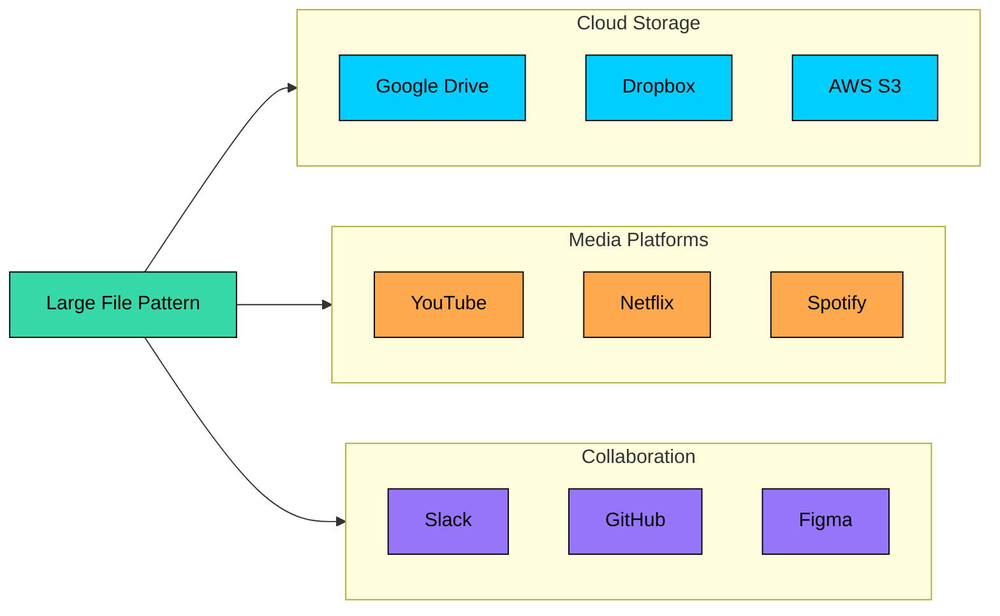

| Problem | Why Large File Handling Matters |
|---------|--------------------------------|
| **Design Google Drive/Dropbox** | Users upload multi-GB files that need chunking, resume, and sync |
| **Design YouTube** | Video uploads can be hours long, requiring resumable uploads and transcoding |
| **Design Slack/Teams** | File sharing in chat requires efficient upload and CDN distribution |
| **Design GitHub** | Large repos with binary assets need efficient storage and cloning |
| **Design Backup System** | Terabytes of data require incremental uploads and deduplication |
| **Design Netflix** | Streaming large video files needs range requests and adaptive bitrate |

---

# The Problem with Naive File Handling

> [!PAYWALL] This content is for premium members only.

The simplest approach to file uploads is accepting the entire file in a single HTTP request. The client opens a connection, streams all the bytes, and waits for a response. It works fine for small files. But as file sizes grow, this approach falls apart in several ways.

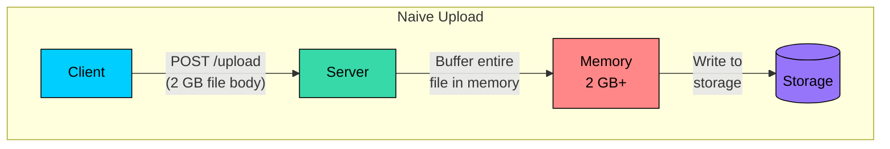

**Memory exhaustion.** If the server buffers the entire file in memory before writing to disk, a 2 GB upload requires 2 GB of RAM. With 100 concurrent uploads, you need 200 GB of RAM just for buffering. This is not sustainable.

**Timeout failures.** Large uploads take time. A 2 GB file on a 10 Mbps connection takes about 27 minutes. HTTP timeouts, load balancer limits, and proxy configurations often kill these long-running requests before they complete.

**No resume capability.** If the connection drops at 99%, the user must restart from 0%. This wastes bandwidth, frustrates users, and puts unnecessary load on your infrastructure. On mobile networks where connections are unstable, this becomes a serious problem.

**Single point of failure.** The request goes through your application server. If that server restarts during the upload, the entire upload is lost. In a microservices environment with frequent deployments, this happens more often than you might expect.

**Resource blocking.** While handling a large upload, server resources like threads, connections, and CPU cycles are occupied. This limits concurrency and can affect other users who are just trying to load a webpage.

The diagram below illustrates what happens when a naive upload fails midway:

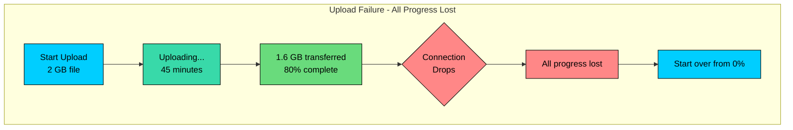

The fundamental problem is treating a large file as a single atomic operation. The solution is to break it into smaller, independent pieces that can be uploaded, verified, and resumed individually.

---

# Pattern 1: Chunked Uploads

The core idea is simple: instead of uploading a file as a single blob, split it into fixed-size chunks and upload each chunk as an independent request. If any chunk fails, you retry just that chunk rather than the entire file.

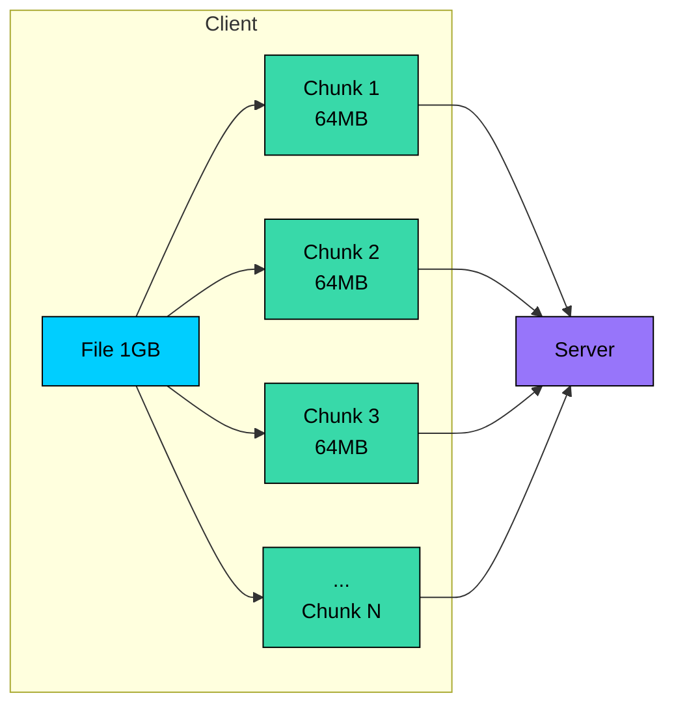

This transforms a single high-stakes operation into many small, low-risk operations. Each chunk is typically 4-64 MB, meaning a 2 GB file becomes 32-500 independent uploads. If one fails, you have lost minutes of progress, not hours.

### How It Works

The upload happens in three phases: initialization, chunk uploads, and completion.

**Step 1: Initialize Upload**

The client starts by requesting an upload session:

The server creates a record tracking this upload session.

**Step 2: Upload Chunks**

Client uploads each chunk independently:

Each chunk upload is a separate HTTP request. Chunks can be uploaded in parallel (with a concurrency limit) or sequentially.

**Step 3: Complete Upload**

After all chunks are uploaded:

The server verifies all chunks are present, assembles them into the final file, and creates the file record in the metadata database.

### Resumable Uploads

The real power of chunked uploads is resumability. When a connection drops, the client does not have to guess where it left off. It simply asks the server what chunks are missing:

The client now knows exactly which chunks to send. A 90% complete upload that fails only needs to retry 10%. Compare this to the naive approach where the same failure means starting over from scratch.

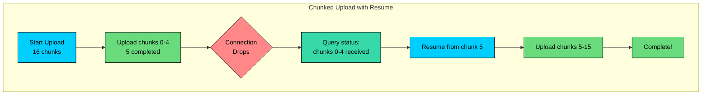

### Idempotent Chunk Uploads

There is a subtle problem with retries: what if the chunk actually made it to the server, but the acknowledgment was lost" The client thinks it failed, but the server already has the data. Uploading again would waste bandwidth and could create duplicate data.

The solution is to make chunk uploads idempotent using checksums. Each chunk includes a checksum in the request. Before storing, the server checks if it already has a chunk with that checksum for this upload:

This makes retries safe. The client can retry as many times as needed without worrying about duplicates or inconsistencies.

### Choosing Chunk Size

Chunk size is a trade-off between several factors:

| Chunk Size | Pros | Cons |
|------------|------|------|
| Small (1-4 MB) | Fine-grained resume, low memory | More HTTP overhead, more round trips |
| Medium (16-64 MB) | Good balance for most use cases | Moderate retry cost |
| Large (100+ MB) | Fewer requests, less coordination | Higher retry cost, more memory |

The right choice depends on your use case:

- **4-8 MB for mobile clients** where connections are unstable and failures are common. Smaller chunks mean less wasted work on retry.
- **16-64 MB for desktop and server clients** with stable connections. This reduces HTTP overhead while keeping retry costs reasonable.
- **Adaptive chunk sizing** is even better if you can implement it. Start with smaller chunks and increase the size if uploads are succeeding consistently.

---

# Pattern 2: Direct Upload with Pre-Signed URLs

Chunked uploads solve the resumability problem, but they still have a bottleneck: all data flows through your application servers. For a 2 GB file, that is 2 GB of data hitting your servers, consuming bandwidth, memory, and CPU cycles. You are essentially paying twice for bandwidth, once to receive the data, and once to forward it to storage.

There is a better approach. Instead of proxying the data, have clients upload directly to blob storage like S3, GCS, or Azure Blob. Your application server only handles metadata and coordination, while the heavy lifting happens between the client and storage service.

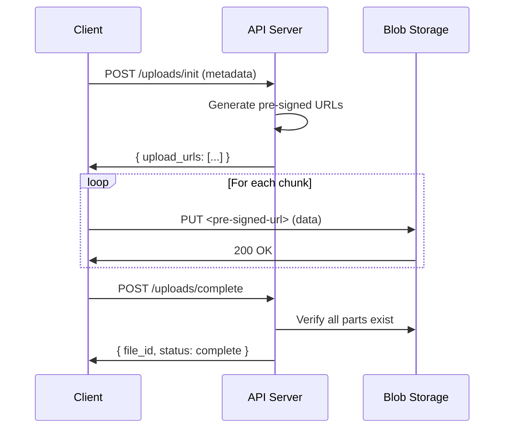

### How Pre-Signed URLs Work

The key question is: how do clients upload directly to storage without having storage credentials" The answer is pre-signed URLs.

A pre-signed URL is a regular URL with embedded authentication. Your server generates it using your storage credentials, but the URL itself can be used by anyone who has it, for a limited time and purpose.

The signature encodes several constraints:

- **Operation:** Which HTTP method is allowed (PUT for upload, GET for download)
- **Object:** Which specific object path can be accessed
- **Expiration:** When the URL becomes invalid (typically 1-2 hours)
- **Conditions:** Optional limits like content type, file size, or IP address

When the client uses this URL, the storage service verifies the signature and checks all constraints. If everything matches, the operation proceeds. The client never sees your credentials and cannot access anything beyond what the URL allows.

### Why This Matters

The benefits of direct upload are substantial:

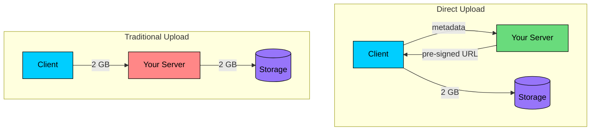

**Reduced server load.** Your application servers handle only lightweight API calls. The file data bypasses them entirely.

**Lower bandwidth costs.** You do not pay for data transfer through your infrastructure. The data goes straight from client to storage.

**Better performance.** Clients connect directly to geographically distributed storage nodes. Cloud providers optimize this path heavily.

**Independent scalability.** Blob storage scales independently of your application. You do not need to provision more servers just because upload volume increases.

### Implementation Example

### Security Considerations

Pre-signed URLs grant access to anyone who has them. If a URL leaks, someone else can use it. This is an inherent trade-off of the pattern, but you can mitigate the risks:

**Short expiration.** Use 1-2 hours for uploads and 15-60 minutes for downloads. This limits the window for abuse.

**Content validation.** Embed content-type and content-length constraints in the signature. The storage service will reject requests that do not match.

**IP restrictions.** Some storage systems let you limit which IP addresses can use the URL. This is useful for server-to-server transfers.

**Monitor usage.** Track URL generation and usage. If you see unusual patterns like many URLs generated but never used, investigate.

The security model is similar to password reset links: anyone with the URL can use it, but the URL expires quickly and is specific to one operation.

---

# Pattern 3: Multipart Upload Protocol

If you are using cloud storage like S3, GCS, or Azure Blob, you do not need to build chunking from scratch. These services have built-in multipart upload protocols that are battle-tested at massive scale.

The multipart protocol combines everything we have discussed: chunked uploads, direct-to-storage transfers, and resumability. It is optimized specifically for large files and handles many edge cases automatically.

### S3 Multipart Upload Flow

**1. Initiate:**

**2. Upload Parts:**

Parts can be 5 MB to 5 GB. Maximum 10,000 parts, allowing objects up to 5 TB.

**3. Complete:**

**4. Abort (if needed):**

### Parallel Part Uploads

One of the most powerful features of multipart upload is that parts can be uploaded in parallel. Since each part is independent, multiple threads, or even multiple machines, can upload different parts simultaneously:

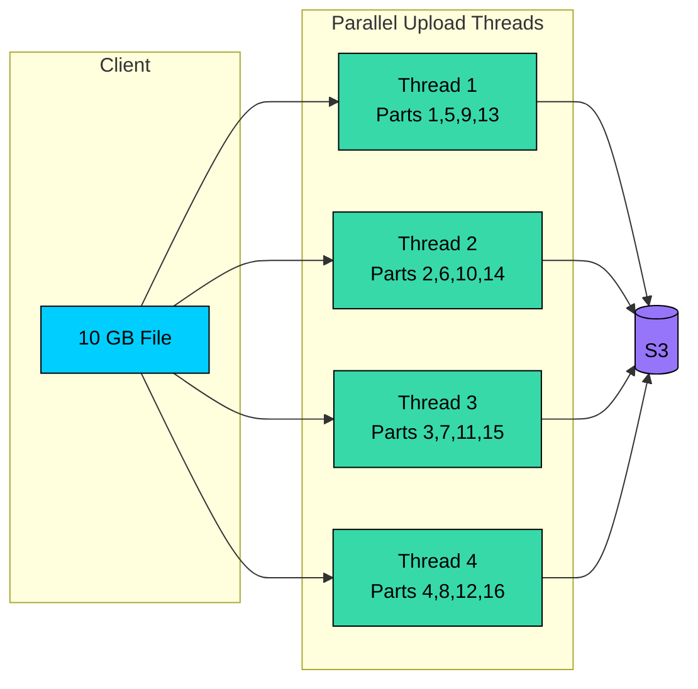

This dramatically speeds up large uploads. A 10 GB file with 4 parallel streams can upload up to 4x faster, assuming your network bandwidth is the bottleneck rather than a single connection.

In practice, most upload clients default to 4-8 parallel streams. Going higher rarely helps because you hit other limits like network bandwidth, disk read speed, or connection overhead.

### Handling Incomplete Uploads

There is a hidden cost to multipart uploads: incomplete uploads consume storage but are invisible to normal listing. If a user starts an upload and never completes it, those parts sit in storage, accumulating charges.

You need a cleanup strategy:

**Lifecycle policies** are the simplest solution. Configure S3 to automatically abort uploads older than a certain age:

**Explicit tracking** gives you more control. Track active uploads in your database with timestamps. A background job periodically scans for uploads that have been pending too long and aborts them.

The right approach depends on your use case. For most systems, a 7-day lifecycle policy catches abandoned uploads without interfering with legitimate long-running uploads.

---

# Pattern 4: Streaming Uploads

Everything we have discussed assumes you know the file size upfront. But what about live video streams, dynamically generated data, or files being compressed on the fly" You cannot split something into chunks if you do not know how big it is.

Streaming uploads handle this by not requiring content-length. Data flows to the server as it becomes available.

### Chunked Transfer Encoding

HTTP/1.1 supports chunked transfer encoding, which lets you send data in pieces without knowing the total size:

Each chunk is prefixed with its size in hexadecimal. A zero-length chunk signals the end. The server processes each chunk as it arrives rather than waiting for the complete request.

### Server-Side Handling

The server can process data as it streams in, avoiding the need to buffer everything in memory:

This works well for live data where you want to minimize latency between data creation and storage.

### When to Use Streaming

Streaming uploads are appropriate for:

- Live video or audio streams
- Log data being generated continuously
- Data being compressed or encrypted on the fly
- Any scenario where waiting for the complete file is not practical

However, streaming has significant limitations:

- **No resumability.** If the connection drops, there is no way to know how much data made it to the server. You must start over.
- **No size verification.** You cannot validate that the complete file was received until after the stream ends.
- **Proxy issues.** Some proxies and load balancers buffer chunked requests before forwarding, defeating the purpose.

For regular file uploads where you know the size upfront, prefer explicit chunking with resumability. Use streaming only when the nature of the data requires it.

---

# Download Optimizations

We have spent most of our time on uploads, but downloading large files has its own challenges. A naive download suffers from the same problems as a naive upload: no resumability, slow transfer on single connections, and poor user experience when something goes wrong.

Fortunately, HTTP has built-in features that address these issues.

### Range Requests

HTTP range requests allow downloading specific byte ranges rather than the entire file:

The 206 Partial Content status code indicates that the server is returning only part of the file. The Content-Range header tells you which bytes are included and the total file size.

This enables three important capabilities:

**Resumable downloads.** If a connection drops after receiving 50 MB of a 100 MB file, the client can resume by requesting `Range: bytes=52428800-`. The server picks up where the client left off.

**Parallel downloads.** Multiple connections can fetch different parts of the file simultaneously, similar to parallel uploads.

**Video seeking.** When a user jumps to a specific timestamp in a video, the player does not need to download everything before that point. It calculates the byte offset and requests just that range.

### Parallel Downloads

Parallel downloads work the same way as parallel uploads. Split the file into ranges and fetch them concurrently:

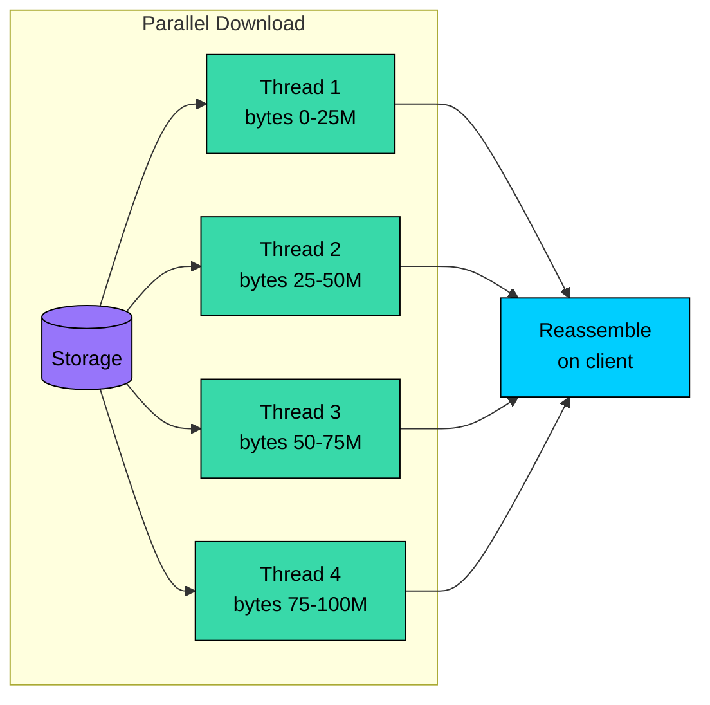

The client reassembles the chunks into the complete file. This saturates available bandwidth better than a single connection, especially on high-latency links where TCP congestion control limits individual connection speed.

### CDN Distribution

For files that many users access, downloading from a single origin server creates a bottleneck. Users far from the origin experience high latency, and the origin bears all the bandwidth cost.

A Content Delivery Network solves this by caching files at edge servers distributed around the world:

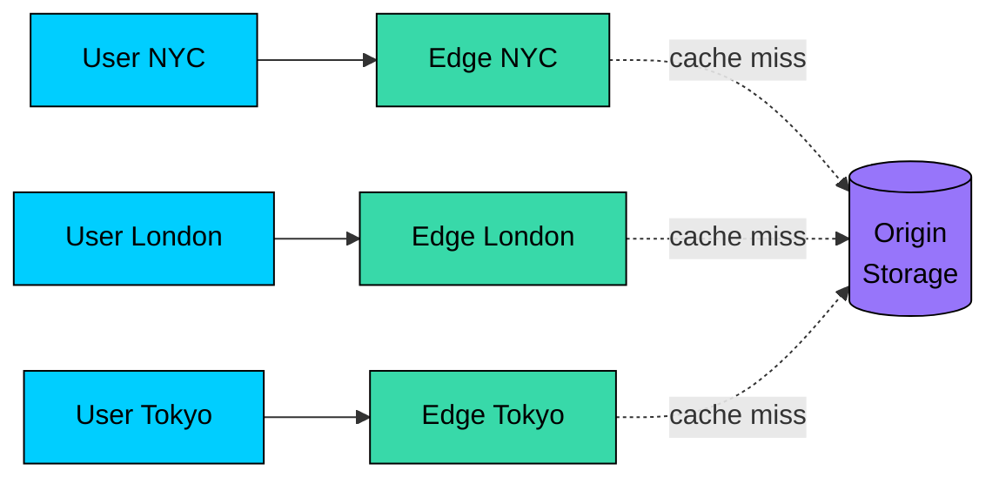

The first user in a region fetches the file from origin, and the edge caches it. Subsequent users in that region download from the edge, which is much closer and faster.

For large files, CDNs offer several advantages:

- **Lower latency.** Users connect to nearby edge servers rather than distant origin servers.
- **Higher throughput.** Edge servers are optimized for high-bandwidth transfers.
- **Reduced origin load.** Popular files are served from cache, protecting your origin from traffic spikes.
- **Geographic redundancy.** If one edge goes down, traffic routes to another.

To make your files CDN-friendly, set appropriate cache headers:

The `Accept-Ranges: bytes` header tells clients that range requests are supported. This is essential for resumable downloads and video seeking to work through the CDN.

---

# Storage Architecture

So far we have focused on how to transfer large files. But where should they actually live once they arrive" The answer depends on your access patterns, scale, and consistency requirements.

### Choosing the Right Storage

There are three broad categories of storage for large files, each with distinct trade-offs:

| Storage Type | Best For | Avoid When |
|--------------|----------|------------|
| Blob Storage (S3, GCS) | Any file over 1 MB, static assets, backups | Low-latency random access within files |
| Distributed File System (HDFS, GlusterFS) | Analytics workloads, shared access across nodes | Small files, web serving |
| Database (BLOB columns) | Small files (<1 MB), tight consistency with related data | Large files (performance degrades badly) |

For most web applications, blob storage is the right choice. It is designed specifically for large objects, scales to exabytes, and integrates well with CDNs and direct upload patterns.

### Separating Metadata from Data

A common mistake is treating file storage as a single problem. In practice, you have two distinct concerns:

- **Metadata:** File name, size, owner, timestamps, permissions, and the location of the actual data
- **Data:** The actual file bytes

Storing these together in a traditional database works for small files, but breaks down quickly as files grow. Instead, store metadata in a database optimized for queries, and store file data in blob storage optimized for large objects:

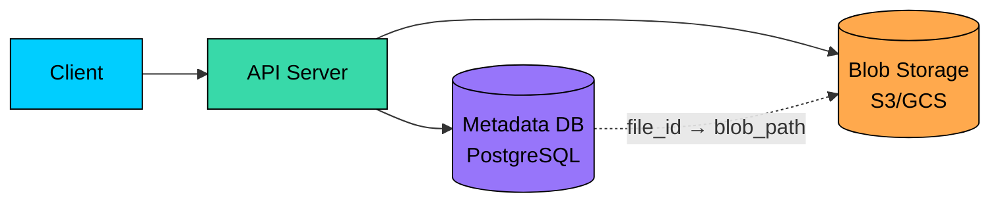

This separation provides several benefits:

**Independent scaling.** Metadata queries are small and frequent. File downloads are large and less frequent. Separating them lets you scale each layer appropriately.

**Efficient queries.** Finding all files owned by a user, or files modified in the last week, requires only the metadata database. You never touch blob storage for these queries.

**Flexible consistency.** Metadata typically needs strong consistency since you cannot have two files with the same path. Blob storage can use eventual consistency, which is cheaper and more available.

**Different retention policies.** You might keep metadata forever for auditing, but delete the actual files after a retention period. Separation makes this straightforward.

### Content-Addressable Storage

An elegant approach to file storage is to use the content itself as the address. Instead of storing files at arbitrary paths, compute a hash of the file content and use that hash as the storage key:

The path is derived from the hash, typically using the first few characters as directory prefixes to prevent any single directory from having too many files.

This approach has several powerful properties:

**Automatic deduplication.** If two users upload the same file, it has the same hash and is stored only once. The metadata records point to the same blob. For systems where users often share common files like popular PDFs or media, this can save significant storage.

**Immutability.** The content cannot change without changing the hash. This makes integrity verification trivial: re-hash the content and compare. If they match, the file is intact.

**Safe concurrent uploads.** If two clients upload the same content simultaneously, they race to write the same blob. Either one wins, or both succeed with identical data. There is no conflict.

The metadata database maps user-visible file paths to content hashes. Multiple files can reference the same hash, achieving deduplication without any explicit deduplication logic.

---

# Compression and Deduplication

Large files often contain redundant data. Compression reduces individual file sizes, while deduplication eliminates storing the same content multiple times. Both reduce storage costs and can speed up transfers.

### Compression Trade-offs

You can compress at different points in the pipeline, each with trade-offs:

| Approach | Pros | Cons |
|----------|------|------|
| Client-side compression | Reduces upload bandwidth | CPU cost on client, requires client support |
| Server-side compression | Transparent to client | Server CPU cost, delayed storage |
| Storage-level compression | Automatic, transparent | May not work for already-compressed formats |

One important rule: do not compress already-compressed formats. JPEG, MP4, ZIP, and similar formats are already compressed. Trying to compress them wastes CPU and may even make them larger. Compress text files, logs, and uncompressed data formats like BMP or WAV.

### Block-Level Deduplication

Content-addressable storage deduplicates entire files, but what about files that are mostly the same with small differences" A document with one paragraph changed is stored entirely twice.

Block-level deduplication solves this by splitting files into blocks and deduplicating at the block level:

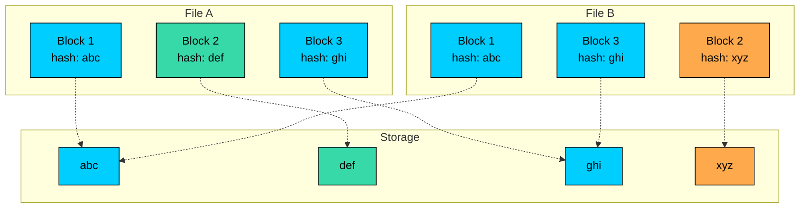

File B shares blocks 1 and 3 with File A. Only block 2 is different, so only one new block is stored. This is how systems like Dropbox achieve efficient sync: when you modify a small part of a large file, only the changed blocks are uploaded.

### Content-Defined Chunking

There is a subtle problem with fixed-size blocks. If you insert data at the beginning of a file, every block boundary shifts:

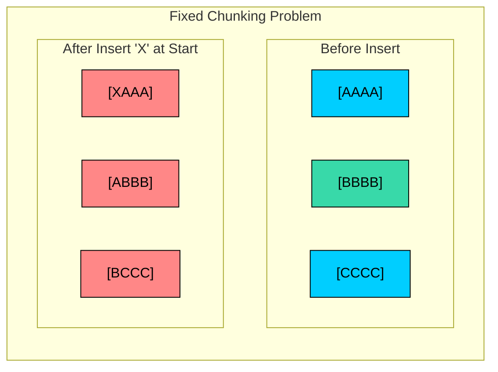

All three chunks changed even though we only inserted one character. This defeats deduplication entirely.

Content-Defined Chunking (CDC) solves this by using the content itself to find chunk boundaries. Instead of cutting at fixed intervals, it looks for specific patterns in the data (typically using a rolling hash like Rabin fingerprinting). When the pattern appears, that becomes a chunk boundary.

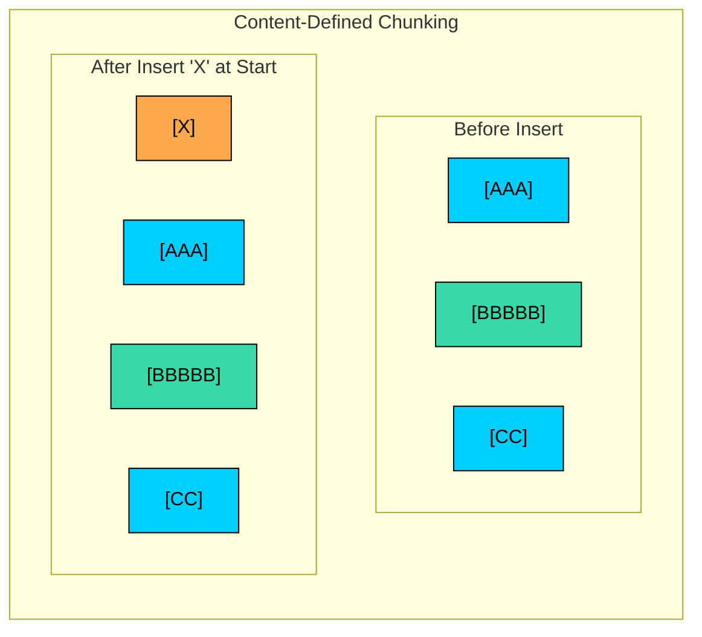

With CDC, the original chunks are preserved. Only a new chunk is added for the inserted content. This makes CDC essential for efficient incremental backup and sync systems.

---

# Putting It Together: A Complete Upload Flow

Let us see how all these patterns work together in a production system. Here is a complete flow for uploading a large file:

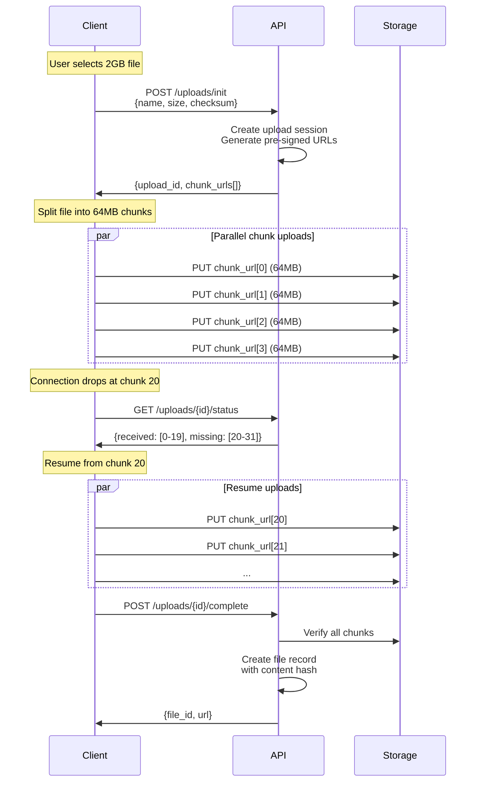

Notice how the patterns complement each other:

- **Pre-signed URLs** let clients upload directly to storage, bypassing your servers for the heavy lifting.
- **Parallel uploads** maximize throughput by using multiple connections simultaneously.
- **Progress tracking** enables resumability. When the connection drops, the client knows exactly where to pick up.
- **Content-addressable storage** enables deduplication. If another user has the same file, no additional storage is needed.
- **Metadata and blob separation** lets each layer scale and evolve independently.

---

# Implementation Checklist

When building a large file handling system, here are the key capabilities to implement:

**Upload Path**

| Capability | Why It Matters |
|------------|---------------|
| Chunked uploads with configurable chunk size | Enables resumability and parallel uploads |
| Progress tracking and resume | Users do not lose work on connection failures |
| Pre-signed URLs for direct storage | Reduces server load and bandwidth costs |
| Checksum verification per chunk | Detects corruption and enables idempotent retries |
| Upload session timeout and cleanup | Prevents orphaned data from accumulating |
| Parallel chunk upload support | Maximizes upload throughput |

**Download Path**

| Capability | Why It Matters |
|------------|---------------|
| Range request support (HTTP 206) | Enables resumable downloads and video seeking |
| CDN integration | Reduces latency and origin load for popular files |
| Appropriate cache headers | Allows efficient caching at all layers |

**Storage**

| Capability | Why It Matters |
|------------|---------------|
| Blob storage for file data | Scales to any size, optimized for large objects |
| Metadata database for file records | Efficient queries, strong consistency where needed |
| Content-addressable storage | Automatic deduplication |
| Garbage collection for orphaned blobs | Prevents storage leaks |

**Reliability**

| Capability | Why It Matters |
|------------|---------------|
| Idempotent chunk uploads | Makes retries safe and simple |
| Upload timeout and abort handling | Cleans up failed uploads |
| Retry logic with exponential backoff | Handles transient failures gracefully |
| End-to-end integrity verification | Ensures uploaded file matches original |

---

# Summary

Here is a quick reference for when to use each pattern:

| Pattern | When to Use | Key Benefit |
|---------|-------------|-------------|
| Chunked Uploads | Files > 10 MB | Resumability, parallel uploads |
| Pre-signed URLs | Any direct-to-storage upload | Bypass application servers |
| Multipart Upload | Using cloud storage APIs | Built-in, battle-tested at scale |
| Range Requests | Large file downloads | Resumable, parallel, seeking |
| Content-Addressable Storage | Systems with duplicate content | Automatic deduplication |
| CDN | Frequently accessed files | Low latency, reduced origin load |

The core insight behind all these patterns is the same: break a big problem into smaller, independent pieces. Chunks instead of whole files. Direct storage instead of proxying. Parallel instead of sequential. Resumable instead of all-or-nothing.

Every major file storage system uses these patterns. Dropbox uses content-defined chunking for efficient sync. YouTube uses multipart uploads and CDN distribution. S3 itself is built on multipart protocols and pre-signed URLs. These are not theoretical ideas but proven solutions running at planetary scale.

When designing a system that handles large files, start with the basics: chunked uploads, direct storage, and CDN distribution. Add block-level deduplication if storage efficiency matters. Use content-defined chunking if you need efficient incremental sync. The patterns compose well and can be added incrementally as your system grows.

---

# References

- [Google Cloud Storage Resumable Uploads](https://cloud.google.com/storage/docs/resumable-uploads) - Google's implementation of resumable upload protocol
- [Amazon S3 Multipart Upload](https://docs.aws.amazon.com/AmazonS3/latest/userguide/mpuoverview.html) - S3's multipart upload documentation
- [tus.io - Open Protocol for Resumable Uploads](https://tus.io/) - Open standard for resumable file uploads
- [Dropbox Architecture Blog](https://dropbox.tech/infrastructure) - Real-world large file handling at scale
- [HTTP Range Requests (MDN)](https://developer.mozilla.org/en-US/docs/Web/HTTP/Range_requests) - HTTP partial content specification
- [Content-Defined Chunking (Restic)](https://restic.readthedocs.io/en/stable/100_references.html) - CDC algorithm for efficient deduplication

---

# Quiz
