Imagine you have five database replicas. All of them can handle reads, but only one should handle writes. The question is: which one"

If multiple nodes accept writes simultaneously, you get conflicting data. If no node accepts writes, your system stops. You need exactly one node to take charge, and everyone else needs to agree on who that is.

This is the **leader election** problem. It sounds simple until you consider network failures, crashed nodes, and the terrifying possibility of two nodes both believing they're in charge.

Getting leader election wrong can cause data corruption, split-brain scenarios, or complete system outages. Getting it right is one of the fundamental challenges in distributed systems.

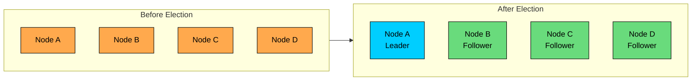

In this chapter, we'll explore:

- What leader election is and why it matters
- The split-brain problem and why it's so dangerous
- Common leader election algorithms
- How production systems like Kafka, ZooKeeper, and Kubernetes handle leader election
- Failure scenarios and how to handle them
- Best practices for implementing leader election

---

# What is Leader Election"

> [!PAYWALL] This content is for premium members only.

**Leader election** is the process of designating a single node in a distributed system to act as the coordinator or "leader" for a specific task. All other nodes become "followers" and defer to the leader's decisions.

The goal is deceptively simple: ensure exactly one node is the leader at any given time. Not zero (system stops working). Not two (data corruption). Exactly one.

The leader typically has special responsibilities:

- **Coordinating writes** in a replicated database
- **Assigning tasks** to worker nodes
- **Serializing operations** that require strict ordering
- **Making decisions** that affect the entire cluster

The tricky part isn't electing a leader when everything is working. It's handling what happens when the leader fails, when the network partitions, or when a "dead" leader comes back to life and still thinks it's in charge.

---

# Why Do Distributed Systems Need a Leader"

Not all distributed systems need a leader. Systems like Cassandra and DynamoDB are designed to be leaderless, where any node can accept writes. But many systems benefit enormously from having a single coordinator.

### Simplifying Coordination

Without a leader, every node must coordinate with every other node for operations that require agreement. With **n** nodes, that's **O(n²)** communication paths.

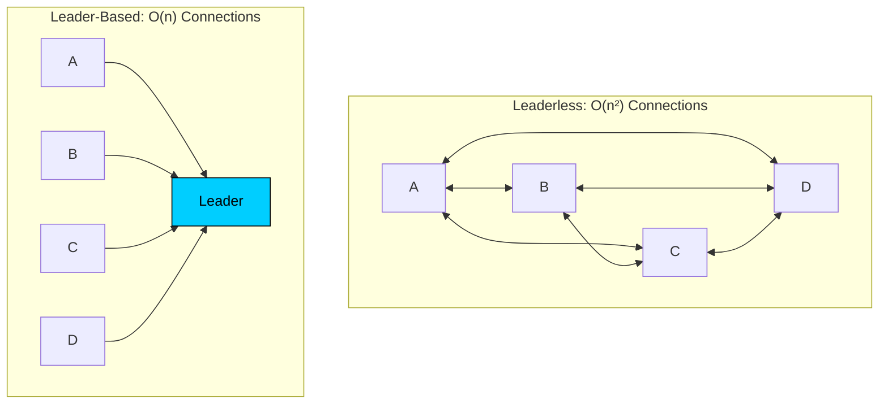

With a leader, coordination becomes **O(n)**. The leader makes decisions, and followers just need to agree with the leader. This is a massive simplification.

### Ensuring Consistency

For operations that must happen in a specific order, a leader provides a single point of serialization.

Consider a distributed lock service. Without a leader, two nodes might both think they acquired the same lock. With a leader, there's one authority that decides who gets the lock and in what order.

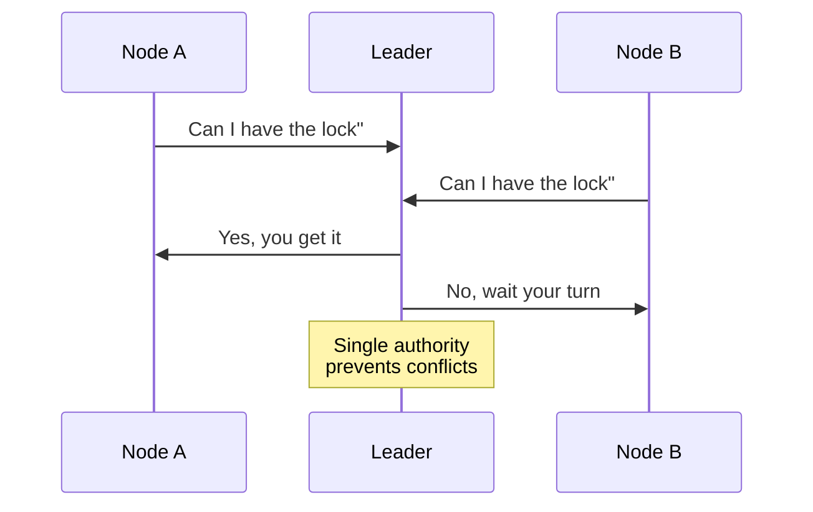

### Reducing Conflicts

In systems where conflicts are expensive to resolve, having a leader prevents conflicts from occurring in the first place.

In a primary-replica database, the primary (leader) handles all writes, and replicas just apply the writes in order. No write conflicts are possible because there's only one writer.

But this leads to the central question: **who decides who the leader is"** And what happens when the leader dies"

---

# The Split-Brain Problem

Before diving into algorithms, we need to understand the worst thing that can go wrong.

**Split-brain** occurs when two nodes both believe they are the leader. This is the nightmare scenario in leader election.

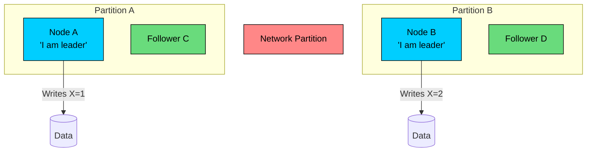

When the network partition heals, you have two different values for X. Which one is correct" This leads to data corruption that can be extremely difficult to detect and repair.

**Common causes of split-brain:**

1. **Network partitions:** Nodes can't communicate but are still running
2. **Slow heartbeats:** Leader is slow to respond, followers assume it's dead and elect a new one
3. **Clock skew:** Time-based lease expiration happens at different times on different machines
4. **Bugs:** Incorrect implementation of the leader election logic

The challenge of leader election isn't just electing a leader. It's ensuring two critical properties:

1. **Safety:** There's always at most one leader
2. **Liveness:** A new leader is eventually elected if the old one fails

These properties are in tension with each other, and different algorithms make different trade-offs between them.

---

# Leader Election Algorithms

### The Bully Algorithm

The **bully algorithm** is one of the simplest leader election algorithms. The node with the highest ID always wins. It's called the "bully" algorithm because the biggest node bullies its way into leadership.

**How it works:**

1. When a node detects the leader has failed, it starts an election
2. It sends ELECTION messages to all nodes with higher IDs
3. If no higher-ID node responds, it declares itself leader
4. If a higher-ID node responds, that node takes over the election
5. The winner sends COORDINATOR messages to all nodes

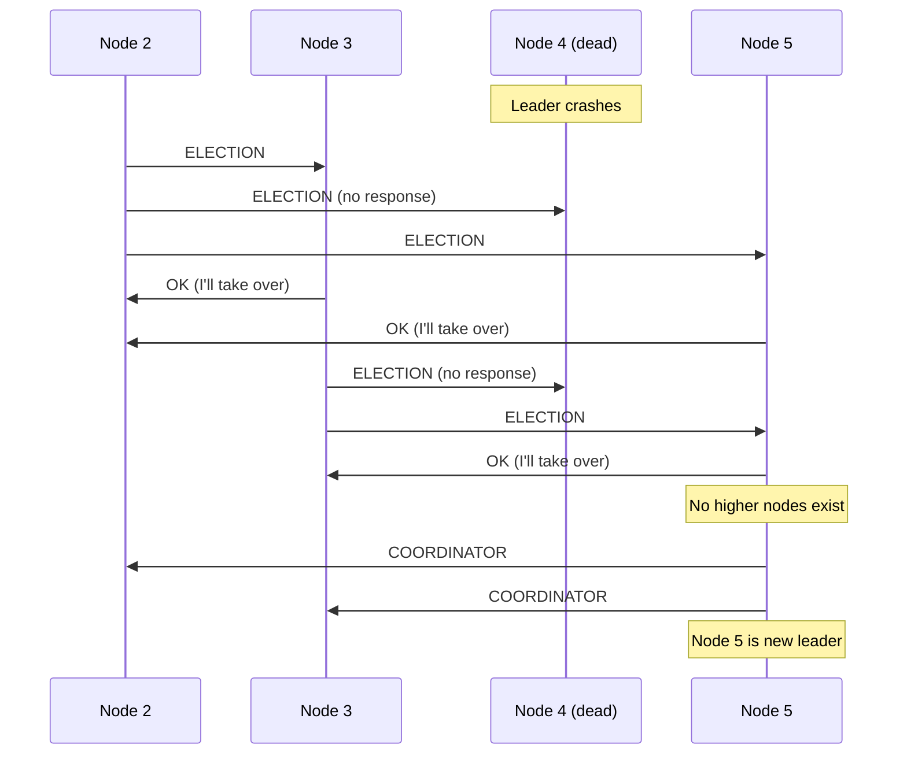

**Pros:**

- Simple to understand and implement
- Deterministic: same input always produces same leader

**Cons:**

- The highest-ID node always wins (not load-balanced)
- Many messages during election: O(n²) in worst case
- Doesn't handle network partitions well

### The Ring Algorithm

In the **ring algorithm**, nodes are arranged in a logical ring. An election message travels around the ring, collecting votes from each live node.

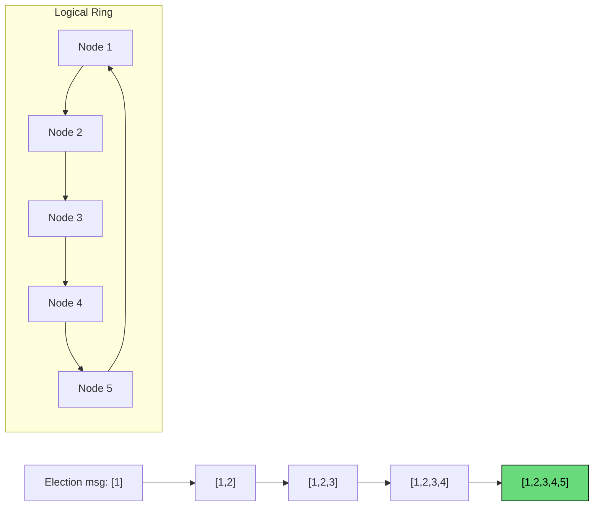

**How it works:**

1. When a node detects failure, it creates an ELECTION message with its own ID
2. The message is passed to the next node in the ring
3. Each node adds its ID to the message and passes it on
4. When the message returns to the originator, it contains all live node IDs
5. The node with the highest ID is declared leader

**Pros:**

- Fewer messages than bully algorithm: O(n)
- All nodes learn about all other live nodes

**Cons:**

- Slow: must traverse entire ring
- Single node failure can break the ring (need to skip dead nodes)
- Still doesn't handle partitions well

### Consensus-Based Election (Raft)

Modern distributed systems use **consensus algorithms** like **Raft** or **Paxos** for leader election. These are more complex but handle network partitions correctly.

**Raft** is designed to be understandable. Here's how its leader election works:

**Key concepts:**

- Each node is in one of three states: **Leader**, **Follower**, or **Candidate**
- Time is divided into **terms** (logical clocks)
- Leaders send periodic **heartbeats** to followers
- A leader must have support from a **majority** of nodes

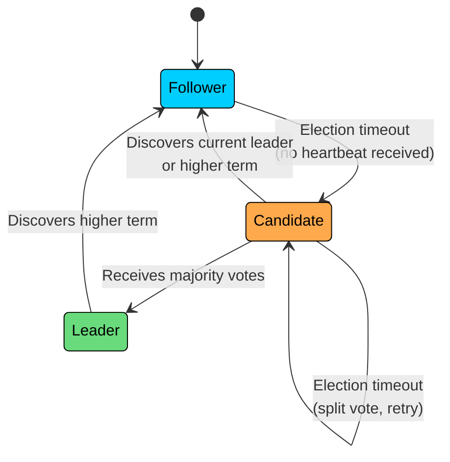

**Election process:**

1. Followers wait for heartbeats from the leader
2. If no heartbeat arrives within the **election timeout**, a follower becomes a candidate
3. The candidate increments the term number and requests votes from all nodes
4. Each node votes for at most one candidate per term
5. Candidate with majority votes becomes leader
6. New leader immediately sends heartbeats to establish authority

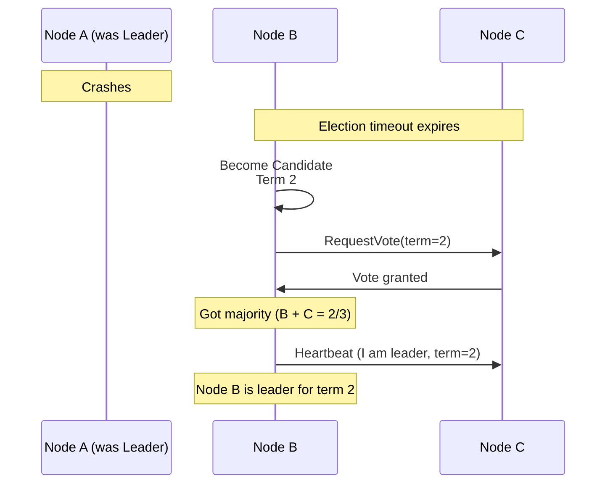

**Why Raft handles partitions correctly:**

The key insight is **majority quorum**. A leader must get votes from a majority of nodes. In a network partition, at most one side can have a majority.

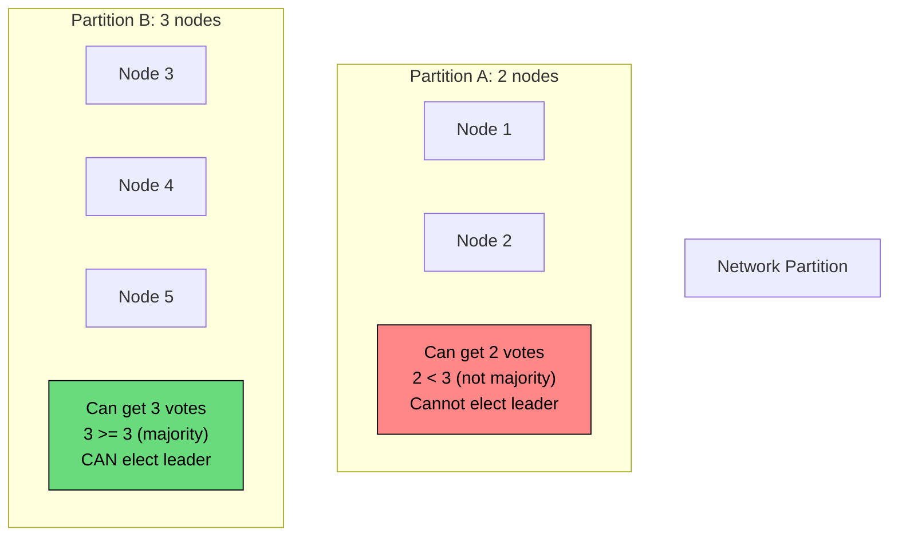

The minority partition cannot elect a leader, so there's no split-brain. When the partition heals, nodes in the minority partition will discover the leader elected by the majority and follow it.

**Pros:**

- Handles network partitions correctly
- Well-understood and formally proven correct
- Used in production systems (etcd, CockroachDB, TiKV)

**Cons:**

- More complex to implement
- Requires majority of nodes to be available (3 of 5, 2 of 3, etc.)
- Not suitable for very large clusters (consensus overhead)

---

# Lease-Based Leader Election

Instead of electing a leader indefinitely, you can grant a **time-limited lease**. The leader must renew its lease before it expires, or it loses leadership.

```mermaid
gantt
    title Lease Timeline
    dateFormat s
    axisFormat %S

    section Node A
    Lease acquired    :a1, 0, 30s
    Lease renewed     :a2, after a1, 30s
    Lease renewed     :a3, after a2, 30s
    Failed to renew   :crit, a4, after a3, 10s

    section Node B
    Waiting           :b1, 0, 100s
    Acquired lease    :active, b2, after a4, 30s
```

**How it works:**

1. A node requests a lease from a coordination service (ZooKeeper, etcd, etc.)
2. The service grants a lease for a fixed duration (e.g., 30 seconds)
3. The leader must renew the lease before expiration
4. If the lease expires, another node can acquire it

**Advantages:**

- Automatic leader failover when leader crashes
- Bounded time for detecting leader failure
- Works well with external coordination services

### The Clock Skew Problem

Leases have a subtle but dangerous vulnerability: clock skew.

If the clocks on different machines are not perfectly synchronized, the old leader might think its lease is still valid while the coordination service has already granted the lease to someone else.

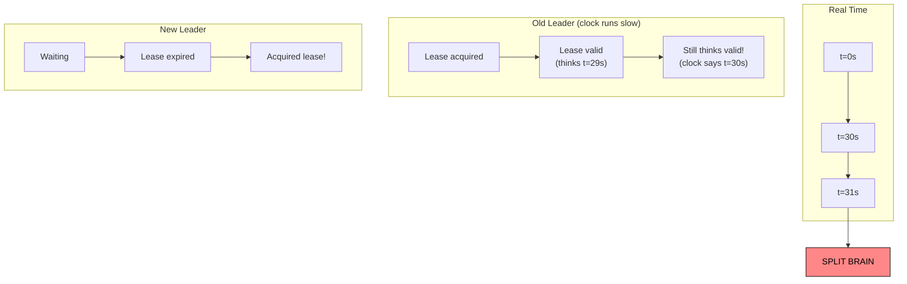

**Solution: Fencing Tokens**

Each lease comes with a monotonically increasing token number. Resources (databases, storage systems) must track the highest token they've seen and reject operations from lower tokens.

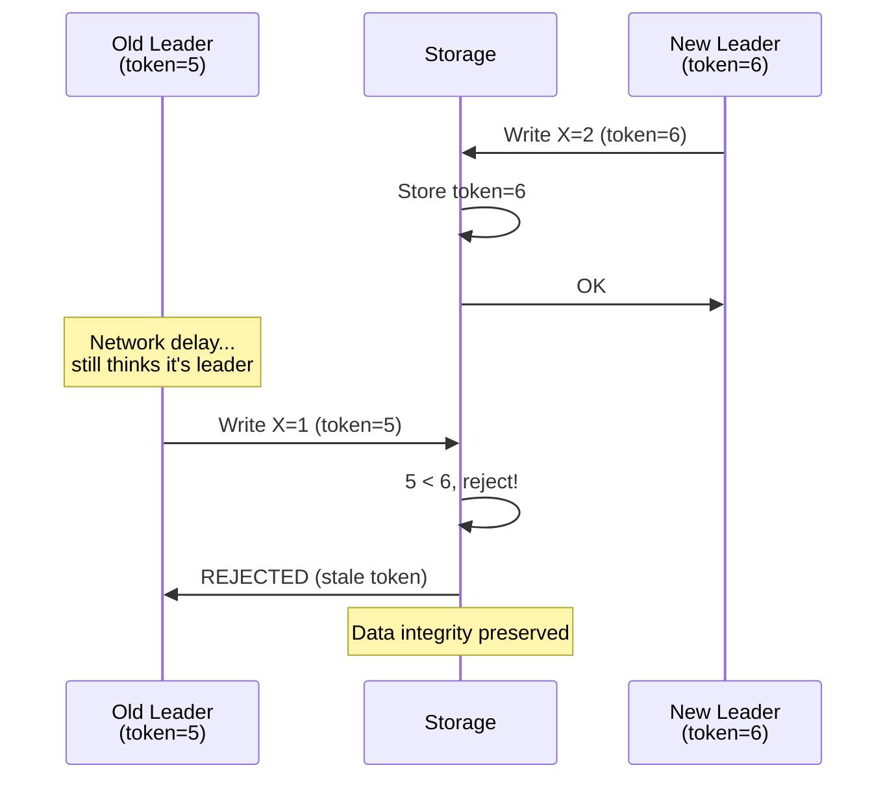

This way, even if an old leader tries to make changes after its lease has expired (due to clock skew or network delays), the storage system will reject the request.

---

# How Real Systems Implement Leader Election

### Apache ZooKeeper

ZooKeeper is a coordination service that many distributed systems use for leader election. It provides primitives that make implementing leader election relatively straightforward.

**Approach:** Sequential ephemeral nodes

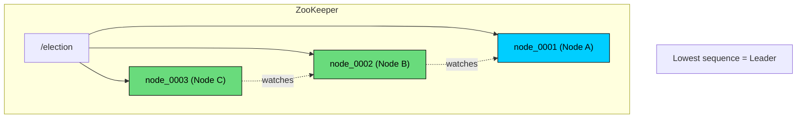

**How it works:**

1. Each node creates a sequential, ephemeral znode under `/election/`
2. ZooKeeper assigns sequence numbers: `node_0001`, `node_0002`, etc.
3. The node with the lowest sequence number is the leader
4. Other nodes watch the node just before them in sequence
5. When a node fails, its ephemeral node is automatically deleted
6. The watching node gets notified and checks if it's now the leader

**Why this works:**

- Ephemeral nodes disappear when the session ends (node crash)
- Sequential nodes ensure a deterministic ordering
- Watching only the predecessor prevents "herd effect" where all nodes react simultaneously

**Used by:** Kafka (controller election), HBase (master election), Hadoop (NameNode HA)

### etcd and Kubernetes

**etcd** uses the Raft consensus algorithm internally and provides leader election primitives that other systems can use.

Kubernetes uses etcd for storing cluster state, and several Kubernetes components use etcd's lease mechanism for leader election:

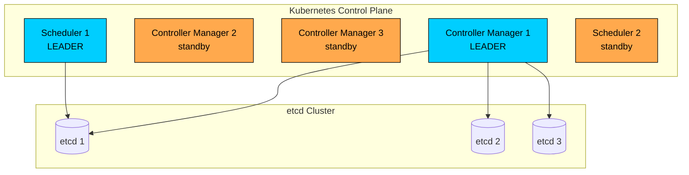

- **kube-controller-manager:** Only one instance actively reconciles cluster state
- **kube-scheduler:** Only one instance assigns pods to nodes

The standby instances continuously try to acquire the lease, ready to take over if the leader fails.

### Apache Kafka

Kafka uses a **controller** node to manage partition leadership and cluster metadata.

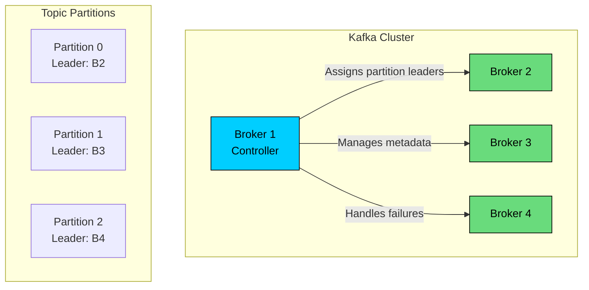

The controller handles:

- Assigning partition leadership when brokers join or leave
- Triggering leader election for partitions when a broker fails
- Managing cluster metadata and propagating changes

Prior to KRaft, Kafka used ZooKeeper for controller election. Now, Kafka uses its own Raft implementation (KRaft) for self-contained consensus.

### Redis Sentinel

Redis Sentinel provides high availability by monitoring Redis instances and performing automatic failover.

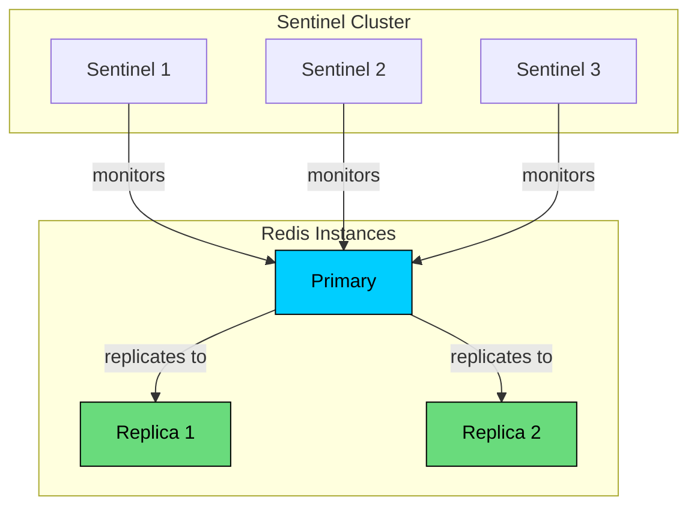

**How failover works:**

1. Multiple Sentinel instances monitor the primary Redis
2. If Sentinels agree the primary is down (quorum vote), they elect a leader Sentinel
3. The leader Sentinel promotes a replica to primary
4. Other Sentinels reconfigure clients to use the new primary

This is a two-level election: first the Sentinels elect a leader among themselves, then that leader decides which Redis replica becomes the new primary.

---

# Challenges and Failure Scenarios

### Network Partitions

The biggest challenge in leader election. What if the old leader is still running but can't communicate with the rest of the cluster"

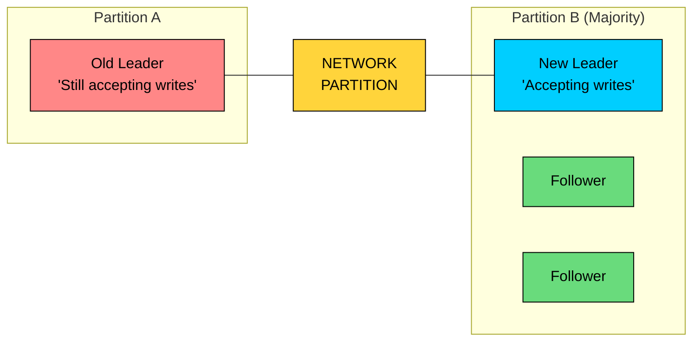

**Solutions:**

- **Quorum-based systems (Raft, Paxos):** The old leader can't get majority confirmation for its operations, so its writes fail
- **Lease-based:** Old leader's lease expires, and fencing tokens prevent stale writes
- **Epoch/term numbers:** Higher epoch wins; storage systems reject operations with lower epochs

### Flapping Leaders

If leader election is too sensitive, leaders may change frequently, causing instability and wasted resources.

**Causes:**

- Network jitter causing missed heartbeats
- Overloaded leader can't respond in time
- Too aggressive election timeout

**Solutions:**

- Use reasonable heartbeat and election timeout values (election timeout should be 5-10x heartbeat interval)
- Implement exponential backoff for elections
- Monitor and alert on frequent leader changes

### Long Elections

If elections take too long, the system is unavailable during that time.

**Raft's solution: Randomized election timeout**

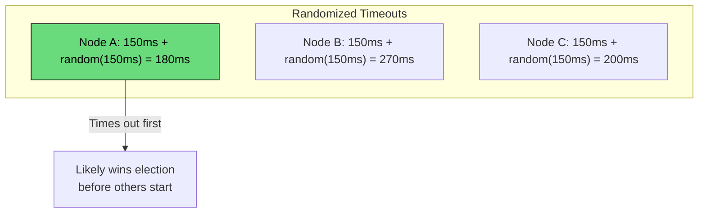

By randomizing the election timeout, nodes are unlikely to start elections simultaneously, reducing the chance of split votes that require another election round.

### Byzantine Failures

Standard leader election assumes nodes are "fail-stop" (they either work correctly or crash). But what if a node sends incorrect information"

**Examples:**

- A node lies about its ID to win election
- A malicious node accepts leadership but drops all requests
- A buggy node sends conflicting messages to different peers

**Solutions:**

- Byzantine Fault Tolerant (BFT) algorithms like PBFT or HotStuff
- Require 3f+1 nodes to tolerate f Byzantine failures
- These are more complex and slower than non-BFT algorithms

For most internal systems, Byzantine fault tolerance isn't necessary because you control all the nodes. It becomes important in blockchain systems or when nodes might be compromised.

---

# Best Practices

### Use Existing Solutions

Don't implement leader election from scratch unless you have a very good reason. The edge cases are subtle and the consequences of bugs are severe.

**Proven coordination services:**

- **ZooKeeper:** Battle-tested, used by Kafka, HBase, Hadoop
- **etcd:** Kubernetes ecosystem, simpler API than ZooKeeper
- **Consul:** Service mesh friendly, built-in health checking

### Handle Leadership Changes Gracefully

Your application must handle three scenarios:

- Becoming the leader
- Losing leadership (possibly abruptly)
- Discovering who the current leader is

The most important part is stopping leader work immediately when leadership is lost. A delayed response here can cause split-brain behavior.

### Always Implement Fencing

Use fencing tokens or epoch numbers to prevent stale leaders from causing damage. Every resource that a leader can modify should validate the token.

### Monitor Leader Elections

Track metrics like:

- Number of leader elections over time
- Duration of elections
- Time since last successful heartbeat
- Current leader identity

**Alert on:**

- Frequent leader changes (flapping)
- Long elections (availability impact)
- Multiple nodes claiming leadership (indicates a bug)

### Test Failure Scenarios

Regularly test what happens when:

- The leader crashes suddenly
- Network partitions occur
- The leader is slow but not dead (gray failures)
- Multiple nodes try to become leader simultaneously

Use chaos engineering tools:

- **Chaos Monkey** (Netflix): Random instance termination
- **Toxiproxy**: Simulate network failures and latency
- **Pumba**: Docker container chaos testing

---

# Leader-Based vs Leaderless

Not every system needs leader election. Here's when to use each approach:

```mermaid
flowchart TD
    Q1{Strong consistency<br/>required"}
    Q1 -->|Yes| L1[Leader-Based]:::leader
    Q1 -->|No| Q2{High write<br/>throughput needed"}

    Q2 -->|Yes| L2[Leaderless]:::leaderless
    Q2 -->|No| Q3{Conflict resolution<br/>complex"}

    Q3 -->|Yes| L1
    Q3 -->|No| L2

    classDef leader fill:#00ceff,stroke:#000,color:#000
    classDef leaderless fill:#69db7c,stroke:#000,color:#000
```

| Factor | Leader-Based | Leaderless |
|--------|--------------|------------|
| **Consistency** | Easier to achieve strong consistency | Eventually consistent (typically) |
| **Availability** | Unavailable during elections | Always available |
| **Write throughput** | Limited by leader capacity | Scales with nodes |
| **Complexity** | Election logic required | Conflict resolution required |
| **Examples** | Kafka, MySQL, etcd, ZooKeeper | Cassandra, DynamoDB, Riak |

**Choose leader-based when:**

- Strong consistency is required
- Operations must be serialized
- Conflict resolution is complex or expensive

**Choose leaderless when:**

- High availability is the priority
- Eventual consistency is acceptable
- Write throughput must scale horizontally

---

# Summary

Leader election is one of those problems that seems simple on the surface but has deep complexity underneath. The core challenge isn't electing a leader when everything works. It's handling the edge cases: network partitions, crashed nodes, slow nodes, and the terrifying possibility of split-brain.

#### **Key takeaways:**

1. **Use existing solutions.** ZooKeeper, etcd, and Consul have been battle-tested in production. Don't reinvent the wheel.
2. **Majority quorum prevents split-brain.** Systems like Raft ensure that at most one partition can elect a leader.
3. **Leases provide bounded failure detection.** But watch out for clock skew, and always use fencing tokens.
4. **Handle leadership loss immediately.** A delayed response when losing leadership can cause data corruption.
5. **Test your failure scenarios.** Leader election bugs often only manifest under unusual conditions like network partitions or slow nodes.

The next time you use a distributed database, message queue, or coordination service, you'll know there's a sophisticated leader election mechanism running underneath, constantly ensuring that exactly one node is in charge and that leadership transitions happen safely when failures occur.

---

# References

- [Raft Consensus Algorithm](https://raft.github.io/) - The Raft paper and interactive visualization, excellent for understanding consensus-based leader election
- [ZooKeeper Recipes](https://zookeeper.apache.org/doc/current/recipes.html) - Official ZooKeeper documentation on leader election implementation patterns
- [Designing Data-Intensive Applications](https://dataintensive.net/) - Chapter 8 and 9 cover distributed consensus and leader election in depth
- [etcd Documentation](https://etcd.io/docs/v3.5/dev-guide/api_concurrency_reference_v3/) - How etcd implements leader election primitives
- [The Chubby Lock Service](https://research.google/pubs/pub27897/) - Google's influential paper on distributed locking and leader election
- [How to do distributed locking](https://martin.kleppmann.com/2016/02/08/how-to-do-distributed-locking.html) - Martin Kleppmann's analysis of distributed locking and fencing tokens

---

# Quiz
