In distributed systems, nodes fail all the time. Servers crash, networks partition, processes hang. The question isn't *if* failures happen, but *how quickly* you can detect them.

Consider a database cluster with three replicas. The primary node crashes. If your system takes 5 minutes to detect this failure, you have 5 minutes of downtime. If it detects it in 5 seconds, you have 5 seconds of downtime.

Failure detection is the foundation of fault tolerance. Without it, you can't trigger failovers, rebalance load, or alert operators. Every highly available system depends on some form of failure detection.

```mermaid
flowchart LR
    subgraph Cluster["Distributed Cluster"]
        A[Node A]:::primary
        B[Node B]:::primary
        C[Node C]:::primary
    end

    M[Monitor]:::secondary

    A -->|"💓 heartbeat"| M
    B -->|"💓 heartbeat"| M
    C -.->|"❌ no heartbeat"| M

    M -->|"Node C failed!"| Alert[Trigger Failover]:::orange

    style Cluster fill:#1a1a2e,stroke:#00ceff
    classDef primary fill:#00ceff,stroke:#000,color:#000
    classDef secondary fill:#38d9a9,stroke:#000,color:#000
    classDef orange fill:#ffa94d,stroke:#000,color:#000
```

In this chapter, we'll explore:

- What is failure detection"
- Why is it hard"
- How heartbeats work
- Different failure detection strategies
- The trade-offs you must consider
- Real-world implementations

---

### Problems Where This Pattern is Useful

Failure detection and heartbeats appear in many system design interview problems:

| Problem | How Failure Detection is Used |
|---------|------------------------------|
| **Distributed Database** | Detecting failed replicas, triggering leader election |
| **Load Balancer** | Removing unhealthy servers from rotation |
| **Message Queue** | Detecting dead consumers, reassigning partitions |
| **Distributed Cache** | Detecting failed nodes, rebalancing data |
| **Service Discovery** | Marking services as unhealthy, updating registry |
| **Coordination Service** | Leader election, distributed locking |
| **Container Orchestration** | Restarting failed containers, rescheduling pods |
| **Chat/Messaging System** | Detecting offline users, presence indicators |

When interviewers ask "How would you handle node failures"", they expect you to discuss heartbeats, timeouts, and the trade-offs involved.

---

# 1. What is Failure Detection"

> [!PAYWALL] This content is for premium members only.

**Failure detection** is the mechanism by which nodes in a distributed system determine whether other nodes are alive or dead.

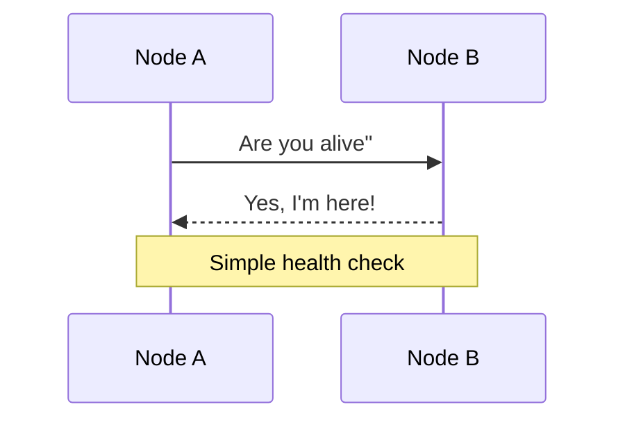

Sounds simple, right" Just ask nodes if they're alive and wait for a response. But this is where distributed systems get tricky.

What if Node B doesn't respond" Is it crashed, slow, experiencing network issues, or partitioned" The challenge is that you cannot distinguish between these cases from Node A's perspective.

```mermaid
flowchart TD
    subgraph Question["Node B doesn't respond. Why""]
        Q[No Response<br/>from Node B]:::orange
    end

    Q --> C1[Crashed"<br/>Process died]:::red
    Q --> C2[Slow"<br/>Overloaded]:::yellow
    Q --> C3[Network Issue"<br/>Message lost]:::purple
    Q --> C4[Partitioned"<br/>Network down]:::pink

    Result[You cannot tell<br/>which one!]:::secondary

    C1 --> Result
    C2 --> Result
    C3 --> Result
    C4 --> Result

    classDef orange fill:#ffa94d,stroke:#000,color:#000
    classDef red fill:#ff8787,stroke:#000,color:#000
    classDef yellow fill:#ffd43b,stroke:#000,color:#000
    classDef purple fill:#9775fa,stroke:#000,color:#000
    classDef pink fill:#da77f2,stroke:#000,color:#000
    classDef secondary fill:#38d9a9,stroke:#000,color:#000
```

**You cannot distinguish between these cases.** A node that doesn't respond might be dead, or it might just be slow. This fundamental uncertainty is at the heart of failure detection.

> 💡 **Key Insight:**

> **INFO**
>
> In distributed systems, the absence of a response does not mean failure. It means *unknown*.

This is why failure detectors produce **suspicions**, not certainties. A node is "suspected" to be dead until proven otherwise.

---

# 2. Why is Failure Detection Hard"

### 2.1 The Two Generals Problem

Imagine two generals trying to coordinate an attack. They can only communicate through messengers who might be captured. Neither general can ever be certain the other received their message.

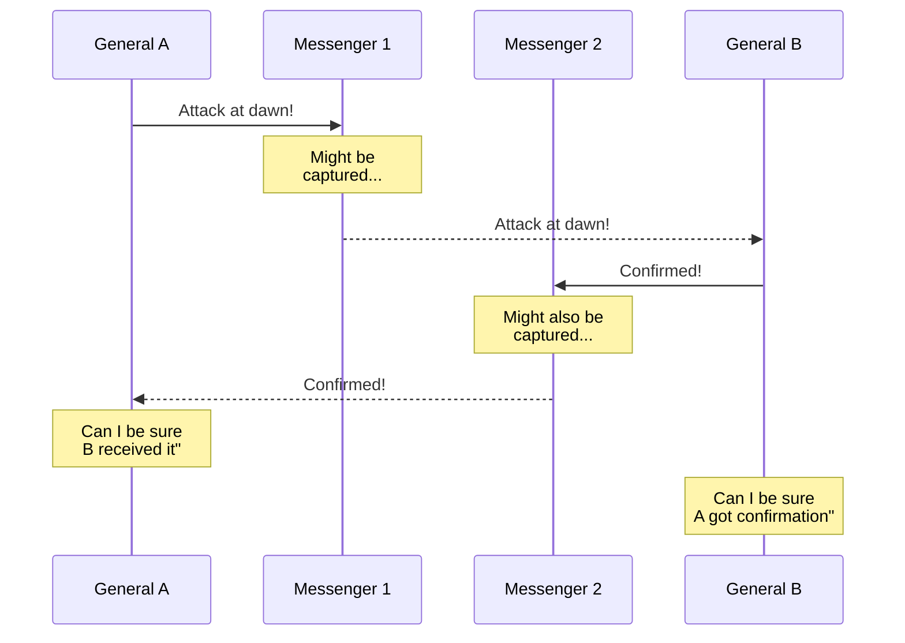

This maps directly to failure detection. When Node A sends a heartbeat request to Node B and gets no response, A cannot know if:

- B never received the request
- B received it but the response was lost
- B is dead

### 2.2 Asynchronous Networks

Real networks have unpredictable delays. A message might arrive in 1ms or 1 second. There's no upper bound on how long a message can take.

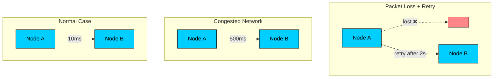

Without a guaranteed upper bound on message delay, you can never be certain a node is dead. It might just be experiencing high latency.

### 2.3 The Fundamental Trade-off

Failure detection forces you to choose between two competing goals:

- **Detect failures quickly:** Lower timeout, faster failover, but more false positives
- **Avoid false positives:** Higher timeout, fewer mistakes, but slower failover

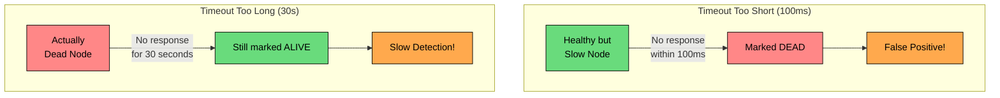

There's no perfect answer. Every system must decide where to draw the line.

---

# 3. How Heartbeats Work

A **heartbeat** is a periodic message sent between nodes to indicate liveness. The basic idea: if you keep hearing from a node, it's alive. If you stop hearing from it, it might be dead.

### 3.1 Push vs Pull Model

There are two primary approaches to implementing heartbeats, plus a hybrid that combines both.

**Push Model:** Each node periodically broadcasts "I'm alive" messages.

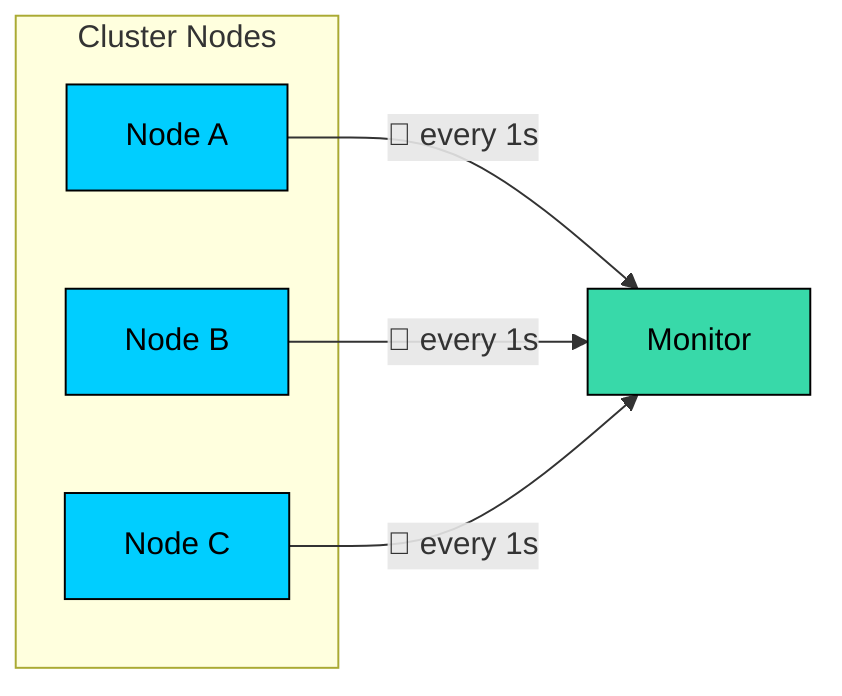

**Pull Model:** A central monitor periodically asks each node "Are you alive""

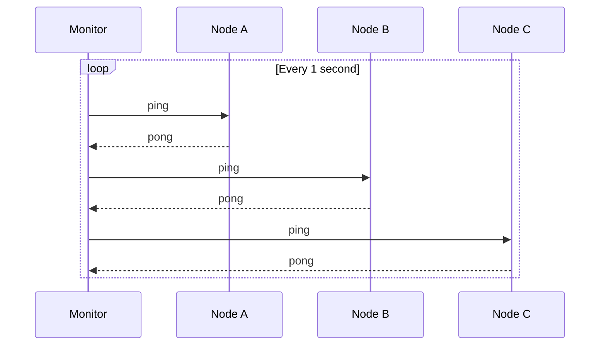

**Hybrid Model:** Nodes push heartbeats normally, and the monitor pulls only when it hasn't heard from a node recently.

| Model | Pros | Cons |
|-------|------|------|
| Push | Lower latency detection, less load on monitor | More network traffic |
| Pull | Centralized control, easier to manage | Monitor becomes bottleneck |
| Hybrid | Best of both, adaptive | More complex |

### 3.2 What's in a Heartbeat"

A heartbeat can be as simple as "I'm alive" or carry additional information:

Rich heartbeats enable more sophisticated decisions. A load balancer might not just check if a node is alive, but also if it's overloaded.

### 3.3 Heartbeat Interval and Timeout

Two critical parameters define heartbeat-based failure detection:

**Heartbeat Interval:** How often a node sends heartbeats (e.g., every 1 second)

**Failure Timeout:** How long to wait without a heartbeat before suspecting failure (e.g., 5 seconds)

```mermaid
gantt
    title Heartbeat Timeline (1s interval, 3s timeout)
    dateFormat X
    axisFormat %s

    section Node Health
    Heartbeat received    :done, hb1, 0, 1
    Heartbeat received    :done, hb2, 1, 2
    Heartbeat received    :done, hb3, 2, 3
    No heartbeat (miss 1) :crit, miss1, 3, 4
    No heartbeat (miss 2) :crit, miss2, 4, 5
    No heartbeat (miss 3) :crit, miss3, 5, 6
    SUSPECTED!            :milestone, m1, 6, 6
```

The relationship between these values determines detection speed and accuracy:

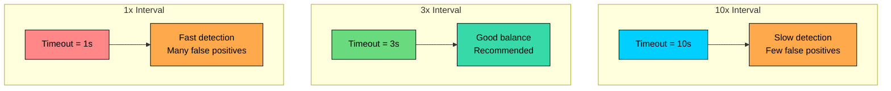

---

# 4. Failure Detection Strategies

Now that we understand the basics, let's explore different strategies for detecting failures. Each approach has different trade-offs in terms of complexity, accuracy, and adaptability.

### 4.1 Fixed Timeout

The simplest approach: if no heartbeat arrives within a fixed time, mark the node as failed.

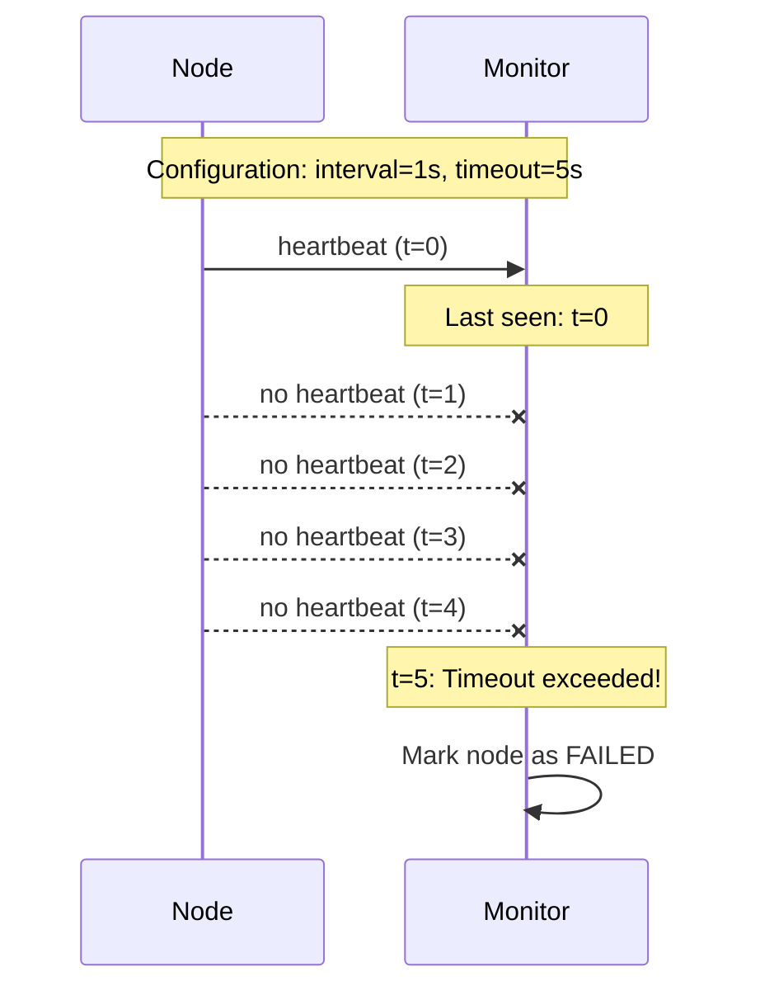

**Pros:**

- Simple to implement
- Predictable behavior
- Easy to reason about

**Cons:**

- Doesn't adapt to network conditions
- Same timeout for fast and slow networks
- Leads to false positives during network hiccups

### 4.2 Adaptive Timeout

Adjust the timeout based on observed network conditions. If heartbeats typically arrive in 50ms, set a timeout much lower than if they typically take 500ms.

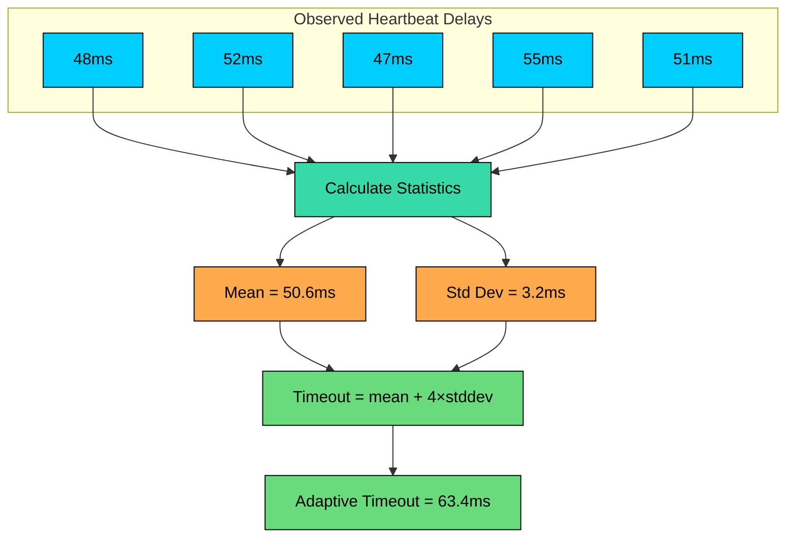

The key insight: track the history of heartbeat arrival times and use statistics to set a timeout that accounts for normal variation.

**Pros:**

- Adapts to network conditions
- Fewer false positives
- Works across different environments

**Cons:**

- More complex to implement
- Needs warm-up period to collect data
- Can be slow to adapt to sudden changes

### 4.3 Phi Accrual Failure Detector

Used by Cassandra and Akka, the **Phi Accrual Failure Detector** doesn't make binary alive/dead decisions. Instead, it outputs a *suspicion level* (phi) that increases over time.

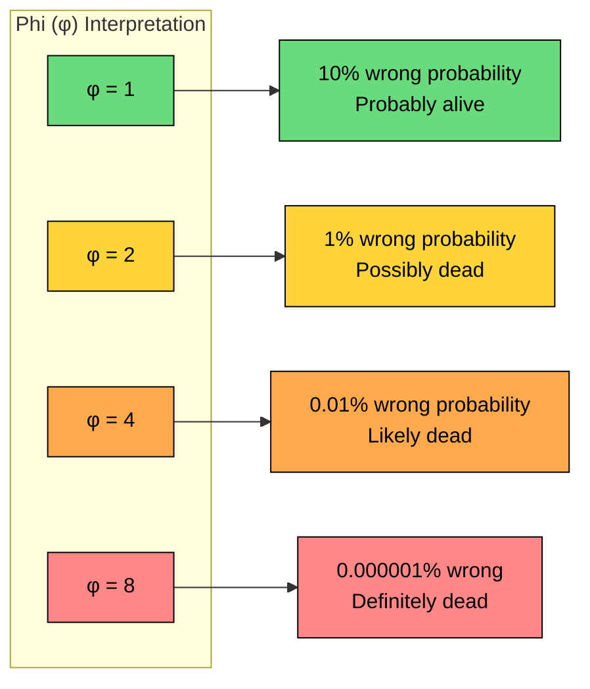

The phi value increases as time passes without receiving a heartbeat.

Applications set a **threshold** (commonly φ = 8). When phi exceeds the threshold, the node is considered dead.

**How it works:**

1. Track arrival times of heartbeats
2. Model the distribution of inter-arrival times (usually exponential)
3. Calculate the probability that the next heartbeat is late given the observed distribution
4. Convert probability to phi value: φ = -log10(probability)

**Pros:**

- Provides uncertainty quantification
- Adapts automatically to network conditions
- Applications can set their own risk tolerance

**Cons:**

- More complex mathematics
- Requires tuning the threshold
- Assumes heartbeat arrivals follow a predictable distribution

### 4.4 Gossip-Based Failure Detection

Instead of a central monitor, nodes gossip about each other's health. Each node maintains a view of all other nodes and shares this information during gossip.

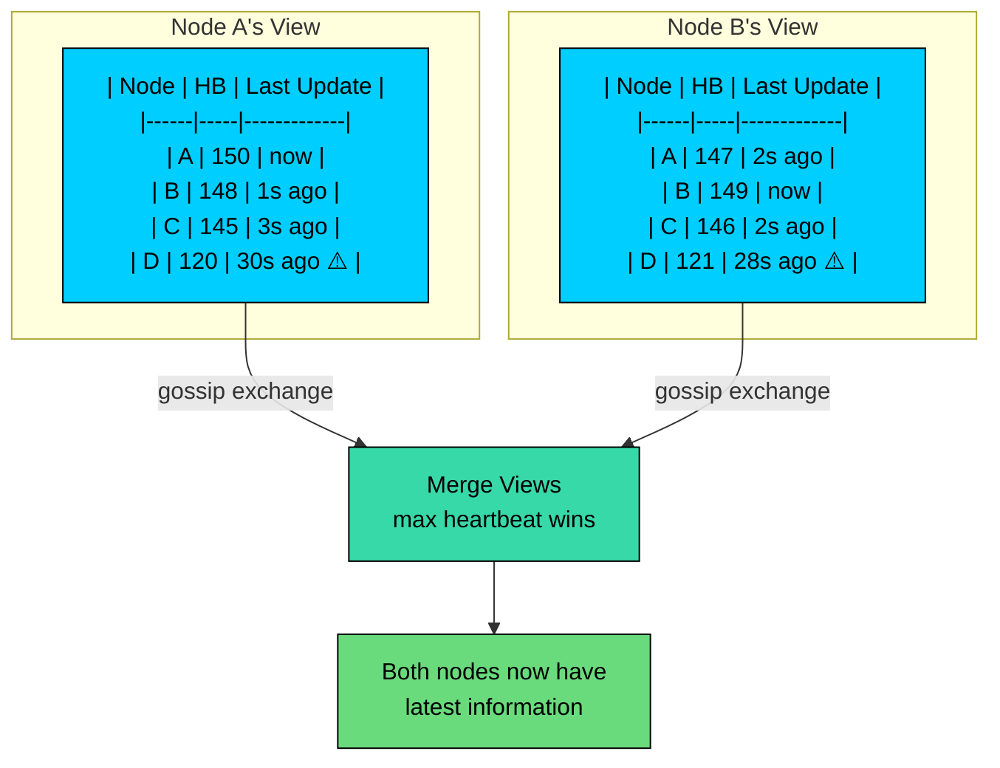

Here's how gossip spreads failure information through the cluster:

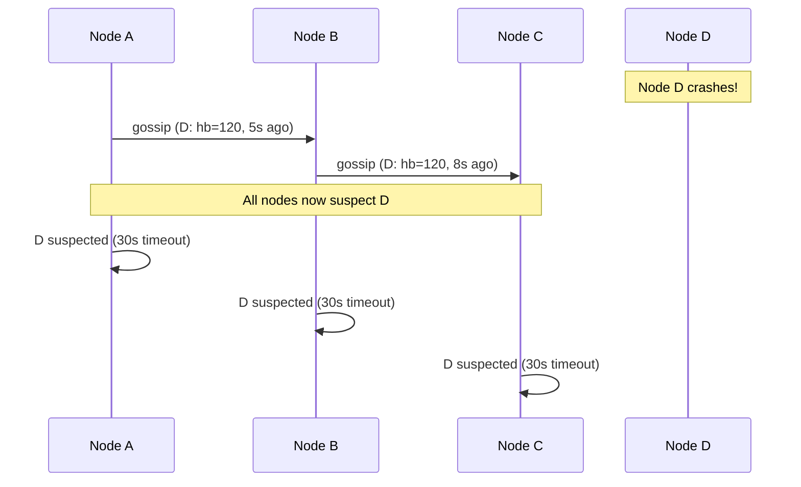

Each node increments its own heartbeat counter periodically. During gossip, nodes exchange their views and merge them.

**Pros:**

- Decentralized, no single point of failure
- Scales well to large clusters
- Information spreads without central coordination

**Cons:**

- Eventually consistent (not immediate detection)
- More complex to implement
- Detection time depends on gossip frequency

---

# 5. The Trade-offs You Must Consider

Understanding these trade-offs is essential for system design interviews. When an interviewer asks about failure detection, they want to see that you understand there's no perfect solution.

### 5.1 Detection Time vs False Positives

This is the fundamental trade-off. You cannot have both fast detection and zero false positives.

**Aggressive settings (low timeout):**

- Fast failover
- Quick recovery
- But: Nodes marked dead during GC pauses, network blips

**Conservative settings (high timeout):**

- Accurate detection
- Fewer unnecessary failovers
- But: Longer downtime when failures actually occur

### 5.2 The Cost of False Positives

A false positive (marking a healthy node as dead) triggers unnecessary actions:

- Load balancer removes a working server
- Cluster rebalances data unnecessarily
- New leader elected while old leader is still working (split-brain!)
- Unnecessary alerts wake up on-call engineers

In systems where these actions are expensive (like data rebalancing), conservative timeouts are preferred.

### 5.3 The Cost of Slow Detection

Slow detection means:

- Extended downtime
- Users experience errors
- Data unavailable until failover
- SLA violations

In user-facing systems where availability is critical, faster detection is worth some false positives.

### 5.4 Choosing the Right Timeout

The timeout value should account for all sources of delay in your system:

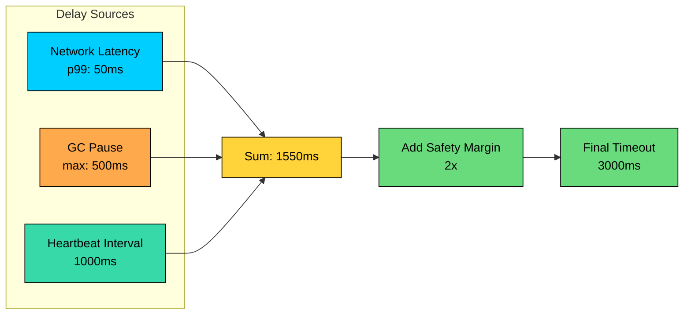

**Rule of thumb:**

Consider these factors when choosing your timeout:

- Network latency (use p99, not average!)
- GC pause times
- Disk I/O latency
- Cost of false positives in your system
- Required availability SLA

---

# 6. Real-World Implementations

Let's look at how production systems implement failure detection. Understanding these implementations will help you discuss concrete examples in interviews.

### 6.1 Apache Cassandra

Cassandra uses the **Phi Accrual Failure Detector** combined with gossip.

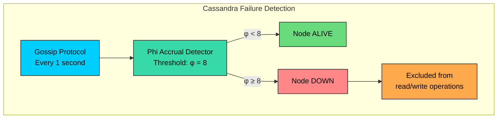

**How it works:**

1. Nodes gossip every second, exchanging heartbeat information
2. Each node calculates phi for every other node
3. When phi exceeds 8, the node is marked as DOWN
4. Marked-down nodes are excluded from read/write operations

Cassandra chose phi accrual because it automatically adapts to different network conditions across data centers.

### 6.2 Apache ZooKeeper

ZooKeeper uses **session-based failure detection**.

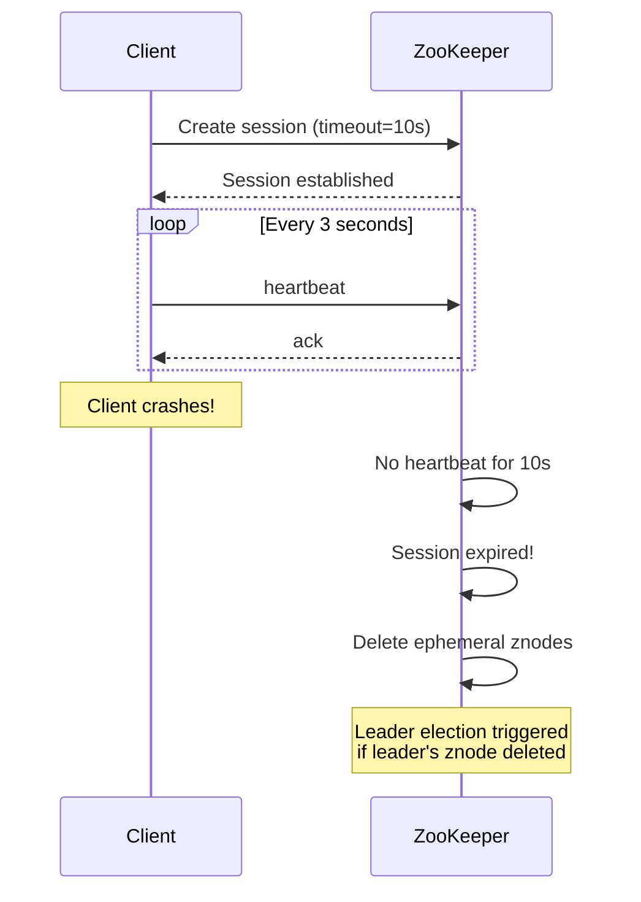

**How it works:**

1. Clients maintain sessions with ZooKeeper servers
2. Sessions have a timeout (default: 6-40 seconds)
3. Clients send heartbeats within 1/3 of session timeout
4. If no heartbeat received within session timeout, session expires
5. Ephemeral nodes created by that client are deleted

This is used for leader election: the leader creates an ephemeral node, and if it dies, the node disappears, triggering a new election.

### 6.3 Kubernetes

Kubernetes uses multiple layers of failure detection, providing defense in depth:

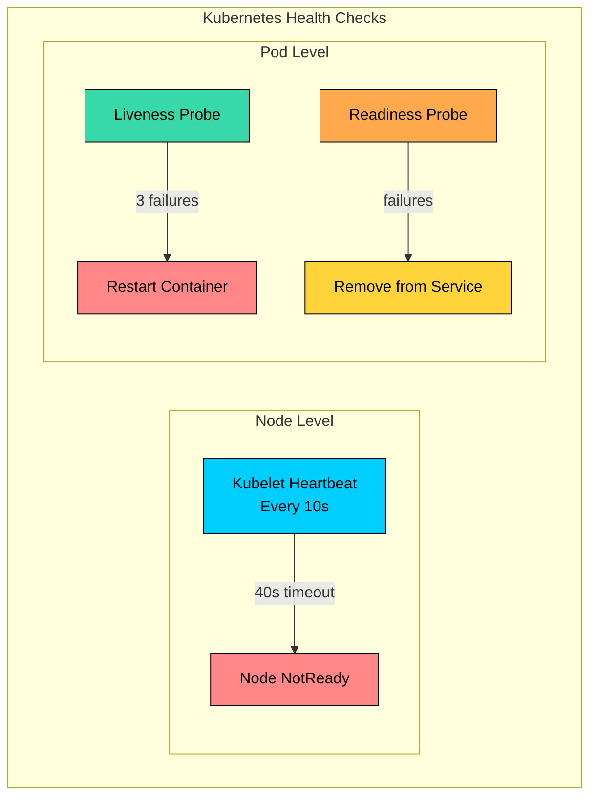

**Probe types:**

- **Liveness Probe:** Is the container alive" If not, restart it.
- **Readiness Probe:** Can the container serve traffic" If not, remove from load balancer.

### 6.4 Consul

HashiCorp Consul uses the **SWIM protocol** (Scalable Weakly-consistent Infection-style Process Group Membership).

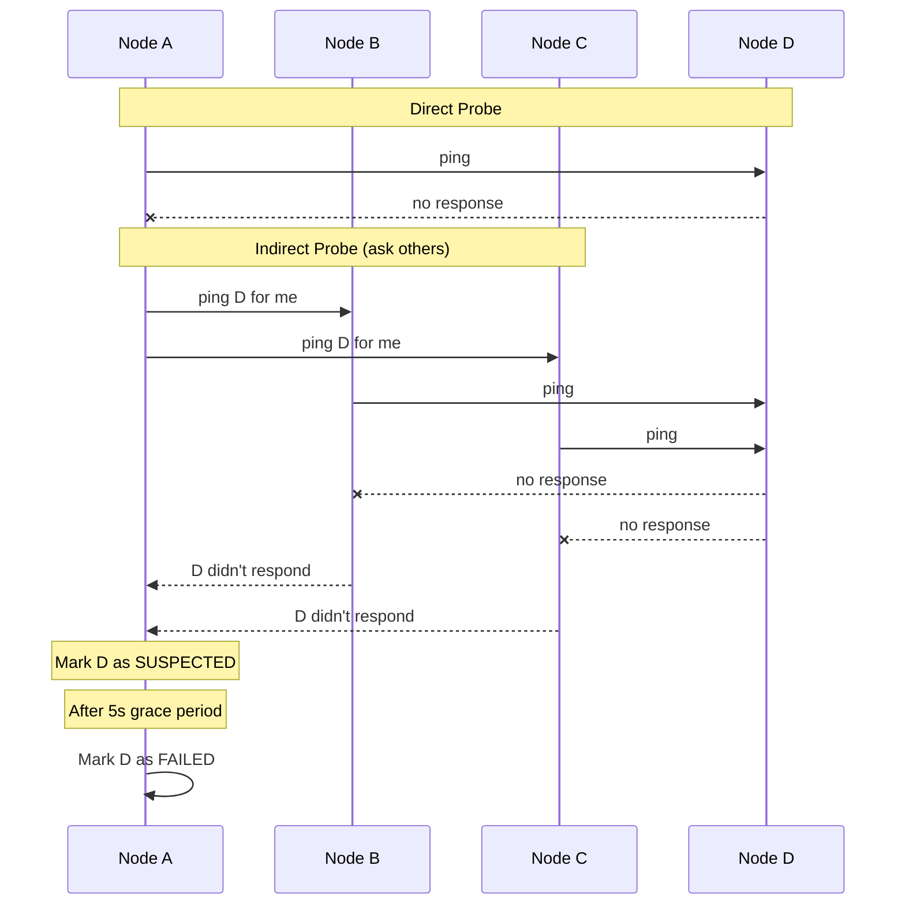

**How SWIM works:**

1. Each node periodically pings a random peer
2. If no response, ask other nodes to ping the suspect (indirect probe)
3. If others also get no response, mark as suspected
4. After grace period, mark as failed

SWIM's indirect probing reduces false positives from network issues between specific node pairs. If A can't reach D but B and C can, D won't be falsely marked as dead.

### 6.6 Comparison of Real-World Implementations

Here's how these systems compare:

| System | Detection Method | Timeout | Architecture |
|--------|-----------------|---------|--------------|
| **Cassandra** | Phi Accrual + Gossip | Adaptive (φ=8) | Decentralized |
| **ZooKeeper** | Session-based | 6-40s | Centralized |
| **Kubernetes** | Multi-layer probes | 40s (node) | Hierarchical |
| **Consul** | SWIM protocol | Configurable | Decentralized |

---

# 7. Best Practices

These practices will help you design robust failure detection systems and demonstrate depth in interviews.

### 7.1 Use Multiple Health Signals

Don't rely on heartbeats alone. Combine multiple signals:

```mermaid
flowchart TD
    subgraph Signals["Health Signals"]
        HB[Heartbeat<br/>Liveness]:::primary
        REQ[Can serve requests"<br/>Readiness]:::secondary
        LOAD[What's the load"<br/>Capacity]:::orange
        ERR[Any errors"<br/>Quality]:::yellow
    end

    HB --> AND
    REQ --> AND
    LOAD --> AND
    ERR --> AND

    AND{All signals<br/>positive"}:::purple

    AND -->|Yes| Healthy[HEALTHY]:::green
    AND -->|No| Unhealthy[UNHEALTHY]:::red

    classDef primary fill:#00ceff,stroke:#000,color:#000
    classDef secondary fill:#38d9a9,stroke:#000,color:#000
    classDef orange fill:#ffa94d,stroke:#000,color:#000
    classDef yellow fill:#ffd43b,stroke:#000,color:#000
    classDef purple fill:#9775fa,stroke:#000,color:#000
    classDef green fill:#69db7c,stroke:#000,color:#000
    classDef red fill:#ff8787,stroke:#000,color:#000
```

### 7.2 Implement Graceful Degradation

Before marking a node as failed, try less drastic measures:

```mermaid
flowchart LR
    S1[Slow responses]:::yellow -->|"Reduce traffic"| S2[Some failures]:::orange
    S2 -->|"Stop new requests"| S3[All failures]:::orange
    S3 -->|"Remove from rotation"| S4[No heartbeat]:::red
    S4 -->|"Mark as failed"| S5[Prolonged failure]:::red
    S5 -->|"Trigger replacement"| S6[Node replaced]:::green

    classDef yellow fill:#ffd43b,stroke:#000,color:#000
    classDef orange fill:#ffa94d,stroke:#000,color:#000
    classDef red fill:#ff8787,stroke:#000,color:#000
    classDef green fill:#69db7c,stroke:#000,color:#000
```

### 7.3 Handle Network Partitions

A network partition can make healthy nodes appear dead. Design for this:

```mermaid
flowchart LR
    subgraph PartitionA["Partition A"]
        N1[Node 1]:::primary
        N2[Node 2]:::primary
    end

    subgraph PartitionB["Partition B"]
        N3[Node 3]:::secondary
        N4[Node 4]:::secondary
    end

    PartitionA -.->|"❌ Network<br/>Partition"| PartitionB

    Note1[A thinks B is dead]:::orange
    Note2[B thinks A is dead]:::orange

    classDef primary fill:#00ceff,stroke:#000,color:#000
    classDef secondary fill:#38d9a9,stroke:#000,color:#000
    classDef orange fill:#ffa94d,stroke:#000,color:#000
```

**Solution:** Use quorum-based decisions

- Need majority agreement before declaring failure
- Prevents both partitions from taking independent action (split-brain)

### 7.4 Log and Alert on Failure Detection Events

Make failure detection observable:

- Log every state transition (HEALTHY → SUSPECTED → FAILED)
- Track detection times
- Alert on frequent state changes (flapping)
- Dashboard showing cluster health over time

### 7.5 Test Your Failure Detection

Regularly verify that failure detection works:

- Chaos testing: Kill nodes and measure detection time
- Network partition testing: Isolate nodes and verify behavior
- Slow node testing: Inject latency and check for false positives
- GC pause simulation: Verify nodes aren't marked dead during pauses

---

# References

- [The Phi Accrual Failure Detector](https://www.computer.org/csdl/proceedings-article/srds/2004/22390066/12OmNwlcDYZ) - Original paper by Hayashibara et al. describing the phi accrual approach
- [SWIM: Scalable Weakly-consistent Infection-style Process Group Membership Protocol](https://www.cs.cornell.edu/projects/Quicksilver/public_pdfs/SWIM.pdf) - The protocol behind Consul and Serf
- [Cassandra Failure Detection Documentation](https://cassandra.apache.org/doc/latest/cassandra/architecture/dynamo.html#failure-detection) - How Cassandra implements failure detection
- [Designing Data-Intensive Applications](https://dataintensive.net/) - Chapter 8 covers unreliable networks and failure detection
- [ZooKeeper Internals](https://zookeeper.apache.org/doc/r3.9.1/zookeeperInternals.html) - Session management and heartbeats in ZooKeeper

---

# Quiz
