Your payment service just crashed during Black Friday peak traffic. Thousands of orders are stuck mid-transaction. The recommendation engine is timing out, making the entire product page load slowly. Users are abandoning their carts. Revenue is bleeding by the second.

This scenario is not hypothetical. It happens to companies every day. In distributed systems, failures are not exceptions but expectations. Hardware fails, networks partition, software has bugs, and dependencies become unavailable.

The difference between resilient systems and fragile ones is not the absence of failures. It is how they handle failures when they inevitably occur.

In this chapter, we will explore battle-tested strategies for handling failures in distributed systems. You will learn how to build systems that bend but do not break.

---

# Why Failures Are Inevitable

> [!PAYWALL] This content is for premium members only.

In a distributed system, you have many components communicating over a network. Each component can fail independently, and the network itself is unreliable.

Consider a simple e-commerce checkout flow:

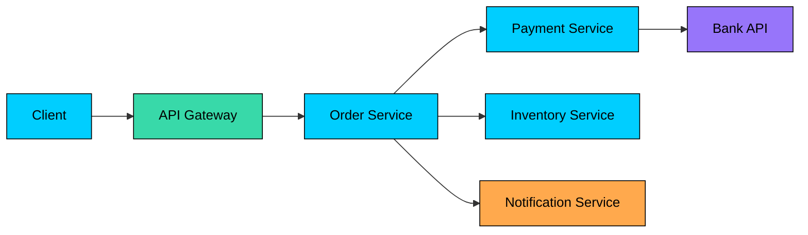

This simple flow has multiple failure points:

- **Network failures:** Packets lost, connections timeout
- **Hardware failures:** Servers crash, disks fail
- **Software failures:** Bugs, memory leaks, deadlocks
- **Dependency failures:** External APIs become unavailable
- **Overload failures:** Too much traffic overwhelms services
- **Human failures:** Misconfigurations, bad deployments

The probability of at least one failure increases exponentially with the number of components. If each service has 99.9% availability, a request touching five services has only 99.5% success rate at best.

---

# 1. Types of Failures

Understanding failure types helps you choose the right handling strategy.

### 1.1 Transient Failures

These are temporary issues that resolve themselves. The same request might succeed if retried.

**Examples:**

- Network timeouts due to momentary congestion
- Service temporarily overloaded
- Database connection pool exhausted
- Temporary DNS resolution failures

**Handling strategy:** Retry with exponential backoff

### 1.2 Permanent Failures

These failures will not resolve without intervention. Retrying will not help.

**Examples:**

- Invalid input data
- Resource not found (404)
- Authentication failures
- Business rule violations

**Handling strategy:** Fail fast, return meaningful error

### 1.3 Intermittent Failures

These fail sporadically, working sometimes and failing other times.

**Examples:**

- Flaky network connections
- Memory pressure causing occasional failures
- Race conditions
- Load-dependent failures

**Handling strategy:** Retry with limits, circuit breaker

### 1.4 Cascading Failures

One service failure causes downstream services to fail, creating a domino effect.

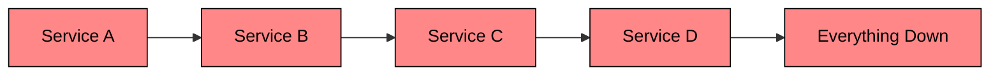

**Examples:**

- Database overload spreads to all dependent services
- One slow service exhausts thread pools in callers
- Network partition isolates multiple services

**Handling strategy:** Circuit breakers, bulkheads, timeouts

---

# 2. Failure Handling Strategies

## 2.1 Retries with Exponential Backoff

The simplest strategy: if a request fails, try again. But naive retries can make things worse by adding more load to an already struggling service.

**Exponential backoff** spaces out retries with increasing delays:

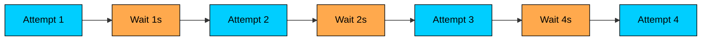

**Key parameters:**

| Parameter | Description | Typical Value |
|-----------|-------------|---------------|
| Initial delay | First retry wait time | 100ms - 1s |
| Multiplier | Delay increase factor | 2x |
| Max delay | Cap on wait time | 30s - 60s |
| Max retries | Total retry attempts | 3 - 5 |
| Jitter | Randomization to prevent thundering herd | 0 - 100% of delay |

**Jitter is critical.** Without it, all failed requests retry at exactly the same time, creating a thundering herd that can overwhelm the recovering service.

**When to retry:**

- HTTP 429 (Too Many Requests)
- HTTP 503 (Service Unavailable)
- HTTP 504 (Gateway Timeout)
- Connection timeouts
- Transient network errors

**When NOT to retry:**

- HTTP 400 (Bad Request)
- HTTP 401/403 (Authentication/Authorization)
- HTTP 404 (Not Found)
- Business logic failures

---

## 2.2 Circuit Breakers

Retries help with transient failures, but what if a service is completely down" Continuing to retry wastes resources and adds load to a failing service.

A **circuit breaker** monitors for failures and "trips open" when a threshold is exceeded. Once open, it fails requests immediately without attempting the call.

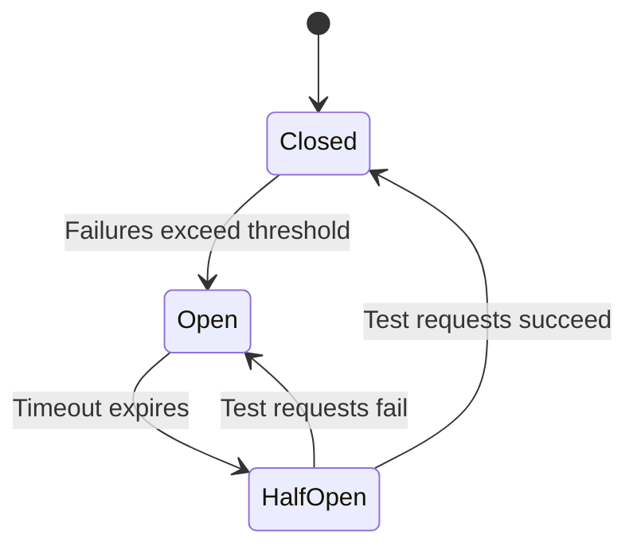

**The three states:**

| State | Behavior | Transition |
|-------|----------|------------|
| **Closed** | Requests pass through normally | Opens when failure rate exceeds threshold |
| **Open** | Requests fail immediately | Transitions to half-open after timeout |
| **Half-Open** | Limited test requests allowed | Closes if tests succeed, reopens if they fail |

**Configuration parameters:**

- **Failure threshold:** Percentage of failures to trigger open (e.g., 50%)
- **Window size:** Number of requests to evaluate (e.g., last 100)
- **Timeout:** How long to stay open before testing (e.g., 60 seconds)
- **Test requests:** Number of requests to try in half-open (e.g., 3)

**Benefits:**

- Fails fast, freeing up resources
- Gives failing service time to recover
- Prevents cascade failures
- Provides clear signal for monitoring

---

## 2.3 Timeouts

Every external call should have a timeout. Without timeouts, a slow or unresponsive service can block threads indefinitely, exhausting your resources.

**Types of timeouts:**

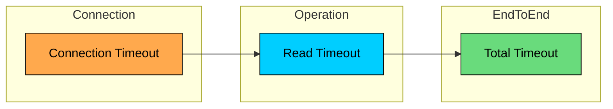

| Timeout Type | What It Limits | Typical Value |
|--------------|----------------|---------------|
| **Connection timeout** | Time to establish TCP connection | 1-5 seconds |
| **Read timeout** | Time to receive response after sending request | 5-30 seconds |
| **Total timeout** | End-to-end time including retries | 30-120 seconds |

**Choosing timeout values:**

1. Measure p99 latency of the service under normal conditions
2. Add buffer for occasional slowness (typically 2-3x p99)
3. Consider downstream timeouts (your timeout must be longer)
4. Account for retry delays if retries are enabled

**Common mistake:** Setting the same timeout everywhere. Critical paths should have shorter timeouts than background jobs.

---

## 2.4 Fallbacks

When a service fails, what do you show the user" A fallback provides a degraded but functional experience.

**Fallback strategies:**

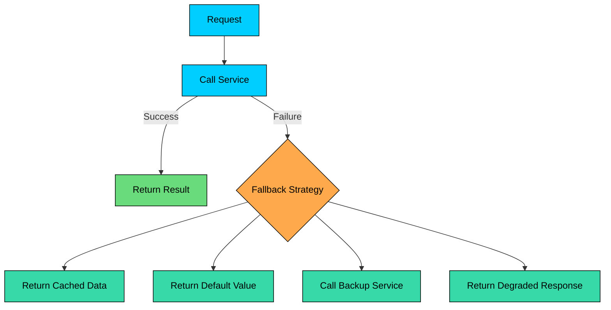

| Strategy | When to Use | Example |
|----------|-------------|---------|
| **Cached data** | Stale data is acceptable | User profile, product catalog |
| **Default value** | Generic value is better than nothing | Empty list, placeholder image |
| **Backup service** | Redundant providers available | Multiple payment gateways |
| **Degraded response** | Partial functionality is sufficient | Show products without recommendations |
| **Queue for later** | Eventual processing is acceptable | Order confirmation emails |

**Real-world examples:**

- **Netflix:** If recommendation service fails, show trending content
- **Amazon:** If review service fails, show product without reviews
- **Uber:** If surge pricing service fails, use last known prices
- **Twitter:** If following feed fails, show cached tweets

---

## 2.5 Bulkheads

Named after ship compartments that prevent a hull breach from sinking the entire ship, **bulkheads** isolate failures to prevent them from spreading.

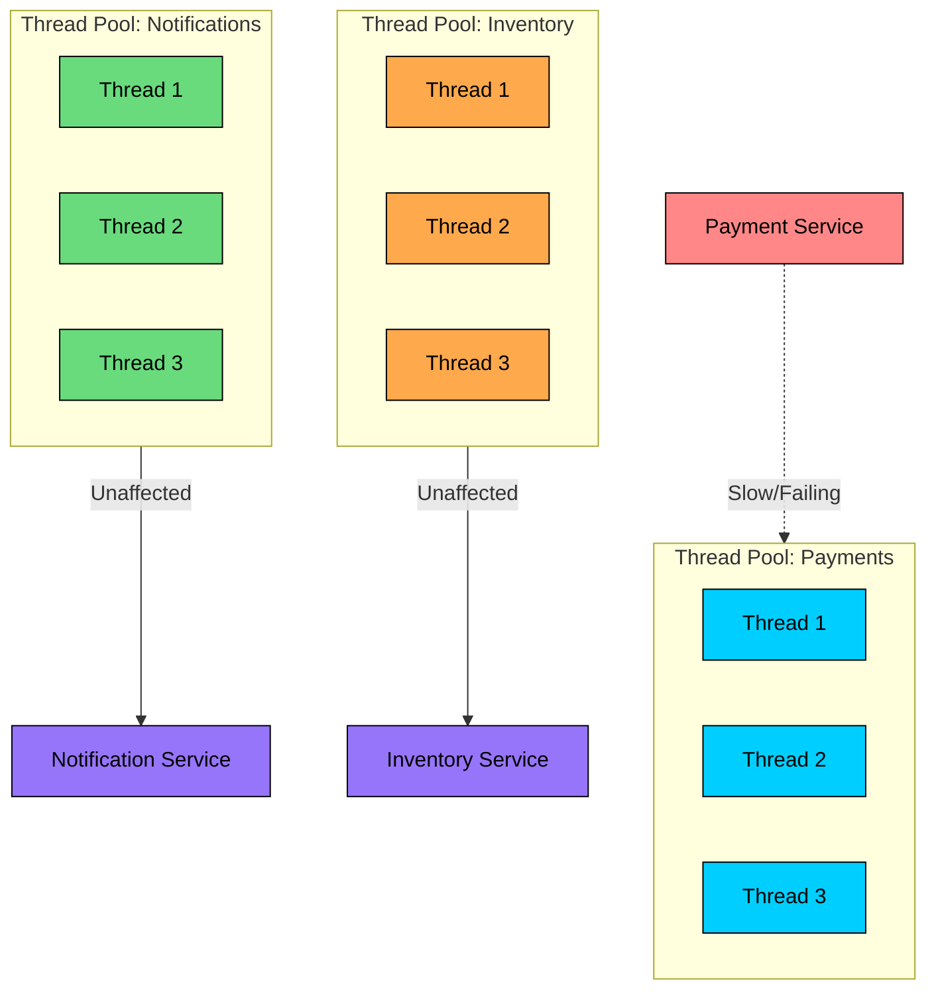

**Types of bulkheads:**

| Type | Isolation Level | Use Case |
|------|-----------------|----------|
| **Thread pool** | Separate thread pools per service | HTTP clients, database connections |
| **Connection pool** | Separate connection pools | Different databases, external APIs |
| **Process** | Separate processes | Critical vs non-critical workloads |
| **Container** | Separate containers/pods | Microservices architecture |
| **Region** | Separate data centers | Geographic fault tolerance |

**Without bulkhead:** One slow service exhausts all threads, everything stops.

**With bulkhead:** One slow service exhausts its own pool, other services continue.

---

## 2.6 Idempotency

In distributed systems, requests can be duplicated due to retries, network issues, or client bugs. **Idempotency** ensures that processing the same request multiple times produces the same result as processing it once.

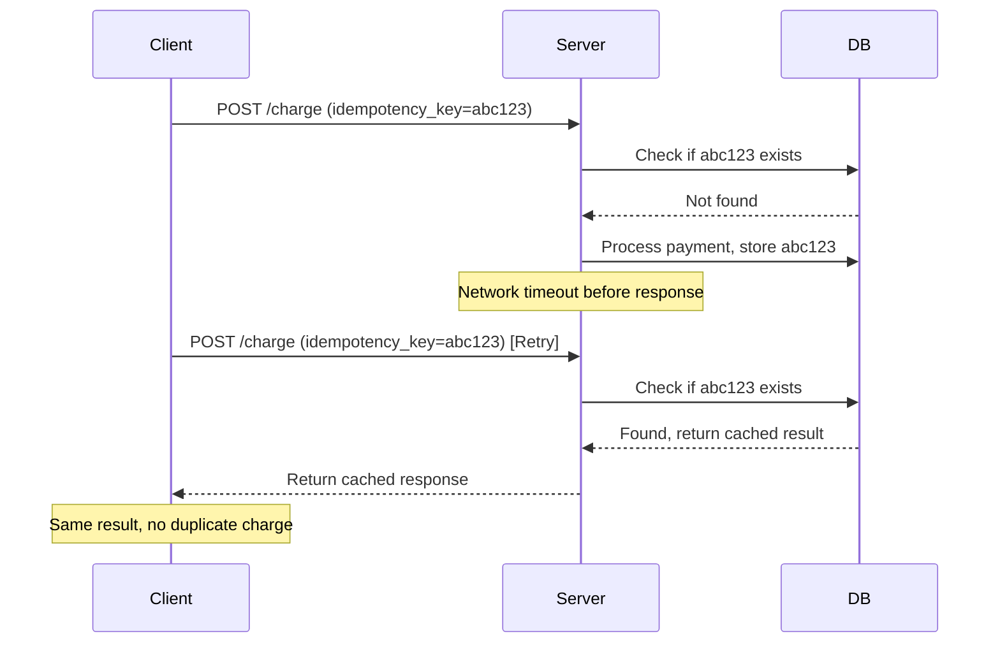

**Implementation patterns:**

1. **Idempotency keys:** Client generates unique ID for each logical request
2. **Database constraints:** Use unique keys to prevent duplicate inserts
3. **Conditional updates:** Use version numbers or ETags
4. **Natural idempotency:** Design operations to be inherently safe to repeat

**Naturally idempotent operations:**

- GET, PUT, DELETE in REST
- SET key value (not INCREMENT)
- Upsert with unique constraint

**Non-idempotent operations (need special handling):**

- POST (create new resource)
- INCREMENT counter
- Append to list
- Send email/notification

---

## 2.7 Graceful Degradation

When under stress, shed non-critical functionality to preserve core features.

```mermaid
flowchart TD
    Load[System Load]:::primary --> Check{Load Level"}

    Check -->|Normal| Full[Full Functionality]:::green
    Check -->|High| Reduced[Reduced Features]:::orange
    Check -->|Critical| Core[Core Features Only]:::red

    Full --> F1[Search with filters]
    Full --> F2[Personalized recommendations]
    Full --> F3[Real-time inventory]

    Reduced --> R1[Basic search]
    Reduced --> R2[Generic recommendations]
    Reduced --> R3[Cached inventory]

    Core --> C1[Product listing]
    Core --> C2[Checkout]
    Core --> C3[Order processing]

    classDef primary fill:#00ceff,stroke:#000,color:#000
    classDef green fill:#69db7c,stroke:#000,color:#000
    classDef orange fill:#ffa94d,stroke:#000,color:#000
    classDef red fill:#ff8787,stroke:#000,color:#000
```

**Degradation levels:**

| Level | Trigger | Actions |
|-------|---------|---------|
| **Normal** | System healthy | All features available |
| **Warning** | Load at 70% capacity | Disable expensive features (real-time search, personalization) |
| **Critical** | Load at 90% capacity | Serve cached content, disable non-essential services |
| **Emergency** | System overloaded | Core functionality only, static fallbacks |

**Examples:**

- **E-commerce:** Disable real-time inventory checks, show "usually in stock"
- **Social media:** Disable comments, show cached like counts
- **Video streaming:** Reduce video quality, disable autoplay
- **Search engine:** Return cached results, disable spelling suggestions

**Implementation:**

- Use feature flags to control functionality
- Monitor system metrics (CPU, memory, queue depth)
- Automate degradation decisions based on thresholds
- Have manual override for operators

---

## 2.8 Failover

When a primary resource fails, automatically switch to a backup. This applies to servers, databases, data centers, and cloud regions.

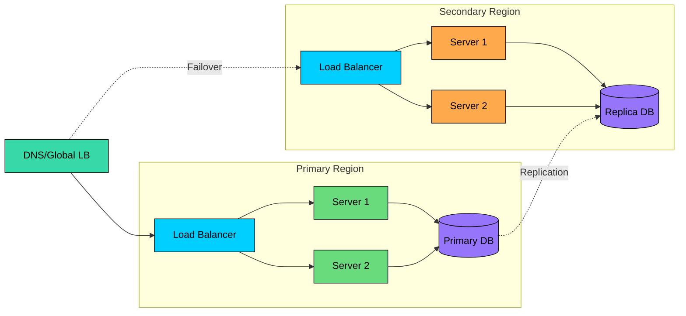

**Failover types:**

| Type | Recovery Time | Data Loss Risk | Complexity |
|------|---------------|----------------|------------|
| **Cold standby** | Minutes to hours | Low | Low |
| **Warm standby** | Seconds to minutes | Very low | Medium |
| **Hot standby** | Seconds | Minimal | High |
| **Active-active** | None (instant) | None | Highest |

**Key considerations:**

1. **Detection:** How quickly do you detect the failure"
2. **Decision:** Who/what decides to failover"
3. **Execution:** How long does the switch take"
4. **Data consistency:** What about in-flight transactions"
5. **Failback:** How do you return to normal"

**Split-brain problem:** Both primary and backup think they are the leader. Prevent this with:

- Quorum-based consensus
- Fencing (STONITH: Shoot The Other Node In The Head)
- Lease-based leadership

---

## 2.9 Data Replication

Store copies of data on multiple nodes so that if one fails, others can serve the request.

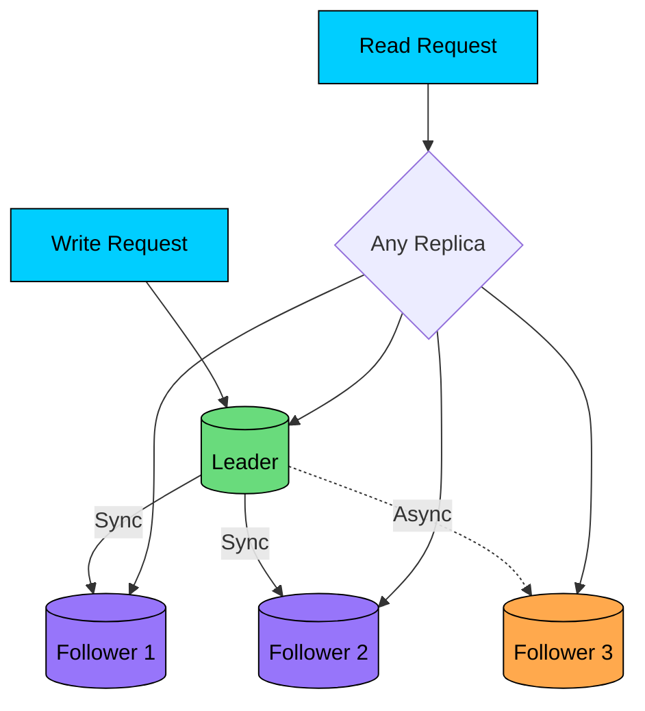

**Replication strategies:**

| Strategy | Consistency | Availability | Latency | Data Loss |
|----------|-------------|--------------|---------|-----------|
| **Synchronous** | Strong | Lower | Higher | None |
| **Asynchronous** | Eventual | Higher | Lower | Possible |
| **Semi-synchronous** | Strong for reads | Balanced | Medium | Minimal |

**Quorum writes and reads:**

For N replicas, with W write confirmations and R read queries:

- **W + R > N:** Strong consistency (reads see latest write)
- **W = N, R = 1:** Maximize read performance
- **W = 1, R = N:** Maximize write performance

**Common configurations:**

| Configuration | W | R | Trade-off |
|---------------|---|---|-----------|
| Read-optimized | 3 | 1 | Fast reads, slower writes |
| Write-optimized | 1 | 3 | Fast writes, slower reads |
| Balanced | 2 | 2 | Balance of speed and consistency |

---

# 3. Combining Strategies

In practice, you use multiple strategies together:

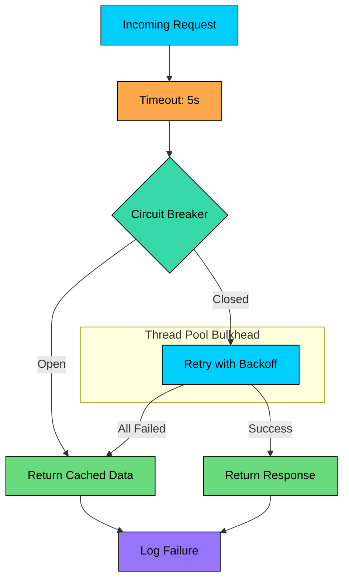

**Typical layered approach:**

1. **Timeout:** Limit how long to wait
2. **Retry:** Try again for transient failures (with exponential backoff)
3. **Circuit breaker:** Stop trying after repeated failures
4. **Bulkhead:** Isolate resources per dependency
5. **Fallback:** Provide degraded functionality
6. **Monitoring:** Track failures and alert

**Order matters.** Retries should be inside the circuit breaker. If you put the circuit breaker inside retries, each retry would check an already-open circuit.

---

# 4. Best Practices

### 4.1 Design for Failure

Assume everything will fail and design accordingly:

- What happens if the database is unavailable"
- What happens if a downstream service is slow"
- What happens during a network partition"
- What happens if there is a sudden traffic spike"

Answer these questions before writing code.

### 4.2 Fail Fast

If something is going to fail, fail quickly. Slow failures are worse because they consume resources and block other operations.

- Use short timeouts
- Trip circuit breakers early
- Validate input at the edge
- Reject requests when overloaded

### 4.3 Make Failures Visible

You cannot fix what you cannot see:

- Log every failure with context
- Track failure rates per dependency
- Alert on abnormal patterns
- Dashboard showing circuit breaker states

### 4.4 Test Failure Handling

Untested failure handling code probably does not work:

- Unit test fallback logic
- Integration test with simulated failures
- Chaos engineering in production
- Regular disaster recovery drills

### 4.5 Automate Recovery

Manual intervention does not scale:

- Auto-scaling for load spikes
- Automatic failover for node failures
- Self-healing for known issues
- Runbooks for complex scenarios

---

# 6. Summary

Handling failures is not about preventing all failures. That is impossible in distributed systems. It is about building systems that continue to function, perhaps in a degraded mode, when failures occur.

In interviews, do not just say "we will retry" or "we will use a circuit breaker." Explain the parameters you would choose, the trade-offs involved, and how these strategies work together to create a resilient system.

---

# References

- [Release It!](https://pragprog.com/titles/mnee2/release-it-second-edition/) by Michael Nygard - The definitive book on stability patterns
- [Resilience4j Documentation](https://resilience4j.readme.io/) - Modern Java resilience library with circuit breakers, retries, and more
- [AWS Architecture Blog: Retry Behavior](https://aws.amazon.com/blogs/architecture/exponential-backoff-and-jitter/) - Deep dive on exponential backoff with jitter
- [Netflix Tech Blog: Making the Netflix API More Resilient](https://netflixtechblog.com/making-the-netflix-api-more-resilient-a8ec62f4d9f) - How Netflix handles failures at scale
- [Google SRE Book: Handling Overload](https://sre.google/sre-book/handling-overload/) - Google's approach to load shedding and graceful degradation
- [Martin Kleppmann: Designing Data-Intensive Applications](https://dataintensive.net/) - Chapters 8-9 cover distributed systems reliability

---

# Quiz
