How does TikTok know exactly what videos will keep you scrolling for hours" How does Amazon suggest products you didn't even know you wanted" How does Netflix queue up shows that match your taste perfectly"

Behind all these experiences is a **recommendation system**, and it's one of the most impactful patterns in modern system design. These systems drive engagement, revenue, and user satisfaction across virtually every major platform. Get them right, and users stay glued to your product. Get them wrong, and they leave.

This pattern shows up constantly in system design interviews, whether you're designing TikTok, Netflix, Amazon, a dating app, or a news feed. Interviewers want to see that you understand how to generate relevant recommendations at scale, how to balance personalization with freshness, and how to handle the tricky cold start problem when you have no data about a new user.

In this chapter, we'll explore the recommendation pattern in depth. We'll look at different algorithms, understand their trade-offs, and learn how to design recommendation systems for various use cases.

---

# What are Recommendations"

> [!PAYWALL] This content is for premium members only.

At its core, a **recommendation system** predicts what items a user will find relevant or interesting based on the data you have about them. The goal sounds simple: surface the right content to the right user at the right time. But as we'll see, achieving this at scale involves some fascinating engineering challenges.

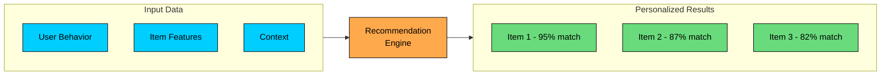

Every recommendation system answers one fundamental question: **Given what we know about this user, which items should we show them"**

The "what we know" part is critical. You're working with three types of input data:

| Input Type | Examples |
|------------|----------|
| **User signals** | Clicks, watches, purchases, likes, time spent, searches |
| **Item attributes** | Category, tags, price, creator, popularity, freshness |
| **Context** | Time of day, device, location, session history |

The richer your signals, the better your recommendations can be. But even with limited data, you can build something useful.

---

# Where Recommendations Are Used

Recommendation systems appear across nearly every consumer-facing product:

| Domain | Use Case | What Gets Recommended |
|--------|----------|----------------------|
| **Short-form Video** | TikTok, Instagram Reels, YouTube Shorts | Next video in feed |
| **Streaming** | Netflix, YouTube, Spotify | Movies, videos, songs |
| **E-commerce** | Amazon, Shopify, eBay | Products to buy |
| **Dating** | Tinder, Bumble, Hinge | Potential matches |
| **Social/News** | Facebook, Twitter, Reddit | Posts in feed |
| **Job Platforms** | LinkedIn, Indeed | Job listings, candidates |
| **Food Delivery** | DoorDash, Uber Eats | Restaurants, dishes |
| **Travel** | Airbnb, Booking.com | Listings, destinations |

Each domain has unique constraints. Dating apps need two-sided matching. E-commerce has inventory limits. Video platforms optimize for watch time. But the core pattern remains the same: collect signals, compute relevance, and rank results.

---

# Core Challenges

Before diving into algorithms, let's understand the fundamental challenges that make recommendation systems hard. Every approach we'll discuss later is essentially trying to solve one or more of these problems.

### 1. The Cold Start Problem

This is the chicken-and-egg problem of recommendations. How do you recommend items to a new user when you have no history to work with" And how do you recommend a new item when no one has interacted with it yet"

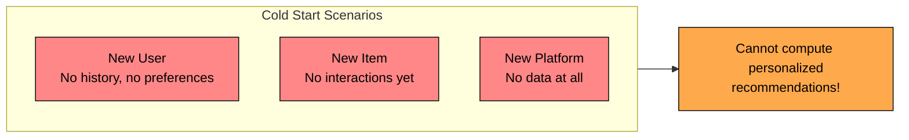

There's no perfect solution, but several strategies help:

| Approach | How It Works |
|----------|--------------|
| **Popularity-based** | Show trending or popular items to new users. Not personalized, but better than nothing. |
| **Demographic** | Use age, location, or signup source for initial recommendations. |
| **Onboarding survey** | Ask users to select preferences during signup. TikTok and Spotify do this well. |
| **Content-based for new items** | Recommend based on item features rather than user interactions. |
| **Exploration** | Actively show new items to gather initial signals. Accept some short-term engagement loss for long-term learning. |

In practice, you'll use a combination of these. TikTok, for example, shows highly diverse content to new users and watches closely which videos they finish versus skip. Within minutes, they have enough signal to start personalizing.

### 2. The Sparsity Problem

Here's a sobering reality: most users interact with only a tiny fraction of available items. If you have a million users and ten million items, that's a user-item matrix with 10 trillion cells. But you might only have a billion actual interactions. That's 99.99% empty.

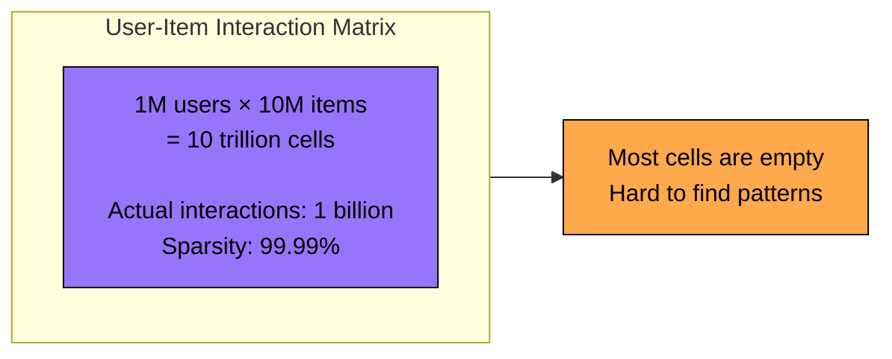

This sparsity makes it hard to find patterns. How do you know User A and User B have similar tastes if they've only seen 100 items out of 10 million, and only 2 of those overlap"

**Solutions:**

- **Dimensionality reduction** through matrix factorization compresses the sparse matrix into dense user and item vectors.
- **Implicit signals** like views and time spent are more abundant than explicit ratings.
- **Content-based features** fill gaps by using item metadata when interaction data is missing.
- **Graph-based approaches** can propagate information through the user-item interaction graph.

### 3. The Scalability Problem

Now for the engineering challenge. Computing recommendations for millions of users across millions of items in real-time is computationally expensive. You can't score every item for every user on every request.

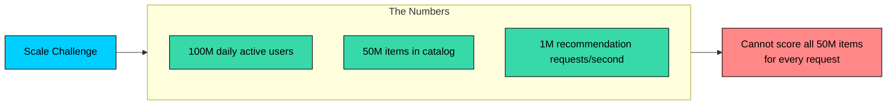

This is why real production systems use a **two-stage architecture**. The first stage uses fast, approximate methods to narrow millions of items down to a few thousand candidates. The second stage applies a more sophisticated ranking model to just those candidates. We'll explore this architecture in detail later.

Other techniques that help:

- **Pre-computation and caching** for stable recommendations.
- **Approximate nearest neighbor search** for embedding-based retrieval.
- **Sharding by user segments** to distribute the load.

### 4. The Freshness vs Relevance Trade-off

Here's a tension that never fully goes away: should you show the most relevant items, which tend to be things the user has shown interest in before, or should you inject fresh content to keep things interesting"

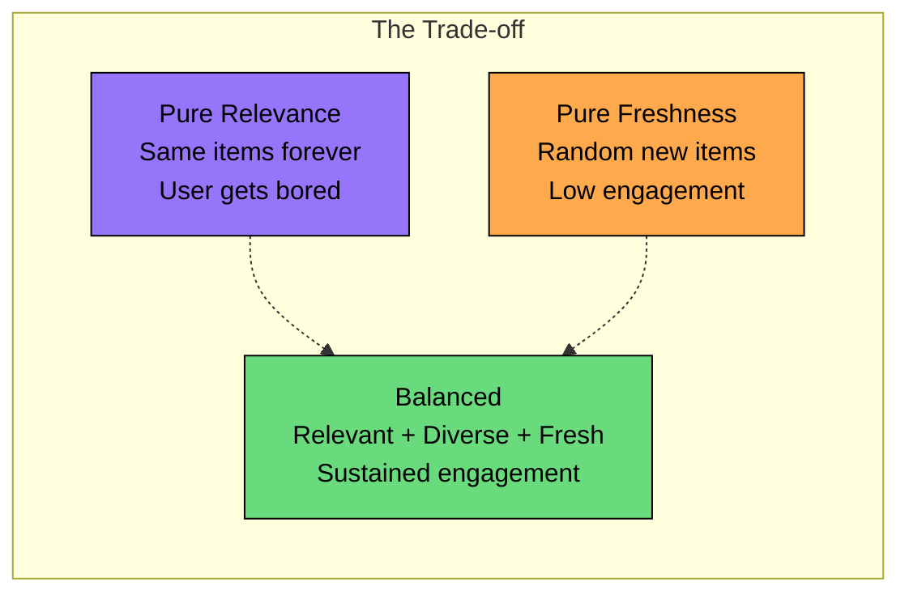

Show only what's relevant, and users eventually get bored seeing the same type of content. Show too much fresh content, and engagement drops because it's not personalized. The sweet spot is somewhere in between, and it varies by domain. News feeds need more freshness than movie recommendations.

### 5. The Filter Bubble Problem

If you only show users content they already like, you create an echo chamber. Someone who watched a few cooking videos starts seeing nothing but cooking content. That might sound fine, but it limits discovery and can make your platform feel stale over time.

Worse, in domains like news, it can reinforce biases and limit exposure to diverse perspectives.

**Solutions:**

- **Inject diversity** in recommendations. Ensure the top 10 results span different categories.
- **Exploration vs exploitation** strategies that occasionally show content outside the user's profile.
- **Serendipity metrics** that measure whether users discover unexpected content they like.
- **Category or topic diversification** rules that prevent any single topic from dominating.

---

# Recommendation Approaches

Now let's look at the main algorithmic approaches. Each has strengths and weaknesses, and production systems typically combine several of them.

### Approach 1: Content-Based Filtering

The simplest approach: recommend items similar to what the user has liked before, based on item features.

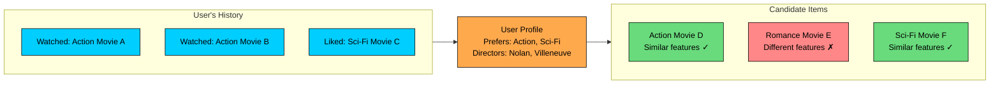

**How It Works:**

1. **Extract item features:** Genre, tags, creator, description, etc.
2. **Build user profile:** Aggregate features from items the user has interacted with.
3. **Compute similarity:** Compare the user profile with candidate items.
4. **Rank and recommend:** Return items with the highest similarity scores.

The key insight is that you're representing both users and items in the same feature space, then measuring how close they are.

**Feature Representation:**

| Pros | Cons |
|------|------|
| Works for new items (no cold start for items) | Limited to item features (misses subtle patterns) |
| Transparent recommendations | Creates filter bubbles |
| No need for other users' data | Requires good feature engineering |
| Fast computation | Cannot recommend outside user's existing profile |

**Best for:** News articles, job listings, products with rich metadata. It's also a great fallback for cold start scenarios since you only need item features, not interaction history.

---

### Approach 2: Collaborative Filtering

This is where things get interesting. Instead of relying on item features, collaborative filtering looks at user behavior patterns. The core idea: "Users who liked X also liked Y."

This is powerful because it can discover non-obvious connections. Maybe action movie fans also tend to like certain documentaries. Content-based filtering would never discover that connection, but collaborative filtering will find it from the data.

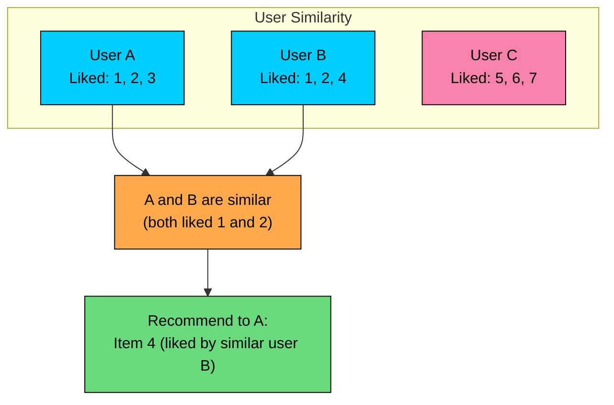

There are two flavors of collaborative filtering:

**User-Based Collaborative Filtering:**

1. Find users with similar taste to the target user.
2. Recommend items those similar users liked but the target user hasn't seen.

**Item-Based Collaborative Filtering:**

1. Find items similar to what the user has liked.
2. Similarity is based on co-occurrence: items that tend to be liked by the same users are considered similar.

Item-based tends to scale better because item-item similarity is more stable than user-user similarity. Users' tastes change, but the relationship between items stays relatively constant.

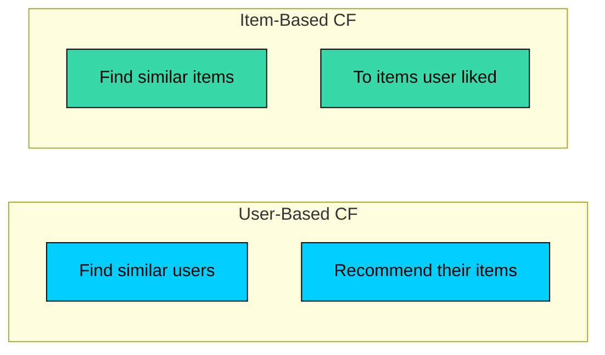

**Matrix Factorization:**

For large-scale systems, the most practical form of collaborative filtering is matrix factorization. The idea is to decompose the sparse user-item matrix into two dense matrices: one for users and one for items.

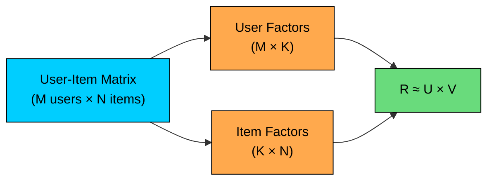

Each user and item is represented as a vector of K latent factors, typically around 50 to 200 dimensions. These factors are learned from the data and don't have explicit meaning, but they capture underlying patterns. Maybe one dimension correlates with "action vs drama" and another with "mainstream vs indie." The model discovers these on its own.

The predicted rating is simply the dot product of user and item vectors:

This approach was famously used by the winning team in the Netflix Prize competition and remains a cornerstone of recommendation systems.

| Pros | Cons |
|------|------|
| Discovers non-obvious patterns | Cold start for new users and items |
| No feature engineering needed | Sparsity issues |
| Can find surprising recommendations | Computationally expensive to train |
| Works across domains | Harder to explain why something was recommended |

**Best for:** Netflix movie recommendations, Spotify playlists, Amazon "customers also bought."

---

### Approach 3: Hybrid Systems

In practice, you rarely use just one approach. Hybrid systems combine content-based and collaborative filtering to get the best of both worlds. Content-based handles cold start for new items. Collaborative filtering discovers patterns across users. Together, they cover each other's weaknesses.

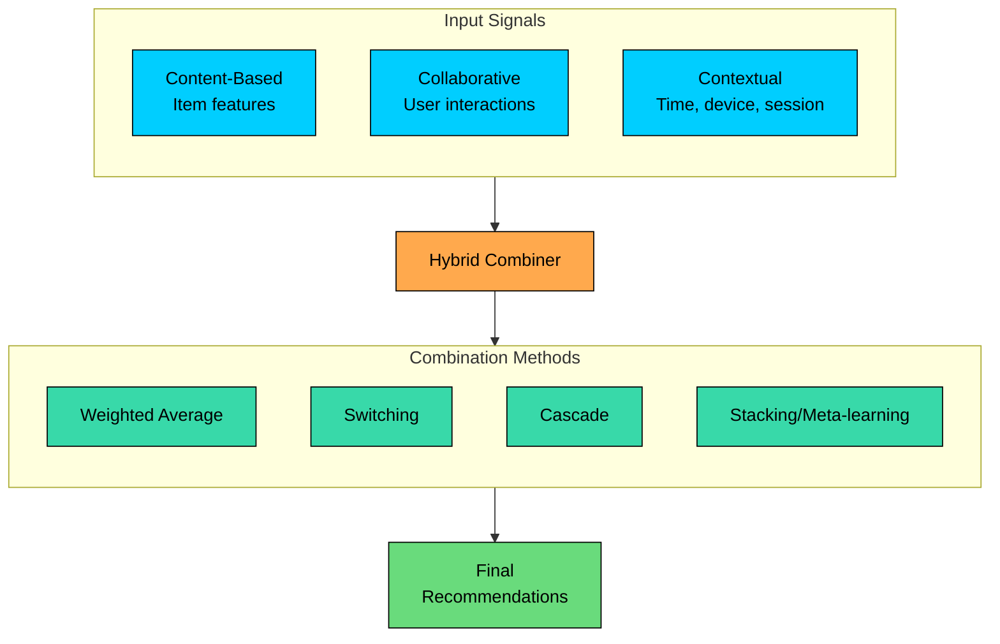

**Combination Strategies:**

| Strategy | How It Works | When to Use |
|----------|--------------|-------------|
| **Weighted** | Score = α × content_score + β × collab_score | Simple baseline, easy to tune |
| **Switching** | Use content for cold start, collab otherwise | Clear cold start scenarios |
| **Cascade** | Content filters candidates, collab ranks | Large item catalogs |
| **Stacking** | Train a model on outputs of base recommenders | When you need maximum accuracy |

**Example: Netflix-style Hybrid**

Here's how a production system might combine these approaches:

Each layer adds value. Collaborative filtering finds relevant candidates. Content filtering refines them. Context makes them timely. Diversity keeps things interesting. Business rules ensure you don't recommend unavailable content.

---

### Approach 4: Deep Learning Approaches

Modern recommendation systems at companies like TikTok, YouTube, and Pinterest use neural networks to learn complex patterns that traditional methods miss. Deep learning excels when you have massive amounts of data and can afford the computational cost.

```mermaid
flowchart TD
    subgraph Features["Input Features"]
		direction TB
        UF["User Features<br/>Demographics, history"]:::primary
        IF["Item Features<br/>Embeddings, metadata"]:::primary
        CF["Context Features<br/>Time, device, session"]:::primary
    end

    Embed["Embedding Layers"]:::secondary

    subgraph Network["Neural Network"]
        DNN["Deep Neural Network<br/>or Transformer"]:::orange
    end

    Score["Relevance Score"]:::green

    Features --> Embed
    Embed --> Network
    Network --> Score

    classDef primary fill:#00ceff,stroke:#000,color:#000
    classDef secondary fill:#38d9a9,stroke:#000,color:#000
    classDef orange fill:#ffa94d,stroke:#000,color:#000
    classDef green fill:#69db7c,stroke:#000,color:#000
```

**Key Deep Learning Models:**

| Model | Description | Used By |
|-------|-------------|---------|
| **Two-Tower** | Separate user/item encoders, dot product similarity | YouTube, Google |
| **Wide & Deep** | Combines memorization (wide) and generalization (deep) | Google Play |
| **DCN** (Deep & Cross) | Explicit feature crosses + deep network | Ads ranking |
| **Transformers** | Self-attention over user history sequence | TikTok, Pinterest |
| **Graph Neural Networks** | Learn from user-item interaction graphs | Pinterest, Uber |

The Two-Tower architecture deserves special attention because it's become the standard for large-scale systems:

**Two-Tower Architecture:**

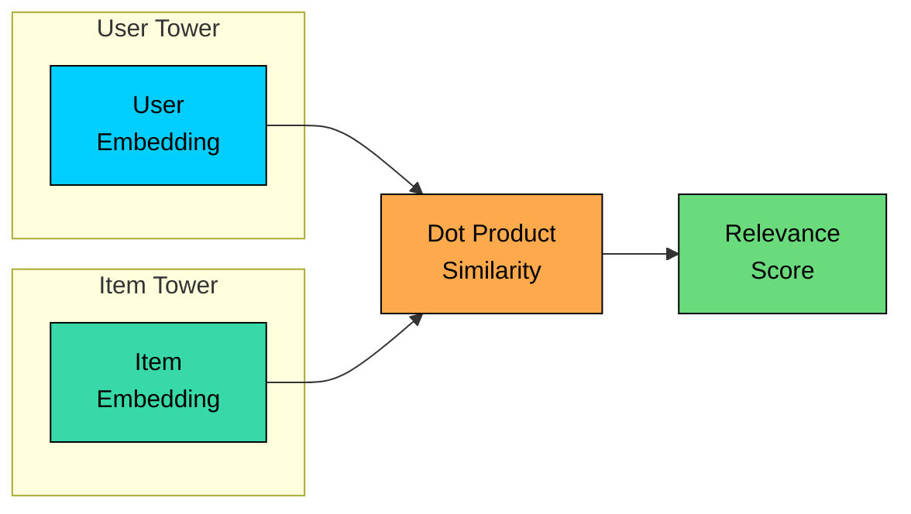

The beauty of this architecture is that user and item embeddings can be pre-computed independently. During serving, you just compute a dot product, which is extremely fast. Combined with approximate nearest neighbor search, this scales to billions of items while keeping latency under 100ms.

| Pros | Cons |
|------|------|
| Learns complex patterns automatically | Requires massive training data |
| Can incorporate any features | Expensive to train and serve |
| State-of-the-art accuracy | Hard to interpret |
| Handles sequential patterns | Cold start still challenging |

**Best for:** TikTok feed, YouTube recommendations, Instagram Explore. If you have the data and engineering resources, deep learning will outperform simpler approaches.

---

# System Architecture

Let's zoom out and look at how all these pieces fit together in a production system.

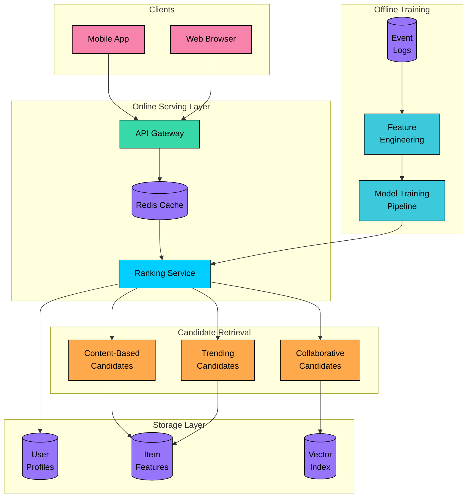

### Two-Stage Retrieval Architecture

This is the most important architectural pattern to understand. Nearly every production recommendation system uses a two-stage approach: candidate generation followed by ranking.

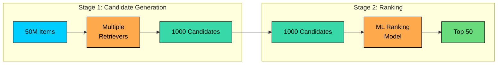

**Why Two Stages"**

The math is simple. Scoring all 50 million items with a sophisticated model would take seconds per request. That's unacceptable for a real-time system. Instead, you use fast, approximate methods to narrow down to a manageable candidate set, then apply your expensive ranking model only to those candidates.

| Stage | Purpose | Latency Budget | Model Complexity |
|-------|---------|----------------|------------------|
| **Candidate Generation** | Reduce 50M to 1000 | ~50ms | Simple, fast |
| **Ranking** | Precisely order 1000 | ~100ms | Complex, accurate |

This division of labor is the key to scaling recommendation systems. The candidate generation stage optimizes for recall: don't miss any relevant items. The ranking stage optimizes for precision: put the best items at the top.

---

### Candidate Generation Strategies

Here's where it gets interesting. You don't just run one retrieval algorithm. You run multiple retrievers in parallel, each bringing a different perspective:

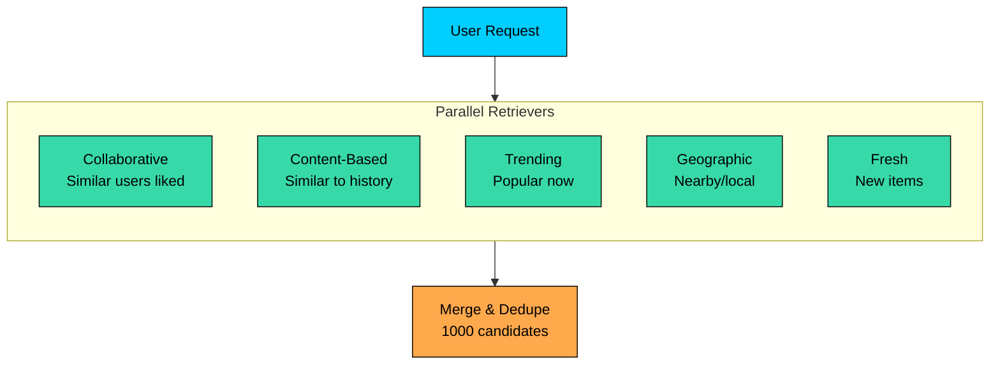

Each retriever returns roughly 200 to 500 candidates. These get merged, deduplicated, and passed to the ranking stage. The diversity from multiple retrievers is intentional. It ensures you don't miss good candidates just because one algorithm didn't surface them.

---

### Vector Similarity Search

For embedding-based retrieval, you need a way to quickly find items similar to a query vector. This is where approximate nearest neighbor (ANN) search comes in:

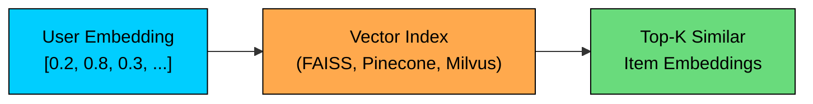

| Algorithm | Description | Trade-off |
|-----------|-------------|-----------|
| **HNSW** | Hierarchical graph-based | High accuracy, more memory |
| **IVF** | Inverted file index | Fast, some accuracy loss |
| **PQ** | Product quantization | Compressed, lower accuracy |
| **ScaNN** | Google's optimized ANN | Best accuracy/speed balance |

Exact nearest neighbor search is O(n), which is too slow for millions of items. ANN algorithms trade a small amount of accuracy for massive speed improvements, finding the approximate top-K similar items in milliseconds.

---

# Domain-Specific Deep Dives

Different domains have different constraints and require different approaches. Let's look at how recommendation systems work in specific contexts.

### TikTok / Short-Form Video

TikTok's "For You Page" is widely considered one of the most effective recommendation systems ever built. It's remarkably good at figuring out what you want to watch, often within minutes of you using the app.

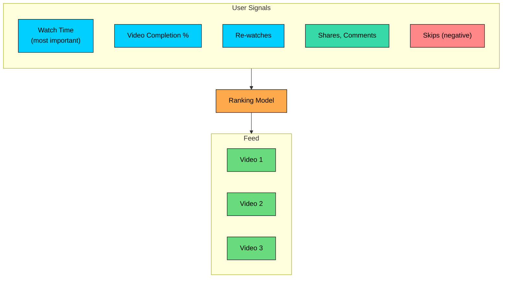

**Key Design Decisions:**

| Aspect | Approach |
|--------|----------|
| **Primary signal** | Watch time and completion rate, not likes |
| **Cold start** | Heavy exploration for new users |
| **Freshness** | Strong bias toward new content |
| **Creator fairness** | Ensure new creators get exposure |
| **Diversity** | Mix content types, avoid repetition |

The key insight is that watch time and completion rate are far more honest signals than likes. People often "like" things they think they should like, but watch time reveals what they actually enjoy.

**Exploration Strategy:**

TikTok's approach to new users is aggressive exploration. They show diverse content and watch closely to see what sticks:

This rapid learning is why people often say TikTok "understands them" so quickly.

---

### E-Commerce (Amazon-style)

E-commerce is a different beast. Unlike video platforms where the goal is engagement, e-commerce recommendations need to drive purchases. And there are business constraints that pure relevance-based systems don't have to worry about.

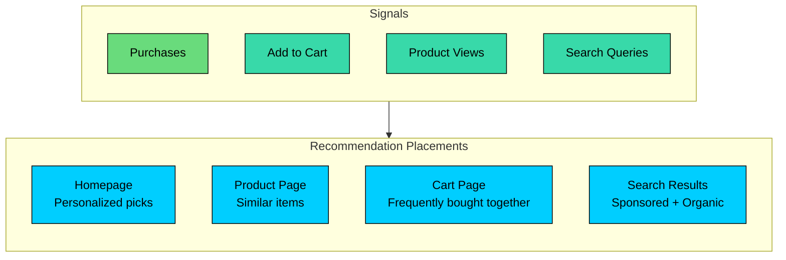

**Multiple Recommendation Types:**

E-commerce platforms use different recommendation strategies in different places:

| Type | Algorithm | Placement |
|------|-----------|-----------|
| **Personalized** | Collaborative + Content | Homepage |
| **Similar Items** | Content-based | Product page |
| **Frequently Bought Together** | Association rules | Cart, product page |
| **Recently Viewed** | Session history | Sitewide |
| **Trending** | Popularity-based | Homepage, categories |

**Business Constraints:**

Here's where e-commerce gets complicated. Pure relevance isn't enough. You have business rules that must override the algorithm:

A recommendation system that ignores these constraints might be more "pure," but it won't make money.

---

### Dating Apps (Tinder-style)

Dating apps have a unique constraint that other recommendation systems don't: both parties must "match." It's not enough for User A to like User B. User B also needs to like User A for anything to happen. This two-sided nature fundamentally changes the problem.

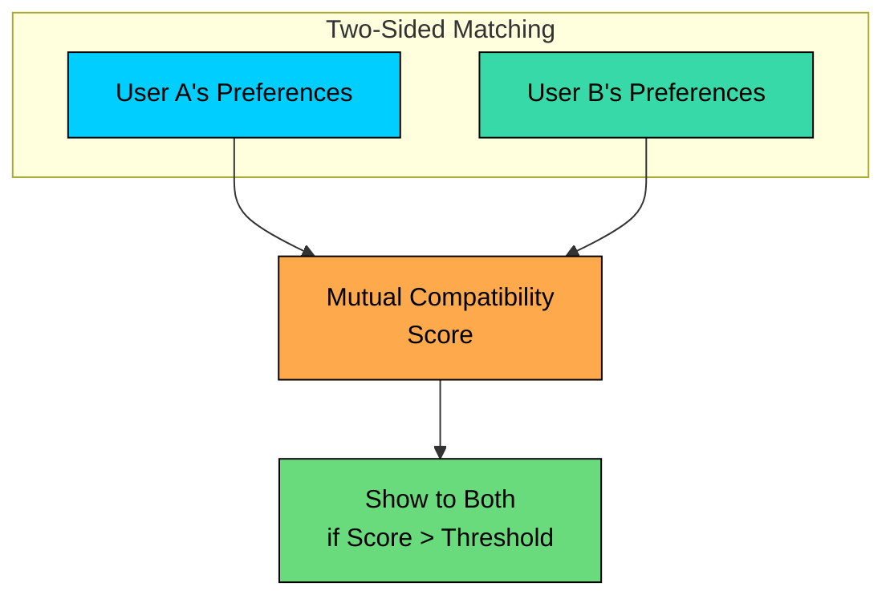

**Key Challenges:**

| Challenge | Solution |
|-----------|----------|
| **Two-sided** | Score must consider both users' likelihood to like each other |
| **Attractiveness imbalance** | ELO-like scoring to match similar "desirability" |
| **Gender imbalance** | Throttle one side, prioritize active users |
| **Location** | Heavy weight on geographic proximity |
| **Freshness** | New users get boosted visibility |

The "attractiveness imbalance" is particularly tricky. If you only optimize for individual preferences, a small number of highly attractive profiles get overwhelmed with likes while most users see nothing. ELO-style scoring helps by matching people of similar "desirability," leading to more balanced outcomes.

**Recommendation Flow:**

The fairness aspect is important. A dating app where only 10% of users get matches isn't sustainable.

---

### News Feed (Facebook-style)

Social feeds face a different tension. Users come for their friends' content, but pure chronological feeds can be boring. The algorithm needs to surface the most relevant content while still making users feel connected to their social network.

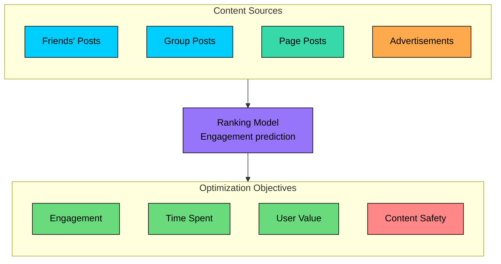

**Ranking Signals:**

| Signal | Weight | Reason |
|--------|--------|--------|
| **Relationship** | High | Close friends prioritized |
| **Content type** | Medium | Video vs photo vs text preferences |
| **Recency** | Medium | Fresher content preferred |
| **Engagement prediction** | High | Likelihood of like/comment/share |
| **Creator** | Medium | Frequently interacted creators |

The challenge with social feeds is that optimizing purely for engagement can lead to sensational or divisive content getting promoted. Modern platforms have to balance engagement with "quality" signals and content safety considerations.

---

# Evaluation Metrics

How do you know if your recommendation system is working" You need metrics, both offline ones for development and online ones for production.

### Offline Metrics

Offline metrics are computed on historical data before deploying a model. They're useful for comparing approaches during development.

| Metric | What It Measures | Formula |
|--------|------------------|---------|
| **Precision@K** | Relevance of top K items | Relevant items in top K / K |
| **Recall@K** | Coverage of relevant items | Relevant items in top K / Total relevant |
| **NDCG** | Ranking quality with position weighting | DCG / Ideal DCG |
| **MAP** | Mean average precision across users | Mean of AP per user |
| **AUC** | Classification quality | Area under ROC curve |

NDCG is particularly useful because it accounts for position. Getting a relevant item in position 1 is much better than position 10.

### Online Metrics

Online metrics measure real user behavior in production. These are what actually matter for the business.

| Metric | What It Measures | Example Target |
|--------|------------------|----------------|
| **CTR** | Click-through rate | > 5% |
| **Engagement** | Time spent, interactions | +10% vs baseline |
| **Conversion** | Purchases, signups | +5% vs baseline |
| **Retention** | Return rate | DAU/MAU > 0.5 |
| **Diversity** | Variety in recommendations | Entropy > threshold |

The gap between offline and online metrics is real. A model can look great offline but fail online because offline metrics don't capture the full user experience.

### A/B Testing

The only way to know for sure if a new model is better is to run an A/B test. Split traffic randomly and compare metrics.

```mermaid
flowchart LR
    Traffic["User Traffic"]:::primary

    Split["Random<br/>Split"]:::orange

    Control["Control<br/>Old Model"]:::secondary
    Treatment["Treatment<br/>New Model"]:::secondary

    Metrics["Compare<br/>Metrics"]:::green

    Traffic --> Split
    Split --> Control
    Split --> Treatment
    Control --> Metrics
    Treatment --> Metrics

    classDef primary fill:#00ceff,stroke:#000,color:#000
    classDef orange fill:#ffa94d,stroke:#000,color:#000
    classDef secondary fill:#38d9a9,stroke:#000,color:#000
    classDef green fill:#69db7c,stroke:#000,color:#000
```

---

# Handling Edge Cases

Real recommendation systems have to deal with several subtle but important issues that naive implementations miss.

### Popularity Bias

Popular items get recommended more, which leads to more interactions, which makes them even more popular. This rich-get-richer effect can stifle discovery of niche content.

**Solutions:**

- **Inverse propensity scoring** downweights popular items during training.
- **Boost long-tail items** explicitly to give them exposure.
- **Separate "discovery" sections** that highlight lesser-known content.

### Position Bias

Users click items at the top of the list regardless of relevance. If you train on clicks, you're learning position effects, not true relevance.

**Solutions:**

- Train models to predict relevance, not raw clicks.
- Use position as a feature during training to decouple it from relevance.
- Randomize positions in a small percentage of traffic to get unbiased data.

### Feedback Loops

Here's a subtle problem: recommendations influence behavior, which influences the data you train on, which influences future recommendations. This can create echo chambers and make the system reinforce its own biases.

```mermaid
flowchart LR
    Rec["Recommend X"]:::primary
    Click["User Clicks X"]:::secondary
    Signal["Positive Signal for X"]:::orange
    More["Recommend X More"]:::red

    Rec --> Click
    Click --> Signal
    Signal --> More
    More --> Rec

    classDef primary fill:#00ceff,stroke:#000,color:#000
    classDef secondary fill:#38d9a9,stroke:#000,color:#000
    classDef orange fill:#ffa94d,stroke:#000,color:#000
    classDef red fill:#ff8787,stroke:#000,color:#000
```

**Solutions:**

- **Inject randomness** through exploration to break the loop.
- **Track counterfactual outcomes** to understand what would have happened with different recommendations.
- **Regular model retraining** on fresh data to avoid stale patterns.

---

# Summary

Let's tie everything together.

```mermaid
flowchart TD
    Start["Recommendation System"]:::primary

    subgraph Approaches["Core Approaches"]
		direction TB
        Content["Content-Based<br/>Item features"]:::secondary
        Collab["Collaborative Filtering<br/>User patterns"]:::secondary
        Hybrid["Hybrid<br/>Best of both"]:::secondary
        DL["Deep Learning<br/>Complex patterns"]:::secondary
    end

    subgraph Architecture["Architecture"]
		direction TB
        CG["Candidate Generation"]:::orange
        Rank["Ranking"]:::orange
        Serve["Serving"]:::orange
    end

    subgraph Challenges["Key Challenges"]
		direction TB
        Cold["Cold Start"]:::red
        Scale["Scalability"]:::red
        Fresh["Freshness"]:::red
        Bias["Bias"]:::red
    end

    Start --> Approaches
    Approaches --> Architecture
    Architecture --> Challenges

    classDef primary fill:#00ceff,stroke:#000,color:#000
    classDef secondary fill:#38d9a9,stroke:#000,color:#000
    classDef orange fill:#ffa94d,stroke:#000,color:#000
    classDef red fill:#ff8787,stroke:#000,color:#000
```

| Approach | Best For | Cold Start | Scalability |
|----------|----------|------------|-------------|
| **Content-Based** | Rich metadata, new items | Good for items | Excellent |
| **Collaborative** | Strong interaction data | Poor | Good with matrix factorization |
| **Hybrid** | Production systems | Balanced | Good |
| **Deep Learning** | Large scale, complex patterns | Requires strategies | Excellent with two-stage |

#### **Key Takeaways:**

1. **Two-stage architecture is essential.** You cannot score millions of items with a complex model in real-time. Candidate generation plus ranking is how production systems scale.
2. **Cold start requires multiple strategies.** No single approach solves it. Popularity for new users, content-based for new items, and exploration to gather initial signals all work together.
3. **The trade-offs are fundamental.** Accuracy vs latency. Personalization vs diversity. Relevance vs freshness. These tensions never go away, and finding the right balance is what makes recommendation systems interesting.
4. **Domain constraints matter.** E-commerce has inventory limits. Dating has two-sided matching. Video optimizes for watch time. The algorithm must fit the business context.
5. **Measure what matters.** Offline metrics are useful for development, but online metrics determine business impact. A/B testing is the only way to know for sure if a change helps.
6. **Iterate from simple to complex.** Start with popularity-based recommendations. Add content-based filtering. Then collaborative filtering. Only move to deep learning when you have the data and infrastructure to support it.

---

# References

- [Deep Neural Networks for YouTube Recommendations](https://research.google/pubs/pub45530/) - Google's paper on YouTube's recommendation architecture
- [TikTok's Recommendation Algorithm Explained](https://newsroom.tiktok.com/en-us/how-tiktok-recommends-videos-for-you) - Official TikTok documentation on their For You feed
- [Matrix Factorization Techniques for Recommender Systems](https://datajobs.com/data-science-repo/Recommender-Systems-%5BNetflix%5D.pdf) - Netflix Prize winning approach
- [Wide & Deep Learning for Recommender Systems](https://arxiv.org/abs/1606.07792) - Google's influential paper combining memorization and generalization
- [Recommender Systems Handbook](https://www.springer.com/gp/book/9781489976369) - Comprehensive academic reference
- [Billion-scale Commodity Embedding for E-commerce Recommendation](https://arxiv.org/abs/1803.02349) - Alibaba's large-scale recommendation system

---

# Quiz
