How does Slack keep a company's messages separate from millions of other companies using the same platform"

When you use Slack, Shopify, or Salesforce, you are sharing infrastructure with thousands, sometimes millions, of other organizations. Yet your data remains completely isolated. You never see another company's messages, and they never see yours.

This is **multi-tenancy** in action.

Multi-tenancy is the foundation of the SaaS business model. Without it, every customer would need dedicated infrastructure, and software would cost orders of magnitude more than it does today.

But sharing infrastructure while maintaining isolation is not trivial. Get it wrong, and you leak one customer's data to another. Get it right, and you build something that scales to millions of customers without proportionally scaling your costs.

In this chapter, we will cover the core concepts you need to understand multi-tenancy: isolation models and their trade-offs, data separation strategies, the noisy neighbor problem, tenant routing, security considerations, and how companies like Slack and Shopify implement these patterns in practice.

---

# 1. What is Multi-Tenancy"

> [!PAYWALL] This content is for premium members only.

**Multi-tenancy** is an architecture where a single instance of software serves multiple customers, called tenants, with each tenant's data isolated from others.

The apartment building analogy works well here. Multiple families live in the same building, sharing the structure, plumbing, and electricity. But each apartment is private, with its own lock and key. You share infrastructure costs with your neighbors, but you do not share your living space.

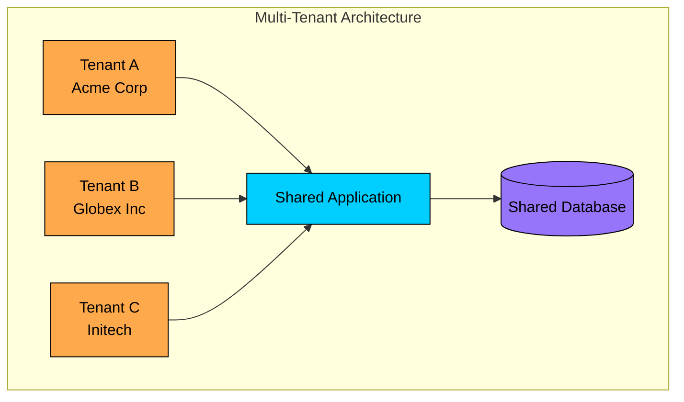

Compare this to **single-tenancy**, where each customer gets their own dedicated instance:

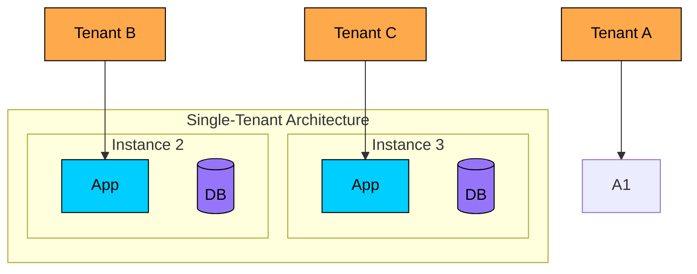

### Why Multi-Tenancy Matters

The choice between multi-tenant and single-tenant architecture has significant implications for cost, operations, and what you can offer customers.

| Aspect | Multi-Tenant | Single-Tenant |
|--------|--------------|---------------|
| **Cost efficiency** | Share infrastructure costs | Dedicated resources per customer |
| **Operational overhead** | One deployment to manage | N deployments to manage |
| **Resource utilization** | High (shared pools) | Low (dedicated, often idle) |
| **Customization** | Limited | Full flexibility |
| **Isolation** | Logical | Physical |
| **Compliance** | Harder for strict requirements | Easier for regulated industries |

Multi-tenancy enables SaaS economics. Slack has millions of workspaces. If each workspace required its own database server, the infrastructure costs alone would make the product unaffordable. By sharing resources across tenants, the cost per tenant drops dramatically as scale increases.

Single-tenancy still has its place. Banks, healthcare organizations, and government agencies often require physical isolation for compliance reasons. But for the vast majority of SaaS products, multi-tenancy is the only path to profitability at scale.

---

# 2. Isolation Models

The core question in multi-tenancy is: **How do you isolate tenants"**

This is not a binary choice. There is a spectrum of isolation levels, and where you land on that spectrum depends on your customers' requirements, your operational capacity, and your cost constraints.

### 2.1 Silo Model (Full Isolation)

In the silo model, each tenant gets dedicated resources: separate databases, separate compute instances, potentially separate network segments. This is as close to single-tenancy as you can get while still calling it multi-tenant.

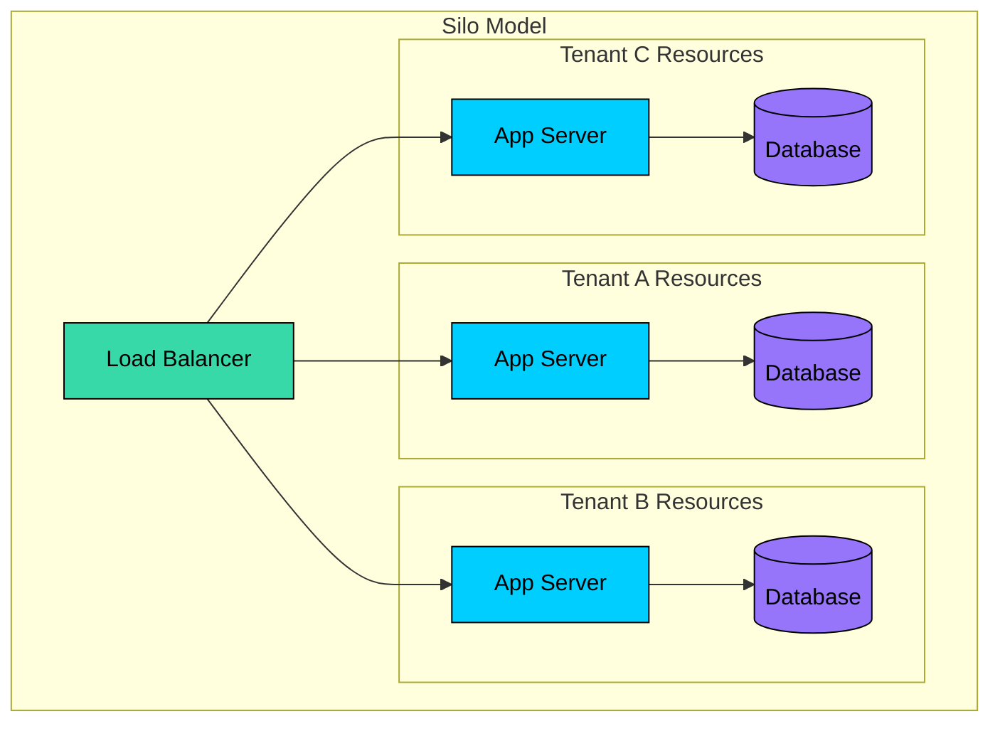

**Pros:**

- Strongest isolation for both security and performance
- Straightforward compliance with data residency requirements
- Tenant-specific customization is possible
- No noisy neighbor issues since resources are not shared

**Cons:**

- Highest cost since each tenant has dedicated resources
- Operational complexity grows linearly with tenant count
- Lower resource utilization because dedicated resources often sit idle
- Harder to manage at scale

**Use when:** You have enterprise customers with strict compliance requirements. Healthcare (HIPAA), finance, and government contracts typically require this level of isolation. If a customer is paying enough to justify dedicated infrastructure, silo makes sense.

### 2.2 Pool Model (Shared Everything)

At the opposite end of the spectrum, the pool model has all tenants sharing the same resources: same application instances, same database, same tables. Tenant isolation is purely logical, enforced by the application layer.

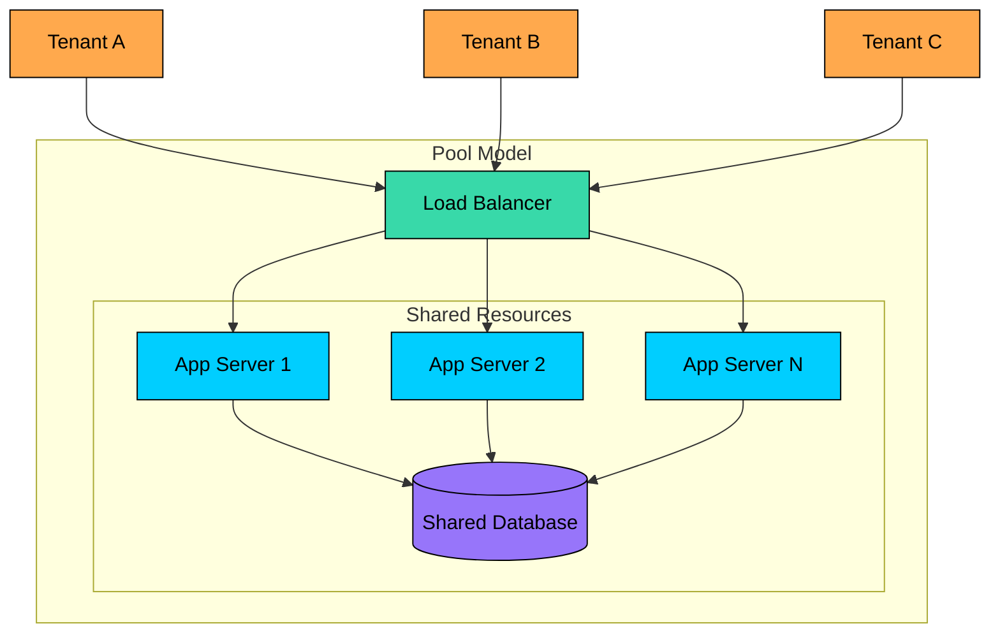

**Pros:**

- Lowest cost because resources are fully shared
- Simplest operations since there is only one deployment to manage
- Highest resource utilization
- Easy to scale horizontally by adding more app servers

**Cons:**

- Weakest isolation since all data lives together
- Noisy neighbor risk where one tenant's workload affects others
- Complex access control that must be enforced in every query
- Harder to meet strict compliance requirements

**Use when:** You are building self-service SaaS with many small to medium customers. If your customers are cost-sensitive and do not have strict compliance requirements, pool gives you the best economics.

### 2.3 Bridge Model (Hybrid)

In practice, most successful SaaS companies use a hybrid approach. They pool small customers together for efficiency, but give large or compliance-sensitive customers their own isolated resources.

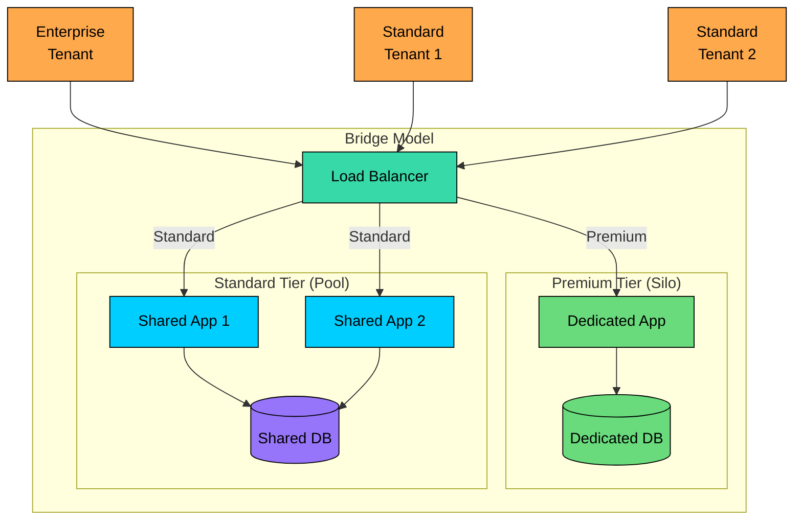

**Pros:**

- Flexibility to match isolation level to customer needs and willingness to pay
- Premium tier revenue can subsidize the cost of serving standard tier customers
- Provides a migration path as customers grow

**Cons:**

- Most complex to implement and operate
- Multiple code paths to maintain and test
- Routing logic must correctly identify which tier each tenant belongs to

**Use when:** You have a diverse customer base with different requirements. Shopify, Slack, and Salesforce all use variations of this model. Most of their customers are on shared infrastructure, but their largest enterprise customers get dedicated resources.

---

# 3. Data Isolation Strategies

How you store and isolate tenant data is the most critical decision in multi-tenant architecture. The isolation model you choose at the compute layer matters, but the data layer is where the real risk lives. A bug that shows one tenant's data to another is a catastrophic breach of trust.

### 3.1 Separate Databases

The most straightforward approach: each tenant gets their own database instance. The application routes connections based on tenant identity.

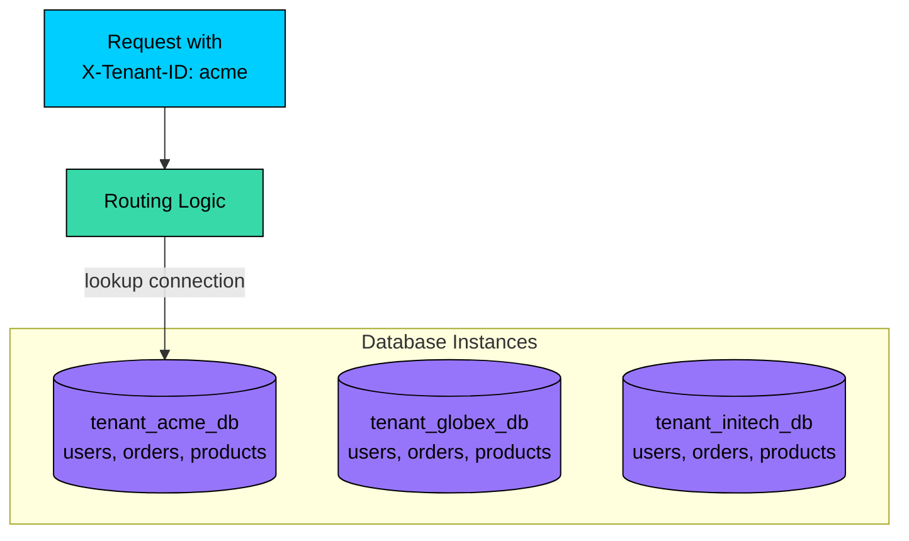

The routing logic extracts the tenant ID from the request, looks up the connection string for that tenant, and executes queries against the appropriate database.

| Pros | Cons |
|------|------|
| Strongest data isolation | Highest cost (N databases) |
| Easy backup/restore per tenant | Connection pool management complexity |
| Tenant-specific tuning possible | Cross-tenant queries impossible |
| Simple data deletion (just drop the database) | Schema migrations must run across N databases |

### 3.2 Separate Schemas (Same Database)

A middle ground: all tenants share one database instance, but each tenant has their own schema. This gives you the operational simplicity of a single database while maintaining logical isolation between tenants.

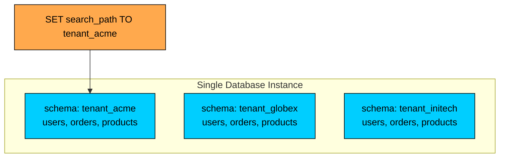

With PostgreSQL, you set the search path at the connection level, and all subsequent queries are automatically scoped to that schema:

| Pros | Cons |
|------|------|
| Good isolation at the schema level | Still N schemas to manage |
| Single database instance to operate | Some databases limit schema count |
| Cross-tenant analytics possible with explicit schema references | Connection routing still required |
| Lower cost than separate databases | Schema migrations still run per tenant |

### 3.3 Shared Tables with Tenant ID

The most efficient approach: all tenants share the same tables. A `tenant_id` column discriminates which tenant each row belongs to.

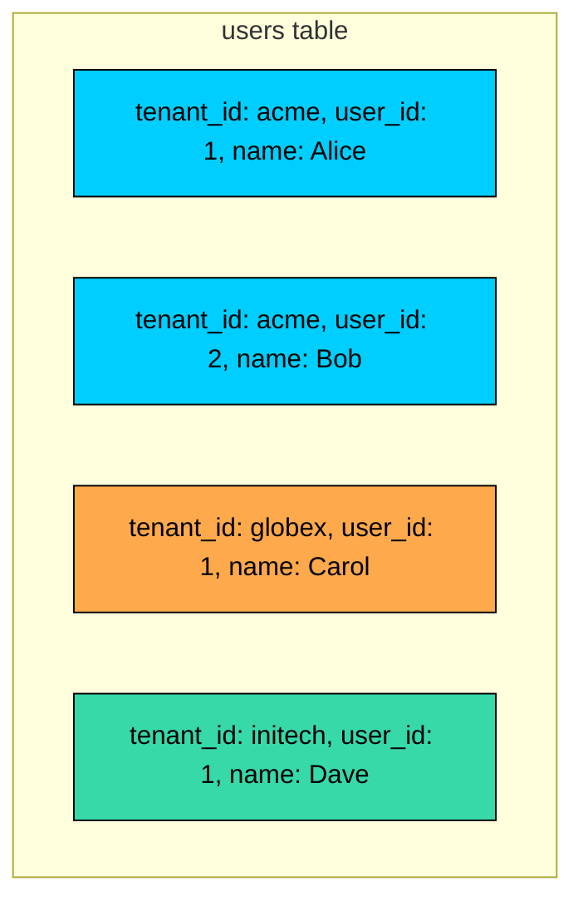

The schema puts tenant_id first in the primary key, which makes tenant-scoped queries efficient:

The critical constraint is that **every query must include tenant_id**. Miss it once, and you have a data leak:

| Pros | Cons |
|------|------|
| Lowest cost | Weakest isolation |
| Simple operations with one schema | Must enforce tenant_id in every single query |
| Easy cross-tenant analytics | Risk of data leaks if code has bugs |
| Single schema migration | Large tables with complex indexing needs |

This is where bugs become security incidents. If a developer forgets to add the tenant filter, or a refactoring removes it, you are showing one customer's data to another. Row-level security at the database level can help enforce this, but it requires discipline.

### 3.4 Comparison Summary

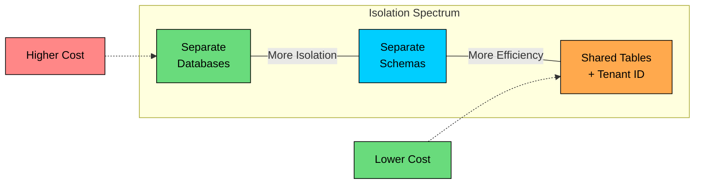

| Strategy | Isolation | Cost | Complexity | Best For |
|----------|-----------|------|------------|----------|
| Separate databases | Highest | Highest | Medium | Enterprise, regulated industries |
| Separate schemas | High | Medium | Medium | Mid-market SaaS |
| Shared tables | Lowest | Lowest | Low | Self-service, high volume |

The right choice depends on your customer profile. If you are selling to enterprises with compliance requirements, lean toward separate databases. If you are building a self-service product for millions of small users, shared tables will give you the economics you need.

---

# 4. The Noisy Neighbor Problem

When tenants share resources, one tenant's workload can affect everyone else. This is the **noisy neighbor problem**, and it is one of the trickiest challenges in multi-tenant systems.

### The Problem

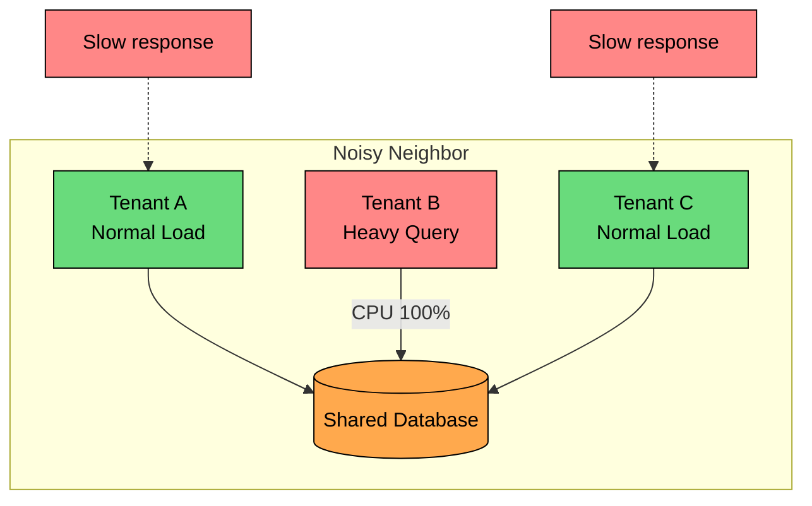

**Common scenarios:**

- A tenant runs an expensive analytics query that locks the database for everyone
- A tenant triggers a bulk import that consumes all disk I/O
- A tenant goes viral and floods shared servers with traffic
- A tenant's scheduled job runs at the same time as everyone else's

### Solutions

There is no single solution to the noisy neighbor problem. You need multiple layers of protection.

#### 4.1 Resource Quotas and Rate Limiting

The first line of defense is limiting what each tenant can consume. Define clear limits and enforce them at the API layer.

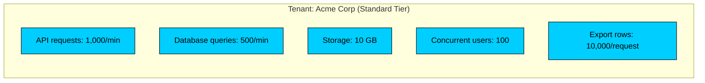

The implementation is straightforward: before processing any request, check if the tenant has exceeded their limits.

```mermaid
flowchart LR
    R[Request]:::primary --> E[Extract tenant_id]:::secondary
    E --> C{Rate limit<br/>exceeded"}:::orange
    C --> |yes| R429[429 Too Many<br/>Requests]:::red
    C --> |no| P[Process request]:::green

    classDef primary fill:#00ceff,stroke:#000,color:#000
    classDef secondary fill:#38d9a9,stroke:#000,color:#000
    classDef orange fill:#ffa94d,stroke:#000,color:#000
    classDef red fill:#ff8787,stroke:#000,color:#000
    classDef green fill:#69db7c,stroke:#000,color:#000
```

Store rate limit counters in Redis with a TTL. When a tenant exceeds their limit, return 429 Too Many Requests.

#### 4.2 Query Governance

Rate limiting catches volume problems, but a single expensive query can still bring down a shared database. Query governance prevents that.

| Rule | Purpose |
|------|---------|
| Max query execution time: 30 seconds | Prevent long-running queries from holding locks |
| Max rows scanned: 1,000,000 | Prevent full table scans |
| Max result set size: 10,000 rows | Prevent memory exhaustion |
| Required: tenant_id in WHERE clause | Prevent cross-tenant data access |
| Blocked: SELECT * without LIMIT | Prevent unbounded result sets |

Before executing a query, analyze the execution plan. If the estimated cost exceeds thresholds, reject it or queue it for off-peak processing:

This is especially important for user-generated queries like report builders or custom dashboards.

#### 4.3 Tenant-Aware Resource Pools

Separate resource pools by tenant tier:

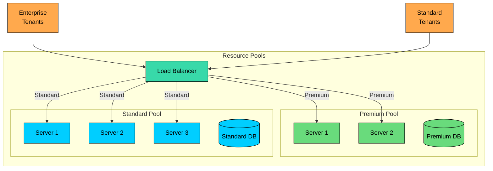

#### 4.4 Fair Scheduling

Even with rate limiting, some tenants might still overwhelm the system with legitimate traffic. Weighted fair queuing ensures that no single tenant monopolizes shared resources.

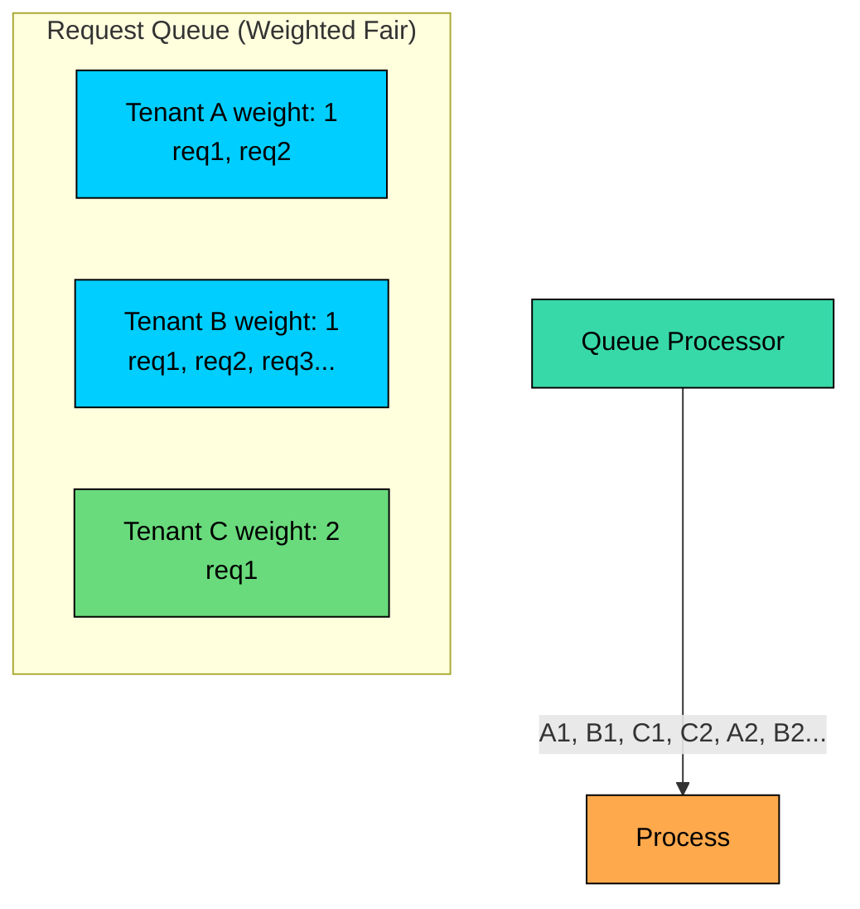

Tenants with higher weight (premium customers) get proportionally more processing time. This ensures that paying customers get priority, while free tier customers still make progress even when the system is busy.

---

# 5. Tenant Identification and Routing

Before you can isolate a tenant's data, you need to know which tenant a request belongs to. This sounds simple, but there are several approaches with different trade-offs.

### 5.1 Identification Methods

#### Subdomain-Based

The tenant identifier is embedded in the subdomain. This is what Slack does with workspaces.

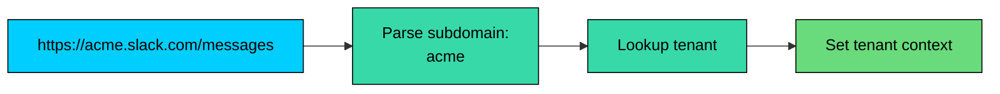

**Pros:** Clean URLs that users can remember and share. Natural branding for tenants.

**Cons:** Requires wildcard DNS and SSL certificates. Subdomain conflicts need to be handled.

#### Path-Based

The tenant identifier is part of the URL path. Common for APIs.

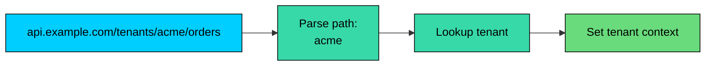

**Pros:** Simple routing with a single domain. No DNS complexity.

**Cons:** Less intuitive for end users. URLs are longer.

#### Header-Based

The tenant identifier is passed in a custom HTTP header.

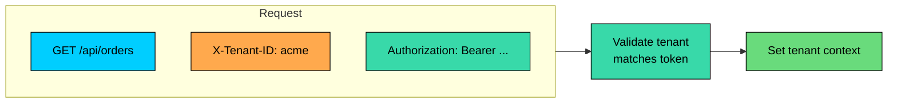

**Pros:** Clean URLs. Flexible for programmatic access.

**Cons:** Requires custom header handling. Easy to forget in client implementations.

#### Token-Based (JWT Claims)

The tenant identifier is embedded in the authentication token itself.

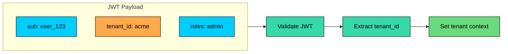

**Pros:** Secure and self-contained. Cannot be tampered with if JWT is properly signed.

**Cons:** Increases token size. Requires token refresh if user switches tenants.

### 5.2 Tenant Context Pattern

Once you identify the tenant, that context needs to flow through the entire request lifecycle. Every layer of your application, from controller to service to data layer, needs to know which tenant it is operating on behalf of.

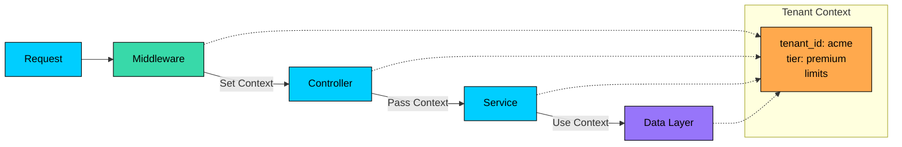

There are three common ways to propagate tenant context:

| Pattern | How It Works | Trade-offs |
|---------|--------------|------------|
| **Thread-Local Storage** | Store tenant context in a thread-local variable. All code in the request thread can access it. | Simple, but breaks with async operations. |
| **Explicit Parameter Passing** | Pass tenant_id as a parameter to every function. | Verbose but explicit and safe. Works with async code. |
| **Request-Scoped Dependency Injection** | Inject tenant context as a request-scoped service. | Clean and testable, but framework-dependent. |

The explicit parameter passing approach is verbose, but it makes the tenant dependency obvious. You cannot accidentally write code that operates without a tenant context.

### 5.3 Database Query Enforcement

The most dangerous bug in a multi-tenant system is a query that forgets to filter by tenant. There are several approaches to make this harder to get wrong.

**Approach 1: Query Wrapper**

Wrap all database access in functions that require tenant_id:

**Approach 2: Row-Level Security (PostgreSQL)**

Let the database enforce tenant isolation. Even if application code forgets the filter, the database will not return rows the tenant should not see:

**Approach 3: ORM Scopes**

Define a base scope that all queries must go through:

The best approach is to layer these defenses. Use ORM scopes as the primary mechanism, but back them up with row-level security at the database level. Defense in depth.

---

# 6. Security Considerations

Multi-tenancy introduces unique security challenges that do not exist in single-tenant systems. The attack surface is larger, and the consequences of a breach are more severe because you are holding data for many organizations.

### 6.1 Data Leakage Prevention

The worst bug in a multi-tenant system is showing Tenant A's data to Tenant B. This is not just a bug, it is a breach of trust that can destroy your business.

**Prevention requires multiple layers:**

| Strategy | Implementation |
|----------|----------------|
| **Mandatory tenant filter** | ORM base query always includes tenant_id |
| **Row-level security** | Database enforces isolation |
| **Code review checklist** | Every query reviewed for tenant scoping |
| **Automated testing** | Tests verify cross-tenant access is denied |
| **Penetration testing** | Regular security audits specifically targeting tenant isolation |

Every test suite should include cross-tenant access tests:

### 6.2 Authentication and Authorization

In a multi-tenant system, authentication is not enough. You also need to verify that the authenticated user belongs to the tenant they are trying to access.

```mermaid
flowchart TD
    R[Request]:::primary --> Auth[Authentication]:::secondary
    Auth --> |Valid| TenantCheck{Tenant<br/>Match"}:::orange
    Auth --> |Invalid| Reject1[401 Unauthorized]:::red

    TenantCheck --> |Yes| Authz[Authorization]:::secondary
    TenantCheck --> |No| Reject2[403 Forbidden]:::red

    Authz --> |Allowed| Process[Process Request]:::green
    Authz --> |Denied| Reject3[403 Forbidden]:::red

    classDef primary fill:#00ceff,stroke:#000,color:#000
    classDef secondary fill:#38d9a9,stroke:#000,color:#000
    classDef orange fill:#ffa94d,stroke:#000,color:#000
    classDef green fill:#69db7c,stroke:#000,color:#000
    classDef red fill:#ff8787,stroke:#000,color:#000
```

The flow must be:

1. **Authenticate** the user. Who are you"
2. **Verify tenant membership**. Do you belong to this tenant"
3. **Authorize** the action. Are you allowed to perform this action in this tenant"

A common mistake is skipping step 2. Just because a user is authenticated does not mean they have any right to access the tenant specified in the request.

### 6.3 Encryption

Different data states require different encryption strategies:

| Data State | Strategy |
|------------|----------|
| **At rest** | Tenant-specific encryption keys using envelope encryption |
| **In transit** | TLS everywhere. Per-tenant certificates for enterprise customers. |
| **In use** | Minimize exposure. Never log sensitive data. |

For the highest level of isolation, each tenant gets their own encryption key:

```mermaid
flowchart TD
    MK[Master Key<br/>in HSM]:::purple --> |encrypts| TK[Tenant Keys<br/>stored encrypted]:::orange
    TK --> |decrypts| TD[Tenant Data]:::primary

    subgraph flow["Decryption Flow"]
        D1[1. Get encrypted tenant key]:::secondary
        D2[2. Decrypt with master key]:::secondary
        D3[3. Decrypt data with tenant key]:::secondary
        D1 --> D2 --> D3
    end

    classDef primary fill:#00ceff,stroke:#000,color:#000
    classDef secondary fill:#38d9a9,stroke:#000,color:#000
    classDef orange fill:#ffa94d,stroke:#000,color:#000
    classDef purple fill:#9775fa,stroke:#000,color:#000
```

This envelope encryption pattern ensures that even if the data is compromised, it cannot be decrypted without the master key in the HSM.

### 6.4 Audit Logging

Every action in a multi-tenant system should be logged with full tenant context. When something goes wrong, you need to know exactly what happened and who was affected.

Store audit logs with the same isolation as tenant data. Tenant A should not be able to see audit logs for Tenant B, even accidentally.

---

# 7. Scaling Multi-Tenant Systems

Multi-tenant systems need to scale efficiently because the whole point is to serve many customers without proportionally increasing costs.

### 7.1 Horizontal Scaling

The application tier should be stateless so you can scale horizontally by adding more servers.

```mermaid
flowchart LR
    LB[Load Balancer]:::secondary --> A1[App 1]:::primary
    LB --> A2[App 2]:::primary
    LB --> A3[App N]:::primary

    A1 --> Cache[(Cache)]:::orange
    A2 --> Cache
    A3 --> Cache

    A1 --> DB[(Database)]:::purple
    A2 --> DB
    A3 --> DB

    classDef primary fill:#00ceff,stroke:#000,color:#000
    classDef secondary fill:#38d9a9,stroke:#000,color:#000
    classDef orange fill:#ffa94d,stroke:#000,color:#000
    classDef purple fill:#9775fa,stroke:#000,color:#000
```

All app servers are identical. Any server can handle any tenant's request. As load increases, add more servers.

### 7.2 Database Scaling

The database is typically the bottleneck in multi-tenant systems. There are several approaches to scaling it:

| Strategy | Description | Best For |
|----------|-------------|----------|
| **Read replicas** | Write to primary, read from replicas | Read-heavy workloads |
| **Tenant-based sharding** | Route tenants to different database shards. Shard key = tenant_id. | High tenant counts, no cross-tenant queries |
| **Tiered storage** | Hot data on SSD, warm on standard storage, cold in archive | Cost optimization for large data volumes |

For most multi-tenant systems, tenant-based sharding works well because cross-tenant queries are rare. Each tenant's data is self-contained.

### 7.3 Tenant Placement

When sharding by tenant, you need to decide which shard hosts which tenant.

| Strategy | Description |
|----------|-------------|
| **Round-robin** | Even distribution, simple to implement |
| **Size-based** | Large tenants get dedicated shards |
| **Geography-based** | Place tenants near their data for low latency |
| **Activity-based** | Spread active tenants across shards to avoid hotspots |

**Rebalancing** becomes necessary when:

- A shard becomes a hotspot
- A small tenant grows large
- You add new shards to the cluster

The rebalancing process:

```mermaid
flowchart LR
    S1[1. Create new home<br/>on target shard]:::primary --> S2[2. Sync data<br/>CDC or dual-write]:::primary
    S2 --> S3[3. Update<br/>routing table]:::orange
    S3 --> S4[4. Cutover<br/>traffic]:::green
    S4 --> S5[5. Clean up<br/>old data]:::secondary

    classDef primary fill:#00ceff,stroke:#000,color:#000
    classDef secondary fill:#38d9a9,stroke:#000,color:#000
    classDef orange fill:#ffa94d,stroke:#000,color:#000
    classDef green fill:#69db7c,stroke:#000,color:#000
```

This should be a zero-downtime operation. The tenant continues operating throughout the migration.

---

# 8. Key Takeaways

1. **Multi-tenancy enables SaaS economics.** Sharing infrastructure across customers is what makes software affordable at scale. Without it, every customer would need dedicated infrastructure.
2. **Isolation is a spectrum.** Choose based on requirements: silo for strict compliance, pool for maximum efficiency, bridge for flexibility. Most successful companies use hybrid approaches.
3. **Data isolation is the most critical concern.** Whether you use separate databases, schemas, or shared tables with tenant_id, every single query must be scoped correctly. A bug here is a security breach.
4. **The noisy neighbor problem is real.** Implement rate limiting, quotas, query governance, and resource pools to prevent one tenant from affecting others.
5. **Tenant context must flow through everything.** From request identification through database queries, tenant scoping must be consistent and enforced at multiple layers.
6. **Security requires defense in depth.** Row-level security, encryption, audit logging, and testing all work together. No single layer is sufficient.
7. **Start simple, evolve to hybrid.** Begin with shared tables for early customers, then add isolation options as enterprise customers demand them.

---

# References

- [Multi-tenant SaaS patterns - AWS](https://docs.aws.amazon.com/wellarchitected/latest/saas-lens/multi-tenant-saas-architecture.html) - AWS Well-Architected SaaS Lens
- [Shopify's Architecture to Handle 80K RPS](https://www.youtube.com/watch"v=Th7XN__ltyc) - How Shopify scales with pod-based sharding
- [Slack's Architecture](https://slack.engineering/flannel-an-application-level-edge-cache-to-make-slack-scale/) - Edge caching and workspace isolation
- [Row Level Security in PostgreSQL](https://www.postgresql.org/docs/current/ddl-rowsecurity.html) - Database-enforced tenant isolation
- [Building Multi-tenant Applications - Microsoft](https://learn.microsoft.com/en-us/azure/architecture/guide/multitenant/overview) - Azure multi-tenant architecture guide
- [Salesforce Multi-tenant Architecture](https://developer.salesforce.com/wiki/multi_tenant_architecture) - How Salesforce implements multi-tenancy

---

# Quiz
