A user uploads the same 50MB video five times because their network kept dropping. Your storage costs just quintupled for a single file.

A message queue retries a failed message. The consumer processes it again. Now there are two charges on the customer's credit card.

A distributed system syncs data across nodes. The same record arrives from three different sources. Your database now has three copies of "truth."

These scenarios share the same root cause: **duplicate data**. In distributed systems, duplicates are not a bug to be fixed, they are a fundamental reality to be managed. Networks drop packets. Services retry requests. Users double-click submit buttons. 

The only question is whether your system handles duplicates gracefully or lets them cause real damage.

This chapter covers how to detect and eliminate duplicates across different scenarios: file storage, message processing, database records, and API requests. You will learn six battle-tested strategies that show up repeatedly in production systems and system design interviews alike.

---

# Why Duplicates Happen

> [!PAYWALL] This content is for premium members only.

Before diving into solutions, it helps to understand why duplicates are so common in distributed systems. This is not a failure of engineering. It is a fundamental property of how networks and distributed systems work.

### Network Unreliability

Networks can only guarantee two delivery semantics: at-most-once (send and hope it arrives) or at-least-once (keep retrying until acknowledged). Exactly-once delivery is impossible at the network layer because the sender cannot distinguish between "message lost" and "message processed but acknowledgment lost."

Most production systems choose at-least-once for reliability, accepting that duplicates are the price of not losing data. Consider what happens when a response gets lost:

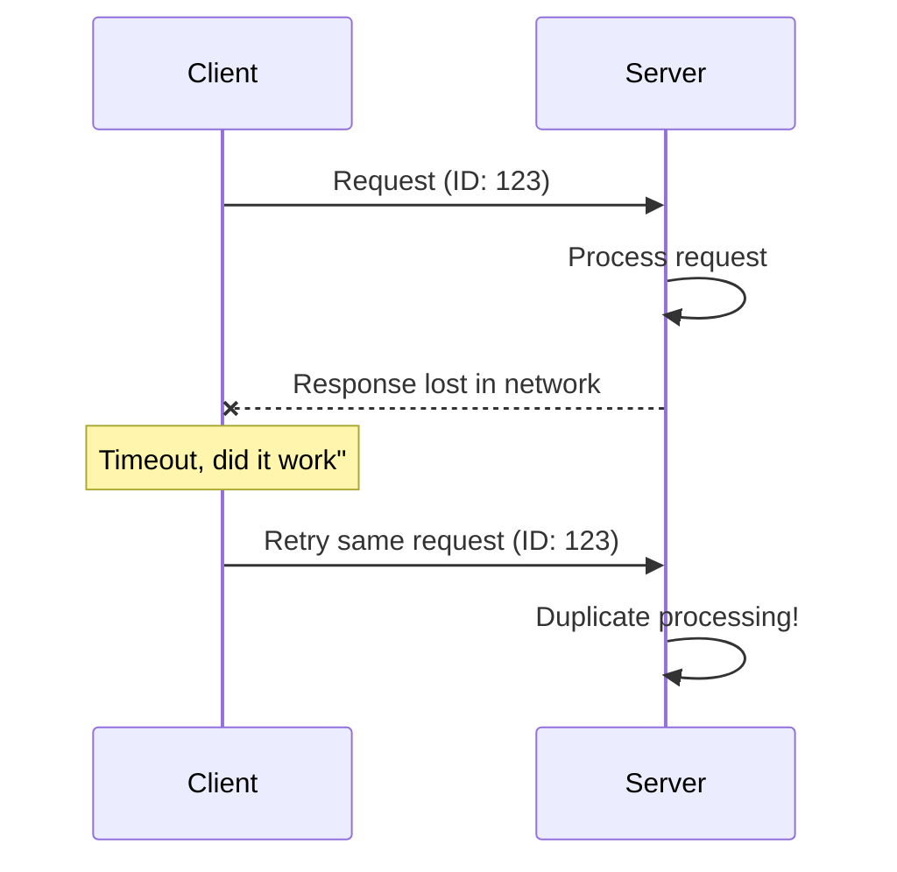

The client cannot know whether the first request succeeded. The request might have failed before reaching the server, or it might have completed successfully with only the response getting lost. The safe assumption is to retry, which may result in processing the same request twice.

### Distributed System Behavior

Distributed systems introduce additional sources of duplicates:

- **Retries**: Load balancers, service meshes, and message queues all retry failed operations automatically
- **Replication**: Data copied across nodes may arrive through multiple paths
- **Event sourcing**: Publishers might emit the same event multiple times during recovery
- **Sync operations**: Data merged from different sources can include overlapping records

Each layer of your distributed system adds another opportunity for duplication. A single user action might be retried by the browser, then by the API gateway, then by the message queue, each layer unaware of the others.

### User Behavior

Users cause duplicates too. They double-click submit buttons, refresh pages while forms are submitting, upload the same file from different devices, and re-run operations they think failed. Any user-facing system must assume that the same logical action will be submitted multiple times.

---

# Types of Deduplication

Not all duplicates are the same, and the right strategy depends on what you are deduplicating. Different scenarios call for different approaches:

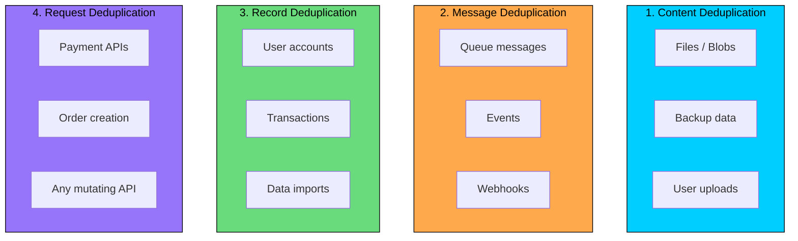

| Type | Goal | Example |
|------|------|---------|
| **Content** | Store identical files once | Same photo uploaded by 1000 users |
| **Message** | Process each message exactly once | Kafka consumer handling retries |
| **Record** | Prevent duplicate database entries | One account per email address |
| **Request** | Make API calls safely repeatable | Payment that can be retried without double-charging |

---

# Strategy 1: Content-Based Deduplication (Hashing)

This is the workhorse of file storage systems. The idea is elegantly simple: compute a cryptographic hash of the content and use it as the identifier. Two files with identical content produce identical hashes, regardless of their filenames, owners, or when they were uploaded.

### How It Works

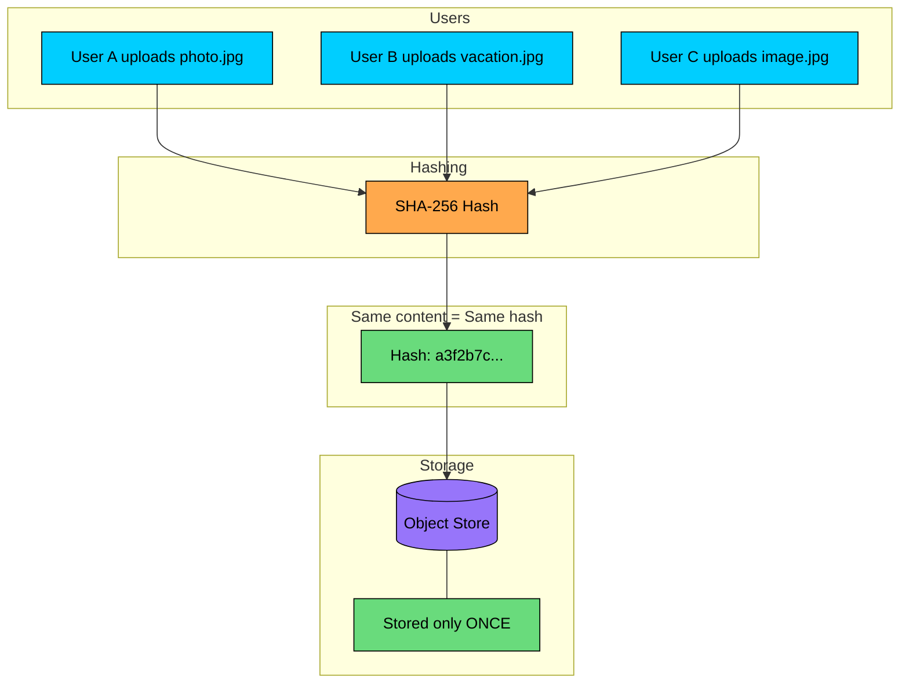

The upload flow works as follows:

1. Compute SHA-256 hash of the file content
2. Check if this hash already exists in the metadata database
3. If yes, create a reference to the existing file (no upload needed)
4. If no, upload the file and store its hash

The storage savings can be dramatic. When 1000 users upload the same 50MB vacation photo, the system stores just 50MB instead of 50GB. Popular files like common profile pictures, default avatars, or viral memes get stored once regardless of how many users "own" them.

### Data Model

You need two tables: one for unique content, one for user references.

Multiple users can reference the same physical file. Each user sees their own filename, but the storage is shared.

### Chunk-Level Deduplication

File-level deduplication only helps when files are byte-for-byte identical. But real-world files often have significant overlap without being exact copies. Two versions of the same document, a video with one frame changed, or a backup with minor edits, these share most of their content but would be stored entirely separately with file-level dedup.

Chunk-level deduplication solves this by splitting files into smaller pieces:

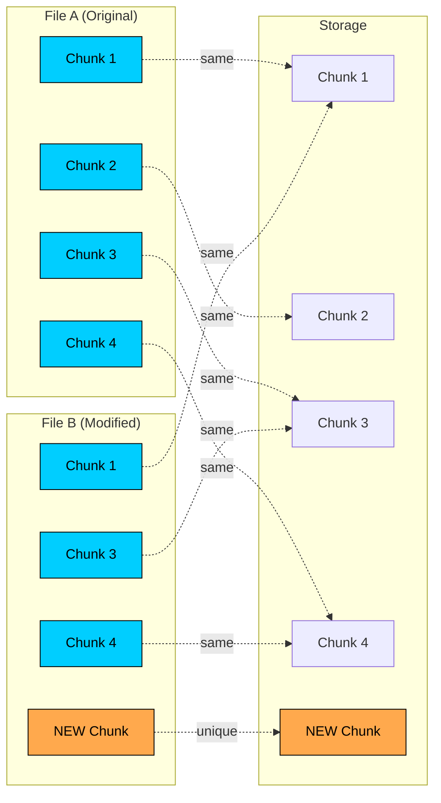

Even though File B is different from File A, 3 out of 4 chunks are shared. Only the new chunk needs storage.

### Fixed vs Content-Defined Chunking

| Approach | How It Works | Best For |
|----------|--------------|----------|
| **Fixed-size** | Split at every N bytes (e.g., 4MB) | Simple implementation |
| **Content-defined** | Use rolling hash to find natural boundaries | Better dedup when data shifts |

Fixed-size chunking has a subtle problem. If you insert a single byte at the beginning of a file, every chunk boundary shifts, making all subsequent chunks appear different even though the content is nearly identical.

Content-defined chunking (CDC) avoids this by using a rolling hash (like Rabin fingerprint) to find chunk boundaries based on content patterns rather than fixed positions. When the rolling hash hits a specific pattern, that becomes a boundary. Insert data at the beginning, and most boundaries remain the same because they are determined by the content around them, not their absolute position.

### Trade-offs

| Pros | Cons |
|------|------|
| Significant storage savings | CPU overhead for hashing |
| Works across users and systems | Complexity with chunking |
| Content-addressable storage | Hash collision risk (minimal with SHA-256) |
| Built-in integrity verification | Encryption breaks deduplication |

The last point deserves attention: client-side encryption destroys deduplication. Encrypted versions of the same file produce completely different hashes. Systems like Dropbox faced this trade-off directly, offering either strong deduplication or client-side encryption, but not both.

---

# Strategy 2: Message Deduplication with IDs

Message queues like Kafka, RabbitMQ, and SQS provide at-least-once delivery, not exactly-once. This is by design, when in doubt, the queue redelivers rather than risking message loss. The responsibility for handling duplicates falls on the consumer.

The solution is straightforward: track which messages you have already processed and skip any you see again.

### How It Works

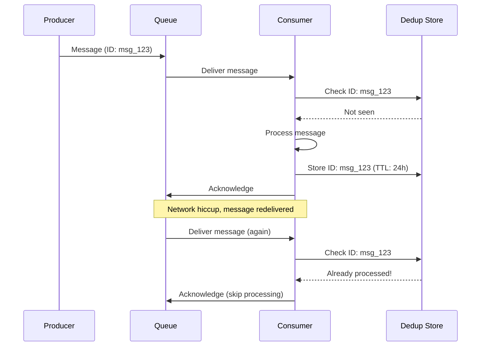

### The Deduplication Flow

1. **Receive message** with a unique ID (producer-assigned or queue-generated)
2. **Check dedup store** (Redis) for this ID
3. **If found**: Skip processing, acknowledge to queue
4. **If not found**: Process the message
5. **Mark as processed** in dedup store with a TTL
6. **Acknowledge** to queue

The TTL is important. Without it, your dedup store would grow indefinitely. With a 24-hour TTL, you are protected against duplicates during that window, which covers the vast majority of retry scenarios.

### Handling the Race Condition

A naive check-then-process approach has a subtle race condition. When multiple consumers receive the same message simultaneously, both might check the store, both find nothing, and both proceed to process:

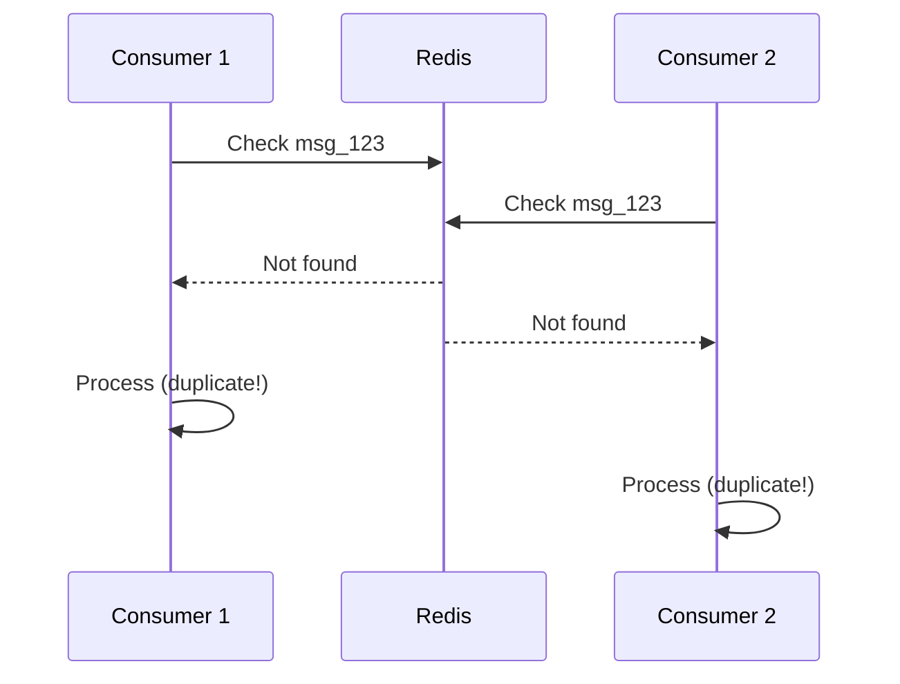

The fix is to combine the check and claim into a single atomic operation using Redis SETNX (set-if-not-exists):

Only one consumer wins the race. The others see the key already exists and skip processing. This is the same principle behind distributed locking, and Redis is well-suited for both use cases.

### Failure Handling

Different failure modes require different responses:

| Scenario | What Happens |
|----------|--------------|
| **Processing succeeds** | Keep the key (prevents reprocessing) |
| **Processing fails** | Delete the key (allow retry) |
| **Consumer crashes** | Key expires via TTL (allow retry) |

The TTL handles the crash scenario gracefully. If a consumer claims a message but dies before completing, the key eventually expires and another consumer can retry. This creates a window where the message appears "stuck," but the system self-heals without human intervention.

This pattern gives you "effectively once" semantics: the message might be delivered multiple times, but your system processes it only once.

---

# Strategy 3: Database-Level Deduplication

When the duplicates you are fighting are database records, the database itself is your best ally. Databases have been solving consistency problems for decades, and their constraint systems are battle-tested and transactionally safe.

### Unique Constraints

The simplest and most reliable deduplication strategy is often just a unique constraint:

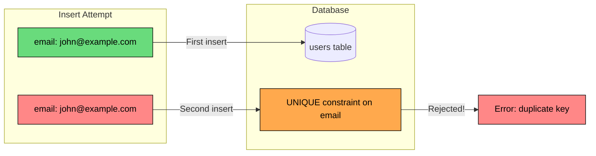

| Constraint Type | Example | Use Case |
|-----------------|---------|----------|
| **Single column** | `UNIQUE(email)` | One account per email |
| **Composite** | `UNIQUE(event_id, user_id)` | One registration per user per event |
| **Partial** | `UNIQUE(email) WHERE deleted = false` | Allow soft-deleted duplicates |

### Upsert: Insert or Update

A common anti-pattern is checking for existence before inserting. This creates a race condition: two requests might both check, both find nothing, and both insert. The unique constraint catches this, but now you are handling errors in application code.

A cleaner approach is the database-level upsert, which combines check-and-insert into a single atomic operation:

This is atomic. No race conditions. Either a new row is created, or the existing row is updated. Your application code remains simple because the database handles the complexity.

### Fuzzy Deduplication

Exact matching only goes so far. In the real world, "John Doe" and "JOHN DOE" are the same person. "john@gmail.com" might be the same as "john.doe@gmail.com" (Gmail ignores dots in addresses). User-submitted data is messy, and strict equality misses obvious duplicates.

```mermaid
flowchart TD
    NEW[New Record:<br/>John Doe<br/>john@gmail.com]

    CHECK{Find similar<br/>records}

    EXACT[Exact match"]
    FUZZY[Fuzzy match"]
    MULTI[Multiple matches"]

    MERGE[Merge with existing]
    CREATE[Create new record]
    FLAG[Flag for human review]

    NEW --> CHECK
    CHECK --> EXACT
    CHECK --> FUZZY
    CHECK --> MULTI

    EXACT -->|Yes| MERGE
    FUZZY -->|High confidence| MERGE
    MULTI -->|Ambiguous| FLAG
    CHECK -->|No matches| CREATE

    style NEW fill:#00ceff,stroke:#000,color:#000
    style MERGE fill:#69db7c,stroke:#000,color:#000
    style CREATE fill:#69db7c,stroke:#000,color:#000
    style FLAG fill:#ffa94d,stroke:#000,color:#000
```

Fuzzy matching techniques include:

- **Normalization**: Lowercase, trim whitespace, remove special characters before comparison
- **Similarity functions**: PostgreSQL's `SIMILARITY()` for trigram matching, Levenshtein distance for edit distance
- **Phonetic matching**: Soundex or Metaphone algorithms for names that sound alike but are spelled differently

The key insight is knowing when not to decide automatically. When match confidence is low or multiple records are equally plausible matches, flagging for human review beats making wrong automated decisions. False negatives (creating a duplicate) are usually less harmful than false positives (merging two distinct records).

---

# Strategy 4: Idempotency Keys for APIs

For payment APIs and other operations where duplicates have real-world consequences, the client becomes a partner in deduplication. The client provides a unique key with each request, and if the same key appears twice, the server returns the cached response instead of processing again.

This flips the responsibility: instead of the server trying to detect duplicates, the client explicitly declares "this is a retry of that request."

### How It Works

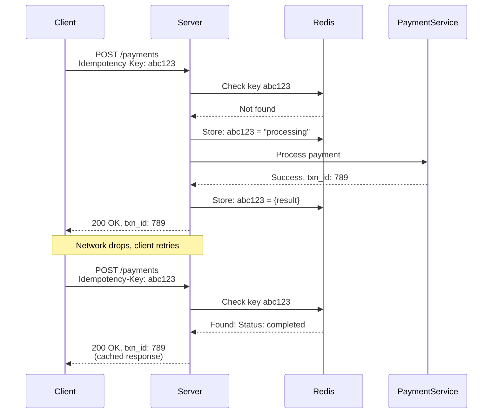

The client receives the same response whether the request was processed once or retried ten times. From the client's perspective, the operation succeeded exactly once.

### The Client's Responsibility

The client holds up its end of the contract by following three rules:

1. **Generate a unique key** for each distinct operation (typically a UUID)
2. **Reuse the same key** when retrying that same operation
3. **Never reuse a key** for a different operation

### Server-Side States

The server tracks each idempotency key through a state machine:

| Key Status | Server Action |
|------------|---------------|
| **Not found** | Process the request, store "processing" status |
| **Processing** | Return 409 Conflict (another request in flight) |
| **Completed** | Return cached response |
| **Failed** | Delete key, allow retry |

The "processing" state prevents a subtle issue: if two identical requests arrive simultaneously, you want only one to execute. The second request should wait or fail, not create a duplicate.

### Real-World Example: Stripe

Stripe built their entire payment API around idempotency keys:

If your network drops after Stripe processes the charge but before you receive the response, you can safely retry with the same key. Stripe recognizes the duplicate, skips reprocessing, and returns the original result. The customer gets charged exactly once, regardless of network conditions.

This pattern has become standard practice for any API that modifies state. When you build payment, order, or booking systems, idempotency keys should be a default, not an afterthought.

---

# Strategy 5: Bloom Filters for Approximate Deduplication

When you are processing millions of items per second, checking Redis or a database for every single one becomes a bottleneck. Network round-trips add latency, and your storage layer becomes the limiting factor.

Bloom filters solve this by keeping a compact in-memory summary that can answer "have I seen this before"" in microseconds.

### How Bloom Filters Work

A Bloom filter is a probabilistic data structure that trades perfect accuracy for massive space savings:

- **"No"** = Definitely not seen (100% accurate, no false negatives)
- **"Yes"** = Probably seen (may have false positives, but false positive rate is controllable)

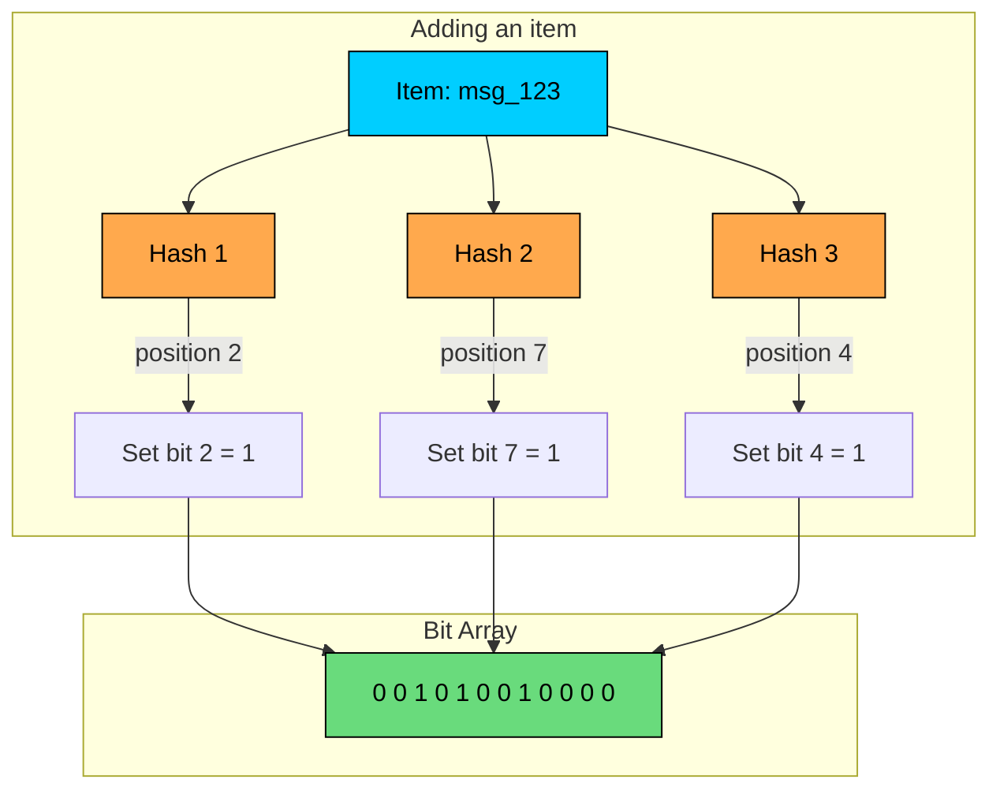

To check if an item exists:

1. Hash the item using the same hash functions to get bit positions
2. Check if ALL those bits are set to 1
3. If any bit is 0, the item was definitely never added (guaranteed)
4. If all bits are 1, the item was probably added (small chance of false positive due to hash collisions)

The false positive rate depends on how full the bit array gets. A 1% false positive rate means 99% of "yes" answers are correct, which is good enough for many use cases.

### Using Bloom Filters for Deduplication

The insight is that you do not need Bloom filters to replace exact storage, you use them to avoid unnecessary lookups:

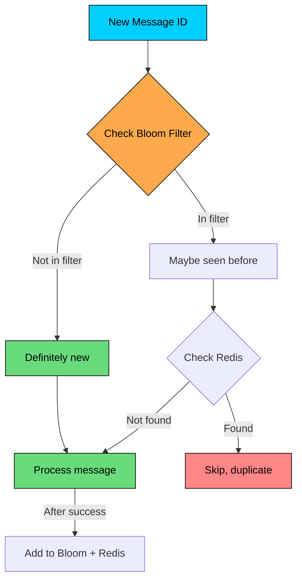

Most messages are new, so the Bloom filter returns "No" and we skip the Redis lookup entirely. Only the small percentage flagged as potential duplicates need verification against the authoritative store.

In high-throughput systems, this optimization is significant. If 99% of messages are unique, you eliminate 99% of your Redis lookups.

### Space Efficiency

A Bloom filter with 1% false positive rate needs only about 10 bits per item. For 100 million items:

| Storage | Size |
|---------|------|
| Hash set (exact) | ~3.2 GB |
| Bloom filter (1% FP) | ~120 MB |

That is a 25x reduction in memory. And the Bloom filter can stay entirely in-process memory, avoiding network round-trips.

### When to Use Bloom Filters

Bloom filters shine when false positives are acceptable or can be verified cheaply:

| Use Case | Bloom Filter" | Why |
|----------|---------------|-----|
| Web crawler (visited URLs) | Yes | False positives just skip a URL, no harm done |
| Spam filter | Yes | Occasional false positive is acceptable |
| Cache existence check | Yes | Avoids expensive backend lookups |
| Payment deduplication | No | Cannot afford false positives, double charges are unacceptable |
| Message queue (with backup) | Yes | Bloom filter + exact store verification |

---

# Strategy 6: Deduplication in Event-Driven Systems

Event-driven architectures face a fundamental challenge: you cannot make "write to database" and "publish to queue" atomic. One will always complete before the other, creating a window for failure.

### The Problem

Consider what happens when you create an order and need to publish an event:

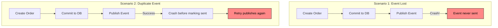

Either scenario is bad. Lost events break downstream systems. Duplicate events cause double processing.

The fundamental issue is trying to coordinate two systems (database and queue) that do not share a transaction. This is the dual-write problem, and it has no perfect solution, only trade-offs.

### The Outbox Pattern

The outbox pattern sidesteps dual-write by eliminating it. Instead of writing to both systems, you write only to the database. The event goes into an **outbox table** in the same transaction as your business data:

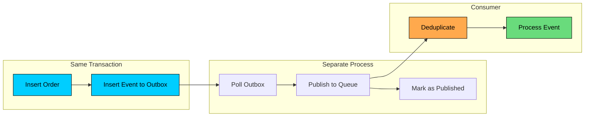

1. **Producer**: Write business data and event to outbox in the same DB transaction (atomic)
2. **Publisher**: Separate process polls outbox, publishes events to queue, marks as sent
3. **Consumer**: Deduplicate using event ID before processing

The key insight is that the database transaction guarantees atomicity. Either both the order and the event are persisted, or neither is. No more lost events.

But there is a catch. The publisher might crash after publishing to the queue but before marking the event as sent. On restart, it publishes the same event again. This is unavoidable, the outbox pattern trades lost events for duplicate events.

### Why Consumer-Side Dedup Is Essential

The outbox pattern guarantees that events are published at least once, not exactly once. Duplicates are an expected part of the system, not an edge case.

Consumers must handle this using the same strategies we discussed earlier: track processed event IDs in Redis, make handlers idempotent, or use database constraints. The outbox pattern solves the producer's problem but explicitly pushes deduplication responsibility to consumers.

---

# Comparison of Strategies

| Strategy | Space | Time | Accuracy | Best For |
|----------|-------|------|----------|----------|
| Content Hashing | O(n) hashes | O(1) lookup | Exact | File storage |
| Message ID Tracking | O(n) IDs | O(1) lookup | Exact | Message queues |
| DB Unique Constraints | Index space | O(log n) | Exact | Record dedup |
| Idempotency Keys | O(n) keys | O(1) lookup | Exact | API requests |
| Bloom Filters | O(n) bits | O(k) hashes | Approximate | High volume |
| Chunk Deduplication | O(chunks) | O(1) per chunk | Exact | Large files |

---

# Decision Guide

```mermaid
flowchart TD
    A[What are you deduplicating"] --> B{Type"}

    B -->|Files/Blobs| C{Size"}
    B -->|Messages| D[Message ID + Redis]
    B -->|DB Records| E[Unique Constraints]
    B -->|API Requests| F[Idempotency Keys]

    C -->|Small < 10MB| G[Content Hash]
    C -->|Large > 10MB| H[Chunk Dedup]

    D --> I{Volume"}
    I -->|< 1M/day| J[Exact Store]
    I -->|> 1M/day| K[Bloom + Exact]

    style A fill:#00ceff,stroke:#000,color:#000
    style D fill:#69db7c,stroke:#000,color:#000
    style E fill:#69db7c,stroke:#000,color:#000
    style F fill:#69db7c,stroke:#000,color:#000
    style G fill:#69db7c,stroke:#000,color:#000
    style H fill:#69db7c,stroke:#000,color:#000
```

---

# Best Practices

### 1. Choose the Right Granularity

The granularity of deduplication affects both storage savings and overhead:

- **Too coarse** (whole-file dedup): Miss opportunities when files differ slightly
- **Too fine** (byte-level): Overhead exceeds storage savings, metadata grows large

For file storage, chunk-level deduplication (4KB-64KB chunks) typically offers the best balance between dedup ratio and metadata overhead. The exact size depends on your workload, smaller chunks find more duplicates but require more metadata.

### 2. Set Appropriate TTLs

Deduplication state cannot grow forever. Your Redis or database will run out of space. Choose TTLs based on realistic retry windows:

| Dedup Type | Recommended TTL | Rationale |
|------------|----------------|-----------|
| Message dedup | 24 hours | Covers most retry scenarios |
| Idempotency keys | 24 hours | Covers user session |
| Content hashes | No expiry | Use reference counting instead |

### 3. Handle Failures Correctly

Not all errors are the same, and your response should differ:

| Error Type | Action | Why |
|------------|--------|-----|
| **Transient** (timeout, network) | Do NOT mark processed | Allow retry after backoff |
| **Permanent** (validation, business) | Mark as processed | Prevent infinite retries of broken data |
| **Unknown** | Log and alert | May need human intervention |

The worst outcome is a permanent error that is not marked as processed. The system retries forever, consuming resources and generating alerts that train operators to ignore them.

### 4. Monitor Effectiveness

Track these metrics to understand if deduplication is working:

- **Dedup hit rate**: Percentage of items detected as duplicates
- **Storage saved**: Bytes not stored due to deduplication
- **Lookup latency**: Time to check dedup store (should be sub-millisecond)
- **False positive rate**: For Bloom filters, track how often you verify a duplicate that turns out to be unique

A low hit rate might mean duplicates are rare (good) or your dedup is broken (bad). Context matters. Correlate with retries and error rates to understand what you are seeing.

---

# Common Interview Questions

**Q: How would you deduplicate files in a cloud storage system like Dropbox"**

A: Use content-based deduplication with SHA-256 hashing. For large files, implement chunk-level deduplication with content-defined chunking to handle partial file updates efficiently. Store content once with reference counting, and maintain a mapping from user files to content hashes.

**Q: How do you ensure exactly-once processing in a message queue"**

A: True exactly-once is impossible in distributed systems. Instead, implement effectively-once by combining at-least-once delivery with consumer-side deduplication. Track processed message IDs in Redis or a database, and make handlers idempotent so reprocessing has no additional effect.

**Q: What is the trade-off between Bloom filters and exact deduplication"**

A: Bloom filters use constant space regardless of item count (after initialization) and offer O(k) lookup where k is hash count. The trade-off is false positives, meaning you might occasionally process something as duplicate when it is not. Use Bloom filters for high-volume, low-criticality deduplication, and exact methods for financial or transactional data.

**Q: How do you handle deduplication across multiple data centers"**

A: Options include: (1) Centralized dedup store with cross-DC replication, (2) Two-phase approach where local Bloom filters handle most cases and a central store resolves positives, (3) Eventual consistency where duplicates are reconciled asynchronously. The choice depends on latency requirements and consistency needs.

---

# Summary

Deduplication is not optional in distributed systems. Networks are unreliable, services retry, and users double-click. The question is not whether duplicates will happen, but how gracefully your system handles them.

| Strategy | Key Idea | Best For |
|----------|----------|----------|
| **Content Hashing** | Hash content, store once | File storage, blobs |
| **Chunk Deduplication** | Split into chunks, dedup each | Large files, backups |
| **Message ID Tracking** | Track processed IDs | Message queues |
| **Unique Constraints** | Let DB reject duplicates | Record deduplication |
| **Idempotency Keys** | Client-provided request ID | API requests, payments |
| **Bloom Filters** | Probabilistic membership test | High-volume streams |

Start with the simplest solution that meets your requirements. Database constraints handle record deduplication with zero additional code. Content hashing solves file storage with a single hash function. Only reach for Bloom filters when processing millions of items per second, and only use the outbox pattern when you need event-driven architectures.

The goal is not zero duplicates (impossible in distributed systems) but rather systems that behave correctly regardless of how many times an operation is attempted.

---

# References

- [Designing Data-Intensive Applications by Martin Kleppmann](https://dataintensive.net/)
- [Bloom Filters by Example](https://llimllib.github.io/bloomfilter-tutorial/)
- [Content-Defined Chunking](https://restic.net/blog/2015-09-12/restic-foundation1-cdc/)
- [Stripe: Idempotent Requests](https://stripe.com/docs/api/idempotent_requests)
- [AWS S3 Data Consistency Model](https://docs.aws.amazon.com/AmazonS3/latest/userguide/Welcome.html)
- [Redis: Distributed Locks](https://redis.io/docs/manual/patterns/distributed-locks/)

---

# Quiz
