Picture this scenario: a customer clicks "Place Order" on your e-commerce site. Behind the scenes, three things need to happen. The Inventory Service must reserve the items, the Payment Service must charge the customer's card, and the Order Service must create a record of the purchase. All three must succeed together, or none should happen at all.

What happens if the payment goes through, but the inventory update fails" You've just charged someone for a product you can't deliver. What if the order gets created, but the payment fails" You've promised goods without getting paid.

When all your data lives in a single database, solving this is straightforward. You wrap everything in a transaction, and the database guarantees that either all operations commit or none do. But the moment your data spreads across multiple services or databases, you've entered the world of **distributed transactions**, one of the genuinely hard problems in distributed systems.

This chapter covers why distributed transactions are so challenging, the different approaches engineers have developed to handle them, and how to choose the right approach for your system.

---

# 1. What is a Distributed Transaction"

> [!PAYWALL] This content is for premium members only.

A **distributed transaction** is a transaction that spans multiple nodes, databases, or services. Like a local transaction, it needs to guarantee that either all operations commit together, or none of them do.

The difference becomes clear when you compare the two:

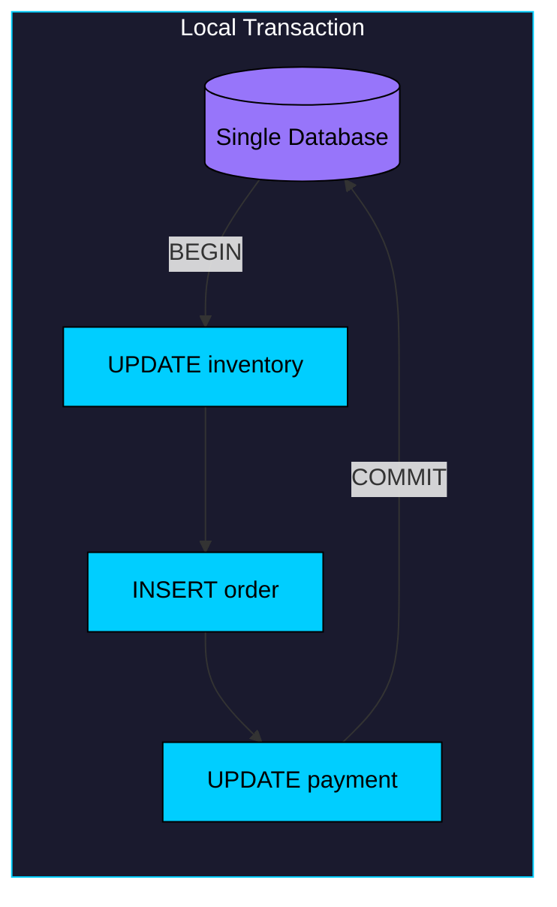

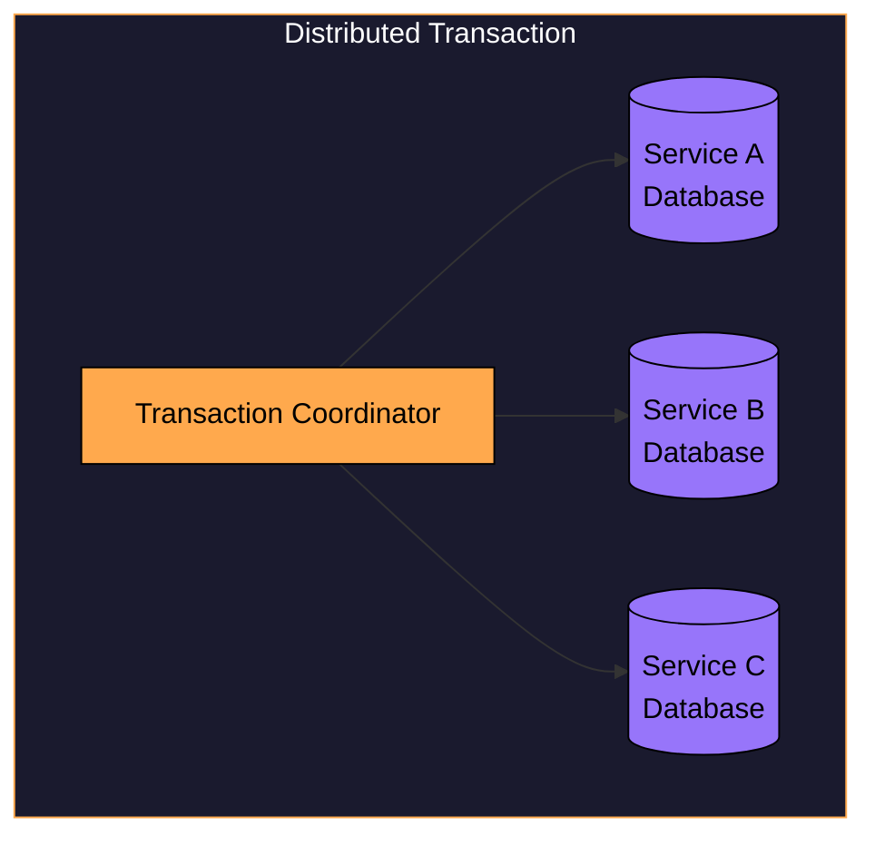

In a local transaction, the database handles everything. It guarantees the **ACID** properties we rely on:

- **Atomicity:** All operations succeed or all fail together
- **Consistency:** The database moves from one valid state to another
- **Isolation:** Concurrent transactions don't interfere with each other
- **Durability:** Once committed, changes survive crashes and restarts

When data is split across services, no single system has enough control to enforce these properties. Each service manages its own database, and none of them can see what the others are doing.

This is the fundamental challenge: how do you get multiple independent systems to agree on whether to commit or abort, when any of them might crash or become unreachable at any moment"

---

# 2. Why Distributed Transactions Are Hard

To appreciate why distributed transactions are genuinely difficult, it helps to understand the fundamental obstacles you're working against.

### 2.1 The Two Generals Problem

There's a classic thought experiment that captures the core difficulty. Two armies are camped on opposite sides of a valley, planning to attack a city between them. They need to coordinate their attack, because if only one army attacks, it will be defeated. But they can only communicate by sending messengers through the valley, and messengers might be captured.

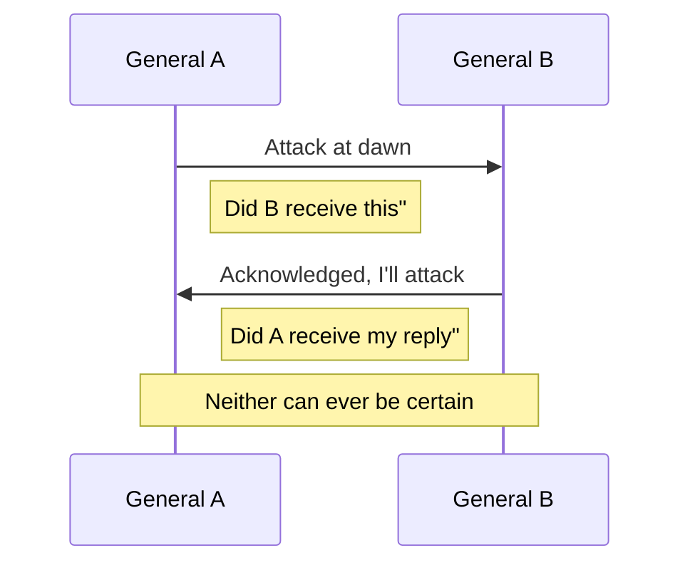

General A sends "Attack at dawn." But did General B receive it" To find out, General B sends back "Acknowledged, I'll attack." But now General B wonders: did General A receive my acknowledgment" Even if General A sends back "Got your ack," General A now wonders if that message arrived.

No matter how many messages they exchange, neither general can be completely certain the other received their last message. This uncertainty is fundamental. It's not a problem you can solve with more messages or better protocols.

Distributed transactions face the same challenge. When Service A and Service B need to agree on committing, they're dealing with this exact uncertainty. Any message might be lost, and either node might fail.

### 2.2 Network Failures

Networks fail in ways that are hard to reason about. Messages can be lost entirely and never arrive. They can be delayed and show up seconds or minutes later than expected. They can be duplicated and arrive multiple times. They can arrive out of order.

A distributed transaction protocol has to handle all of these scenarios correctly. And here's the tricky part: when you send a message and don't get a response, you can't tell the difference between the message being lost, the response being lost, or the other node being slow or crashed.

### 2.3 Node Failures

Nodes can crash at the worst possible moments:

- Before receiving a message
- After receiving but before processing it
- After processing but before sending a response
- After sending a response but before the sender receives it

Each of these failure points creates different problems. A system might have executed an operation but crashed before it could tell anyone. Or it might have told the coordinator it was ready to commit, then crashed before committing. The system needs to recover correctly no matter when the failure occurred.

### 2.4 The CAP Theorem

The **CAP theorem** formalizes a fundamental trade-off in distributed systems. You can only guarantee two of these three properties:

- **Consistency:** All nodes see the same data at the same time
- **Availability:** Every request receives a response
- **Partition Tolerance:** The system continues operating despite network partitions

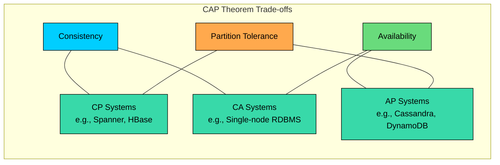

Network partitions happen in real systems, so you effectively have to choose between consistency and availability. Strong distributed transactions choose **consistency**. When you can't reach all participants, you can't complete the transaction, so you sacrifice availability to maintain correctness.

---

# 3. Approaches to Distributed Transactions

Given these challenges, engineers have developed several approaches to distributed transactions. They fall into three broad categories, each with different trade-offs between consistency, availability, and complexity.

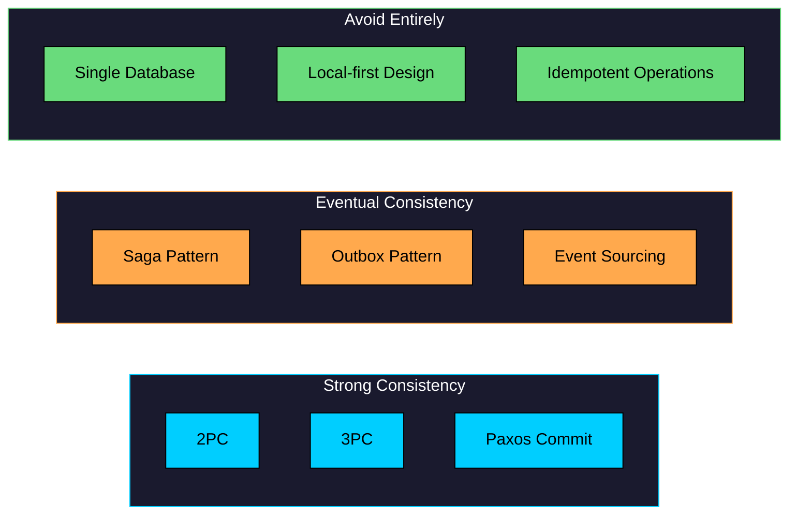

The strong consistency approaches try to provide the same guarantees as a local transaction. The eventual consistency approaches accept that the system might be temporarily inconsistent, but guarantee it will eventually converge. And sometimes the best approach is to restructure your system so you don't need distributed transactions at all.

Let's examine each approach in detail.

---

# 4. Two-Phase Commit (2PC)

**Two-Phase Commit** is the oldest and most widely-known solution for distributed transactions. The idea is simple: designate one node as the coordinator, and have it orchestrate the transaction across all participants.

### How It Works

The protocol has two phases, each with a specific purpose.

**Phase 1: Prepare (Voting)**

The coordinator asks each participant if it can commit. Each participant executes the transaction locally, acquires any necessary locks, and writes to its log, but doesn't actually commit yet. Then it votes: YES if it can definitely commit, NO if something went wrong.

**Phase 2: Commit (Decision)**

If all participants voted YES, the coordinator sends a COMMIT message to everyone. If any participant voted NO, the coordinator sends ABORT. Participants execute the decision and acknowledge.

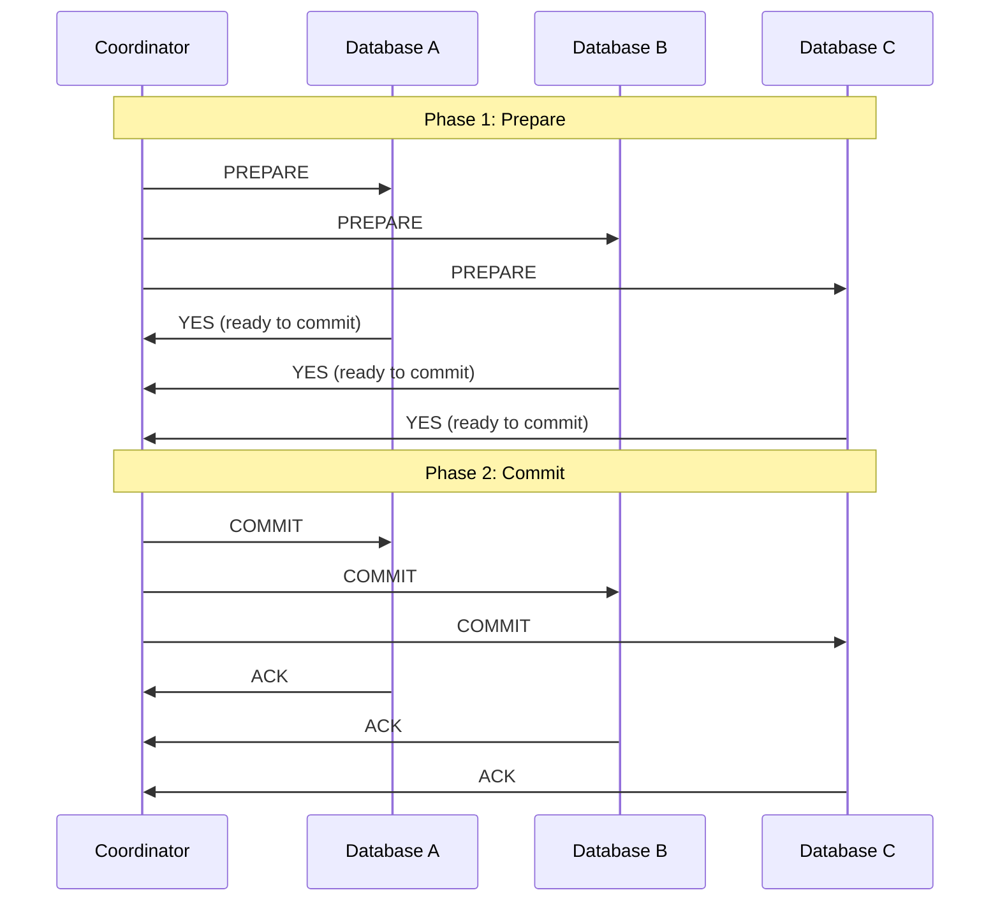

The key insight is that once a participant votes YES, it promises to commit if asked, no matter what happens. It has written enough to its log that even after a crash, it can recover and complete the commit.

### The Problem: Blocking

Here's where 2PC runs into trouble. Once participants vote YES, they're stuck waiting for the coordinator's decision. They're holding locks on the data they're about to modify, blocking other transactions that want to access that data.

If the coordinator crashes after collecting the YES votes but before sending the decision, participants have no way to proceed. They can't commit because they don't know if other participants might have voted NO. They can't abort because they've already promised to commit if asked. They just wait.

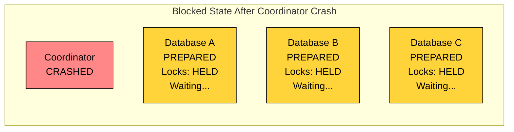

In practice, this blocking can cascade. The locked data might be needed by other transactions, which then block, which might cause timeouts in dependent services, and so on. A single coordinator failure can bring significant parts of your system to a halt.

### When to Use 2PC

Despite its limitations, 2PC remains useful in specific scenarios:

- Transactions within a single data center where network partitions are rare
- Short-lived transactions where the blocking window is small
- Systems using databases that support the XA protocol (MySQL, PostgreSQL, Oracle)
- Cases where strong consistency is essential and you can tolerate reduced availability

---

# 5. Three-Phase Commit (3PC)

**Three-Phase Commit** was designed to address 2PC's blocking problem by adding an extra phase. The idea is to give participants more information before they commit, so they can make progress even if the coordinator fails.

### How It Works

3PC splits the process into three phases:

1. **CanCommit:** The coordinator asks each participant if it can commit. This is similar to 2PC's prepare phase, but participants don't acquire locks yet.
2. **PreCommit:** If all participants say yes, the coordinator tells them to prepare. Now they acquire locks and get ready to commit. This phase signals that the coordinator intends to commit.
3. **DoCommit:** The coordinator tells everyone to actually commit.

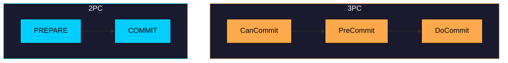

### The Benefit

The key improvement is that a participant in the PreCommit state knows something important: all other participants said they could commit. If the coordinator crashes, the participant can safely assume the transaction should commit (after a timeout). In 2PC, participants in the prepared state have no idea what other participants said.

### The Limitation

3PC solves the blocking problem but introduces a new one. During a network partition, different groups of participants might make different decisions. One partition might timeout and commit, while the other partition might timeout and abort. The system becomes inconsistent.

This is the CAP theorem in action. 3PC trades consistency for availability, which is usually the wrong trade-off for a transaction protocol.

### When to Use 3PC

Almost never. 3PC is more of a theoretical stepping stone than a practical solution:

- It doesn't handle network partitions, which are inevitable in real systems
- It adds an extra round trip, increasing latency
- Better alternatives exist, like Paxos Commit which provides non-blocking behavior while maintaining consistency, or Saga patterns which take a fundamentally different approach

---

# 6. Saga Pattern

The **Saga pattern** takes a fundamentally different approach. Instead of trying to make multiple systems commit atomically, it breaks the distributed transaction into a sequence of local transactions. Each local transaction commits immediately and publishes an event or message that triggers the next step. If something fails partway through, the saga executes **compensating transactions** to undo the work that's already been done.

This approach trades strong consistency for availability and simplicity. The system is temporarily inconsistent while the saga is running, but it eventually reaches a consistent state.

### How It Works

Consider an e-commerce order that needs to go through four steps:

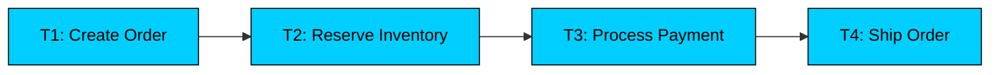

Each step is a local transaction that commits immediately. But what happens if payment processing fails after the order was created and inventory was reserved" The saga needs to undo those steps:

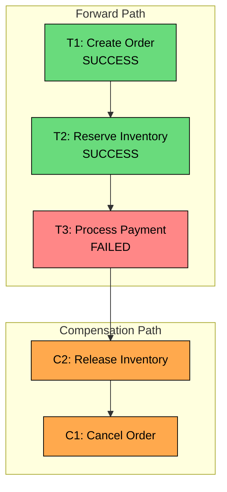

Compensating transactions run in reverse order, undoing the effects of each successful step. This is where things get tricky: compensating transactions aren't always straightforward. You can't "unsend" an email, and refunding a payment isn't the same as never charging in the first place. Designing good compensation logic requires careful thought about what "undo" really means for each operation.

### Orchestration vs Choreography

There are two fundamentally different ways to coordinate a saga.

**Orchestration** uses a central coordinator that tells each service what to do next. The orchestrator maintains the saga's state and decides what happens when each step succeeds or fails.

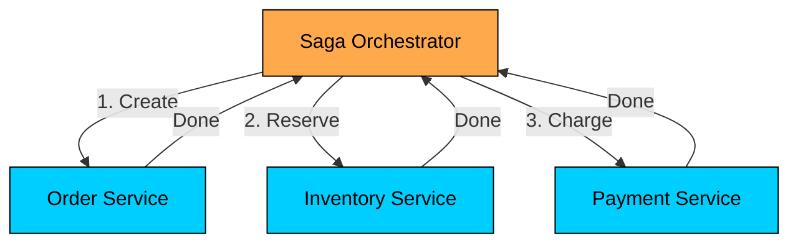

**Choreography** has no central coordinator. Each service publishes events when it completes its work, and other services subscribe to those events and react accordingly.

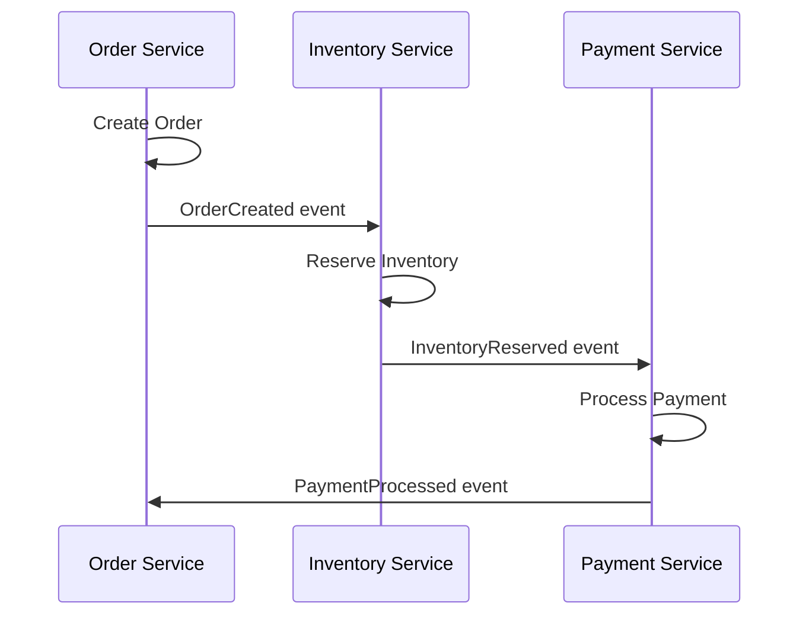

Each approach has trade-offs:

| Aspect | Orchestration | Choreography |
|--------|---------------|--------------|
| **Complexity** | Centralized logic, easier to understand and debug | Logic distributed across services, harder to trace end-to-end |
| **Coupling** | Orchestrator knows about all services | Services only know about the events they care about |
| **Single Point of Failure** | Orchestrator (though it can be made resilient) | No single point of failure |
| **Adding Steps** | Modify the orchestrator | Add new service that subscribes to existing events |

Orchestration tends to work better for complex workflows where you need clear visibility into what's happening. Choreography works better when you want loose coupling and expect the workflow to evolve as new services are added.

### When to Use Sagas

Sagas are well-suited to microservices architectures where strong consistency across services isn't required, transactions might be long-running (minutes or hours), you can define meaningful compensating actions for each step, and availability is more important than the brief inconsistency window.

---

# 7. TCC Pattern (Try-Confirm-Cancel)

**TCC** is a variation of the saga pattern that adds explicit reservation semantics. Where sagas commit each step immediately and compensate on failure, TCC first reserves resources without committing, then either confirms all reservations or cancels them.

Each operation in TCC has three phases:

1. **Try:** Check preconditions and reserve resources, but don't commit
2. **Confirm:** Finalize the reserved resources (can't fail if Try succeeded)
3. **Cancel:** Release all reservations

### How It Works

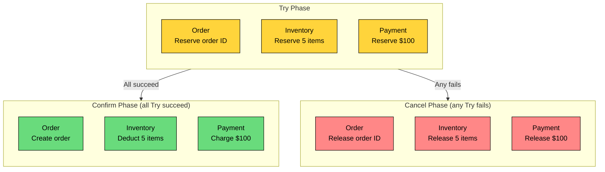

The key property of TCC is that once all Try phases succeed, the Confirm phase must not fail. This requires careful design: the Try phase needs to do all the validation and acquire all necessary resources, so Confirm just finalizes what's already been set aside.

### TCC vs Saga

| Aspect | TCC | Saga |
|--------|-----|------|
| **Reservation** | Explicit Try phase holds resources | Each step commits immediately |
| **Isolation** | Better, reserved resources aren't visible to others | Worse, intermediate states are visible |
| **Complexity** | Higher, three operations per service | Lower, two operations per service |
| **Rollback** | Cancel releases reservations cleanly | Compensating transactions undo committed work |

The practical difference is isolation. In a saga, when the Order Service creates an order, that order exists in the database and might be visible to other queries. In TCC, the order is in a "reserved" or "pending" state until Confirm runs.

### When to Use TCC

TCC works well for financial transactions where you want to reserve funds before committing, scenarios where visibility of intermediate states would cause problems, and short-lived transactions where you can hold reservations without blocking others for too long.

---

# 8. Outbox Pattern

The **Outbox pattern** sidesteps the distributed transaction problem entirely by ensuring that a database write and an event publication happen together, without requiring coordination between multiple systems.

### The Problem It Solves

In event-driven architectures, a common pattern is to update a database and then publish an event so other services can react. But these are two separate operations, and they can fail independently:

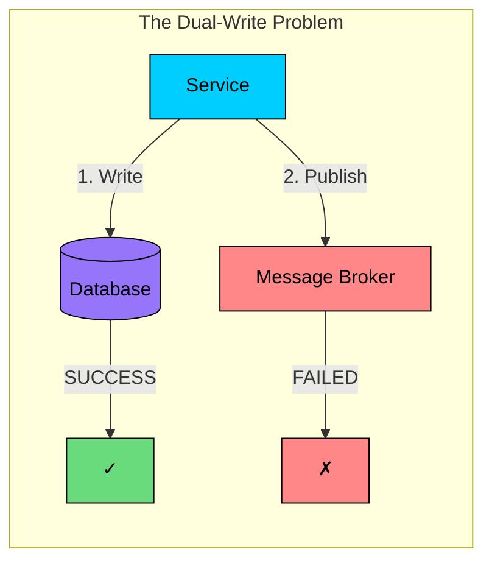

If the database write succeeds but the message broker is unavailable, the database is updated but downstream services never find out. You end up with an inconsistent system.

You might think you could just swap the order: publish first, then write. But that has the opposite problem. If the message is published but the database write fails, you've told other services about something that didn't actually happen.

### How It Works

The outbox pattern solves this with a clever trick. Instead of trying to coordinate between the database and message broker, it uses a single database transaction that writes both the business data and the event to be published.

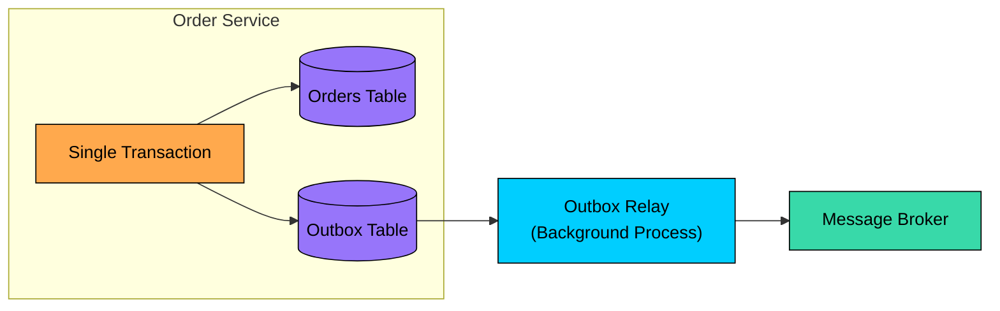

1. In a single local transaction, write the business data AND insert a row into an "outbox" table describing the event
2. A separate background process reads from the outbox table and publishes events to the message broker
3. After successfully publishing, mark the event as processed

The key insight is that the database transaction guarantees atomicity: either both the business data and the outbox row are written, or neither is. The outbox relay then handles the eventually-consistent delivery to the message broker. If it fails, it will retry. The event might be delivered multiple times, so consumers need to be idempotent, but it won't be lost.

### Outbox Table Schema

### When to Use Outbox Pattern

The outbox pattern is a good fit for event-driven architectures where services communicate through events, systems where you need reliable event publishing (no lost messages), microservices that need to maintain eventual consistency, and as the foundation for implementing sagas with choreography.

---

# 9. Comparison of Approaches

Each approach makes different trade-offs. The right choice depends on your specific requirements.

| Approach | Consistency | Availability | Latency | Complexity | Best For |
|----------|-------------|--------------|---------|------------|----------|
| **2PC** | Strong | Low | Medium | Medium | Same data center, XA-compatible databases |
| **3PC** | Strong | Medium | High | High | Rarely used in practice |
| **Saga** | Eventual | High | Varies | High | Microservices, long-running transactions |
| **TCC** | Strong* | Medium | Medium | High | Financial systems with reservation semantics |
| **Outbox** | Eventual | High | Low | Low | Event-driven architectures |

*TCC provides strong consistency if all Confirms succeed; if any fail, compensation is needed.

### Decision Tree

When deciding which approach to use, start with your consistency requirements:

```mermaid
flowchart TB
    Start["Do you need strong consistency""]
    Start --> |"Yes"| SingleDB["Can you use a single database""]
    Start --> |"No (eventual OK)"| Reliable["Need reliable event publishing""]

    SingleDB --> |"Yes"| Local["Use local transactions"]
    SingleDB --> |"No"| XA["Do all participants support XA""]

    XA --> |"Yes"| TwoPC["Use 2PC"]
    XA --> |"No"| Reserve["Can you reserve resources""]

    Reserve --> |"Yes"| TCC["Use TCC"]
    Reserve --> |"No"| Accept["Accept eventual consistency<br/>Use Saga"]

    Reliable --> |"Yes"| Outbox["Use Outbox Pattern"]
    Reliable --> |"No"| Workflow["Need distributed workflow""]

    Workflow --> |"Yes"| Saga["Use Saga"]
    Workflow --> |"No"| Direct["Direct approach"]

    style Start fill:#00ceff,stroke:#000,color:#000
    style Local fill:#69db7c,stroke:#000,color:#000
    style TwoPC fill:#69db7c,stroke:#000,color:#000
    style TCC fill:#69db7c,stroke:#000,color:#000
    style Accept fill:#ffa94d,stroke:#000,color:#000
    style Outbox fill:#69db7c,stroke:#000,color:#000
    style Saga fill:#69db7c,stroke:#000,color:#000
    style Direct fill:#69db7c,stroke:#000,color:#000
```

The most important question is whether you can avoid distributed transactions entirely. If you can restructure your data or services to keep related data together, local transactions are simpler, faster, and more reliable than any distributed alternative.

---

# 11. Best Practices

Building reliable distributed transactions requires attention to several key principles.

### 11.1 Prefer Local Transactions

The simplest solution to the distributed transaction problem is to avoid distributed transactions. Before introducing cross-service coordination, ask yourself:

- Can you co-locate the data that needs to be updated together"
- Can you restructure your service boundaries so transactions don't cross them"
- Can you use a single database with multiple schemas instead of multiple databases"

Many architectures that seem to require distributed transactions can be redesigned to avoid them entirely. This isn't always possible, but it's worth the effort when it is.

### 11.2 Design for Idempotency

In distributed systems, retries are inevitable. Networks fail, timeouts happen, and sometimes you don't know whether an operation succeeded. The only safe way to handle this is to make every operation idempotent: calling it twice should have the same effect as calling it once.

The pattern is simple: include a unique request ID with every operation, and track which request IDs have already been processed.

### 11.3 Use Timeouts and Deadlines

Every distributed operation must have a timeout. Without one, a single unresponsive service can block your entire system indefinitely.

The timeout value matters. Too short and you'll fail healthy requests. Too long and failures will cascade. Start with something reasonable (a few seconds for most operations) and adjust based on observed behavior.

### 11.4 Implement Compensating Transactions Carefully

Compensating transactions are harder than they first appear. Consider an order saga that creates an order and sends a confirmation email. If payment later fails, you can cancel the order, but the email has already been sent.

Some side effects can't be truly undone. The key is to delay irreversible actions until you're confident they won't need to be compensated:

- Use "pending" or "reserved" states instead of immediately committing
- Delay sending notifications until the saga completes
- For actions that truly can't be undone, consider whether they belong in the saga at all

Also plan for compensation failures. What if the compensating transaction itself fails" You need monitoring and manual intervention procedures for these cases.

### 11.5 Monitor and Alert

Distributed transactions fail in ways that local transactions don't. Track these metrics:

- Success and failure rates for each transaction type
- Latency percentiles (p50, p95, p99)
- How often compensating transactions are triggered
- Transactions stuck in intermediate states

Set up alerts for stuck transactions. A transaction that's been "in progress" for hours is a sign of a problem that needs investigation.

### 11.6 Test Failure Scenarios

The only way to have confidence in your distributed transaction handling is to test what happens when things go wrong. Use chaos engineering techniques:

- Kill a service mid-transaction and verify the saga compensates correctly
- Introduce network delays and verify timeouts trigger appropriately
- Partition the network and verify the system doesn't end up in an inconsistent state

These tests often reveal subtle bugs that don't appear during normal operation.

---

# 12. Common Pitfalls

These are mistakes that consistently cause problems in distributed transaction implementations.

### Pitfall 1: Ignoring Partial Failures

In a distributed system, some operations might succeed while others fail. Code that assumes all-or-nothing behavior is dangerous:

This becomes second nature once you start thinking about it, but it's easy to miss in code reviews. Always ask: "What state is the system in if this line throws an exception""

### Pitfall 2: Assuming Networks Are Reliable

Networks fail in surprising ways. Messages can be lost entirely, arrive minutes late, arrive multiple times, or arrive out of order. Code that assumes the network is reliable will break:

- Always use acknowledgments to confirm messages were received
- Implement retries with exponential backoff to handle transient failures
- Make all operations idempotent so duplicate messages don't cause problems

The network being "mostly reliable" is actually worse than being completely unreliable, because it means bugs only surface occasionally and are hard to reproduce.

### Pitfall 3: Holding Locks Too Long

Distributed locks are a scarce resource. Every moment you hold a lock, other operations are blocked. The problem compounds when you hold a lock while waiting for an external service:

Restructure your code to minimize the time locks are held. Do all slow operations before acquiring locks, and release them as soon as possible.

### Pitfall 4: Not Planning for Rollback from Day One

Compensating transactions are much harder to add later. When you're building the "forward" path of a saga, the compensating transactions feel like extra work. But if you don't design for them from the start, you end up with operations that can't be compensated at all.

The right time to design a compensating transaction is when you're designing the original operation. Ask: "If this succeeds but the overall transaction fails, how do we undo this"" If you don't have a good answer, reconsider the design.

---

# References

- [Designing Data-Intensive Applications](https://dataintensive.net/) - Chapters 7 and 9 cover transactions and distributed systems
- [Life Beyond Distributed Transactions](https://queue.acm.org/detail.cfm"id=3025012) - Pat Helland's influential paper on avoiding distributed transactions
- [Sagas Paper](https://www.cs.cornell.edu/andru/cs711/2002fa/reading/sagas.pdf) - Original paper by Hector Garcia-Molina
- [Google Spanner Paper](https://research.google/pubs/pub39966/) - How Spanner handles globally distributed transactions
- [Temporal Documentation](https://docs.temporal.io/) - Modern workflow orchestration for distributed systems
- [Microservices Patterns](https://microservices.io/patterns/data/saga.html) - Chris Richardson's guide to saga patterns

---

# Quiz
