> 💡 **Key Insight:**

> **NOTE**
>
> A note before we begin: not every system design interview requires detailed capacity estimates. It is always a good idea to check with your interviewer if it is necessary. Avoid going into too much detail. You do not want to waste your precious interview time doing math calculations without a calculator. 
>
> That said, getting a rough idea of the request rate and storage requirements almost always helps guide your design decisions.

---

# The Estimation Framework

Estimation becomes much easier when you follow a consistent process. Rather than jumping straight to "how many servers do we need," work through the problem systematically. Each step builds on the previous one, creating a complete picture of system requirements.

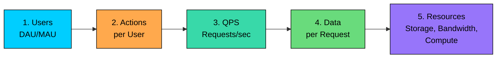

#### **Step 1: Start with users**

Begin with the business metric that defines scale. How many daily active users (DAU)" What is the geographic distribution" This is usually provided by the interviewer or can be stated as an assumption.

#### **Step 2: Estimate actions per user**

What do users do in the system" How many times per day" A social media user might view 100 posts but only create 1. An e-commerce user might view 20 products but only purchase once a week.

#### **Step 3: Calculate QPS**

Convert daily actions to per-second rates. Apply a peak multiplier because systems must handle their busiest moments, not just the average.

#### **Step 4: Estimate data per request**

How large is each request and response" How much data gets stored per action" A tweet is 1KB, but a photo is 1MB, making a 1000x difference.

#### **Step 5: Derive resource requirements**

Combine QPS with data sizes to get storage, bandwidth, and compute needs. This tells you whether your architecture can actually work.

---

# Numbers You Should Know

Certain numbers appear repeatedly in load estimation. Memorizing these approximations saves time and lets you calculate without a calculator. The goal is not precision but order-of-magnitude accuracy. Is the answer closer to 1,000 or 1,000,000" That distinction matters more than whether it is exactly 1,234 or 1,567.

### Time Conversions

These are the foundation of all QPS calculations. The day approximation of 100,000 seconds is particularly useful because it makes division easy.

| Time Period | Exact Seconds | Approximation |
|-------------|---------------|---------------|
| 1 minute | 60 | 60 |
| 1 hour | 3,600 | 3,600 |
| 1 day | 86,400 | **~100,000 (10^5)** |
| 1 week | 604,800 | ~600K |
| 1 month | 2,592,000 | ~2.5 million |
| 1 year | 31,536,000 | ~30 million (3 × 10^7) |

### Data Size Units

Understanding data sizes helps you estimate storage, bandwidth, and memory requirements.

| Unit | Bytes | Practical Reference |
|------|-------|---------------------|
| 1 KB | 1,000 (10^3) | A short email, a small JSON response |
| 1 MB | 1,000,000 (10^6) | A high-resolution photo, a minute of MP3 |
| 1 GB | 10^9 | A movie in SD, 1,000 high-res photos |
| 1 TB | 10^12 | A small database, a day of logs for a medium service |
| 1 PB | 10^15 | Large-scale data warehouse, years of video content |

### Common Data Sizes

| Data Type | Typical Size |
|-----------|--------------|
| UUID/GUID | 16 bytes |
| Integer (64-bit) | 8 bytes |
| Timestamp | 8 bytes |
| URL (average) | 100-200 bytes |
| Tweet (280 chars + metadata) | ~1 KB |
| User profile record | 1-5 KB |
| Photo (compressed JPEG) | 200 KB - 2 MB |
| Short video (1 min, compressed) | 5-50 MB |

### Powers of 2

Many systems use powers of 2 for sizes. The approximation 2^10 approximately equals 10^3 simplifies mental math.

| Power | Value | Common Use |
|-------|-------|------------|
| 2^10 | 1,024 | ~1 thousand (KB) |
| 2^20 | ~1 million | MB |
| 2^30 | ~1 billion | GB |
| 2^40 | ~1 trillion | TB |

### Latency Hierarchy

These numbers tell you how fast different operations are. They help identify bottlenecks and make informed trade-offs.

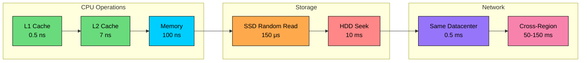

| Operation | Latency | Scale |
|-----------|---------|-------|
| L1 cache reference | 0.5 ns | Fastest |
| L2 cache reference | 7 ns | |
| Main memory reference | 100 ns | |
| SSD random read | 150 μs | 1,000x memory |
| Same datacenter round trip | 500 μs | |
| Read 1 MB from SSD | 1 ms | |
| HDD disk seek | 10 ms | 100x SSD |
| Read 1 MB from HDD | 20 ms | |
| Cross-region round trip | 100-150 ms | |

**Key insight:** Memory is 1,000x faster than SSD, and SSD is 100x faster than HDD. Network within a datacenter is fast (0.5ms), but cross-region calls are slow (100+ ms per round trip). This is why caching matters so much.

### Throughput Benchmarks

These are rough order-of-magnitude numbers. Actual performance varies with configuration, hardware, and query complexity.

| Component | Throughput | Notes |
|-----------|------------|-------|
| Redis (single instance) | 100K+ ops/sec | In-memory, single-threaded |
| PostgreSQL | 10K-50K QPS | Indexed queries, varies with complexity |
| MySQL | 10K-30K QPS | Similar to PostgreSQL |
| Kafka (single broker) | 100K-1M messages/sec | Depends on message size |
| Web server (Nginx) | 10K-50K RPS | Simple requests, no heavy processing |
| Application server | 1K-10K RPS | Depends on request complexity |

---

# QPS Estimation

Queries Per Second (QPS), also called Requests Per Second (RPS), is the most fundamental load metric. Storage, bandwidth, and compute requirements all derive from QPS.

### Basic QPS Formula

For quick mental math, use the approximation:

**Example: Social media post viewing**

The quick estimate of 50,000 is close enough to the precise 57,870 for planning purposes. This is the power of back-of-envelope math.

### Peak QPS

Average QPS is not what you provision for. Systems must handle peak load, which is typically 2-10x average depending on the application type.

| Application Type | Peak Multiplier | Why |
|-----------------|-----------------|-----|
| Enterprise B2B | 2-3x | Business hours concentration |
| Consumer social | 3-5x | Evening usage peaks |
| E-commerce | 5-10x | Sales events, flash deals |
| Gaming | 3-5x | Weekend and evening concentration |
| Streaming | 5-10x | Popular releases, live events |
| News/media | 10-50x | Breaking news, viral content |

**Interview tip:** When in doubt, use 3x as a safe default multiplier for consumer applications. Always state your assumption: "I will assume peak traffic is 3x average."

### Read vs Write QPS

Breaking down read and write traffic separately is critical because they scale differently. Reads can scale horizontally with replicas. Writes must go through a primary database and are harder to scale.

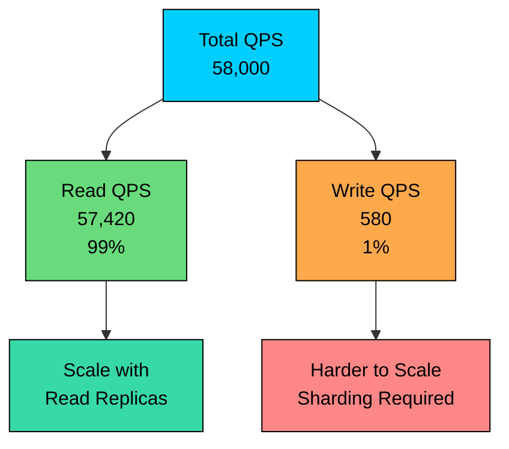

Typical read/write ratios by system type:

| System Type | Read:Write Ratio |
|-------------|------------------|
| Social media feed | 100:1 to 1000:1 |
| URL shortener | 100:1 |
| E-commerce catalog | 100:1 |
| Chat messaging | 1:1 to 10:1 |
| Logging/Analytics | 1:10 to 1:100 (write-heavy) |
| User profiles | 50:1 |

**Example: Social media with 100:1 read/write ratio**

This breakdown is critical for architecture. You might need 10 read replicas to handle 172K read QPS, but the primary database only needs to handle 1,725 writes per second, which is achievable for a single PostgreSQL instance.

---

# Storage Estimation

Storage estimation determines how much disk space your system needs over time. This affects database sizing, storage tier selection, backup strategies, and cost projections.

### Basic Storage Formula

The overhead factor accounts for several things that multiply your raw data:

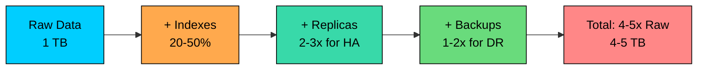

| Overhead Component | Typical Factor |
|--------------------|----------------|
| Indexes | +20-50% of primary data |
| Replication (3 copies) | 3x |
| Backups | +1-2x of primary |
| Fragmentation/overhead | +20% |
| **Total overhead** | **4-5x raw data** |

### Text Storage Example: URL Shortener

### Media Storage Example: Photo Sharing

Media files dominate storage for content-heavy applications. A single photo equals thousands of text records.

| Media Type | Typical Size | Equivalent Text Records (500 bytes) |
|------------|--------------|-------------------------------------|
| Profile picture | 200 KB | 400 records |
| Post image (compressed) | 500 KB - 2 MB | 1,000-4,000 records |
| Short video (1 min) | 10-50 MB | 20K-100K records |
| Long video (1 hour) | 500 MB - 2 GB | 1M-4M records |

At this scale, storage architecture becomes the primary design challenge. You need object storage (S3) rather than databases, CDN for delivery, and lifecycle policies to move old content to cheaper tiers.

### Storage Tiers and Lifecycle

Not all data needs the same performance tier. Smart storage architecture moves data through tiers based on access patterns.

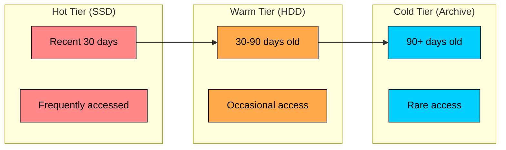

| Storage Tier | Access Pattern | Cost | Use Case |
|--------------|----------------|------|----------|
| Hot (SSD) | Frequent, low-latency | $$$ | Recent content, active sessions |
| Warm (HDD) | Occasional, higher latency OK | $$ | Older content, analytics data |
| Cold (Archive) | Rare, retrieval delays OK | $ | Compliance data, backups |

**Rule of thumb:** In most systems, 80-90% of accesses go to data less than 7 days old. Tier your storage accordingly.

---

# Bandwidth Estimation

Bandwidth determines network capacity requirements. This affects CDN needs, data transfer costs, and network architecture decisions.

### Basic Bandwidth Formula

Remember to account for both directions. Egress (outbound) typically dominates and costs money in cloud environments.

**Example: API service**

### Internal Traffic Amplification

A critical factor many engineers forget: user-facing requests generate internal traffic. A single API call might trigger multiple database queries, cache lookups, and service-to-service calls.

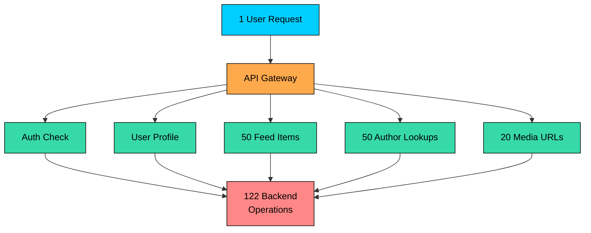

In microservices architectures, internal traffic often exceeds external traffic by 5-10x. If you have 10,000 user QPS but each request generates 100 backend operations, your internal services see 1 million operations per second.

### Video Streaming Bandwidth

Video dominates bandwidth for streaming services. The bitrate varies dramatically by quality level.

| Quality | Resolution | Bitrate | 1 hour of video |
|---------|------------|---------|-----------------|
| SD | 480p | 1.5-2 Mbps | 675-900 MB |
| HD | 720p | 3-4 Mbps | 1.35-1.8 GB |
| Full HD | 1080p | 5-8 Mbps | 2.25-3.6 GB |
| 4K UHD | 2160p | 15-25 Mbps | 6.75-11.25 GB |

**Example: Video streaming service**

At this scale, a CDN is mandatory. No single origin can serve 49 Tbps. Content must be distributed across edge nodes worldwide.

### Bandwidth by Traffic Type

Different traffic types have dramatically different bandwidth profiles. Understanding this helps you identify where optimization matters most.

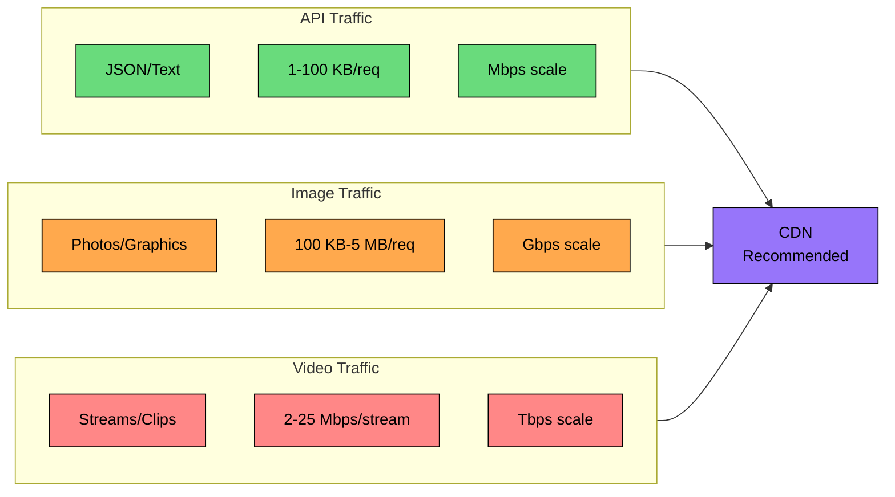

| Traffic Type | Typical Size | Optimization Strategy |
|--------------|--------------|----------------------|
| API/JSON | 1-100 KB | Compression (gzip), pagination |
| Images | 100 KB-5 MB | CDN, responsive images, WebP format |
| Video | 2-25 Mbps stream | CDN, adaptive bitrate, chunked delivery |
| File downloads | 10 MB-10 GB | CDN, resumable downloads, regional mirrors |

---

# Server and Compute Estimation

Knowing your QPS is only half the battle. You also need to know how many servers can handle that load.

### Basic Server Formula

The target utilization is critical. Never plan for 100% utilization.

| Utilization Target | When to Use |
|--------------------|-------------|
| 50-60% | High-availability systems, latency-sensitive |
| 60-70% | Most production systems |
| 70-80% | Cost-sensitive, lower SLA requirements |
| 80%+ | Dangerous: no headroom for spikes |

**Example: Web application servers**

### Database Server Sizing

Database servers are different from application servers. They are stateful, harder to scale horizontally, and often the bottleneck.

| Database Type | Single Server Capacity | Scaling Strategy |
|---------------|----------------------|------------------|
| PostgreSQL (OLTP) | 10K-50K simple QPS | Read replicas, then sharding |
| MySQL | 10K-30K QPS | Read replicas, then sharding |
| MongoDB | 20K-50K ops/sec | Sharding from the start |
| Redis | 100K+ ops/sec | Cluster mode for > 100K |

**Rule of thumb:** If your peak write QPS exceeds what a single database can handle, you need sharding. If only reads are the problem, read replicas might suffice.

---

# Memory and Cache Sizing

Caching is the most effective way to reduce database load and improve latency. But how much cache do you actually need"

### Cache Sizing Formula

The overhead factor (typically 1.3-1.5x) accounts for:

- Hash table overhead in Redis/Memcached
- Key storage (not just values)
- Memory fragmentation

### The 80/20 Rule in Action

The Pareto principle applies strongly to caching: 20% of your data typically serves 80% of requests. This means you do not need to cache everything.

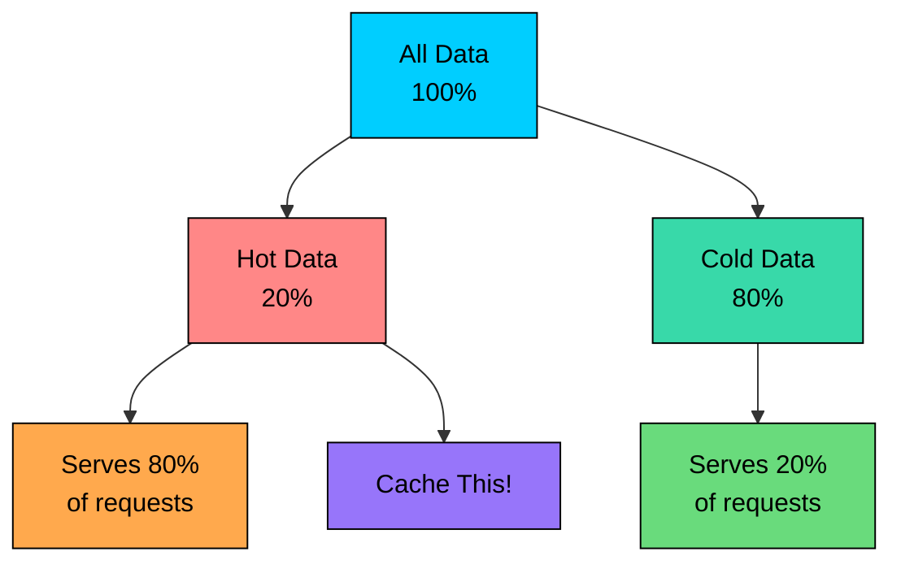

**Example: User profile caching**

### Working Set Estimation

For databases, the "working set" is the data actively being read and written. If your working set fits in memory, the database performs like an in-memory store.

| Scenario | Working Set Size | Performance |
|----------|-----------------|-------------|
| Working set < RAM | Excellent | Reads from memory, fast |
| Working set ≈ RAM | Good | Some disk reads, acceptable |
| Working set > RAM | Poor | Frequent disk reads, slow |

---

# Historical Data Analysis

While interview estimates use formulas and assumptions, production capacity planning relies heavily on historical data. Understanding these patterns helps you make better predictions.

### Trend Analysis

Traffic rarely grows linearly. Identifying the growth pattern helps you project future capacity needs.

| Pattern | Description | Projection Method | Example |
|---------|-------------|-------------------|---------|
| Linear | Steady, predictable growth | Extrapolate slope | Mature B2B SaaS |
| Exponential | Doubling periodically | Compound growth rate | Viral consumer apps |
| Logarithmic | Fast initial growth, then slows | Diminishing returns | New feature adoption |
| S-curve | Slow start, rapid growth, plateau | Logistic curve fitting | Market penetration |

**Growth rate formulas:**

**Example: Projecting storage needs**

**Warning:** Do not project exponential growth beyond 6-12 months without validation. Growth rates change as you scale, hit market saturation, or face competition.

### Seasonality Analysis

Traffic follows predictable cycles at multiple timescales. Understanding these patterns prevents both over-provisioning and outages.

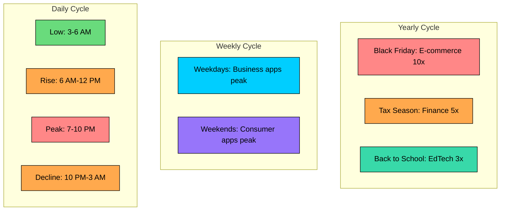

| Cycle | Pattern | Planning Approach |
|-------|---------|-------------------|
| Daily | Peak 7-10 PM local time | Provision for evening peak |
| Weekly | Varies by app type | Different weekend/weekday capacity |
| Monthly | End-of-month spikes for billing/reporting | Extra capacity last week of month |
| Yearly | Holiday seasons, industry events | Pre-scale for known events |

**Seasonal forecasting formula:**

### Percentile Analysis

Averages lie. A system with 50ms average latency might have P99 of 500ms, meaning 1% of users experience terrible performance.

| Percentile | Meaning | Planning Use |
|------------|---------|--------------|
| P50 (median) | Half of requests are faster | Typical user experience |
| P90 | 90% of requests are faster | Good experience threshold |
| P95 | 95% of requests are faster | SLA target for most systems |
| P99 | 99% of requests are faster | Tail latency, often 5-10x P50 |
| P99.9 | 99.9% of requests are faster | Critical for high-volume systems |

**Why percentiles matter for capacity:**

---

# User Behavior Modeling

Converting registered users to actual system load requires understanding user behavior patterns. Not all users are created equal.

### User Funnel Analysis

The gap between registered users and concurrent users is enormous. A proper funnel analysis reveals the actual load.

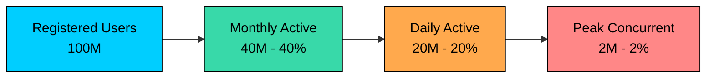

**Typical funnel ratios by product type:**

| Product Type | MAU/Registered | DAU/MAU | Peak/DAU |
|--------------|----------------|---------|----------|
| Social media | 50-70% | 50-60% | 10-15% |
| E-commerce | 20-40% | 10-20% | 5-10% |
| B2B SaaS | 60-80% | 40-60% | 20-30% |
| Gaming | 30-50% | 20-40% | 15-25% |
| Messaging | 60-80% | 60-80% | 20-30% |

**Example: From registered to concurrent**

### Session-Based Modeling

For more accurate concurrent user estimates, model actual sessions.

**Example: Social app sessions**

### Power User Impact

User activity follows a power law distribution. A small percentage of power users generates a disproportionate amount of load.

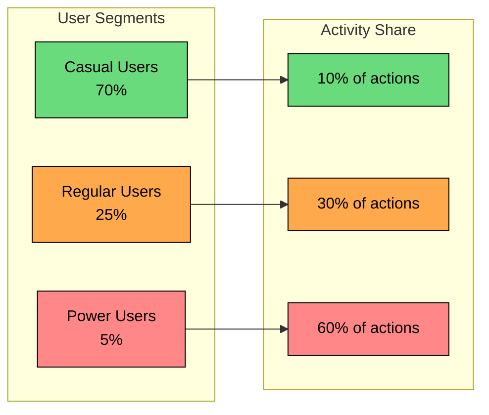

| Segment | % of Users | % of Activity | Actions/Day |
|---------|------------|---------------|-------------|
| Casual | 70% | 10% | 1-5 |
| Regular | 25% | 30% | 10-30 |
| Power | 5% | 60% | 50-200+ |

**When power user modeling matters:**

- **Rate limiting:** Power users hit limits first, need higher tiers
- **Cost allocation:** 5% of users might consume 60% of resources
- **Forecasting:** Losing or gaining power users has outsized impact
- **Feature design:** Features used by power users need better scalability

**Example: Impact on QPS**

---

# Complete Estimation Walkthrough

Let us work through a complete example demonstrating how all the concepts come together. We will estimate resources for a Twitter-like social feed.

### System Requirements

- 500 million registered users
- 200 million DAU
- Users post 2 tweets per day on average
- Users view 200 tweets per day on average
- Tweet: 500 bytes text + 30% have 100 KB media attachment

### Step 1: QPS Calculation

### Step 2: Storage Calculation

### Step 3: Bandwidth Calculation

### Step 4: Architecture Implications

| Finding | Implication |
|---------|-------------|
| Read:Write = 100:1 | Heavy caching and read replicas |
| 1.4M peak read QPS | Need distributed cache (Redis cluster) |
| 14K peak write QPS | Single primary DB might work, consider sharding for growth |
| Media dominates storage | Object storage (S3) + CDN, not database |
| 550 Gbps peak bandwidth | CDN required for media delivery |

### Example 2: Video Streaming Service

Let us estimate resources for a Netflix-like streaming platform.

**Requirements:**

- 100 million subscribers
- 50% are daily active (50M DAU)
- Average watch time: 2 hours per day
- Quality mix: 20% SD, 50% HD, 25% 1080p, 5% 4K

**Step 1: Concurrent Viewers**

**Step 2: Bandwidth**

**Step 3: Content Storage**

**Architecture Implications:**

| Finding | Implication |
|---------|-------------|
| 31 Tbps bandwidth | Multi-region CDN with edge caching mandatory |
| 6.3M concurrent | Distributed playback service, no single point |
| 2.2 PB content | Object storage with regional replication |
| Predictable access | Pre-warm popular content at edges |

### Example 3: E-commerce Platform

Now let us estimate an Amazon-like marketplace.

**Requirements:**

- 50 million monthly visitors
- 10% conversion rate (buyers)
- Average 20 product views per session
- Normal day vs Black Friday (10x traffic)

**Step 1: Traffic QPS**

**Step 2: Order Processing**

**Step 3: Product Catalog**

**Architecture Implications:**

| Finding | Implication |
|---------|-------------|
| 43K peak QPS (Black Friday) | Auto-scaling app tier, 10x normal capacity |
| Orders << page views | Separate read (catalog) and write (orders) paths |
| Image-heavy | CDN for product images, 95%+ cache hit rate |
| Flash sale spikes | Queue-based order processing, graceful degradation |

---

# Common Estimation Mistakes

Understanding common mistakes helps you avoid them and catch errors during sanity checks.

### Mistake 1: Using Average Instead of Peak

Systems fail during peaks, not during average load. Always identify and plan for peak traffic.

### Mistake 2: Ignoring Growth

Traffic often doubles yearly. If the system needs to last 5 years and traffic doubles each year, plan for 32x current traffic (2^5).

### Mistake 3: Forgetting Read Amplification

A single user request often generates many backend operations. If you have 10,000 user QPS but each request generates 100 backend calls, your internal services see 1 million operations per second.

### Mistake 4: Ignoring Storage Overhead

### Mistake 5: Assuming Linear Scaling

Not everything scales linearly:

| Resource | Scaling Behavior |
|----------|-----------------|
| Stateless compute | Mostly linear |
| Database connections | Step function (pool exhaustion) |
| Lock contention | Superlinear (gets worse with load) |
| Network latency | Superlinear under congestion |

A system handling 10K QPS on 10 servers may need 25 servers for 20K QPS, not 20.

### Mistake 6: Confusing Throughput and Latency

Provision for the load level where latency is still acceptable, not just maximum throughput.

---

# Interview Tips

### 1. Round Aggressively

Use simple numbers. 86,400 seconds per day becomes 100,000. 2.6 million seconds per month becomes 2.5 million. This makes mental math faster and introduces minimal error.

### 2. State Your Assumptions

"I will assume 100 million daily active users" is better than silently picking a number. Interviewers want to see your thought process. If they have different numbers, they will correct you.

### 3. Sanity Check Your Results

If your calculation shows you need 1 million servers or 1 exabyte of storage, something is wrong. Step back and verify. Compare to known systems: Twitter handles millions of tweets per day on thousands of servers, not millions.

### 4. Use Powers of 10

Convert everything to powers of 10 for easier multiplication:

- 500 million = 5 × 10^8
- 86,400 = ~10^5

So 500 million / 86,400 ≈ 5 × 10^3 = 5,000

### 5. Remember the 80/20 Rule

80% of requests often come from 20% of data. This matters for caching decisions. If you can cache the hot 20%, you reduce database load by 80%.

### 6. Show Your Work

Walk through calculations step by step, explaining your reasoning. "I am using 3x for peak because this is a consumer app with evening usage spikes."

### 7. Know When NOT to Estimate

If the interviewer is more interested in API design or database schema, do not spend 15 minutes on capacity estimation. A quick "we are looking at roughly 100K QPS and 10TB of storage" might be sufficient.

---

# Summary

Back-of-the-envelope estimation translates business metrics into concrete resource requirements. Whether you are in an interview or planning production infrastructure, these skills help you reason quantitatively about systems at scale.

### Key Formulas

| Metric | Formula |
|--------|---------|
| Average QPS | DAU × Actions per Day / 86,400 (use 100,000 for quick math) |
| Peak QPS | Average QPS × Peak Multiplier (3-5x for consumer apps) |
| Storage | Records × Size × Retention × Overhead (4-5x raw) |
| Bandwidth | QPS × Response Size |
| Servers | Peak QPS / (Server Throughput × Target Utilization) |
| Cache Size | Hot Data Items × Item Size × 1.3 overhead |
| Concurrent Users | DAU × (Sessions × Duration) / Peak Hours |
| Growth Projection | Current × (1 + Growth Rate)^Periods |
| Seasonal Forecast | Last Year × YoY Growth × Safety Buffer |

### Numbers to Remember

| Reference | Value |
|-----------|-------|
| Seconds per day | 86,400 (~100K) |
| Seconds per month | ~2.5M |
| Redis throughput | 100K ops/sec |
| PostgreSQL throughput | 10K-50K QPS |
| App server throughput | 1K-10K QPS |
| Memory vs SSD latency | 1000x faster |
| SSD vs HDD latency | 100x faster |
| Storage overhead factor | 4-5x raw data |
| Typical peak multiplier | 3-5x average |
| Server utilization target | 60-70% |
| Cache hot data ratio | 20% data serves 80% requests |
| Power user ratio | 5% users generate 60% activity |

### The Estimation Checklist

1. Start with users (DAU/MAU)
2. Model user behavior (funnel, sessions, power users)
3. Calculate QPS (average and peak)
4. Split read vs write QPS
5. Estimate data sizes per request
6. Calculate storage with tiers and overhead
7. Calculate bandwidth by traffic type
8. Size servers and cache
9. Consider seasonality and growth
10. Use percentiles, not averages
11. Sanity check results
12. State all assumptions

### Production vs Interview Estimation

| Aspect | Interview | Production |
|--------|-----------|------------|
| Precision | Order of magnitude (10x OK) | Within 20-30% |
| Data source | Assumptions, industry benchmarks | Historical metrics, load tests |
| Time spent | 5-10 minutes | Days to weeks of analysis |
| Validation | Sanity check against known systems | Load testing, staged rollout |
| Output | Architecture direction | Capacity plan, budget request |

With these formulas memorized, patterns recognized, and the framework internalized, you can quickly evaluate whether a design can handle the load, how much infrastructure you need, and where the bottlenecks will appear.
