> 💡 **Key Insight:**

> **QUESTION**
>
> #### What is WhatsApp"
>
> WhatsApp is a widely used instant messaging application that enables real-time communication between users through instant message delivery. Users can send text messages, media files, and other content to individuals or groups, with messages delivered within milliseconds.
>
> 
> <!-- Simulation: whatsapp -->
> 

>
> The core idea is deceptively simple: User A sends a message, and User B receives it instantly. However, achieving this at scale with billions of users, while ensuring message delivery guarantees, handling offline users, and supporting group conversations, introduces significant distributed systems challenges.
>
> **Other Popular Examples:** Facebook Messenger, Telegram, Signal, WeChat

In this chapter, we will dive into the **high-level design of a messaging system like WhatsApp**.

This problem is a favorite in system design interviews because it touches on so many fundamental concepts: **real-time communication**, **persistent connections**, **message ordering**, **delivery guarantees**, and the challenges of building a truly **global-scale system**. 

Let's start by understanding what exactly we are building.

---

# 1. Clarifying Requirements

Before diving into the design, it's important to ask thoughtful questions to uncover hidden assumptions, clarify ambiguities, and define the system's scope more precisely.

Here is an example of how a discussion between the candidate and the interviewer might unfold:

> 💡 **Key Insight:**

> **DISCUSSION**
>
> **Candidate:** "What is the expected scale" How many users and messages per day should the system support""
>
> **Interviewer:** "Let's design for 500 million daily active users (DAU) sending an average of 40 messages per day."
>
> **Candidate:** "Should we support only one-on-one messaging, or also group chats""
>
> **Interviewer:** "Both. Group chats should support up to 500 members."
>
> **Candidate:** "What types of content should messages support" Text only, or also media like images and videos""
>
> **Interviewer:** "Focus on text messages for the core design. You can mention media handling at a high level, but detailed media processing is out of scope."
>
> **Candidate:** "Do we need to show online/offline status and typing indicators""
>
> **Interviewer:** "Yes, presence indicators (online/offline/last seen) are important. Typing indicators are nice-to-have."
>
> **Candidate:** "What about message delivery guarantees" Should users see read receipts""
>
> **Interviewer:** "Yes. Users should see when their message is delivered and when it's read. Messages should never be lost."
>
> **Candidate:** "Should messages be stored permanently, or can they expire""
>
> **Interviewer:** "Messages should be stored until explicitly deleted by the user. We need to support message history sync across devices."
>
> **Candidate:** "What about end-to-end encryption""
>
> **Interviewer:** "You can mention it conceptually, but detailed cryptographic implementation is out of scope."

After gathering the details, we can summarize the key system requirements.

## 1.1 Functional Requirements

- **One-on-One Chat:** Users can send and receive messages in real-time with other users.
- **Group Chat:** Users can create groups and send messages to multiple recipients (up to 500 members).
- **Message Delivery Status:** Users can see delivery receipts (sent, delivered, read).
- **Online Presence:** Users can see if their contacts are online, offline, or their last seen time.
- **Message History:** Users can access their message history and sync across multiple devices.
- **Push Notifications:** Offline users receive push notifications for new messages.

> 💡 **Key Insight:**

> **Out of Scope**
>
> To keep our discussion focused, we will set aside a few features that, while important, would take us down rabbit holes:
>
> - **Media Messages:** Images, videos, voice notes (mentioned conceptually only).
> - **Voice/Video Calls:** Real-time audio and video communication.
> - **End-to-End Encryption:** Detailed cryptographic implementation.
> - **Stories/Status Updates:** Ephemeral content sharing.

## 1.2 Non-Functional Requirements

- **Low Latency:** Messages should be delivered within milliseconds for online users. Target: p99 < 100ms for message delivery.
- **High Availability:** The system must be highly available (99.99% uptime). Users expect messaging to work 24/7.
- **Reliability:** Messages must never be lost. Once sent, a message should eventually be delivered, even if the recipient is offline.
- **Scalability:** Support 500M+ daily active users and 20B+ messages per day.
- **Ordering:** Messages within a conversation should appear in the correct order.
- **Consistency:** Eventually consistent for presence, strong consistency for message delivery.

---

# 2. Back-of-the-Envelope Estimation

With our requirements clear, lets understand the scale we are dealing with. In most interviews, you are not required to do a detailed estimation.

> 💡 **Key Insight:**

> **Assumptions**
>
> We will use these baseline numbers throughout our calculations:
>
> - **Daily Active Users (DAU):** 500 million
> - **Messages per user per day:** 40
> - **Average message size:** 100 bytes (text content + metadata)
> - **Average group size:** 20 members
> - **Percentage of group messages:** 30%

#### Message Throughput

Let's start with the fundamental question: how many messages flow through this system"

- **Total messages per day:** 500 million users x 40 messages = **20 billion messages/day**

Twenty billion. That is 20,000,000,000 messages every single day. Let's convert that to something more tangible:

- **Average messages per second:** 20 billion / 86,400 seconds = **~230,000 messages/second**
- **Peak load (3x average):** **~700,000 messages/second**

The 3x multiplier accounts for peak hours when everyone is awake and chatting. Traffic is never uniform throughout the day.

These numbers tell us something important: we are looking at hundreds of thousands of concurrent operations per second. This is not a system where we can make a database query for every message. We need persistent connections, efficient routing, and aggressive caching.

#### Connection Load

Here is where messaging systems get interesting, and fundamentally different from typical web applications. Unlike a website where users make requests and disconnect, a messaging app needs to push messages to users the instant they arrive. 

That means maintaining persistent connections with every online user.

- **Concurrent connections:** If 10% of DAU are online at any time = **50 million concurrent connections**
- **Peak concurrent connections:** **~100 million**

Each of these 50 million connections requires maintaining a persistent WebSocket. This is a fundamentally different challenge from handling 50 million HTTP requests per day. These connections stay open, consuming memory and file descriptors on our servers.

If a single well-tuned server can handle 50,000 concurrent WebSocket connections (a reasonable estimate for modern hardware with proper kernel tuning), we need:

```shell
50 million connections / 50,000 per server = 1,000 chat servers
```

Just for connection handling alone, we need a fleet of a thousand servers.

#### Storage (Per Day)

Storage requirements for a text-only system are more modest than you might expect:

- **Message storage:** 20 billion messages x 100 bytes = **2 TB/day**
- **Annual storage:** 2 TB x 365 = **730 TB/year** (just for messages)

Seven hundred terabytes per year sounds substantial, but it is well within reach of modern distributed databases like Cassandra or ScyllaDB. For context, a single NVMe drive can hold 4 TB, so we are talking about a few hundred drives worth of storage.

The real challenge with storage is not capacity, it is the access patterns. We need to write 230,000 messages per second while simultaneously reading message history and syncing devices. Latency matters more than raw throughput.

#### Bandwidth

Bandwidth is rarely the bottleneck for text messaging, but let's verify:

- **Incoming bandwidth:** 230K msg/sec x 100 bytes = **~23 MB/sec (inbound)**
- **Outgoing bandwidth:** Higher due to group message fanout

When a message goes to a group of 20 members, it needs to reach 20 devices. If 30% of messages are group messages, outbound traffic multiplies accordingly.

But even accounting for this, we are looking at hundreds of megabytes per second, easily handled by modern network infrastructure.

---

# 3. Core APIs

Before diving into architecture, it helps to think about the API contract. What operations does our system need to support" 

Defining the APIs early forces us to think concretely about what users can do and what data flows through the system.

A messaging system's API is unusual compared to typical web services. Most real-time communication happens over persistent WebSocket connections, not traditional HTTP request-response. 

However, we still need REST endpoints for operations that do not require instant delivery, like fetching message history.

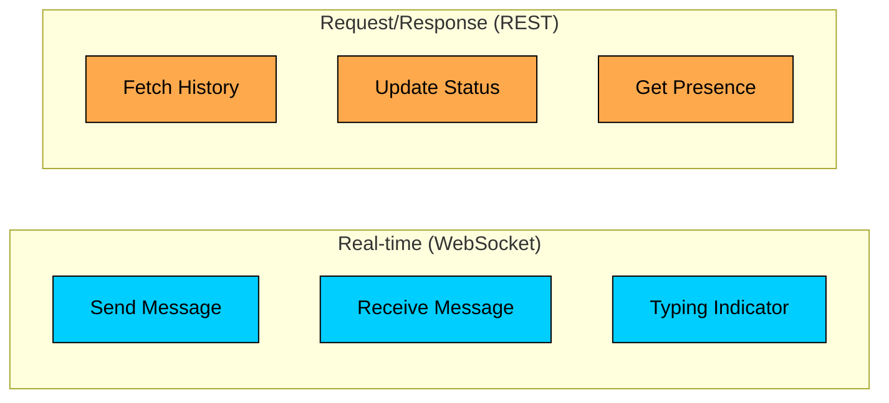

Let's walk through the essential APIs.

### **1. Send Message**

#### Endpoint: `WebSocket message or POST /messages`

This is the heart of our system. When a user taps send, this API handles getting the message from their device to ours. 

In practice, this almost always goes over the WebSocket connection for lowest latency, but having a REST fallback is useful when WebSocket connections fail.

##### **Request Parameters:**

| Parameter | Required | Description |
|-----------|----------|-------------|
| `sender_id` | Yes | ID of the user sending the message |
| `recipient_id` | Yes | ID of the recipient user or group |
| `message_type` | Yes | Whether the recipient is a `user` or `group` |
| `content` | Yes | The actual message text |
| `client_message_id` | Yes | Client-generated unique ID for deduplication |
| `timestamp` | Yes | Client-side timestamp when the message was composed |

##### **Sample Response:**

```json
{
  "message_id": "msg_123abc",
  "status": "sent",
  "server_timestamp": "2024-01-15T10:30:00.123Z"
}
```

The `client_message_id` deserves special attention. Networks are unreliable. A user might tap send, their phone loses connectivity for a moment, and the app retries the send. 

Without deduplication, the recipient would see the same message twice. By including a client-generated ID, the server can detect and ignore duplicates, ensuring exactly-once delivery semantics.

##### **Error Cases:**

| Status Code | Meaning | When It Happens |
|-------------|---------|-----------------|
| `400 Bad Request` | Invalid input | Message too long, missing required fields |
| `403 Forbidden` | Not authorized | Trying to send to a blocked user or private group |
| `429 Too Many Requests` | Rate limited | Sending too many messages too quickly |

### **2. Fetch Messages**

#### Endpoint: `GET /conversations/{conversation_id}/messages`

When a user opens an old conversation or logs in on a new device, they need to see their message history. This endpoint retrieves messages for a conversation, typically the most recent ones first.

##### **Request Parameters:**

| Parameter | Required | Description |
|-----------|----------|-------------|
| `conversation_id` | Yes | ID of the conversation to fetch |
| `cursor` | No | Pagination cursor for fetching older messages |
| `limit` | No | Number of messages to return (default: 50, max: 100) |

##### **Sample Response:**

```json
{
  "messages": [
    {
      "message_id": "msg_123",
      "sender_id": "user_456",
      "content": "Hey, how are you"",
      "timestamp": "2024-01-15T10:30:00Z",
      "status": "read"
    }
  ],
  "next_cursor": "eyJtc2dfaWQiOiJtc2dfMTIyIn0=",
  "has_more": true
}
```

Notice that we use cursor-based pagination rather than offset-based. With billions of messages, a query like `OFFSET 1000000` would be painfully slow, requiring the database to skip over a million rows. Cursor-based pagination uses an indexed value (like a message ID or timestamp) to efficiently jump to the right position.

### **3. Update Message Status**

#### Endpoint: `POST /messages/{message_id}/status`

This is what powers those checkmarks. When a message is delivered to the recipient's device or opened by the user, we need to update its status and notify the sender.

##### **Request Parameters:**

| Parameter | Required | Description |
|-----------|----------|-------------|
| `message_id` | Yes | ID of the message to update |
| `status` | Yes | New status: `delivered` or `read` |
| `timestamp` | Yes | When the status change occurred |

Status updates flow in one direction: `sent → delivered → read`. We never go backwards. The timestamp helps with edge cases where status updates arrive out of order due to network delays.

### **4. Get User Presence**

#### Endpoint: `GET /users/{user_id}/presence`

Returns whether a user is currently online and, if offline, when they were last active. This powers the "online" indicator and "last seen" text in the UI.

##### **Sample Response:**

Presence is intentionally kept simple. We do not need to know exactly what a user is doing, just whether they are actively connected. Privacy controls allow users to hide their last seen time, in which case we simply omit that field. 

With our API contract defined, we have a clear picture of what the system needs to do. Now let's design the architecture that makes these APIs work at scale.

---

# 4. High-Level Design

Now we get to the heart of the design. Rather than throwing a complex architecture diagram at you with 15 boxes and wondering what each one does, we are going to build this system incrementally. 

We will start with the simplest possible design that solves our first requirement, then add components only as we encounter new challenges. This mirrors how you should think through the problem in an interview.

Our system must ultimately satisfy three core requirements:

1. **Real-time Message Delivery:** Messages should reach online recipients within milliseconds.
2. **Offline Message Handling:** Messages for offline users need to be stored and delivered when they come back online.
3. **Group Message Distribution:** A single message should efficiently reach all group members.

Before we dive into the architecture, let's understand the key insight that shapes everything: messaging is fundamentally a **push-based** system.

Think about how a typical web application works. Your browser requests a page, the server responds, and the connection closes. If you want new data, you request again. This request-response pattern works great for most applications, but it falls apart for messaging. 

You cannot expect users to constantly refresh to check for new messages. The moment a message arrives at our servers, we need to push it to the recipient's device immediately.

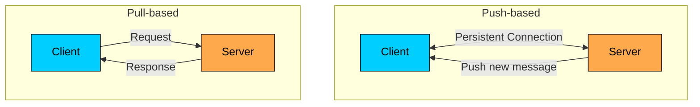

This push-based nature is why we need persistent WebSocket connections rather than traditional HTTP. And maintaining millions of persistent connections creates a whole set of challenges that we need to address.

Let's start building, one requirement at a time.

---

## 4.1 Requirement 1: Real-time One-on-One Messaging

Let's start with the simplest possible scenario: User A sends a message to User B, and User B is currently online with the app open. 

**What do we need to make this work"**

The naive approach might be: store the message in a database and have User B periodically check for new messages. But polling introduces latency and wastes resources. 

We need to push the message the instant it arrives. This means maintaining a persistent connection between our servers and User B's device.

### The Components We Need

Let's introduce the components one by one, understanding why each exists.

#### **Chat Servers**

These are the workhorses of our system. Each chat server maintains persistent WebSocket connections with thousands of clients simultaneously.

When User A opens the messaging app, their phone establishes a WebSocket connection to one of the chat servers. This connection stays open for as long as the app is in use. When User A sends a message, it travels over this existing connection, no need to establish a new one.

##### **What chat servers do:**

- Accept and maintain WebSocket connections from clients
- Receive messages from senders
- Route messages to the right recipients (which might be on different chat servers)
- Send heartbeats to detect dead connections
- Handle reconnection when users switch networks

Here is an important insight: chat servers are **stateful**. Unlike typical web servers where any server can handle any request, User B's messages must go to the specific chat server where User B's connection lives. If User B is connected to Chat Server 2, sending their message to Chat Server 1 will not help.

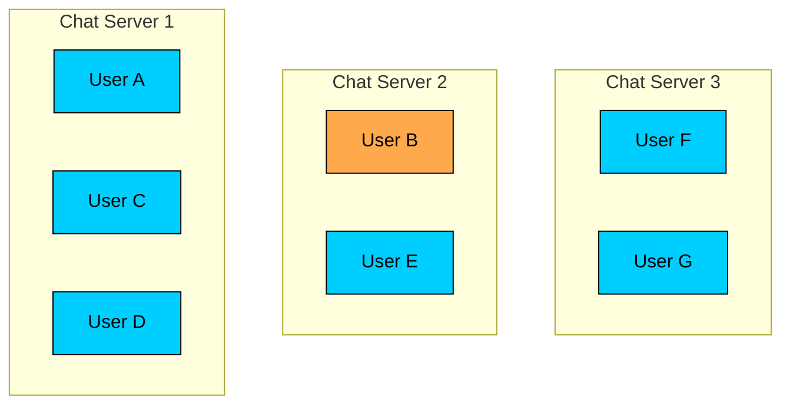

This statefulness creates a routing challenge. When User A sends a message to User B, how does Chat Server 1 know that User B is on Chat Server 2"

#### **Session Service**

This is where the Session Service comes in. It maintains a simple but critical mapping: which user is connected to which chat server.

When User B connects to Chat Server 2, that server registers the connection: "User B is on Chat Server 2." When User A wants to send a message to User B, we query the Session Service: "Where is User B"" It responds: "Chat Server 2."

##### **What the Session Service does:**

- Track which chat server each online user is connected to
- Update mappings in real-time as users connect and disconnect
- Provide sub-millisecond lookups for message routing

We typically implement this using **Redis** because it offers exactly what we need: fast key-value lookups with built-in expiration for handling disconnections. The data structure is simple:

```shell
user_a -> chat_server_1
user_b -> chat_server_2
user_c -> chat_server_1
...
```

#### **Message Service**

While routing messages in real-time is essential, we also need to persist them. Users expect to see their message history. If User B's phone dies right as a message arrives, we do not want to lose it.

##### **What the Message Service does:**

- Persist every message to the database before attempting delivery
- Generate server-side message IDs and timestamps (for ordering)
- Track message status (sent, delivered, read)
- Provide message history queries for the Fetch Messages API

### Putting It Together: The Message Flow

Now let's trace what happens when User A sends "Hey, how's it going"" to User B. Both users are online, connected to different chat servers.

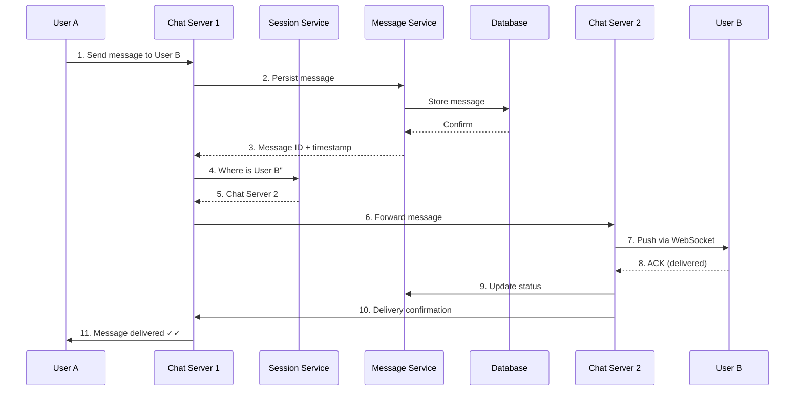

Let's walk through each step to understand what is happening:

**Step 1-3: Receive and persist**

User A taps send. The message travels over the existing WebSocket connection to Chat Server 1. Before doing anything else, Chat Server 1 asks the Message Service to persist the message. This is critical. If we route the message first and something fails, the message could be lost. By persisting first, we guarantee that no matter what happens next, the message is safely stored.

The Message Service writes the message to the database and returns a server-generated message ID and timestamp. The timestamp is important because the server's clock is the source of truth for message ordering, not the client's clock which might be wrong.

**Step 4-5: Find the recipient**

With the message safely stored, Chat Server 1 needs to find User B. It queries the Session Service: "Where is User B connected"" The Session Service responds: "Chat Server 2." This lookup takes less than a millisecond thanks to Redis.

**Step 6-7: Route and deliver**

Chat Server 1 forwards the message to Chat Server 2. This happens over a direct connection between servers, typically using gRPC or a similar efficient protocol. Chat Server 2 receives the message and pushes it to User B over their WebSocket connection.

**Step 8-11: Acknowledge and confirm**

User B's client receives the message and sends an acknowledgment back. This ACK travels back through the system, updating the message status to "delivered" in the database along the way. Finally, User A's client receives the delivery confirmation and updates the UI to show the double checkmark.

This entire round trip, from User A tapping send to seeing the delivered checkmark, typically completes in under 100 milliseconds when both users are online. That is fast enough that conversations feel instantaneous.

But here is the question that should be nagging at you: **what happens when User B is not online"**

---

## 4.2 Requirement 2: Handling Offline Users

The flow we just designed works beautifully when both users are online. But real-world messaging is messier. What happens when User B's phone is in airplane mode" What if they have not opened the app in hours" What if they are in a subway tunnel with no signal"

We cannot just drop the message. This would violate our reliability requirement. Users expect that once they tap send, the message will eventually arrive, even if the recipient is unreachable for hours or days.

This requirement forces us to think differently about message delivery. We cannot just push a message and forget about it. We need to track pending deliveries and retry when users come back online.

### New Components for Offline Handling

Let's introduce two new pieces to our architecture.

#### **Message Queue**

Think of the message queue as a mailbox. When we discover that User B is offline, instead of dropping the message, we place it in User B's queue. The messages sit there, safe and ordered, until User B comes back online.

##### **What the message queue does:**

- Store messages for offline users in order
- Track which messages have been delivered and which are pending
- Provide fast retrieval when users reconnect
- Handle the case where users are offline for extended periods

We typically use a system like **Kafka** or **Redis Streams** for this. The key insight is that this is not the same as our message database. The database is for long-term storage and history. The queue is for pending deliveries, messages that have been persisted but not yet delivered to the recipient's device.

#### **Push Notification Service**

Even though we cannot deliver the message content directly to an offline user, we can still tell them something is waiting. This is where push notifications come in.

##### **What the Push Notification Service does:**

- Integrate with Apple Push Notification Service (APNs) for iOS
- Integrate with Firebase Cloud Messaging (FCM) for Android
- Send a notification like "New message from User A" to wake up the device
- Respect user preferences (muted conversations, quiet hours)

### The Offline Message Flow

Let's trace what happens when User A sends a message but User B is offline.

#### **When the message is sent:**

```mermaid
flowchart TD
    A[User A sends message]:::primary --> CS1[Chat Server 1]
    CS1 --> MS[Message Service]
    MS --> DB[(Database)]

    CS1 --> SS{Session Service:<br/>Is User B online"}

    SS -->|Online| ROUTE[Route to Chat Server]
    SS -->|Offline| MQ[Message Queue]

    MQ --> PNS[Push Notification<br/>Service]
    PNS --> APNS[APNs / FCM]
    APNS --> Device[User B's Device]

    style A fill:#00ceff,stroke:#000,color:#000
    style CS1 fill:#38d9a9,stroke:#000,color:#000
    style MS fill:#38d9a9,stroke:#000,color:#000
    style DB fill:#9775fa,stroke:#000,color:#000
    style SS fill:#ffa94d,stroke:#000,color:#000
    style MQ fill:#69db7c,stroke:#000,color:#000
    style PNS fill:#da77f2,stroke:#000,color:#000
    style APNS fill:#f783ac,stroke:#000,color:#000
    style Device fill:#f783ac,stroke:#000,color:#000
```

1. User A sends a message to User B. The message arrives at Chat Server 1.
2. Chat Server 1 persists the message via the Message Service. It is now safely stored.
3. Chat Server 1 queries the Session Service: "Where is User B""
4. The Session Service finds no entry for User B, meaning they are offline.
5. Instead of failing, Chat Server 1 adds the message to User B's message queue.
6. The Push Notification Service sends a notification to User B's phone: "New message from User A."
7. User A sees a single checkmark (sent) but not a double checkmark (delivered) yet.

#### **When User B comes back online:**

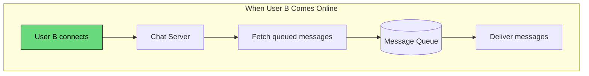

1. User B opens the app and establishes a WebSocket connection to a chat server (maybe Chat Server 3 this time).
2. During the connection handshake, Chat Server 3 checks the message queue: "Are there any pending messages for User B""
3. The queue returns all pending messages, ordered by timestamp.
4. Chat Server 3 pushes these messages to User B over the WebSocket connection.
5. User B's client acknowledges receipt.
6. The queue entries are cleared, and the message statuses are updated to "delivered."
7. Back at User A's device, the checkmarks update from single to double.

The beauty of this design is that the message is never lost. Whether User B comes online in 10 seconds or 10 days, the message will be waiting. The queue acts as a reliable buffer between the sender and an unreachable recipient.

> 💡 **Key Insight:**

> **TIP**
>
> We persist the message to the database before adding it to the queue. This means even if the queue itself fails (a rare event), we have not lost the message. The database is our source of truth; the queue is just an optimization for fast delivery.

---

## 4.3 Requirement 3: Group Messaging

So far we have handled one-on-one messaging elegantly. But groups introduce a new challenge that fundamentally changes our design: **fanout**.

Consider this scenario: User A sends "Happy New Year!" to a family group with 50 members. That single message needs to reach 50 different devices, potentially scattered across 20 different chat servers, some members online and some offline, some on fast WiFi and some on spotty mobile networks.

With one-on-one messaging, one input means one output. With groups, one input means many outputs. This multiplier effect is called fanout, and it can easily overwhelm a naive implementation.

### Understanding the Fanout Problem

Let's visualize what happens when a message goes to a group:

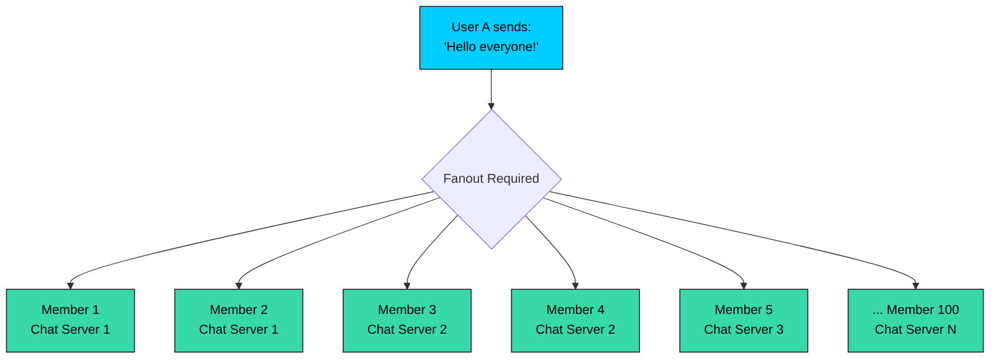

If User A sends a message to a group with 500 members (our maximum), and the sender's chat server has to individually deliver to all 500, we have a problem:

- The sender's chat server becomes a bottleneck
- If it crashes mid-delivery, some members get the message and some do not
- Large groups would create noticeable delays

There are several ways to handle fanout. Let's examine each and understand their trade-offs.

### **Approach 1: Sender-Side Fanout**

The simplest approach is to have the sender's chat server do all the work. When User A sends a group message, Chat Server 1 looks up all group members, finds their chat servers, and delivers to each one.

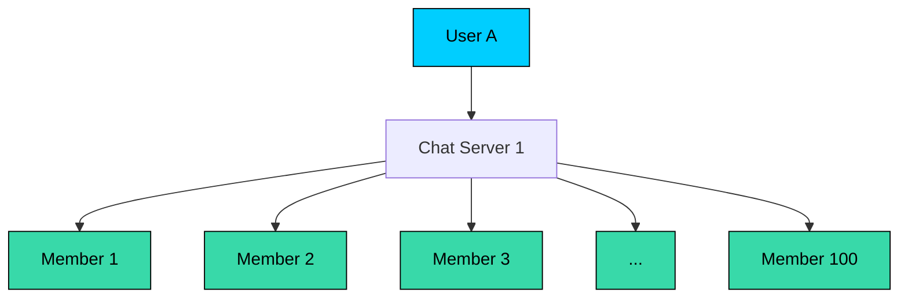

**How it works:**

1. Chat Server 1 queries the Group Service for all members of the group
2. For each member, it queries the Session Service to find their chat server
3. It forwards the message to each destination chat server
4. Each chat server delivers to their connected members

**The good:**

- Simple to implement and reason about
- Low latency for small groups since there is no intermediary
- No additional infrastructure required

**The bad:**

- A single server becomes the bottleneck for large groups
- If that server crashes mid-fanout, delivery is incomplete
- A 500-member group could take several seconds to process

This approach works fine for small groups (under 50-100 members), which are the majority of groups in typical usage patterns.

### **Approach 2: Message Queue Fanout**

For larger groups, we can use a message queue to distribute the work across multiple workers.

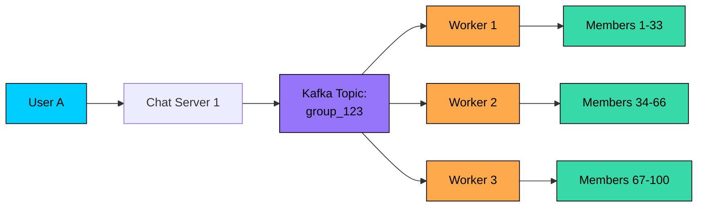

**How it works:**

1. Chat Server 1 publishes the message to a Kafka topic for the group
2. Multiple worker processes consume from this topic in parallel
3. Each worker is responsible for delivering to a subset of group members
4. The work is automatically distributed based on worker capacity

**The good:**

- Scales horizontally by adding more workers
- Resilient to individual worker failures (Kafka retries automatically)
- No single point of bottleneck

**The bad:**

- Adds latency since messages pass through the queue
- More complex infrastructure to manage
- Overkill for small groups where direct delivery is faster

### **Approach 3: Hybrid Approach (Recommended)**

The smart solution is to combine both approaches, choosing based on group size:

```mermaid
flowchart TB
    MSG[Group Message]:::primary

    MSG --> CHECK{Group Size"}:::orange

    CHECK -->|"< 100 members"| DIRECT["Direct Fanout<br/>from Sender's Server"]:::green
    CHECK -->|">= 100 members"| QUEUE["Kafka Queue<br/>Distributed Fanout"]:::purple

    DIRECT --> D1[Member 1]:::secondary
    DIRECT --> D2[Member 2]:::secondary
    DIRECT --> D3[...]:::secondary

    QUEUE --> W1["Worker 1<br/>Members 1-50"]:::secondary
    QUEUE --> W2["Worker 2<br/>Members 51-100"]:::secondary
    QUEUE --> W3["Worker N<br/>Members..."]:::secondary

    classDef primary fill:#00ceff,stroke:#000,color:#000
    classDef secondary fill:#38d9a9,stroke:#000,color:#000
    classDef orange fill:#ffa94d,stroke:#000,color:#000
    classDef green fill:#69db7c,stroke:#000,color:#000
    classDef purple fill:#9775fa,stroke:#000,color:#000
```

- **Small groups (under 100 members):** Use direct fanout from the sender's server. This is faster and simpler, and most groups fall into this category.
- **Large groups (100+ members):** Route through Kafka for distributed fanout. The added latency is acceptable for groups where reliability and scalability matter more.

The threshold of 100 is not magic; it is a tunable parameter based on your server capacity. The key insight is that different group sizes warrant different delivery strategies. This hybrid approach gives us the best of both worlds: low latency for the common case and scalability for the edge cases.

### The Complete Group Message Flow

Let's put it all together and trace a group message from send to delivery:

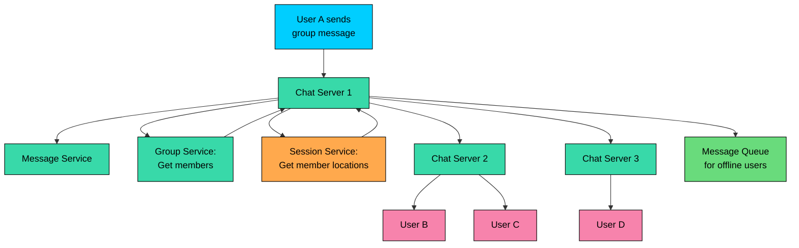

#### **Step by step:**

1. **Persist first:** User A sends a message to the group. Chat Server 1 immediately persists it via the Message Service with the `group_id` instead of a single recipient. The message is now durable.
2. **Get members:** Chat Server 1 queries the Group Service: "Who are the members of this group"" The Group Service returns the list of member IDs.
3. **Find member locations:** For each member, we need to know where they are connected (or if they are offline). Instead of making 50 individual queries, we batch this: "Where are users [B, C, D, E, ...]"" The Session Service returns a map of user IDs to chat server locations.
4. **Smart batching:** Here is a key optimization. Instead of forwarding to each member individually, we group members by their chat server. If members B, C, and E are all on Chat Server 2, we send one message to Chat Server 2 with all three recipient IDs. This dramatically reduces network overhead.
5. **Parallel delivery:** Chat Server 1 sends messages to Chat Server 2 and Chat Server 3 in parallel. Each receiving chat server pushes the message to its connected members.
6. **Handle offline members:** For members who are offline, the message goes to their queue. When they reconnect, they will receive it along with any other pending messages.

This flow handles groups of any size efficiently. For small groups, it completes in tens of milliseconds. For larger groups using the queue-based approach, delivery might take a bit longer but remains reliable.

---

## 4.4 Putting It All Together

We have now addressed each requirement incrementally. Let's step back and see the complete picture. This is the architecture you would draw on the whiteboard after explaining each component:

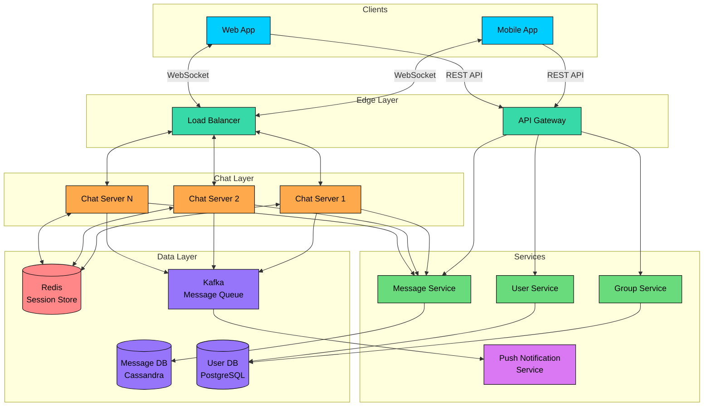

Looking at this architecture, we can identify distinct layers, each with a specific responsibility:

**Client Layer:** Mobile apps and web browsers connect to our system. From our perspective, they are all just WebSocket clients sending and receiving JSON messages.

**Edge Layer:** The load balancer distributes incoming connections across chat servers. For WebSocket connections, we typically use sticky sessions (or consistent hashing by user ID) so that a user's connection stays on the same server after initial assignment.

**Real-time Chat Layer:** The fleet of chat servers handles all the persistent connections. These are stateful servers, meaning they remember which users are connected to them. This is fundamentally different from stateless web servers where any server can handle any request.

**Service Layer:** These are traditional stateless services handling specific domains: messages, groups, users, and presence. They can scale horizontally without coordination.

**Data Layer:** Redis provides fast, ephemeral storage for session mappings and presence. Kafka queues messages for reliable delivery. Cassandra stores the actual message history, optimized for write-heavy, time-ordered data. PostgreSQL handles user and group data where we need transactions and complex queries.

| Component | Purpose | Why This Technology" |
|-----------|---------|---------------------|
| **Load Balancer** | Distributes WebSocket connections across chat servers | Sticky sessions for connection persistence |
| **Chat Servers** | Maintain persistent connections, route messages in real-time | Stateful, handles 50K+ connections each |
| **API Gateway** | Handles REST API requests for non-real-time operations | Rate limiting, authentication |
| **Session Service (Redis)** | Maps users to their connected chat server | Sub-millisecond lookups, pub/sub for presence |
| **Message Service** | Handles message persistence and retrieval | Decouples chat servers from storage |
| **Group Service** | Manages group membership and metadata | ACID transactions for consistency |
| **Presence Service** | Tracks online/offline status | Real-time updates via Redis |
| **Message Queue (Kafka)** | Buffers messages for offline users, handles fanout | Durability, ordering guarantees |
| **Push Notification Service** | Sends push notifications via APNs/FCM | Async processing, retry logic |
| **Message Database (Cassandra)** | Stores message history | Write-optimized, time-series friendly |
| **User Database (PostgreSQL)** | Stores user profiles and relationships | Complex queries, transactions |

With the high-level architecture clear, let's dive into how we store all this data efficiently.

---

# 5. Database Design

The database layer can make or break a messaging system. With 20 billion messages per day and 500 million users, we need to make careful choices. The wrong database will become a bottleneck that is painful to fix later.

Let's think through the requirements and choose appropriately.

## 5.1 SQL vs NoSQL

One of the most common mistakes in system design is treating all data the same. A messaging system has two fundamentally different types of data, and each deserves a different storage strategy.

### Message Data: Write-Heavy and Time-Ordered

Think about how we access messages:

- **Write-heavy workload:** We are writing 230,000 messages per second. Every single message needs to be persisted.
- **Simple queries:** "Get me the last 50 messages for this conversation." No complex joins, no aggregations.
- **Time-series nature:** Recent messages are accessed constantly. Messages from last year are rarely touched.
- **No transactions needed:** A message either exists or it does not. We do not need to atomically update multiple messages.
- **High availability is critical:** If the message database goes down, messaging stops.

Given these patterns, a **wide-column NoSQL database** like **Apache Cassandra** or **ScyllaDB** is the right choice:

- **Built for writes:** Cassandra's log-structured storage handles high write throughput beautifully
- **Linear scalability:** Need more capacity" Add more nodes. Cassandra distributes data automatically.
- **Time-series optimization:** Clustering keys keep messages in a conversation sorted by time on disk
- **Tunable consistency:** We can trade between consistency and availability per query

### User and Group Data: Relational and Consistent

Now think about user and group data:

- **Complex relationships:** Which groups does this user belong to" Who are the admins of this group"
- **Transactions:** When adding a user to a group, we need to update the group membership and the user's group list atomically
- **Strong consistency:** If I just added you to a group, you should see it immediately
- **Read-heavy:** User profiles are read often but updated rarely

For this, a **relational database** like **PostgreSQL** makes more sense:

- **Rich query capabilities:** Joins, subqueries, and complex filters
- **ACID transactions:** Multi-table updates are atomic
- **Strong consistency:** Reads always see the latest writes
- **Mature ecosystem:** Well-understood operations, excellent tooling

## 5.2 Database Schema

With our database choices made, let's design the actual schemas. We have three categories of data, each stored in the technology best suited for it:

### **1. Messages Table (Cassandra)**

This is the heart of our storage layer. The schema design is driven by a single question: "What is the most common query we need to answer""

For a messaging app, that query is: **"Get the last 50 messages for this conversation, ordered by time."**

We design the entire table around this access pattern:

| Field | Type | Description |
|-------|------|-------------|
| `conversation_id` | UUID (Partition Key) | Unique identifier for the conversation |
| `message_id` | TimeUUID (Clustering Key) | Time-based UUID for ordering |
| `sender_id` | UUID | ID of the message sender |
| `content` | Text | Message content |
| `message_type` | Text | Type: `text`, `image`, `video` |
| `status` | Text | Delivery status: `sent`, `delivered`, `read` |
| `created_at` | Timestamp | Server timestamp |

Let's understand why each field is where it is:

**Partition Key (**`conversation_id`**):** This determines which nodes store the data. All messages in a single conversation live together on the same nodes. When we query "last 50 messages for conversation X", Cassandra knows exactly which nodes to ask. This is what makes reads fast.

**Clustering Key (**`message_id`** as TimeUUID):** Within a partition (a conversation), messages are physically sorted on disk by the clustering key. A TimeUUID is a special UUID that encodes the timestamp, so messages are automatically ordered by time. Fetching "the last 50 messages" becomes a simple range scan, not a full table scan.

The combination of partition key and clustering key means that our most common query, "get recent messages for a conversation", hits a single partition on a small number of nodes and reads data that is already sorted. This is as fast as it gets.

### **2. User Conversations Table (Cassandra)**

When a user opens the app, the first thing they see is their conversation list. We need to answer: "What are this user's recent conversations, and what was the last message in each""

| Field | Type | Description |
|-------|------|-------------|
| `user_id` | UUID (Partition Key) | User ID |
| `conversation_id` | UUID (Clustering Key) | Conversation ID |
| `last_message_at` | Timestamp | Time of last message |
| `unread_count` | Integer | Number of unread messages |
| `last_message_preview` | Text | Preview of last message |

Notice that we store `last_message_preview` directly in this table. This is intentional denormalization. When rendering the conversation list, we can show "Hey, are you coming for lunch..." without querying the messages table at all. 

In a normalized design, we would have to join or make a second query. Here, one query gives us everything we need.

This is a common pattern in Cassandra: store the data in the shape you need to read it, even if it means duplicating information across tables.

### **3. Groups Table (PostgreSQL)**

Group metadata lives in PostgreSQL where we can use proper relational modeling:

| Field | Type | Description |
|-------|------|-------------|
| `group_id` | UUID (PK) | Unique group identifier |
| `name` | VARCHAR(100) | Group name |
| `creator_id` | UUID (FK) | User who created the group |
| `created_at` | Timestamp | Creation time |
| `member_count` | Integer | Number of members |

The `member_count` is denormalized here even though we could compute it from the members table. This avoids a COUNT query every time we need to display group info.

### **4. Group Members Table (PostgreSQL)**

This is the join table that maps users to groups:

| Field | Type | Description |
|-------|------|-------------|
| `group_id` | UUID (PK, FK) | Group ID |
| `user_id` | UUID (PK, FK) | User ID |
| `role` | VARCHAR(20) | Role: `admin`, `member` |
| `joined_at` | Timestamp | When user joined |

The composite primary key `(group_id, user_id)` serves two purposes:

1. It ensures a user can only be in a group once (no duplicates)
2. It creates an index that allows efficient queries in both directions: "all members of group X" and "all groups user Y belongs to"

With these tables, we can handle all group operations with standard SQL queries and proper transaction support. When a user joins a group, we update both the membership table and the group's member_count in a single transaction.

Now let's move on to the most interesting part of the design: the deep dive into specific challenges.

---

# 6. Design Deep Dive

The high-level architecture gives us the skeleton, but interviewers often want to probe deeper into specific areas. This is where you demonstrate not just that you know what components to use, but that you understand how they work and why certain approaches are better than others.

Let's explore the trickiest aspects of building a messaging system.

## 6.1 WebSocket vs Long Polling vs Server-Sent Events

We have mentioned WebSocket connections throughout this design, but why WebSocket specifically" 

There are several ways to achieve real-time communication between clients and servers. Each has different trade-offs in terms of latency, resource usage, and complexity. 

Let's understand them so you can explain the choice in an interview.

### **Approach 1: HTTP Long Polling**

Long polling is the oldest technique for achieving real-time-like behavior with plain HTTP. It predates WebSockets and was the backbone of early real-time web apps like Gmail's chat.

**The idea is simple:** the client makes an HTTP request asking "any new messages for me"" Instead of responding immediately with "no," the server holds the connection open. If a new message arrives while the connection is open, the server responds with it immediately. If nothing happens for 30-60 seconds, the server responds with an empty result, and the client immediately makes another request.

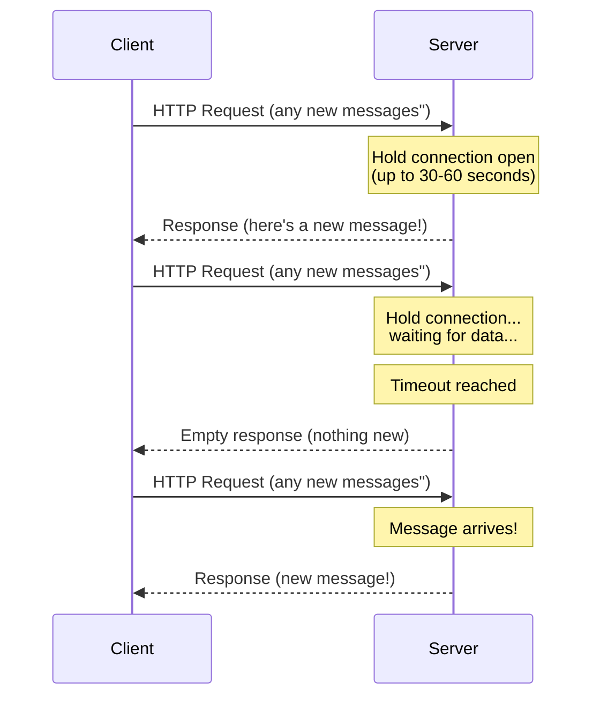

The client creates a continuous loop of requests, effectively creating a "persistent" connection using standard HTTP semantics.

**The good:**

- Works everywhere, including through corporate proxies and strict firewalls that block other protocols
- Uses standard HTTP infrastructure, so load balancers and caching work as expected
- Simple fallback when more modern approaches are blocked

**The bad:**

- Each request cycle involves TCP connection setup, HTTP headers, and potential TLS handshakes, all overhead that adds up
- There is inherent latency: a message might arrive just after the last response, requiring the user to wait for the next polling cycle
- Servers hold many mostly-idle connections, wasting resources

Long polling got us through the early web era, but it is not ideal for a modern messaging system with millions of concurrent users.

### **Approach 2: Server-Sent Events (SSE)**

SSE improves on long polling by establishing a true persistent connection, but only in one direction. The server can push events to the client continuously, but the client still needs to use regular HTTP requests to send data back.

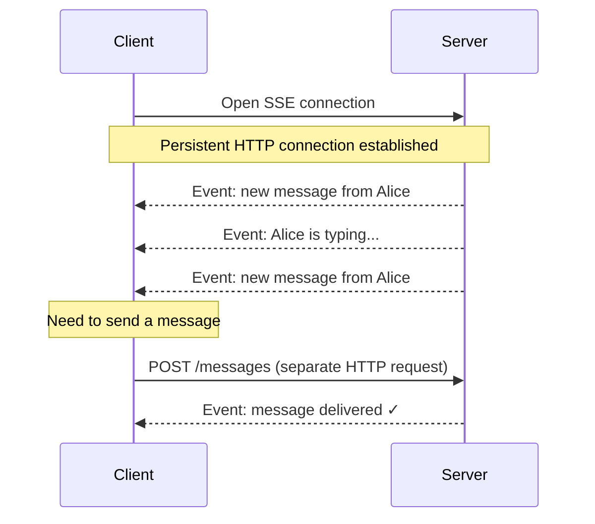

Think of SSE as a one-way pipe from server to client. The server can push events whenever it wants, but sending a message back requires a separate HTTP POST.

**The good:**

- Eliminates the request/response cycle of long polling
- Built-in reconnection handling when connections drop
- Works well with HTTP/2, which can multiplex multiple streams

**The bad:**

- Fundamentally unidirectional, so chat requires a hybrid approach: SSE for receiving, HTTP for sending
- This asymmetry adds complexity and slightly higher latency for outgoing messages
- Not as universally supported as WebSockets in mobile SDKs

SSE is a good fit for notification streams, live feeds, or stock tickers where the server broadcasts and the client mostly listens. For chat, where both sides constantly send data, we need something better.

### **Approach 3: WebSocket (Recommended)**

WebSocket is the modern solution. It provides a true bidirectional channel where both client and server can send messages at any time, over a single persistent TCP connection.

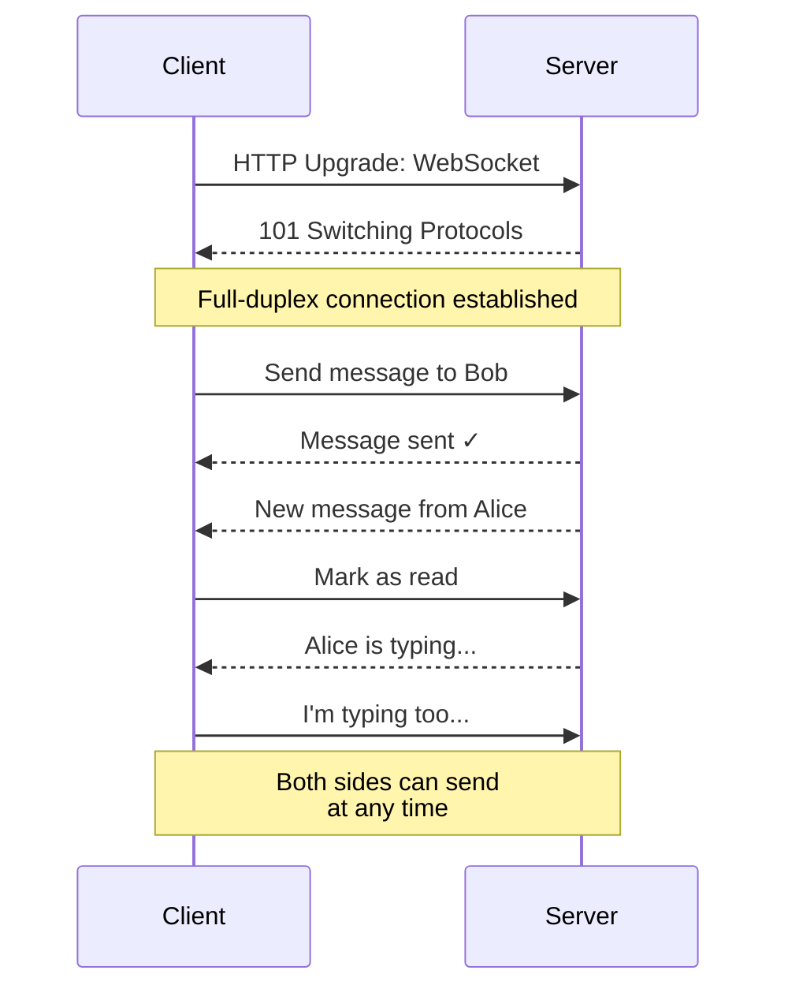

The connection starts with a standard HTTP request that includes an "Upgrade" header. If the server supports WebSocket, it responds with 101 Switching Protocols, and from that point on, the connection is a full WebSocket. Both sides can send frames whenever they want, there is no request/response dance.

**The good:**

- True bidirectional communication: either side can initiate a message at any time
- Minimal overhead after connection: just the WebSocket frame header (as small as 2 bytes)
- Lowest possible latency: messages are pushed instantly
- Single connection for all traffic, reducing connection setup costs

**The bad:**

- Stateful nature complicates scaling: you need to track which server each user is on
- Requires WebSocket-aware load balancers and proxies
- Connection management requires heartbeats, reconnection logic, and careful error handling

### Which Should You Choose"

| Approach | Latency | Overhead | Bidirectional | Best For |
|----------|---------|----------|---------------|----------|
| **Long Polling** | High | High | No | Legacy systems, fallback |
| **SSE** | Medium | Low | No | Notifications, live feeds |
| **WebSocket** | Lowest | Lowest | Yes | Chat, gaming, collaboration |

**For a messaging system, WebSocket is the clear winner.** The bidirectional nature matches how chat works: both users send and receive constantly. The low latency means conversations feel instant. The single-connection efficiency means we can handle more users per server.

The main challenge with WebSocket is the stateful nature, but we have already addressed this with our Session Service design. We accept the added complexity because the user experience benefits are substantial.

> 💡 **Key Insight:**

> **One practical note**
>
> Always implement long polling as a fallback. Some corporate networks and older proxies still block WebSocket connections. Your client should detect this and gracefully fall back to long polling

---

## 6.2 Message Delivery Guarantees

Everyone who has used WhatsApp knows the checkmarks: one gray for sent, two gray for delivered, two blue for read. These simple icons hide a lot of complexity. 

How do we track message state reliably across unreliable networks, flaky mobile connections, and devices that go offline unpredictably"

Let's break down what each state means and how we guarantee correct transitions:

1. **Sent (single gray checkmark):** The message has been persisted on our servers. The user can close the app knowing the message will not be lost.
2. **Delivered (double gray checkmarks):** The message has reached the recipient's device. They may not have seen it yet, but it is on their phone.
3. **Read (double blue checkmarks):** The recipient has opened the conversation and viewed the message.

Getting these states right requires careful engineering. Networks fail, devices go offline mid-delivery, and the same message might be sent twice due to retries. Let's see how to handle this.

### The Delivery Flow

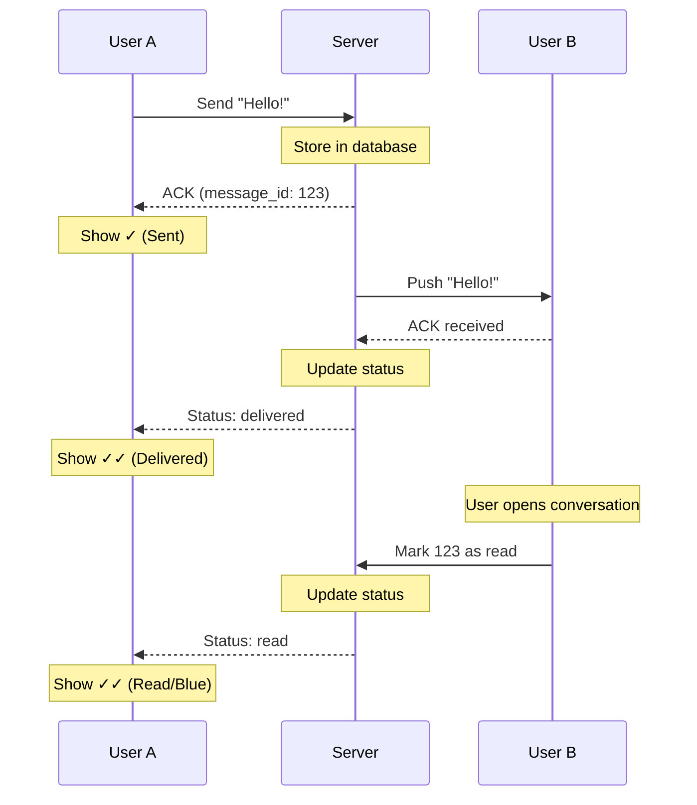

### Ensuring At-Least-Once Delivery

The cardinal rule of messaging: **messages must never be lost.** A user who sees the "sent" checkmark should be confident that their message will eventually reach its destination, even if networks fail, servers crash, or the recipient's phone runs out of battery.

Achieving this requires a combination of two techniques: the client retries aggressively, and the server deduplicates.

#### **Client-Side Retry with Idempotency**

Here is the key insight that makes reliable messaging possible: if the server can detect duplicate messages, the client can safely retry as many times as needed without fear of the message appearing twice.

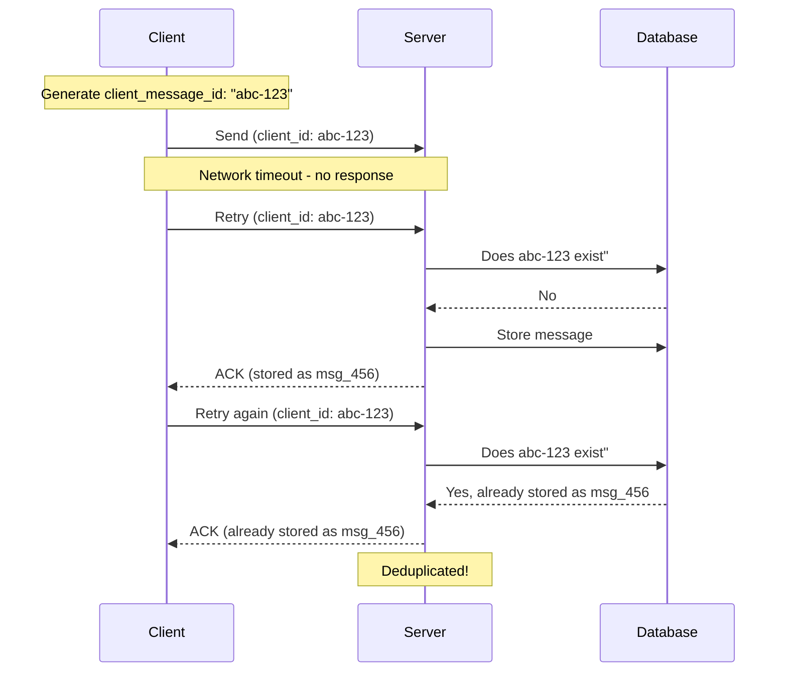

Here is how this works in practice:

1. Before sending, the client generates a unique `client_message_id` (typically a UUID). This ID is the message's fingerprint.
2. The client sends the message to the server and starts a timer.
3. If no acknowledgment arrives within a timeout (say, 5 seconds), the client assumes something went wrong and retries with the exact same `client_message_id`.
4. When the server receives a message, it checks: "Have I seen this `client_message_id` before""
5. If yes, it is a duplicate. The server returns success without storing again.
6. If no, it is a new message. The server stores it and returns success.

This pattern is called **idempotent delivery**. The same operation can be performed multiple times with the same result. The client can retry as aggressively as it needs to, and the server guarantees that duplicate messages are detected and discarded.

#### **Server-Side Persistence Before Acknowledgment**

There is one more critical rule for reliable messaging: **never acknowledge a message until it is persisted to durable storage.**

```mermaid
flowchart LR
    A[Receive Message]:::primary --> B[Write to Database]:::secondary
    B --> C{Write Success"}:::orange
    C -->|Yes| D[Send ACK to Client]:::green
    C -->|No| E[Return Error]:::red
    E --> F[Client Retries]:::primary

    classDef primary fill:#00ceff,stroke:#000,color:#000
    classDef secondary fill:#38d9a9,stroke:#000,color:#000
    classDef orange fill:#ffa94d,stroke:#000,color:#000
    classDef green fill:#69db7c,stroke:#000,color:#000
    classDef red fill:#ff8787,stroke:#000,color:#000
```

If the server crashes between receiving a message and persisting it, the message is lost. By only sending ACK after persistence, we guarantee that any acknowledged message is safely stored.

### Handling Out-of-Order Messages

Networks don't guarantee ordering. If User A sends "Hello" then "How are you"", network conditions might deliver them in reverse order.

```mermaid
flowchart LR
    subgraph Sent["Sent Order"]
        S1["Msg 1: Hello"]:::primary
        S2["Msg 2: How are you""]:::primary
    end

    subgraph Network["Network Chaos"]
        N[Packets take<br/>different routes]:::orange
    end

    subgraph Received["Received Order"]
        R1["Msg 2: How are you""]:::red
        R2["Msg 1: Hello"]:::red
    end

    subgraph Display["Correct Display"]
        D1["Msg 1: Hello"]:::green
        D2["Msg 2: How are you""]:::green
    end

    S1 & S2 --> N --> R1 & R2
    R1 & R2 --> SORT[Sort by<br/>sequence number]:::secondary
    SORT --> D1 & D2

    classDef primary fill:#00ceff,stroke:#000,color:#000
    classDef secondary fill:#38d9a9,stroke:#000,color:#000
    classDef orange fill:#ffa94d,stroke:#000,color:#000
    classDef green fill:#69db7c,stroke:#000,color:#000
    classDef red fill:#ff8787,stroke:#000,color:#000
```

The solution involves multiple mechanisms:

1. **Sequence numbers per conversation:** Each message gets an incrementing sequence number within its conversation
2. **Server-side timestamp:** Server assigns authoritative timestamp for ordering
3. **Client-side reordering:** Client sorts messages by sequence number before display

When the client receives a message, it doesn't immediately display it. Instead, it inserts it into the correct position based on sequence number, ensuring messages always appear in order regardless of arrival order.

---

## 6.3 Presence System (Online/Offline Status)

The green "online" dot and "last seen at 3:45 PM" text seem like simple features. But think about what they require at scale: tracking 50 million concurrent users, notifying their contacts when status changes, and doing it all without overwhelming the system.

This is a classic trade-off between accuracy and efficiency. Perfect real-time presence would require broadcasting every status change to potentially hundreds of contacts, generating massive network traffic. We need a smarter approach.

### The Challenges

The core challenges with presence are:

- **Constant churn:** Users open and close apps constantly. Their phones switch between WiFi, cellular, and airplane mode. Status changes happen all the time.
- **Fanout explosion:** If User A has 500 contacts and comes online, do we notify all 500" What if 1000 users come online in the same second"
- **Accuracy vs. efficiency:** Users want accurate presence, but broadcasting every change would overwhelm the system.

### Approach: Heartbeat-Based Presence with Lazy Queries

The practical solution is a combination of heartbeats for tracking and lazy queries for display.

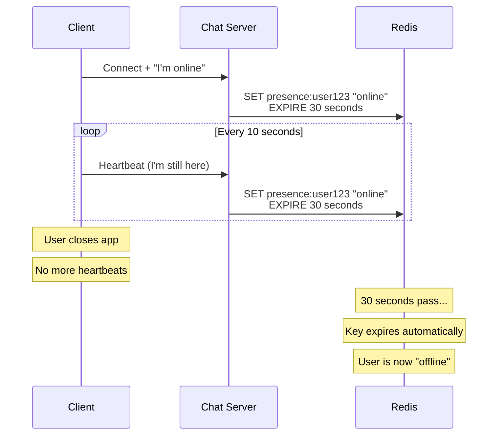

#### How It Works

The mechanism is elegantly simple:

1. **Connection:** When a user connects, the chat server sets a key in Redis: `presence:user_123 = online` with a TTL of 30 seconds.
2. **Heartbeat:** Every 10 seconds, the client sends a heartbeat over the WebSocket. The server refreshes the TTL, resetting it to 30 seconds.
3. **Disconnect:** If heartbeats stop (the user closed the app, lost network, or the phone died), the key expires automatically after 30 seconds.
4. **Query:** When User B opens a chat with User A, the app queries: "What is the presence of User A"" Redis returns the value if the key exists, or nothing if it has expired.

The 30-second TTL is a deliberate choice. It means users appear offline within 30 seconds of actually going offline, which is acceptable for casual chat. If you needed faster detection (for a stock trading app, say), you could reduce the TTL and heartbeat interval, at the cost of more traffic.

#### Optimizing Presence Fanout

The naive approach, broadcasting presence changes to all contacts, doesn't scale. If a user has 500 contacts, and 10% of users change presence every minute, the fanout traffic explodes.

**Solution: Lazy Presence Queries**

Instead of broadcasting, query presence only when needed:

```mermaid
flowchart LR
    subgraph Trigger["User Opens Chat"]
        A["User A opens chat<br/>with User B"]:::primary
    end

    subgraph Query["Lazy Query"]
        Q["GET presence:user_b"]:::secondary
    end

    subgraph Redis["Redis"]
        R[("user_b: online<br/>TTL: 25s remaining")]:::purple
    end

    subgraph UI["Update UI"]
        D["Show: User B is online 🟢"]:::green
    end

    A --> Q --> R --> D

    classDef primary fill:#00ceff,stroke:#000,color:#000
    classDef secondary fill:#38d9a9,stroke:#000,color:#000
    classDef purple fill:#9775fa,stroke:#000,color:#000
    classDef green fill:#69db7c,stroke:#000,color:#000
```

When User A opens a chat with User B:

1. Query Redis for User B's presence
2. Display result in UI
3. Subscribe to presence updates (via Redis pub/sub) for real-time changes while chat is open
4. Unsubscribe when chat is closed

This drastically reduces presence traffic. We only track presence for users the client is actively viewing.

### Last Seen Timestamp

Instead of binary online/offline, many apps show "last seen at [time]":

1. Update `last_seen` timestamp on every meaningful user action
2. When queried, return the timestamp
3. Client displays relative time ("last seen 5 minutes ago")

This provides useful information without the complexity of real-time presence. WhatsApp uses this approach, only showing "online" status for users you're actively chatting with.

---

## 6.4 Message Synchronization Across Devices

Modern users expect their messages on every device: phone, tablet, laptop, web browser. When they read a message on their phone, it should show as read on their laptop too. This is multi-device sync.

### The Challenge

```mermaid
flowchart LR
    subgraph UserA["User A's Devices"]
        Phone["Phone<br/>Online"]:::green
        Tablet["Tablet<br/>Offline"]:::red
        Web["Web Browser<br/>Online"]:::green
    end

    subgraph Server["Message Arrives"]
        MSG["New message<br/>from User B"]:::primary
    end

    MSG --> Phone
    MSG --> Web
    MSG -.->|"Queue for later"| Tablet

    classDef primary fill:#00ceff,stroke:#000,color:#000
    classDef green fill:#69db7c,stroke:#000,color:#000
    classDef red fill:#ff8787,stroke:#000,color:#000
```

When a message arrives for User A, we need to:

1. Push to all online devices immediately
2. Queue for offline devices
3. Sync read/delivered status across all devices

### Hybrid Sync Strategy

The best approach combines real-time push with catch-up pull:

#### Real-time Push (Online Devices)

When User A has multiple devices connected, the Session Service tracks all of them:

```shell
user_a -> [chat_server_1 (phone), chat_server_3 (web)]
```

When a message arrives:

1. Session Service returns all device connections
2. Message is pushed to all connected devices simultaneously
3. Each device sends independent ACK
4. "Delivered" status is set when ANY device acknowledges

#### Catch-up Pull (Reconnecting Devices)

When a device comes online after being offline:

```mermaid
sequenceDiagram
    participant T as Tablet (was offline)
    participant CS as Chat Server
    participant MS as Message Service
    participant MQ as Message Queue

    T->>CS: Connect (last_sync: 2 hours ago)
    CS->>MS: Get messages since last_sync
    MS-->>CS: 47 new messages
    CS->>MQ: Any queued messages"
    MQ-->>CS: 3 queued messages
    CS->>T: Here are 50 messages
    T-->>CS: ACK all received
    CS->>MQ: Clear queue for this device
```

The device sends its last sync timestamp when connecting. The server fetches all messages since then and delivers them in bulk. This ensures no messages are ever missed, regardless of how long the device was offline.

### Read Status Synchronization

When User A reads a message on their phone:

```mermaid
sequenceDiagram
    participant P as Phone
    participant S as Server
    participant W as Web Browser
    participant T as Tablet

    Note over P: User reads message
    P->>S: Mark message 456 as read
    S->>S: Update database

    par Push to sender
        S->>S: Notify User B: message read
    and Sync to other devices
        S->>W: Sync: message 456 read
        S->>T: Sync: message 456 read
    end

    Note over W: UI updates: message shown as read
    Note over T: UI updates: message shown as read
```

All of User A's devices see the same read status. The sender (User B) also gets notified that the message was read.

---

## 6.5 Scaling Chat Servers

Chat servers are fundamentally different from typical web servers. While a stateless API server can be scaled by simply adding more instances behind a load balancer, chat servers hold state: the WebSocket connections themselves. 

Each connection represents a user, and that user's messages must be routed to their specific server. This stateful nature creates unique scaling challenges. 

Let's walk through how to handle them.

### Connection Limits

A well-tuned server with proper kernel configuration can handle 50,000 to 100,000 concurrent WebSocket connections. The limits come from file descriptors, memory, and CPU for processing messages.

For our target of 50 million concurrent users, we need:

```shell
50M connections / 50K per server = 1,000 chat servers
```

```mermaid
flowchart TB
    subgraph Users["50 Million Users"]
        U["All Users"]:::primary
    end

    subgraph LB["Load Balancing Layer"]
        L["Consistent Hashing<br/>by user_id"]:::orange
    end

    subgraph Servers["1,000 Chat Servers"]
        S1["Server 1<br/>50K connections"]:::secondary
        S2["Server 2<br/>50K connections"]:::secondary
        S3["Server 3<br/>50K connections"]:::secondary
        S1000["Server 1000<br/>50K connections"]:::secondary
    end

    U --> L
    L --> S1 & S2 & S3 & S1000

    classDef primary fill:#00ceff,stroke:#000,color:#000
    classDef secondary fill:#38d9a9,stroke:#000,color:#000
    classDef orange fill:#ffa94d,stroke:#000,color:#000
```

### Sticky Sessions and Connection Affinity

Unlike stateless HTTP servers, WebSocket connections are inherently stateful. Once User A connects to Chat Server 1, all their messages must route through that server until they disconnect.

**Load balancer configuration options:**

1. **Consistent hashing by user_id:** Same user always routes to the same server (until server list changes)
2. **Connection tracking:** Load balancer remembers which server each connection went to
3. **Client-side server assignment:** Server tells client which specific server to connect to on subsequent attempts

### Handling Server Failures

What happens when a chat server crashes" With 50,000 users per server, a crash is a significant event.

```mermaid
sequenceDiagram
    participant C as Client
    participant S1 as Server 1
    participant LB as Load Balancer
    participant S2 as Server 2
    participant SS as Session Service
    participant MQ as Message Queue

    C->>S1: Connected and chatting...
    Note over S1: Server crashes!

    C--xS1: Connection lost
    Note over C: Detect disconnect<br/>(no heartbeat response)

    C->>LB: Reconnect attempt
    LB->>S2: Route to healthy server
    C->>S2: Establish new connection

    S2->>SS: Update: User now on Server 2
    S2->>MQ: Fetch pending messages
    MQ-->>S2: 3 messages queued during crash
    S2->>C: Deliver missed messages

    Note over C: Back online, no messages lost
```

The recovery flow:

1. **Detection:** Client detects disconnection (heartbeat timeout, connection close event)
2. **Reconnection:** Client connects to load balancer, which routes to a healthy server
3. **State Recovery:** New server registers the connection in Session Service
4. **Message Recovery:** Pending messages are fetched from the queue
5. **Resume:** Normal operation continues

The key insight is that message persistence (in the database and queue) is separate from connection state. Even if a server crashes mid-delivery, the message is safe and will be delivered on reconnection.

### Graceful Shutdown

Production systems need regular maintenance: OS patches, code deployments, hardware replacements. Graceful shutdown minimizes user impact:

1. **Mark as draining:** Remove server from load balancer pool
2. **Stop new connections:** Reject any new WebSocket handshakes
3. **Notify clients:** Send a "please reconnect elsewhere" message
4. **Wait for drain:** Give clients time to gracefully disconnect (typically 30-60 seconds)
5. **Force close:** Terminate any remaining connections
6. **Shutdown:** Server can now safely restart

Most clients will reconnect to other servers during the drain period, making the maintenance nearly invisible to users.

---

## 6.6 End-to-End Encryption (Conceptual)

End-to-end encryption (E2EE) ensures that only the sender and recipient can read messages. Even the service provider (WhatsApp, Signal, etc.) cannot decrypt message content.

### How It Works (Signal Protocol)

Most modern messaging apps use the Signal Protocol or something similar:

```mermaid
sequenceDiagram
    participant A as User A
    participant S as Server
    participant B as User B

    Note over A: Generate key pair<br/>(public_A, private_A)
    Note over B: Generate key pair<br/>(public_B, private_B)

    A->>S: Register my public_A
    B->>S: Register my public_B

    Note over A: Want to message User B
    A->>S: Get public_B
    S-->>A: Here's public_B

    Note over A: Encrypt "Hello!" with public_B
    A->>S: Send encrypted message

    Note over S: I can store this, but<br/>I cannot read it!

    S->>B: Forward encrypted message
    Note over B: Decrypt with my private_B
    Note over B: "Hello!"
```

The basic flow:

1. **Key Generation:** Each user's device generates a public/private key pair
2. **Key Registration:** Public keys are uploaded to the server
3. **Key Exchange:** When starting a conversation, users fetch each other's public keys
4. **Encryption:** Sender encrypts message using recipient's public key
5. **Transmission:** Encrypted message travels through servers (who can't decrypt it)
6. **Decryption:** Only recipient's private key can decrypt the message

### What the Server Can and Cannot Do

```mermaid
flowchart LR

    subgraph Cannot["Server CANNOT"]
        X1["Read message<br/>content"]:::red
        X2["Decrypt any<br/>messages"]:::red
        X3["Provide content<br/>to third parties"]:::red
        X4["Search message<br/>content"]:::red
    end

    subgraph Can["Server CAN"]
        C1["Route encrypted<br/>messages"]:::green
        C2["Store encrypted<br/>data"]:::green
        C3["Track delivery<br/>status"]:::green
        C4["Send push<br/>notifications"]:::green
    end

    classDef green fill:#69db7c,stroke:#000,color:#000
    classDef red fill:#ff8787,stroke:#000,color:#000
```

### Trade-offs of E2E Encryption

**Benefits:**

- Strong privacy protection
- Users trust the system more
- Regulatory compliance in some regions

**Challenges:**

- **Multi-device complexity:** Each device has its own key pair. Syncing messages across devices requires encrypting for each device separately.
- **Key changes:** If a user reinstalls the app or gets a new phone, their keys change. The system must handle this securely without enabling man-in-the-middle attacks.
- **Limited server features:** Search, spam detection, and content moderation become difficult or impossible when the server can't read content.
- **Backup challenges:** If users back up their messages, the backup is also encrypted. Losing the key means losing access to message history.

For an interview, it's sufficient to mention that E2EE is important for privacy and explain the high-level concept. The cryptographic details (perfect forward secrecy, double ratchet algorithm, etc.) are typically out of scope unless the interviewer specifically asks.

---

# Quiz
