> 💡 **Key Insight:**

> **What is TikTok/Reels"**
>
> #### What is TikTok/Reels"
>
> **TikTok** (and Instagram Reels, YouTube Shorts) are short-form video platforms that allow users to create, share, and discover videos typically ranging from 15 seconds to 3 minutes in length.
>
> 
> <!-- Simulation: tiktok -->
> 

>
> The core experience revolves around an algorithmically-curated "For You" feed that surfaces personalized video content based on user behavior, interests, and engagement patterns.
>
> Users can scroll through an endless stream of videos, interact with content through likes, comments, and shares, and create their own videos with built-in editing tools.

In this chapter, we will explore the **high-level design of a TikTok/Reels-like short video platform**.

This problem tests your ability to design for massive scale, handle video processing pipelines, build recommendation systems, and optimize content delivery globally.

Let's start by clarifying the requirements:

---

# 1. Clarifying Requirements

Before diving into the design, it's important to ask thoughtful questions to uncover hidden assumptions, clarify ambiguities, and define the system's scope more precisely.

Here is an example of how a discussion between the candidate and the interviewer might unfold:

> 💡 **Key Insight:**

> **DISCUSSION**
>
> **Candidate:** "What is the expected scale" How many daily active users and video uploads should we support""
>
> **Interviewer:** "Let's design for 500 million daily active users, with about 5 million new videos uploaded per day."
>
> **Candidate:** "What is the maximum video duration and file size we need to support""
>
> **Interviewer:** "Videos can be up to 3 minutes long. Assume an average video size of 50 MB after compression, with a maximum of 200 MB for uploads."
>
> **Candidate:** "Should we design the video creation and editing features, or focus on the platform infrastructure""
>
> **Interviewer:** "Focus on the platform infrastructure: upload, storage, delivery, and feed. Assume video editing happens on the client side before upload."
>
> **Candidate:** "How personalized should the feed be" Do we need a sophisticated recommendation system""
>
> **Interviewer:** "Yes, the feed should be highly personalized. The recommendation system is a key differentiator. Users should see relevant content even if they follow no one."
>
> **Candidate:** "What engagement features are required" Likes, comments, shares, follows""
>
> **Interviewer:** "Yes, all of those. Real-time view counts and like counts are important for the user experience."
>
> **Candidate:** "What are the latency expectations for video playback""
>
> **Interviewer:** "Videos should start playing within 200ms of appearing on screen. Buffering should be minimal even on slower networks."

After gathering the details, we can summarize the key system requirements.

## 1.1 Functional Requirements

- **Video Upload:** Users can upload short videos (up to 3 minutes) with metadata (caption, hashtags, music).
- **Video Feed:** Users can browse a personalized "For You" feed of recommended videos.
- **Video Playback:** Users can watch videos with smooth streaming and minimal buffering.
- **Engagement:** Users can like, comment on, and share videos.
- **Follow System:** Users can follow other creators and see their content.

> 💡 **Key Insight:**

> **Out of Scope**
>
> - **Video Editing:** In-app video creation and editing tools.
> - **Live Streaming:** Real-time live video broadcasts.
> - **Direct Messaging:** Private messaging between users.
> - **Monetization:** Creator payments, ads infrastructure.

## 1.2 Non-Functional Requirements

- **High Availability:** The system must be highly available (99.99% uptime). Users should always be able to watch videos.
- **Low Latency:** Video playback should start within 200ms. Feed loading should feel instant.
- **High Scalability:** Support 500M DAU, 5M video uploads/day, and billions of video views per day.
- **Global Reach:** Content must be delivered with low latency worldwide.
- **Eventual Consistency:** Like counts and view counts can be eventually consistent (small delays acceptable).

---

# 2. Back-of-the-Envelope Estimation

To understand the scale of our system, let's make some reasonable assumptions.

#### **Video Uploads (Writes)**

- New videos per day: **5 million**
- Average upload QPS = `5,000,000 / 86,400` ≈ **58 QPS (steady state)**
- Peak upload QPS (3x factor) ≈ **175 QPS**

#### **Video Views (Reads)**

- Daily active users: **500 million**
- Assume each user watches **50 videos per day** on average
- Total daily views = `500M × 50` = **25 billion views/day**
- Average read QPS = `25,000,000,000 / 86,400` ≈ **290,000 QPS**
- Peak read QPS (3x factor) ≈ **870,000 QPS**

This is an extremely read-heavy system with a **read:write ratio of approximately 5000:1**.

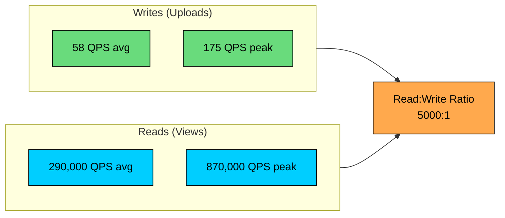
```mermaid
flowchart LR
    subgraph Writes["Writes (Uploads)"]
        W1[58 QPS avg]
        W2[175 QPS peak]
    end

    subgraph Reads["Reads (Views)"]
        R1[290,000 QPS avg]
        R2[870,000 QPS peak]
    end

    Ratio[Read:Write Ratio<br/>5000:1]

    Writes --> Ratio
    Reads --> Ratio

    style W1 fill:#69db7c,stroke:#000,color:#000
    style W2 fill:#69db7c,stroke:#000,color:#000
    style R1 fill:#00ceff,stroke:#000,color:#000
    style R2 fill:#00ceff,stroke:#000,color:#000
    style Ratio fill:#ffa94d,stroke:#000,color:#000
```

#### **Storage**

**Video Storage (per year):**

- Videos per day: 5 million
- Average video size (after transcoding to multiple resolutions): ~100 MB
- Daily video storage = `5M × 100 MB` = **500 TB/day**
- Annual video storage = `500 TB × 365` ≈ **180 PB/year**

**Metadata Storage (per year):**

- Each video has metadata (~2 KB): video ID, user ID, caption, hashtags, timestamps, statistics
- Daily metadata = `5M × 2 KB` = **10 GB/day**
- Annual metadata ≈ **3.6 TB/year**

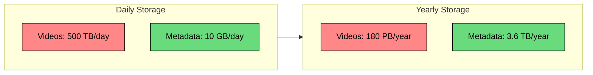
```mermaid
flowchart LR
    subgraph Daily["Daily Storage"]
        D1[Videos: 500 TB/day]
        D2[Metadata: 10 GB/day]
    end

    subgraph Yearly["Yearly Storage"]
        Y1[Videos: 180 PB/year]
        Y2[Metadata: 3.6 TB/year]
    end

    Daily --> Yearly

    style D1 fill:#ff8787,stroke:#000,color:#000
    style D2 fill:#69db7c,stroke:#000,color:#000
    style Y1 fill:#ff8787,stroke:#000,color:#000
    style Y2 fill:#69db7c,stroke:#000,color:#000
```

#### **Bandwidth**

- Average video size served: ~10 MB (compressed, adaptive bitrate)
- Daily bandwidth = `25B views × 10 MB` = **250 PB/day**
- Peak bandwidth ≈ **25 Tbps**

---

# 3. Core APIs

The short video platform needs APIs for video management, feed retrieval, and user engagement. Below are the core APIs required for the basic functionality.

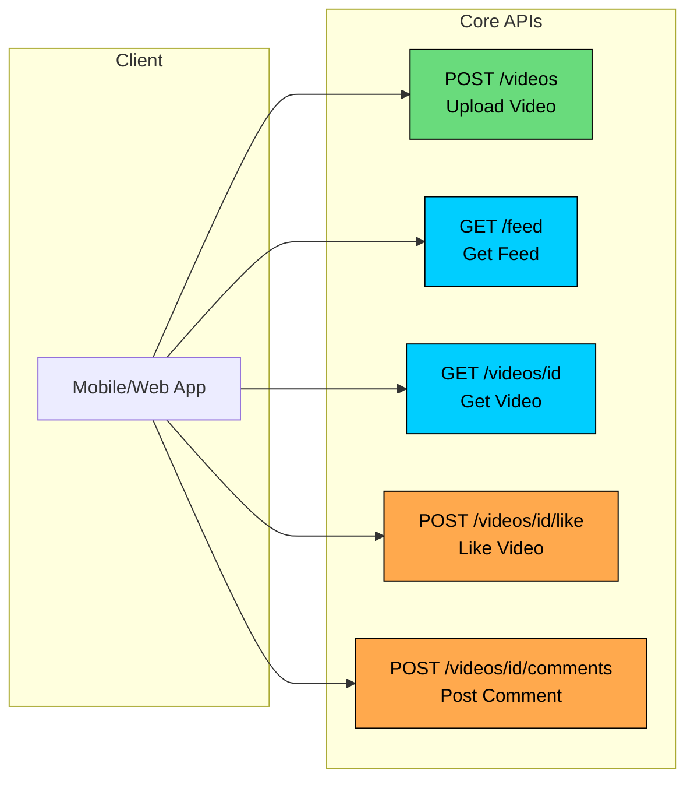
```mermaid
flowchart LR
    subgraph Client
        App[Mobile/Web App]
    end

    subgraph APIs["Core APIs"]
        Upload[POST /videos<br/>Upload Video]
        Feed[GET /feed<br/>Get Feed]
        Video[GET /videos/id<br/>Get Video]
        Like[POST /videos/id/like<br/>Like Video]
        Comment[POST /videos/id/comments<br/>Post Comment]
    end

    App --> Upload
    App --> Feed
    App --> Video
    App --> Like
    App --> Comment

    style Upload fill:#69db7c,stroke:#000,color:#000
    style Feed fill:#00ceff,stroke:#000,color:#000
    style Video fill:#00ceff,stroke:#000,color:#000
    style Like fill:#ffa94d,stroke:#000,color:#000
    style Comment fill:#ffa94d,stroke:#000,color:#000
```

### **1. Upload Video**

#### Endpoint: `POST /api/v1/videos`

This endpoint initiates a video upload. Due to large file sizes, we use a two-phase upload process.

##### **Request Parameters:**

- **file** _(required)_: The video file (multipart upload).
- **caption** _(optional)_: Text description of the video.
- **hashtags** _(optional)_: Array of hashtag strings.
- **music_id** _(optional)_: ID of background music track.
- **privacy** _(optional)_: "public", "private", or "friends". Default: "public".

##### **Sample Response:**

- **video_id**: Unique identifier for the video.
- **upload_url**: Pre-signed URL for direct upload to object storage.
- **status**: "processing" while video is being transcoded.

##### **Error Cases:**

- `400 Bad Request`: Invalid file format or exceeds size limit.
- `401 Unauthorized`: User not authenticated.
- `429 Too Many Requests`: Upload rate limit exceeded.

### **2. Get Video Feed**

#### Endpoint: `GET /api/v1/feed`

This endpoint returns a personalized feed of recommended videos.

##### **Request Parameters:**

- **user_id** _(required)_: ID of the requesting user.
- **cursor** _(optional)_: Pagination cursor for infinite scroll.
- **limit** _(optional)_: Number of videos to return (default: 10).
- **feed_type** _(optional)_: "for_you" or "following". Default: "for_you".

##### **Sample Response:**

- **videos**: Array of video objects with metadata and playback URLs.
- **next_cursor**: Cursor for fetching the next batch.

##### **Error Cases:**

- `401 Unauthorized`: User not authenticated.
- `400 Bad Request`: Invalid feed type.

### **3. Get Video**

#### Endpoint: `GET /api/v1/videos/{video_id}`

This endpoint retrieves video metadata and playback URLs.

##### **Sample Response:**

- **video_id**: Unique identifier.
- **playback_urls**: URLs for different quality levels (adaptive bitrate).
- **author**: Creator information.
- **stats**: View count, like count, comment count, share count.
- **created_at**: Upload timestamp.

### **4. Like/Unlike Video**

#### Endpoint: `POST /api/v1/videos/{video_id}/like`

##### **Request Parameters:**

- **action** _(required)_: "like" or "unlike".

##### **Sample Response:**

- **success**: Boolean indicating operation result.
- **like_count**: Updated like count.

### **5. Post Comment**

#### Endpoint: `POST /api/v1/videos/{video_id}/comments`

##### **Request Parameters:**

- **content** _(required)_: Comment text (max 500 characters).
- **parent_id** _(optional)_: ID of parent comment for replies.

##### **Sample Response:**

- **comment_id**: Unique identifier for the comment.
- **created_at**: Comment timestamp.

---

# 4. High-Level Design

At a high level, our system must satisfy four core requirements:

1. **Video Upload & Processing:** Accept video uploads and transcode them for playback.
2. **Video Storage & Delivery:** Store videos and deliver them globally with low latency.
3. **Feed Generation:** Generate personalized video recommendations for each user.
4. **Engagement:** Handle likes, comments, views, and shares at scale.

The system has an extremely **high read-to-write ratio** (5000:1), so we must optimize heavily for the read path while ensuring the write path is reliable and scalable.

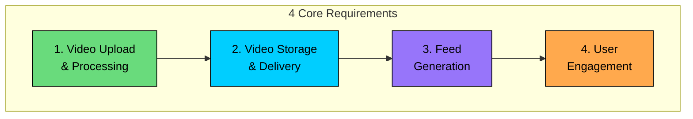
```mermaid
flowchart TB
    subgraph Requirements["4 Core Requirements"]
        R1[1. Video Upload<br/>& Processing]
        R2[2. Video Storage<br/>& Delivery]
        R3[3. Feed<br/>Generation]
        R4[4. User<br/>Engagement]
    end

    R1 --> R2
    R2 --> R3
    R3 --> R4

    style R1 fill:#69db7c,stroke:#000,color:#000
    style R2 fill:#00ceff,stroke:#000,color:#000
    style R3 fill:#9775fa,stroke:#000,color:#000
    style R4 fill:#ffa94d,stroke:#000,color:#000
```

**Note:** Instead of presenting the full architecture at once, we'll build it incrementally by addressing one requirement at a time. This approach is easier to follow and mirrors how you would explain the design in an interview.

## 4.1 Requirement 1: Video Upload & Processing

When a user uploads a video, we need to accept the file, store it durably, and process it into multiple formats suitable for different devices and network conditions.

### Components Needed

#### **API Gateway**

The entry point for all client requests. It handles authentication, rate limiting, and routes requests to appropriate services.

#### **Upload Service**

Manages the video upload workflow. For large files, we use **pre-signed URLs** to allow clients to upload directly to object storage, bypassing our servers.

**Responsibilities:**

- Generate pre-signed upload URLs
- Validate upload completion
- Trigger video processing pipeline
- Store video metadata

#### **Object Storage (Raw Videos)**

Stores the original uploaded video files. We use a distributed object storage system like **Amazon S3** or **Google Cloud Storage**.

#### **Message Queue**

Decouples the upload service from the processing pipeline. When a video upload completes, a message is published to trigger asynchronous processing.

#### **Video Processing Service**

A fleet of workers that process videos in parallel. Each video goes through multiple stages.

**Processing Steps:**

- **Validation:** Check file integrity, scan for prohibited content
- **Transcoding:** Convert to multiple resolutions (360p, 480p, 720p, 1080p)
- **Encoding:** Encode using efficient codecs (H.264, H.265/HEVC, VP9, AV1)
- **Chunking:** Split into small segments for adaptive streaming (HLS/DASH)
- **Thumbnail Generation:** Extract frames for preview thumbnails

#### **Object Storage (Processed Videos)**

Stores the transcoded video segments, thumbnails, and manifest files.

### Flow: Uploading a Video

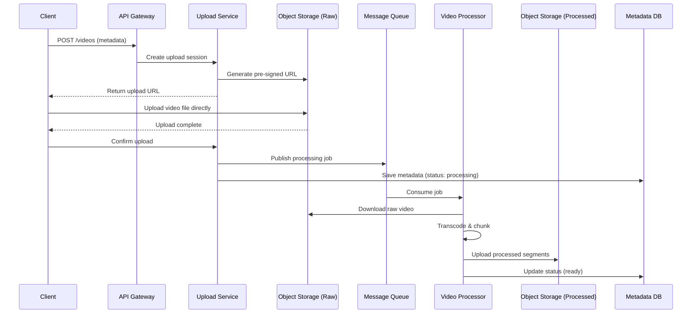
```mermaid
sequenceDiagram
    participant Client
    participant API as API Gateway
    participant Upload as Upload Service
    participant S3Raw as Object Storage (Raw)
    participant Queue as Message Queue
    participant Processor as Video Processor
    participant S3Proc as Object Storage (Processed)
    participant DB as Metadata DB

    Client->>API: POST /videos (metadata)
    API->>Upload: Create upload session
    Upload->>S3Raw: Generate pre-signed URL
    Upload-->>Client: Return upload URL
    Client->>S3Raw: Upload video file directly
    S3Raw-->>Client: Upload complete
    Client->>Upload: Confirm upload
    Upload->>Queue: Publish processing job
    Upload->>DB: Save metadata (status: processing)
    Queue->>Processor: Consume job
    Processor->>S3Raw: Download raw video
    Processor->>Processor: Transcode & chunk
    Processor->>S3Proc: Upload processed segments
    Processor->>DB: Update status (ready)
```

1. Client sends a `POST /videos` request with video metadata.
2. The **Upload Service** generates a pre-signed URL for direct upload to object storage.
3. Client uploads the video file directly to **Object Storage** (bypassing application servers).
4. Client confirms upload completion to the Upload Service.
5. Upload Service publishes a message to the **Message Queue** and saves initial metadata.
6. **Video Processing Service** consumes the message and processes the video:

- Downloads raw video from storage
- Transcodes to multiple resolutions
- Splits into HLS/DASH segments
- Generates thumbnails
- Uploads processed files to storage

1. Processing Service updates the video status to "ready" in the database.

### Upload Flow Diagram

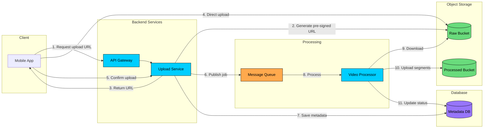
```mermaid
flowchart LR
    subgraph Client
        A[Mobile App]
    end

    subgraph Backend["Backend Services"]
        B[API Gateway]:::primary
        C[Upload Service]:::primary
    end

    subgraph Storage["Object Storage"]
        D[(Raw Bucket)]:::green
        E[(Processed Bucket)]:::green
    end

    subgraph Processing
        F[Message Queue]:::orange
        G[Video Processor]:::primary
    end

    subgraph Database
        H[(Metadata DB)]:::purple
    end

    A -->|1. Request upload URL| B
    B --> C
    C -->|2. Generate pre-signed URL| D
    C -->|3. Return URL| A
    A -->|4. Direct upload| D
    A -->|5. Confirm upload| C
    C -->|6. Publish job| F
    C -->|7. Save metadata| H
    F -->|8. Process| G
    G -->|9. Download| D
    G -->|10. Upload segments| E
    G -->|11. Update status| H

    classDef primary fill:#00ceff,stroke:#000,color:#000
    classDef green fill:#69db7c,stroke:#000,color:#000
    classDef orange fill:#ffa94d,stroke:#000,color:#000
    classDef purple fill:#9775fa,stroke:#000,color:#000
```

---

## 4.2 Requirement 2: Video Storage & Delivery

Once videos are processed, we need to deliver them to users globally with minimal latency and buffering.

### Additional Components Needed

#### **CDN (Content Delivery Network)**

A globally distributed network of edge servers that cache and serve video content close to users. This is the most critical component for video delivery.

**Responsibilities:**

- Cache popular videos at edge locations
- Reduce load on origin servers
- Minimize latency for video playback
- Handle adaptive bitrate streaming

#### **Video Streaming Service**

Serves video manifest files and handles playback requests that miss the CDN cache.

### Flow: Watching a Video

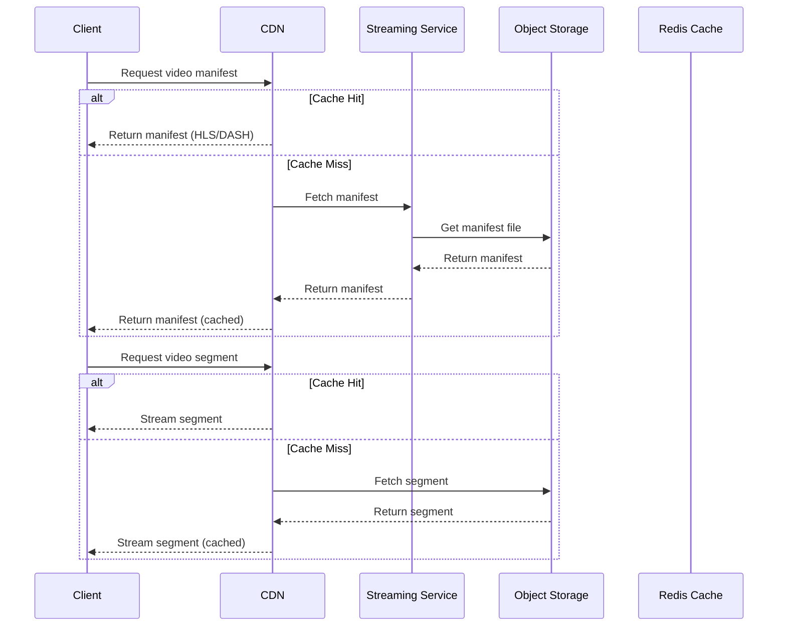
```mermaid
sequenceDiagram
    participant Client
    participant CDN
    participant Stream as Streaming Service
    participant S3 as Object Storage
    participant Cache as Redis Cache

    Client->>CDN: Request video manifest
    alt Cache Hit
        CDN-->>Client: Return manifest (HLS/DASH)
    else Cache Miss
        CDN->>Stream: Fetch manifest
        Stream->>S3: Get manifest file
        S3-->>Stream: Return manifest
        Stream-->>CDN: Return manifest
        CDN-->>Client: Return manifest (cached)
    end
    Client->>CDN: Request video segment
    alt Cache Hit
        CDN-->>Client: Stream segment
    else Cache Miss
        CDN->>S3: Fetch segment
        S3-->>CDN: Return segment
        CDN-->>Client: Stream segment (cached)
    end
```

1. Client requests the video manifest file (contains URLs for all segments and quality levels).
2. **CDN** checks its cache:

- **Cache hit:** Returns manifest immediately (~10-50ms latency)
- **Cache miss:** Fetches from origin, caches, and returns

1. Client parses manifest and requests video segments based on network conditions.
2. **CDN** serves segments from cache or fetches from origin storage.
3. Client uses **adaptive bitrate streaming** to switch quality levels based on bandwidth.

### Video Delivery Architecture

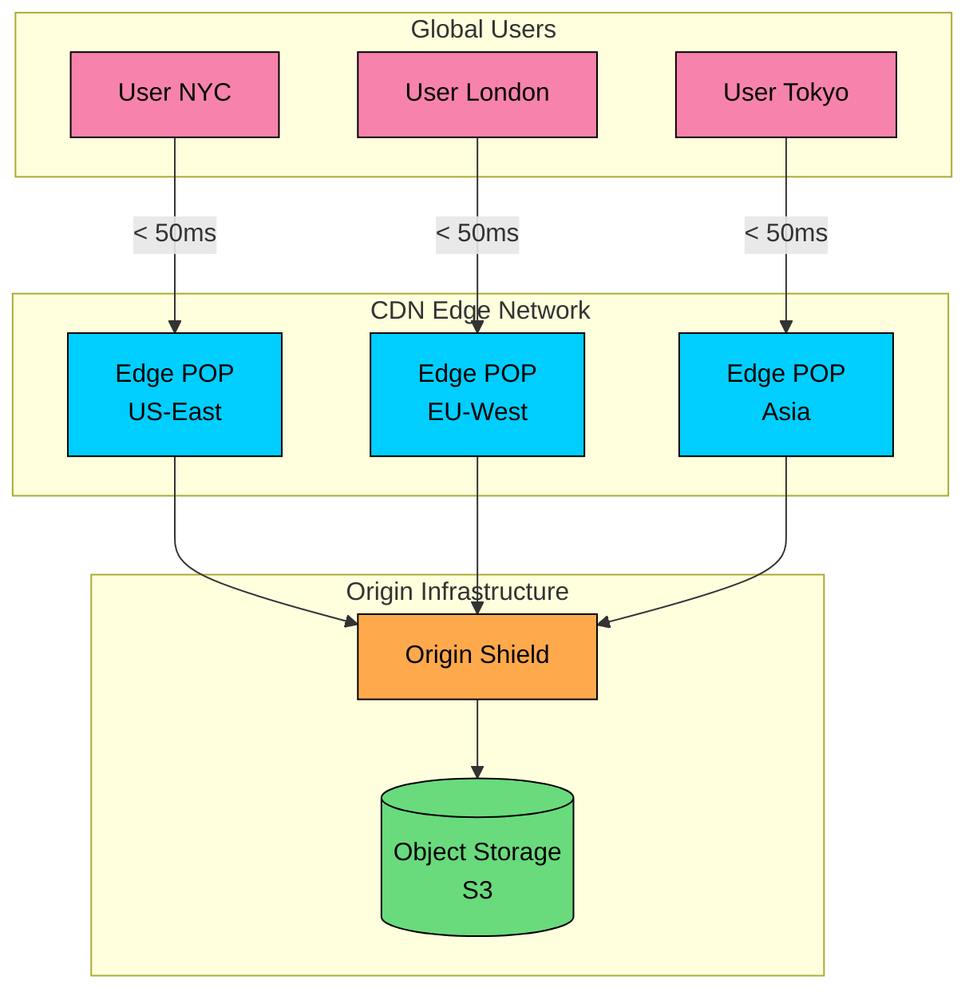
```mermaid
flowchart TB
    subgraph Users["Global Users"]
        U1[User NYC]:::rose
        U2[User London]:::rose
        U3[User Tokyo]:::rose
    end

    subgraph CDN["CDN Edge Network"]
        E1[Edge POP<br/>US-East]:::primary
        E2[Edge POP<br/>EU-West]:::primary
        E3[Edge POP<br/>Asia]:::primary
    end

    subgraph Origin["Origin Infrastructure"]
        OS[Origin Shield]:::orange
        S3[(Object Storage<br/>S3)]:::green
    end

    U1 -->|< 50ms| E1
    U2 -->|< 50ms| E2
    U3 -->|< 50ms| E3

    E1 --> OS
    E2 --> OS
    E3 --> OS
    OS --> S3

    classDef primary fill:#00ceff,stroke:#000,color:#000
    classDef orange fill:#ffa94d,stroke:#000,color:#000
    classDef green fill:#69db7c,stroke:#000,color:#000
    classDef rose fill:#f783ac,stroke:#000,color:#000
```

---

## 4.3 Requirement 3: Feed Generation

The "For You" feed is the heart of TikTok/Reels. It must surface engaging content personalized to each user's interests.

### Additional Components Needed

#### **Feed Service**

Orchestrates feed generation by combining recommendations with real-time data.

**Responsibilities:**

- Request recommendations from ML service
- Fetch video metadata
- Apply business rules and filters
- Handle pagination

#### **Recommendation Service**

An ML-powered service that generates personalized video recommendations.

**Responsibilities:**

- Analyze user behavior (watch time, likes, shares, follows)
- Compute user interest embeddings
- Match users with relevant videos
- Rank candidates by predicted engagement

#### **User Activity Service**

Tracks and stores user engagement signals that feed into recommendations.

**Responsibilities:**

- Record video views, watch duration, likes, shares
- Maintain user interaction history
- Provide real-time signals to recommendation service

#### **Redis Cache**

Caches pre-computed recommendations and frequently accessed data.

### Flow: Loading the "For You" Feed

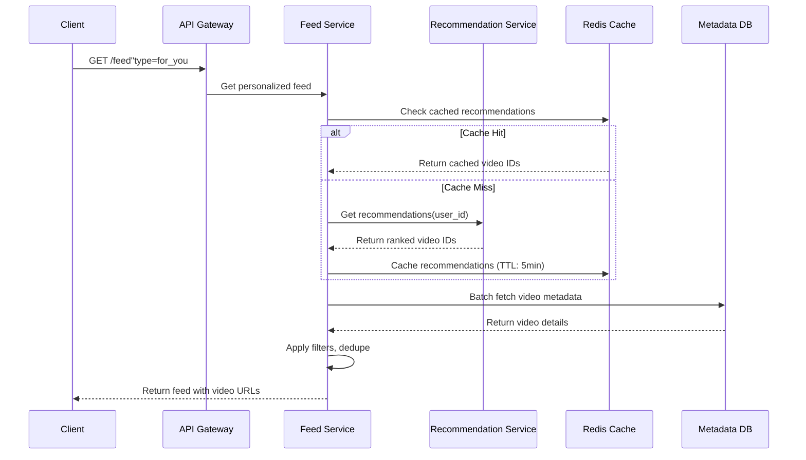
```mermaid
sequenceDiagram
    participant Client
    participant API as API Gateway
    participant Feed as Feed Service
    participant Rec as Recommendation Service
    participant Cache as Redis Cache
    participant DB as Metadata DB

    Client->>API: GET /feed"type=for_you
    API->>Feed: Get personalized feed
    Feed->>Cache: Check cached recommendations
    alt Cache Hit
        Cache-->>Feed: Return cached video IDs
    else Cache Miss
        Feed->>Rec: Get recommendations(user_id)
        Rec-->>Feed: Return ranked video IDs
        Feed->>Cache: Cache recommendations (TTL: 5min)
    end
    Feed->>DB: Batch fetch video metadata
    DB-->>Feed: Return video details
    Feed->>Feed: Apply filters, dedupe
    Feed-->>Client: Return feed with video URLs
```

1. Client requests the "For You" feed.
2. **Feed Service** checks Redis cache for pre-computed recommendations.
3. On cache miss, Feed Service calls the **Recommendation Service**.
4. Recommendation Service:

- Retrieves user's interest profile
- Generates candidate videos from multiple sources
- Ranks candidates using ML models
- Returns ranked video IDs

1. Feed Service fetches video metadata from the database.
2. Feed Service applies final filters (already seen, blocked creators) and returns the feed.

### Feed Generation Pipeline

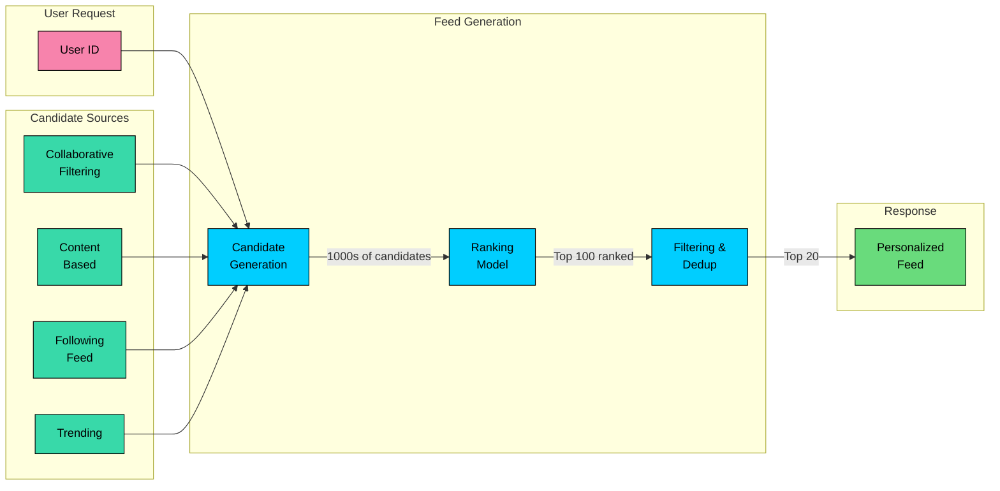
```mermaid
flowchart LR
    subgraph Input["User Request"]
        A[User ID]:::rose
    end

    subgraph Generation["Feed Generation"]
        B[Candidate<br/>Generation]:::primary
        C[Ranking<br/>Model]:::primary
        D[Filtering &<br/>Dedup]:::primary
    end

    subgraph Sources["Candidate Sources"]
        S1[Collaborative<br/>Filtering]:::secondary
        S2[Content<br/>Based]:::secondary
        S3[Following<br/>Feed]:::secondary
        S4[Trending]:::secondary
    end

    subgraph Output["Response"]
        E[Personalized<br/>Feed]:::green
    end

    A --> B
    S1 --> B
    S2 --> B
    S3 --> B
    S4 --> B
    B -->|1000s of candidates| C
    C -->|Top 100 ranked| D
    D -->|Top 20| E

    classDef primary fill:#00ceff,stroke:#000,color:#000
    classDef secondary fill:#38d9a9,stroke:#000,color:#000
    classDef green fill:#69db7c,stroke:#000,color:#000
    classDef rose fill:#f783ac,stroke:#000,color:#000
```

---

## 4.4 Requirement 4: Engagement (Likes, Comments, Views)

Users interact with videos through likes, comments, and shares. These interactions must be handled at massive scale while keeping counts reasonably up-to-date.

### Additional Components Needed

#### **Engagement Service**

Handles all user interactions with videos.

**Responsibilities:**

- Process likes/unlikes
- Store comments
- Track shares
- Update engagement counts

#### **Counter Service**

Manages high-throughput counters for views and likes.

**Responsibilities:**

- Aggregate counts efficiently
- Handle concurrent updates
- Provide eventually consistent reads

### Flow: Liking a Video

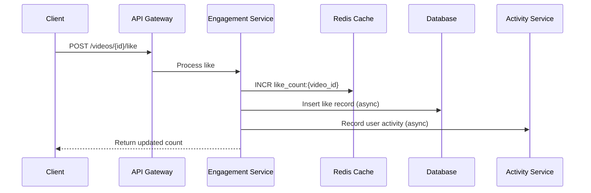
```mermaid
sequenceDiagram
    participant Client
    participant API as API Gateway
    participant Engage as Engagement Service
    participant Cache as Redis Cache
    participant DB as Database
    participant Activity as Activity Service

    Client->>API: POST /videos/{id}/like
    API->>Engage: Process like
    Engage->>Cache: INCR like_count:{video_id}
    Engage->>DB: Insert like record (async)
    Engage->>Activity: Record user activity (async)
    Engage-->>Client: Return updated count
```

1. Client sends a like request.
2. **Engagement Service** increments the like counter in Redis (fast, atomic).
3. Asynchronously writes the like record to the database (durable storage).
4. Asynchronously notifies the **Activity Service** (feeds into recommendations).
5. Returns the updated like count to the client.

### Engagement Data Flow

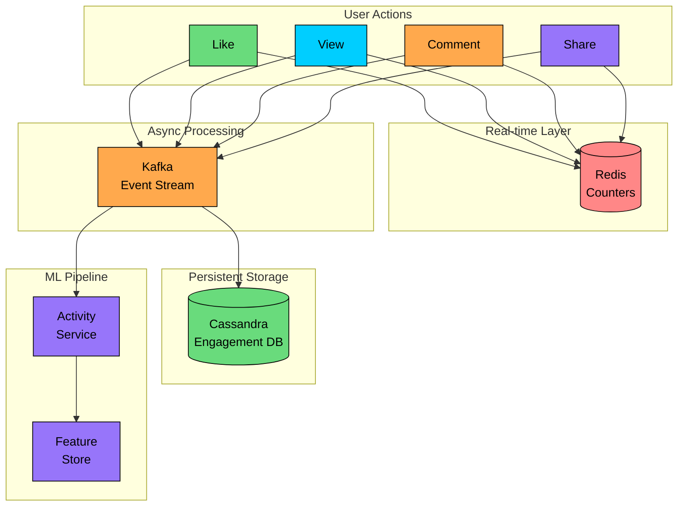
```mermaid
flowchart TB
    subgraph User["User Actions"]
        L[Like]:::green
        V[View]:::primary
        C[Comment]:::orange
        S[Share]:::purple
    end

    subgraph Realtime["Real-time Layer"]
        Redis[(Redis<br/>Counters)]:::red
    end

    subgraph Async["Async Processing"]
        Kafka[Kafka<br/>Event Stream]:::orange
    end

    subgraph Persistent["Persistent Storage"]
        Cassandra[(Cassandra<br/>Engagement DB)]:::green
    end

    subgraph ML["ML Pipeline"]
        Activity[Activity<br/>Service]:::purple
        Feature[Feature<br/>Store]:::purple
    end

    L --> Redis
    V --> Redis
    C --> Redis
    S --> Redis

    L --> Kafka
    V --> Kafka
    C --> Kafka
    S --> Kafka

    Kafka --> Cassandra
    Kafka --> Activity
    Activity --> Feature

    classDef primary fill:#00ceff,stroke:#000,color:#000
    classDef green fill:#69db7c,stroke:#000,color:#000
    classDef orange fill:#ffa94d,stroke:#000,color:#000
    classDef purple fill:#9775fa,stroke:#000,color:#000
    classDef red fill:#ff8787,stroke:#000,color:#000
```

---

## 4.5 Putting It All Together

After covering all requirements individually, here is the complete architecture:

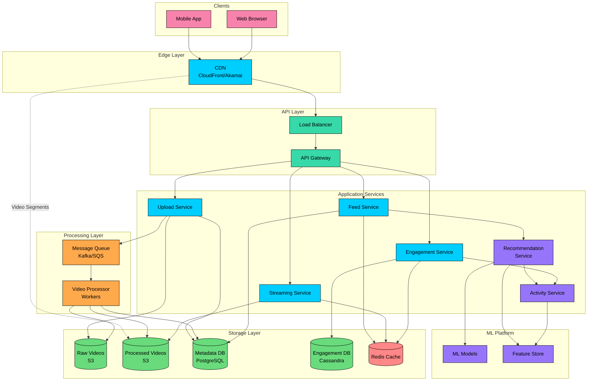
```mermaid
flowchart TB
    subgraph Clients
        Mobile[Mobile App]:::rose
        Web[Web Browser]:::rose
    end

    subgraph Edge["Edge Layer"]
        CDN[CDN<br/>CloudFront/Akamai]:::primary
    end

    subgraph Gateway["API Layer"]
        LB[Load Balancer]:::secondary
        API[API Gateway]:::secondary
    end

    subgraph Services["Application Services"]
        Upload[Upload Service]:::primary
        Feed[Feed Service]:::primary
        Stream[Streaming Service]:::primary
        Engage[Engagement Service]:::primary
        Rec[Recommendation<br/>Service]:::purple
        Activity[Activity Service]:::purple
    end

    subgraph Processing["Processing Layer"]
        Queue[Message Queue<br/>Kafka/SQS]:::orange
        Processor[Video Processor<br/>Workers]:::orange
    end

    subgraph Storage["Storage Layer"]
        S3Raw[(Raw Videos<br/>S3)]:::green
        S3Proc[(Processed Videos<br/>S3)]:::green
        MetaDB[(Metadata DB<br/>PostgreSQL)]:::green
        EngageDB[(Engagement DB<br/>Cassandra)]:::green
        Redis[(Redis Cache)]:::red
    end

    subgraph ML["ML Platform"]
        MLModel[ML Models]:::purple
        Feature[Feature Store]:::purple
    end

    Mobile --> CDN
    Web --> CDN
    CDN --> LB
    CDN -.->|Video Segments| S3Proc
    LB --> API
    API --> Upload
    API --> Feed
    API --> Stream
    API --> Engage

    Upload --> S3Raw
    Upload --> Queue
    Upload --> MetaDB
    Queue --> Processor
    Processor --> S3Raw
    Processor --> S3Proc
    Processor --> MetaDB

    Feed --> Rec
    Feed --> Redis
    Feed --> MetaDB
    Rec --> MLModel
    Rec --> Feature
    Rec --> Activity

    Stream --> S3Proc
    Stream --> Redis

    Engage --> Redis
    Engage --> EngageDB
    Engage --> Activity

    Activity --> Feature

    classDef primary fill:#00ceff,stroke:#000,color:#000
    classDef secondary fill:#38d9a9,stroke:#000,color:#000
    classDef purple fill:#9775fa,stroke:#000,color:#000
    classDef orange fill:#ffa94d,stroke:#000,color:#000
    classDef green fill:#69db7c,stroke:#000,color:#000
    classDef red fill:#ff8787,stroke:#000,color:#000
    classDef rose fill:#f783ac,stroke:#000,color:#000
```

### Core Components Summary

| Component | Purpose |
|-----------|---------|
| CDN | Cache and deliver video content globally with low latency |
| API Gateway | Route requests, handle auth, rate limiting |
| Upload Service | Manage video uploads and trigger processing |
| Video Processor | Transcode videos to multiple formats and resolutions |
| Feed Service | Generate personalized video feeds |
| Recommendation Service | ML-powered video recommendations |
| Streaming Service | Serve video manifests and segments |
| Engagement Service | Handle likes, comments, shares, views |
| Activity Service | Track user behavior for recommendations |
| Object Storage | Store raw and processed video files |
| Metadata DB | Store video and user metadata |
| Engagement DB | Store likes, comments, view history |
| Redis Cache | Cache recommendations, counters, hot data |

---

# 5. Database Design

## 5.1 SQL vs NoSQL

Our system has different data access patterns that benefit from different database types:

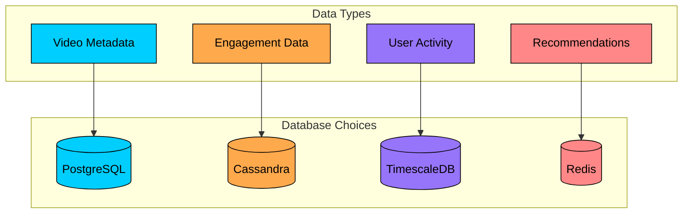
```mermaid
flowchart TB
    subgraph Data["Data Types"]
        D1[Video Metadata]:::primary
        D2[Engagement Data]:::orange
        D3[User Activity]:::purple
        D4[Recommendations]:::red
    end

    subgraph Databases["Database Choices"]
        DB1[(PostgreSQL)]:::primary
        DB2[(Cassandra)]:::orange
        DB3[(TimescaleDB)]:::purple
        DB4[(Redis)]:::red
    end

    D1 --> DB1
    D2 --> DB2
    D3 --> DB3
    D4 --> DB4

    classDef primary fill:#00ceff,stroke:#000,color:#000
    classDef orange fill:#ffa94d,stroke:#000,color:#000
    classDef purple fill:#9775fa,stroke:#000,color:#000
    classDef red fill:#ff8787,stroke:#000,color:#000
```

**Video Metadata:**

- Relatively small dataset (millions of records)
- Complex queries (search by hashtag, filter by date)
- Strong consistency needed for video status
- **Choice: PostgreSQL** (SQL database)

**Engagement Data (Likes, Views, Comments):**

- Massive scale (billions of records)
- Simple access patterns (key-value lookups)
- Write-heavy with eventual consistency acceptable
- **Choice: Cassandra** (NoSQL, wide-column store)

**User Activity/Events:**

- Time-series data
- Append-only writes
- Range queries by time
- **Choice: Cassandra or TimescaleDB**

**Recommendations/Features:**

- Key-value access
- Low latency required
- Frequently updated
- **Choice: Redis** (in-memory cache)

## 5.2 Database Schema

#### **1. Videos Table (PostgreSQL)**

Stores video metadata and processing status.

| Field | Type | Description |
|-------|------|-------------|
| `video_id` | UUID (PK) | Unique identifier for the video |
| `user_id` | UUID (FK) | Creator's user ID |
| `caption` | TEXT | Video description |
| `hashtags` | TEXT[] | Array of hashtags |
| `music_id` | UUID | Reference to music track |
| `duration_ms` | INTEGER | Video duration in milliseconds |
| `status` | ENUM | 'uploading', 'processing', 'ready', 'failed' |
| `privacy` | ENUM | 'public', 'private', 'friends' |
| `created_at` | TIMESTAMP | Upload timestamp |
| `processed_at` | TIMESTAMP | When processing completed |

**Indexes:**

- `idx_videos_user_id` on `user_id` (creator's videos)
- `idx_videos_created_at` on `created_at` (recent videos)
- `idx_videos_hashtags` using GIN on `hashtags` (hashtag search)

#### **2. Users Table (PostgreSQL)**

Stores user profile information.

| Field | Type | Description |
|-------|------|-------------|
| `user_id` | UUID (PK) | Unique identifier for the user |
| `username` | VARCHAR(50) | Unique username |
| `display_name` | VARCHAR(100) | Display name |
| `bio` | TEXT | User bio |
| `profile_pic_url` | TEXT | Profile picture URL |
| `follower_count` | INTEGER | Number of followers |
| `following_count` | INTEGER | Number of following |
| `created_at` | TIMESTAMP | Account creation time |

#### **3. Follows Table (PostgreSQL)**

Stores follower relationships.

| Field | Type | Description |
|-------|------|-------------|
| `follower_id` | UUID (PK) | User who follows |
| `followee_id` | UUID (PK) | User being followed |
| `created_at` | TIMESTAMP | When follow occurred |

**Composite Primary Key:** (`follower_id`, `followee_id`)

#### **4. Video Stats Table (Cassandra)**

Stores engagement counters. Uses Cassandra for high write throughput.

| Field | Type | Description |
|-------|------|-------------|
| `video_id` | UUID (PK) | Video identifier |
| `view_count` | COUNTER | Total views |
| `like_count` | COUNTER | Total likes |
| `comment_count` | COUNTER | Total comments |
| `share_count` | COUNTER | Total shares |

#### **5. Likes Table (Cassandra)**

Stores individual like records for deduplication and "unlike" functionality.

| Field | Type | Description |
|-------|------|-------------|
| `video_id` | UUID (PK) | Video identifier |
| `user_id` | UUID (CK) | User who liked |
| `created_at` | TIMESTAMP | When like occurred |

**Partition Key:** `video_id` **Clustering Key:** `user_id`

#### **6. Comments Table (Cassandra)**

Stores video comments.

| Field | Type | Description |
|-------|------|-------------|
| `video_id` | UUID (PK) | Video identifier |
| `comment_id` | TIMEUUID (CK) | Time-based comment ID |
| `user_id` | UUID | Commenter's user ID |
| `content` | TEXT | Comment text |
| `parent_id` | UUID | Parent comment ID for replies |
| `created_at` | TIMESTAMP | Comment timestamp |

**Partition Key:** `video_id` **Clustering Key:** `comment_id` (sorted by time)

---

# 6. Design Deep Dive

Now that we have the high-level architecture and database schema in place, let's dive deeper into some critical design choices.

## 6.1 Video Processing Pipeline

The video processing pipeline is one of the most complex and resource-intensive components. It must convert user-uploaded videos into formats optimized for streaming across different devices and network conditions.

### Why Video Processing is Necessary

Raw uploaded videos are typically:

- **Large:** Uncompressed or minimally compressed
- **Single format:** May not play on all devices
- **Single resolution:** Poor experience on different screen sizes
- **Not streaming-optimized:** Cannot support adaptive bitrate

Processing transforms videos into multiple optimized versions.

### Processing Pipeline Architecture

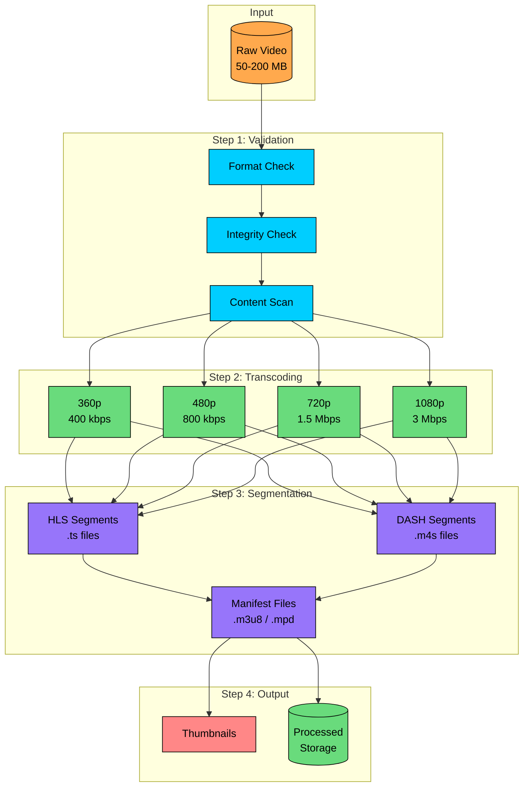
```mermaid
flowchart TB
    subgraph Input["Input"]
        Raw[(Raw Video<br/>50-200 MB)]:::orange
    end

    subgraph Validation["Step 1: Validation"]
        V1[Format Check]:::primary
        V2[Integrity Check]:::primary
        V3[Content Scan]:::primary
    end

    subgraph Transcode["Step 2: Transcoding"]
        T1[360p<br/>400 kbps]:::green
        T2[480p<br/>800 kbps]:::green
        T3[720p<br/>1.5 Mbps]:::green
        T4[1080p<br/>3 Mbps]:::green
    end

    subgraph Segment["Step 3: Segmentation"]
        S1[HLS Segments<br/>.ts files]:::purple
        S2[DASH Segments<br/>.m4s files]:::purple
        S3[Manifest Files<br/>.m3u8 / .mpd]:::purple
    end

    subgraph Output["Step 4: Output"]
        Thumb[Thumbnails]:::red
        Store[(Processed<br/>Storage)]:::green
    end

    Raw --> V1 --> V2 --> V3
    V3 --> T1 & T2 & T3 & T4
    T1 & T2 & T3 & T4 --> S1 & S2
    S1 & S2 --> S3
    S3 --> Thumb
    S3 --> Store

    classDef primary fill:#00ceff,stroke:#000,color:#000
    classDef green fill:#69db7c,stroke:#000,color:#000
    classDef orange fill:#ffa94d,stroke:#000,color:#000
    classDef purple fill:#9775fa,stroke:#000,color:#000
    classDef red fill:#ff8787,stroke:#000,color:#000
```

### Processing Steps

#### **1. Validation**

Before processing, validate the uploaded file:

- Check file integrity (not corrupted)
- Verify it's a valid video format
- Scan for prohibited content (integration with content moderation)
- Verify duration is within limits

#### **2. Transcoding**

Convert the video to multiple resolutions and bitrates:

| Resolution | Bitrate | Use Case |
|------------|---------|----------|
| 360p | 400 kbps | Slow mobile networks |
| 480p | 800 kbps | Standard mobile |
| 720p | 1.5 Mbps | HD mobile/tablet |
| 1080p | 3 Mbps | Full HD |

**Codec Selection:**

- **H.264:** Universal compatibility, moderate compression
- **H.265/HEVC:** 50% better compression, good mobile support
- **VP9:** Open standard, good compression, web-friendly
- **AV1:** Best compression, growing support (future-proofing)

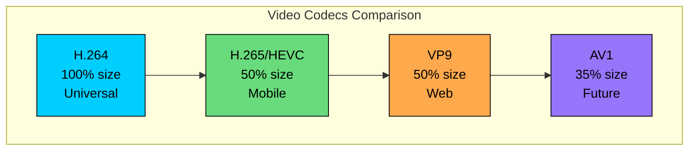
```mermaid
flowchart TD
    subgraph Codecs["Video Codecs Comparison"]
        H264[H.264<br/>100% size<br/>Universal]:::primary
        H265[H.265/HEVC<br/>50% size<br/>Mobile]:::green
        VP9[VP9<br/>50% size<br/>Web]:::orange
        AV1[AV1<br/>35% size<br/>Future]:::purple
    end

    H264 --> H265 --> VP9 --> AV1

    classDef primary fill:#00ceff,stroke:#000,color:#000
    classDef green fill:#69db7c,stroke:#000,color:#000
    classDef orange fill:#ffa94d,stroke:#000,color:#000
    classDef purple fill:#9775fa,stroke:#000,color:#000
```

#### **3. Segmentation**

Split each resolution variant into small chunks (2-10 seconds each) for adaptive streaming:

**HLS (HTTP Live Streaming):**

- Apple's protocol, universal mobile support
- `.m3u8` manifest files, `.ts` segments

**DASH (Dynamic Adaptive Streaming over HTTP):**

- Open standard
- `.mpd` manifest files, `.m4s` segments

#### **4. Thumbnail Generation**

Extract multiple frames for:

- Preview thumbnails (shown before playback)
- Video scrubbing thumbnails
- Cover image for feed display

### Scalable Processing Architecture

Video processing is CPU-intensive and time-consuming. We need a scalable architecture:

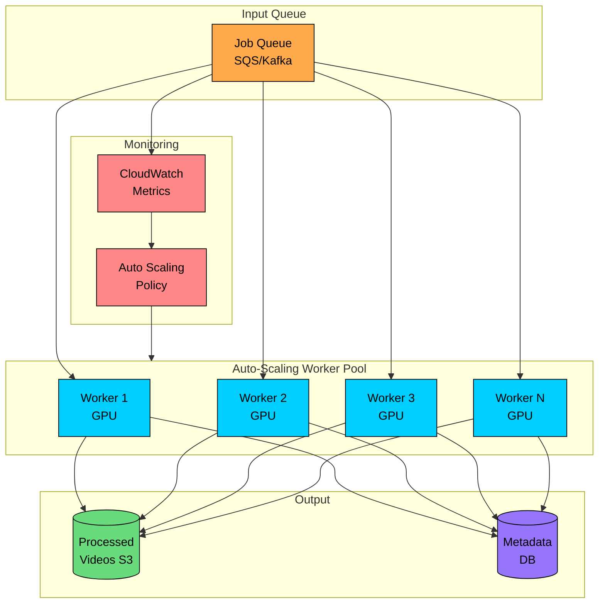
```mermaid
flowchart TB
    subgraph Input["Input Queue"]
        SQS[Job Queue<br/>SQS/Kafka]:::orange
    end

    subgraph Workers["Auto-Scaling Worker Pool"]
        direction LR
        W1[Worker 1<br/>GPU]:::primary
        W2[Worker 2<br/>GPU]:::primary
        W3[Worker 3<br/>GPU]:::primary
        W4[Worker N<br/>GPU]:::primary
    end

    subgraph Output["Output"]
        S3[(Processed<br/>Videos S3)]:::green
        DB[(Metadata<br/>DB)]:::purple
    end

    subgraph Monitor["Monitoring"]
        CW[CloudWatch<br/>Metrics]:::red
        AS[Auto Scaling<br/>Policy]:::red
    end

    SQS --> W1 & W2 & W3 & W4
    W1 & W2 & W3 & W4 --> S3
    W1 & W2 & W3 & W4 --> DB
    SQS --> CW --> AS
    AS --> Workers

    classDef primary fill:#00ceff,stroke:#000,color:#000
    classDef green fill:#69db7c,stroke:#000,color:#000
    classDef orange fill:#ffa94d,stroke:#000,color:#000
    classDef purple fill:#9775fa,stroke:#000,color:#000
    classDef red fill:#ff8787,stroke:#000,color:#000
```

**Key Design Decisions:**

1. **Message Queue for Job Distribution:** Use SQS or Kafka to distribute processing jobs. Workers pull jobs when ready, enabling auto-scaling.

1. **Stateless Workers:** Each worker is stateless and processes one video at a time. Can scale horizontally based on queue depth.

1. **Spot/Preemptible Instances:** Video processing is latency-tolerant (users can wait a few minutes). Use cheaper spot instances to reduce costs by 60-80%.

1. **Parallel Resolution Processing:** Process different resolutions in parallel to reduce total processing time.

### Processing Time Optimization

| Technique | Benefit |
|-----------|---------|
| Parallel transcoding | Process multiple resolutions simultaneously |
| Hardware acceleration | Use GPU encoding (NVENC, QuickSync) |
| Two-pass encoding | Better quality with minimal size increase |
| Early frame publishing | Start showing video before all resolutions ready |

---

## 6.2 Video Delivery and CDN Strategy

With 25 billion video views per day and 250 PB of daily bandwidth, efficient video delivery is critical. The CDN strategy can make or break the user experience.

### CDN Architecture

A multi-tier CDN architecture provides the best balance of cost and performance:

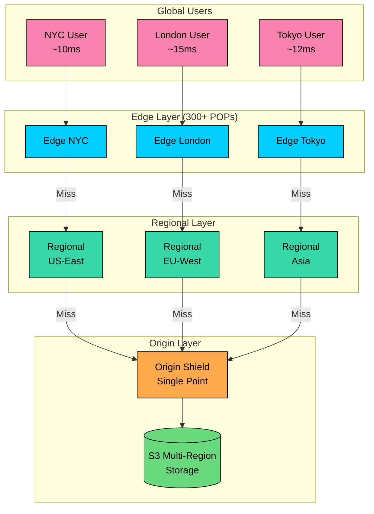
```mermaid
flowchart TB
    subgraph Users["Global Users"]
        U1[NYC User<br/>~10ms]:::rose
        U2[London User<br/>~15ms]:::rose
        U3[Tokyo User<br/>~12ms]:::rose
    end

    subgraph Edge["Edge Layer (300+ POPs)"]
        E1[Edge NYC]:::primary
        E2[Edge London]:::primary
        E3[Edge Tokyo]:::primary
    end

    subgraph Regional["Regional Layer"]
        R1[Regional<br/>US-East]:::secondary
        R2[Regional<br/>EU-West]:::secondary
        R3[Regional<br/>Asia]:::secondary
    end

    subgraph Origin["Origin Layer"]
        OS[Origin Shield<br/>Single Point]:::orange
        S3[(S3 Multi-Region<br/>Storage)]:::green
    end

    U1 --> E1
    U2 --> E2
    U3 --> E3

    E1 -->|Miss| R1
    E2 -->|Miss| R2
    E3 -->|Miss| R3

    R1 -->|Miss| OS
    R2 -->|Miss| OS
    R3 -->|Miss| OS

    OS --> S3

    classDef primary fill:#00ceff,stroke:#000,color:#000
    classDef secondary fill:#38d9a9,stroke:#000,color:#000
    classDef orange fill:#ffa94d,stroke:#000,color:#000
    classDef green fill:#69db7c,stroke:#000,color:#000
    classDef rose fill:#f783ac,stroke:#000,color:#000
```

**Three-Tier Caching:**

1. **Edge POPs:** Closest to users, highest cache hit rate for popular content
2. **Regional Caches:** Aggregate traffic from multiple edge POPs, reduce origin load
3. **Origin Shield:** Single point of contact with S3, prevents cache stampedes

### Cache Hit Rate Optimization

The goal is to achieve **95%+ cache hit rate** at the edge layer.

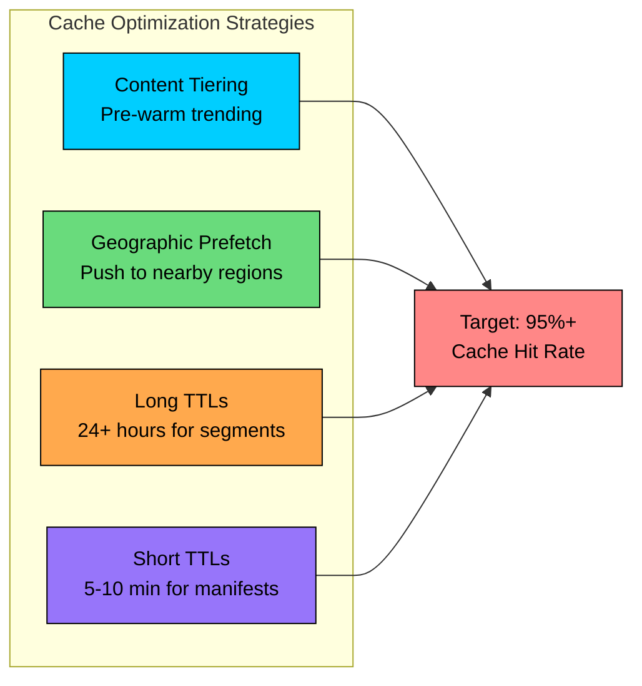
```mermaid
flowchart LR
    subgraph Strategy["Cache Optimization Strategies"]
        S1[Content Tiering<br/>Pre-warm trending]:::primary
        S2[Geographic Prefetch<br/>Push to nearby regions]:::green
        S3[Long TTLs<br/>24+ hours for segments]:::orange
        S4[Short TTLs<br/>5-10 min for manifests]:::purple
    end

    Target[Target: 95%+<br/>Cache Hit Rate]:::red

    S1 --> Target
    S2 --> Target
    S3 --> Target
    S4 --> Target

    classDef primary fill:#00ceff,stroke:#000,color:#000
    classDef green fill:#69db7c,stroke:#000,color:#000
    classDef orange fill:#ffa94d,stroke:#000,color:#000
    classDef purple fill:#9775fa,stroke:#000,color:#000
    classDef red fill:#ff8787,stroke:#000,color:#000
```

| Strategy | Description |
|----------|-------------|
| **Content Popularity Tiering** | Pre-warm caches with trending videos |
| **Geographic Prefetching** | When a video trends in one region, proactively push to nearby regions |
| **Long TTLs for Segments** | Video segments are immutable, cache for 24+ hours |
| **Short TTLs for Manifests** | Manifests may update (ad insertion), cache for 5-10 minutes |

### Adaptive Bitrate Streaming

Clients dynamically switch between quality levels based on network conditions:

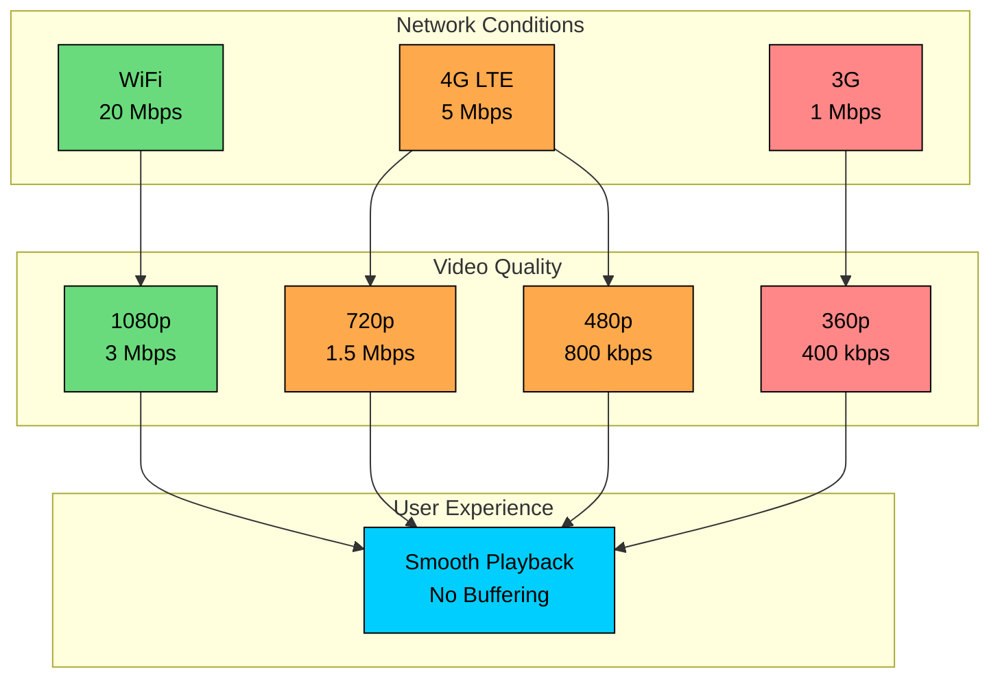
```mermaid
flowchart TB
    subgraph Network["Network Conditions"]
        WiFi[WiFi<br/>20 Mbps]:::green
        LTE[4G LTE<br/>5 Mbps]:::orange
        G3[3G<br/>1 Mbps]:::red
    end

    subgraph Quality["Video Quality"]
        Q1080[1080p<br/>3 Mbps]:::green
        Q720[720p<br/>1.5 Mbps]:::orange
        Q480[480p<br/>800 kbps]:::orange
        Q360[360p<br/>400 kbps]:::red
    end

    subgraph Experience["User Experience"]
        Smooth[Smooth Playback<br/>No Buffering]:::primary
    end

    WiFi --> Q1080
    LTE --> Q720
    LTE --> Q480
    G3 --> Q360

    Q1080 & Q720 & Q480 & Q360 --> Smooth

    classDef primary fill:#00ceff,stroke:#000,color:#000
    classDef green fill:#69db7c,stroke:#000,color:#000
    classDef orange fill:#ffa94d,stroke:#000,color:#000
    classDef red fill:#ff8787,stroke:#000,color:#000
```

**ABR Algorithm Considerations:**

- **Buffer-based:** Switch based on buffer level
- **Throughput-based:** Switch based on measured bandwidth
- **Hybrid:** Combine both signals for smoother switching

### Cost Optimization

CDN bandwidth is expensive at scale. Strategies to reduce costs:

1. **Efficient Codecs:** AV1 and H.265 reduce bandwidth by 30-50% vs H.264
2. **Regional Storage:** Store popular regional content in regional S3 buckets
3. **P2P Delivery:** For live events, use WebRTC-based P2P to offload CDN
4. **Compression:** Use Brotli/gzip for manifest files

---

## 6.3 Recommendation System

The recommendation system is the secret sauce that keeps users engaged. It must balance relevance, diversity, and freshness while handling massive scale.

### Recommendation Pipeline Overview

```mermaid
flowchart TB
    subgraph Offline["Offline Pipeline (Daily)"]
        direction LR
        Train[Model<br/>Training]:::purple
        Embed[Video<br/>Embeddings]:::purple
        Index[ANN Index<br/>Building]:::purple
    end

    subgraph Nearline["Near-realtime (Minutes)"]
        direction LR
        Activity[Activity<br/>Processing]:::orange
        Feature[Feature<br/>Updates]:::orange
    end

    subgraph Online["Online Pipeline (Milliseconds)"]
        direction LR
        Candidate[Candidate<br/>Generation]:::primary
        Rank[Ranking<br/>Model]:::primary
        Filter[Filtering &<br/>Reranking]:::primary
    end

    subgraph Output["Output"]
        Feed[Personalized<br/>Feed]:::green
    end

    Train --> Embed --> Index
    Activity --> Feature
    Index --> Candidate
    Feature --> Candidate
    Candidate -->|1000s| Rank -->|100s| Filter -->|20| Feed

    classDef primary fill:#00ceff,stroke:#000,color:#000
    classDef purple fill:#9775fa,stroke:#000,color:#000
    classDef orange fill:#ffa94d,stroke:#000,color:#000
    classDef green fill:#69db7c,stroke:#000,color:#000
```

### Stage 1: Candidate Generation

Generate a pool of thousands of candidate videos from multiple sources:

```mermaid
flowchart TB
    subgraph Sources["Candidate Sources"]
        CF[Collaborative<br/>Filtering]:::primary
        CB[Content<br/>Based]:::green
        FF[Following<br/>Feed]:::orange
        TR[Trending<br/>Videos]:::purple
        EX[Exploration<br/>Random]:::red
    end

    subgraph Pool["Candidate Pool"]
        Merge[Merge & Dedupe<br/>~5000 candidates]:::secondary
    end

    CF --> Merge
    CB --> Merge
    FF --> Merge
    TR --> Merge
    EX --> Merge

    classDef primary fill:#00ceff,stroke:#000,color:#000
    classDef secondary fill:#38d9a9,stroke:#000,color:#000
    classDef green fill:#69db7c,stroke:#000,color:#000
    classDef orange fill:#ffa94d,stroke:#000,color:#000
    classDef purple fill:#9775fa,stroke:#000,color:#000
    classDef red fill:#ff8787,stroke:#000,color:#000
```

| Source | Description | Example |
|--------|-------------|---------|
| **Collaborative Filtering** | Users with similar behavior liked these | "Users who watched X also watched Y" |
| **Content-based** | Similar videos based on features | Same hashtags, music, creator |
| **Following Feed** | Videos from followed creators | Chronological from subscriptions |
| **Trending** | Currently popular videos | High engagement velocity |
| **Exploration** | Random/diverse videos | Prevent filter bubbles |

### Two-Tower Model for Candidate Retrieval

```mermaid
flowchart TB
    subgraph UserTower["User Tower"]
        UF[User Features<br/>History, Demographics]:::primary
        UN[Neural Network<br/>Deep Learning]:::primary
        UE[User Embedding<br/>128-dim vector]:::primary
    end

    subgraph VideoTower["Video Tower"]
        VF[Video Features<br/>Content, Metadata]:::green
        VN[Neural Network<br/>Deep Learning]:::green
        VE[Video Embedding<br/>128-dim vector]:::green
    end

    subgraph Matching["Similarity Matching"]
        DOT[Dot Product<br/>Similarity Score]:::orange
        ANN[ANN Search<br/>Top-K Videos]:::orange
    end

    UF --> UN --> UE
    VF --> VN --> VE
    UE --> DOT
    VE --> DOT
    DOT --> ANN

    classDef primary fill:#00ceff,stroke:#000,color:#000
    classDef green fill:#69db7c,stroke:#000,color:#000
    classDef orange fill:#ffa94d,stroke:#000,color:#000
```

- Pre-compute video embeddings offline
- Compute user embedding online
- Use approximate nearest neighbor (ANN) search for fast retrieval

### Stage 2: Ranking

Rank the candidate videos using a more sophisticated model:

```mermaid
flowchart LR
    subgraph Features["Ranking Features"]
        direction TB
        F1[User Features<br/>Age, Location, History]:::primary
        F2[Video Features<br/>Duration, Creator Stats]:::green
        F3[Context Features<br/>Time, Device, Session]:::orange
        F4[Cross Features<br/>User-Video Interactions]:::purple
    end

    subgraph Model["Ranking Model"]
        NN[Deep Neural Network<br/>Wide & Deep]:::red
    end

    subgraph Output["Prediction"]
        Score[Engagement Score]:::secondary
    end

    F1 --> NN
    F2 --> NN
    F3 --> NN
    F4 --> NN
    NN --> Score

    classDef primary fill:#00ceff,stroke:#000,color:#000
    classDef green fill:#69db7c,stroke:#000,color:#000
    classDef orange fill:#ffa94d,stroke:#000,color:#000
    classDef purple fill:#9775fa,stroke:#000,color:#000
    classDef red fill:#ff8787,stroke:#000,color:#000
    classDef secondary fill:#38d9a9,stroke:#000,color:#000
```

**Ranking Features:**

| Category | Features |
|----------|----------|
| **User** | Age, location, device, watch history, engagement history |
| **Video** | Duration, upload time, creator stats, content category |
| **Context** | Time of day, day of week, session depth |
| **User-Video** | Creator follow status, hashtag overlap, historical interaction |

**Prediction Target:** Predict probability of positive engagement (watch completion, like, share).

### Stage 3: Filtering and Reranking

Apply business rules and final adjustments:

```mermaid
flowchart LR
    subgraph Input["Ranked Candidates"]
        R[Top 100<br/>Ranked Videos]:::primary
    end

    subgraph Filters["Filters"]
        F1[Deduplication<br/>Already Seen]:::orange
        F2[Diversity<br/>Mix Creators]:::orange
        F3[Freshness<br/>Boost New]:::orange
        F4[Safety<br/>Policy Check]:::orange
        F5[Fairness<br/>Creator Balance]:::orange
    end

    subgraph Output["Final Feed"]
        O[Top 20<br/>Videos]:::green
    end

    R --> F1 --> F2 --> F3 --> F4 --> F5 --> O

    classDef primary fill:#00ceff,stroke:#000,color:#000
    classDef orange fill:#ffa94d,stroke:#000,color:#000
    classDef green fill:#69db7c,stroke:#000,color:#000
```

- **Deduplication:** Remove videos user has already seen
- **Diversity:** Ensure variety in creators, content types
- **Freshness:** Boost newer content
- **Safety:** Remove policy-violating content
- **Creator Fairness:** Don't over-concentrate on few creators

### Cold Start Problem

New users have no history. Solutions:

```mermaid
flowchart TB
    subgraph Problem["Cold Start: New User"]
        New[No Watch History<br/>No Preferences]:::red
    end

    subgraph Solutions["Cold Start Solutions"]
        S1[Onboarding Flow<br/>Select Interests]:::primary
        S2[Popular Content<br/>Show Trending]:::green
        S3[Rapid Learning<br/>Adapt Quickly]:::orange
        S4[Demographics<br/>Age, Location]:::purple
    end

    subgraph Result["Personalized Feed"]
        Feed[Growing<br/>Personalization]:::secondary
    end

    New --> S1 & S2 & S3 & S4
    S1 & S2 & S3 & S4 --> Feed

    classDef primary fill:#00ceff,stroke:#000,color:#000
    classDef green fill:#69db7c,stroke:#000,color:#000
    classDef orange fill:#ffa94d,stroke:#000,color:#000
    classDef purple fill:#9775fa,stroke:#000,color:#000
    classDef red fill:#ff8787,stroke:#000,color:#000
    classDef secondary fill:#38d9a9,stroke:#000,color:#000
```

1. **Onboarding Flow:** Ask users to select interests
2. **Popular Content:** Show trending/universal content initially
3. **Rapid Learning:** Quickly adapt based on first few interactions
4. **Demographic Signals:** Use age, location, device for initial guesses

### Handling Scale

At 500M DAU requesting feeds multiple times per day:

- **Pre-compute and Cache:** Generate recommendations in batches, cache in Redis
- **Incremental Updates:** Update cached recommendations as user engages
- **Tiered Models:** Use lightweight model for initial candidates, heavy model for top-K ranking
- **Feature Store:** Centralized, low-latency feature serving (Redis, Feast)

---

## 6.4 Handling High-Throughput Engagement

Likes, views, and comments generate massive write traffic. With 25 billion views per day, even simple counters require careful design.

### The Challenge

```mermaid
flowchart LR
    subgraph Problem["The Scale Problem"]
        Views[25B Views/Day<br/>290K QPS avg]:::red
        Naive[Naive: 1 DB write<br/>per view]:::red
        Crash[Database<br/>Meltdown]:::red
    end

    Views --> Naive --> Crash

    classDef red fill:#ff8787,stroke:#000,color:#000
```

Naive approach (direct database increment per view):

- 290K QPS average, 870K QPS peak
- Each increment = one database write
- Database becomes bottleneck immediately

### Solution Architecture

```mermaid
flowchart TB
    subgraph Events["View/Like Events"]
        E1[View Event]:::rose
        E2[Like Event]:::rose
    end

    subgraph Realtime["Real-time Layer (Redis)"]
        R1[INCR view_count]:::red
        R2[INCR like_count]:::red
    end

    subgraph Stream["Event Stream (Kafka)"]
        K1[View Topic]:::orange
        K2[Like Topic]:::orange
    end

    subgraph Aggregation["Aggregation Layer"]
        Agg[Batch Aggregator<br/>1-minute windows]:::purple
    end

    subgraph Persistent["Persistent Storage"]
        DB[(Cassandra<br/>Final Counts)]:::green
    end

    E1 --> R1
    E2 --> R2
    E1 --> K1
    E2 --> K2
    K1 & K2 --> Agg
    Agg --> DB
    R1 & R2 -.->|Read Path| DB

    classDef rose fill:#f783ac,stroke:#000,color:#000
    classDef red fill:#ff8787,stroke:#000,color:#000
    classDef orange fill:#ffa94d,stroke:#000,color:#000
    classDef purple fill:#9775fa,stroke:#000,color:#000
    classDef green fill:#69db7c,stroke:#000,color:#000
```

### Approach Comparison

```mermaid
flowchart TB
    subgraph A1["Approach 1: Direct Increment"]
        D1[Simple]:::green
        D2[Real-time]:::green
        D3[DB Bottleneck]:::red
    end

    subgraph A2["Approach 2: Redis + Flush"]
        R1[Fast Writes]:::green
        R2[Batched DB]:::green
        R3[Lag Risk]:::orange
    end

    subgraph A3["Approach 3: Counter Service"]
        C1[Durable]:::green
        C2[Scalable]:::green
        C3[Complex]:::orange
    end

    Recommend[Recommended:<br/>Approach 3]:::primary

    A3 --> Recommend

    classDef primary fill:#00ceff,stroke:#000,color:#000
    classDef green fill:#69db7c,stroke:#000,color:#000
    classDef orange fill:#ffa94d,stroke:#000,color:#000
    classDef red fill:#ff8787,stroke:#000,color:#000
```

### Approach 1: In-Memory Aggregation with Periodic Flush

Aggregate counts in Redis, periodically flush to database:

**Pros:**

- Reduces database writes by 1000x+
- Redis handles high throughput easily
- Low latency for view recording

**Cons:**

- Counts lag by up to 60 seconds
- Risk of data loss if Redis fails before flush

### Approach 2: Counter Service with Write-Behind Cache

Dedicated counter service with durable write-behind:

```mermaid
flowchart LR
    Client[View Event]:::rose
    Counter[Counter Service]:::primary
    Redis[(Redis)]:::red
    Kafka[Kafka]:::orange
    Consumer[DB Writer]:::primary
    DB[(Database)]:::green

    Client --> Counter
    Counter --> Redis
    Counter --> Kafka
    Kafka --> Consumer
    Consumer --> DB

    classDef rose fill:#f783ac,stroke:#000,color:#000
    classDef primary fill:#00ceff,stroke:#000,color:#000
    classDef red fill:#ff8787,stroke:#000,color:#000
    classDef orange fill:#ffa94d,stroke:#000,color:#000
    classDef green fill:#69db7c,stroke:#000,color:#000
```

1. Counter service receives view event
2. Increments in Redis (immediate, for reads)
3. Publishes event to Kafka (durable)
4. Consumer aggregates events and batch-updates database

**Pros:**

- Durable (Kafka persists events)
- Real-time reads from Redis
- Eventual consistency to database
- Can replay Kafka if consumer fails

### Approach 3: Cassandra Counters

Use Cassandra's native counter columns:

Cassandra counters handle high write throughput natively.

**Pros:**

- Simple implementation
- Built-in distributed counters
- Good write throughput

**Cons:**

- Counter columns have limitations (no delete, can't be part of primary key)
- May over-count on retries

### Recommendation

Use **Approach 2 (Counter Service)** for maximum control and durability:

| Metric | Approach |
|--------|----------|
| **Views** | Counter service with Kafka (handle duplicates) |
| **Likes** | Write to Cassandra directly (need individual records for unlike) |
| **Comments** | Write to Cassandra directly (need full records) |

### View Deduplication

The same user might trigger multiple view events for one video (replays, app restarts). To avoid inflating counts:

```mermaid
flowchart LR
    subgraph Methods["Deduplication Methods"]
        M1[Session-based<br/>1 view/session]:::primary
        M2[Time-window<br/>1 view/hour]:::green
        M3[Bloom Filter<br/>Probabilistic]:::orange
    end

    Result[Accurate<br/>View Counts]:::purple

    M1 --> Result
    M2 --> Result
    M3 --> Result

    classDef primary fill:#00ceff,stroke:#000,color:#000
    classDef green fill:#69db7c,stroke:#000,color:#000
    classDef orange fill:#ffa94d,stroke:#000,color:#000
    classDef purple fill:#9775fa,stroke:#000,color:#000
```

1. **Session-based Deduplication:** Only count one view per user per video per session
2. **Time-window Deduplication:** Count at most one view per user per video per hour
3. **Bloom Filter:** Use probabilistic structure to track recent (user, video) pairs

---

## 6.5 Scaling the System

As the platform grows, different components will hit bottlenecks at different scales. Here's how to address them:

### Database Sharding Strategy

```mermaid
flowchart TB
    subgraph Videos["Video Metadata"]
        VS[Shard by video_id<br/>Consistent Hashing]:::primary
        V1[(Shard 1)]:::green
        V2[(Shard 2)]:::green
        V3[(Shard N)]:::green
    end

    subgraph Engagement["Engagement Data"]
        ES[Partition by video_id<br/>Cassandra Native]:::orange
        E1[(Node 1)]:::orange
        E2[(Node 2)]:::orange
        E3[(Node N)]:::orange
    end

    subgraph Users["User Data"]
        US[Shard by user_id]:::purple
        U1[(Shard 1)]:::purple
        U2[(Shard 2)]:::purple
        U3[(Shard N)]:::purple
    end

    VS --> V1 & V2 & V3
    ES --> E1 & E2 & E3
    US --> U1 & U2 & U3

    classDef primary fill:#00ceff,stroke:#000,color:#000
    classDef green fill:#69db7c,stroke:#000,color:#000
    classDef orange fill:#ffa94d,stroke:#000,color:#000
    classDef purple fill:#9775fa,stroke:#000,color:#000
```

**Video Metadata (PostgreSQL):**

- Shard by `video_id` using consistent hashing
- Each shard handles a subset of videos
- Use Vitess or Citus for managed sharding

**Engagement Data (Cassandra):**

- Partition by `video_id`
- Cassandra handles this natively with consistent hashing
- Add nodes to scale horizontally

**User Data:**

- Shard by `user_id`
- Followers/following require cross-shard queries, consider graph database (Neo4j) for social graph

### Service Scaling

| Service | Scaling Strategy |
|---------|-----------------|
| API Gateway | Horizontal scaling behind load balancer |
| Upload Service | Horizontal, stateless |
| Video Processor | Auto-scale based on queue depth |
| Feed Service | Horizontal, cache recommendations |
| Recommendation | Scale ML serving infrastructure (TensorFlow Serving, Triton) |
| CDN | Add POPs in high-traffic regions |

### Handling Traffic Spikes

Major events (viral videos, celebrity posts) can cause 10-100x traffic spikes:

```mermaid
flowchart TB
    subgraph Spike["Traffic Spike"]
        V[Viral Video<br/>10-100x Normal]:::red
    end

    subgraph Defenses["Defense Strategies"]
        D1[Auto-Scaling<br/>Based on Metrics]:::primary
        D2[Circuit Breakers<br/>Prevent Cascade]:::green
        D3[Rate Limiting<br/>Protect Backend]:::orange
        D4[Graceful Degradation<br/>Serve Stale Data]:::purple
        D5[CDN Prefetch<br/>Push to Edge]:::secondary
    end

    subgraph Result["Result"]
        R[System Stays Up<br/>Degraded but Available]:::green
    end

    V --> D1 & D2 & D3 & D4 & D5
    D1 & D2 & D3 & D4 & D5 --> R

    classDef primary fill:#00ceff,stroke:#000,color:#000
    classDef secondary fill:#38d9a9,stroke:#000,color:#000
    classDef green fill:#69db7c,stroke:#000,color:#000
    classDef orange fill:#ffa94d,stroke:#000,color:#000
    classDef purple fill:#9775fa,stroke:#000,color:#000
    classDef red fill:#ff8787,stroke:#000,color:#000
```

1. **Auto-scaling:** Scale services based on request rate and latency
2. **Circuit Breakers:** Prevent cascade failures
3. **Rate Limiting:** Protect backend services
4. **Graceful Degradation:** Serve cached/stale data under extreme load
5. **CDN Prefetching:** Push trending content to CDN proactively

### Multi-Region Deployment

For global reach and disaster recovery:

```mermaid
flowchart TB
    DNS[Global DNS<br/>Route 53]:::primary

    subgraph US["US Region (Primary)"]
        US_LB[Load Balancer]:::secondary
        US_SVC[Services]:::secondary
        US_DB[(Primary DB)]:::green
    end

    subgraph EU["EU Region"]
        EU_LB[Load Balancer]:::secondary
        EU_SVC[Services]:::secondary
        EU_DB[(Replica DB)]:::orange
    end

    subgraph Asia["Asia Region"]
        Asia_LB[Load Balancer]:::secondary
        Asia_SVC[Services]:::secondary
        Asia_DB[(Replica DB)]:::orange
    end

    DNS --> US_LB
    DNS --> EU_LB
    DNS --> Asia_LB

    US_LB --> US_SVC --> US_DB
    EU_LB --> EU_SVC --> EU_DB
    Asia_LB --> Asia_SVC --> Asia_DB

    US_DB <-->|Async Replication| EU_DB
    US_DB <-->|Async Replication| Asia_DB

    classDef primary fill:#00ceff,stroke:#000,color:#000
    classDef secondary fill:#38d9a9,stroke:#000,color:#000
    classDef green fill:#69db7c,stroke:#000,color:#000
    classDef orange fill:#ffa94d,stroke:#000,color:#000
```

- **DNS-based routing:** Route users to nearest region
- **Active-passive:** One primary region for writes, others for reads
- **Active-active:** All regions accept writes (requires conflict resolution)
- **Data replication:** Async replication with eventual consistency

---

## References

- [Designing Data-Intensive Applications](https://dataintensive.net/) by Martin Kleppmann - Comprehensive guide to distributed systems
- [TikTok System Architecture](https://www.infoq.com/presentations/tiktok-architecture/) - InfoQ presentation on TikTok's architecture
- [YouTube Architecture](https://www.youtube.com/watch"v=w5WVu624fY8) - Google's approach to video delivery at scale
- [Netflix Video Processing Pipeline](https://netflixtechblog.com/high-quality-video-encoding-at-scale-d159db052746) - Netflix's video encoding architecture
- [Instagram's Explore Recommendation System](https://ai.meta.com/blog/powered-by-ai-instagrams-explore-recommender-system/) - Meta's approach to recommendations
- [Cassandra at Instagram](https://instagram-engineering.com/open-sourcing-a-10x-reduction-in-apache-cassandra-tail-latency-d64f86b43589) - Scaling Cassandra for social features
