> 💡 **Key Insight:**

> **QUESTION**
>
> #### What is Google Drive"
>
> Google Drive is a cloud-based file storage and synchronization service that allows users to store files, sync them across multiple devices, and share them with others.
>
> The core functionality includes uploading files to the cloud, downloading them from anywhere, keeping files in sync across devices, and collaborating with others through sharing.
>
> 
> <!-- Simulation: google-drive -->
> 

>
> Users expect their files to be available reliably, synced quickly, and accessible from any device.
>
> **Popular Examples:** Google Drive, Dropbox, Microsoft OneDrive, iCloud Drive, Box

What makes this problem fascinating from a system design perspective is the combination of challenges it presents:

- We need to handle files ranging from tiny text documents to multi-gigabyte videos.
- We need to keep files synchronized across devices in near real-time, even when some devices go offline.
- We need to ensure that files are never lost, even when hardware fails.
- And we need to do all of this at scale, for hundreds of millions of users with petabytes of data.

This system design problem touches on so many fundamental concepts: chunked uploads for large files, content-addressable storage for deduplication, real-time synchronization protocols, and conflict resolution strategies. Despite appearing straightforward to users, there are meaningful trade-offs to discuss at every layer of the design.

In this article, we will explore the **high-level design of a cloud file storage system like Google Drive**.

Let's start by clarifying the requirements:

---

# 1. Clarifying Requirements

Before starting the design, it's important to ask thoughtful questions to uncover hidden assumptions, clarify ambiguities, and define the system's scope more precisely.

Here is an example of how a discussion between the candidate and the interviewer might unfold:

> 💡 **Key Insight:**

> **DISCUSSION**
>
> **Candidate:** "What is the expected scale" How many users and how much storage""
>
> **Interviewer:** "Let's design for 500 million users, with 100 million daily active users. Average storage per user is around 5 GB."
>
> **Candidate:** "What are the core features we need to support""
>
> **Interviewer:** "Focus on file upload, download, automatic sync across devices, file sharing, and revision history."
>
> **Candidate:** "What's the maximum file size we need to support""
>
> **Interviewer:** "Up to 10 GB per file. Most files are under 100 MB, but we need to handle large files gracefully."
>
> **Candidate:** "How important is real-time sync" What's acceptable sync latency""
>
> **Interviewer:** "Near real-time sync is important. Changes should propagate to other devices within a few seconds under normal conditions."
>
> **Candidate:** "Do we need to support offline access and editing""
>
> **Interviewer:** "Yes, users should be able to view and edit files offline, with changes syncing when connectivity is restored."
>
> **Candidate:** "What are the availability and durability requirements""
>
> **Interviewer:** "Very high. Files should never be lost (11 nines durability), and the system should be available 99.9% of the time."

This conversation reveals several important constraints that will influence our design. Let's formalize these into functional and non-functional requirements.

## 1.1 Functional Requirements

Based on our discussion, here are the core features our system must support:

- **Upload Files:** Users can upload files of any type, up to 10 GB in size.
- **Download Files:** Users can download their files from any device.
- **Auto Sync:** Files automatically sync across all user devices when changes occur.
- **File Sharing:** Users can share files or folders with others (view or edit permissions).
- **Revision History:** Users can view and restore previous versions of files.
- **Offline Support:** Users can access and edit files offline, with changes syncing later.

## 1.2 Non-Functional Requirements

Beyond features, we need to consider the qualities that make the system production-ready:

- **High Availability:** The system must be highly available (99.9% uptime).
- **Durability:** Files must never be lost (99.999999999% durability).
- **Low Latency Sync:** Changes should propagate to other devices within seconds.
- **Scalability:** Must handle 500 million users and petabytes of data.
- **Bandwidth Efficiency:** Minimize data transfer, especially for large files with small changes.

---

# 2. Back-of-the-Envelope Estimation

Before diving into the design, let's run some quick calculations to understand the scale we are dealing with. These numbers will guide our architectural decisions, particularly around storage, chunking strategies, and caching needs.

### 2.1 Users and Storage

Starting with the numbers from our requirements discussion:

- **Total users:** 500 million
- **Daily active users (DAU):** 100 million
- **Average storage per user:** 5 GB

This gives us a staggering total storage requirement:

To put that in perspective, 2.5 exabytes is roughly 2.5 million terabytes. This is serious scale that requires distributed object storage across multiple data centers.

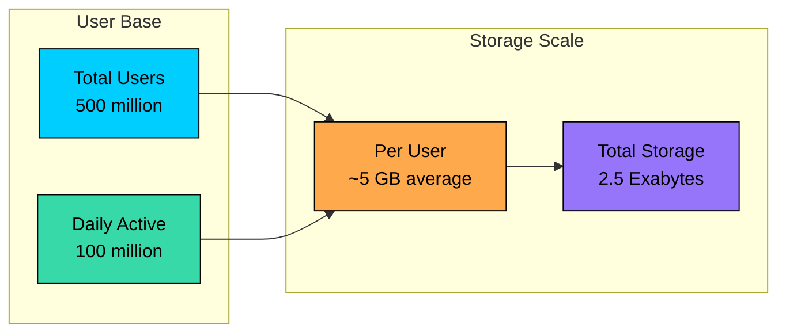

### 2.2 Traffic Estimates

Let's think about how users interact with the system:

#### **File Operations**

We will assume each daily active user performs about 5 file operations per day. This includes uploads, downloads, and sync checks.

Traffic is rarely uniform throughout the day. During peak hours, especially during business hours when people are actively working on documents, we might see 3x the average load:

#### **Upload vs Download Distribution**

Cloud storage is typically read-heavy. Users upload a file once but might access it many times across multiple devices:

- **Uploads:** ~20% of operations (100 million/day)
- **Downloads:** ~60% of operations (300 million/day)
- **Metadata operations:** ~20% (listing folders, checking sync status)

## 2.3 Bandwidth Estimates

Bandwidth depends heavily on file sizes. While users can upload files up to 10 GB, most files are much smaller. Documents, images, and spreadsheets typically average around 500 KB.

#### **Upload Bandwidth:**

#### **Download Bandwidth:**

These numbers are significant. A modern data center can handle this, but we will need multiple edge locations and efficient caching to keep latency low for users around the world.

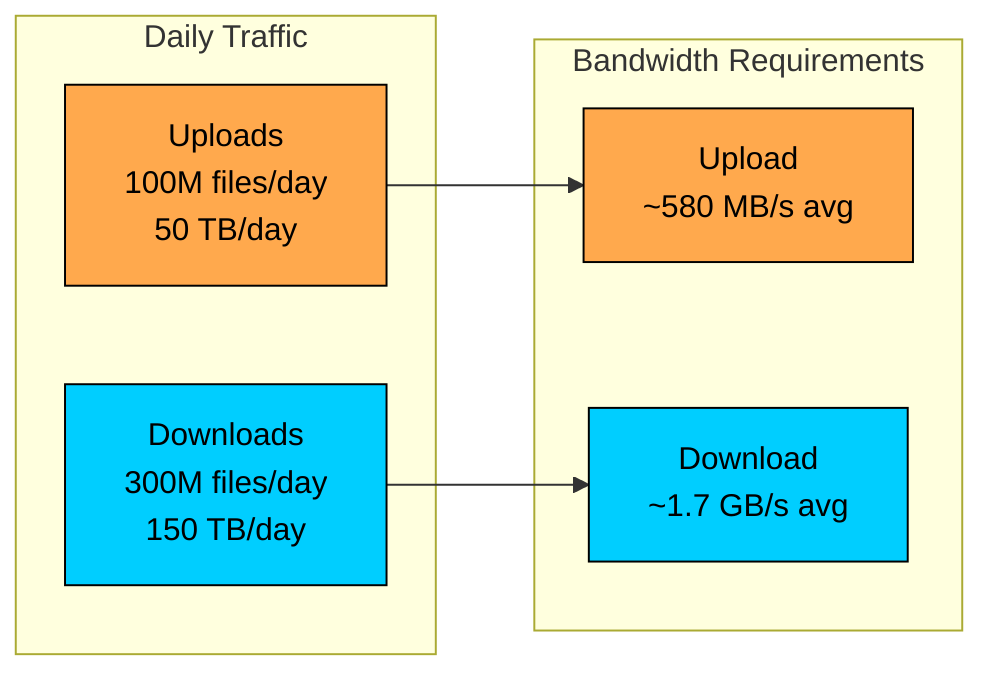

### 2.4 Metadata Storage

Each file requires metadata separate from the actual content:

| Field | Size | Notes |
|-------|------|-------|
| File ID | 16 bytes | UUID |
| File name | ~100 bytes | Variable length |
| User ID | 16 bytes | Owner reference |
| Parent folder ID | 16 bytes | Folder hierarchy |
| Checksums | ~64 bytes | SHA-256 for integrity |
| Timestamps | 16 bytes | Created, modified |
| Permissions | ~50 bytes | Sharing info |
| Block references | ~100 bytes | Pointers to content blocks |

Total per file: approximately **350 bytes**

With an estimated 50 billion files across all users:

17.5 TB for metadata is manageable for a well-provisioned database cluster, though we will need careful indexing and potentially sharding as we scale.

### 2.5 Key Insights

These estimates reveal several important design implications:

1. **Storage dominates:** 2.5 exabytes of content storage dwarfs the 17.5 TB of metadata. We need cheap, durable object storage for content and fast, indexed storage for metadata.
2. **Read-heavy workload:** With 3x more downloads than uploads, we should invest in caching and CDN distribution.
3. **Bandwidth efficiency matters:** At 580 MB/s of uploads, even small optimizations like delta sync can save significant bandwidth and improve user experience.
4. **Scale requires distribution:** No single server handles 17,000 QPS. We need horizontal scaling across multiple regions.

---

# 3. Core APIs

With our requirements and scale understood, let's define the API contract. A cloud storage API needs to handle file operations, synchronization, and sharing. Getting the details right matters for both usability and supporting large file uploads reliably.

We will design a RESTful API with four core operations: upload, download, sync, and share. Let's walk through each one.

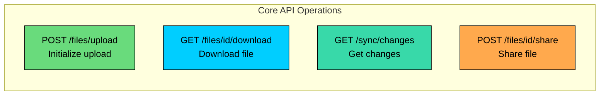

### 3.1 Upload File

#### **Endpoint:** `POST /files/upload`

This endpoint initiates a file upload. Rather than accepting the entire file in one request (which would fail for large files), it returns upload instructions that the client uses for chunked upload. This design supports resumable uploads, which is essential when users upload multi-gigabyte files over unreliable connections.

#### **Request Body:**

| Parameter | Type | Required | Description |
|-----------|------|----------|-------------|
| `file_name` | string | Yes | Name of the file to upload |
| `file_size` | integer | Yes | Size of the file in bytes |
| `parent_folder_id` | string | No | Folder to upload into. Defaults to root |
| `checksum` | string | Yes | SHA-256 hash of the complete file for integrity verification |

#### **Example Request:**

#### **Success Response (200 OK):**

The response tells the client how to proceed: use `upload_url` to upload chunks of `chunk_size` bytes. The `upload_id` identifies this upload session for resumption if needed.

#### **Error Responses:**

| Status Code | Meaning | When It Occurs |
|-------------|---------|----------------|
| `400 Bad Request` | Invalid input | File name empty, size negative, or missing checksum |
| `401 Unauthorized` | Not authenticated | User session expired or missing |
| `507 Insufficient Storage` | Quota exceeded | User does not have enough storage space |

### 3.2 Download File

#### **Endpoint:** `GET /files/{file_id}/download`

Returns a pre-signed URL to download the file. We use pre-signed URLs rather than streaming the file through our API servers because it lets clients download directly from object storage, reducing load on our servers and improving download speeds.

#### **Path Parameters:**

| Parameter | Type | Description |
|-----------|------|-------------|
| `file_id` | string | Unique identifier of the file |

#### **Query Parameters:**

| Parameter | Type | Required | Description |
|-----------|------|----------|-------------|
| `version` | integer | No | Specific version to download. Defaults to latest |

#### **Success Response (200 OK):**

The `download_url` is a time-limited pre-signed URL. Clients can download directly from this URL without additional authentication. The URL expires after `expires_in` seconds (typically 1 hour) for security.

#### **Error Responses:**

| Status Code | Meaning | When It Occurs |
|-------------|---------|----------------|
| `404 Not Found` | File does not exist | Invalid file_id or file was deleted |
| `403 Forbidden` | Access denied | User does not have permission to view this file |

### 3.3 Get Changes (Sync)

#### **Endpoint:** `GET /sync/changes`

This is the core endpoint for keeping devices in sync. Rather than having clients poll for every file individually, this endpoint returns all changes since the last sync point. Clients maintain a cursor that represents their sync position.

#### **Query Parameters:**

| Parameter | Type | Required | Description |
|-----------|------|----------|-------------|
| `cursor` | string | Yes | Opaque cursor from previous sync (empty for initial sync) |
| `limit` | integer | No | Maximum number of changes to return (default 100) |

#### **Success Response (200 OK):**

The `cursor` in the response becomes the starting point for the next sync request. If `has_more` is true, the client should immediately fetch the next batch of changes.

#### **Error Responses:**

| Status Code | Meaning | When It Occurs |
|-------------|---------|----------------|
| `400 Bad Request` | Invalid cursor | Cursor is corrupted or expired |
| `401 Unauthorized` | Not authenticated | User session expired |

### 3.4 Share File

#### **Endpoint:** `POST /files/{file_id}/share`

Allows users to share files or folders with others. Sharing creates an access grant that lets the recipient view or edit the content.

#### **Path Parameters:**

| Parameter | Type | Description |
|-----------|------|-------------|
| `file_id` | string | File or folder to share |

#### **Request Body:**

| Parameter | Type | Required | Description |
|-----------|------|----------|-------------|
| `email` | string | Yes | Email address of the recipient |
| `permission` | enum | Yes | Either "view" or "edit" |

#### **Example Request:**

#### **Success Response (200 OK):**

#### **Error Responses:**

| Status Code | Meaning | When It Occurs |
|-------------|---------|----------------|
| `404 Not Found` | File does not exist | Invalid file_id |
| `403 Forbidden` | Cannot share | User is not the owner or does not have share permission |
| `400 Bad Request` | Invalid input | Email format invalid or permission not recognized |

### 3.5 API Design Considerations

A few design decisions worth noting:

**Pre-signed URLs:** For both uploads and downloads, we use pre-signed URLs that clients use to communicate directly with object storage. This keeps our API servers lean, they handle metadata and orchestration while the heavy lifting of data transfer happens elsewhere.

**Cursor-based Sync:** The sync API uses opaque cursors rather than timestamps or version numbers. This gives us flexibility in how we implement sync on the backend. We could change from a sequential log to a different structure without breaking clients.

**Chunked Uploads:** Large files are uploaded in chunks, enabling resumable uploads. If a 5 GB upload fails at 4.9 GB, the user does not have to start over. This is not just a convenience feature; it is essential for reliability.

---

# 4. High-Level Design

Now we get to the interesting part: designing the system architecture. Rather than presenting a complex diagram upfront, we will build the design incrementally, starting with the most fundamental requirement and adding components as we encounter new challenges. This mirrors how you would approach the problem in an interview.

Our system needs to handle four core operations:

1. **File Storage:** Reliably store user files in the cloud with high durability.
2. **File Sync:** Keep files synchronized across multiple devices in near real-time.
3. **File Sharing:** Allow users to share files with others with appropriate permissions.
4. **Revision History:** Maintain previous versions of files for recovery.

These operations have different characteristics. File storage and sync are the bread and butter of the system, handling the bulk of traffic. Sharing is less frequent but critical for collaboration. Revision history operates mostly in the background.

Let's visualize the two primary paths through our system:

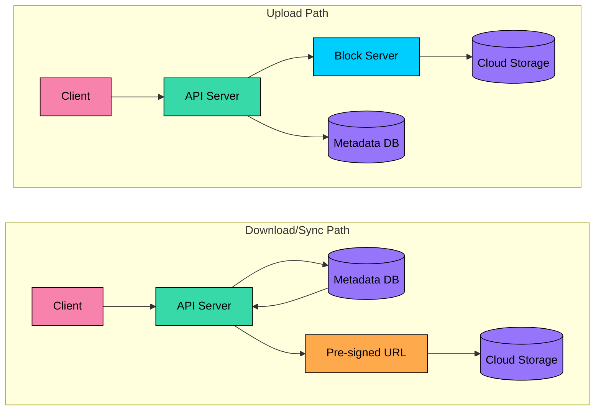

Notice how the upload path goes through a Block Server that handles the heavy lifting of data transfer, while the download path generates pre-signed URLs so clients can fetch directly from cloud storage. This separation keeps our API servers focused on orchestration and metadata management.

Let's build this architecture step by step, starting with the most fundamental requirement: file upload and download.

---

## 4.1 Requirement 1: File Upload and Download

When a user drags a file into their Google Drive folder or clicks "Upload" in the web interface, several things need to happen behind the scenes:

1. The file needs to be transmitted reliably, even for large files over unreliable networks
2. The content needs to be stored durably so it is never lost
3. Metadata needs to be recorded so we can find and retrieve the file later
4. The upload should be resumable if the connection drops

The key insight that drives our design is that files should be split into blocks. Rather than uploading a 1 GB video as a single request (which would fail entirely if the connection drops at 99%), we split it into 4 MB chunks. Each chunk can be uploaded, verified, and stored independently. This approach unlocks several benefits we will explore shortly.

### Components for File Operations

Let's introduce the components we need to make file upload and download work.

#### **Block Server**

The Block Server handles the heavy lifting of data transfer. Think of it as a specialized service for moving bytes.

When a file is uploaded, the client splits it into fixed-size blocks (typically 4 MB) and sends each block to the Block Server. The server computes a SHA-256 hash of each block, verifies integrity, and stores the block in cloud storage using the hash as the key. This content-addressable storage approach becomes important for deduplication later.

Why blocks instead of whole files"

- **Resumable uploads:** If a connection drops, only the current block needs to be retried, not the entire file.
- **Delta sync:** When a file is modified, only the changed blocks need to be uploaded, not the whole file.
- **Deduplication:** Identical blocks across different files are stored only once.

#### **Cloud Storage (Block Store)**

The actual file content lives in distributed object storage like Amazon S3 or Google Cloud Storage. This is where the blocks physically reside.

Why use dedicated object storage rather than storing blocks in a database"

- **Durability:** Services like S3 provide 11 nines of durability through sophisticated replication and erasure coding.
- **Scale:** Object storage is designed to handle exabytes of data across thousands of servers.
- **Cost:** Object storage costs pennies per gigabyte, far cheaper than database storage.
- **Bandwidth:** Direct download from object storage can saturate network connections without going through our application layer.

#### **Metadata Database**

Stores everything about a file except the actual content: file name, folder location, who owns it, who it is shared with, and the ordered list of block hashes that make up the file.

This separation of metadata and content is crucial. Metadata is small (a few hundred bytes per file) but frequently accessed. Users browse folders, search for files, and check sync status constantly. Content is large but accessed less frequently. Different access patterns call for different storage solutions.

### The Upload Flow in Action

Here is how all these components work together when a user uploads a file:

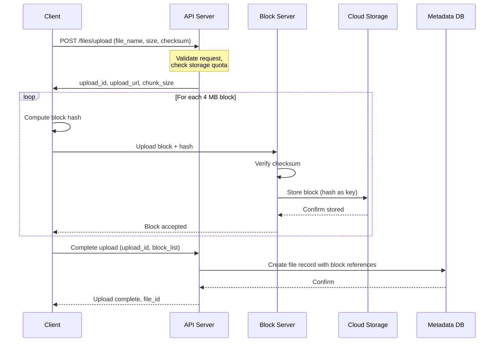

Let's walk through this step by step:

1. **Initiate upload:** The client sends file metadata to the API Server and receives upload instructions, including a unique upload_id for tracking and the recommended chunk size.
2. **Split and hash:** The client splits the file into 4 MB blocks and computes a SHA-256 hash for each block. This hash serves double duty: it verifies integrity during upload and becomes the storage key.
3. **Upload blocks:** The client uploads each block to the Block Server, potentially in parallel with a concurrency limit. The Block Server verifies the checksum matches and stores the block in cloud storage.
4. **Content-addressable storage:** Each block is stored using its hash as the key. If a block with that hash already exists (from this user or another), we can skip storing it, achieving automatic deduplication.
5. **Create file record:** Once all blocks are uploaded, the API Server creates a file record in the Metadata Database containing the ordered list of block hashes. This list is how we reconstruct the file later.
6. **Confirm to client:** The client receives the file_id and can now access the file from any device.

**Why store the block list after all blocks are uploaded"** If we created the metadata record immediately, a partially uploaded file would appear in the user's file list. By waiting until completion, the file appears atomically, fully formed and ready to use.

### The Download Flow in Action

Downloading is simpler than uploading because we leverage pre-signed URLs to offload data transfer from our servers.

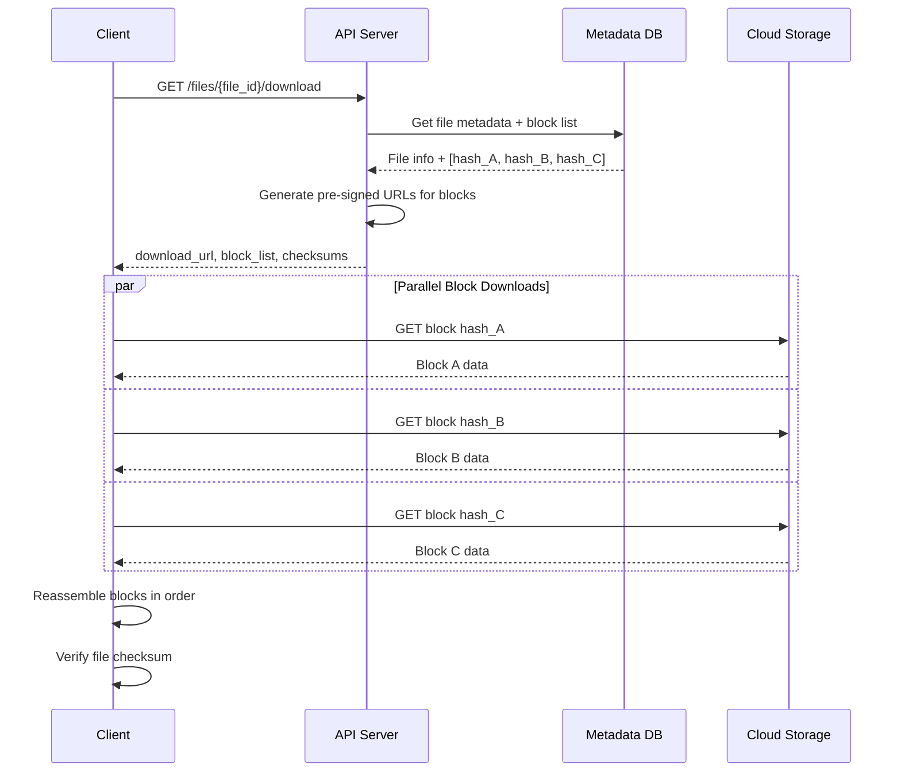

The flow works as follows:

1. **Request download:** The client asks the API Server for the file. The API Server looks up the file metadata and block list from the database.
2. **Generate pre-signed URLs:** For each block, the API Server generates a time-limited pre-signed URL. These URLs allow the client to download directly from cloud storage without additional authentication.
3. **Parallel downloads:** The client downloads blocks in parallel, significantly speeding up large file downloads. A 100 MB file split into 25 blocks can download from 25 connections simultaneously.
4. **Reassemble and verify:** The client reassembles blocks in order and verifies the complete file checksum matches the expected value. If verification fails, the download can be retried.

**Why pre-signed URLs instead of streaming through our servers"** Pre-signed URLs let clients download directly from cloud storage, which is geographically distributed and optimized for high throughput. Our API servers would be a bottleneck if all downloads had to flow through them.

---

## 4.2 Requirement 2: File Synchronization

Now for the feature that makes cloud storage feel magical: automatic sync. You edit a document on your laptop, and within seconds it appears on your phone. This seamless experience requires careful coordination between devices.

The challenge is not just detecting that a file changed, it is doing so efficiently without constantly polling the server. With 100 million daily active users, having every client ask "anything new"" every few seconds would overwhelm our servers. We need a smarter approach.

### Additional Components for Sync

#### **Sync Service**

The Sync Service is the brain of our synchronization system. It maintains the "sync state" for each device, essentially a bookmark indicating where each device last synchronized to.

When a device asks "what changed since I last synced"", the Sync Service consults its change log and returns all changes since that device's cursor position. The cursor is an opaque token that the client stores locally and sends with each sync request.

The Sync Service also handles the tricky job of conflict detection. If the same file was modified on two devices while both were offline, the Sync Service notices when both try to sync and flags the conflict.

#### **Notification Service**

Without real-time notifications, clients would need to poll constantly. A phone might check every 30 seconds, "anything new" anything new" anything new"" This wastes battery, bandwidth, and server resources.

The Notification Service solves this by maintaining persistent WebSocket connections with online clients. When a file changes, the service pushes a lightweight notification to all the user's devices instantly. The notification does not contain the file itself, just a signal that says "time to sync."

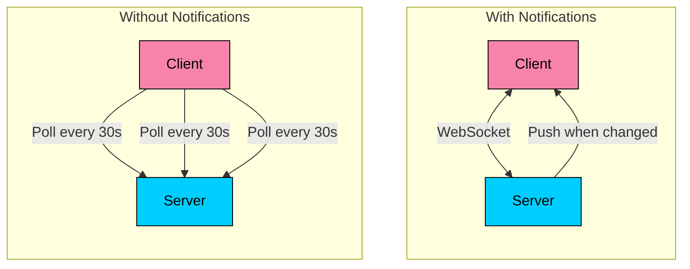

### The Sync Flow in Action

Here is how synchronization works when a user edits a file on one device:

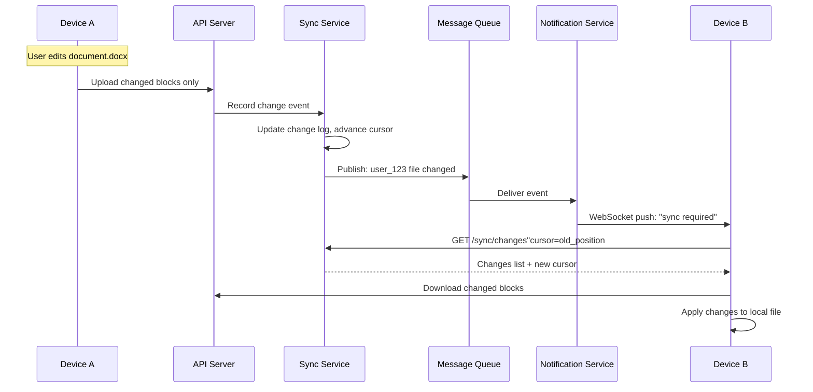

Let's trace through what happens:

1. **Local change detected:** Device A notices the user modified `document.docx`. The client computes which blocks changed by comparing the new block hashes to the previous version.
2. **Upload delta:** Device A uploads only the changed blocks, not the entire file. For a small edit to a large document, this might be just one 4 MB block instead of the whole 50 MB file.
3. **Record the change:** The Sync Service logs this change event, assigning it a position in the change log. This position becomes part of the cursor that other devices will use.
4. **Notify other devices:** The change event flows through a message queue to the Notification Service, which pushes a lightweight notification to Device B (and any other online devices).
5. **Fetch changes:** Device B receives the notification and immediately asks the Sync Service "what changed since my last sync"" The response includes the file path, change type, and new block list.
6. **Download and apply:** Device B downloads only the blocks it does not already have locally, then updates its local copy of the file. The change appears to the user almost instantly.

**What if Device B is offline"** No problem. When Device B comes back online, it sends its last cursor to the Sync Service, which returns all changes that accumulated while it was away. The device catches up in a single sync operation.

---

## 4.3 Requirement 3: File Sharing

Collaboration is what transforms a personal backup service into a productivity tool. Users need to share files with colleagues, share photos with family, or collaborate on documents with team members. But sharing brings new complexity: we need to track who has access to what, and with what permissions.

### The Sharing Service

The Sharing Service manages access control for all shared content. When you share a file with someone, the Sharing Service creates a record linking that file to that user with a specific permission level.

Every time someone accesses a file, we check: does this user own the file, or do they have a share record granting them access" This permission check happens on every request, so it needs to be fast. We cache frequently accessed share records in Redis to avoid hitting the database on every file access.

### The Sharing Flow

Here is what happens when User A shares a document with User B:

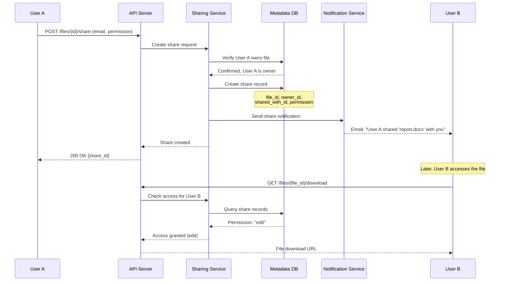

Let's walk through the key steps:

1. **Share request:** User A requests to share a file, specifying the recipient's email and the permission level (view or edit).
2. **Ownership verification:** Before creating a share, we verify that User A actually owns the file or has permission to share it. You cannot share what you do not own.
3. **Create share record:** The Sharing Service creates a record in the database linking the file to User B with the specified permission.
4. **Notify recipient:** User B receives an email notification about the shared file. The file also appears in their "Shared with me" folder.
5. **Access check:** When User B later tries to access the file, we check the share record. The permission level determines what they can do.

### Permission Levels

We implement a simple but effective permission model with three levels:

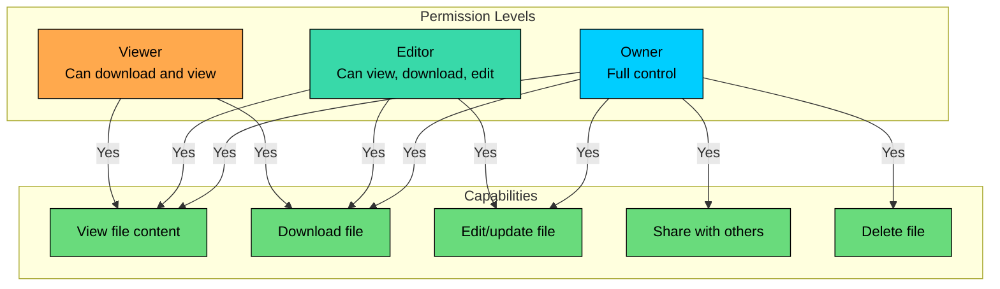

| Permission | View | Download | Edit | Share | Delete |
|------------|------|----------|------|-------|--------|
| **Viewer** | Yes | Yes | No | No | No |
| **Editor** | Yes | Yes | Yes | No | No |
| **Owner** | Yes | Yes | Yes | Yes | Yes |

**Why not let editors share"** This is a policy decision. Google Drive actually does allow editors to share, but many enterprise deployments restrict this to prevent unauthorized data distribution. We keep it simple here by reserving sharing for owners.

---

## 4.4 Putting It All Together

Now that we have designed the individual capabilities, let's step back and see the complete architecture. We have built up our system piece by piece: file storage with block servers and cloud storage, synchronization with the sync service and notifications, and sharing with the sharing service and permission checks.

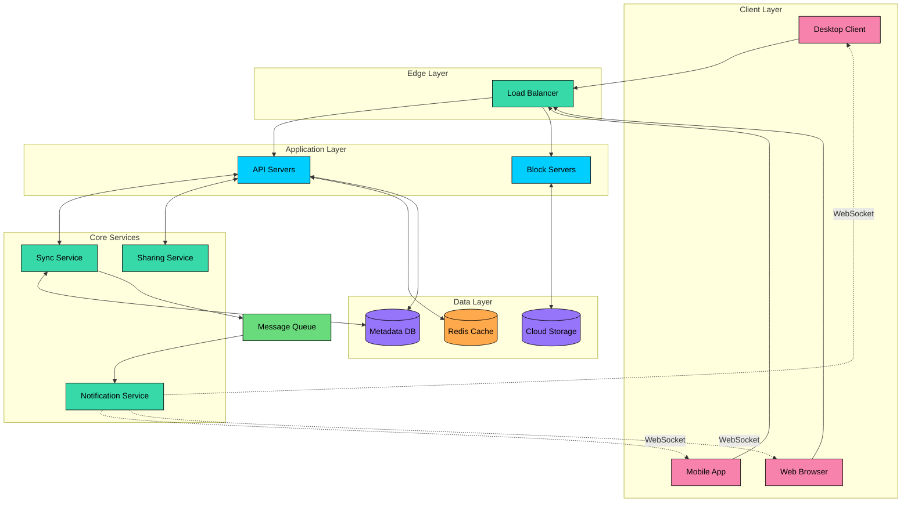

The architecture follows a layered approach, with each layer having a specific responsibility:

**Client Layer:** Users interact with our system through desktop clients (like the Google Drive app), mobile apps, or web browsers. The desktop client is particularly interesting because it watches the local file system for changes and handles offline operation.

**Edge Layer:** The load balancer distributes traffic across multiple server instances and provides a stable entry point for clients. It handles SSL termination and can route different request types to appropriate backends.

**Application Layer:** Two types of servers handle different concerns. API Servers manage metadata operations, authentication, and orchestration. They are stateless and can scale horizontally. Block Servers specialize in moving data, handling chunked uploads and downloads efficiently.

**Core Services:** Specialized services handle specific domains. The Sync Service maintains change logs and computes deltas. The Sharing Service manages permissions. The Notification Service maintains WebSocket connections for real-time updates.

**Data Layer:** Three storage systems serve different purposes. Redis caches frequently accessed metadata for low-latency reads. The Metadata Database stores all file and user information with strong consistency. Cloud Storage holds the actual file blocks with extreme durability.

### Component Responsibilities

| Component | Primary Responsibility | Scaling Strategy |
|-----------|----------------------|------------------|
| Load Balancer | Traffic distribution, SSL termination | Managed service or active-passive pair |
| API Servers | Metadata operations, orchestration | Horizontal (stateless instances) |
| Block Servers | Data transfer, chunking | Horizontal (stateless instances) |
| Sync Service | Change tracking, conflict detection | Horizontal with partitioned change logs |
| Sharing Service | Permission management | Horizontal with cached permissions |
| Notification Service | Real-time push notifications | Horizontal with sticky sessions |
| Redis Cache | Hot metadata caching | Redis Cluster (sharded) |
| Metadata DB | File/user/share records | Primary with read replicas |
| Cloud Storage | Block storage | Managed service (auto-scales) |
| Message Queue | Event delivery | Managed service (Kafka, SQS) |

This architecture handles our requirements well: the block-based approach enables resumable uploads and delta sync, the notification system provides real-time updates, and the separated data layer optimizes for different access patterns.

---

# 5. Database Design

With the high-level architecture in place, let's zoom into the data layer. Choosing the right databases and designing efficient schemas are critical decisions that affect performance, consistency, and operational complexity.

## 5.1 Choosing the Right Database

The database choice is not always obvious. Let's think through our access patterns and requirements to make an informed decision.

#### **What we need to store:**

- Billions of file and folder records with hierarchical relationships
- Version history for each file (multiple versions per file)
- Block mappings for content-addressable storage
- Sharing permissions linking users to files
- Sync cursors tracking each device's sync position

#### **How we access the data:**

- Get file by ID (the primary lookup pattern)
- List files in a folder (requires parent-child queries)
- Get all files shared with a user (join across sharing records)
- Find all changes since a cursor position (range queries on sync log)
- Check permissions for a file (frequently accessed, needs to be fast)

#### **Consistency requirements:**

- Permission checks must be strongly consistent. A user should not be able to access a file after their share is revoked.
- File listings should reflect changes immediately after upload.
- Sync cursors must advance atomically with file changes.

### Metadata: Why PostgreSQL"

Given these requirements, a relational database like PostgreSQL is a natural fit:

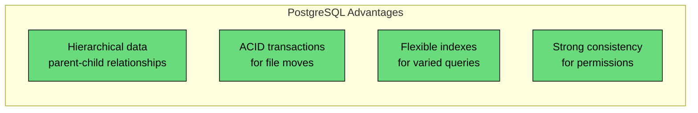

- **Hierarchical queries:** File systems are naturally hierarchical. PostgreSQL handles parent-child relationships well with foreign keys and recursive CTEs if needed.
- **ACID transactions:** Moving a file between folders must update both the old parent and new parent atomically. Transactions give us this guarantee.
- **Flexible indexing:** We can create indexes for each access pattern without restructuring data.
- **Mature ecosystem:** Replication, backup, monitoring tools are battle-tested.

### Block Storage: Why Object Storage"

For the actual file content (stored as blocks), object storage like Amazon S3 or Google Cloud Storage is the clear choice:

- **Cost:** Object storage costs $0.02-0.03 per GB/month, far cheaper than database storage.
- **Durability:** 11 nines of durability through sophisticated replication and erasure coding.
- **Scale:** Designed to handle exabytes of data across thousands of servers.
- **Simplicity:** Store a block, get a block. No complex queries needed.

### The Hybrid Approach

We use both: PostgreSQL for metadata and object storage for content. This separation lets each storage system do what it does best.

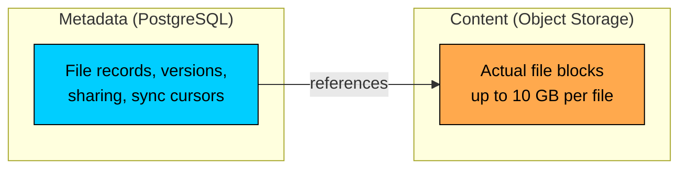

## 5.2 Database Schema

With our database choices made, let's design the schema. We have six main tables that work together to represent files, versions, blocks, users, sharing, and sync state.

### Files Table

The Files table is the heart of our schema. Each row represents either a file or a folder in a user's drive.

| Field | Type | Description |
|-------|------|-------------|
| `file_id` | UUID (PK) | Unique identifier for the file |
| `name` | VARCHAR(255) | File or folder name |
| `user_id` | UUID (FK) | Owner of the file |
| `parent_id` | UUID (FK) | Parent folder ID (null for root folder) |
| `size` | BIGINT | File size in bytes (0 for folders) |
| `checksum` | VARCHAR(64) | SHA-256 hash of entire file for integrity |
| `latest_version` | INT | Current version number |
| `is_folder` | BOOLEAN | True if this is a folder, false if file |
| `created_at` | TIMESTAMP | When the file was created |
| `updated_at` | TIMESTAMP | Last modification time |

**Why use `is_folder` instead of a separate folders table"** Files and folders share almost all the same fields. Using a single table with a flag simplifies queries for listing folder contents, since we do not need to UNION two tables.

**Indexes:**

### File Versions Table

Every time a file is modified, we create a new version rather than overwriting the old one. This enables version history and rollback.

| Field | Type | Description |
|-------|------|-------------|
| `version_id` | UUID (PK) | Unique identifier for this version |
| `file_id` | UUID (FK) | Reference to the parent file |
| `version_number` | INT | Sequential version (1, 2, 3...) |
| `size` | BIGINT | Size of this version in bytes |
| `created_at` | TIMESTAMP | When this version was created |
| `created_by` | UUID (FK) | User who created this version |

The actual content is not stored here. Instead, each version links to its blocks through the Version_Blocks join table. This allows different versions to share unchanged blocks, saving storage.

### Blocks Table

This table maps block hashes to their storage locations and tracks how many files reference each block.

| Field | Type | Description |
|-------|------|-------------|
| `block_hash` | VARCHAR(64) (PK) | SHA-256 hash of block content |
| `storage_path` | VARCHAR(512) | Path in cloud storage (e.g., s3://bucket/hash) |
| `size` | INT | Block size in bytes |
| `reference_count` | INT | Number of versions using this block |
| `created_at` | TIMESTAMP | When block was first stored |

**Why track reference_count"** When a file version is deleted, we decrement the reference count for its blocks. Only when a block's count reaches zero can we safely delete it from cloud storage. This is how we support deduplication without accidentally deleting blocks that are still in use.

### Version Blocks Table

This join table links file versions to their blocks in order.

| Field | Type | Description |
|-------|------|-------------|
| `version_id` | UUID (FK) | Reference to file version |
| `block_hash` | VARCHAR(64) (FK) | Reference to block |
| `block_order` | INT | Position of block in file (0, 1, 2...) |

**Primary key:** Composite of (version_id, block_order)

To reconstruct a file, we query all blocks for a version ordered by block_order, then fetch each block from cloud storage and concatenate them.

### Sharing Table

Stores the access grants that let users share files with others.

| Field | Type | Description |
|-------|------|-------------|
| `share_id` | UUID (PK) | Unique identifier for this share |
| `file_id` | UUID (FK) | Shared file or folder |
| `owner_id` | UUID (FK) | User who created the share |
| `shared_with` | UUID (FK) | User who received access |
| `permission` | ENUM | Either 'view' or 'edit' |
| `created_at` | TIMESTAMP | When share was created |

**Indexes:**

### Sync Cursors Table

Tracks the sync position for each device so we can efficiently compute what changed since the last sync.

| Field | Type | Description |
|-------|------|-------------|
| `device_id` | UUID (PK) | Unique identifier for the device |
| `user_id` | UUID (FK) | User who owns the device |
| `cursor` | BIGINT | Position in the change log |
| `last_sync` | TIMESTAMP | When this device last synced |

The cursor is an opaque position in our change log. When a device syncs, we query for all changes with a position greater than its cursor, return those changes, and update the cursor to the latest position.

---

# 6. Design Deep Dive

The high-level architecture gives us a solid foundation, but system design interviews often go deeper into specific components. In this section, we will explore the trickiest parts of our design: chunked uploads for reliability, delta sync for efficiency, conflict resolution for offline scenarios, deduplication for storage optimization, real-time notifications for instant sync, and durability for data safety.

These are the topics that distinguish a good system design answer from a great one.

## 6.1 Chunked and Resumable Uploads

Imagine uploading a 5 GB video to Google Drive over a coffee shop WiFi. You are at 99% complete when someone walks between you and the router, the connection drops, and... you have to start over from scratch. That would be a terrible user experience.

Chunked uploads solve this problem by breaking large files into smaller pieces that can be uploaded independently. If one piece fails, you only retry that piece, not the entire file. This is how services like Dropbox and Google Drive handle large uploads reliably.

### Why Chunked Uploads Matter

The internet is not as reliable as we would like:

- **Mobile networks** frequently drop connections as users move between cell towers or switch between WiFi and cellular.
- **Large uploads take time,** and the longer an upload runs, the higher the probability of a network hiccup.
- **Server restarts** for maintenance or scaling can interrupt in-progress uploads.
- **Users close laptops** mid-upload when rushing to a meeting.

Without chunked uploads, any interruption means starting over. With chunked uploads, interruptions are minor inconveniences that the client handles automatically.

### How Chunked Upload Works

Instead of uploading files as a single request, we split them into fixed-size chunks (typically 4 MB) and upload each chunk independently.

The process involves four steps:

#### **Step 1: Initialize the Upload**

The client sends file metadata and receives upload instructions:

The server creates an upload session record that tracks which chunks have been received. The `upload_id` is the key that ties all the chunks together.

#### **Step 2: Upload Chunks**

The client splits the file into chunks and uploads them, potentially in parallel:

Each chunk upload is idempotent. If a client is unsure whether a chunk was received (network timeout), it can safely retry. The server checks the checksum and ignores duplicates.

#### **Step 3: Resume on Failure**

If the connection drops, the client queries which chunks made it to the server:

The client resumes by uploading only the missing chunks. For our 5 GB video, maybe only 8 MB needs to be re-uploaded instead of 5 GB.

#### **Step 4: Complete the Upload**

Once all chunks are uploaded, the client signals completion:

The server verifies all chunks are present, creates the file record with the ordered list of chunk hashes, and the file becomes available across all the user's devices.

### Choosing the Right Chunk Size

Chunk size is a trade-off between HTTP overhead and retry cost:

| Chunk Size | Pros | Cons | Best For |
|------------|------|------|----------|
| **Small (1 MB)** | Fine-grained resume, low retry cost | More HTTP requests, more metadata | Unstable mobile networks |
| **Large (16 MB)** | Fewer requests, lower overhead | Higher retry cost if chunk fails | Fast, stable connections |
| **4 MB (Recommended)** | Good balance for most scenarios | Works well across conditions | General purpose |

Most cloud storage services settle on 4-8 MB chunks. This size is small enough that retrying a failed chunk is not too expensive, but large enough that the HTTP overhead per chunk is acceptable.

### Chunked Upload Visualization

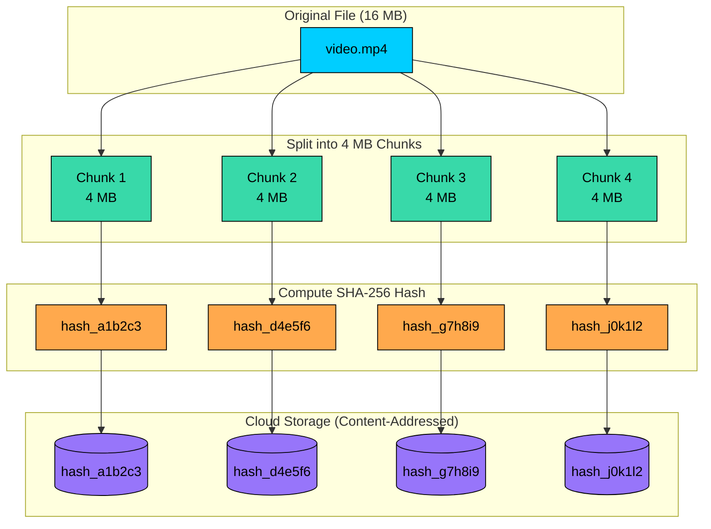

### Resumable Upload Sequence

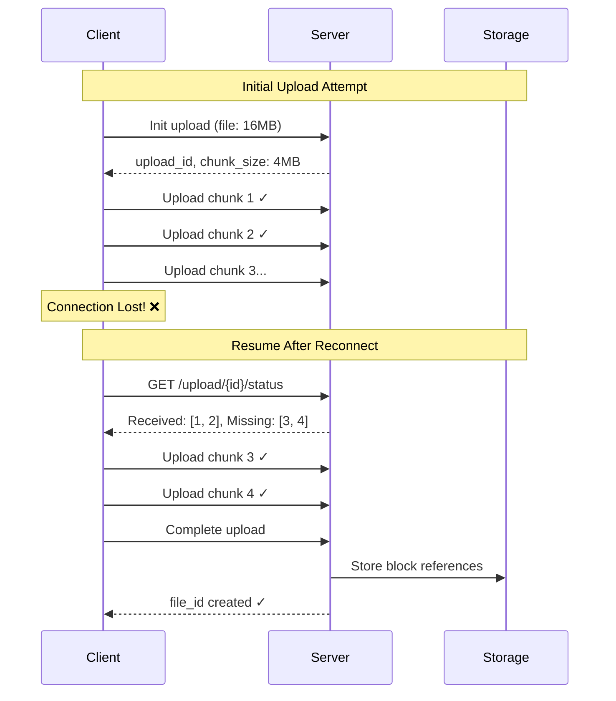

---

## 6.2 Delta Sync and Bandwidth Optimization

Here is a scenario that would frustrate any user: you open a 100 MB PowerPoint presentation, fix a typo on slide 3, and save. Your cloud storage client then uploads... 100 MB. The same 100 MB it uploaded yesterday. And the same 100 MB it will upload tomorrow when you add a slide.

This is wasteful. The typo fix changed maybe 1 KB of actual content. Delta sync solves this by uploading only what changed, not the entire file.

### Why Delta Sync Matters

Without delta sync, bandwidth usage scales with file size regardless of change size:

- A 100 MB presentation with a one-word edit: 100 MB upload
- A 500 MB video folder with one renamed file: 0 bytes (metadata only, but naive implementations might re-upload)
- A user on a metered mobile connection editing documents all day: hundreds of MB wasted

With delta sync, bandwidth scales with change size:

- That same presentation edit: ~4 MB (one changed block)
- Typically 90-99% bandwidth savings for incremental edits

### How Delta Sync Works

The magic comes from our block-based storage. Since files are stored as ordered lists of content-addressed blocks, we can detect exactly which parts changed.

#### **A File as a Block List**

When a file is first uploaded, it gets split into blocks, and each block is identified by its content hash:

#### **Detecting What Changed**

When the user edits the file:

1. The client re-chunks the modified file
2. The client computes the hash of each new block
3. The client compares the new hashes to the previous version

Block 1 and Block 2 have the same hash, so they have not changed. Block 3 has a different hash, so it contains the edits.

#### **Upload Only What Changed**

The client uploads only `hash_444` (the new block). The server:

1. Stores the new block in cloud storage
2. Creates a new file version pointing to [hash_111, hash_222, hash_444]
3. Notifies other devices that the file changed

#### **Download Only What Changed**

When another device syncs:

1. Device receives notification that report.docx changed
2. Device fetches the new block list from the server
3. Device checks its local cache: "I already have hash_111 and hash_222"
4. Device downloads only hash_444
5. Device reconstructs the file from local and new blocks

The result" A small edit to a large file syncs almost instantly.

### The Problem with Fixed-Size Chunking

There is a subtle issue with fixed-size chunking: what happens when you insert data at the beginning of a file"

With fixed 4 MB chunks, inserting even one byte at the start shifts all chunk boundaries. Every single chunk gets a new hash, even though most of the content is unchanged:

This defeats the purpose of delta sync. The solution is content-defined chunking (CDC).

### Content-Defined Chunking (CDC)

Instead of cutting files at fixed byte positions, CDC algorithms like Rabin fingerprinting find chunk boundaries based on the content itself. They scan through the file looking for specific byte patterns to use as boundaries.

The key insight: if you insert data, it only affects the chunk boundaries near the insertion point. Chunks elsewhere in the file keep the same boundaries and the same hashes.

This makes delta sync work well even when content is inserted rather than modified in place.

### Real-World Bandwidth Savings

How much does delta sync actually save" Here are some realistic scenarios:

| Scenario | Without Delta Sync | With Delta Sync | Savings |
|----------|-----------|------------|---------|
| Edit one line in 10 MB document | 10 MB | ~4 MB (one block) | 60% |
| Fix typo in 100 MB presentation | 100 MB | ~4 MB | 96% |
| Add one photo to folder | 5 MB photo only | 5 MB photo only | Same |
| Rename a file | 0 (metadata only) | 0 (metadata only) | Same |

The savings are most dramatic for large files with small changes, which is exactly the common case for documents and presentations.

### Delta Sync Visualization

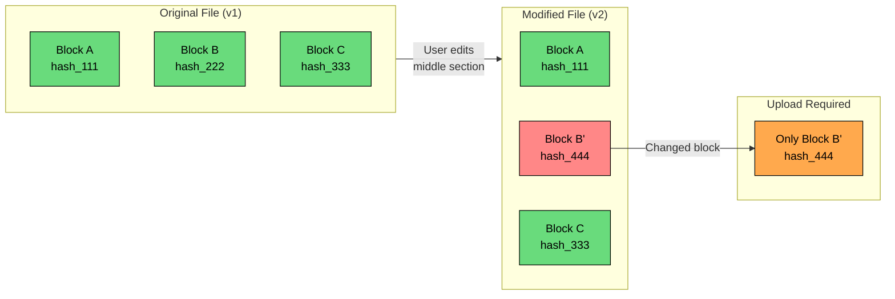

### Delta Sync Flow

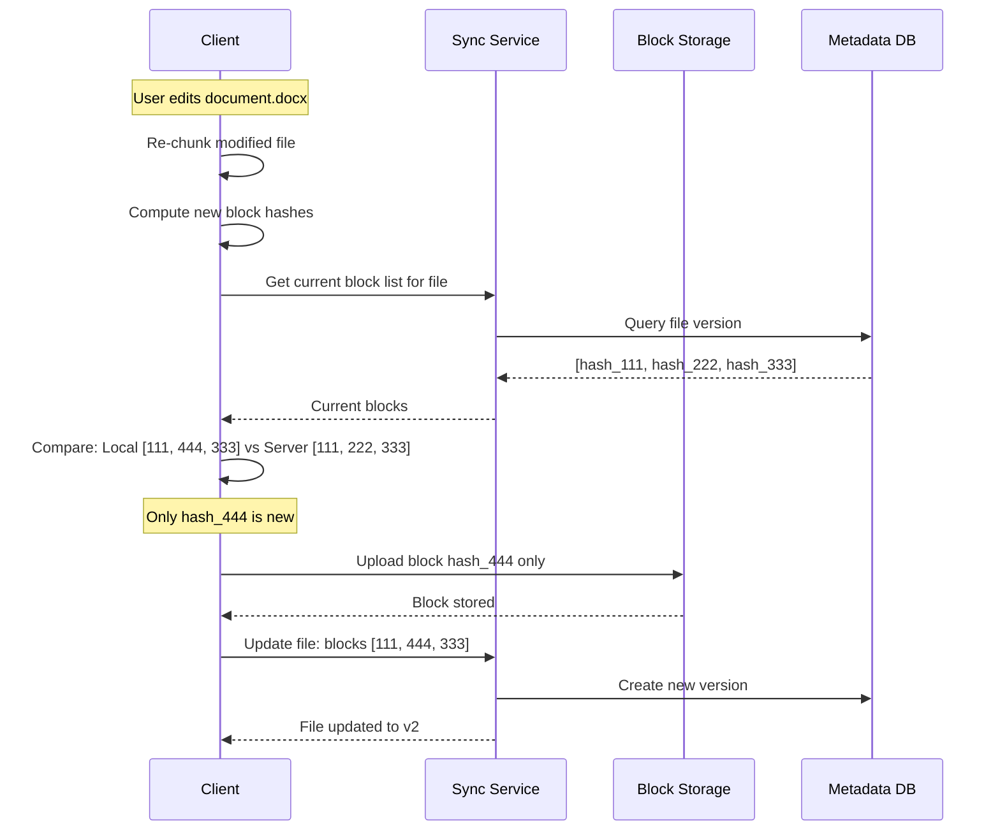

### Content-Defined Chunking (CDC)

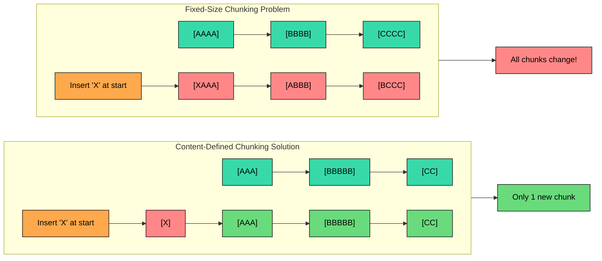

---

## 6.3 Conflict Resolution

Offline editing creates a tricky problem. Imagine this scenario:

1. You are on a flight (no WiFi) and edit `quarterly-report.docx` on your laptop, adding the Q4 numbers.
2. Your colleague, in a different timezone, edits the same file on their computer, updating the executive summary.
3. You both reconnect. The server now has two different versions based on the same original. Which one wins"

This is a conflict, and how we handle it significantly impacts user experience.

### Detecting Conflicts

We detect conflicts using version vectors. Every file has a version number that increments with each change. When a client uploads changes, it includes the base version it started from:

The second upload cannot simply overwrite v6 because that would lose your changes. We need a strategy.

### Resolution Strategies

There are three main approaches, each with different trade-offs:

#### **Strategy 1: Last Write Wins (LWW)**

The most recent change (by timestamp) simply overwrites any previous changes.

| Pros | Cons |
|------|------|
| Simple to implement | Data loss is silent |
| No user intervention needed | Earlier changes discarded |
| Predictable behavior | Can lose important edits |

**Best for:** Non-critical data, automatically saved drafts, temp files. Dropbox uses this for some edge cases.

#### **Strategy 2: Create Conflicting Copy**

Both versions are kept. The server renames the conflicting version to indicate the conflict:

| Pros | Cons |
|------|------|
| No data loss | Creates file clutter |
| User decides how to merge | Requires manual resolution |
| Transparent about what happened | Users may ignore conflicts |

**Best for:** Document editing, user-generated content. This is what Dropbox does for most conflicts.

#### **Strategy 3: Automatic Merge**

For certain file types (plain text, source code), we can attempt a three-way merge:

1. Find the common ancestor version (v5 in our example)
2. Compute what each party changed from the ancestor
3. Combine the changes if they do not overlap

If you edited paragraph 1 and your colleague edited paragraph 5, the merge succeeds automatically. If you both edited the same paragraph, we fall back to creating a conflicting copy.

| Pros | Cons |
|------|------|
| Seamless when changes do not overlap | Complex to implement |
| Feels like magic when it works | Only works for text-based formats |
| No manual intervention needed | Can produce unexpected results |

**Best for:** Source code, configuration files, structured text documents.

### Our Recommendation

Use **Strategy 2 (Conflicting Copy)** as the default. It is the safest approach:

- Users are notified of conflicts.
- No data is ever lost.
- Users maintain control over resolution.

For specific file types (plain text, source code), offer automatic merge with fallback to conflicting copies.

### Conflict Detection and Resolution Flow

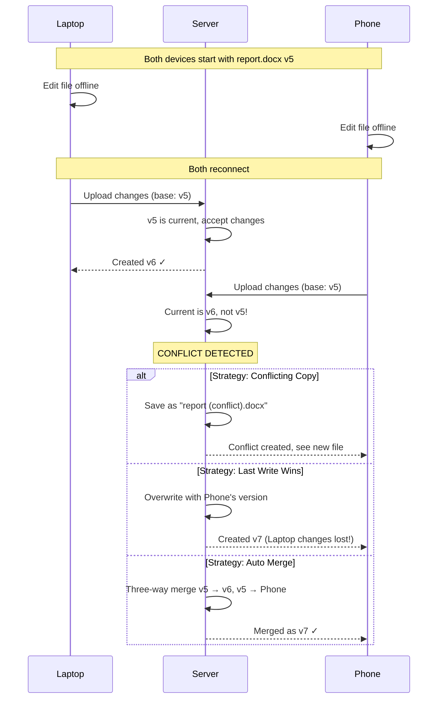

### Conflict Resolution Decision Tree

```mermaid
flowchart TD
    A[Upload Request<br/>base_version: X]:::primary --> B{Server version<br/>== X"}

    B -->|Yes| C[Accept Upload<br/>Create version X+1]:::green
    B -->|No| D[CONFLICT<br/>Server has newer version]:::red

    D --> E{File Type"}

    E -->|Binary/Media| F[Create Conflicting Copy]:::orange
    E -->|Text/Code| G{Changes Overlap"}

    G -->|No| H[Auto Merge]:::green
    G -->|Yes| I[Create Conflicting Copy]:::orange

    F --> J[Notify User]:::secondary
    I --> J

    H --> K[Create Merged Version]:::green

    classDef primary fill:#00ceff,stroke:#000,color:#000
    classDef secondary fill:#38d9a9,stroke:#000,color:#000
    classDef orange fill:#ffa94d,stroke:#000,color:#000
    classDef green fill:#69db7c,stroke:#000,color:#000
    classDef red fill:#ff8787,stroke:#000,color:#000
```

---

## 6.4 Data Deduplication

With 500 million users, there is a lot of redundancy in what people store. The same email attachment gets forwarded to 50 people who all save it. A popular meme gets downloaded and stored by thousands. The same PDF invoice template gets used by every freelancer.

Without deduplication, we would store the same content millions of times. With deduplication, we store it once and let everyone point to it. The savings are substantial, often 30-50% for typical cloud storage workloads.

### How Content-Addressable Storage Enables Deduplication

Remember how we store blocks using their content hash as the key" This makes deduplication automatic:

The user experience is even better: since we skip uploading blocks that already exist, User B's upload completes almost instantly.

### Block-Level vs File-Level Deduplication

Why do we deduplicate at the block level rather than the file level"

| Approach | What Gets Deduplicated | Effectiveness |
|----------|------------------------|---------------|
| **File-Level** | Only exact file matches | Limited - files must be identical |
| **Block-Level** | Matching chunks within files | High - catches partial similarity |

Block-level deduplication catches many more cases:

- **File versions:** Version 1 and Version 2 of a document share 95% of their blocks
- **Templates:** Every company's version of "invoice_template.docx" shares most content
- **Forks and copies:** Modified copies of a file still share unchanged sections
- **Similar media:** Different crops of the same photo may share some blocks

### Safe Deletion with Reference Counting

There is a problem with deduplication: when User A deletes their file, we cannot just delete the blocks because User B is still using them.

The solution is reference counting. Each block tracks how many file versions reference it:

When User A deletes their file:

1. Decrement reference count for each block (hash_abc goes from 2 to 1)
2. Check if any block reached 0 (no, hash_abc is still 1)
3. Block stays in storage

When User B later deletes their file:

1. Decrement reference count (hash_abc goes from 1 to 0)
2. Block reached 0, add to garbage collection queue
3. Background process eventually deletes from cloud storage

### Privacy Considerations

Cross-user deduplication has a subtle privacy implication. If uploads are instant when a block already exists, an attacker could probe whether specific content exists in the system. This is called a "deduplication side-channel attack."

**Mitigations:**

- **Single-user dedup only:** Deduplicate within each user's account, not across users
- **Convergent encryption:** Encrypt blocks with a key derived from the content hash, so even deduplicated blocks are encrypted
- **Randomized timing:** Add small random delays to uploads so instant completion does not reveal deduplication

### Deduplication Visualization

```mermaid
flowchart TB
    subgraph Users["User Uploads"]
        UA["User A uploads<br/>photo.jpg"]:::primary
        UB["User B uploads<br/>photo.jpg (same file)"]:::primary
        UC["User C uploads<br/>document.docx<br/>(shares 2 blocks)"]:::primary
    end

    subgraph BlockHashing["Block Hashing"]
        HA1[hash_X]:::orange
        HA2[hash_Y]:::orange
        HB1[hash_X]:::orange
        HB2[hash_Y]:::orange
        HC1[hash_X]:::orange
        HC2[hash_Z]:::orange
    end

    subgraph Storage["Cloud Storage (Deduplicated)"]
        S1[(hash_X<br/>ref_count: 3)]:::purple
        S2[(hash_Y<br/>ref_count: 2)]:::purple
        S3[(hash_Z<br/>ref_count: 1)]:::purple
    end

    UA --> HA1 & HA2
    UB --> HB1 & HB2
    UC --> HC1 & HC2

    HA1 --> S1
    HB1 -.->|Already exists| S1
    HC1 -.->|Already exists| S1

    HA2 --> S2
    HB2 -.->|Already exists| S2

    HC2 --> S3

    subgraph Savings["Storage Savings"]
        CALC["Without dedup: 6 blocks<br/>With dedup: 3 blocks<br/>Savings: 50%"]:::green
    end

    classDef primary fill:#00ceff,stroke:#000,color:#000
    classDef orange fill:#ffa94d,stroke:#000,color:#000
    classDef purple fill:#9775fa,stroke:#000,color:#000
    classDef green fill:#69db7c,stroke:#000,color:#000
```

### Reference Counting for Garbage Collection

```mermaid
flowchart LR
    subgraph FileA["User A: photo.jpg"]
        FA[File Metadata]:::primary
    end

    subgraph FileB["User B: photo.jpg"]
        FB[File Metadata]:::primary
    end

    subgraph Block["Block hash_X"]
        BL[(hash_X<br/>ref_count: 2)]:::purple
    end

    FA -->|references| BL
    FB -->|references| BL

    DEL[User A deletes file]:::red --> DEC[Decrement ref_count]:::orange
    DEC --> CHECK{ref_count > 0"}

    CHECK -->|Yes: 1| KEEP[Keep block]:::green
    CHECK -->|No: 0| GC[Garbage collect]:::red

    classDef primary fill:#00ceff,stroke:#000,color:#000
    classDef purple fill:#9775fa,stroke:#000,color:#000
    classDef orange fill:#ffa94d,stroke:#000,color:#000
    classDef green fill:#69db7c,stroke:#000,color:#000
    classDef red fill:#ff8787,stroke:#000,color:#000
```

---

## 6.5 Real-Time Notifications

When you save a file on your laptop, you expect it to appear on your phone within seconds, not minutes. This responsiveness requires push notifications rather than polling.

### The Problem with Polling

The naive approach to sync is polling: every client asks the server "anything new"" at regular intervals.

The file changed at 35 seconds, but the phone does not find out until 60 seconds. Worse, those "no" responses waste bandwidth, battery, and server resources. Multiply by 100 million daily active users, and you have a scalability nightmare.

### WebSocket-Based Push Notifications

Instead of polling, we maintain persistent WebSocket connections between clients and the Notification Service. When a file changes, the server pushes a notification to the client immediately.

#### **Step 1: Establish Connection**

When a client comes online, it opens a WebSocket connection:

#### **Step 2: Push Change Notifications**

When any device uploads changes, the notification flows through our system:

#### **Step 3: Lightweight Notification Payload**

The notification itself is small. It does not contain the file content, just a signal that something changed:

The receiving client then calls `GET /sync/changes"cursor=X` to fetch the actual changes and download any new blocks.

#### **Step 4: Handling Offline Devices**

When a device reconnects after being offline, it does not need special handling. It simply sends its last known cursor to the sync endpoint and receives all changes that accumulated while it was away. The notification system does not need to store notifications for offline devices.

### Scaling to Millions of Connections

With 100 million daily active users, we might have 10-20 million concurrent WebSocket connections. This requires careful architecture:

**Fan-out with Pub/Sub:** A single file change might need to notify 3-5 devices. We use Kafka or Redis Pub/Sub to fan out change events to the notification servers that hold those connections.

**Connection Affinity:** We use consistent hashing to route each user's devices to the same notification server. This makes fan-out simpler, since all of a user's connections are on one server.

**Graceful Degradation:** If the notification service is unavailable, clients fall back to polling (perhaps every 60 seconds). The experience is degraded but not broken.

### Real-Time Notification Architecture

```mermaid
flowchart TB
    subgraph Devices["User's Devices"]
        D1[Laptop]:::primary
        D2[Phone]:::primary
        D3[Tablet]:::primary
    end

    subgraph NotificationLayer["Notification Layer"]
        NS1[Notification Server 1]:::secondary
        NS2[Notification Server 2]:::secondary
        NS3[Notification Server N]:::secondary
    end

    subgraph MessageBroker["Message Broker"]
        KAFKA[Kafka / Redis Pub-Sub]:::orange
    end

    subgraph Backend["Backend Services"]
        SYNC[Sync Service]:::primary
        API[API Server]:::primary
    end

    D1 <-->|WebSocket| NS1
    D2 <-->|WebSocket| NS2
    D3 <-->|WebSocket| NS1

    KAFKA --> NS1
    KAFKA --> NS2
    KAFKA --> NS3

    API -->|File changed| SYNC
    SYNC -->|Publish event| KAFKA

    classDef primary fill:#00ceff,stroke:#000,color:#000
    classDef secondary fill:#38d9a9,stroke:#000,color:#000
    classDef orange fill:#ffa94d,stroke:#000,color:#000
```

### Notification Flow Sequence

```mermaid
sequenceDiagram
    participant Device A
    participant API Server
    participant Sync Service
    participant Message Queue
    participant Notification Server
    participant Device B
    participant Device C

    Note over Device B,Device C: Devices connected via WebSocket

    Device A->>API Server: Upload file changes
    API Server->>Sync Service: Record change event

    Sync Service->>Message Queue: Publish: {user_id, file_id, change_type}

    Message Queue->>Notification Server: Deliver event

    par Fan-out to all devices
        Notification Server->>Device B: Push: "sync_required"
        Notification Server->>Device C: Push: "sync_required"
    end

    Device B->>Sync Service: GET /sync/changes"cursor=X
    Sync Service-->>Device B: Changed files list

    Device C->>Sync Service: GET /sync/changes"cursor=Y
    Sync Service-->>Device C: Changed files list
```

### Handling Offline Devices

```mermaid
flowchart TD
    A[Device Goes Offline]:::primary --> B[Missed Notifications]:::red

    B --> C[Device Reconnects]:::primary

    C --> D[Send last cursor to Sync Service]:::secondary

    D --> E{Cursor valid"}

    E -->|Yes| F[Return all changes since cursor]:::green
    E -->|No/Expired| G[Full sync required]:::orange

    F --> H[Device processes changes]:::green
    G --> I[Device fetches complete state]:::orange

    H --> J[Update local cursor]:::secondary
    I --> J

    J --> K[Resume real-time notifications]:::green

    classDef primary fill:#00ceff,stroke:#000,color:#000
    classDef secondary fill:#38d9a9,stroke:#000,color:#000
    classDef orange fill:#ffa94d,stroke:#000,color:#000
    classDef green fill:#69db7c,stroke:#000,color:#000
    classDef red fill:#ff8787,stroke:#000,color:#000
```

---

## 6.6 Ensuring Durability and Reliability

People store their wedding photos, tax documents, business contracts, and irreplaceable memories in cloud storage. Losing this data would be catastrophic. This is why cloud storage services target "11 nines" of durability, a number so high that statistically, if you store 10 million files, you might lose one file every 10 million years.

How do we achieve such extreme durability" Through redundancy at every layer.

### Block Storage Durability

Cloud storage providers like Amazon S3 and Google Cloud Storage achieve their durability guarantees through multiple mechanisms:

**Replication:** Each block is stored in at least 3 different locations within a region, typically on different racks with separate power and network. A single disk failure, or even a rack failure, does not cause data loss.

**Erasure Coding:** For cost efficiency, data is often split into fragments using mathematical algorithms. Instead of storing 3 complete copies, we might split data into 6 fragments where any 4 can reconstruct the original. This provides similar durability with less storage overhead.

**Checksum Verification:** Every block has a checksum that is verified on read. Background processes continuously scan storage, comparing checksums and repairing any detected corruption by copying from healthy replicas.

### Metadata Durability

Metadata is equally critical. If we lose the metadata that says "file_123 is made of blocks [A, B, C]," those blocks become orphaned, we cannot reconstruct the file even though the blocks still exist.

Metadata durability strategies:

**Synchronous Replication:** Writes are not acknowledged until both the primary database and at least one replica have confirmed. This prevents data loss if the primary fails immediately after a write.

**Point-in-Time Recovery:** Regular snapshots and continuous transaction log backups enable restoration to any second in the past. If something goes wrong (corruption, accidental deletion), we can recover.

**Write-Ahead Logging (WAL):** All changes are logged before being applied. If the database crashes mid-transaction, the WAL enables recovery to a consistent state.

### Disaster Recovery Across Regions

What if an entire data center goes down" Earthquakes, floods, and power grid failures can take out entire regions. We need geographic redundancy:

- **Multi-region block storage:** Critical data is replicated to a secondary region (e.g., US-East to US-West)
- **Async metadata replication:** Metadata is streamed to standby databases in other regions
- **Failover capability:** If the primary region becomes unavailable, we can switch to the secondary

The trade-off is cost (storing everything twice) and potential data lag (async replication means the secondary might be a few seconds behind). Most cloud storage services accept this trade-off for their most critical data tiers.

### Data Durability Architecture

```mermaid
flowchart TB
    subgraph Client["Client Upload"]
        U[User uploads block]:::primary
    end

    subgraph BlockStorage["Block Storage Layer"]
        BS[Block Server]:::secondary
    end

    subgraph Replication["Multi-Region Replication"]
        subgraph R1["Region 1 (Primary)"]
            S1A[(Replica 1)]:::green
            S1B[(Replica 2)]:::green
            S1C[(Replica 3)]:::green
        end

        subgraph R2["Region 2 (Secondary)"]
            S2A[(Replica 1)]:::purple
            S2B[(Replica 2)]:::purple
        end

        subgraph R3["Region 3 (Tertiary)"]
            S3A[(Replica 1)]:::orange
            S3B[(Replica 2)]:::orange
        end
    end

    U --> BS
    BS -->|Sync write| S1A
    BS -->|Sync write| S1B
    BS -->|Sync write| S1C

    S1A -.->|Async replication| S2A
    S1A -.->|Async replication| S3A
    S2A -.-> S2B
    S3A -.-> S3B

    classDef primary fill:#00ceff,stroke:#000,color:#000
    classDef secondary fill:#38d9a9,stroke:#000,color:#000
    classDef purple fill:#9775fa,stroke:#000,color:#000
    classDef orange fill:#ffa94d,stroke:#000,color:#000
    classDef green fill:#69db7c,stroke:#000,color:#000
```

#### **Can survive:**

- Multiple disk failures
- Server failures
- Data center outage
- Regional disaster

### Metadata Replication Strategy

```mermaid
flowchart LR
    subgraph Primary["Primary Region"]
        PM[(Primary DB)]:::primary
        WAL[Write-Ahead Log]:::secondary
    end

    subgraph Secondary["Secondary Region"]
        SM[(Standby DB)]:::purple
    end

    subgraph Backup["Backup Strategy"]
        SNAP[Daily Snapshots]:::orange
        PITR[Point-in-Time Recovery]:::orange
    end

    WRITE[Write Request]:::green --> PM
    PM --> WAL
    WAL -->|Streaming Replication| SM

    PM -->|Periodic| SNAP
    WAL -->|Continuous| PITR

    classDef primary fill:#00ceff,stroke:#000,color:#000
    classDef secondary fill:#38d9a9,stroke:#000,color:#000
    classDef purple fill:#9775fa,stroke:#000,color:#000
    classDef orange fill:#ffa94d,stroke:#000,color:#000
    classDef green fill:#69db7c,stroke:#000,color:#000
    classDef red fill:#ff8787,stroke:#000,color:#000
```

### Data Integrity Verification

```mermaid
flowchart LR
    subgraph Continuous["Continuous Verification"]
		direction LR
        A[Background Scanner]:::primary --> B[Read block from storage]:::secondary
        B --> C[Compute checksum]:::secondary
        C --> D{Matches stored hash"}

        D -->|Yes| E[Block OK]:::green
        D -->|No| F[CORRUPTION DETECTED]:::red

        F --> G[Read from replica]:::orange
        G --> H[Repair corrupted block]:::orange
        H --> I[Alert operations team]:::orange
    end

    subgraph Upload["Upload Verification"]
		direction LR
        U1[Client computes hash]:::primary
        U2[Server receives block]:::secondary
        U3[Server computes hash]:::secondary
        U4{Hashes match"}

        U1 --> U2 --> U3 --> U4

        U4 -->|Yes| U5[Store block]:::green
        U4 -->|No| U6[Reject upload]:::red
    end

    classDef primary fill:#00ceff,stroke:#000,color:#000
    classDef secondary fill:#38d9a9,stroke:#000,color:#000
    classDef orange fill:#ffa94d,stroke:#000,color:#000
    classDef green fill:#69db7c,stroke:#000,color:#000
    classDef red fill:#ff8787,stroke:#000,color:#000
```

---

# Summary

Designing a cloud file storage system like Google Drive involves balancing many competing concerns: reliability vs cost, simplicity vs features, and consistency vs performance. Here are the key design decisions we made:

| Challenge | Our Solution |
|-----------|--------------|
| Large file uploads | Chunked uploads with resumability |
| Bandwidth efficiency | Block-level delta sync with content-defined chunking |
| Real-time sync | WebSocket push notifications with cursor-based sync |
| Offline support | Conflict detection with "conflicting copy" resolution |
| Storage cost | Content-addressable deduplication |
| Durability | Multi-region replication with 11 nines durability |
| Scale | Separated metadata (PostgreSQL) and content (object storage) |

The architecture we designed can handle 500 million users with petabytes of data. More importantly, it provides the seamless, reliable experience that users expect from cloud storage: files that are always available, always in sync, and never lost.

---

# References

- [Dropbox Architecture Blog](https://dropbox.tech/infrastructure) - Deep dives into Dropbox's storage systems
- [Google Cloud Storage Documentation](https://cloud.google.com/storage/docs) - Object storage best practices
- [How Dropbox Stores Your Data](https://dropbox.tech/infrastructure/inside-the-magic-pocket) - Magic Pocket storage system internals
- [Rsync Algorithm](https://rsync.samba.org/tech_report/) - Foundation of delta sync techniques
- [Content-Defined Chunking](https://restic.readthedocs.io/en/stable/100_references.html#chunking) - CDC algorithms for efficient deduplication

---

# Quiz
