> 💡 **Key Insight:**

> **QUESTION**
>
> #### What is Google Maps"
>
> Google Maps is a navigation and mapping service that helps users find locations, get directions, and explore geographic areas through interactive maps.
>
> The core functionality includes rendering maps at various zoom levels, searching for places, calculating routes between locations, and providing real-time traffic updates.
>
> Users can view maps in different modes (road, satellite, terrain), get turn-by-turn navigation, and discover points of interest like restaurants, gas stations, and landmarks.
>
> **Popular Examples:** Google Maps, Apple Maps, Waze, MapQuest, HERE WeGo

What makes Google Maps fascinating from a system design perspective is the sheer diversity of challenges it presents. These challenges are very different from each other, yet they all need to work together seamlessly.

Serving map tiles requires handling millions of requests per second with sub-second latency. Location search demands sophisticated text matching and geospatial indexing. Route calculation involves running graph algorithms on a network with billions of edges. And real-time traffic requires ingesting and processing data from millions of devices simultaneously.

This system design problem tests multiple fundamental concepts: geospatial data structures, caching at scale, graph algorithms, real-time data processing, and geographic distribution. The interviewer can steer the conversation in many directions depending on your experience and the role.

In this chapter, we will explore the **high-level design of a mapping and navigation service like Google Maps**.

Let's start by clarifying the requirements:

---

# 1. Clarifying Requirements

A mapping service can mean many things. Are we building a simple static map viewer, or do we need turn-by-turn navigation with voice guidance" Should we support public transit, or just driving" Do we need to handle offline scenarios" 

These questions significantly impact our architecture, so we need to get clarity upfront.

Here is how a requirements discussion might unfold in an interview:

> 💡 **Key Insight:**

> **DISCUSSION**
>
> **Candidate:** "What are the core features we need to support" Should we focus on map viewing, navigation, or both""
>
> **Interviewer:** "Focus on map rendering, location search, and navigation with routing. Real-time traffic would be a good addition if time permits."
>
> **Candidate:** "What is the expected scale" How many users and how many navigation requests per day""
>
> **Interviewer:** "Assume 1 billion daily active users globally, with 100 million navigation requests per day."
>
> **Candidate:** "Should we support multiple transportation modes like driving, walking, cycling, and public transit""
>
> **Interviewer:** "Start with driving. You can mention how the design would extend to other modes."
>
> **Candidate:** "How accurate do the ETAs need to be" Should we incorporate real-time traffic data""
>
> **Interviewer:** "Yes, real-time traffic is important. ETAs should be within 10-15% accuracy."
>
> **Candidate:** "Do we need to support offline maps for areas without connectivity""
>
> **Interviewer:** "That's a nice-to-have. Focus on the online experience first."
>
> **Candidate:** "What about the map data itself" Should we assume we have access to road network and POI data""
>
> **Interviewer:** "Yes, assume map data is available from providers like OpenStreetMap or licensed sources."

This conversation reveals several important constraints. We are building a read-heavy system with massive scale, we need real-time data integration, and we have three distinct subsystems (maps, search, navigation) that must work together. 

Let's formalize these requirements.

## 1.1 Functional Requirements

- **Map Rendering:** Display interactive maps at various zoom levels with smooth panning and zooming.
- **Location Search:** Allow users to search for addresses, places, and points of interest (POI).
- **Navigation:** Calculate optimal routes between origin and destination with turn-by-turn directions.
- **ETA Calculation:** Provide accurate estimated time of arrival based on current traffic conditions.
- **Real-time Traffic:** (Optional) Display traffic conditions and adjust routes dynamically.

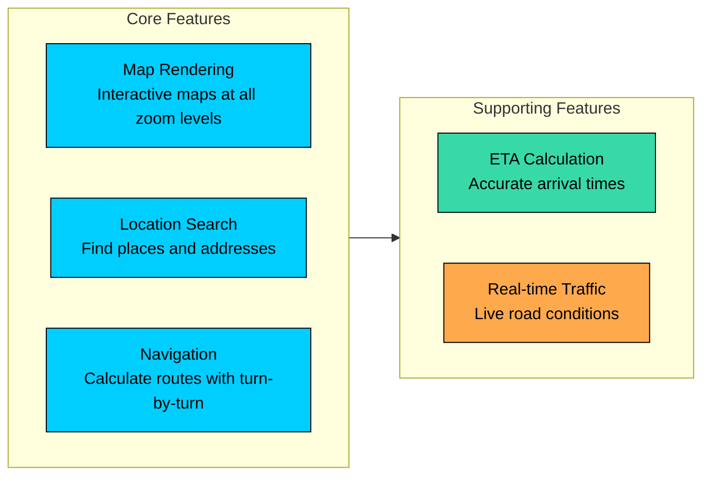
```mermaid
flowchart LR
    subgraph Core["Core Features"]
        direction LR
        MR[Map Rendering<br/>Interactive maps at all zoom levels]:::primary
        LS[Location Search<br/>Find places and addresses]:::primary
        NAV[Navigation<br/>Calculate routes with turn-by-turn]:::primary
    end

    subgraph Supporting["Supporting Features"]
        direction LR
        ETA[ETA Calculation<br/>Accurate arrival times]:::secondary
        TRAFFIC[Real-time Traffic<br/>Live road conditions]:::orange
    end

    Core --> Supporting

    classDef primary fill:#00ceff,stroke:#000,color:#000
    classDef secondary fill:#38d9a9,stroke:#000,color:#000
    classDef orange fill:#ffa94d,stroke:#000,color:#000
```

---

## 1.2 Non-Functional Requirements

Beyond features, we need to consider what makes the system production-ready at global scale:

- **Low Latency:** Map tiles should load within 200ms. Route calculations should complete within 1-2 seconds.
- **High Availability:** The system must be highly available (99.99%) since users depend on it for navigation.
- **Scalability:** Support billions of map tile requests and millions of navigation requests daily.
- **Global Coverage:** Serve users worldwide with consistent performance across regions.

---

# 2. Back-of-the-Envelope Estimation

Before diving into the architecture, let's run some calculations to understand the scale we are dealing with. These numbers will guide our decisions about storage, caching, and infrastructure.

### 2.1 Traffic Estimates

Starting with the numbers from our requirements discussion:

#### **Map Tile Requests**

Map tiles are the foundation of the visual experience. Every time a user pans or zooms, the app requests new tiles. Let's estimate the volume:

This is an enormous number. To put it in perspective, 1.4 million requests per second means we need a highly distributed system with aggressive caching. There is no way a centralized architecture can handle this.

#### **Navigation Requests**

Navigation requests are more compute-intensive but less frequent:

While 3,500 QPS might seem modest compared to tile requests, each navigation request requires complex graph computation. This is CPU-bound work that cannot be infinitely cached, since routes depend on real-time traffic.

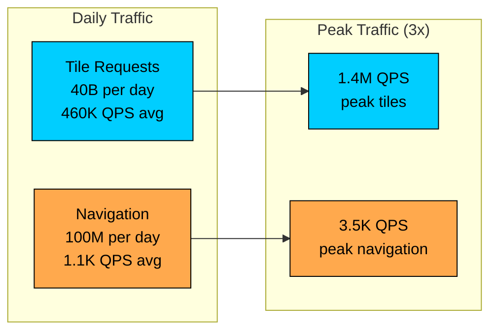
```mermaid
flowchart LR
    subgraph "Daily Traffic"
        direction TB
        T[Tile Requests<br/>40B per day<br/>460K QPS avg]:::primary
        N[Navigation<br/>100M per day<br/>1.1K QPS avg]:::orange
    end

    subgraph "Peak Traffic (3x)"
        direction TB
        TP[1.4M QPS<br/>peak tiles]:::primary
        NP[3.5K QPS<br/>peak navigation]:::orange
    end

    T --> TP
    N --> NP

    classDef primary fill:#00ceff,stroke:#000,color:#000
    classDef orange fill:#ffa94d,stroke:#000,color:#000
```

### 2.2 Storage Estimates

Map storage is where things get interesting. We need to store pre-rendered tiles for the entire world at multiple zoom levels.

#### **Map Tile Storage**

But we do not just store one zoom level. We need tiles from zoom level 0 (entire world in one tile) to level 18 or higher (individual buildings visible). Fortunately, lower zoom levels have far fewer tiles:

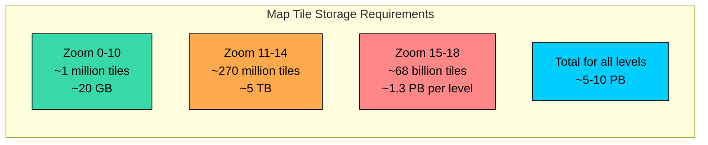
```mermaid
flowchart TB
    subgraph Storage["Map Tile Storage Requirements"]
        direction TB
        Z0["Zoom 0-10<br/>~1 million tiles<br/>~20 GB"]:::secondary
        Z11["Zoom 11-14<br/>~270 million tiles<br/>~5 TB"]:::orange
        Z15["Zoom 15-18<br/>~68 billion tiles<br/>~1.3 PB per level"]:::red
        TOTAL["Total for all levels<br/>~5-10 PB"]:::primary
    end

    classDef primary fill:#00ceff,stroke:#000,color:#000
    classDef secondary fill:#38d9a9,stroke:#000,color:#000
    classDef orange fill:#ffa94d,stroke:#000,color:#000
    classDef red fill:#ff8787,stroke:#000,color:#000
```

#### **Road Network Graph**

The road network is a graph where nodes are intersections and edges are road segments:

This is actually quite manageable. The road graph can fit in memory on a single large server, though we will want to distribute it for availability and to reduce latency.

### 2.3 Key Insights

These estimates reveal several important design implications:

1. **Tile serving is the bottleneck:** With 1.4 million QPS at peak, we need a massively distributed caching layer. CDNs are essential, not optional.
2. **Navigation is compute-intensive:** While QPS is lower, each request requires graph traversal on a billion-edge graph. We need algorithmic optimizations, not just more servers.
3. **Storage is substantial but manageable:** Petabytes of tiles can be handled with object storage. The road graph fits in memory, which is good for performance.
4. **Geographic distribution is critical:** Users are distributed globally, and latency matters. We need data centers and CDN edge nodes worldwide.

---

# 3. Core APIs

With our requirements and scale understood, let's define the API contract. Our mapping service needs three main APIs: one for map tiles, one for location search, and one for directions.

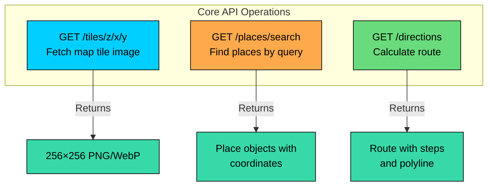
```mermaid
flowchart TB
    subgraph "Core API Operations"
        TILES[GET /tiles/z/x/y<br/>Fetch map tile image]:::primary
        SEARCH[GET /places/search<br/>Find places by query]:::orange
        DIRECTIONS[GET /directions<br/>Calculate route]:::green
    end

    TILES --> |Returns| IMG[256×256 PNG/WebP]:::secondary
    SEARCH --> |Returns| PLACES[Place objects with<br/>coordinates]:::secondary
    DIRECTIONS --> |Returns| ROUTE[Route with steps<br/>and polyline]:::secondary

    classDef primary fill:#00ceff,stroke:#000,color:#000
    classDef orange fill:#ffa94d,stroke:#000,color:#000
    classDef green fill:#69db7c,stroke:#000,color:#000
    classDef secondary fill:#38d9a9,stroke:#000,color:#000
```

### 3.1 Get Map Tiles

#### **Endpoint:** `GET /tiles/{zoom}/{x}/{y}`

This is our highest-volume endpoint. It returns a single map tile image for the specified coordinates and zoom level.

#### **Path Parameters:**

| Parameter | Type | Description |
|-----------|------|-------------|
| `zoom` | integer | Zoom level (0-22). Level 0 shows the entire world, level 18+ shows street details |
| `x` | integer | Tile column number (0 to 2^zoom - 1) |
| `y` | integer | Tile row number (0 to 2^zoom - 1) |

#### **Query Parameters:**

| Parameter | Type | Required | Description |
|-----------|------|----------|-------------|
| `style` | string | No | Map style: "roadmap", "satellite", "terrain", or "hybrid". Defaults to "roadmap" |

#### **Response:**

Returns a 256×256 pixel PNG or WebP image. Response headers include aggressive cache-control directives since tiles rarely change:

#### **Error Responses:**

| Status Code | Meaning | When It Occurs |
|-------------|---------|----------------|
| `400 Bad Request` | Invalid parameters | Zoom level out of range or invalid x/y coordinates |
| `404 Not Found` | Tile does not exist | Coordinates are valid but tile is not generated (ocean, etc.) |

The key design decision here is making tiles infinitely cacheable. Map geometry changes infrequently, so we can cache for a year and use ETags for revalidation.

### 3.2 Search Places

#### **Endpoint:** `GET /places/search`

Searches for places matching a query string, with optional location biasing.

#### **Query Parameters:**

| Parameter | Type | Required | Description |
|-----------|------|----------|-------------|
| `query` | string | Yes | Search string (e.g., "coffee shops", "123 Main St", "SFO airport") |
| `location` | string | No | Latitude,longitude to bias results toward (e.g., "37.7749,-122.4194") |
| `radius` | integer | No | Search radius in meters. Only applies if location is provided |
| `limit` | integer | No | Maximum number of results (default: 10, max: 50) |

#### **Success Response (200 OK):**

#### **Error Responses:**

| Status Code | Meaning | When It Occurs |
|-------------|---------|----------------|
| `400 Bad Request` | Invalid input | Missing query or malformed location |
| `404 Not Found` | No results | Query returned zero matches |

### 3.3 Get Directions

#### **Endpoint:** `GET /directions`

Calculates a route between origin and destination with turn-by-turn directions.

#### **Query Parameters:**

| Parameter | Type | Required | Description |
|-----------|------|----------|-------------|
| `origin` | string | Yes | Starting point (lat,lng or place_id or address) |
| `destination` | string | Yes | End point (lat,lng or place_id or address) |
| `mode` | string | No | Transportation mode: "driving", "walking", "cycling". Defaults to "driving" |
| `departure_time` | integer | No | Unix timestamp for traffic-aware routing. Defaults to now |
| `alternatives` | boolean | No | If true, return up to 3 alternative routes |

#### **Success Response (200 OK):**

#### **Error Responses:**

| Status Code | Meaning | When It Occurs |
|-------------|---------|----------------|
| `400 Bad Request` | Invalid input | Cannot parse origin or destination |
| `404 Not Found` | No route found | No possible route between points (e.g., across oceans) |

Notice that we return both `duration_seconds` (without traffic) and `duration_in_traffic_seconds` (with current traffic). This helps users understand how much delay traffic is adding.

---

# 4. High-Level Design

Now we get to the heart of the design. Rather than presenting a complex diagram upfront, we will build the architecture incrementally, addressing one requirement at a time. This mirrors how you would approach the problem in an interview and makes the reasoning easier to follow.

Our system needs to handle three distinct operations:

1. **Map Rendering:** Serve pre-rendered map tiles with extremely low latency
2. **Location Search:** Find places based on text queries with geographic awareness
3. **Navigation:** Calculate optimal routes considering real-time traffic

Each of these has very different characteristics. Map tiles are static and highly cacheable. Location search requires text indexing and geospatial queries. Navigation involves complex graph algorithms with real-time data. Let's tackle them one by one.

## 4.1 Requirement 1: Map Rendering

When you open a mapping app and see a detailed street map, you are actually looking at dozens of small images stitched together seamlessly. These images, called tiles, are the fundamental building block of web-based mapping.

### Why Tiles"

Rendering the entire world as a single image would be absurd. At street-level detail, such an image would be trillions of pixels across. Instead, we divide the world into a grid of small squares, each 256×256 pixels. The client only requests and renders the tiles that are currently visible in the viewport.

This approach has several advantages:

- **Parallel loading:** The browser can fetch multiple tiles simultaneously
- **Aggressive caching:** Tiles can be cached at CDN edges worldwide
- **Progressive rendering:** Users see something immediately, even if not all tiles have loaded
- **Efficient updates:** When map data changes, we only re-render affected tiles

### The Tile Pyramid

Tiles are organized in a hierarchical structure called a tile pyramid. At zoom level 0, the entire world fits in a single tile. At zoom level 1, the world is divided into a 2×2 grid (4 tiles). At zoom level 2, it is a 4×4 grid (16 tiles), and so on.

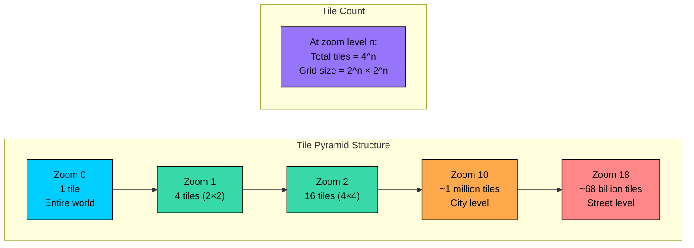
```mermaid
flowchart LR
    subgraph Pyramid["Tile Pyramid Structure"]
		direction LR
        Z0["Zoom 0<br/>1 tile<br/>Entire world"]:::primary
        Z1["Zoom 1<br/>4 tiles (2×2)"]:::secondary
        Z2["Zoom 2<br/>16 tiles (4×4)"]:::secondary
        Z10["Zoom 10<br/>~1 million tiles<br/>City level"]:::orange
        Z18["Zoom 18<br/>~68 billion tiles<br/>Street level"]:::red
    end

    Z0 --> Z1 --> Z2 --> Z10 --> Z18

    subgraph Formula["Tile Count"]
        F["At zoom level n:<br/>Total tiles = 4^n<br/>Grid size = 2^n × 2^n"]:::purple
    end

    classDef primary fill:#00ceff,stroke:#000,color:#000
    classDef secondary fill:#38d9a9,stroke:#000,color:#000
    classDef orange fill:#ffa94d,stroke:#000,color:#000
    classDef red fill:#ff8787,stroke:#000,color:#000
    classDef purple fill:#9775fa,stroke:#000,color:#000
```

Each tile is identified by three numbers: **(z, x, y)** where z is the zoom level, x is the column, and y is the row. Given a geographic coordinate (latitude, longitude), we can calculate exactly which tile contains that point at any zoom level.

### Components for Map Rendering

To serve tiles at the scale we calculated (1.4 million QPS at peak), we need a distributed architecture with multiple caching layers.

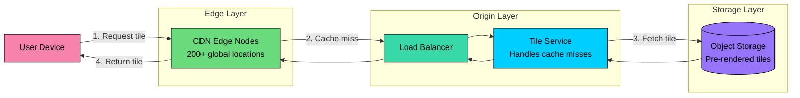
```mermaid
flowchart LR
    U[User Device]:::rose

    subgraph Edge["Edge Layer"]
        CDN[CDN Edge Nodes<br/>200+ global locations]:::green
    end

    subgraph Origin["Origin Layer"]
        LB[Load Balancer]:::secondary
        TS[Tile Service<br/>Handles cache misses]:::primary
    end

    subgraph Storage["Storage Layer"]
        S3[(Object Storage<br/>Pre-rendered tiles)]:::purple
    end

    U -->|"1. Request tile"| CDN
    CDN -->|"2. Cache miss"| LB
    LB --> TS
    TS -->|"3. Fetch tile"| S3
    S3 --> TS
    TS --> LB
    LB --> CDN
    CDN -->|"4. Return tile"| U

    classDef primary fill:#00ceff,stroke:#000,color:#000
    classDef secondary fill:#38d9a9,stroke:#000,color:#000
    classDef purple fill:#9775fa,stroke:#000,color:#000
    classDef rose fill:#f783ac,stroke:#000,color:#000
    classDef green fill:#69db7c,stroke:#000,color:#000
```

#### **CDN (Content Delivery Network)**

The CDN is our first and most important layer of defense against the traffic tsunami. With edge nodes in hundreds of locations worldwide, the CDN serves cached tiles from a location geographically close to the user.

For map tiles, we set extremely aggressive cache headers: `Cache-Control: public, max-age=31536000` (1 year). Since map geometry rarely changes, we can cache indefinitely and rely on cache invalidation when updates occur. This results in a 95%+ cache hit rate at the edge, meaning only 5% of requests ever reach our origin servers.

#### **Tile Service**

The Tile Service handles the small percentage of requests that miss the CDN cache. It retrieves tiles from object storage and can perform on-the-fly transformations if needed (different styles, overlays, etc.).

The service is stateless and horizontally scalable. Each instance independently handles requests without coordination, making it easy to add capacity during traffic spikes.

#### **Object Storage**

Pre-rendered tiles are stored in object storage like Amazon S3 or Google Cloud Storage. The storage is organized by zoom level and coordinates for efficient retrieval:

Object storage is the right choice here because tiles are static binary files with simple key-based access. We do not need database features like transactions or complex queries.

### The Tile Request Flow

Let's trace what happens when a user pans to a new area of the map:

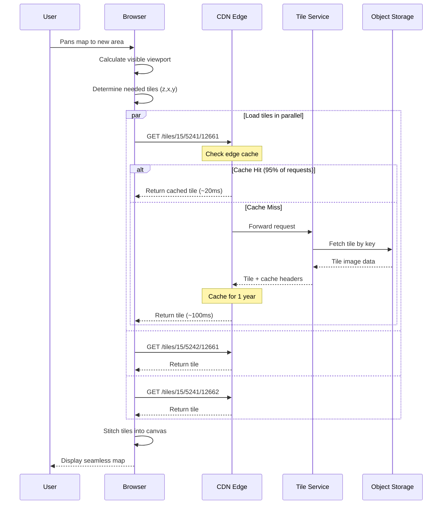
```mermaid
sequenceDiagram
    participant User
    participant Browser
    participant CDN as CDN Edge
    participant TS as Tile Service
    participant S3 as Object Storage

    User->>Browser: Pans map to new area
    Browser->>Browser: Calculate visible viewport
    Browser->>Browser: Determine needed tiles (z,x,y)

    par Load tiles in parallel
        Browser->>CDN: GET /tiles/15/5241/12661
        Note over CDN: Check edge cache
        alt Cache Hit (95% of requests)
            CDN-->>Browser: Return cached tile (~20ms)
        else Cache Miss
            CDN->>TS: Forward request
            TS->>S3: Fetch tile by key
            S3-->>TS: Tile image data
            TS-->>CDN: Tile + cache headers
            Note over CDN: Cache for 1 year
            CDN-->>Browser: Return tile (~100ms)
        end
    and
        Browser->>CDN: GET /tiles/15/5242/12661
        CDN-->>Browser: Return tile
    and
        Browser->>CDN: GET /tiles/15/5241/12662
        CDN-->>Browser: Return tile
    end

    Browser->>Browser: Stitch tiles into canvas
    Browser-->>User: Display seamless map
```

The key insight is that most users see most tiles from cache. When you view San Francisco, millions of other users have already viewed those same tiles, so they are warm in the CDN cache. Only truly obscure areas or fresh data require a trip to origin.

---

## 4.2 Requirement 2: Location Search

Users need to find places by name, address, or category. A good search experience handles typos, understands context ("coffee" means coffee shops, not coffee beans), and ranks results by relevance and proximity.

This is fundamentally different from tile serving. Tiles are static and cacheable; search is dynamic and personalized (results depend on the user's location). We need different infrastructure.

### Components for Location Search

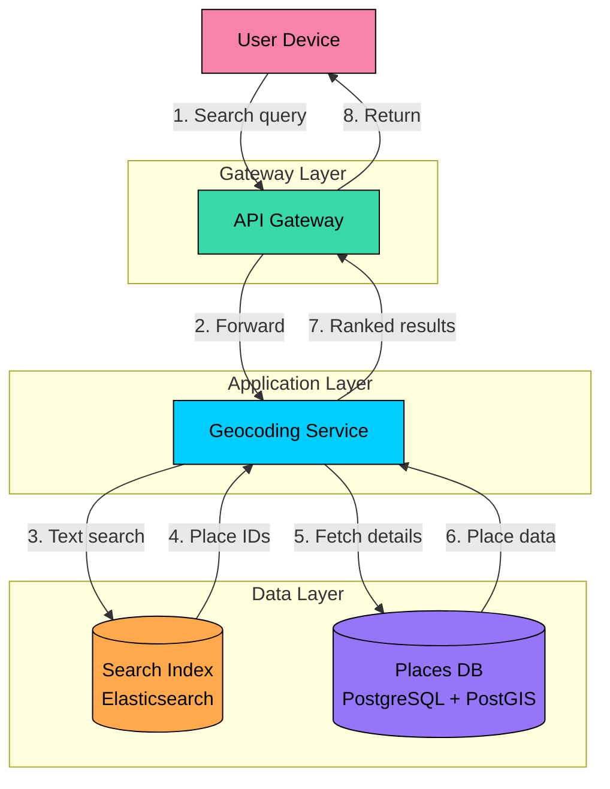
```mermaid
flowchart TB
    U[User Device]:::rose

    subgraph Gateway["Gateway Layer"]
        API[API Gateway]:::secondary
    end

    subgraph Services["Application Layer"]
        GS[Geocoding Service]:::primary
    end

    subgraph Data["Data Layer"]
        SI[(Search Index<br/>Elasticsearch)]:::orange
        PD[(Places DB<br/>PostgreSQL + PostGIS)]:::purple
    end

    U -->|"1. Search query"| API
    API -->|"2. Forward"| GS
    GS -->|"3. Text search"| SI
    SI -->|"4. Place IDs"| GS
    GS -->|"5. Fetch details"| PD
    PD -->|"6. Place data"| GS
    GS -->|"7. Ranked results"| API
    API -->|"8. Return"| U

    classDef primary fill:#00ceff,stroke:#000,color:#000
    classDef secondary fill:#38d9a9,stroke:#000,color:#000
    classDef purple fill:#9775fa,stroke:#000,color:#000
    classDef orange fill:#ffa94d,stroke:#000,color:#000
    classDef rose fill:#f783ac,stroke:#000,color:#000
```

#### **Geocoding Service**

The Geocoding Service is responsible for converting human-readable queries into geographic coordinates. This is called geocoding. The reverse operation, converting coordinates to an address, is called reverse geocoding.

The service handles several types of queries:

- **Addresses:** "123 Main Street, San Francisco" → (37.7749, -122.4194)
- **Place names:** "Golden Gate Bridge" → (37.8199, -122.4783)
- **Categories:** "coffee shops near me" → [list of nearby coffee shops]

#### **Search Index**

We use a search engine like Elasticsearch to power fast text search. The index contains:

- Place names and aliases ("SF" → "San Francisco")
- Addresses and address components
- Categories and keywords
- Geographic coordinates for location-based filtering

The index supports fuzzy matching (finding "Starbuks" when the user meant "Starbucks"), prefix search for autocomplete, and geospatial queries.

#### **Places Database**

The Places Database (PostgreSQL with PostGIS extension) stores the complete record for each place: name, address, coordinates, business hours, phone number, ratings, photos, and more. The search index returns place IDs; we then hydrate full records from this database.

Why separate the search index from the database" Because they are optimized for different things. Elasticsearch excels at text search and fuzzy matching. PostgreSQL excels at storing structured data with referential integrity. Using both gives us the best of both worlds.

### The Search Flow

Let's trace a search request from the user's perspective:

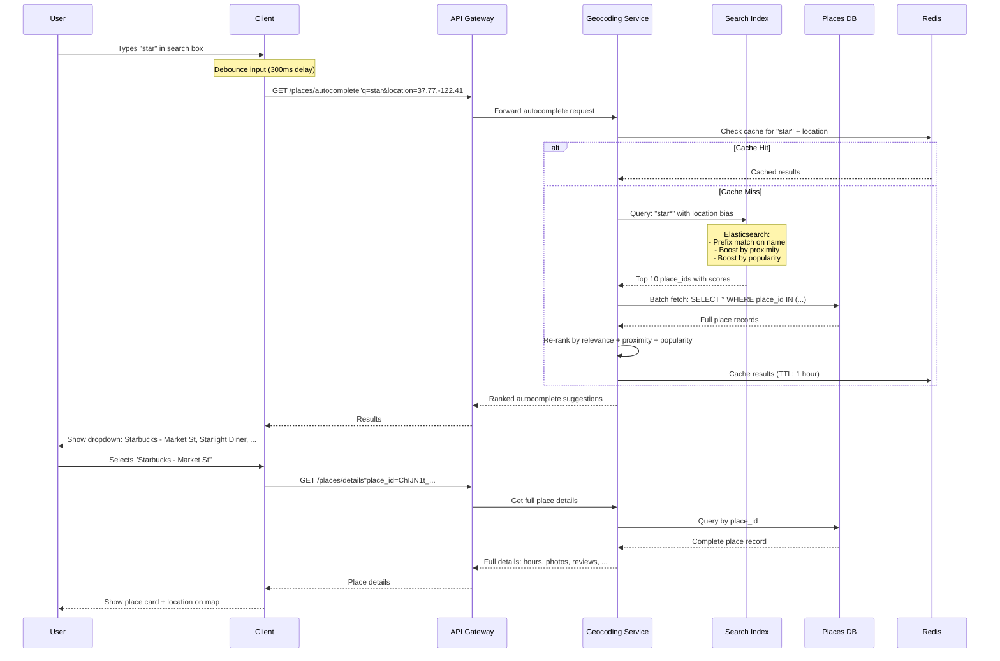
```mermaid
sequenceDiagram
    participant User
    participant Client
    participant API as API Gateway
    participant Geo as Geocoding Service
    participant Search as Search Index
    participant Places as Places DB
    participant Cache as Redis

    User->>Client: Types "star" in search box
    Note over Client: Debounce input (300ms delay)

    Client->>API: GET /places/autocomplete"q=star&location=37.77,-122.41

    API->>Geo: Forward autocomplete request

    Geo->>Cache: Check cache for "star" + location
    alt Cache Hit
        Cache-->>Geo: Cached results
    else Cache Miss
        Geo->>Search: Query: "star*" with location bias
        Note over Search: Elasticsearch:<br/>- Prefix match on name<br/>- Boost by proximity<br/>- Boost by popularity

        Search-->>Geo: Top 10 place_ids with scores

        Geo->>Places: Batch fetch: SELECT * WHERE place_id IN (...)
        Places-->>Geo: Full place records

        Geo->>Geo: Re-rank by relevance + proximity + popularity

        Geo->>Cache: Cache results (TTL: 1 hour)
    end

    Geo-->>API: Ranked autocomplete suggestions
    API-->>Client: Results

    Client-->>User: Show dropdown: Starbucks - Market St, Starlight Diner, ...

    User->>Client: Selects "Starbucks - Market St"
    Client->>API: GET /places/details"place_id=ChIJN1t_...

    API->>Geo: Get full place details
    Geo->>Places: Query by place_id
    Places-->>Geo: Complete place record

    Geo-->>API: Full details: hours, photos, reviews, ...
    API-->>Client: Place details
    Client-->>User: Show place card + location on map
```

Notice the caching layer. Common searches like "Starbucks" or "gas station" near popular locations are cached to avoid hitting the search index repeatedly. The cache is keyed on (query, location_bucket) where location_bucket is a coarse grid cell.

---

## 4.3 Requirement 3: Navigation and Routing

Navigation is the crown jewel of a mapping service. It is also the most computationally challenging. Finding the optimal route between two points requires traversing a graph with billions of edges, incorporating real-time traffic data, and doing it all in under 2 seconds.

### The Road Network Graph

We model the road network as a weighted directed graph:

- **Nodes:** Intersections, road endpoints, and significant waypoints
- **Edges:** Road segments connecting nodes
- **Weights:** Travel time (which varies based on traffic)

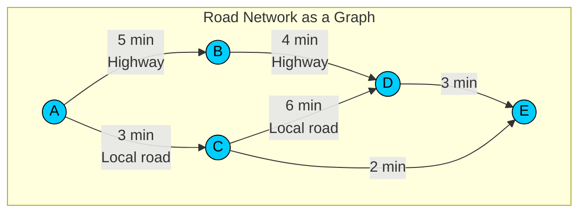
```mermaid
flowchart TB
    subgraph RoadGraph["Road Network as a Graph"]
        A((A)):::primary
        B((B)):::primary
        C((C)):::primary
        D((D)):::primary
        E((E)):::primary

        A -->|"5 min<br/>Highway"| B
        A -->|"3 min<br/>Local road"| C
        B -->|"4 min<br/>Highway"| D
        C -->|"6 min<br/>Local road"| D
        C -->|"2 min"| E
        D -->|"3 min"| E
    end

    classDef primary fill:#00ceff,stroke:#000,color:#000
```

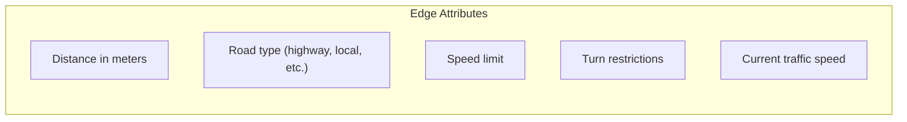
```mermaid
flowchart LR

    subgraph Legend["Edge Attributes"]
        L1["Distance in meters"]
        L2["Road type (highway, local, etc.)"]
        L3["Speed limit"]
        L4["Turn restrictions"]
        L5["Current traffic speed"]
    end

    classDef primary fill:#00ceff,stroke:#000,color:#000
```

The graph is directed because some roads are one-way, and weights differ by direction (uphill is slower than downhill). Edges also carry metadata like road name, road type, and restrictions.

### Components for Navigation

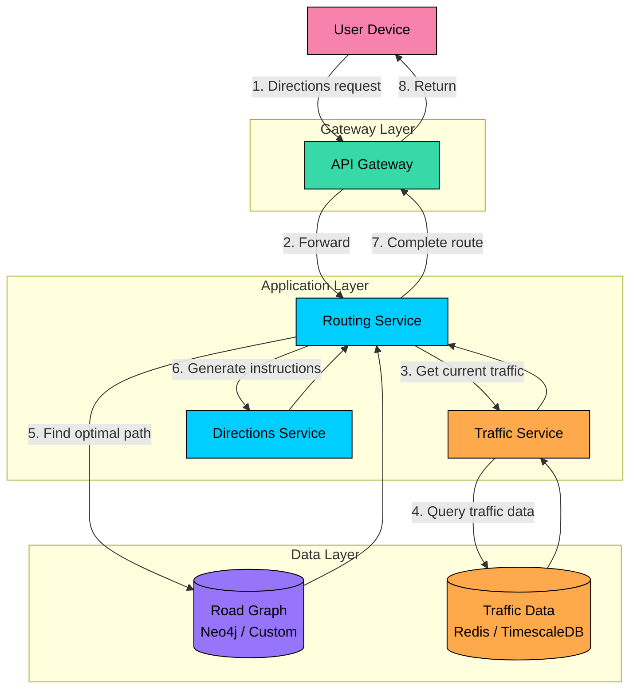
```mermaid
flowchart TB
    U[User Device]:::rose

    subgraph Gateway["Gateway Layer"]
        API[API Gateway]:::secondary
    end

    subgraph Services["Application Layer"]
        RS[Routing Service]:::primary
        TS[Traffic Service]:::orange
        DS[Directions Service]:::primary
    end

    subgraph Data["Data Layer"]
        RG[(Road Graph<br/>Neo4j / Custom)]:::purple
        TD[(Traffic Data<br/>Redis / TimescaleDB)]:::orange
    end

    U -->|"1. Directions request"| API
    API -->|"2. Forward"| RS
    RS -->|"3. Get current traffic"| TS
    TS -->|"4. Query traffic data"| TD
    TD --> TS
    TS --> RS
    RS -->|"5. Find optimal path"| RG
    RG --> RS
    RS -->|"6. Generate instructions"| DS
    DS --> RS
    RS -->|"7. Complete route"| API
    API -->|"8. Return"| U

    classDef primary fill:#00ceff,stroke:#000,color:#000
    classDef secondary fill:#38d9a9,stroke:#000,color:#000
    classDef purple fill:#9775fa,stroke:#000,color:#000
    classDef orange fill:#ffa94d,stroke:#000,color:#000
    classDef rose fill:#f783ac,stroke:#000,color:#000
```

#### **Routing Service**

The Routing Service is the brain of navigation. It receives an origin and destination, queries the Traffic Service for current road conditions, and runs graph algorithms on the Road Graph to find the optimal path.

The service handles various complexities:

- Converting addresses to coordinates (using the Geocoding Service)
- Snapping coordinates to the nearest road
- Respecting turn restrictions and one-way streets
- Finding alternative routes for user choice
- Handling edge cases like routing across ferry connections

#### **Traffic Service**

The Traffic Service collects and processes real-time traffic data from multiple sources:

- GPS probe data from millions of mobile devices
- Historical traffic patterns by time of day
- Incident reports (accidents, construction)
- Road sensors on major highways

It provides current travel times for road segments, which the Routing Service uses as edge weights in the graph.

#### **Directions Service**

Once the Routing Service finds the optimal path (a sequence of nodes/edges), the Directions Service converts it into human-readable instructions:

- "Head north on Market Street toward 5th Street"
- "Turn right onto 5th Street"
- "Merge onto US-101 South"
- "Take exit 429 toward SFO Airport"

It also encodes the route as a polyline for rendering on the map.

### The Navigation Flow

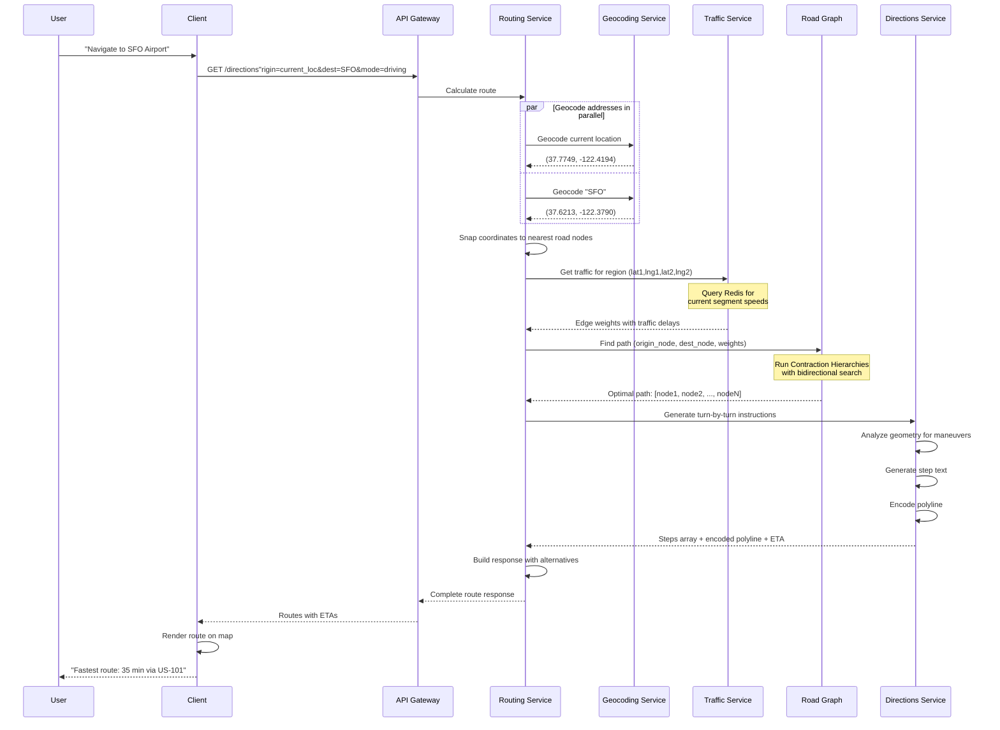
```mermaid
sequenceDiagram
    participant User
    participant Client
    participant API as API Gateway
    participant Route as Routing Service
    participant Geo as Geocoding Service
    participant Traffic as Traffic Service
    participant Graph as Road Graph
    participant Dir as Directions Service

    User->>Client: "Navigate to SFO Airport"

    Client->>API: GET /directions"rigin=current_loc&dest=SFO&mode=driving

    API->>Route: Calculate route

    par Geocode addresses in parallel
        Route->>Geo: Geocode current location
        Geo-->>Route: (37.7749, -122.4194)
    and
        Route->>Geo: Geocode "SFO"
        Geo-->>Route: (37.6213, -122.3790)
    end

    Route->>Route: Snap coordinates to nearest road nodes

    Route->>Traffic: Get traffic for region (lat1,lng1,lat2,lng2)
    Note over Traffic: Query Redis for<br/>current segment speeds
    Traffic-->>Route: Edge weights with traffic delays

    Route->>Graph: Find path (origin_node, dest_node, weights)
    Note over Graph: Run Contraction Hierarchies<br/>with bidirectional search

    Graph-->>Route: Optimal path: [node1, node2, ..., nodeN]

    Route->>Dir: Generate turn-by-turn instructions
    Dir->>Dir: Analyze geometry for maneuvers
    Dir->>Dir: Generate step text
    Dir->>Dir: Encode polyline
    Dir-->>Route: Steps array + encoded polyline + ETA

    Route->>Route: Build response with alternatives

    Route-->>API: Complete route response
    API-->>Client: Routes with ETAs

    Client->>Client: Render route on map
    Client-->>User: "Fastest route: 35 min via US-101"
```

---

## 4.4 Putting It All Together

Now let's combine all the components into a complete architecture. Each layer has a specific responsibility, and the components work together to deliver the mapping experience.

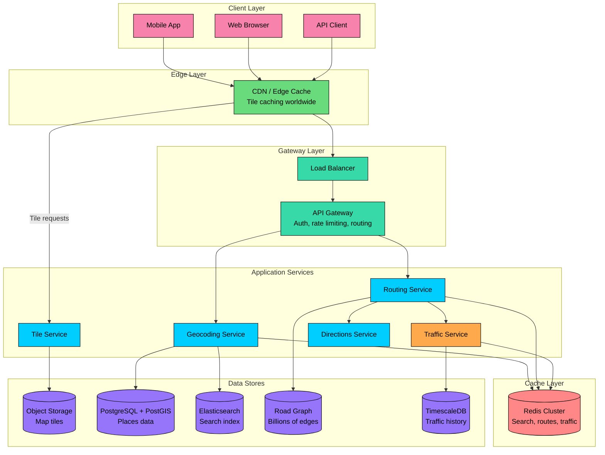
```mermaid
flowchart TB
    subgraph Clients["Client Layer"]
        direction LR
        Mobile[Mobile App]:::rose
        Web[Web Browser]:::rose
        API_Client[API Client]:::rose
    end

    subgraph Edge["Edge Layer"]
        CDN[CDN / Edge Cache<br/>Tile caching worldwide]:::green
    end

    subgraph Gateway["Gateway Layer"]
        LB[Load Balancer]:::secondary
        API[API Gateway<br/>Auth, rate limiting, routing]:::secondary
    end

    subgraph Services["Application Services"]
        direction LR
        TileS[Tile Service]:::primary
        GeoS[Geocoding Service]:::primary
        RouteS[Routing Service]:::primary
        TrafficS[Traffic Service]:::orange
        DirS[Directions Service]:::primary
    end

    subgraph Cache["Cache Layer"]
        Redis[(Redis Cluster<br/>Search, routes, traffic)]:::red
    end

    subgraph Data["Data Stores"]
        direction LR
        TileStore[(Object Storage<br/>Map tiles)]:::purple
        PlacesDB[(PostgreSQL + PostGIS<br/>Places data)]:::purple
        SearchIdx[(Elasticsearch<br/>Search index)]:::purple
        GraphDB[(Road Graph<br/>Billions of edges)]:::purple
        TrafficDB[(TimescaleDB<br/>Traffic history)]:::purple
    end

    Mobile & Web & API_Client --> CDN
    CDN -->|Tile requests| TileS
    CDN --> LB --> API
    API --> GeoS
    API --> RouteS
    TileS --> TileStore
    GeoS --> Redis
    GeoS --> SearchIdx
    GeoS --> PlacesDB
    RouteS --> Redis
    RouteS --> TrafficS
    RouteS --> GraphDB
    RouteS --> DirS
    TrafficS --> Redis
    TrafficS --> TrafficDB

    classDef primary fill:#00ceff,stroke:#000,color:#000
    classDef secondary fill:#38d9a9,stroke:#000,color:#000
    classDef purple fill:#9775fa,stroke:#000,color:#000
    classDef orange fill:#ffa94d,stroke:#000,color:#000
    classDef rose fill:#f783ac,stroke:#000,color:#000
    classDef green fill:#69db7c,stroke:#000,color:#000
    classDef red fill:#ff8787,stroke:#000,color:#000
```

### Component Responsibilities Summary

| Component | Primary Responsibility | Scaling Strategy |
|-----------|----------------------|------------------|
| CDN | Global tile caching, DDoS protection | Managed service (auto-scales) |
| Load Balancer | Traffic distribution, health checks | Managed service |
| API Gateway | Auth, rate limiting, request routing | Horizontal (stateless) |
| Tile Service | Serve tiles on cache miss | Horizontal (stateless) |
| Geocoding Service | Address/place search | Horizontal (stateless) |
| Routing Service | Calculate optimal routes | Horizontal (graph is read-only) |
| Traffic Service | Aggregate and serve traffic data | Horizontal with sharding by region |
| Directions Service | Generate turn-by-turn instructions | Horizontal (stateless) |
| Redis Cache | Cache search results, routes, traffic | Redis Cluster |
| Object Storage | Store map tiles | Managed (infinite scale) |
| PostgreSQL + PostGIS | Store places with geospatial queries | Read replicas by region |
| Elasticsearch | Power text search | Cluster with sharding |
| Road Graph | Store network for routing | Replicated by region |
| TimescaleDB | Store traffic time-series | Sharded by time and region |

---

# 5. Database Design

With the high-level architecture in place, let's dive into the data layer. Different types of data have different access patterns, and we will use different storage solutions accordingly.

## 5.1 Choosing the Right Databases

Our system handles four main types of data, each with unique requirements:

#### **Map Tiles**

- Billions of static binary files (images)
- Simple key-based access: given (z, x, y), return the tile
- Extremely read-heavy with aggressive caching
- **Choice:** Object storage (S3, GCS) with CDN

#### **Places Data**

- Structured data with multiple fields
- Complex queries: full-text search, geospatial filtering, sorting
- Need to support "near me" queries efficiently
- **Choice:** PostgreSQL with PostGIS extension + Elasticsearch for search

#### **Road Network**

- Graph structure with nodes (intersections) and edges (road segments)
- Access pattern is graph traversal: given a node, find neighbors
- Need to support shortest-path algorithms efficiently
- **Choice:** Custom in-memory graph structure or Neo4j

#### **Traffic Data**

- Time-series data with high write throughput
- Queries by road segment and time range
- Need current data (last 5 minutes) with very low latency
- **Choice:** Redis for current state, TimescaleDB for history

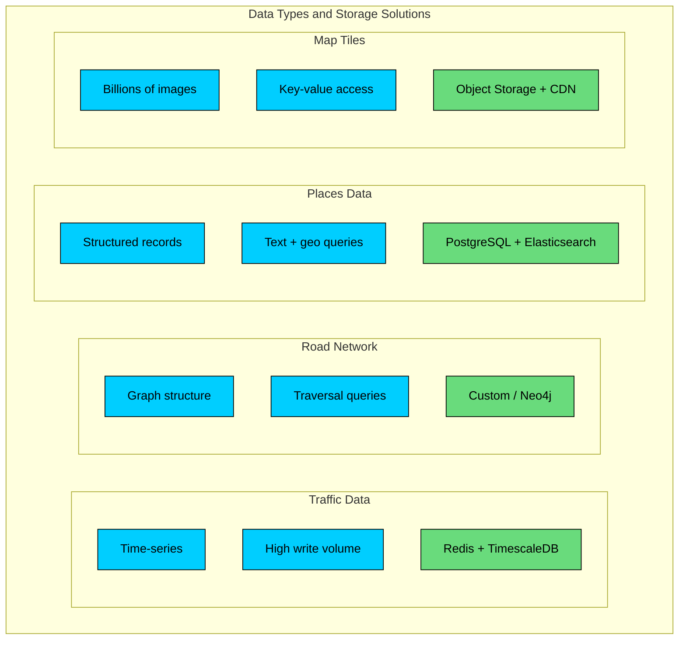
```mermaid
flowchart TB
    subgraph DataTypes["Data Types and Storage Solutions"]
        direction LR

        subgraph Traffic["Traffic Data"]
            TR1[Time-series]:::primary
            TR2[High write volume]:::primary
            TR3[Redis + TimescaleDB]:::green
        end

        subgraph Roads["Road Network"]
            R1[Graph structure]:::primary
            R2[Traversal queries]:::primary
            R3[Custom / Neo4j]:::green
        end

        subgraph Places["Places Data"]
            P1[Structured records]:::primary
            P2[Text + geo queries]:::primary
            P3[PostgreSQL + Elasticsearch]:::green
        end		
		
	    subgraph Tiles["Map Tiles"]
            T1[Billions of images]:::primary
            T2[Key-value access]:::primary
            T3[Object Storage + CDN]:::green
        end	
    end

    classDef primary fill:#00ceff,stroke:#000,color:#000
    classDef green fill:#69db7c,stroke:#000,color:#000
```

## 5.2 Database Schema

### Places Table

This is the core table for location search. Each row represents a searchable location.

| Field | Type | Description |
|-------|------|-------------|
| `place_id` | VARCHAR(64) PK | Unique identifier (e.g., "ChIJN1t_...") |
| `name` | VARCHAR(255) | Display name of the place |
| `address` | VARCHAR(500) | Formatted address |
| `latitude` | DOUBLE | Geographic latitude |
| `longitude` | DOUBLE | Geographic longitude |
| `location` | GEOMETRY(POINT) | PostGIS point for spatial queries |
| `geohash` | VARCHAR(12) | Geohash for grid-based queries |
| `rating` | FLOAT | Average user rating (1-5) |
| `review_count` | INTEGER | Number of reviews |
| `phone` | VARCHAR(20) | Contact phone number |
| `website` | VARCHAR(255) | Business website |
| `hours` | JSONB | Operating hours by day |
| `updated_at` | TIMESTAMP | Last update time |

**Indexes:**

### Road Nodes and Edges Tables

The road network is stored as a graph with separate tables for nodes and edges.

**Road Nodes:**

| Field | Type | Description |
|-------|------|-------------|
| `node_id` | BIGINT PK | Unique node identifier |
| `latitude` | DOUBLE | Geographic latitude |
| `longitude` | DOUBLE | Geographic longitude |
| `geohash` | VARCHAR(12) | For geographic partitioning |

**Road Edges:**

| Field | Type | Description |
|-------|------|-------------|
| `edge_id` | BIGINT PK | Unique edge identifier |
| `from_node` | BIGINT FK | Starting node |
| `to_node` | BIGINT FK | Ending node |
| `distance_meters` | INTEGER | Length of road segment |
| `road_type` | VARCHAR(20) | Highway, primary, secondary, residential, etc. |
| `speed_limit_kmh` | INTEGER | Posted speed limit |
| `is_oneway` | BOOLEAN | One-way restriction |
| `road_name` | VARCHAR(255) | Name of the road |
| `linestring` | GEOMETRY | Actual road shape for rendering |

**Indexes:**

In practice, for routing algorithms, the graph is loaded into memory for faster traversal. The database serves as persistent storage and is used to rebuild the in-memory graph after updates.

### Traffic Segments Table

Stores real-time traffic information. This is time-series data with high write volume.

| Field | Type | Description |
|-------|------|-------------|
| `edge_id` | BIGINT | Reference to road edge |
| `recorded_at` | TIMESTAMP | When this data was recorded |
| `current_speed_kmh` | INTEGER | Current average speed |
| `free_flow_speed_kmh` | INTEGER | Speed under ideal conditions |
| `congestion_level` | VARCHAR(20) | free, light, moderate, heavy, severe |
| `incidents` | JSONB | Active incidents (accidents, construction) |

This table uses TimescaleDB's hypertable partitioning by time, allowing efficient queries for recent data and automatic expiration of old data.

---

# 6. Design Deep Dive

The high-level architecture gives us a solid foundation, but system design interviews often go deeper into specific components. In this section, we will explore the key technical challenges: efficient tile systems, geospatial indexing, routing algorithms, and real-time traffic processing.

## 6.1 Map Tile System Deep Dive

The tile system seems simple on the surface, but there are important design decisions that affect storage, performance, and flexibility.

### Vector Tiles vs. Raster Tiles

There are two fundamentally different approaches to tile rendering:

**Raster Tiles (Traditional)**

Pre-rendered PNG or JPEG images. The server does all the rendering work upfront, and clients simply display the images.

**Vector Tiles (Modern)**

Tiles contain raw geographic data (roads, buildings, labels) in a compact binary format. Rendering happens on the client's GPU.

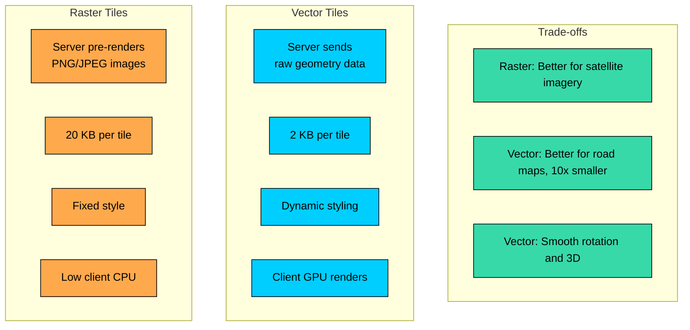
```mermaid
flowchart TB

    subgraph Comparison["Trade-offs"]
        C1["Raster: Better for satellite imagery"]:::secondary
        C2["Vector: Better for road maps, 10x smaller"]:::secondary
        C3["Vector: Smooth rotation and 3D"]:::secondary
    end
	
    subgraph Vector["Vector Tiles"]
        V1["Server sends<br/>raw geometry data"]:::primary
        V2["2 KB per tile"]:::primary
        V3["Dynamic styling"]:::primary
        V4["Client GPU renders"]:::primary
    end	
	
    subgraph Raster["Raster Tiles"]
        R1["Server pre-renders<br/>PNG/JPEG images"]:::orange
        R2["20 KB per tile"]:::orange
        R3["Fixed style"]:::orange
        R4["Low client CPU"]:::orange
    end	

    classDef primary fill:#00ceff,stroke:#000,color:#000
    classDef orange fill:#ffa94d,stroke:#000,color:#000
    classDef secondary fill:#38d9a9,stroke:#000,color:#000
```

**Recommendation:** Use vector tiles for road maps (smaller, flexible, smooth zooming) and raster tiles for satellite imagery (cannot be vectorized).

### Storage Optimization

Not all zoom levels need full global coverage. We can save petabytes by being selective:

| Zoom Range | Coverage | Size | Notes |
|------------|----------|------|-------|
| 0-10 | Full global | ~20 GB | Country to city level |
| 11-14 | Urban + suburban | ~5 TB | Skip empty ocean/desert |
| 15-18 | Dense urban only | ~500 TB | Skip rural areas |
| 19+ | On-demand | N/A | Generated when requested |

This selective coverage reduces storage from 10 PB to under 1 PB while still providing excellent coverage for where users actually look.

### CDN Caching Strategy

Map tiles are perfect for CDN caching because they are immutable once generated. Our caching strategy:

- **Cache-Control:** `public, max-age=31536000, immutable` (1 year, immutable flag tells browsers this will never change)
- **ETags:** Include content hash for conditional requests
- **Cache invalidation:** When map data updates, generate new tile versions with new ETags

With this strategy, we achieve 95%+ CDN hit rates. The remaining 5% are either cold tiles (obscure locations) or the first request after a map update.

---

## 6.2 Geospatial Indexing

"Near me" queries are fundamental to location search. We need to efficiently answer: "What places are within 1km of my current location"" Several data structures help with this.

### Geohash

Geohash encodes latitude/longitude into a string where nearby locations share common prefixes.

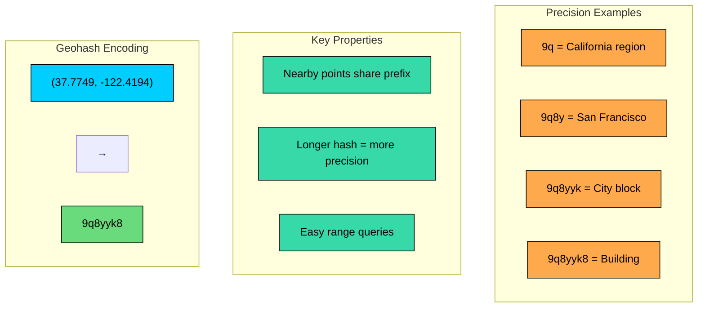
```mermaid
flowchart TB

    subgraph Examples["Precision Examples"]
        E1["9q = California region"]:::orange
        E2["9q8y = San Francisco"]:::orange
        E3["9q8yyk = City block"]:::orange
        E4["9q8yyk8 = Building"]:::orange
    end
	
    subgraph Properties["Key Properties"]
        P1["Nearby points share prefix"]:::secondary
        P2["Longer hash = more precision"]:::secondary
        P3["Easy range queries"]:::secondary
    end	
	
    subgraph Encoding["Geohash Encoding"]
        COORD["(37.7749, -122.4194)"]:::primary
        ARROW1["→"]
        HASH["9q8yyk8"]:::green
    end	

    classDef primary fill:#00ceff,stroke:#000,color:#000
    classDef secondary fill:#38d9a9,stroke:#000,color:#000
    classDef orange fill:#ffa94d,stroke:#000,color:#000
    classDef green fill:#69db7c,stroke:#000,color:#000
```

**How we use it:** Store geohash as a column, index it, and query with prefix matching. To find places near `9q8yyk`, we query for all places where `geohash LIKE '9q8yyk%'`. This is much faster than calculating distances for every place in the database.

**Limitation:** Geohash cells are rectangular and do not perfectly match circular distance queries. We typically query a slightly larger area (neighboring cells) and filter by exact distance.

---

### R-Tree / PostGIS

For precise geospatial queries, PostgreSQL with PostGIS provides R-tree indexes that support:

PostGIS uses spatial indexes (GiST) that efficiently handle these queries without scanning all rows.

### Search Ranking

Finding nearby places is just the first step. We also need to rank them by relevance. Our ranking considers:

```mermaid
flowchart LR
    Q["Query: coffee near me"]:::primary

    subgraph Factors["Ranking Factors"]
        direction TB
        F1["Text Relevance (40%)<br/>How well does coffee match""]:::orange
        F2["Proximity (35%)<br/>How close is it""]:::orange
        F3["Popularity (15%)<br/>Ratings, reviews, visits"]:::orange
        F4["Freshness (10%)<br/>Recently updated data"]:::orange
    end

    subgraph Final["Final Score"]
        S["Weighted combination<br/>→ Ranked results"]:::green
    end

    Q --> F1
    F4 --> S

    classDef primary fill:#00ceff,stroke:#000,color:#000
    classDef orange fill:#ffa94d,stroke:#000,color:#000
    classDef green fill:#69db7c,stroke:#000,color:#000
```

---

## 6.3 Routing Algorithms

Finding the optimal route in a graph with billions of edges is computationally expensive. Standard algorithms like Dijkstra's would take minutes. We need smarter approaches.

### Why Dijkstra Is Not Enough

Dijkstra's algorithm explores nodes in order of distance from the source. For a cross-country route, it might explore millions of nodes before finding the destination. At 1,150 navigation QPS, this is far too slow.

### Contraction Hierarchies

This is the industry-standard algorithm for long-distance routing. The key insight is that highway networks are hierarchical: you take local roads to reach a highway, highways to cross the country, and local roads again at the destination.

#### **Preprocessing Phase (runs offline):**

1. Order nodes by "importance" (highways > main roads > local streets)
2. Contract less important nodes by adding shortcuts
3. Store the hierarchy

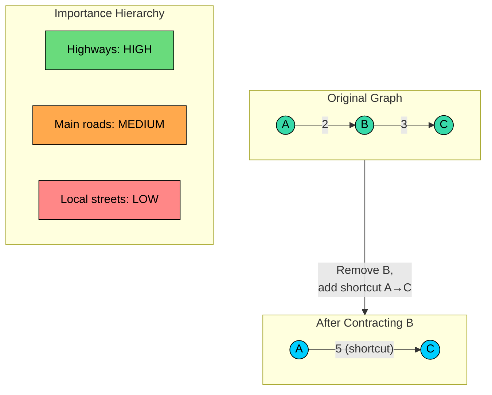
```mermaid
flowchart TB
    subgraph Original["Original Graph"]
        O_A((A)):::secondary
        O_B((B)):::secondary
        O_C((C)):::secondary

        O_A -->|2| O_B
        O_B -->|3| O_C
    end

    subgraph Contracted["After Contracting B"]
        C_A((A)):::primary
        C_C((C)):::primary

        C_A -->|"5 (shortcut)"| C_C
    end

    Original -->|"Remove B,<br/>add shortcut A→C"| Contracted

    subgraph Hierarchy["Importance Hierarchy"]
        H1["Highways: HIGH"]:::green
        H2["Main roads: MEDIUM"]:::orange
        H3["Local streets: LOW"]:::red
    end

    classDef primary fill:#00ceff,stroke:#000,color:#000
    classDef secondary fill:#38d9a9,stroke:#000,color:#000
    classDef orange fill:#ffa94d,stroke:#000,color:#000
    classDef green fill:#69db7c,stroke:#000,color:#000
    classDef red fill:#ff8787,stroke:#000,color:#000
```

#### **Query Phase (runs online):**

1. Run bidirectional search: from origin AND from destination
2. Only traverse "upward" in the hierarchy
3. Searches meet at high-importance nodes (highways)

This reduces query time from minutes to milliseconds, roughly 1000x improvement.

### Handling Real-Time Traffic

Contraction Hierarchies assume static edge weights, but traffic is dynamic. We use a hybrid approach:

1. **Highway network:** Use Contraction Hierarchies (traffic on highways is more predictable)
2. **Local roads:** Use A* algorithm with real-time traffic weights
3. **Dynamic shortcuts:** Periodically rebuild hierarchy shortcuts for different traffic conditions (rush hour vs. night)

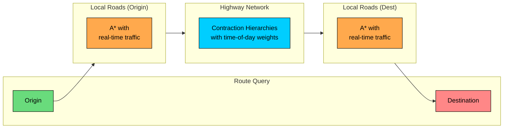
```mermaid
flowchart LR
    subgraph Query["Route Query"]
        O[Origin]:::green
        D[Destination]:::red
    end

    subgraph LocalOrigin["Local Roads (Origin)"]
        L1["A* with<br/>real-time traffic"]:::orange
    end

    subgraph Highway["Highway Network"]
        H["Contraction Hierarchies<br/>with time-of-day weights"]:::primary
    end

    subgraph LocalDest["Local Roads (Dest)"]
        L2["A* with<br/>real-time traffic"]:::orange
    end

    O --> LocalOrigin --> Highway --> LocalDest --> D

    classDef primary fill:#00ceff,stroke:#000,color:#000
    classDef orange fill:#ffa94d,stroke:#000,color:#000
    classDef green fill:#69db7c,stroke:#000,color:#000
    classDef red fill:#ff8787,stroke:#000,color:#000
```

### Algorithm Comparison

| Algorithm | Preprocess Time | Query Time | Handles Traffic | Best For |
|-----------|-----------------|------------|-----------------|----------|
| Dijkstra | None | O(E log V), slow | Yes | Small graphs |
| A* | None | 2-10x faster | Yes | Short routes, rerouting |
| Contraction Hierarchies | Hours | Milliseconds | Hard | Long-distance |
| Hybrid (CH + A*) | Hours | Fast | Yes | Production systems |

---

## 6.4 Real-Time Traffic Processing

Accurate ETAs require real-time traffic data. This is one of the most complex parts of the system.

### Data Sources

Traffic data comes from multiple sources:

```mermaid
flowchart LR
    subgraph Sources["Data Sources"]
        GPS["GPS Probes<br/>Millions of phones"]:::primary
        SENSORS["Road Sensors<br/>Highways only"]:::secondary
        REPORTS["Incident Reports<br/>Accidents, construction"]:::orange
        HISTORICAL["Historical Patterns<br/>Rush hour, weekends"]:::purple
    end

    subgraph Processing["Stream Processing"]
        KAFKA[Kafka]:::secondary
        FLINK[Apache Flink]:::secondary
    end

    subgraph Output["Traffic State"]
        REDIS["Redis<br/>Current speeds"]:::green
        TSDB["TimescaleDB<br/>Historical"]:::purple
    end

    Sources --> Processing --> Output

    classDef primary fill:#00ceff,stroke:#000,color:#000
    classDef secondary fill:#38d9a9,stroke:#000,color:#000
    classDef orange fill:#ffa94d,stroke:#000,color:#000
    classDef purple fill:#9775fa,stroke:#000,color:#000
    classDef green fill:#69db7c,stroke:#000,color:#000
```

**GPS Probe Data** is the most valuable source. Millions of smartphones running mapping apps share their location and speed (anonymized). We aggregate this data per road segment to calculate average speeds.

### ETA Calculation

ETA is the sum of travel times across all edges in the route:

For each edge, we determine the speed using:

1. **Real-time data:** If we have fresh probe data (< 5 minutes old), use it
2. **Historical average:** If no real-time data, use historical pattern for this day/time
3. **Free-flow speed:** If no data at all, use speed limit

### Predictive Traffic

For longer trips, traffic will change during the journey. We predict future conditions using:

- Current trends (is traffic getting better or worse")
- Historical patterns (it is 5pm on a Friday, expect heavy traffic)
- Known events (concert at 7pm will cause congestion)

Machine learning models (LSTMs, transformers) trained on years of traffic data can predict conditions 30-60 minutes ahead with reasonable accuracy.

---

## 6.5 Scaling and Geographic Distribution

Serving users globally requires careful attention to data placement and request routing.

### Regional Architecture

We deploy the system in multiple regions (US, Europe, Asia) with data replicated appropriately:

```mermaid
flowchart TB
    subgraph Global["Global Layer"]
        DNS[GeoDNS<br/>Routes users to nearest region]:::primary
    end

    subgraph US["Americas Region"]
        LB_US[Load Balancer]:::secondary
        SVC_US[Services]:::secondary
        DATA_US[(US Data)]:::purple
    end

    subgraph EU["Europe Region"]
        LB_EU[Load Balancer]:::secondary
        SVC_EU[Services]:::secondary
        DATA_EU[(EU Data)]:::purple
    end

    subgraph APAC["Asia Pacific Region"]
        LB_APAC[Load Balancer]:::secondary
        SVC_APAC[Services]:::secondary
        DATA_APAC[(APAC Data)]:::purple
    end

    DNS --> LB_US
    DNS --> LB_EU
    DNS --> LB_APAC

    LB_US --> SVC_US --> DATA_US
    LB_EU --> SVC_EU --> DATA_EU
    LB_APAC --> SVC_APAC --> DATA_APAC

    classDef primary fill:#00ceff,stroke:#000,color:#000
    classDef secondary fill:#38d9a9,stroke:#000,color:#000
    classDef purple fill:#9775fa,stroke:#000,color:#000
```

**Data placement strategy:**

- **Map tiles:** Replicated to all regions (read-only, easy to replicate)
- **Places data:** Regional copies with eventual consistency
- **Road graph:** Partitioned by continent, replicated within regions
- **Traffic data:** Local to each region (US traffic stays in US)

### Multi-Layer Caching

We use multiple cache layers to minimize latency:

| Layer | Location | TTL | Purpose |
|-------|----------|-----|---------|
| Browser | User device | 1 year (tiles) | Avoid repeat requests |
| CDN Edge | 200+ global POPs | 1 year (tiles), 5 min (API) | Serve from nearby |
| Redis | Each region | 1 hour (search), 5 min (routes) | Reduce DB load |
| DB Cache | PostgreSQL | Automatic | Recent query results |

With this strategy:

- 95% of tile requests served from CDN
- 70% of search requests served from Redis
- 40% of route requests served from Redis (limited by traffic freshness)

---

# References

- [How Google Maps Works](https://www.justinobeirne.com/google-maps-moat) - Deep analysis of Google Maps' competitive advantages
- [Web Mercator Projection](https://en.wikipedia.org/wiki/Web_Mercator_projection) - Standard projection used by web mapping services
- [OpenStreetMap Wiki](https://wiki.openstreetmap.org/) - Comprehensive documentation on map data structures
- [S2 Geometry Library](https://s2geometry.io/) - Google's spherical geometry library for geospatial indexing
- [Vector Tiles Specification](https://github.com/mapbox/vector-tile-spec) - Mapbox Vector Tile specification

---

# Quiz
