> 💡 **Key Insight:**

> **QUESTION**
>
> #### What is a Movie Ticket Booking System"
>
> A movie ticket booking system allows users to browse movies, view showtimes, select seats, and purchase tickets online. The system must handle seat inventory in real-time, prevent double bookings, and process payments securely.
>
> 
> <!-- Simulation: movie-booking -->
> 

>
> The core challenge lies in managing concurrent seat selections. When a popular movie releases, thousands of users might try to book the same seats simultaneously. The system must ensure that each seat is sold exactly once while providing a smooth booking experience.
>
> **Popular Examples:** [BookMyShow](https://www.bookmyshow.com/), [Ticketmaster](https://www.ticketmaster.com/), [Fandango](https://www.fandango.com/), [AMC Theatres](https://www.amctheatres.com/)

This system design problem tests several fundamental concepts: inventory management with strong consistency guarantees, distributed locking, saga patterns for distributed transactions, and graceful handling of high concurrency scenarios.

In this article, we will explore the **high-level design of a movie ticket booking system**.

Let's start by clarifying the requirements:

---

# 1. Clarifying Requirements

Before starting the design, it's important to ask thoughtful questions to uncover hidden assumptions, clarify ambiguities, and define the system's scope more precisely.

Here is an example of how a discussion between the candidate and the interviewer might unfold:

> 💡 **Key Insight:**

> **DISCUSSION**
>
> **Candidate:** "What is the expected scale" How many bookings per day and how many concurrent users during peak times""
>
> **Interviewer:** "Let's aim for 1 million bookings per day. During popular movie releases, we might see 100,000 concurrent users trying to book tickets for the same movie."
>
> **Candidate:** "Should users be able to select specific seats, or is it first-come-first-served general admission""
>
> **Interviewer:** "Users should be able to view the seat map and select specific seats. This is a key feature."
>
> **Candidate:** "How long should we hold seats while a user completes payment""
>
> **Interviewer:** "Seats should be temporarily reserved for 10 minutes. If payment is not completed, the seats should be released back to inventory."
>
> **Candidate:** "Do we need to support multiple cities and theater chains""
>
> **Interviewer:** "Yes, the system should support multiple cities, theater chains, and individual theaters with different screen configurations."
>
> **Candidate:** "What about cancellations and refunds""
>
> **Interviewer:** "Users should be able to cancel bookings up to 2 hours before showtime. Refund processing can be handled asynchronously."
>
> **Candidate:** "Do we need real-time seat availability updates for users viewing the same show""
>
> **Interviewer:** "Yes, when a seat is selected by another user, other users should see it become unavailable within a few seconds."

After gathering the details, we can summarize the key system requirements.

## 1.1 Functional Requirements

- **Browse Movies:** Users can search and browse movies by city, genre, language, and release date.
- **View Showtimes:** Users can view available showtimes for a movie at nearby theaters.
- **Select Seats:** Users can view the seat map and select available seats for a specific show.
- **Book Tickets:** Users can complete the booking by making a payment within the reservation window.
- **Manage Bookings:** Users can view their booking history and cancel bookings (with refund).

The booking flow has distinct phases, and understanding them helps us design the system correctly:

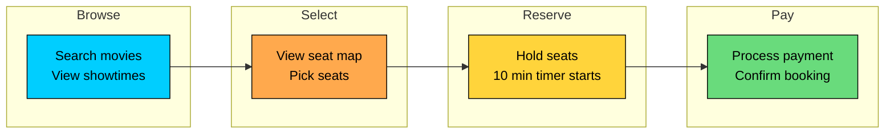

---

## 1.2 Non-Functional Requirements

Beyond features, we need to consider the qualities that make the system production-ready:

- **High Availability:** The system must be highly available (99.99%), especially during peak hours and new releases.
- **Strong Consistency for Seats:** Seat booking must be strongly consistent. A seat can only be sold once.
- **Low Latency:** Seat selection and booking should complete within 200ms (p99).
- **Scalability:** Must handle traffic spikes during popular movie releases (10x-100x normal load).
- **Fault Tolerance:** Payment failures or service crashes should not result in double bookings or lost reservations.

---

# 2. Back-of-the-Envelope Estimation

Before diving into the design, let's run some quick calculations to understand the scale we are dealing with. These numbers will guide our architectural decisions, particularly around database design, caching strategy, and how we handle the seat locking mechanism.

### 2.1 Traffic Estimates

Starting with the numbers from our requirements discussion:

#### **Write Traffic (Bookings)**

We expect 1 million bookings per day. Let's convert this to queries per second (QPS):

But here is the thing about movie ticket booking: traffic is never uniform. Most bookings happen during evenings and weekends. And when a blockbuster opens ticket sales, we get massive spikes. During peak hours or popular releases, we might see 10x the average load:

#### **Read Traffic (Browsing and Searching)**

Users browse many movies and showtimes before deciding to book. A reasonable estimate is that users view 100 pages for every booking they make:

#### **Seat Map and Selection Requests**

This is where it gets interesting. Each booking involves multiple seat-related operations: viewing the seat map, selecting seats, possibly deselecting and reselecting, and finally confirming:

### 2.2 Storage Estimates

Let's break down what we need to store and how much space it takes:

#### **Movies and Shows:**

#### **Bookings:**

#### **Seats (the interesting part):**

That 20 GB per day for seats sounds like a lot, but here is the good news: seat status records are ephemeral. Once a show ends, we do not need granular seat-level data anymore. We can archive or delete these records, keeping only the booking records for historical purposes.

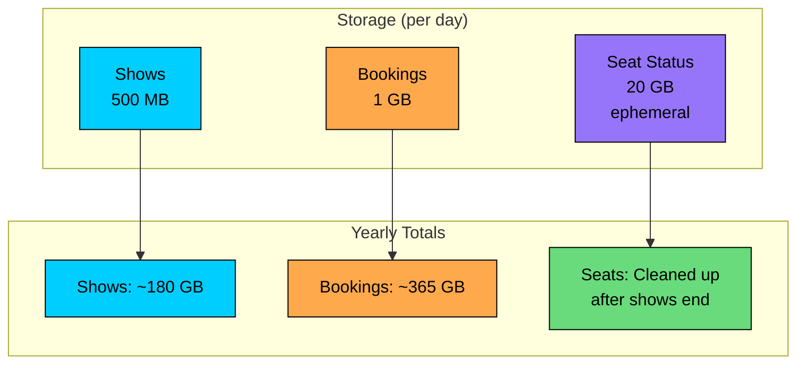

### 2.3 Key Insights

These estimates reveal several important design implications:

1. **Read-heavy workload:** With 100x more reads than writes, we should invest heavily in caching. Movie listings and showtimes change infrequently, making them perfect candidates for caching.
2. **Seat operations are the bottleneck:** While booking QPS is low (12-120), seat selection involves distributed locking and real-time updates. This is where we need to be clever.
3. **Ephemeral seat data:** Seat status is only relevant until the show ends. We can use this to our advantage by keeping hot data in memory (Redis) and cleaning up aggressively.
4. **Peak traffic patterns:** Unlike typical systems with gradual ramps, movie ticket sales can spike instantly when a popular movie opens. We need to design for these flash-sale scenarios.

---

# 3. Core APIs

With our requirements and scale understood, let's define the API contract. A movie ticket booking system needs APIs for three main purposes: discovery (finding movies and showtimes), selection (viewing and reserving seats), and transaction (completing the booking). Let's walk through each one.

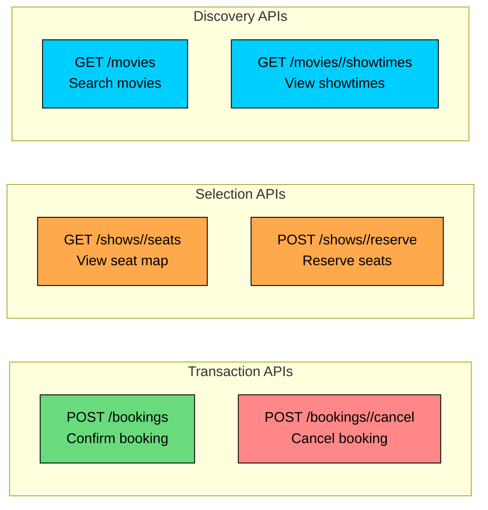

Let's examine each API in detail.

### 3.1 Search Movies

#### **Endpoint:** `GET /movies`

This is typically the entry point for users. They search for movies playing in their city, possibly filtered by genre or language.

#### **Request Parameters:**

| Parameter | Type | Required | Description |
|-----------|------|----------|-------------|
| `city` | string | Yes | City name or ID to search movies in |
| `date` | string | No | Date for showtimes (defaults to today) |
| `genre` | string | No | Filter by genre (action, comedy, drama, etc.) |
| `language` | string | No | Filter by language |

#### **Example Response (200 OK):**

### 3.2 Get Showtimes

#### **Endpoint:** `GET /movies/{movie_id}/showtimes`

Once a user selects a movie, they need to see where and when it is playing. This endpoint returns theaters showing the movie along with their showtimes.

#### **Request Parameters:**

| Parameter | Type | Required | Description |
|-----------|------|----------|-------------|
| `city` | string | Yes | City to find theaters in |
| `date` | string | Yes | Date to check showtimes |

#### **Example Response (200 OK):**

Including `available_seats` helps users pick shows that are not sold out before they even look at the seat map.

### 3.3 Get Seat Map

#### **Endpoint:** `GET /shows/{show_id}/seats`

This is where users see the visual seat layout and current availability. The response includes the screen configuration and status of every seat.

#### **Example Response (200 OK):**

#### **Seat Status Values:**

| Status | Meaning | UI Display |
|--------|---------|------------|
| `available` | Can be selected by the user | Green/clickable |
| `reserved` | Temporarily held by another user | Gray/disabled |
| `booked` | Already purchased | Gray/disabled |

The distinction between `reserved` and `booked` matters for the cleanup logic. Reserved seats will become available again if the reservation expires. Booked seats are permanent.

### 3.4 Reserve Seats

#### **Endpoint:** `POST /shows/{show_id}/reserve`

This is the critical API that starts the 10-minute timer. It attempts to temporarily reserve the selected seats. If successful, the user can proceed to payment. If any seat is unavailable, the entire request fails.

#### **Request Body:**

#### **Success Response (201 Created):**

The `expires_at` field tells the client exactly when this reservation will auto-expire. The frontend can use this to display a countdown timer.

#### **Error Responses:**

| Status Code | Meaning | When It Occurs |
|-------------|---------|----------------|
| `409 Conflict` | Seats unavailable | One or more selected seats are already reserved or booked |
| `400 Bad Request` | Invalid input | Seat IDs do not exist or invalid show ID |
| `429 Too Many Requests` | Rate limited | User has too many concurrent reservations |

The `409 Conflict` response should include which specific seats were unavailable so the user knows which ones to change.

### 3.5 Confirm Booking

#### **Endpoint:** `POST /bookings`

This finalizes the reservation by processing payment. If payment succeeds, seats become permanently booked and tickets are generated.

#### **Request Body:**

#### **Success Response (201 Created):**

#### **Error Responses:**

| Status Code | Meaning | When It Occurs |
|-------------|---------|----------------|
| `410 Gone` | Reservation expired | The 10-minute window has passed |
| `402 Payment Required` | Payment failed | Card declined or insufficient funds |
| `409 Conflict` | Seats lost | Reservation expired and seats were taken by others |

The distinction between `410` and `409` matters for UX. A `410` means "you took too long but seats might still be available". A `409` means "sorry, someone else got those seats".

### 3.6 Cancel Booking

#### **Endpoint:** `POST /bookings/{booking_id}/cancel`

Allows users to cancel their confirmed booking and receive a refund, subject to the cancellation policy.

#### **Success Response (200 OK):**

#### **Error Responses:**

| Status Code | Meaning | When It Occurs |
|-------------|---------|----------------|
| `400 Bad Request` | Too late to cancel | Less than 2 hours before showtime |
| `404 Not Found` | Booking not found | Invalid booking ID |
| `403 Forbidden` | Not authorized | User does not own this booking |

---

# 4. High-Level Design

Now we get to the interesting part: designing the system architecture. Rather than presenting a complex diagram upfront, we will build the design incrementally, starting with the simplest components and adding complexity as we encounter challenges. This mirrors how you would approach the problem in an interview.

Our system needs to handle three distinct workflows:

1. **Browse and Search:** Users discover movies and showtimes. This is read-heavy and benefits from caching.
2. **Seat Selection and Reservation:** Users view real-time seat availability and temporarily reserve seats. This is the trickiest part, requiring distributed locking.
3. **Booking and Payment:** Users complete the transaction. This involves coordinating with external payment systems and handling failures gracefully.

The critical challenge is **seat inventory management**. Unlike typical e-commerce where you can oversell and apologize later, a movie seat is a physical constraint. Two people cannot sit in the same seat. This means we need strong consistency guarantees for seat status, even if it costs us some availability during edge cases.

Let's visualize the two main paths through our system:

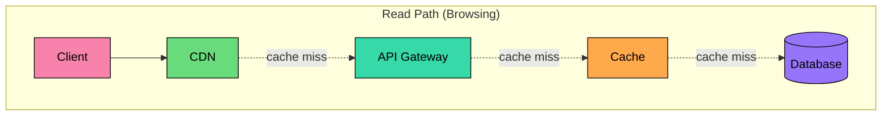

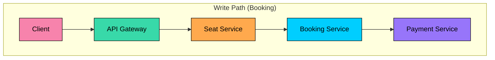

Notice how the read path has multiple caching layers. Most browsing requests will be served from cache, never touching the database. The write path is more complex because it needs to coordinate multiple services and maintain consistency.

Let's build this architecture step by step, starting with the simplest requirement.

## 4.1 Requirement 1: Browse Movies and Showtimes

When a user opens the app, they want to quickly find movies playing near them. This is the most common interaction, and it needs to be fast. Let's design for speed by introducing caching at multiple levels.

### Components Needed

```mermaid
flowchart LR
    U[User]:::rose

    subgraph Gateway["Gateway Layer"]
        AG[API Gateway]:::secondary
    end

    subgraph Application["Application Layer"]
        MS[Movie Service]:::primary
        TS[Theater Service]:::primary
    end

    subgraph Caching["Cache Layer"]
        Redis[(Redis)]:::orange
    end

    subgraph Search["Search Layer"]
        ES[(Elasticsearch)]:::purple
    end

    subgraph Storage["Storage Layer"]
        DB[(PostgreSQL)]:::purple
    end

    U -->|"1. GET /movies"city=NYC"| AG
    AG -->|"2. Route request"| MS
    MS -->|"3. Check cache"| Redis
    MS -->|"4. Query movies"| ES
    MS -->|"5. Get showtime counts"| TS
    TS --> DB
    AG -->|"6. Return results"| U

    classDef primary fill:#00ceff,stroke:#000,color:#000
    classDef secondary fill:#38d9a9,stroke:#000,color:#000
    classDef orange fill:#ffa94d,stroke:#000,color:#000
    classDef purple fill:#9775fa,stroke:#000,color:#000
    classDef rose fill:#f783ac,stroke:#000,color:#000
```

Let's introduce the components we need to make this work.

#### **Movie Service**

This is the brain of our browsing experience. It handles all movie-related data and search functionality.

The service stores movie metadata like title, genre, duration, cast, and ratings. It handles search queries with filters (city, genre, language, date) and returns enriched results including available showtimes. Most of this data changes infrequently, maybe a few times a day when new movies are added or ratings update, making it ideal for caching.

#### **Theater Service**

Manages theater and screen information. Each theater has multiple screens, each screen has a specific seat layout, and shows are scheduled on screens.

The service stores theater details (name, location, screens, seat layouts), manages show scheduling (which movie plays on which screen and when), and provides showtime availability counts. Theater data is relatively static, updated by theater administrators, not by user actions.

#### **Search Index (Elasticsearch)**

Users expect fast, forgiving search. They might type "avangers" instead of "Avengers" or search for an actor's name. Elasticsearch gives us the flexibility to handle these cases.

We index movies by title, genre, actors, and keywords. The search supports autocomplete for quick suggestions as users type and fuzzy matching to handle typos. For location-based queries, geo-queries help us find theaters within a certain distance.

#### **Cache (Redis)**

With a 100:1 read-to-write ratio, hitting the database for every request would be wasteful. Redis sits in front of the database, caching popular movie listings and theater data.

Cache TTL is set based on how often data changes. Movie listings can be cached for hours. Showtime counts might need more frequent updates, maybe every few minutes, but not real-time.

### Flow: Browsing Movies

Here is how these components work together when a user searches for movies:

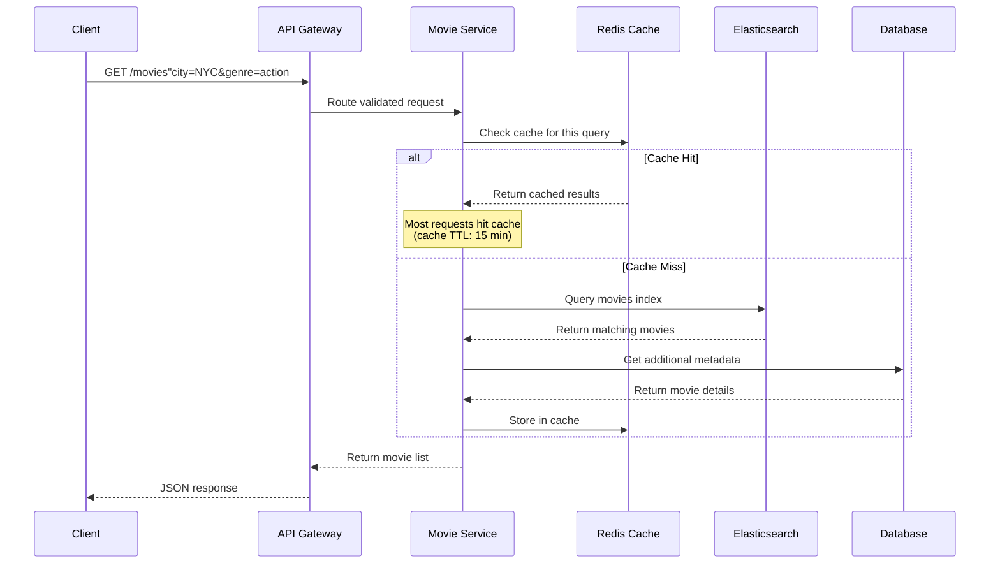

Let's walk through this step by step:

1. **Request arrives at API Gateway:** The client sends a search request with filters. The gateway validates the request format, checks rate limits, and routes to the Movie Service.
2. **Cache check:** The service computes a cache key from the query parameters (e.g., `movies:NYC:action:2024-01-15`) and checks Redis. If the exact query was made recently, we return the cached result immediately.
3. **Search on cache miss:** For cache misses, we query Elasticsearch. The search is fast (typically under 10ms) and returns movie IDs matching the criteria.
4. **Enrich with metadata:** We might need to join additional data from PostgreSQL, like current ratings or availability counts. This is optional if Elasticsearch already has everything we need.
5. **Cache and return:** Results are cached with a 15-minute TTL. The same query from another user will hit the cache.

The key insight here is that movie listings are read-heavy and change slowly. We can afford aggressive caching without worrying about showing stale data. A movie added 15 minutes ago appearing slightly delayed is acceptable.

---

## 4.2 Requirement 2: View Seat Map and Select Seats

Now for the interesting part. This is where we need to be clever about concurrency.

When users view the seat map, they need to see real-time availability. If someone else reserves a seat, it should turn gray within seconds. And when a user clicks on seats to reserve them, we need to guarantee that nobody else can grab the same seats during the payment window.

This is fundamentally different from the browsing experience. We cannot use aggressive caching because seat status changes constantly. We need something closer to real-time.

### Additional Components Needed

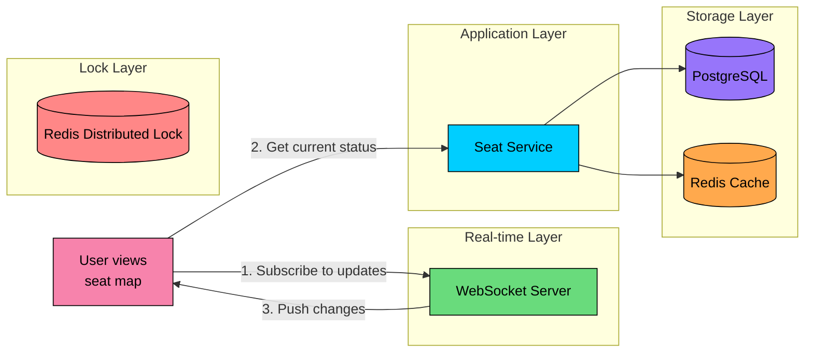

#### **Seat Service**

The heart of the booking system. This service manages all seat-related operations and is responsible for the core consistency guarantee: a seat can only be sold once.

The service maintains real-time seat status for each show (available, reserved, booked), handles seat reservation with the 10-minute hold, releases seats when reservations expire or users cancel, and coordinates with the distributed lock to prevent double booking.

#### **Distributed Lock (Redis)**

When two users click the same seat at the same millisecond, who wins" The distributed lock ensures only one can proceed. We use Redis because it is fast (sub-millisecond operations) and supports atomic operations with built-in expiration.

The lock provides atomic seat locking using `SETNX` (set if not exists), supports lock expiration so abandoned locks auto-release, and handles lock contention by returning failure immediately rather than waiting.

#### **WebSocket Server**

Polling for seat updates every second would create unnecessary load. Instead, we use WebSockets to push updates to connected clients. When any seat status changes, all users viewing that show receive the update instantly.

The server maintains connections to clients viewing each show, broadcasts seat status changes as they happen, and reduces server load by eliminating polling.

### Flow: Viewing Seat Map

When a user selects a showtime, they see the seat map with current availability:

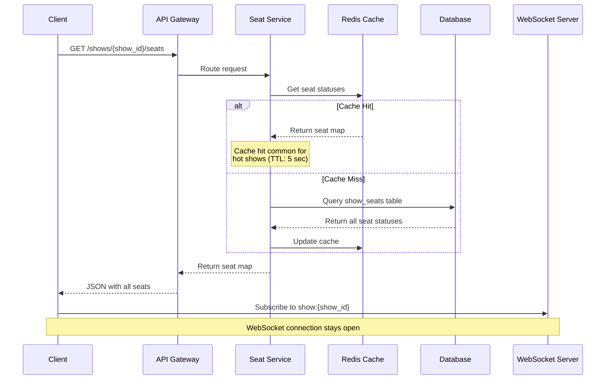

Let's break down what happens:

1. **Initial seat map fetch:** The client requests the current seat status for all seats in the show. We check Redis first (with a short 5-second TTL), falling back to the database.
2. **WebSocket subscription:** After loading the initial state, the client opens a WebSocket connection and subscribes to updates for this specific show. This connection stays open as long as the user is viewing the seat map.
3. **Real-time updates:** When any seat status changes (reserved by another user, released due to timeout, or booked), the WebSocket server pushes the update to all subscribed clients.

Why such a short cache TTL (5 seconds)" Seat status changes frequently during popular shows. A longer TTL would show stale data, frustrating users who click on "available" seats only to find them taken. But we still want some caching to handle the thundering herd when a show first becomes available.

### Flow: Reserving Seats

This is the critical operation. When a user clicks "Reserve," we need to atomically lock those seats so nobody else can grab them:

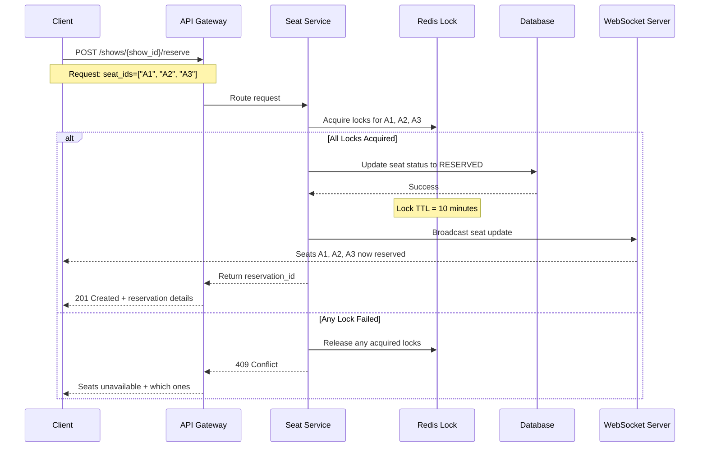

Let's trace through the critical path:

1. **Request arrives:** The user has selected seats A1, A2, and A3. The client sends a POST request to reserve all three.
2. **Acquire locks atomically:** The Seat Service attempts to acquire a distributed lock for each seat. This is an all-or-nothing operation. If we can lock all three, we proceed. If even one is already locked, we fail the entire request and release any locks we did acquire.
3. **Update database:** With locks held, we update the `show_seats` table to mark these seats as `RESERVED`, along with the user ID and timestamp. The lock TTL is set to 10 minutes, matching our reservation window.
4. **Broadcast update:** We publish a message to the WebSocket server, which pushes the update to all clients viewing this show. Their seat maps update in real-time, showing A1, A2, A3 as unavailable.
5. **Return reservation:** The client receives a `reservation_id` and the `expires_at` timestamp. The frontend can now display a countdown timer and proceed to payment.

**Why fail atomically"** If the user selected three seats but we could only lock two, we could proceed with a partial reservation. But this leads to a poor user experience. Nobody wants to arrive at the theater to find their group cannot sit together. Failing fast and letting the user choose different seats is better.

---

## 4.3 Requirement 3: Complete Booking with Payment

The user has reserved their seats and the 10-minute countdown has started. Now they need to enter payment details and complete the transaction. This is where things get tricky because we are coordinating between our system and an external payment provider.

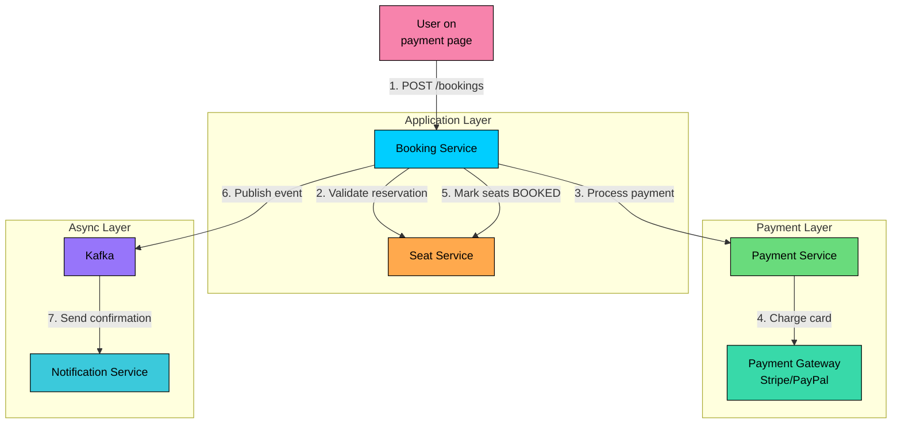

### Additional Components Needed

#### **Booking Service**

This is the orchestrator of the booking workflow. It coordinates between the Seat Service and Payment Service, ensuring that we either complete the entire transaction or roll it back cleanly.

The service validates that the reservation is still active (not expired), coordinates payment processing, converts reservations to confirmed bookings on success, generates tickets with QR codes, and publishes events for downstream processing.

#### **Payment Service**

An abstraction layer over external payment gateways like Stripe, PayPal, or local payment methods. This separation allows us to swap payment providers or add new ones without changing the booking logic.

The service processes payments via the configured gateway, handles payment failures and retries with idempotency keys, manages refunds for cancellations, and tracks payment status for reconciliation.

#### **Message Queue (Kafka)**

Not everything needs to happen synchronously. Once payment succeeds, we can immediately confirm the booking to the user while handling follow-up tasks asynchronously.

The queue decouples payment from notification, handles post-booking tasks like sending email and generating PDF tickets, enables reliable event processing with at-least-once delivery, and allows other services to react to booking events.

#### **Notification Service**

Sends booking confirmations and reminders. This is intentionally separate from the booking flow because a failed email should never cause a booking to fail.

The service sends email/SMS confirmations with ticket details and QR codes, sends reminder notifications before showtime, and handles cancellation notifications and refund confirmations.

### Flow: Completing Booking

Here is how payment and booking confirmation work together:

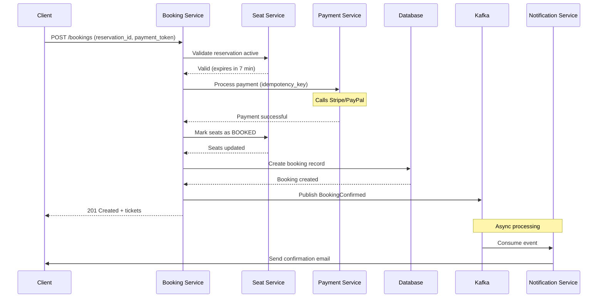

Let's trace through the happy path:

1. **Request arrives:** The client sends the `reservation_id` and a payment token (obtained from the payment provider's client-side SDK).
2. **Validate reservation:** We check that the reservation still exists and has not expired. If it has, we return `410 Gone` and the user needs to start over.
3. **Process payment:** The Payment Service calls the external gateway with an idempotency key (based on the reservation ID). This ensures that if the request is retried due to a network timeout, we do not charge the user twice.
4. **Mark seats as booked:** With payment confirmed, we update the seat status from `RESERVED` to `BOOKED`. This is permanent, the Redis lock is released since we no longer need it.
5. **Create booking record:** We insert a row into the bookings table with all the details needed for ticket generation and customer service.
6. **Publish event:** A `BookingConfirmed` event goes to Kafka. This triggers the notification service to send an email, but also allows other services to react (analytics, loyalty points, etc.).
7. **Return immediately:** The user gets their booking confirmation with ticket details. The email arrives asynchronously, usually within seconds.

### Handling Payment Failures

What happens when things go wrong" Payment processing can fail in several ways, and we need to handle each gracefully:

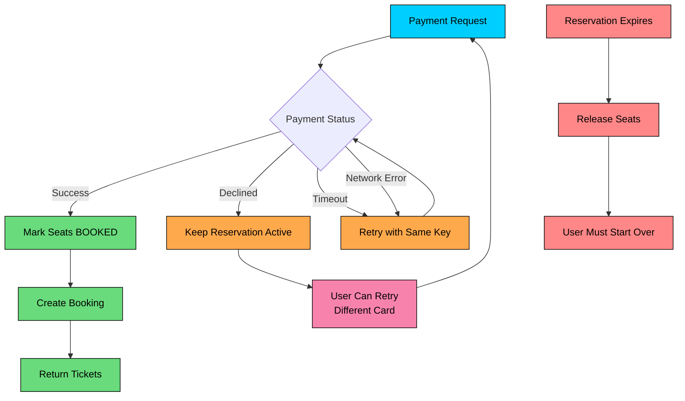

**Payment Success:** The happy path. Seats become permanently booked, the booking record is created, and tickets are issued.

**Payment Declined:** The user's card was declined (insufficient funds, wrong CVV, etc.). We keep the reservation active so they can try a different payment method. The 10-minute timer continues counting down.

**Payment Timeout or Network Error:** We did not get a response from the payment gateway. Is the payment processing, failed, or stuck" We retry with the same idempotency key. If payment already went through, the gateway returns the previous result instead of charging again.

**Reservation Expired:** If the 10-minute window passes before payment completes, the seats are automatically released. The user must start over by selecting seats again. This is intentional, we do not want seats locked indefinitely by users who abandoned their carts.

---

## 4.4 Putting It All Together

Now that we have designed the browsing, seat selection, and booking flows, let's step back and see the complete architecture. The diagram below shows how all components connect and where different types of data flow.

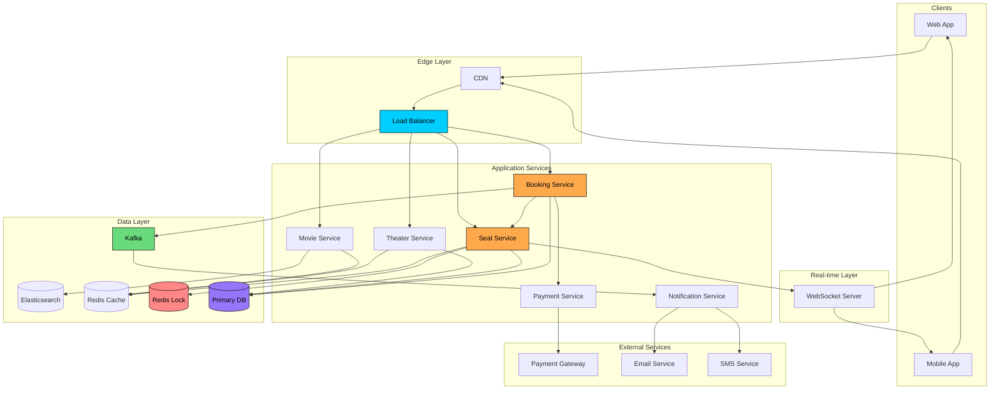

The architecture follows a layered approach, with each layer having specific responsibilities:

**Client Layer:** Users interact through web browsers and mobile apps. From our perspective, they are all HTTP requests with occasional WebSocket upgrades for real-time updates.

**Edge Layer:** CDN caches static content and protects origin servers from traffic spikes. During a blockbuster release, the CDN absorbs most of the browsing traffic.

**Application Layer:** Stateless services handle business logic. The Seat Service is the most critical, as it manages the core consistency guarantees. All services can scale horizontally by adding more instances.

**Data Layer:** PostgreSQL stores the source of truth for all booking data. Redis serves dual purposes: caching for read performance and distributed locking for seat reservation. Elasticsearch powers the search experience.

**Async Layer:** Kafka decouples time-sensitive operations from background processing. Booking confirmations, email notifications, and analytics events flow through here.

### Component Responsibilities

| Component | Primary Responsibility | Scaling Strategy |
|-----------|----------------------|------------------|
| CDN | Static content, DDoS protection | Managed service (auto-scales) |
| Load Balancer | Traffic distribution | Managed service |
| Movie Service | Movie search and metadata | Horizontal (stateless) |
| Theater Service | Theater/showtime management | Horizontal (stateless) |
| Seat Service | Real-time seat inventory, locking | Horizontal (with Redis) |
| Booking Service | Booking orchestration | Horizontal (stateless) |
| Payment Service | Payment gateway integration | Horizontal (stateless) |
| Notification Service | Email/SMS notifications | Horizontal (stateless) |
| Redis | Caching + Distributed locks | Redis Cluster |
| PostgreSQL | Booking data (source of truth) | Read replicas, then sharding |
| Elasticsearch | Movie search | Elasticsearch cluster |
| Kafka | Event streaming | Kafka cluster |
| WebSocket Server | Real-time seat updates | Horizontal with sticky sessions |

---

# 5. Database Design

With the high-level architecture in place, let's zoom into the data layer. Choosing the right database and designing an efficient schema are critical decisions that affect performance, scalability, and correctness.

## 5.1 Choosing the Right Database

The database choice is not always obvious. Let's think through our access patterns and consistency requirements:

#### **What we need to store:**

- Movie and theater metadata (relatively static)
- Show schedules (updated by admins, not users)
- Seat status per show (changes constantly during booking)
- Booking records (write once, read occasionally)

#### **How we access the data:**

- Browse by city, date, movie, theater (read-heavy, cacheable)
- Get seat status for a show (needs to be fresh)
- Reserve/book seats (needs strong consistency)
- Query booking history by user

#### **Consistency requirements:**

- Seat status must be strongly consistent: a seat sold twice is a failure
- Browse results can be slightly stale (eventual consistency acceptable)
- Booking records need durability and ACID guarantees

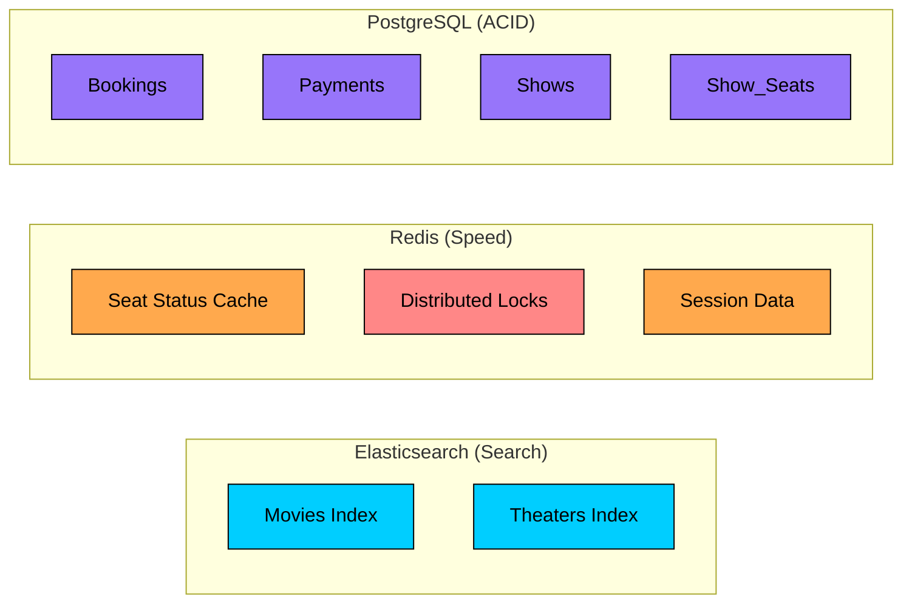

Given these requirements, we use a polyglot persistence approach:

**PostgreSQL for transactional data:** Bookings, payments, and seat status need ACID guarantees. PostgreSQL gives us transactions, foreign keys, and complex query support. The `show_seats` table is the heart of our consistency model.

**Redis for caching and locking:** We cache seat status in Redis for fast reads (5-second TTL) and use Redis for distributed locking during the reservation process. Redis is also our fallback if PostgreSQL has a brief hiccup.

**Elasticsearch for search:** Users expect fast, typo-tolerant search with autocomplete. Elasticsearch handles this well. We keep it synced with PostgreSQL through change data capture or periodic indexing.

## 5.2 Database Schema

With our database choices made, let's design the schema. The key insight is separating static data (movies, theaters, seat configurations) from dynamic data (show schedules, seat status, bookings).

Let's examine the key tables:

### Movies Table

Stores movie information. This data is managed by content administrators and rarely changes after initial entry.

| Field | Type | Description |
|-------|------|-------------|
| `movie_id` | UUID (PK) | Unique identifier |
| `title` | VARCHAR(255) | Movie title |
| `description` | TEXT | Movie description |
| `duration_minutes` | INT | Runtime (needed for scheduling) |
| `genre` | VARCHAR(50) | Primary genre |
| `language` | VARCHAR(50) | Original language |
| `release_date` | DATE | Release date |
| `rating` | DECIMAL(2,1) | Average user rating |
| `poster_url` | VARCHAR(500) | Poster image URL (stored in CDN) |

### Theaters and Screens Tables

Theaters contain multiple screens, each with a specific seat layout.

| Field (Theaters) | Type | Description |
|-------|------|-------------|
| `theater_id` | UUID (PK) | Unique identifier |
| `name` | VARCHAR(255) | Theater name |
| `city` | VARCHAR(100) | City (used for filtering) |
| `address` | TEXT | Full address for display |
| `latitude/longitude` | DECIMAL | For distance calculations |

| Field (Screens) | Type | Description |
|-------|------|-------------|
| `screen_id` | UUID (PK) | Unique identifier |
| `theater_id` | UUID (FK) | Parent theater |
| `name` | VARCHAR(50) | "Screen 1", "IMAX", etc. |
| `total_seats` | INT | Capacity |
| `seat_layout` | JSONB | Full seat configuration |

The `seat_layout` JSONB field stores the physical arrangement of seats, including which are premium, accessible, or have obstructed views. This avoids needing to query seat details for every seat map render.

### Shows Table

The bridge between movies and screens. Each row represents a specific showing.

| Field | Type | Description |
|-------|------|-------------|
| `show_id` | UUID (PK) | Unique identifier |
| `movie_id` | UUID (FK) | Which movie |
| `screen_id` | UUID (FK) | Which screen |
| `start_time` | TIMESTAMP | Show start time |
| `end_time` | TIMESTAMP | Calculated from duration |
| `price_standard` | DECIMAL(10,2) | Regular seat price |
| `price_premium` | DECIMAL(10,2) | Premium seat price |
| `status` | ENUM | 'scheduled', 'cancelled', 'completed' |

**Indexes:**

- `(movie_id, start_time)` for "what shows are playing for this movie""
- `(screen_id, start_time)` for schedule conflict detection
- `(start_time)` for "what's playing today""

### Show_Seats Table (The Critical Table)

This is the heart of seat inventory management. Each row represents a specific seat for a specific show.

| Field | Type | Description |
|-------|------|-------------|
| `show_id` | UUID (PK, FK) | Which show |
| `seat_id` | VARCHAR(10) (PK) | Which seat (e.g., "A1") |
| `status` | ENUM | 'available', 'reserved', 'booked' |
| `reserved_by` | UUID | User ID (if reserved/booked) |
| `reserved_at` | TIMESTAMP | When reservation started |
| `booking_id` | UUID (FK) | Null until booked |

**Why is this a separate table"** Each show has ~200 seat records. Storing seat status inline with the show would make the row massive. Separating allows efficient queries and updates.

**Indexes:**

- `(show_id, status)` for "how many seats available""
- `(reserved_by, reserved_at)` for cleanup job finding expired reservations
- `(booking_id)` for looking up seats in a booking

### Bookings and Tickets Tables

Once payment succeeds, we create permanent booking records.

| Field (Bookings) | Type | Description |
|-------|------|-------------|
| `booking_id` | UUID (PK) | Unique identifier |
| `user_id` | UUID (FK) | Who booked |
| `show_id` | UUID (FK) | Which show |
| `total_amount` | DECIMAL(10,2) | Total paid |
| `status` | ENUM | 'confirmed', 'cancelled', 'refunded' |
| `payment_id` | VARCHAR(100) | Payment gateway reference |
| `booked_at` | TIMESTAMP | When booking completed |

| Field (Tickets) | Type | Description |
|-------|------|-------------|
| `ticket_id` | UUID (PK) | Unique identifier |
| `booking_id` | UUID (FK) | Parent booking |
| `seat_id` | VARCHAR(10) | Seat number |
| `price` | DECIMAL(10,2) | Price for this ticket |
| `qr_code` | TEXT | Encoded entry pass |
| `status` | ENUM | 'valid', 'used', 'cancelled' |

The `qr_code` contains enough information to validate entry at the theater gate without a network call: ticket ID, show ID, seat ID, and a cryptographic signature.

---

# 6. Design Deep Dive

The high-level architecture gives us a solid foundation, but system design interviews often go deeper into specific components. In this section, we will explore the trickiest parts of our design: preventing double bookings, handling reservation expiration, managing high concurrency during popular releases, payment failure scenarios, real-time updates, and cancellations.

These are the topics that distinguish a good system design answer from a great one.

## 6.1 Preventing Double Booking

The most critical requirement, and the one that keeps engineers up at night. Imagine two users clicking on the same seat at the exact same millisecond. Who wins" How do we make sure only one of them gets the seat"

This is challenging because:

- Multiple users can view and attempt to reserve the same seat simultaneously
- Network delays and retries can create race conditions
- Payment processing takes time (5-30 seconds), during which seat status is uncertain
- Distributed systems make coordination harder

Let's explore three approaches, each with different trade-offs.

### Approach 1: Optimistic Locking with Database Constraints

The simplest approach uses the database itself to prevent conflicts. The idea is to let everyone try to reserve seats, but the database ensures only one succeeds.

#### **How It Works:**

We add a `version` column to the `show_seats` table. Every update includes the expected version in the WHERE clause. If someone else modified the row since we last read it, our update affects zero rows, and we know to retry or fail.

If the update returns `affected_rows = 3`, we got all three seats. If it returns less, someone beat us to at least one seat, and we need to fail the entire reservation.

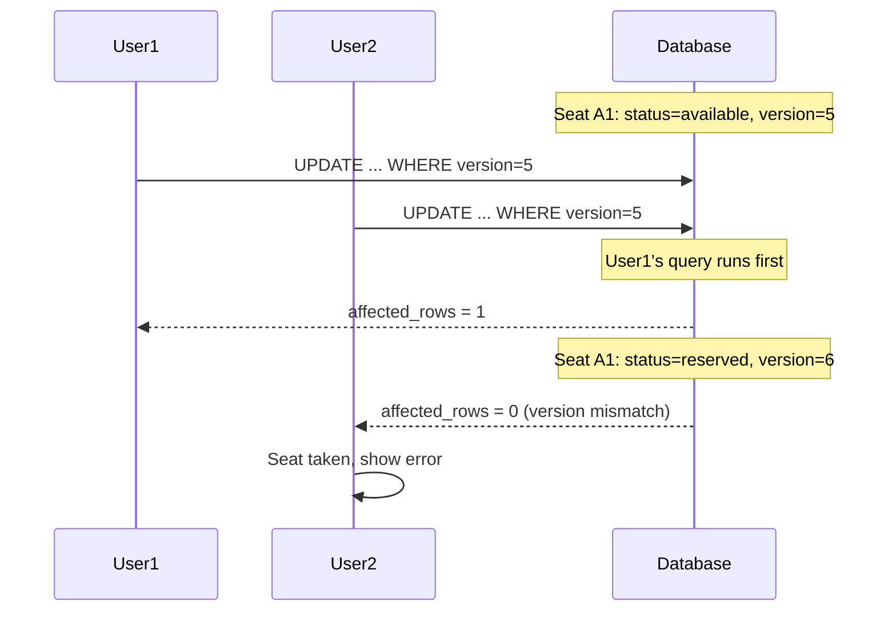

**Pros:**

- Simple implementation using standard database features
- No external dependencies like Redis
- ACID guarantees from the database
- Easy to reason about correctness

**Cons:**

- Database becomes a bottleneck for hot shows
- Requires retry logic in the application for failed updates
- Performance degrades under heavy concurrent load
- Each reservation attempt hits the database, even if seats are taken

### Approach 2: Distributed Locking with Redis

For higher concurrency, we can use Redis as a fast coordination layer. The idea is to acquire locks in Redis before touching the database. Redis is fast (sub-millisecond operations) and handles high throughput well.

#### **How It Works:**

Before reserving seats, we try to acquire a lock in Redis for each seat. We use the `SET key value NX EX seconds` command, which atomically sets a key only if it does not exist, with an expiration time.

For multiple seats, we need to acquire all locks or none. A Lua script ensures atomicity:

If the script returns `nil`, at least one seat was already locked by another user. If it returns the list of seats, we successfully locked all of them.

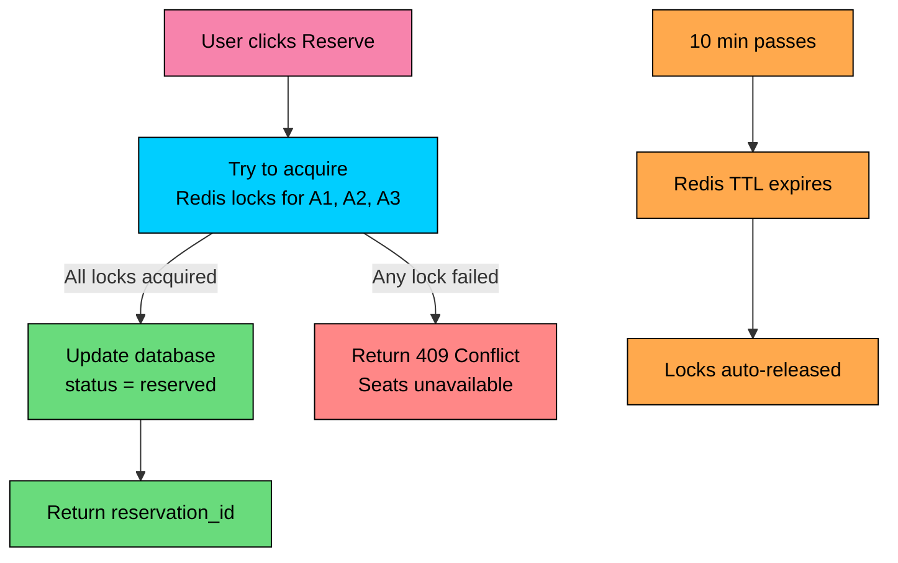

**Pros:**

- High performance: Redis operations complete in under 1ms
- Scalable: Redis handles millions of operations per second
- Automatic expiration: Locks auto-release when TTL expires
- Fast failure: Users know immediately if seats are taken

**Cons:**

- Additional infrastructure to maintain (Redis cluster)
- Need to handle Redis failures gracefully
- Potential for split-brain during Redis failover (rare but possible)
- Database and Redis can get out of sync if updates fail

### Approach 3: Two-Phase Reservation (Recommended)

The best of both worlds: use Redis for fast locking and immediate user feedback, then confirm in the database for durability. If something goes wrong at either layer, we have clear recovery paths.

#### **How It Works:**

**Phase 1: Soft Lock (Redis)** When the user clicks "Reserve":

1. Acquire Redis locks for all selected seats (atomic, all-or-nothing)
2. If successful, seats immediately show as "reserved" to other users
3. Lock TTL is set to 10 minutes (the reservation window)
4. Return a `reservation_id` to the client with an `expires_at` timestamp

**Phase 2: Hard Lock (Database)** When the user completes payment:

1. Verify the reservation is still valid (Redis locks still held)
2. Process payment with idempotency key
3. Update database in a transaction (status = 'booked')
4. If database update succeeds, release Redis locks (no longer needed)
5. If database update fails, refund payment and release locks

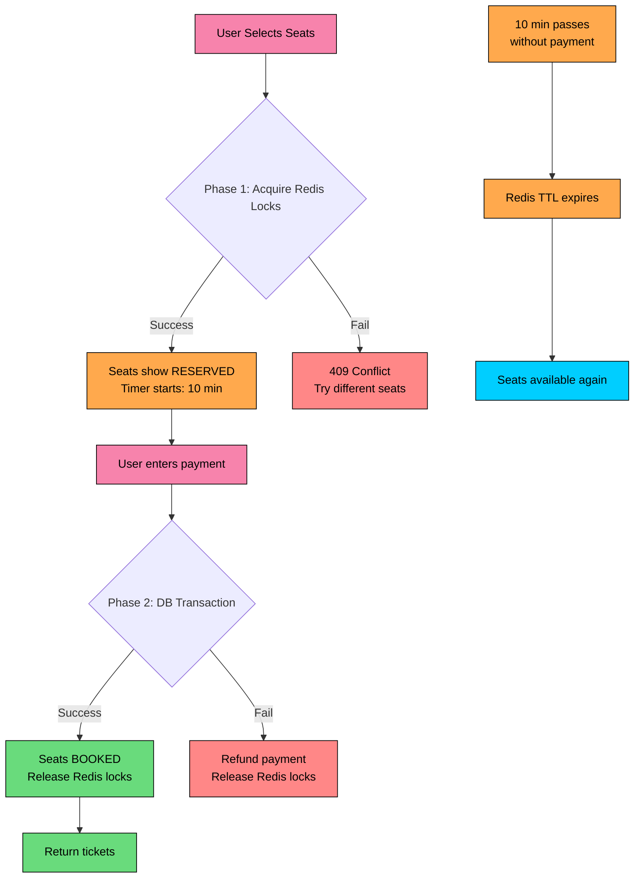

#### **Why This Works:**

- **Redis provides speed:** Users get instant feedback about seat availability. No database round-trip needed for the initial reservation.
- **Database provides durability:** The final booking state is always in PostgreSQL, our source of truth. Even if Redis fails, we can recover.
- **Automatic cleanup:** If users abandon their reservation, Redis TTL expires and seats become available automatically. No background job needed.
- **Idempotent payments:** Using the reservation ID as the idempotency key, payments can be safely retried.

#### **Handling Edge Cases:**

What if Redis goes down after Phase 1 but before Phase 2" The user has a reservation ID, but we cannot verify their locks. Solution: store reservation details in the database as well (with status = 'pending'), so we can verify ownership even if Redis is unavailable.

What if the database update fails after payment" We have charged the user but seats show as available. Solution: use the saga pattern, issue a refund and inform the user. The seats may or may not still be available.

### Which Approach Should You Choose"

Each strategy has its sweet spot:

| Approach | Throughput | Complexity | Consistency | Best For |
|----------|------------|------------|-------------|----------|
| **Optimistic Locking** | Low | Simple | Strong | Small-scale, single database |
| **Redis Locking** | High | Medium | Strong (with care) | Real-time updates needed |
| **Two-Phase** | High | Higher | Strong | Production systems at scale |

**Recommendation:** For a system like BookMyShow or Ticketmaster, use the **Two-Phase Reservation** approach. It provides the best balance of performance (Redis for speed), reliability (database for durability), and user experience (instant feedback + automatic cleanup).

## 6.2 Handling Reservation Expiration

When a user reserves seats but never completes payment, those seats are stuck in limbo. If we do not handle this properly, popular shows could have most seats showing as "reserved" even though nobody is actually going to buy them.

This is critical for:

- Preventing inventory lockup from abandoned carts
- Ensuring fair access during high-demand shows (no seat hoarding)
- Maintaining accurate seat availability

The 10-minute reservation window is our policy. But how do we actually enforce it"

### Approach 1: TTL-Based Auto-Expiration

Since we are using Redis locks, we get automatic expiration for free. When we set the lock, we include a TTL (time-to-live) of 10 minutes. Redis automatically deletes the key when time is up.

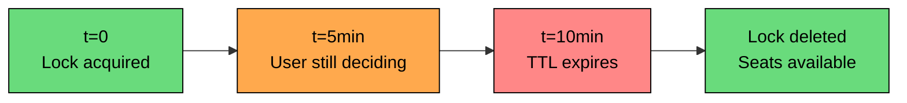

**Pros:**

- Automatic: Redis handles the expiration precisely
- No manual intervention or complex logic needed
- No risk of forgetting to release locks

**Cons:**

- Database might still show 'reserved' until background job runs
- Brief inconsistency window between Redis and database

### Approach 2: Active Expiration Check

Instead of relying on background jobs, check expiration on every seat map request.

When a user views the seat map, we check timestamps. If a reservation is past its 10-minute window, we treat it as available and queue a cleanup task to update the database.

**Pros:**

- Users always see accurate status
- No background job dependency for correctness
- Cleanup happens on-demand

**Cons:**

- Every seat map request does timestamp comparisons
- Actual database cleanup is async, so there is still a brief lag

### Approach 3: Hybrid (Recommended)

Use all three mechanisms for belt-and-suspenders reliability:

1. **Redis TTL:** Locks auto-expire after 10 minutes. Other users can immediately grab those seats.
2. **Active Check:** When serving seat maps, verify timestamps. Return 'available' for expired reservations even if database has not caught up.
3. **Background Cleanup:** A periodic job (every minute) scans for expired reservations and updates the database. This keeps the database clean and handles any edge cases.

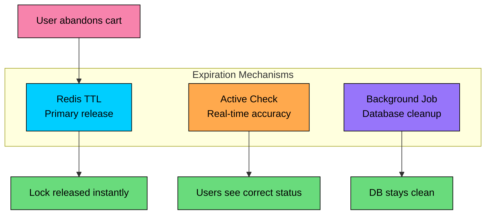

This hybrid approach ensures:

- Fast lock release (Redis TTL handles it)
- Accurate user experience (active check on reads)
- Clean database state (background job catches stragglers)

## 6.3 Handling High Concurrency During Popular Releases

When a blockbuster movie opens ticket sales, the system faces what we call a "flash sale" scenario. Imagine the moment Avengers: Endgame tickets went on sale, or when Taylor Swift concert tickets drop. Traffic spikes 100x or 1000x within seconds.

The challenge:

- 100,000+ users trying to book simultaneously
- Most want the same popular shows (Friday evening, center seats)
- Seat selection becomes a massive race condition
- Normal infrastructure cannot handle this without preparation

```mermaid
flowchart LR
    subgraph "Normal Day"
        A[~100 req/sec]:::green
    end

    subgraph "Blockbuster Release"
        B[100,000+ req/sec]:::red
    end

    A -->|"1000x spike<br/>in seconds"| B

    classDef green fill:#69db7c,stroke:#000,color:#000
    classDef red fill:#ff8787,stroke:#000,color:#000
```

### The Thundering Herd Problem

When ticket sales open at exactly 10 AM, every interested user refreshes at 10:00:00. This creates a "thundering herd", an instantaneous spike that can overwhelm servers, databases, and payment systems.

Without protection, the database gets crushed by concurrent lock attempts. Redis becomes a bottleneck. Payment gateways rate-limit us. Users see errors and keep retrying, making it worse.

We need multiple strategies working together.

### Solution 1: Virtual Waiting Room

Instead of letting everyone hit the booking system at once, we implement a queue. Users who arrive during peak times enter a "waiting room" and are admitted gradually.

```mermaid
flowchart LR
    A["User arrives"]:::rose --> B{System at capacity"}
    B -->|No| C["Enter booking flow<br/>directly"]:::green
    B -->|Yes| D["Enter waiting room"]:::yellow
    D --> E["Receive queue position<br/>You are #1,234"]:::yellow
    E --> F["Wait for turn<br/>~2 min estimated"]:::yellow
    F --> G{Your turn"}
    G -->|Yes| C
    G -->|No| F

    classDef rose fill:#f783ac,stroke:#000,color:#000
    classDef green fill:#69db7c,stroke:#000,color:#000
    classDef yellow fill:#ffd43b,stroke:#000,color:#000
```

#### **How It Works:**

We use a Redis sorted set to manage the queue:

When a user's turn arrives, they receive a time-limited token (valid for 5 minutes) that allows them to proceed with seat selection. If they do not use it, they go back to the queue.

#### **Benefits:**

- Fair access: First-come-first-served ordering
- System protection: Backend load stays predictable
- Good UX: Users know their position and estimated wait time
- Token-based: Users cannot skip the queue by refreshing

### Solution 2: Seat Holding Limits

Even with a waiting room, we need to prevent individual users from hoarding seats or creating too many abandoned reservations.

| Rule | Value | Purpose |
|------|-------|---------|
| Max seats per transaction | 10 | Prevent hoarding |
| Max concurrent reservations | 1 per show | One active reservation at a time |
| Reservation timeout | 10 minutes | Non-extendable |
| Cool-down after failed attempt | 5 minutes | Prevent rapid retry abuse |

These limits are enforced at the application layer, using the user ID (for logged-in users) or a combination of IP and session for anonymous users.

### Solution 3: Geographic Sharding

Here is a natural optimization: users in NYC only compete with other NYC users, not with users in LA. We can shard our database by city or region.

```mermaid
flowchart TB
    subgraph "East Coast Shard"
        E1[NYC]:::primary
        E2[Boston]:::primary
        E3[Philadelphia]:::primary
    end

    subgraph "West Coast Shard"
        W1[LA]:::orange
        W2[San Francisco]:::orange
        W3[Seattle]:::orange
    end

    subgraph "Central Shard"
        C1[Chicago]:::purple
        C2[Detroit]:::purple
        C3[Minneapolis]:::purple
    end

    classDef primary fill:#00ceff,stroke:#000,color:#000
    classDef orange fill:#ffa94d,stroke:#000,color:#000
    classDef purple fill:#9775fa,stroke:#000,color:#000
```

Each shard handles shows for theaters in that region. Cross-shard queries are rare because users typically book locally. This reduces contention and allows each shard to scale independently.

### Solution 4: Read/Write Separation

Not all requests need strong consistency. We can separate read and write paths:

```mermaid
flowchart LR
    subgraph "Write Path (Strong Consistency)"
        W1[Reserve seats]:::red --> W2[Primary DB]:::red
        W3[Confirm booking]:::red --> W2
    end

    subgraph "Read Path (Eventual Consistency OK)"
        R1[Browse movies]:::green --> R2[Read Replica]:::green
        R3[View showtimes]:::green --> R2
    end

    subgraph "Real-time Path"
        RT1[Seat map]:::orange --> RT2[Redis]:::orange
    end

    W2 -.->|async replication| R2
    W2 -->|sync update| RT2

    classDef red fill:#ff8787,stroke:#000,color:#000
    classDef green fill:#69db7c,stroke:#000,color:#000
    classDef orange fill:#ffa94d,stroke:#000,color:#000
```

- **Writes** (reserve, book) go to the primary database with strong consistency
- **Reads** (browse, showtimes) can be served from read replicas with slight lag
- **Seat maps** are served from Redis, which is updated synchronously on writes

This architecture lets us scale read capacity by adding more replicas without affecting write performance.

## 6.4 Payment Processing and Failure Handling

Payment is where things can go wrong in interesting ways. Networks fail, cards get declined, and services crash mid-transaction. We need to handle all of this gracefully while avoiding the nightmare scenarios:

- Charging users without booking their seats (angry customer)
- Booking seats without charging (revenue loss)
- Double charges on retry (legal trouble)

### The Distributed Transaction Problem

Here is the fundamental challenge: booking involves two systems that can fail independently.

1. **Payment Service:** Charges the user via Stripe/PayPal
2. **Seat Service:** Marks seats as permanently booked

In a monolith with a single database, we could wrap both operations in one transaction. But in a microservices architecture, these are separate services with separate databases. We cannot use a traditional ACID transaction.

What if payment succeeds but the seat update fails" The user paid but has no seats. What if seats get marked booked but payment fails" We gave away seats for free.

### Solution: Saga Pattern with Compensation

A saga is a sequence of local transactions. Each step has a compensating action that can undo it if a later step fails.

#### **Happy Path**

```mermaid
sequenceDiagram
    participant User
    participant Booking as Booking Service
    participant Seat as Seat Service
    participant Payment as Payment Service

    User->>Booking: Confirm booking
    Booking->>Seat: Validate reservation
    Seat-->>Booking: Valid
    Booking->>Payment: Process payment
    Payment-->>Booking: Success
    Booking->>Seat: Mark seats BOOKED
    Seat-->>Booking: Success
    Booking-->>User: Booking confirmed
```

**Compensation on Failure**

If seat marking fails after payment succeeds, we need to compensate by refunding:

```mermaid
sequenceDiagram
    participant User
    participant Booking as Booking Service
    participant Seat as Seat Service
    participant Payment as Payment Service

    User->>Booking: Confirm booking
    Booking->>Seat: Validate reservation
    Seat-->>Booking: Valid
    Booking->>Payment: Process payment
    Payment-->>Booking: Success
    Booking->>Seat: Mark seats BOOKED
    Seat-->>Booking: FAILED (seats taken by someone else)
    Note over Booking: Compensating action triggered
    Booking->>Payment: Refund payment
    Payment-->>Booking: Refunded
    Booking-->>User: Sorry, seats were taken. Refund issued.
```

This is a rare edge case, but it can happen if the Redis lock expired during payment processing and another user grabbed the seats. The saga ensures we never leave the user in a bad state.

### Idempotency for Safe Retries

Every payment request includes an idempotency key, typically the reservation ID. This is crucial for handling network failures and retries.

If our service crashes after sending a payment request but before receiving the response, we do not know if the payment went through. When we retry with the same idempotency key, the gateway returns the previous result instead of charging again.

### State Machine for Booking Status

To handle any failure scenario and enable recovery, we track booking state explicitly:

```mermaid
stateDiagram-v2
    [*] --> Reserved: Seats selected
    Reserved --> PaymentPending: Payment initiated
    PaymentPending --> PaymentFailed: Payment declined
    PaymentPending --> PaymentSuccess: Payment approved
    PaymentFailed --> Reserved: User retries
    PaymentFailed --> Cancelled: User abandons
    PaymentSuccess --> Confirmed: Seats marked booked
    PaymentSuccess --> Refunding: Seat marking failed
    Refunding --> Cancelled: Refund complete
    Reserved --> Expired: Timeout
    Expired --> [*]
    Confirmed --> [*]
    Cancelled --> [*]
```

## 6.5 Real-Time Seat Updates

When multiple users are viewing the seat map for a popular show, they need to see changes as they happen. If User A reserves seats A1 and A2, User B should see those seats turn gray within seconds, not minutes.

Without real-time updates, users would click on seats that appear available but are actually taken, leading to frustrating error messages.

### WebSocket-Based Updates

The solution is to push seat status changes to all connected clients viewing that show. We use WebSockets instead of polling because:

- Lower latency (instant vs. polling interval)
- Less server load (no repeated requests)
- Better user experience (seats update smoothly)

#### **Architecture**

```mermaid
flowchart TD
    subgraph Clients["Clients viewing Show X"]
        C1[User A]
        C2[User B]
        C3[User C]
    end

    subgraph Backend
        SS[Seat Service]
        WS[WebSocket Server]
        PubSub[Redis Pub/Sub]
    end

    SS -->|Seat Update| PubSub
    PubSub -->|Broadcast| WS
    WS -->|Push| C1
    WS -->|Push| C2
    WS -->|Push| C3

    style PubSub fill:#ff8787,stroke:#000,color:#000
    style WS fill:#69db7c,stroke:#000,color:#000
```

#### **How It Works:**

1. **Client connects:** When a user opens the seat map, their browser establishes a WebSocket connection and sends a subscription message for that show.
2. **Server registers subscription:** The WebSocket server tracks which clients are subscribed to which shows. It also subscribes to the Redis Pub/Sub channel `show:{show_id}:seats`.
3. **Seat status changes:** When any seat is reserved or released, the Seat Service publishes an update to Redis Pub/Sub.
4. **Broadcast to clients:** All WebSocket servers receive the message (because they are all subscribed to Redis). Each server pushes the update to its connected clients who are viewing that show.
5. **UI updates:** The client-side JavaScript receives the message and updates the seat map, typically changing the seat color from green to gray (or vice versa).

#### **Message Format:**

We include a timestamp so clients can handle out-of-order messages (due to network delays) by ignoring updates older than their current state.

### Scaling WebSocket Connections

WebSocket connections are stateful, meaning a single server cannot handle unlimited connections. Here is how we scale:

Each WebSocket server subscribes to Redis Pub/Sub. When a seat update happens, Redis broadcasts it to all servers, and each server pushes to its local clients. This fan-out architecture scales horizontally.

We use sticky sessions (via cookies or IP hashing in the load balancer) to ensure reconnections go to the same server. This avoids edge cases where a client subscribes on one server but reconnects to another that does not know about the subscription.

## 6.6 Cancellation and Refunds

Life happens. Plans change. Users should be able to cancel their bookings and receive appropriate refunds. But we also need to protect the business from abuse (buying tickets just to cancel last minute).

### Cancellation Policy

Most ticketing systems use a tiered refund policy based on how close to showtime the cancellation happens:

| Cancellation Timing | Refund | Rationale |
|---------------------|--------|-----------|
| > 24 hours before showtime | 100% | Plenty of time to resell |
| 2-24 hours before showtime | 50% | Harder to resell, partial compensation |
| < 2 hours before showtime | 0% | Too late to resell |
| No-show | 0% | Seat went unused |

These rules are business decisions, not technical ones. The system should make it easy to configure different policies.

### Cancellation Flow

Cancellation is simpler than booking because we are undoing operations rather than coordinating them:

```mermaid
sequenceDiagram
    participant User
    participant BS as Booking Service
    participant SS as Seat Service
    participant PS as Payment Service
    participant Queue as Kafka

    User->>BS: Cancel booking
    BS->>BS: Validate: Is cancellation allowed"
    alt Too late to cancel
        BS-->>User: 400 Cannot cancel (< 2 hours)
    else Cancellation allowed
        BS->>SS: Release seats
        SS-->>BS: Seats released
        BS->>BS: Update booking status = cancelled
        BS->>Queue: Publish RefundRequested
        BS-->>User: Cancellation confirmed
        Note over Queue,PS: Async refund processing
        Queue->>PS: Process refund
        PS->>PS: Calculate refund (based on timing)
        PS->>PS: Issue refund to original payment method
        PS->>Queue: Publish RefundCompleted
    end
```

Notice that we confirm the cancellation before the refund completes. Refund processing can take 5-10 business days depending on the payment method, but the user gets immediate confirmation that their booking is cancelled.

### Making Released Seats Available

When a booking is cancelled, those seats should immediately become available for others. Here is what happens:

1. **Database update:** Set `show_seats.status = 'available'` and clear the booking reference
2. **WebSocket broadcast:** Push the update to all users viewing that show's seat map
3. **Cache invalidation:** Update the available seat count in Redis

This creates a nice experience: if someone cancels front-row seats for a sold-out show, other users viewing the seat map see them appear in real-time.

```mermaid
flowchart LR
    A[User cancels booking]:::rose --> B[Release seats in DB]:::primary
    B --> C[Broadcast via WebSocket]:::green
    B --> D[Invalidate cache]:::orange
    C --> E[Other users see<br/>seats available]:::green

    classDef primary fill:#00ceff,stroke:#000,color:#000
    classDef green fill:#69db7c,stroke:#000,color:#000
    classDef orange fill:#ffa94d,stroke:#000,color:#000
    classDef rose fill:#f783ac,stroke:#000,color:#000
```

---

# Quiz
