> 💡 **Key Insight:**

> **What is a Likes Counting System"**
>
> A likes counting system tracks and displays the number of likes (or reactions) on content such as posts, videos, comments, and photos across social media platforms.
>
> The core challenge is deceptively simple: when a user taps the "like" button, increment a counter and display the updated count. But at the scale of platforms like Facebook, Instagram, or YouTube, where billions of likes happen daily, this becomes one of the most challenging distributed systems problems.
>
> **Popular Examples:** Facebook reactions, Instagram likes, YouTube likes, Twitter/X likes, Reddit upvotes

This system design problem tests your understanding of several important concepts: handling high-throughput writes, dealing with eventual consistency, designing effective caching strategies, and managing the hot spot problem that viral content creates.

In this chapter, we will explore the **high-level design of a likes counting system**.

Lets start by clarifying the requirements:

---

# 1. Clarifying Requirements

Before starting the design, it's important to ask thoughtful questions to uncover hidden assumptions, clarify ambiguities, and define the system's scope more precisely.

Here is an example of how a discussion between the candidate and the interviewer might unfold:

> 💡 **Key Insight:**

> **DISCUSSION**
>
> **Candidate:** "What is the expected scale" How many likes per day and how many like count reads""
>
> **Interviewer:** "Let's aim for 1 billion likes per day. Assume a 10:1 read-to-write ratio for like counts."
>
> **Candidate:** "Should a user be able to unlike content they previously liked""
>
> **Interviewer:** "Yes, users should be able to toggle their like on and off."
>
> **Candidate:** "Do we need to show the exact count or is an approximate count acceptable""
>
> **Interviewer:** "For most content, approximate counts are fine. But users should always see the accurate state of their own like (whether they liked it or not)."
>
> **Candidate:** "Should we prevent a user from liking the same content multiple times""
>
> **Interviewer:** "Yes, each user can only like a piece of content once. We need deduplication."
>
> **Candidate:** "How quickly should like counts be updated after a user likes something""
>
> **Interviewer:** "Within a few seconds is acceptable. We don't need real-time updates."
>
> **Candidate:** "Do we need to handle viral content where millions of users like a single post within minutes""
>
> **Interviewer:** "Yes, this is a critical requirement. The system should handle hot posts without degradation."

This conversation reveals several key constraints. Let's formalize them into functional and non-functional requirements.

## 1.1 Functional Requirements

Based on the discussion, here are the core features our system must support:

- **Like/Unlike:** Users can like or unlike a piece of content.
- **Get Like Count:** Display the total number of likes on any content.
- **Check Like Status:** Show whether the current user has liked the content.
- **Deduplication:** Each user can only like a piece of content once.

## 1.2 Non-Functional Requirements

Beyond features, we need to consider the qualities that make the system production-ready:

- **High Availability:** The system must be highly available (e.g., 99.99%).
- **Low Latency:** Like actions should complete within 100ms. Count reads should be under 50ms.
- **Scalability:** Handle billions of likes per day and millions of concurrent reads.
- **Eventual Consistency:** Like counts can be eventually consistent within a few seconds.
- **Hot Spot Handling:** Handle viral content without performance degradation.

The hot spot requirement deserves special attention. Normal content receives a steady trickle of likes, maybe a few per second. But when a major influencer posts, thousands of likes can hit the same content_id simultaneously. Our architecture needs to absorb these bursts without slowing down.

---

# 2. Back-of-the-Envelope Estimation

Before diving into the design, let's run some quick calculations to understand the scale we are dealing with. These numbers will guide our architectural decisions, particularly around database selection, caching strategy, and hot spot handling.

### 2.1 Traffic Estimates

Starting with the numbers from our requirements discussion:

#### **Write Traffic (Like/Unlike Operations)**

We expect 1 billion likes per day. Let's convert this to queries per second (QPS):

Traffic is never uniform throughout the day. During peak hours, especially evenings when users are most active, we might see 3x the average load:

#### **Read Traffic (Like Count Queries)**

With a 10:1 read-to-write ratio, we have about 10 billion reads per day:

These are serious numbers. 350K read QPS is not something you can serve from a single database. This tells us caching will be essential, not optional.

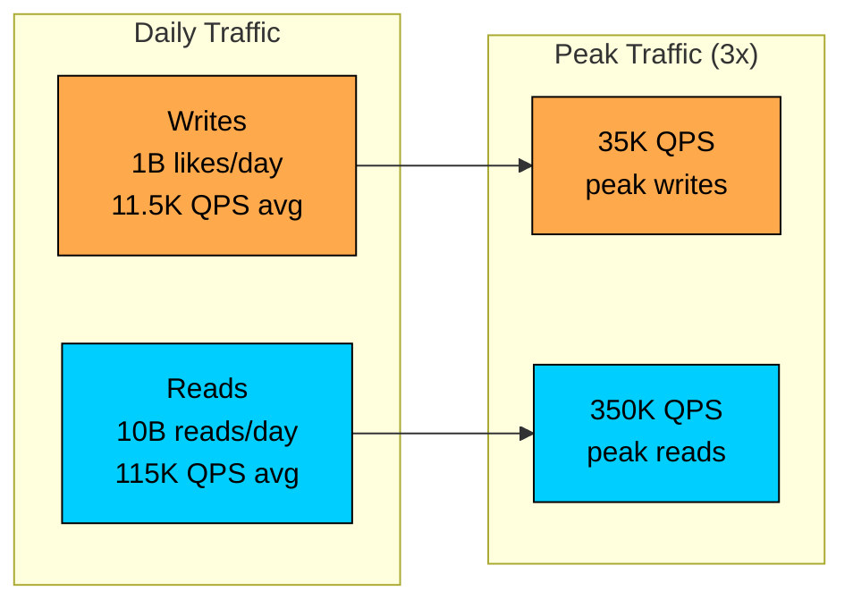

### 2.2 Storage Estimates

Each like record needs to store the relationship between a user and the content they liked:

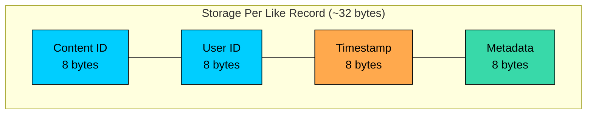

#### **Component Breakdown:**

- **Content ID:** 8 bytes (UUID or large integer)
- **User ID:** 8 bytes (UUID or large integer)
- **Timestamp:** 8 bytes (when the like was created)
- **Metadata:** 8 bytes (content type, flags, etc.)

This gives us approximately 32 bytes per like. Now let's project storage growth:

| Time Period | Total Likes | Storage Required | Notes |
|-------------|------------|------------------|-------|
| 1 Day | 1 billion | ~32 GB | Manageable |
| 1 Month | 30 billion | ~960 GB | About 1 TB |
| 1 Year | 365 billion | ~11.7 TB | Significant but feasible |
| 5 Years | 1.8 trillion | ~58 TB | Will need archiving strategy |

A few observations from these numbers:

1. **Storage is manageable:** Even at 5 years, 58 TB is well within modern infrastructure capabilities, though we will need to think about data lifecycle.
2. **Unlike operations help:** Users unlike content, and we can delete those records, which helps control storage growth.
3. **Compression helps:** With proper database compression, we can reduce storage by 40-60%.

### 2.3 The Hot Spot Problem

Here is where things get interesting. The numbers above represent average load across all content. But in reality, traffic is highly uneven. A viral post creates what we call a "hot spot."

Consider a viral video that receives 1 million likes in 10 minutes:

All 1,666 writes per second target the same content_id. If we are using a simple counter in a database row, this single row becomes a massive bottleneck. Every write needs to lock, increment, and unlock, creating contention that can grind the system to a halt.

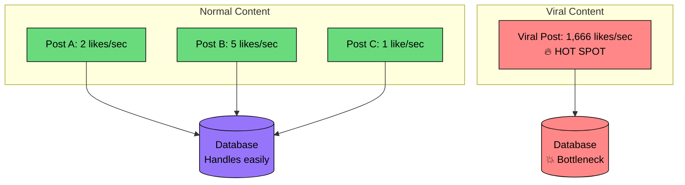

This hot spot problem is the key challenge that separates a naive implementation from a production-ready system. We will address it directly in our design with sharded counters and write buffering.

---

# 3. Core APIs

With our requirements and scale understood, let's define the API contract. A likes system has a small surface area, just four endpoints, but getting the details right matters for usability and performance.

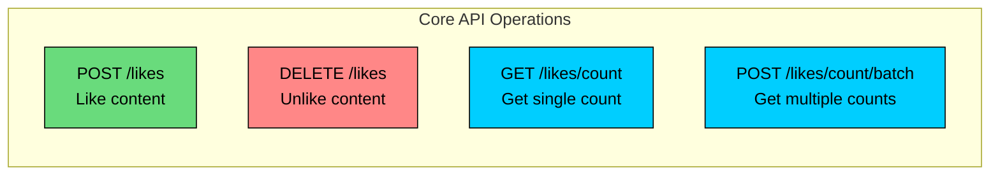

Let's walk through each endpoint.

### 3.1 Like Content

#### **Endpoint:** `POST /v1/likes`

This is the primary write operation. When a user taps the heart button, this endpoint records their like.

#### **Request Body:**

| Parameter | Type | Required | Description |
|-----------|------|----------|-------------|
| `content_id` | string | Yes | The unique identifier of the content being liked |
| `content_type` | string | Yes | Type of content (e.g., "post", "video", "comment") |
| `user_id` | string | Yes | The ID of the user performing the like action |

#### **Example Request:**

#### **Success Response (200 OK):**

We return the updated count and the user's like status so the client can update the UI immediately without making a second request.

#### **Error Responses:**

| Status Code | Meaning | When It Occurs |
|-------------|---------|----------------|
| `409 Conflict` | Already liked | User has already liked this content |
| `404 Not Found` | Content missing | The content_id does not exist |
| `429 Too Many Requests` | Rate limited | User is liking too quickly |

### 3.2 Unlike Content

#### **Endpoint:** `DELETE /v1/likes`

The reverse operation. When a user taps the heart button on content they have already liked, we remove their like.

#### **Request Body:**

| Parameter | Type | Required | Description |
|-----------|------|----------|-------------|
| `content_id` | string | Yes | The unique identifier of the content |
| `user_id` | string | Yes | The ID of the user performing the unlike action |

#### **Success Response (200 OK):**

#### **Error Responses:**

| Status Code | Meaning | When It Occurs |
|-------------|---------|----------------|
| `404 Not Found` | Never liked | User has not liked this content |
| `400 Bad Request` | Invalid request | Missing required parameters |

### 3.3 Get Like Count

#### **Endpoint:** `GET /v1/likes/count/{content_id}`

This is the most frequently called endpoint. Every time a user views a post, we need to display the like count and whether they have liked it.

#### **Path Parameters:**

| Parameter | Type | Description |
|-----------|------|-------------|
| `content_id` | string | The unique identifier of the content |

#### **Query Parameters:**

| Parameter | Type | Description |
|-----------|------|-------------|
| `user_id` | string (optional) | If provided, also returns whether this user has liked the content |

#### **Success Response (200 OK):**

#### **Error Responses:**

| Status Code | Meaning | When It Occurs |
|-------------|---------|----------------|
| `404 Not Found` | Content missing | The content_id does not exist |

### 3.4 Batch Get Like Counts

#### **Endpoint:** `POST /v1/likes/count/batch`

When rendering a feed with 20+ items, making individual requests for each like count would be wasteful. This batch endpoint fetches counts for multiple content items in a single request.

#### **Request Body:**

| Parameter | Type | Required | Description |
|-----------|------|----------|-------------|
| `content_ids` | array | Yes | Array of content IDs (max 100) |
| `user_id` | string | No | If provided, returns user's like status for each item |

#### **Example Request:**

#### **Success Response (200 OK):**

This batch endpoint is critical for feed performance. Instead of 20 round trips for a feed page, we make one.

---

# 4. High-Level Design

Now we get to the interesting part: designing the system architecture. Rather than presenting a complex diagram upfront, we will build the design incrementally, starting with the simplest possible solution and adding components as we encounter challenges. This mirrors how you would approach the problem in an interview.

Our system needs to handle two fundamental flows:

1. **Like/Unlike Operations:** Record that a user liked or unliked content, ensuring deduplication.
2. **Like Count Retrieval:** Return the like count for content, along with whether the current user has liked it.

The 10:1 read-to-write ratio tells us something important: we will have 10 times more people viewing like counts than creating likes. This means our architecture should prioritize fast reads, even if it means writes are slightly slower. Caching will be essential.

But here is the twist: while reads are more frequent, writes are the harder problem. A single piece of viral content can receive thousands of likes per second, all targeting the same counter. This hot spot problem will drive several of our design decisions.

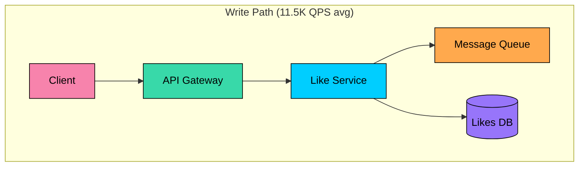

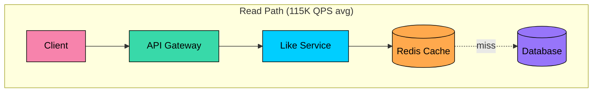

Notice how the read path has caching in front of the database. Most requests will be served from Redis, and only cache misses will reach the database. This is exactly what we want for a read-heavy system.

Let's build this architecture step by step.

## 4.1 Requirement 1: Like/Unlike Operations

When a user taps the "like" button, several things need to happen behind the scenes:

1. Validate that the user is authenticated and the content exists
2. Check if the user has already liked this content (for deduplication)
3. Record the like in the database
4. Publish an event so the count aggregation system can update
5. Return success with the user's like status

### Components for Like Operations

#### **API Gateway**

Every request enters through the API Gateway. Think of it as the front door to our system, handling concerns that are common across all requests.

The gateway terminates SSL connections, validates that requests are well-formed, enforces rate limits to prevent abuse, and routes requests to the appropriate backend service. By handling these cross-cutting concerns at the edge, we keep our application services focused on business logic.

#### **Like Service**

This is the brain of our operation. The Like Service orchestrates the entire workflow: validating input, checking deduplication, writing to the database, and publishing events for downstream processing.

We want this service to be stateless so we can run multiple instances behind a load balancer. All state lives in the database and cache layer, making horizontal scaling straightforward.

#### **Likes Database**

Stores the relationship between users and content they have liked. Each record contains a content_id, user_id, and timestamp. The primary key is a composite of (content_id, user_id), which enforces our uniqueness constraint at the database level.

#### **Message Queue (Kafka)**

When a like happens, we need to update the cached count. But we do not want the like operation to wait for count aggregation, that would slow down the response. Instead, we publish an event to Kafka and let the count aggregation service process it asynchronously.

### The Like Flow in Action

Here is how all these components work together when a user likes content:

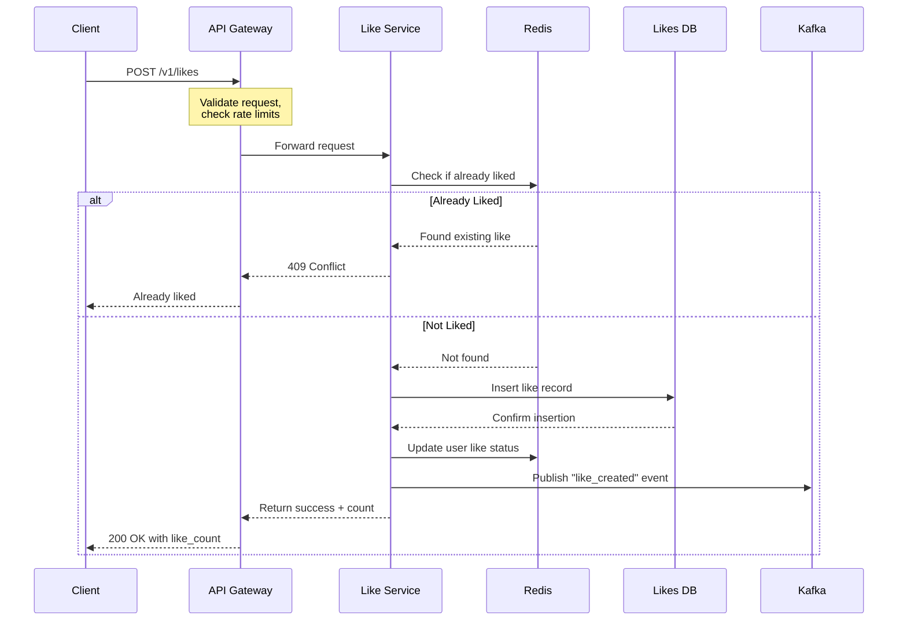

Let's walk through this step by step:

1. **Request arrives at API Gateway:** The client sends a POST request with content_id and user_id. The gateway validates the request format and checks rate limits.
2. **Like Service checks deduplication:** Before writing anything, we check if this user has already liked this content. We check Redis first (fast path) and fall back to the database if needed.
3. **Handle duplicate case:** If the user already liked this content, we return a 409 Conflict. This is idempotent behavior, repeated likes do not cause errors, they just return the current state.
4. **Record the like:** If this is a new like, we insert a record into the Likes database. The composite primary key (content_id, user_id) ensures uniqueness at the database level as a safety net.
5. **Update cache and publish event:** We update the user's like status in Redis so future deduplication checks are fast. We also publish an event to Kafka so the count aggregation service can update the cached count.
6. **Return success:** The client gets a response with the user's like status and the current count (which may be slightly stale for hot content).

---

## 4.2 Requirement 2: Like Count Retrieval

Now for the read path. This is where our 10:1 read-to-write ratio means we need to be clever about performance. Every time a user views content, we need to display the like count and whether they have liked it.

With 115K read QPS on average (and potentially much higher during peak hours), we cannot hit the database for every request. The solution is a multi-layer caching strategy.

### Additional Components for Reading

#### **Count Cache (Redis)**

Redis stores pre-aggregated like counts for fast retrieval. When a user requests a like count, we check Redis first. If the count is cached, we return it immediately, typically in under 1 millisecond.

#### **Count Aggregation Service**

This service runs in the background, consuming events from Kafka and updating the cached counts. When a like happens, the aggregation service increments the cached count. When an unlike happens, it decrements.

The aggregation service also handles cache misses. If a count is not in Redis (maybe it expired or was never cached), the aggregation service can compute it from the database and populate the cache.

### The Read Flow in Action

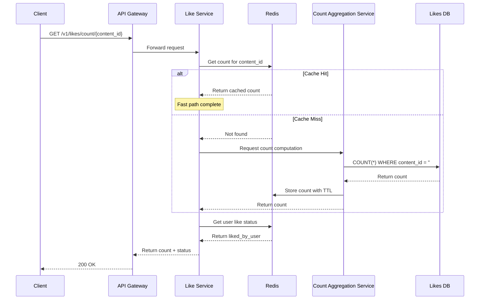

Let's trace through the different scenarios:

#### **Best case: Cache hit**

The count is already in Redis. Response time is under 1 millisecond for the cache lookup. This should be the common case, handling 90%+ of requests.

#### **Cache miss: Compute and populate**

The count is not cached, either because it expired, this is the first request for this content, or the cache was cleared. We compute the count from the database, store it in Redis with a TTL, and return it. Future requests will hit the cache.

#### **User like status**

We also need to tell the user whether they have liked this content. This is stored separately in Redis, keyed by (user_id, content_id). This powers the filled/unfilled heart icon in the UI.

---

## 4.3 Requirement 3: Hot Spot Handling

Here is where the design gets interesting. Normal content receives likes at a manageable rate, maybe a few per second at most. But viral content is different. A celebrity post might receive 10,000 likes per second, all targeting the same content_id.

This creates a problem called a "hot spot." If all 10,000 writes per second are trying to update the same counter in Redis or the same row in the database, we get massive contention. The system either slows to a crawl or starts dropping writes.

### The Solution: Sharded Counters

Instead of maintaining a single counter per content, we split it into multiple shards. When a like comes in for hot content, we write to one of N shards (e.g., 100 shards) based on a hash of the user_id.

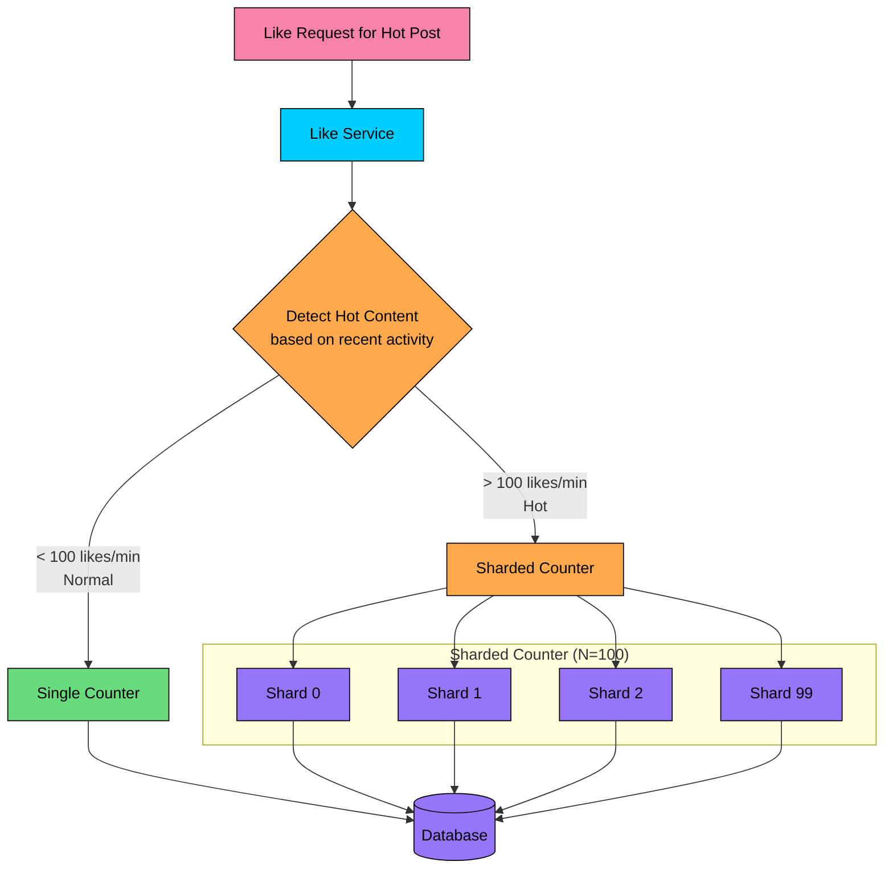

#### **How sharding distributes the load:**

Without sharding, 10,000 writes/second hit one counter. With 100 shards, each shard receives only 100 writes/second, which is easily manageable.

The read path sums all shards to get the total count:

We cache this aggregated sum in Redis so reads remain fast. The slight overhead of summing shards on cache miss is a worthwhile trade-off for the massive write scalability we gain.

#### **Hot content detection:**

How do we know when content is "hot" and needs sharding" We track the like rate (likes per minute) for each content_id. When the rate exceeds a threshold (e.g., 100 likes/minute), we switch to sharded counting. A sliding window counter in Redis makes this detection efficient.

---

## 4.4 Putting It All Together

Now that we have designed both the write and read paths, and addressed hot spot handling, let's step back and see the complete architecture:

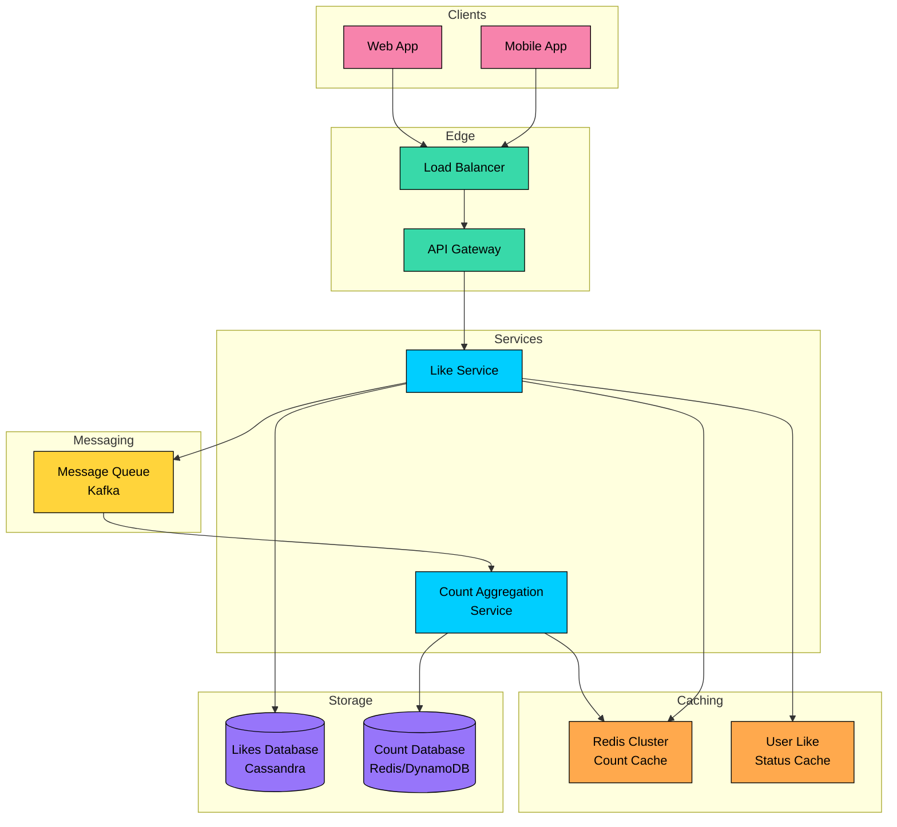

The architecture follows a layered approach, with each layer having a specific responsibility:

**Client Layer:** Users interact with our system through mobile apps and web browsers. From our perspective, they all look the same, just HTTP requests with content IDs and user IDs.

**Edge Layer:** The load balancer distributes traffic across multiple API Gateway instances. The gateway handles authentication, rate limiting, and request validation before passing requests to the application layer.

**Application Layer:** The Like Service contains our core business logic. It is stateless and horizontally scalable. The Count Aggregation Service runs in the background, consuming events from Kafka and maintaining cached counts.

**Cache Layer:** Redis provides low-latency access to like counts and user like status. This is where most read requests are served from.

**Message Layer:** Kafka decouples the like operation from count aggregation, allowing the system to handle bursts gracefully.

**Storage Layer:** Cassandra stores individual like records with high write throughput. The count database stores pre-aggregated counts for durability.

### Component Responsibilities

| Component | Primary Responsibility | Scaling Strategy |
|-----------|----------------------|------------------|
| Load Balancer | Traffic distribution, health checks | Managed service or active-passive pair |
| API Gateway | Auth, rate limiting, request validation | Horizontal (add instances) |
| Like Service | Like/unlike operations, deduplication | Horizontal (stateless) |
| Count Aggregation Service | Event processing, count maintenance | Horizontal (partition by content_id) |
| Redis Cluster | Hot data caching | Redis Cluster (add nodes) |
| Kafka | Event streaming, buffering | Add partitions and brokers |
| Cassandra | Like record storage | Add nodes to cluster |

---

# 5. Database Design

With the high-level architecture in place, let's zoom into the data layer. Choosing the right database and designing an efficient schema are critical decisions that affect performance, scalability, and operational complexity.

## 5.1 Choosing the Right Database

The database choice is one of the most important decisions we will make. Let's think through our access patterns and requirements:

#### **What we need to store:**

- Billions of like records, each representing a user liking a piece of content
- Each record is small (around 32 bytes)
- Records are immutable once created (no updates, only inserts and deletes)

#### **How we access the data:**

- Check if a specific user has liked specific content (point lookup by content_id + user_id)
- Count the number of likes for a piece of content
- Optionally, list all content a user has liked

#### **Write characteristics:**

- Extremely high write throughput (35K+ QPS at peak)
- Write hot spots from viral content (thousands of writes to same content_id per second)
- Writes are simple inserts, no complex transactions needed

#### **Read characteristics:**

- Even higher read throughput (350K+ QPS at peak)
- Most reads are point lookups (content_id + user_id)
- Counts are aggregated, not queried in real-time

Given these patterns, let's compare our options:

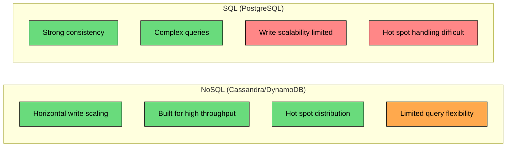

### Why NoSQL Wins Here

For the likes table, a NoSQL database like **Cassandra** or **DynamoDB** is a better fit:

1. **Horizontal write scaling:** We can add nodes to handle more write throughput without complex sharding logic.
2. **Simple access patterns:** Our queries are simple key-value lookups. We do not need JOINs, transactions, or complex WHERE clauses.
3. **Built-in partitioning:** Cassandra and DynamoDB automatically distribute data across partitions, helping mitigate hot spots.
4. **Tunable consistency:** We can choose between strong and eventual consistency based on the operation.

For the count cache, **Redis** is the clear choice. It provides sub-millisecond latency and atomic increment/decrement operations perfect for counters.

## 5.2 Database Schema

We need three tables to support our use cases: one for like records, one for counts, and one for sharded counts when content goes viral.

### Likes Table

This is the heart of our data model. Each row represents one like, one user liking one piece of content.

| Field | Type | Description |
|-------|------|-------------|
| `content_id` | String (Partition Key) | Unique identifier for the content. Determines which partition stores this row. |
| `user_id` | String (Sort Key) | Unique identifier for the user. Combined with content_id, ensures uniqueness. |
| `content_type` | String | Type of content (post, video, comment). Useful for analytics. |
| `created_at` | Timestamp | When the like was created. Enables time-based queries if needed. |

**Primary Key:** The composite key (content_id, user_id) serves two purposes. First, it ensures each user can only like content once, since duplicate inserts will fail. Second, it makes our most common query efficient: "has this user liked this content""

**Why content_id as partition key"** We expect to query all likes for a piece of content far more often than all likes by a user. Putting content_id first groups all likes for the same content on the same partition, making count queries efficient.

**Secondary Index:** We add a Global Secondary Index (GSI) on (user_id, content_id) to support the query "what has this user liked"" This is useful for user profile pages showing liked content.

### Like Counts Table

Stores pre-aggregated like counts for content that is not experiencing viral traffic.

| Field | Type | Description |
|-------|------|-------------|
| `content_id` | String (Primary Key) | Unique identifier for the content. |
| `like_count` | Integer | Total number of likes. Updated by count aggregation service. |
| `last_updated` | Timestamp | When the count was last updated. Useful for cache invalidation. |

This is a simple key-value table. Given a content_id, we get the count in O(1) time. For most content, this table is the source of truth for counts, cached in Redis for performance.

### Sharded Counts Table

For viral content receiving thousands of likes per second, a single counter row creates write contention. This table distributes the counter across multiple shards.

| Field | Type | Description |
|-------|------|-------------|
| `content_id` | String (Partition Key) | Unique identifier for the content. |
| `shard_id` | Integer (Sort Key) | Shard number from 0 to N-1. |
| `count` | Integer | Partial count for this shard. |
| `last_updated` | Timestamp | When this shard was last updated. |

**How it works:** When content becomes hot (detected by like rate), we switch from the Like Counts table to this sharded table. Incoming likes are distributed across N shards using:

To read the total count, we sum all shards:

This sum is cached in Redis, so we do not need to query the database for every read. The aggregation service periodically updates the cache.

---

# 6. Design Deep Dive

The high-level architecture gives us a solid foundation, but system design interviews often go deeper into specific components. In this section, we will explore the trickiest parts of our design: counting strategies, hot spot handling, deduplication, read path optimization, and consistency guarantees.

These are the topics that distinguish a good system design answer from a great one.

## 6.1 Counting Approaches

How do we actually compute the like count for a piece of content" This question sounds simple, but the answer has significant implications for performance, scalability, and accuracy.

There are three main approaches, each with different trade-offs. Let's explore them.

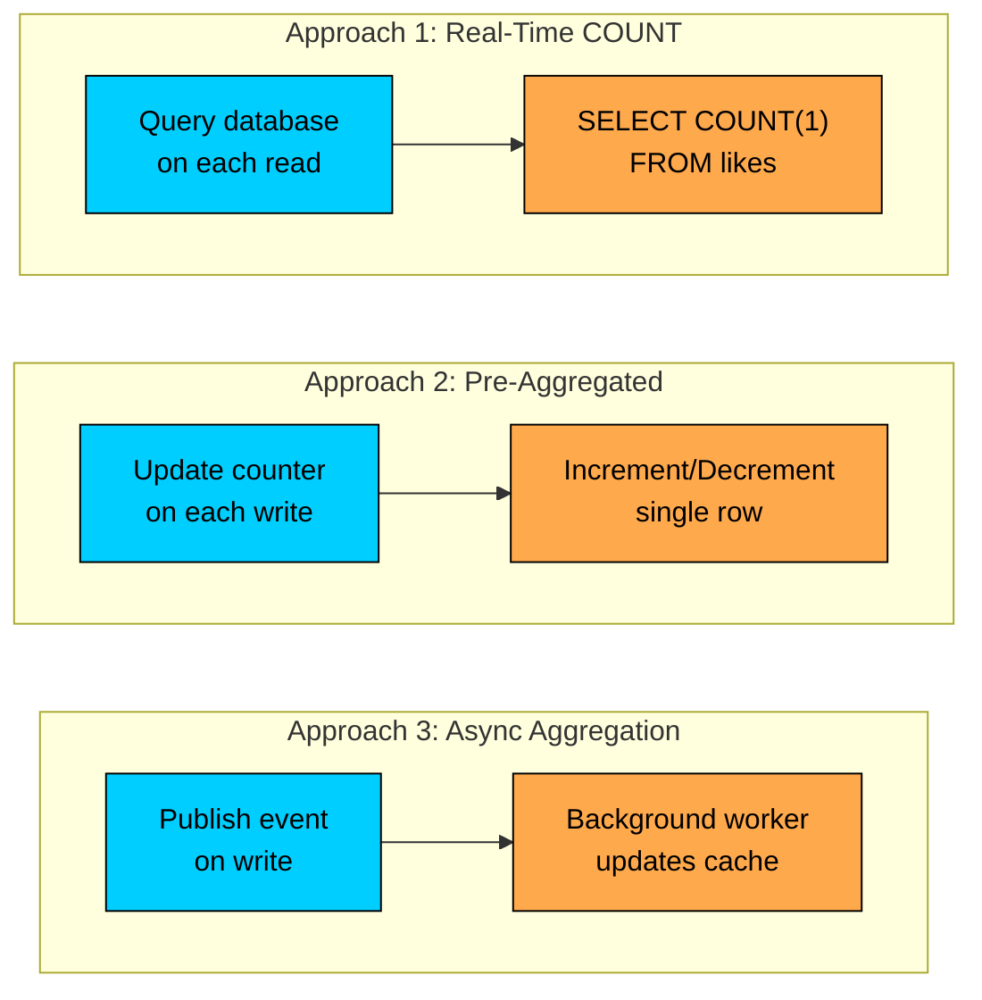

### Approach 1: Real-Time Count (COUNT Query)

The simplest approach is to count likes in real-time using a database query every time someone requests the count.

#### **How It Works:**

When a user requests the like count, we execute:

This gives us the exact count at that moment. Simple, right"

#### **The Problem:**

Imagine a viral post with 10 million likes. Every time someone views this post, we scan 10 million rows. With 100,000 people viewing the same post per second, we are doing 100,000 full index scans per second. The database will not survive this.

#### **When It Works:**

This approach is fine for small applications where posts have hundreds or thousands of likes, not millions. If your peak traffic is under 1,000 QPS and content has fewer than 100K likes, the simplicity might be worth it.

### Approach 2: Pre-Aggregated Counter

Instead of counting rows on every read, we maintain a separate counter that gets updated synchronously whenever a like or unlike happens.

#### **How It Works:**

When a user likes content:

When a user unlikes:

Reads are now O(1):

#### **The Problem:**

This approach works well for normal content. But what happens when a viral post receives 10,000 likes per second" All 10,000 writes are fighting to update the same row. This creates lock contention that can grind the database to a halt.

#### **When It Works:**

This is a solid choice for moderate-scale applications where content rarely goes viral. If your hottest content receives fewer than 100 likes per second, pre-aggregation handles it fine.

### Approach 3: Async Aggregation with Event Streaming

The most scalable approach decouples the like operation from count updates using a message queue. The like is recorded immediately, but the count update happens asynchronously in the background.

#### **How It Works:**

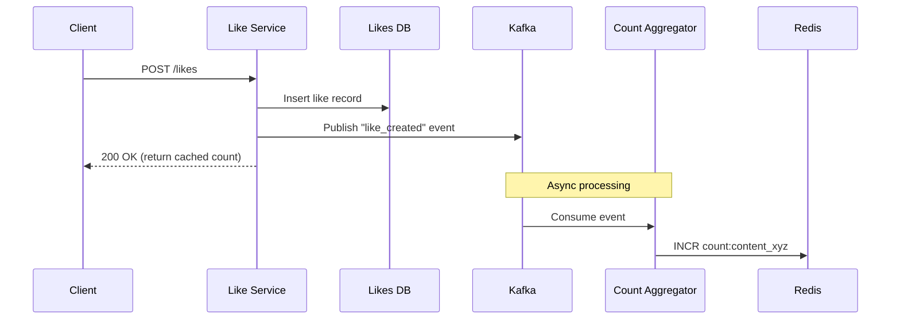

1. **Like Service** inserts the like record into the database.
2. **Like Service** publishes an event to Kafka with the content_id.
3. **Like Service** returns immediately to the client (using cached count).
4. **Count Aggregation Service** consumes events from Kafka.
5. **Count Aggregation Service** increments the count in Redis.

The client does not wait for the count to update. The response is fast, and the count catches up within seconds.

#### **Why This Works for Viral Content:**

Kafka buffers incoming events, smoothing out traffic spikes. Even if 10,000 likes happen in one second, Kafka absorbs the burst, and the aggregation service processes them at a sustainable rate.

Multiple aggregation workers can consume from the same Kafka partition (using consumer groups), providing horizontal scalability.

### Which Approach Should You Choose"

| Approach | Read Speed | Write Contention | Accuracy | Complexity |
|----------|-----------|------------------|----------|------------|
| Real-Time COUNT | Slow at scale | None | Perfect | Simple |
| Pre-Aggregated | O(1) | High for hot content | Perfect | Simple |
| Async Aggregation | O(1) | None | Eventually consistent | Moderate |

#### **Recommendation**

Use **Async Aggregation** for most production systems. The 1-5 second delay in count updates is acceptable for like counts (users do not notice if a post shows 1,247 likes instead of 1,248), and you gain the ability to handle any scale of viral content.

---

## 6.2 Handling Hot Posts (Write Hot Spots)

This is the trickiest problem in a likes counting system. When content goes viral, it creates what we call a "write hot spot." Thousands of likes per second all target the same content_id, and suddenly that single counter becomes a massive bottleneck.

Let's understand the problem concretely before looking at solutions.

### Understanding the Hot Spot Problem

Consider a celebrity posting a new video. Within minutes, it starts receiving 10,000 likes per second. Here is what happens with a naive implementation:

```mermaid
flowchart TB
    subgraph "10,000 Likes/Second"
        U1[User 1]:::rose
        U2[User 2]:::rose
        U3[User 3]:::rose
        UN[User 10,000]:::rose
    end

    subgraph "Single Counter"
        C[content_id = 'viral_post'<br/>count: """]:::red
    end

    U1 & U2 & U3 & UN -->|All target same row| C

    C --> P1[Lock contention]:::red
    C --> P2[Write timeouts]:::red
    C --> P3[Database overload]:::red

    classDef rose fill:#f783ac,stroke:#000,color:#000
    classDef red fill:#ff8787,stroke:#000,color:#000
```

All 10,000 writes per second are fighting for the same database row. Each write needs to acquire a lock, read the current value, increment it, write it back, and release the lock. With 10,000 writes competing for this lock, you get extreme contention, timeouts, and dropped writes.

Even Redis, despite being fast, struggles with this pattern. A single Redis key receiving 10,000 INCR operations per second becomes a bottleneck because Redis is single-threaded for command execution.

### Solution 1: Sharded Counters

The key insight is that we do not need to increment a single counter. We can spread the writes across multiple counters (shards) and sum them up when reading.

#### **How It Works:**

Instead of one counter per content, we create N counters (say, 100 shards):

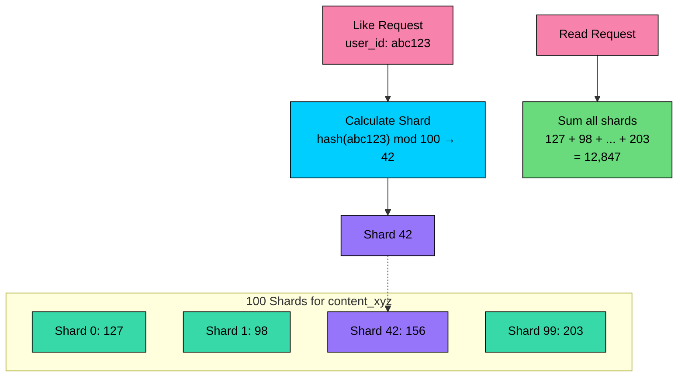

#### **Write Path:**

#### **Read Path:**

#### **Why This Works:**

With 100 shards, each shard receives only 100 writes per second instead of 10,000. That is completely manageable for Redis or any database.

The read path is slightly more expensive (100 Redis calls instead of 1), but we cache the aggregated result. A cache TTL of 5 seconds means we only do the aggregation once every 5 seconds, not on every read.

### Solution 2: Write Buffering

Another approach is to buffer writes in memory and flush them to the database in batches. Instead of 10,000 individual increments per second, we do one increment of 10,000 every second.

#### **How It Works:**

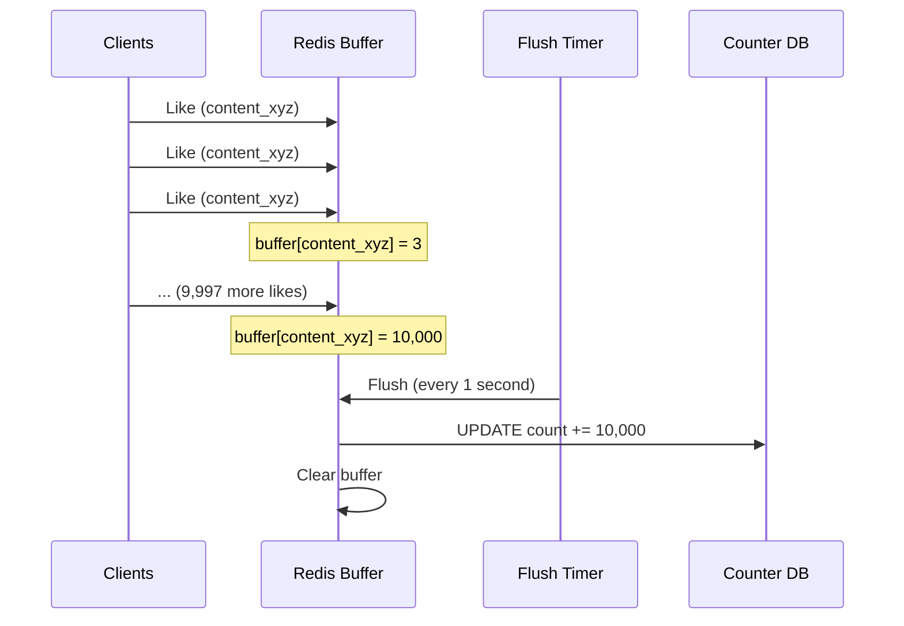

#### **Implementation in Redis:**

#### **Trade-offs:**

The buffer approach has a potential data loss window. If the server crashes between receiving likes and flushing, those likes are lost. Using Redis with AOF persistence or Kafka as the buffer makes this more durable.

### Solution 3: HyperLogLog for Approximate Counts

For content where exact counts are not critical, Redis's HyperLogLog data structure provides an interesting alternative. It uses a fixed amount of memory (about 12KB) regardless of how many elements you add, and it can estimate cardinality with about 0.81% standard error.

The catch: HyperLogLog does not support removal, so unlikes cannot be tracked. This makes it unsuitable for our primary use case but useful for analytics dashboards where you just want order-of-magnitude counts.

### Putting It Together: Adaptive Counting

In practice, the best approach is adaptive. Normal content uses simple counters (cheap and accurate). When content gets hot, we switch to sharded counters.

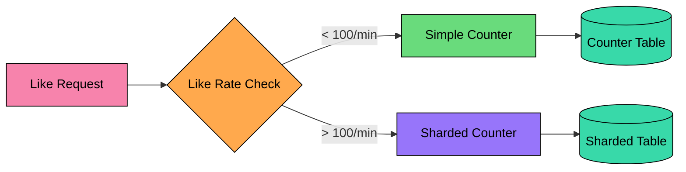

#### **Hot content detection:**

We track the like rate for each content_id using a sliding window counter in Redis:

Once content cools down (rate drops below threshold), we can consolidate the sharded counts back into a single counter.

---

## 6.3 Ensuring Accurate Counts (Deduplication)

A fundamental requirement is that each user can only like content once. This sounds obvious, but implementing it correctly is trickier than it appears. Without proper deduplication, a malicious user could inflate counts by sending repeated like requests, or a flaky network could cause the same like to be recorded multiple times.

### The Retry Problem

Consider this scenario:

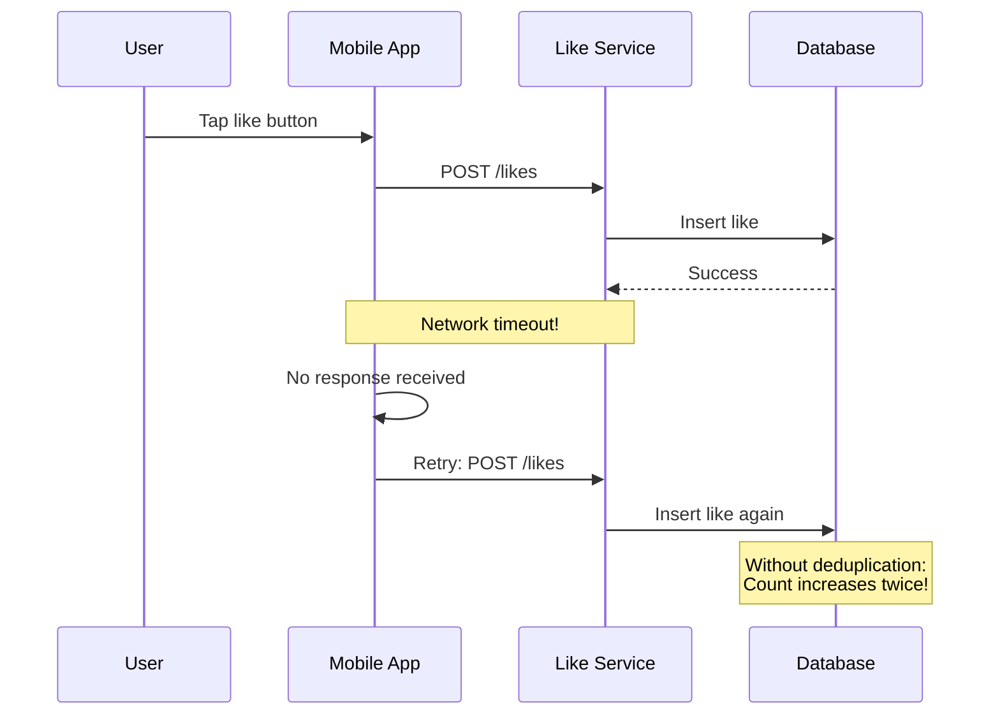

The user tapped once, but the count went up twice. This happens because the first request succeeded at the database, but the response never made it back to the client. The client reasonably retries, and now we have a duplicate.

### Approach 1: Database Uniqueness Constraint

The most reliable approach is to let the database enforce uniqueness. By making (content_id, user_id) the primary key or adding a unique constraint, duplicate inserts will fail.

**Schema:**

#### **Application logic:**

This is the gold standard for deduplication. The database guarantees uniqueness at the lowest level, so no matter how many times the same request is retried, the like is only recorded once.

### Approach 2: Check-Then-Write with Cache

To reduce database load, we can add a cache layer in front:

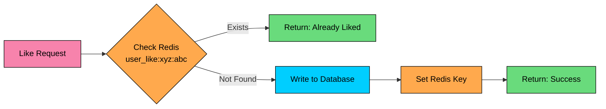

#### **The Flow:**

1. Check Redis: `EXISTS user_like:{content_id}:{user_id}`
2. If exists, return "already liked" without hitting the database
3. If not, write to database and set the cache key

This reduces database writes for repeated requests. The cache absorbs duplicates.

#### **The Race Condition:**

Two concurrent requests for the same like might both pass the cache check (both see "not found"), then both try to write to the database. The database uniqueness constraint catches this, so we do not get duplicates, but we do get one failed write.

This is acceptable because it is rare (requires exact timing), and the database acts as a safety net.

### Recommendation: Defense in Depth

Use both approaches together:

1. **Database uniqueness constraint** as the source of truth (always reliable)
2. **Cache check** to reduce database load and provide fast responses for duplicates
3. **Graceful error handling** to treat constraint violations as "already liked" rather than errors

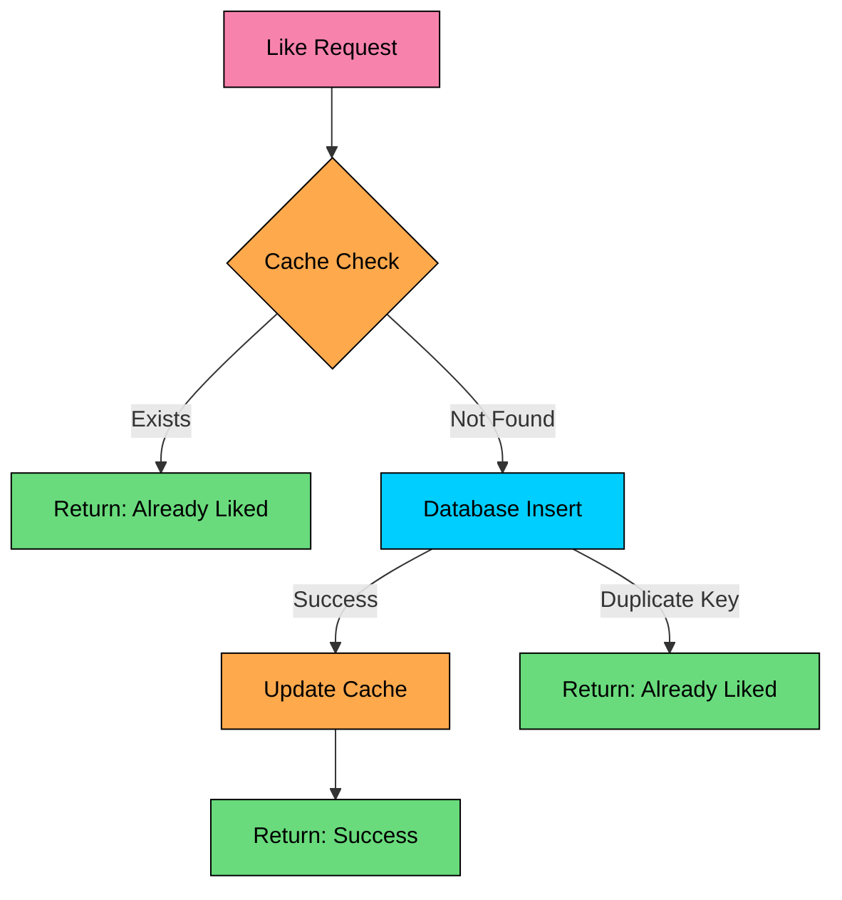

This gives us the best of both worlds: fast performance from the cache and guaranteed correctness from the database.

---

## 6.4 Read Path Optimization

With 350K read QPS at peak, the read path is where we will spend most of our engineering effort. The good news is that like counts are a perfect candidate for aggressive caching: they are read frequently, updated asynchronously, and users tolerate slight staleness.

Let's design a multi-layer caching strategy that can handle this load efficiently.

### Multi-Layer Caching Strategy

```mermaid
flowchart TB
    A[User Request]:::rose --> B[CDN Edge<br/>TTL: 30-60s]:::green
    B -->|miss| C[Redis Cluster<br/>TTL: 5-10 min]:::orange
    C -->|miss| D[Database<br/>Source of Truth]:::purple

    B -->|"hit (70-80%)"| R1[Return to user<br/>~20ms latency]:::green
    C -->|"hit (15-20%)"| R2[Return to user<br/>~50ms latency]:::green
    D --> R3[Return to user<br/>~100ms latency]:::green

    classDef rose fill:#f783ac,stroke:#000,color:#000
    classDef green fill:#69db7c,stroke:#000,color:#000
    classDef orange fill:#ffa94d,stroke:#000,color:#000
    classDef purple fill:#9775fa,stroke:#000,color:#000
```

Each layer catches a portion of requests, so only a small fraction reaches the database:

| Layer | Latency | Expected Hit Rate | What It Stores |
|-------|---------|-------------------|----------------|
| CDN Edge | 10-20ms | 70-80% | Like counts for popular content |
| Redis | ~1ms | 15-20% | Counts + user like status |
| Database | ~20ms | 5-10% | Source of truth |

### Layer 1: CDN Edge Cache

For public content, we can cache like counts at the CDN level. When a user in Tokyo requests the like count for a popular post, CloudFront or Fastly can serve it from a Tokyo edge node without ever hitting our origin.

**What we cache:** The API response including the like count. We set headers like:

**Limitation:** The CDN cannot personalize. It does not know whether the current user has liked the content. We handle this by:

1. Caching the count at the CDN
2. Making a separate request for user like status (which goes to Redis)

For logged-in users, we often skip the CDN for the initial request and go straight to our application, which can return both the count and user status in one response.

### Layer 2: Application Cache (Redis)

Redis is our workhorse for caching. It stores two types of data:

#### **Like counts:**

#### **User like status:**

Why the different TTLs" Counts change frequently and can tolerate staleness. User status rarely changes (a user does not like/unlike rapidly) and should be accurate when they return to the content.

### Layer 3: Local In-Memory Cache

For extremely hot content (trending posts viewed thousands of times per second), even Redis can become a bottleneck. We add a local in-memory cache on each application server:

With 10 application servers, a 5-second TTL means we hit Redis at most 2 times per second per server, or 20 times per second total, instead of thousands of times.

The trade-off is slightly stale data, but for like counts, nobody notices if the count updates 5 seconds late.

### Batch API for Feed Rendering

When a user scrolls their feed, they see 20+ posts. Making 20 separate requests for like counts would be wasteful and slow. Instead, we use a batch API:

```mermaid
sequenceDiagram
    participant App as Mobile App
    participant Server as Like Service
    participant Cache as Redis
    participant DB as Database

    App->>Server: POST /likes/count/batch<br/>[content_a, content_b, ... content_t]
    Server->>Cache: MGET count:a, count:b, ... count:t
    Cache-->>Server: [12847, 892, null, 3401, null, ...]
    Note over Server: Found 18/20 in cache
    Server->>DB: Query counts for content_c, content_p
    DB-->>Server: [567, 234]
    Server->>Cache: SET count:c=567, count:p=234
    Server-->>App: [{a: 12847}, {b: 892}, {c: 567}, ...]
```

Redis's `MGET` command lets us fetch up to 100 keys in a single round trip. For any cache misses, we query the database in parallel and backfill the cache.

## 6.5 Consistency Model

Understanding our consistency guarantees helps set correct expectations. Not everything in our system needs to be strongly consistent, and trying to make everything consistent would hurt performance. The key is knowing which operations need strong guarantees and which can be eventually consistent.

```mermaid
flowchart LR

    subgraph EC["Eventual Consistency (Can lag)"]
        E1["Like counts<br/>How many likes""]:::orange
        E2["Other users' status<br/>Who else liked""]:::orange
    end

    subgraph SC["Strong Consistency (Must be accurate)"]
        S1["User's own like status<br/>Did I like this""]:::green
        S2["Deduplication<br/>Can I like again""]:::green
    end

    classDef green fill:#69db7c,stroke:#000,color:#000
    classDef orange fill:#ffa94d,stroke:#000,color:#000
```

### What Must Be Strongly Consistent

**User's own like status:** If I just liked something, I must see that heart filled in. There is nothing more confusing than tapping like, seeing a brief animation, and then the heart appears empty. This breaks trust in the UI.

**Deduplication:** A user cannot like the same content twice. This is enforced at the database level with a primary key constraint, so it is always correct regardless of caching or async processing.

#### **Implementation:**

- Write-through cache: When we write to the database, we immediately update the user's like status in Redis
- The API response includes the user's current like status, so the UI updates correctly

### What Can Be Eventually Consistent

**Like counts:** If a post has 12,847 likes and someone just liked it, showing 12,847 for a few more seconds is fine. Users are accustomed to seeing rounded numbers like "12.8K" anyway.

**Other users' status:** We do not display who specifically liked something (that would be a different feature with different requirements).

#### **Implementation:**

- Async aggregation through Kafka: Like events are processed in the background
- TTL-based caching: Counts refresh every few minutes
- Slight staleness is invisible to users

### Read-Your-Own-Writes Guarantee

This is the one tricky case. After a user likes content, they should immediately see:

1. The heart filled in (their like status)
2. The count incremented by at least 1

The first is handled by write-through caching. The second requires a small trick: optimistic UI updates.

```mermaid
sequenceDiagram
    participant App as Mobile App
    participant Server as Like Service
    participant Cache as Redis

    App->>App: User taps like
    App->>App: Immediately show filled heart<br/>and increment count locally
    App->>Server: POST /likes (async)
    Server->>Cache: Update user status
    Server-->>App: 200 OK with actual count
    App->>App: Reconcile local state<br/>with server response
```

The app optimistically updates the UI before the server response comes back. When the server responds, it includes the actual count, and the app reconciles. In most cases, the optimistic update was correct. In rare cases (like race conditions), the app adjusts.

This pattern, called "optimistic UI," provides instant feedback while maintaining eventual correctness.

---

# Quiz
