> 💡 **Key Insight:**

> **QUESTION**
>
> #### What is LeetCode"
>
> LeetCode is an online platform where programmers practice coding problems, participate in contests, and prepare for technical interviews.
>
> The core idea is straightforward: users browse coding problems, write solutions in their preferred programming language, submit them for evaluation, and receive immediate feedback on correctness and performance. 
>
> 
> <!-- Simulation: leetcode -->
> 

>
> The system must execute untrusted user code safely, compare outputs against test cases, and rank solutions by efficiency.
>
> **Popular Examples:** [LeetCode](https://leetcode.com/), [HackerRank](https://hackerrank.com/), [Codeforces](https://codeforces.com/), [CodeChef](https://codechef.com/)

This system design problem covers several interesting challenges: secure code execution, real-time judging, contest management, and leaderboard systems.

In this chapter, we will explore the **high-level design of an online coding platform like LeetCode**.

Let's start by understanding what exactly we need to build.

---

# 1. Clarifying Requirements

Before sketching any architecture, we need to understand what we are building. 

An online judge might seem straightforward on the surface, but the requirements can vary significantly. Are we supporting just one language or dozens" Do we need real-time contests with thousands of concurrent participants" How quickly should submissions be judged" These questions shape every subsequent design decision.

Here is how a requirements discussion might unfold in an interview:

> 💡 **Key Insight:**

> **DISCUSSION**
>
> **Candidate:** "What is the expected scale" How many users and submissions per day""
>
> **Interviewer:** "Let's design for 1 million daily active users with about 5 million code submissions per day. During contests, we can see 10x spikes."
>
> **Candidate:** "Which programming languages should we support for code execution""
>
> **Interviewer:** "Start with the most popular ones: Python, Java, C++, JavaScript, and Go. The system should be extensible to add more languages."
>
> **Candidate:** "Should we support real-time contests with live leaderboards""
>
> **Interviewer:** "Yes, contests are a key feature. We need real-time ranking updates during contests with thousands of concurrent participants."
>
> **Candidate:** "What are the time and memory limits for code execution""
>
> **Interviewer:** "Typical limits are 1-5 seconds for execution time and 256-512 MB for memory. These vary per problem."
>
> **Candidate:** "Do we need to prevent cheating, like users sharing solutions during contests""
>
> **Interviewer:** "Basic anti-cheat measures are important, but focus on the core system design. Plagiarism detection can be a nice-to-have."
>
> **Candidate:** "Should the system show detailed feedback like which test cases failed""
>
> **Interviewer:** "Yes, show verdict (Accepted, Wrong Answer, Time Limit Exceeded, etc.), execution time, memory usage, and which test cases passed or failed."

This conversation reveals several important constraints that will shape our architecture. Let's formalize these into functional and non-functional requirements.

## 1.1 Functional Requirements

Based on the discussion, here are the core features our system must support:

- **Problem Browsing:** Users can browse, search, and view coding problems with descriptions, examples, and constraints.
- **Code Submission:** Users can write and submit code in multiple programming languages.
- **Code Execution:** The system executes submitted code against test cases and returns results.
- **Verdict System:** Provide detailed feedback including pass/fail status, execution time, and memory usage.
- **Contests:** Support timed coding contests with real-time leaderboards.
- **User Progress:** Track solved problems, submission history, and statistics.

---

## 1.2 Non-Functional Requirements

Beyond features, we need to consider the qualities that make the system production-ready:

- **Security:** Execute untrusted user code in isolated sandboxes to prevent malicious attacks.
- **Low Latency:** Code submissions should be judged within 5-10 seconds under normal load.
- **Scalability:** Handle 10x traffic spikes during popular contests.
- **High Availability:** The system should be available 99.9% of the time, especially during contests.
- **Fairness:** Ensure consistent execution environments so all users are judged equally.

---

# 2. Back-of-the-Envelope Estimation

Before diving into the architecture, let's run some quick calculations to understand the scale we are dealing with. These numbers will guide our decisions around storage, queuing, and how many judge workers we need.

### 2.1 Traffic Estimates

Starting with the numbers from our requirements discussion:

#### **Submission Traffic (Writes)**

We expect 5 million code submissions per day. Let's convert this to queries per second:

Traffic is never uniform throughout the day. During peak hours and especially when contests are running, we might see 10x the average load:

#### **Problem Views (Reads)**

Users spend much more time reading problems and viewing solutions than submitting code. Assume a 20:1 read-to-write ratio:

#### **Code Executions**

This is where the math gets interesting. Each submission runs against multiple test cases, typically 10-50 depending on the problem. Assuming an average of 30 test cases per problem:

That is a lot of code executions. During a major contest with 10,000 participants all submitting within a 2-hour window, we could see sustained bursts well above these averages.

### 2.2 Storage Estimates

Each submission consists of the code itself plus metadata and results. Let's break down what we need to store:

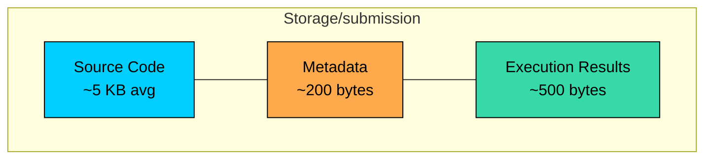

#### **Per-Submission Breakdown:**

- **Source code:** Average ~5 KB (most solutions are under 200 lines, but some can be larger)
- **Metadata:** User ID, problem ID, language, verdict, timestamps = ~200 bytes
- **Execution results:** Runtime, memory usage, per-test-case verdicts = ~500 bytes

This gives us approximately 6 KB per submission. Now let's project storage growth:

| Data Type | Daily Volume | Annual Storage | Notes |
|-----------|--------------|----------------|-------|
| Submissions | 5M × 6 KB = 30 GB | ~11 TB | Main storage driver |
| Problems + Test Cases | 3,000 × 10 MB | ~30 GB | Relatively static |
| User Profiles | 1M users × 1 KB | ~1 GB | Grows slowly |

### **Key observations from these numbers:**

1. **Submissions dominate storage:** At 11 TB per year, submission data is by far the largest component. We should consider archiving old submissions or compressing them.
2. **Test cases are large:** A problem with 50 test cases, where each input/output pair might be several hundred KB, can easily reach 10 MB. These need to be efficiently accessible to judge workers.
3. **Growth is predictable:** Unlike viral content platforms, coding platform storage grows linearly and predictably, making capacity planning straightforward.

---

# 3. Core APIs

With our requirements and scale understood, let's define the API contract. The platform needs endpoints for browsing problems, submitting code, checking results, and managing contests. Let's walk through the essential ones.

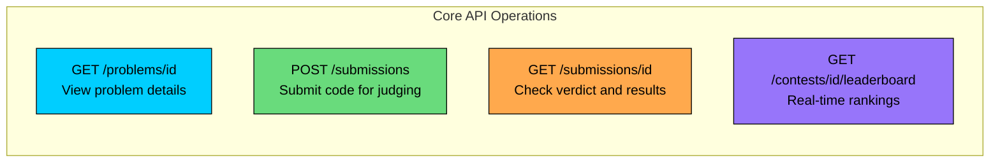

### 3.1 Get Problem

#### **Endpoint:** `GET /problems/{problem_id}`

This endpoint retrieves everything a user needs to solve a problem: the description, examples, constraints, and metadata. It is the most frequently called endpoint since users spend more time reading problems than submitting solutions.

#### **Path Parameters:**

| Parameter | Type | Description |
|-----------|------|-------------|
| `problem_id` | string | Unique identifier for the problem (e.g., "two-sum" or "123") |

#### **Response Fields:**

| Field | Type | Description |
|-------|------|-------------|
| `problem_id` | string | Unique problem identifier |
| `title` | string | Human-readable title (e.g., "Two Sum") |
| `description` | string | Full problem statement in markdown, including examples |
| `examples` | array | Input/output examples with explanations |
| `constraints` | object | Time limit, memory limit, and input constraints |
| `difficulty` | enum | "Easy", "Medium", or "Hard" |
| `tags` | array | Categories like "Array", "Hash Table", "Dynamic Programming" |
| `acceptance_rate` | float | Percentage of accepted submissions |
| `starter_code` | object | Template code for each supported language |

### 3.2 Submit Code

#### **Endpoint:** `POST /submissions`

This is where the action happens. Users submit their code, and the system queues it for evaluation. The response comes back immediately with a submission ID, but the actual judging happens asynchronously.

#### **Request Body:**

| Parameter | Type | Required | Description |
|-----------|------|----------|-------------|
| `problem_id` | string | Yes | The problem being solved |
| `language` | string | Yes | Programming language ("python", "java", "cpp", "javascript", "go") |
| `code` | string | Yes | The source code to execute (max 64 KB) |
| `contest_id` | string | No | Include if this is a contest submission |

#### **Example Request:**

#### **Response (201 Created):**

The client should then poll the submission status endpoint (or use WebSocket for real-time updates) to get the final verdict.

#### **Error Responses:**

| Status Code | Meaning | When It Occurs |
|-------------|---------|----------------|
| `400 Bad Request` | Invalid input | Code is empty, too large, or language unsupported |
| `401 Unauthorized` | Not logged in | Anonymous submissions not allowed |
| `429 Too Many Requests` | Rate limited | User submitted too many times too quickly |

### 3.3 Get Submission Result

#### **Endpoint:** `GET /submissions/{submission_id}`

After submitting code, users poll this endpoint to check on the status. Initially it returns "running", and eventually the final verdict with detailed results.

#### **Response Fields:**

| Field | Type | Description |
|-------|------|-------------|
| `submission_id` | string | Unique submission identifier |
| `status` | enum | "queued", "compiling", "running", "completed" |
| `verdict` | enum | "Accepted", "Wrong Answer", "TLE", "MLE", "Runtime Error", "Compilation Error" |
| `runtime_ms` | integer | Execution time in milliseconds |
| `memory_kb` | integer | Peak memory usage in kilobytes |
| `test_cases_passed` | integer | Number of test cases that passed |
| `total_test_cases` | integer | Total number of test cases |
| `error_message` | string | Compilation or runtime error details (if applicable) |
| `runtime_percentile` | float | How fast compared to other accepted solutions |

#### **Example Response (Accepted):**

#### **Example Response (Wrong Answer):**

### 3.4 Get Contest Leaderboard

#### **Endpoint:** `GET /contests/{contest_id}/leaderboard`

Retrieves the real-time ranking for an active contest. During popular contests, this endpoint can see thousands of requests per second as participants anxiously check their standing.

#### **Query Parameters:**

| Parameter | Type | Default | Description |
|-----------|------|---------|-------------|
| `page` | integer | 1 | Page number for pagination |
| `limit` | integer | 50 | Number of entries per page (max 100) |
| `around_user` | string | null | Center results around a specific user |

#### **Response Fields:**

| Field | Type | Description |
|-------|------|-------------|
| `rankings` | array | List of user rankings |
| `rankings[].rank` | integer | Current position |
| `rankings[].user_id` | string | User identifier |
| `rankings[].username` | string | Display name |
| `rankings[].score` | integer | Total points earned |
| `rankings[].problems_solved` | integer | Number of problems solved |
| `rankings[].penalty_time` | integer | Total penalty time in minutes (for ICPC-style) |
| `total_participants` | integer | Total number of participants |
| `last_updated` | timestamp | When the leaderboard was last computed |

The `around_user` parameter is useful for showing a user their current standing without loading the entire top of the leaderboard. If you are ranked 5,432nd, you probably care more about the people immediately around you than the top 10.

---

# 4. High-Level Design

Now we get to the interesting part: designing the system architecture. Rather than presenting a complex diagram upfront, we will build the design incrementally, starting with the simplest requirement and adding components as we encounter challenges. This mirrors how you would explain the design in an interview.

Our system needs to handle three fundamental operations:

1. **Problem Browsing:** Users view and search coding problems (read-heavy, cacheable)
2. **Code Submission and Execution:** The system runs user code and returns results (the hard part)
3. **Contest Management:** Real-time competitions with live leaderboards (time-sensitive)

The most challenging aspect is secure code execution. We are essentially running arbitrary, untrusted code submitted by millions of users. That code could contain infinite loops, memory bombs, attempts to access the file system, or worse. The system must run it safely in complete isolation while still providing accurate, fair results.

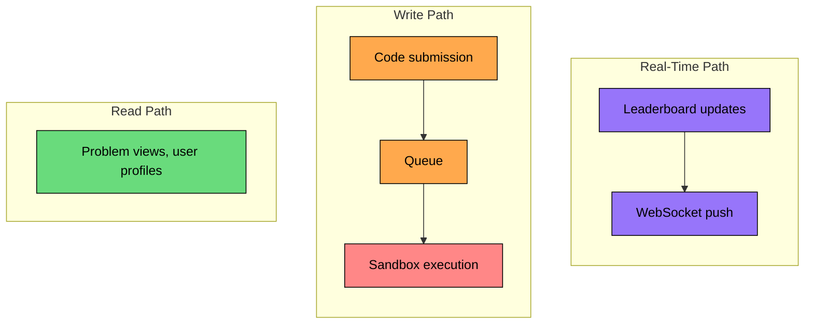

Let's build the architecture step by step, starting with the simplest requirement.

## 4.1 Requirement 1: Problem Browsing

Users spend most of their time reading problems, searching for specific topics, and reviewing solutions. This is a read-heavy workload that lends itself well to caching.

A typical browsing session might look like:

- Filter problems by "Medium" difficulty and "Dynamic Programming" tag
- Open a problem to read the description
- View the discussion section for hints
- Check the solution after solving (or giving up)

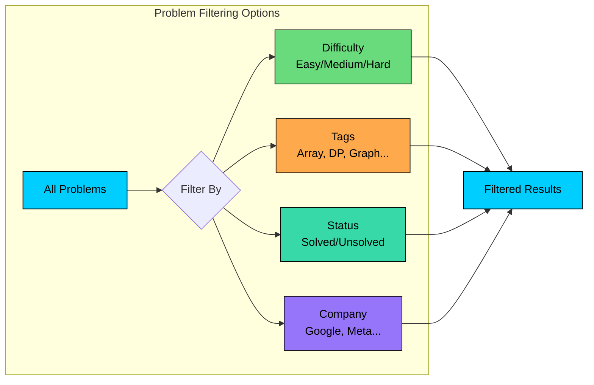

### Components for Problem Browsing

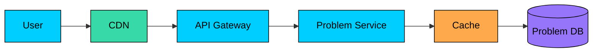

#### **Problem Service**

This service handles all problem-related operations. It is the brain behind the problem catalog, responsible for serving problem descriptions and metadata, handling search and filtering by difficulty, tags, and company, and managing problem statistics like acceptance rate and submission count.

Since problem content rarely changes (maybe a few edits per week to fix typos or add test cases), this service can serve most requests from cache.

#### **Problem Database**

Stores all problem data including descriptions, test cases, starter code templates, and metadata. We will use PostgreSQL here since we need to support complex queries (filtering by multiple criteria) and the data is highly relational.

#### **CDN (Content Delivery Network)**

Problem descriptions are essentially static content. Once a user in Singapore requests the "Two Sum" problem, there is no reason to fetch it from our Virginia data center again. The CDN caches this content at edge locations worldwide, reducing latency from 200ms to under 50ms.

### Flow: Viewing a Problem

Let's trace through what happens when a user opens a problem:

1. **User requests problem:** The browser sends `GET /problems/two-sum`.
2. **CDN check:** The CDN edge node checks if it has this problem cached. For popular problems, it usually does, and the response returns in under 50ms.
3. **Cache miss path:** If the CDN does not have it, the request goes to our API Gateway and then the Problem Service.
4. **Application cache:** The Problem Service first checks Redis. Problem data is cached aggressively since it rarely changes.
5. **Database fallback:** Only on a complete cache miss do we hit the PostgreSQL database. We then populate the Redis cache before returning.
6. **Response flows back:** The response propagates back through the CDN (which caches it) to the user.

### Sequence Diagram: Viewing a Problem

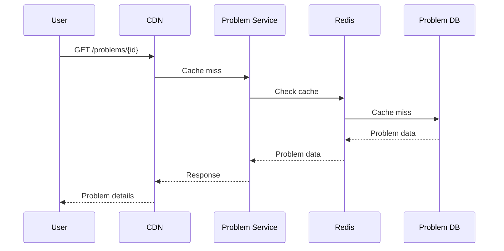

---

## 4.2 Requirement 2: Code Submission and Execution

Now for the hard part. When a user clicks "Submit", their code needs to be compiled, executed against dozens of test cases, and judged, all within a few seconds. And it must be done safely, since we are running arbitrary code from strangers on the internet.

A submission goes through several states before reaching its final verdict:

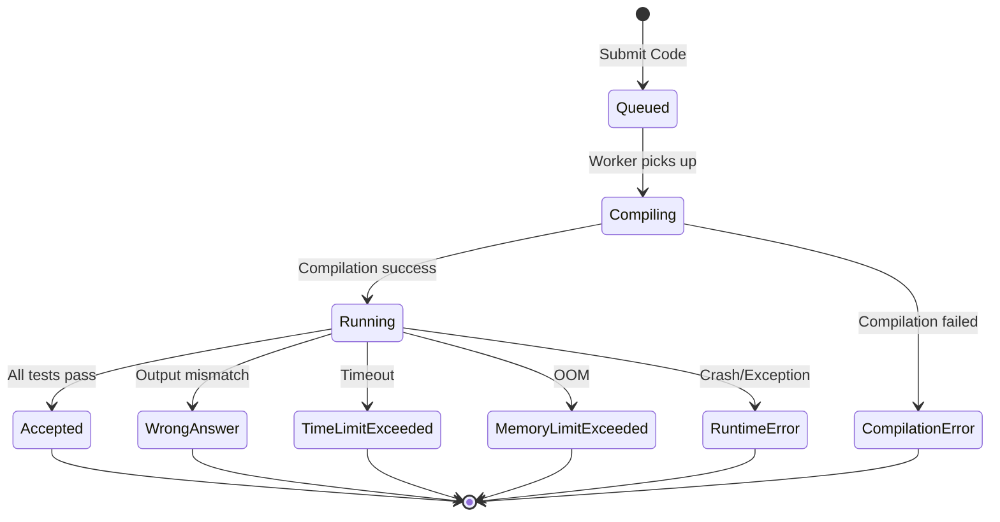

The key insight here is that code execution is expensive and variable. Some submissions finish in 10ms; others time out after 5 seconds. Some contest problems have 50+ test cases. We cannot afford to process submissions synchronously, it would tie up our API servers and create terrible latency during peak traffic.

Instead, we use a queue-based architecture: accept the submission quickly, queue it for processing, and let the user poll for results (or push them via WebSocket).

### Components for Code Execution

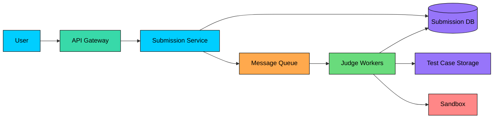

#### **Submission Service**

This service handles the initial submission request. It validates that the code is not too large, the language is supported, and the user has not exceeded their rate limit. Then it stores the submission in the database and pushes a message to the queue. The user gets back a submission ID immediately, typically within 100ms.

#### **Message Queue (Kafka or SQS)**

The queue decouples submission intake from execution. This is critical for two reasons:

1. **Traffic spikes:** When a contest starts, we might receive 10x normal traffic. The queue absorbs this burst while workers process at a steady pace.
2. **Failure isolation:** If a judge worker crashes, the message stays in the queue and another worker picks it up.

#### **Judge Workers**

These are the heart of the system, the machines that actually run user code. Each worker pulls submissions from the queue, executes the code in a sandboxed environment, compares outputs against expected results, and reports the verdict back.

Judge workers need to:

- Support multiple languages (each needs its own compiler/interpreter)
- Enforce strict time and memory limits
- Provide complete isolation between submissions
- Handle malicious code that tries to escape the sandbox

#### **Test Case Storage (S3 or similar)**

Each problem has a set of test cases: inputs and expected outputs. For a complex problem, these can total several megabytes. We store them in object storage (like S3) and cache them on judge workers for fast access.

### Flow: Submitting Code

Here is how all these components work together when a user submits their solution:

1. **User submits code:** The browser sends `POST /submissions` with the code, problem ID, and language.
2. **Validation:** The Submission Service validates the request: Is the user authenticated" Is the language supported" Is the code within size limits" Has the user exceeded their submission rate limit"
3. **Persist and queue:** The service creates a submission record in the database with status "queued" and pushes a message to the queue containing the submission ID and metadata.
4. **Immediate response:** The user gets back the submission ID within ~100ms. The actual judging happens asynchronously.
5. **Worker picks up job:** A Judge Worker pulls the message from the queue. It fetches the test cases (usually cached locally) and prepares the sandbox environment.
6. **Compilation:** For compiled languages (C++, Java, Go), the worker compiles the code first. If compilation fails, the verdict is "Compilation Error" and we are done.
7. **Execution:** The worker runs the compiled code (or interprets it for Python/JS) against each test case, one at a time. For each test case, it captures stdout, measures time and memory, and compares output against the expected result.
8. **Verdict determination:** If all test cases pass, the verdict is "Accepted". If any test case fails, the verdict depends on why: wrong output (WA), timeout (TLE), memory exceeded (MLE), or crash (RE).
9. **Update database:** The worker updates the submission record with the verdict, runtime, memory usage, and per-test-case results.
10. **User gets results:** The user either polls `GET /submissions/{id}` or receives a WebSocket push with the final verdict.

### Sequence Diagram: Code Submission

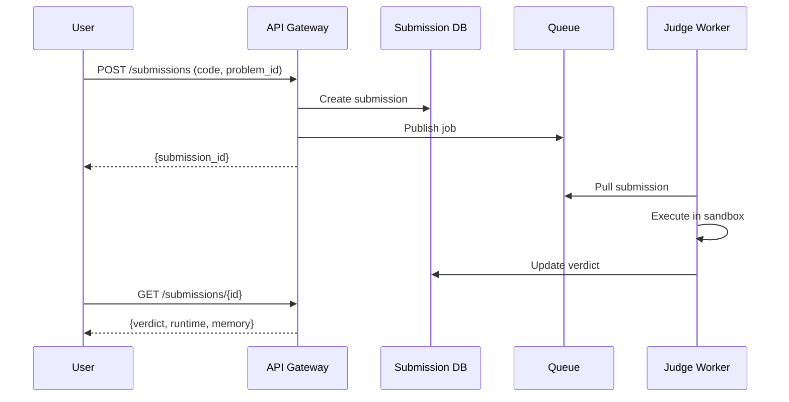

### Sequence Diagram: Run Code (Test Run)

Users can test their code with custom input before submitting. This runs against sample test cases only.

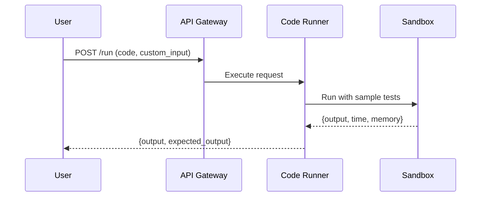

---

## 4.3 Requirement 3: Contest Management

Contests are what make coding platforms exciting. Thousands of participants competing in real-time, watching their rank change with each submission. This creates unique challenges:

- **Traffic spikes:** Everyone starts submitting at once when the contest begins
- **Real-time leaderboard:** Rankings need to update within seconds of each verdict
- **Fairness:** All participants must be judged under identical conditions
- **Time sensitivity:** A submission at minute 59 matters differently than one at minute 5

### Components for Contest Management

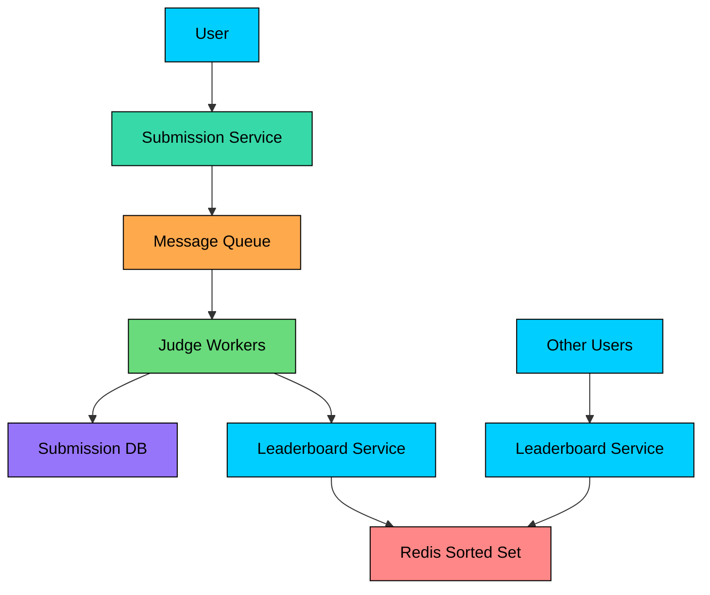

#### **Contest Service**

This service manages the contest lifecycle: creating contests, handling registrations, calculating scores based on contest rules (ICPC-style, IOI-style, etc.), and managing contest state (upcoming, running, ended). It also enforces rules like "no submissions after the deadline."

#### **Leaderboard Service**

This is the component that makes contests feel real-time. Every time a submission is judged, the Leaderboard Service recalculates the user's score and updates their position. During a contest with 10,000 participants, this service might handle hundreds of updates per second.

#### **Redis Sorted Sets**

Redis sorted sets are the perfect data structure for real-time leaderboards. They provide O(log N) updates and O(log N + M) range queries, which means we can update a user's score and fetch the top 100 participants in milliseconds.

### Flow: Contest Submission and Leaderboard Update

Let's trace through what happens when a contestant submits a solution:

1. **Submission arrives:** User submits code for contest problem #2. The submission is tagged with the contest ID.
2. **Normal judging flow:** The submission goes through the same queue and worker flow as regular submissions, but with higher priority during active contests.
3. **Judge notifies leaderboard:** When the verdict is determined, the Judge Worker notifies the Leaderboard Service with user_id, contest_id, problem_id, verdict, and submission timestamp.
4. **Score calculation:** The Leaderboard Service calculates the new score based on the contest rules. For ICPC-style: add 1 to problems solved, add penalty time. For IOI-style: add partial points based on test cases passed.
5. **Redis update:** The service issues a `ZADD` command to Redis, updating the user's score in the sorted set. This is an O(log N) operation.
6. **Leaderboard queries:** Other participants fetching the leaderboard get updated rankings within seconds. The `ZREVRANGE` command returns the top N users in O(log N + M) time.

### Sequence Diagram: Contest Participation

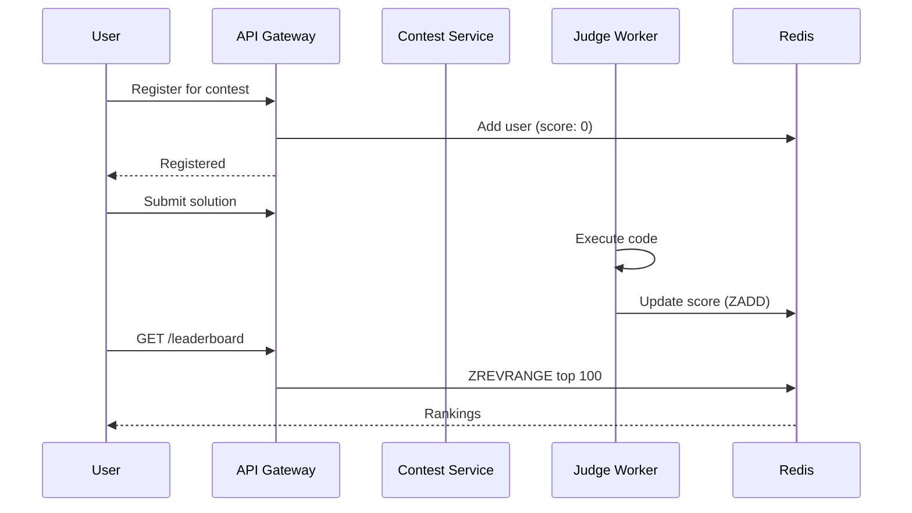

---

## 4.4 Putting It All Together

Now that we have designed each requirement individually, let's step back and see the complete architecture. The diagram below shows how all the components work together:

```mermaid
flowchart TB
    subgraph Clients
        U[Users/Browsers]:::primary
    end

    subgraph Edge
        CDN[CDN]:::secondary
        LB[Load Balancer]:::secondary
    end

    subgraph API Layer
        GW[API Gateway]:::primary
    end

    subgraph Services
        PS[Problem Service]:::primary
        SS[Submission Service]:::primary
        CS[Contest Service]:::primary
        LS[Leaderboard Service]:::primary
    end

    subgraph Execution Layer
        MQ[Message Queue]:::orange
        JW1[Judge Worker 1]:::green
        JW2[Judge Worker 2]:::green
        JW3[Judge Worker N]:::green
    end

    subgraph Data Layer
        RC[Redis Cache]:::red
        PDB[(Problem DB)]:::purple
        SDB[(Submission DB)]:::purple
        TCS[(Test Case Storage)]:::purple
    end

    U --> CDN
    CDN --> LB
    LB --> GW
    GW --> PS
    GW --> SS
    GW --> CS
    GW --> LS

    PS --> RC
    PS --> PDB

    SS --> SDB
    SS --> MQ

    MQ --> JW1
    MQ --> JW2
    MQ --> JW3

    JW1 --> TCS
    JW2 --> TCS
    JW3 --> TCS
    JW1 --> SDB
    JW2 --> SDB
    JW3 --> SDB

    CS --> PDB
    CS --> RC

    LS --> RC

    classDef primary fill:#00ceff,stroke:#000,color:#000
    classDef secondary fill:#38d9a9,stroke:#000,color:#000
    classDef purple fill:#9775fa,stroke:#000,color:#000
    classDef orange fill:#ffa94d,stroke:#000,color:#000
    classDef green fill:#69db7c,stroke:#000,color:#000
    classDef red fill:#ff8787,stroke:#000,color:#000
```

### Core Components Summary

| Component | Purpose | Scaling Strategy |
|-----------|---------|-----------------|
| CDN | Cache static content, reduce latency globally | Managed service (auto-scales) |
| API Gateway | Route requests, authentication, rate limiting | Horizontal (add instances) |
| Problem Service | Serve problem data and search functionality | Horizontal (stateless) |
| Submission Service | Handle code submissions, queue for execution | Horizontal (stateless) |
| Contest Service | Manage contests, registration, and scoring | Horizontal (stateless) |
| Leaderboard Service | Maintain real-time contest rankings | Horizontal with Redis Cluster |
| Message Queue | Decouple submission intake from execution | Managed service (Kafka/SQS) |
| Judge Workers | Execute code in sandboxes, determine verdicts | Horizontal (add workers) |
| Redis Cache | Cache frequently accessed data, store leaderboards | Redis Cluster |
| Problem DB | Store problem metadata and descriptions | PostgreSQL with read replicas |
| Submission DB | Store submission records and results | PostgreSQL (consider sharding) |
| Test Case Storage | Store input/output test cases | S3 or similar (auto-scales) |

The architecture follows a layered approach where each layer has a specific responsibility. The key insight is that judge workers are the bottleneck during peak traffic. By decoupling them with a queue, we can scale them independently and absorb traffic spikes gracefully.

---

# 5. Database Design

With the high-level architecture in place, let's zoom into the data layer. Choosing the right database and designing an efficient schema are critical decisions that affect performance, scalability, and operational complexity.

## 5.1 Choosing the Right Database

The database choice is not always obvious. Let's think through our access patterns and requirements:

#### **What we need to store:**

- Millions of problems, submissions, and user records
- Submission history for analytics and user progress tracking
- Contest data with strict consistency requirements

#### **How we access the data:**

- Point lookups by submission_id (the most common query)
- Filter problems by difficulty, tags, and company
- Query user's solved problems for progress tracking
- Range queries for contest leaderboard calculations

#### **Consistency requirements:**

- Users must see their submission immediately after creation
- Contest scores must be accurate and consistent
- Slight staleness is acceptable for problem statistics

Given these patterns, we use a hybrid approach:

#### **PostgreSQL for Core Data**

A relational database like PostgreSQL fits well for our main data because:

- We have highly relational data (users have submissions, submissions belong to problems)
- We need complex queries with multiple filters
- ACID transactions ensure contest integrity
- Mature tooling for backups, monitoring, and analytics

#### **Redis for Real-Time Features**

For components that need sub-millisecond latency or specialized data structures:

- **Leaderboards:** Redis sorted sets with O(log N) updates
- **Caching:** Problem data, user sessions, rate limit counters
- **Pub/Sub:** Real-time notifications for submission results

## 5.2 Database Schema

Now let's design the tables we need. The schema is fairly straightforward since we have clear entities: users, problems, submissions, and contests.

### Core Tables

Let's walk through the key tables and their fields:

#### **1. Problems Table**

Stores coding problem metadata. This is the foundation of the platform.

| Field             | Type         | Description                           |
| ----------------- | ------------ | ------------------------------------- |
| `problem_id`      | UUID (PK)    | Unique problem identifier             |
| `title`           | VARCHAR(200) | Problem title                         |
| `description`     | TEXT         | Full problem statement (markdown)     |
| `difficulty`      | ENUM         | Easy, Medium, Hard                    |
| `time_limit_ms`   | INTEGER      | Maximum execution time                |
| `memory_limit_kb` | INTEGER      | Maximum memory allowed                |
| `created_at`      | TIMESTAMP    | When problem was created              |
| `is_premium`      | BOOLEAN      | Whether problem requires subscription |

**Indexes:** `difficulty`, `created_at`

#### **2. Problem Tags Table**

Many-to-many relationship between problems and tags.

| Field        | Type        | Description                       |
| ------------ | ----------- | --------------------------------- |
| `problem_id` | UUID (FK)   | Reference to problem              |
| `tag`        | VARCHAR(50) | Tag name (Array, DP, Graph, etc.) |

**Index:** `tag`

#### **3. Test Cases Table**

Stores test case metadata. Actual input/output files stored in object storage.

| Field          | Type         | Description                 |
| -------------- | ------------ | --------------------------- |
| `test_case_id` | UUID (PK)    | Unique test case identifier |
| `problem_id`   | UUID (FK)    | Reference to problem        |
| `input_path`   | VARCHAR(500) | S3 path to input file       |
| `output_path`  | VARCHAR(500) | S3 path to expected output  |
| `is_sample`    | BOOLEAN      | Whether shown to users      |
| `order_index`  | INTEGER      | Execution order             |

#### **4. Submissions Table**

Stores all user submissions.

| Field               | Type                | Description                    |
| ------------------- | ------------------- | ------------------------------ |
| `submission_id`     | UUID (PK)           | Unique submission identifier   |
| `user_id`           | UUID (FK)           | User who submitted             |
| `problem_id`        | UUID (FK)           | Problem being solved           |
| `contest_id`        | UUID (FK, nullable) | Contest (if applicable)        |
| `language`          | VARCHAR(20)         | Programming language           |
| `code`              | TEXT                | Submitted source code          |
| `verdict`           | ENUM                | Accepted, WA, TLE, MLE, RE, CE |
| `runtime_ms`        | INTEGER             | Execution time                 |
| `memory_kb`         | INTEGER             | Memory used                    |
| `test_cases_passed` | INTEGER             | Number of passing tests        |
| `submitted_at`      | TIMESTAMP           | Submission timestamp           |

**Indexes:** `(user_id, problem_id)`, `(contest_id, submitted_at)`, `submitted_at`

#### **5. Contests Table**

Stores contest configuration.

| Field          | Type         | Description               |
| -------------- | ------------ | ------------------------- |
| `contest_id`   | UUID (PK)    | Unique contest identifier |
| `title`        | VARCHAR(200) | Contest name              |
| `start_time`   | TIMESTAMP    | When contest begins       |
| `end_time`     | TIMESTAMP    | When contest ends         |
| `scoring_type` | ENUM         | ICPC, IOI, or custom      |
| `created_by`   | UUID (FK)    | Admin who created         |

#### **6. Contest Registrations Table**

Tracks contest participants.

| Field           | Type      | Description                        |
| --------------- | --------- | ---------------------------------- |
| `contest_id`    | UUID (FK) | Contest identifier                 |
| `user_id`       | UUID (FK) | Registered user                    |
| `registered_at` | TIMESTAMP | Registration time                  |
| `final_rank`    | INTEGER   | Final position (set after contest) |
| `final_score`   | INTEGER   | Final score                        |

**Primary Key:** `(contest_id, user_id)`

---

# 6. Design Deep Dive

The high-level architecture gives us a solid foundation, but system design interviews often go deeper into specific components.

In this section, we will explore the trickiest parts of our design: sandboxing untrusted code, building the judge system, implementing real-time leaderboards, preventing abuse, and handling traffic spikes.

These are the topics that distinguish a good system design answer from a great one.

## 6.1 Secure Code Execution (Sandboxing)

This is where the magic happens, and also where things can go terribly wrong if we are not careful. We are running arbitrary code from strangers on the internet. That code could be:

- **Malicious:** Attempting to access the file system, make network calls, or exploit kernel vulnerabilities
- **Resource-hungry:** Infinite loops, fork bombs, or allocating terabytes of memory
- **Escape attempts:** Trying to break out of the sandbox to compromise the host or other users

A robust sandboxing strategy must guarantee three things:

1. **Isolation:** A submission cannot see or affect other submissions running on the same machine
2. **Resource limits:** Strict enforcement of CPU time, memory, and I/O limits
3. **Consistency:** Every user gets the exact same execution environment, ensuring fair evaluation

Let's explore three approaches, each with different trade-offs between security, performance, and complexity.

### Approach 1: Process-Level Isolation (seccomp + namespaces)

This approach uses Linux kernel features to create lightweight sandboxes. It is what platforms like Codeforces use because of its minimal overhead.

#### **How It Works:**

The sandbox combines three Linux technologies:

1. **Linux Namespaces** create isolated views of system resources. The submitted code runs in its own PID namespace (it only sees itself), network namespace (no network access), mount namespace (restricted filesystem view), and user namespace (runs as an unprivileged user).
2. **seccomp (Secure Computing Mode)** restricts which system calls the process can make. We whitelist only the essentials (read, write, exit, mmap) and block dangerous ones (fork, execve, socket, ptrace).
3. **cgroups (Control Groups)** enforce resource limits: CPU time, memory, and I/O bandwidth.

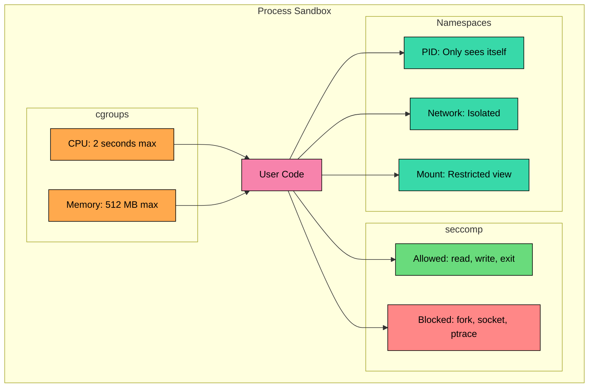

**Pros:**

- **Fast startup (~10ms):** No container or VM overhead
- **Fine-grained control:** Precise control over exactly which syscalls are allowed
- **Native Linux:** No additional software required

**Cons:**

- **Complex to configure correctly:** Requires deep Linux kernel knowledge
- **Linux-only:** Cannot run on Windows or macOS hosts
- **Kernel vulnerabilities:** A kernel bug could allow sandbox escape

### Approach 2: Container-Based Isolation (Docker)

This is probably the most common approach for online judges because it balances security with ease of implementation. Each submission runs in its own Docker container.

#### **How It Works:**

1. Pre-build Docker images for each supported language (python:3.11, openjdk:17, gcc:12)
2. For each submission:
   - Spin up a container from the appropriate image
   - Mount the user code as a read-only volume
   - Execute with resource limits
   - Capture stdout, stderr, and exit code
   - Destroy the container immediately after

The `--network=none` flag is critical. It prevents the code from making any network calls, which stops data exfiltration and attacks on external systems.

**Pros:**

- **Good isolation:** Containers provide strong (but not perfect) security boundaries
- **Easy language support:** Add new languages by creating Docker images
- **Reproducible environments:** Same image runs identically on any judge worker
- **Familiar tooling:** Most engineers know Docker

**Cons:**

- **Startup overhead:** Container creation takes 100-300ms
- **Resource consumption:** Even an idle container uses some memory
- **Not a security boundary:** Docker was designed for packaging, not for running hostile code

### Approach 3: Lightweight VMs (Firecracker/gVisor)

For the highest security requirements, micro-VMs provide true VM-level isolation without the overhead of traditional virtual machines. This is what AWS Lambda and Google Cloud Run use under the hood.

#### **Firecracker (used by AWS Lambda):**

Firecracker creates micro-VMs that boot in ~125ms. Each submission runs in its own VM with a minimal Linux kernel. The VM has no shared memory or kernel with the host, providing true isolation.

#### **gVisor (used by Google Cloud Run):**

gVisor takes a different approach. It is a user-space kernel that intercepts all system calls from the container and implements them in a sandbox. The container never talks directly to the host kernel.

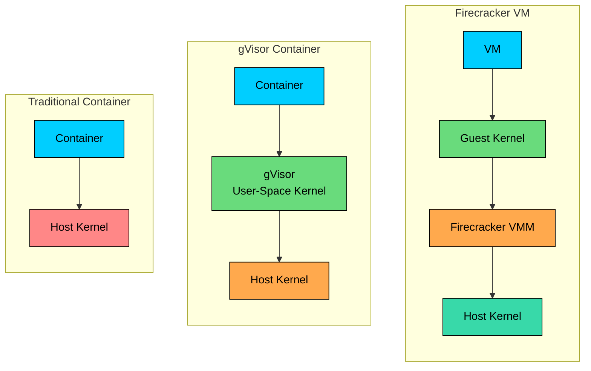

**Pros:**

- **Strongest isolation:** VM-level security boundaries
- **Production-proven:** Used by major cloud providers for multi-tenant workloads
- **Fast startup:** Firecracker boots in ~125ms (vs seconds for traditional VMs)

**Cons:**

- **More complex operations:** Requires managing VM infrastructure
- **Higher resource overhead:** Each micro-VM needs its own kernel memory
- **Newer technology:** Less community experience compared to Docker

### Summary and Recommendation

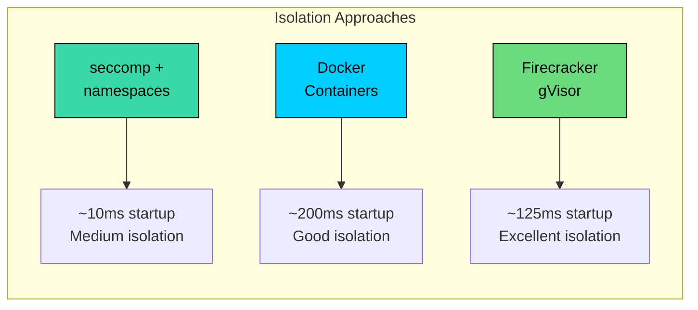

| Strategy                 | Isolation Level | Startup Time | Complexity | Best For                                     |
| ------------------------ | --------------- | ------------ | ---------- | -------------------------------------------- |
| **seccomp + namespaces** | Medium          | ~10ms        | High       | High-performance judges with Linux expertise |
| **Docker containers**    | Good            | ~200ms       | Medium     | Most online judges, good balance             |
| **Firecracker/gVisor**   | Excellent       | ~125ms       | High       | High-security requirements, large scale      |

#### **Recommendation**

For most online judges, **Docker containers** offer the best trade-off. They are secure enough for the threat model (users who might try to cheat, not nation-state attackers), easy to operate, and well-understood by engineers. As your platform grows and handles more sensitive use cases (enterprise customers, high-stakes competitions), consider migrating to **Firecracker** for stronger isolation.

### Sandbox Execution Architecture

Here is a detailed view of what happens inside a judge worker when it executes a submission:

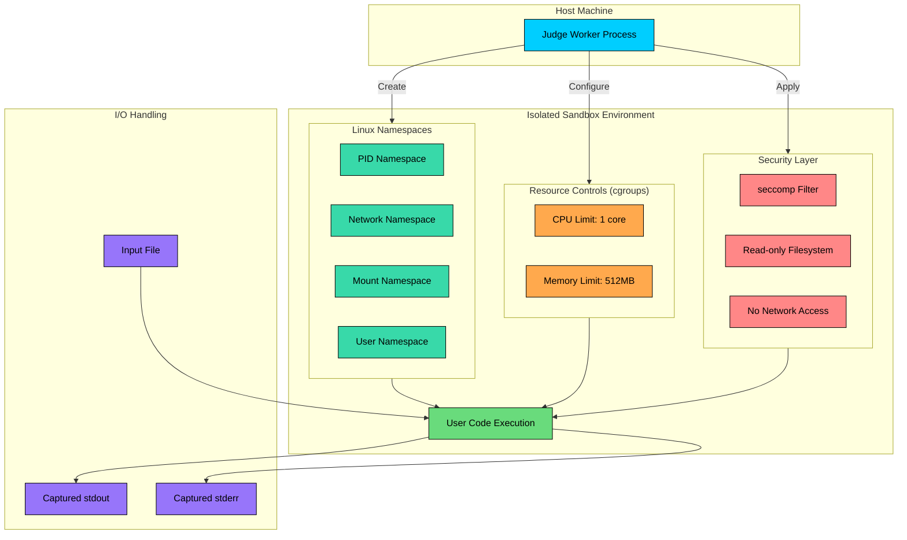

### Docker Container Execution Flow

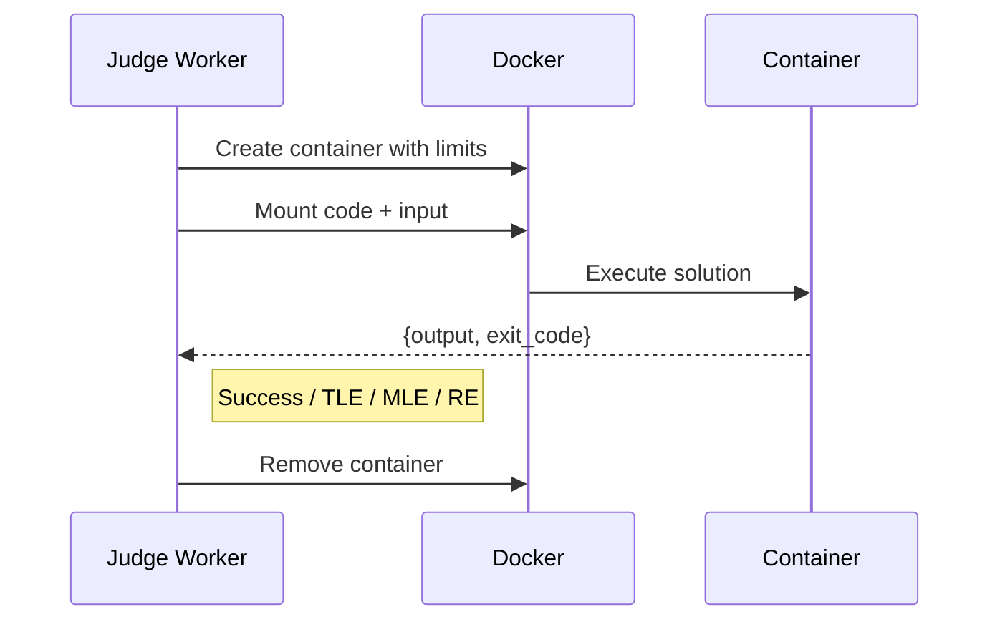

## 6.2 Judge System Design

Now that we understand how to run code safely, let's look at how the judge system orchestrates the entire evaluation process. Each judge worker is a stateless service that pulls submissions from the queue and processes them independently.

### How a Judge Worker Processes a Submission

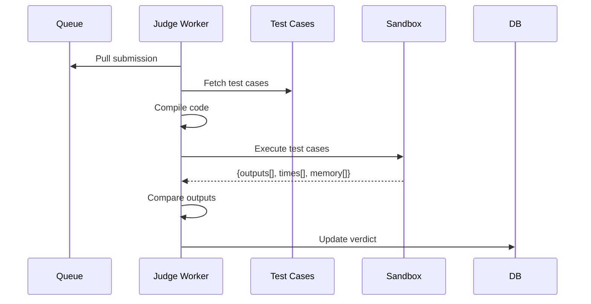

### Judge Worker Architecture

Each judge worker follows this execution flow:

```mermaid
flowchart TD
    A[Pull from Queue]:::primary --> B[Fetch Test Cases]:::secondary
    B --> C{Compile Code}:::orange
    C -->|Success| D[Run Test Cases]:::green
    C -->|Error| E[Return CE Verdict]:::red
    D --> F{All Passed"}:::orange
    F -->|Yes| G[Return Accepted]:::green
    F -->|No| H[Return WA/TLE/MLE/RE]:::red

    classDef primary fill:#00ceff,stroke:#000,color:#000
    classDef secondary fill:#38d9a9,stroke:#000,color:#000
    classDef orange fill:#ffa94d,stroke:#000,color:#000
    classDef green fill:#69db7c,stroke:#000,color:#000
    classDef red fill:#ff8787,stroke:#000,color:#000
```

### Execution Flow Details

#### **1. Compilation**

For compiled languages (C++, Java, Go):

- Compile with strict flags and timeouts
- Capture compilation errors for user feedback
- Store compiled binary for test execution

For interpreted languages (Python, JavaScript):

- Syntax check before execution
- No separate compilation step

#### **2. Test Case Execution**

For each test case:

1. Create sandbox environment
2. Copy input file to sandbox
3. Execute with time/memory limits
4. Capture stdout, stderr, and exit code
5. Compare output with expected output
6. Record execution time and memory usage

```mermaid
flowchart TD
    subgraph "Test Case Execution Loop"
        A[Start Test Case 1]:::primary --> B[Copy Input to Sandbox]:::secondary
        B --> C[Execute Code]:::primary
        C --> D{Exit Code"}:::orange

        D -->|0| E[Capture Output]:::green
        D -->|Non-zero| F[Runtime Error]:::red
        D -->|Timeout| G[TLE]:::red
        D -->|OOM| H[MLE]:::red

        E --> I{Output Match"}:::orange
        I -->|Yes| J[Test Passed]:::green
        I -->|No| K[Wrong Answer]:::red

        J --> L{More Tests"}:::orange
        K --> M[Stop: WA]:::red
        F --> N[Stop: RE]:::red
        G --> O[Stop: TLE]:::red
        H --> P[Stop: MLE]:::red

        L -->|Yes| Q[Next Test Case]:::primary
        L -->|No| R[All Passed: AC]:::green
        Q --> B
    end

    classDef primary fill:#00ceff,stroke:#000,color:#000
    classDef secondary fill:#38d9a9,stroke:#000,color:#000
    classDef orange fill:#ffa94d,stroke:#000,color:#000
    classDef green fill:#69db7c,stroke:#000,color:#000
    classDef red fill:#ff8787,stroke:#000,color:#000
```

#### **3. Output Comparison**

Output comparison must handle edge cases:

- **Trailing whitespace:** Typically ignored
- **Trailing newlines:** Usually ignored
- **Floating point precision:** Allow small epsilon for float comparisons
- **Presentation errors:** Some systems distinguish wrong format from wrong answer

```mermaid
flowchart LR
    subgraph "Output Comparison"
        A[User Output]:::rose --> B[Normalize]:::primary
        C[Expected Output]:::green --> D[Normalize]:::primary
        B --> E{Compare}:::orange
        D --> E
        E -->|Match| F[Accepted]:::green
        E -->|Mismatch| G[Wrong Answer]:::red
    end

    subgraph "Normalization Steps"
        N1[Trim trailing whitespace]:::secondary
        N2[Normalize line endings]:::secondary
        N3[Handle float precision]:::secondary
    end

    classDef primary fill:#00ceff,stroke:#000,color:#000
    classDef secondary fill:#38d9a9,stroke:#000,color:#000
    classDef orange fill:#ffa94d,stroke:#000,color:#000
    classDef green fill:#69db7c,stroke:#000,color:#000
    classDef red fill:#ff8787,stroke:#000,color:#000
    classDef rose fill:#f783ac,stroke:#000,color:#000
```

### Scaling Judge Workers

#### **Auto-scaling Strategy**

Monitor queue depth and adjust worker count:

- **Scale up:** When queue depth > threshold or wait time > SLA
- **Scale down:** When workers are idle for extended periods
- **Contest mode:** Pre-scale before contests based on registration count

#### **Worker Pool Management**

### Handling Test Case Dependencies

Some problems have interdependent test cases or require special judges:

#### **Special Judges (Checkers)**

For problems with multiple valid outputs:

- User output is passed to a custom checker program
- Checker returns verdict (correct/incorrect)
- Example: "Find any valid path" problems

#### **Interactive Problems**

Some problems require back-and-forth communication:

- User program and judge program communicate via pipes
- Used for game-playing problems or adaptive testing

## 6.3 Real-Time Leaderboard System

Nothing makes a contest feel alive like watching your rank change in real-time. But building a leaderboard that updates within seconds for thousands of concurrent participants is not trivial. Let's break down how to make it work.

### Understanding Scoring Systems

Before diving into implementation, we need to understand how scores work. Different contest formats use different scoring rules:

```mermaid
flowchart TB
    subgraph "ICPC Style"
        I1[Solved Problems<br/>Primary Score]:::green
        I2[Penalty Time<br/>Tie-breaker]:::orange
        I3[Wrong Attempt<br/>+20 min penalty]:::red
    end

    subgraph "IOI Style"
        O1[Partial Credit<br/>Per Test Case]:::green
        O2[No Penalty<br/>for Wrong Attempts]:::secondary
        O3[Best Score<br/>Kept]:::primary
    end

    classDef primary fill:#00ceff,stroke:#000,color:#000
    classDef secondary fill:#38d9a9,stroke:#000,color:#000
    classDef orange fill:#ffa94d,stroke:#000,color:#000
    classDef green fill:#69db7c,stroke:#000,color:#000
    classDef red fill:#ff8787,stroke:#000,color:#000
```

| Feature         | ICPC Style      | IOI Style             |
| --------------- | --------------- | --------------------- |
| Scoring         | All-or-nothing  | Partial credit        |
| Wrong attempts  | +20 min penalty | No penalty            |
| Test visibility | Pass/Fail only  | Per-test feedback     |
| Best for        | Speed contests  | Optimization problems |

#### **ICPC Style**

- Score = Number of problems solved
- Tie-breaker = Total penalty time
- Penalty = Time of AC submission + 20 minutes per wrong attempt

#### **IOI Style**

- Partial credit: Points based on percentage of test cases passed
- No penalty for wrong attempts
- Score = Sum of points across all problems

### Implementing with Redis Sorted Sets

Redis sorted sets are the perfect data structure for real-time leaderboards. They store members with associated scores and keep them sorted automatically. Here is why they work so well:

- **O(log N) updates:** Adding or updating a score is fast even with millions of users
- **O(log N + M) range queries:** Getting the top 100 users is nearly instant
- **Built-in rank calculation:** Redis can tell you a user's rank without scanning

#### **The Score Encoding Trick:**

For ICPC-style scoring where we sort by problems solved first, then by penalty time, we need to encode both into a single score:

This encoding ensures:

- Users with more solved problems rank higher
- Among equal solves, lower penalty ranks higher

#### **Redis Commands**

### Handling High Concurrency

During contests, thousands of submissions may be judged simultaneously:

#### **Atomic Updates**

Use Redis MULTI/EXEC for atomic score updates:

1. Calculate new score based on submission result
2. Update sorted set atomically
3. Publish update event for real-time notifications

#### **Caching Leaderboard Pages**

- Cache computed leaderboard pages with short TTL (1-5 seconds)
- Invalidate on score updates
- Serve stale data briefly to handle burst traffic

### Real-Time Notifications

Push leaderboard changes to connected clients:

#### **WebSocket Approach**

1. Clients subscribe to contest leaderboard channel
2. When scores update, publish event to channel
3. Server broadcasts delta updates to subscribers

#### **Server-Sent Events (SSE)**

- Simpler than WebSocket for one-way updates
- Clients receive streaming updates
- Better for leaderboard-only real-time features

### Real-Time Leaderboard Architecture

```mermaid
flowchart TB
    subgraph Clients["Connected Clients"]
        C1[Client 1]:::primary
        C2[Client 2]:::primary
        C3[Client N]:::primary
    end

    subgraph WebSocketLayer["Real-Time Layer"]
        WSS[WebSocket Server]:::secondary
        PUB[Redis Pub/Sub]:::red
    end

    subgraph LeaderboardService["Leaderboard Service"]
        LS[Score Calculator]:::primary
        REDIS[(Redis Sorted Set)]:::purple
    end

    subgraph JudgeLayer["Judge Layer"]
        JW[Judge Worker]:::green
    end

    JW -->|"Verdict: Accepted"| LS
    LS -->|"Calculate new score"| REDIS
    LS -->|"PUBLISH update"| PUB
    PUB -->|"Subscribe"| WSS
    WSS -->|"Push delta"| C1
    WSS -->|"Push delta"| C2
    WSS -->|"Push delta"| C3

    C1 -.->|"GET leaderboard"| REDIS
    C2 -.->|"GET leaderboard"| REDIS

    classDef primary fill:#00ceff,stroke:#000,color:#000
    classDef secondary fill:#38d9a9,stroke:#000,color:#000
    classDef purple fill:#9775fa,stroke:#000,color:#000
    classDef green fill:#69db7c,stroke:#000,color:#000
    classDef red fill:#ff8787,stroke:#000,color:#000
```

### Sequence Diagram: Real-Time Leaderboard Update

```mermaid
sequenceDiagram
    participant Judge as Judge Worker
    participant Leaderboard as Leaderboard Service
    participant Redis
    participant WS as WebSocket Server
    participant Clients

    Judge->>Leaderboard: Verdict: Accepted
    Leaderboard->>Redis: Calculate & update score
    Leaderboard->>Redis: PUBLISH update
    Redis->>WS: Forward event
    WS->>Clients: Broadcast rank change
```

## 6.4 Rate Limiting and Abuse Prevention

Without proper safeguards, users could flood the system with submissions, trying every possible solution until one works, or simply overwhelming our judge workers. Rate limiting and abuse prevention are essential for both fairness and system health.

### Submission Rate Limiting

Different scenarios call for different limits. During normal practice, we can be more lenient. During contests, we need stricter controls to prevent brute-force guessing.

**Per-User Limits:**

| Context | Limit | Rationale |
|---------|-------|-----------|
| Normal mode | 10 submissions/minute/problem | Allows iteration while preventing spam |
| Contest mode | 5 submissions/minute/problem | Stricter to prevent brute-forcing |
| Global | 30 submissions/minute total | Caps total system load per user |

**Implementation with Redis:**

We use a sliding window rate limiter backed by Redis. For each user and problem combination, we track submission counts with a TTL:

### Rate Limiting Flow

```mermaid
flowchart TD
    A[Incoming Submission]:::primary --> B{Check Rate Limit}:::orange

    B -->|"GET rate_limit:{user}:{problem}:{minute}"| C[Redis]:::red
    C --> D{Count < Limit"}:::orange

    D -->|Yes| E[INCR counter]:::green
    E --> F[Set TTL 60s if new]:::green
    F --> G[Allow Submission]:::green
    G --> H[Process Submission]:::primary

    D -->|No| I[Reject with 429]:::red
    I --> J[Return: Too Many Requests]:::red

    subgraph RateLimitTypes["Rate Limit Checks"]
        RL1[Per-Problem: 10/min]:::secondary
        RL2[Global: 30/min]:::secondary
        RL3[Contest: 5/min]:::secondary
    end

    B --> RateLimitTypes

    classDef primary fill:#00ceff,stroke:#000,color:#000
    classDef secondary fill:#38d9a9,stroke:#000,color:#000
    classDef orange fill:#ffa94d,stroke:#000,color:#000
    classDef green fill:#69db7c,stroke:#000,color:#000
    classDef red fill:#ff8787,stroke:#000,color:#000
```

### Code Execution Limits

#### **Time Limits**

- Wall clock time: 2-3x the CPU time limit
- Prevents infinite loops and sleep-based attacks

#### **Memory Limits**

- Hard limit enforced by cgroup/container
- Process killed immediately on violation

#### **Output Limits**

- Limit stdout/stderr to 64KB
- Prevents disk-filling attacks

### Anti-Cheat Measures

```mermaid
flowchart TB
    subgraph "During Contest"
        A[IP Monitoring]:::orange --> A1[Flag same IP<br/>multiple accounts]
        B[Timing Analysis]:::orange --> B1[Flag unusually<br/>fast solutions]
        C[Submission Pattern]:::orange --> C1[Detect copy-paste<br/>patterns]
    end

    subgraph "Post Contest"
        D[MOSS/JPlag]:::primary --> D1[Code similarity<br/>analysis]
        E[Manual Review]:::primary --> E1[Human verification<br/>of flagged cases]
        F[Penalty]:::red --> F1[Disqualification<br/>+ Ban]
    end

    A1 --> D
    B1 --> D
    C1 --> D
    D1 --> E
    E1 --> F

    classDef primary fill:#00ceff,stroke:#000,color:#000
    classDef orange fill:#ffa94d,stroke:#000,color:#000
    classDef red fill:#ff8787,stroke:#000,color:#000
```

#### **During Contests**

- **IP monitoring:** Flag accounts submitting from same IP
- **Solution similarity:** Run plagiarism detection after contest
- **Timing analysis:** Unusually fast solutions may indicate cheating

#### **Plagiarism Detection**

- Compare submissions using code similarity algorithms (MOSS, JPlag)
- Run after contest ends to avoid real-time overhead
- Manual review for flagged cases

## 6.5 Handling Traffic Spikes During Contests

Contests are the ultimate stress test for an online judge. When a popular contest starts, thousands of participants rush to submit their solutions simultaneously. A contest that starts at 2:00 PM will see a massive spike at exactly 2:00 PM as everyone submits their first attempt. The system must handle these predictable but intense spikes gracefully.

### Before the Contest: Preparation

The key to surviving traffic spikes is preparation. Since contest times are scheduled in advance, we can predict and prepare for the surge.

#### **Capacity Planning:**

1. **Estimate load:** Registration count × average submissions per user (typically 20-50)
2. **Calculate workers needed:** Peak submissions ÷ judge throughput per worker
3. **Add buffer:** 2x the calculated capacity for safety margin
4. **Pre-scale:** Spin up workers 30 minutes before the contest starts

#### **Cache Warming:**

Before the contest begins, we proactively load:

- Contest problem descriptions into CDN and application cache
- Test cases onto judge workers (so they do not need to fetch during the rush)
- Health checks on all critical infrastructure

### During the Contest: Priority and Degradation

Once the contest begins, we need to ensure contest submissions get priority over everything else.

#### **Priority Queue System:**

Not all submissions are equally urgent. We use separate queues with different SLAs:

| Priority | Use Case | SLA | Rationale |
|----------|----------|-----|-----------|
| High | Contest submissions | 10s | User experience is critical during competition |
| Normal | Practice submissions | 30s | Can tolerate some delay |
| Low | Re-judges, batch jobs | 5 min | Background work, not user-facing |

```mermaid
flowchart TB
    subgraph "Priority Queue System"
        direction TB
        HQ[High Priority<br/>Contest Submissions<br/>SLA: 10s]:::red
        NQ[Normal Priority<br/>Practice Submissions<br/>SLA: 30s]:::orange
        LQ[Low Priority<br/>Re-judges, Batch<br/>SLA: 5min]:::secondary
    end

    subgraph "Judge Workers"
        JW[Worker Pool]:::primary
    end

    HQ -->|Process First| JW
    NQ -->|Process Second| JW
    LQ -->|Process Last| JW

    classDef primary fill:#00ceff,stroke:#000,color:#000
    classDef secondary fill:#38d9a9,stroke:#000,color:#000
    classDef orange fill:#ffa94d,stroke:#000,color:#000
    classDef red fill:#ff8787,stroke:#000,color:#000
```

#### **Circuit Breakers**

If judge workers are overwhelmed:

- Temporarily increase queue depth limits
- Return "judging delayed" status instead of failing
- Shed load from non-contest submissions

### Graceful Degradation

When under extreme load:

1. **Disable non-essential features:** Solution viewing, statistics
2. **Increase caching:** Accept slightly stale data
3. **Queue submissions:** Return "pending" status, process later
4. **Horizontal scaling:** Auto-scale additional workers

### Auto-Scaling Architecture

```mermaid
flowchart TB
    subgraph Monitoring["Monitoring Layer"]
        MQ[Message Queue]:::orange
        METRICS[Metrics Collector]:::secondary
    end

    subgraph AutoScaler["Auto-Scaler"]
        AS[Scaling Controller]:::primary
        RULES[Scaling Rules]:::secondary
    end

    subgraph WorkerPool["Judge Worker Pool"]
        W1[Worker 1]:::green
        W2[Worker 2]:::green
        W3[Worker 3]:::green
        WN[Worker N]:::green
    end

    MQ -->|Queue Depth| METRICS
    W1 -->|CPU/Memory Usage| METRICS
    W2 -->|CPU/Memory Usage| METRICS

    METRICS --> AS
    RULES --> AS

    AS -->|Scale Up| WN
    AS -->|Scale Down| W3

    subgraph ScalingRules["Scaling Rules"]
        R1["Queue > 100: +5 workers"]:::orange
        R2["P95 wait > 30s: +10 workers"]:::orange
        R3["Idle > 10min: -1 worker"]:::orange
        R4["Contest start: Pre-scale to 100"]:::orange
    end

    RULES --- ScalingRules

    classDef primary fill:#00ceff,stroke:#000,color:#000
    classDef secondary fill:#38d9a9,stroke:#000,color:#000
    classDef orange fill:#ffa94d,stroke:#000,color:#000
    classDef green fill:#69db7c,stroke:#000,color:#000
```

### Graceful Degradation Strategy

When load exceeds capacity, we degrade gracefully rather than failing completely. The system monitors load and automatically adjusts behavior:

```mermaid
flowchart TD
    subgraph Normal["Normal Operation"]
        N1[All features enabled]:::green
        N2[Standard queue processing]:::green
        N3[Real-time leaderboard]:::green
    end

    subgraph Elevated["Elevated Load (2-5x)"]
        E1[Increase cache TTL]:::orange
        E2[Scale up workers]:::orange
        E3[Enable request coalescing]:::orange
    end

    subgraph High["High Load (5-10x)"]
        H1[Disable solution viewing]:::orange
        H2[Batch leaderboard updates]:::orange
        H3[Priority queue for contest]:::orange
    end

    subgraph Critical["Critical Load (10x+)"]
        C1[Shed non-contest traffic]:::red
        C2[Return queued status]:::red
        C3[Emergency scaling]:::red
    end

    LOAD[Incoming Load]:::primary --> CHECK{Load Level"}:::primary

    CHECK -->|Normal| Normal
    CHECK -->|2-5x| Elevated
    CHECK -->|5-10x| High
    CHECK -->|10x+| Critical

    Normal --> PROCESS[Process All]:::green
    Elevated --> PROCESS
    High --> PROCESS
    Critical --> PROCESS

    classDef primary fill:#00ceff,stroke:#000,color:#000
    classDef orange fill:#ffa94d,stroke:#000,color:#000
    classDef green fill:#69db7c,stroke:#000,color:#000
    classDef red fill:#ff8787,stroke:#000,color:#000
```

#### **What happens at each level:**

- **Normal:** Everything works as expected
- **Elevated (2-5x):** Auto-scale workers, increase cache TTLs, coalesce similar requests
- **High (5-10x):** Disable non-essential features (solution viewing, statistics), batch leaderboard updates every 5 seconds instead of real-time
- **Critical (10x+):** Shed all non-contest traffic, return "queued" status for delayed processing, emergency scaling

### Contest Timeline: Scaling Events

```mermaid
gantt
    title Contest Scaling Timeline
    dateFormat HH:mm
    axisFormat %H:%M

    section Pre-Contest
    Cache warming           :a1, 09:00, 30m
    Pre-scale workers (100) :a2, 09:15, 15m
    Health checks           :a3, 09:25, 5m

    section Contest Active
    Contest starts          :milestone, m1, 09:30, 0m
    Peak load (start rush)  :crit, b1, 09:30, 15m
    Steady state            :b2, 09:45, 90m
    Final rush              :crit, b3, 11:15, 15m
    Contest ends            :milestone, m2, 11:30, 0m

    section Post-Contest
    Scale down workers      :c1, 11:30, 30m
    Run plagiarism check    :c2, 11:35, 60m
    Finalize rankings       :c3, 12:30, 15m
```

---

# Conclusion

Designing an online coding platform like LeetCode is a fascinating exercise because it touches on so many different challenges: secure execution of untrusted code, queue-based architectures for handling variable workloads, real-time systems for contest leaderboards, and graceful degradation under extreme traffic.

The key takeaways from this design:

1. **Security is non-negotiable.** When running arbitrary code from users, sandboxing must be airtight. Start with Docker containers, graduate to Firecracker as you scale.
2. **Queues absorb traffic spikes.** The message queue between the submission service and judge workers is what allows the system to handle 10x traffic during contests without falling over.
3. **Real-time features need specialized data structures.** Redis sorted sets are perfect for leaderboards, giving us O(log N) updates and instant rank lookups.
4. **Plan for predictable spikes.** Contest traffic is predictable. Pre-scale workers, warm caches, and have a graceful degradation strategy ready.

This architecture can comfortably handle millions of submissions per day while providing a responsive user experience even during peak contest times.

---

# References

- [Docker Security Best Practices](https://docs.docker.com/engine/security/) - Container security documentation
- [Firecracker Design](https://firecracker-microvm.github.io/) - AWS's micro-VM technology for secure multi-tenant workloads

---

# Quiz
