> 💡 **Key Insight:**

> **What is Online Chess"**
>
> Online Chess is a platform that allows players to play chess against each other over the internet in real-time. Players are matched based on skill level, make moves that are instantly transmitted to their opponent, and compete under various time controls with chess clocks ticking down.
>
> 
> <!-- Simulation: chess -->
> 

>
> The core challenge is creating a seamless, real-time experience where both players see a consistent game state, moves are validated instantly, and time is tracked accurately despite network latency. Unlike turn-based games with relaxed timing, chess demands sub-second responsiveness and precise clock management.
>
> **Popular Examples:** [Chess.com](https://chess.com/), [Lichess.org](https://lichess.org/), [Chess24](https://chess24.com/)

This system design problem combines real-time communication, game state management, matchmaking algorithms, and rating systems. It tests your ability to design low-latency systems while handling the complexities of distributed state synchronization.

In this article, we will explore the **high-level design of an online chess platform**.

### Game Lifecycle Overview

Before we dive into the technical requirements, it helps to understand what actually happens during an online chess game. Every game follows a predictable lifecycle, and understanding this flow will shape our design decisions.

It starts with **matchmaking**, where a player clicks "Play" and waits to be paired with an opponent of similar skill. Once matched, the game begins and both players connect to the same game session. 

Moves are exchanged back and forth, clocks tick down, and eventually the game ends, either decisively through checkmate, resignation, or timeout, or as a draw.

The tricky part is handling the edge cases. What happens when a player's internet drops mid-game" They need a chance to reconnect, but we cannot leave their opponent waiting forever. What if both players run out of time simultaneously" What if someone tries to make an illegal move" These scenarios will drive much of our design complexity.

With this lifecycle in mind, let's clarify what exactly we are building.

---

# 1. Clarifying Requirements

Online chess sounds straightforward, but there are many decisions to make before we can start designing. How many simultaneous games do we need to support" What time controls" Should spectators be able to watch" 

These questions shape everything from our database schema to our real-time communication strategy.

In an interview setting, you would want to ask these questions upfront. Here is how that conversation might unfold:

> 💡 **Key Insight:**

> **DISCUSSION**
>
> **Candidate:** "What is the expected scale" How many concurrent games should the system support""
>
> **Interviewer:** "Let's design for 1 million concurrent games at peak, with 10 million registered users."
>
> **Candidate:** "What time controls should we support" Bullet, Blitz, Rapid, or Classical""
>
> **Interviewer:** "All of them. We need accurate clock management from 1-minute bullet games to 30-minute rapid games."
>
> **Candidate:** "Should players be able to spectate ongoing games""
>
> **Interviewer:** "Yes, popular games should support thousands of spectators watching live."
>
> **Candidate:** "Do we need a rating system for matchmaking""
>
> **Interviewer:** "Yes, we need an ELO-style rating system, and matchmaking should pair players of similar skill levels."
>
> **Candidate:** "What happens if a player disconnects mid-game""
>
> **Interviewer:** "The player should have a grace period to reconnect. If they don't return, the game should be adjudicated, either as a loss or draw depending on the position."
>
> **Candidate:** "Should we store game history for review and analysis""
>
> **Interviewer:** "Yes, players should be able to review past games with move-by-move playback."

After gathering the details, we can summarize the key system requirements.

## 1.1 Functional Requirements

Based on the discussion, here are the core features our platform must support:

- **Matchmaking:** Match players of similar rating for a game with specified time controls.
- **Real-time Gameplay:** Players make moves that are instantly visible to their opponent.
- **Move Validation:** All moves must be validated server-side to prevent illegal moves and cheating.
- **Chess Clock:** Accurate time tracking with increment support (e.g., 5+3 means 5 minutes with 3-second increment per move).
- **Game Termination:** Detect checkmate, stalemate, draw conditions, timeout, and resignation.
- **Spectating:** Allow users to watch ongoing games in real-time.
- **Rating System:** Update player ratings after each game using an ELO-based system.
- **Game History:** Store completed games for review and analysis.

## 1.2 Non-Functional Requirements

Beyond features, we need to define the quality attributes that make the system production-ready:

- **Low Latency:** Move transmission should be under 100ms for a responsive experience.
- **High Availability:** The system must be highly available (99.99% uptime).
- **Consistency:** Both players must see the same game state at all times.
- **Scalability:** Support 1 million concurrent games with potential spikes during tournaments.
- **Fair Time Tracking:** Chess clocks must be accurate within 100ms despite network latency.
- **Graceful Disconnection Handling:** Players should be able to reconnect to their game if their connection drops briefly.

---

# 2. Back-of-the-Envelope Estimation

Before diving into architecture, let's understand the scale we are dealing with. These calculations will guide our infrastructure decisions and help us identify potential bottlenecks.

### Concurrent Games and Move Traffic

Our target is 1 million concurrent games at peak. This is roughly the scale of major platforms like Chess.com during busy hours. Let's work out what this means for our servers.

A typical blitz game lasts about 10 minutes with around 60 total moves (30 per player). This means each game generates about one move every 10 seconds on average, though in practice moves come in bursts with pauses for thinking.

One hundred thousand moves per second is significant but manageable. Each move needs to be validated, the game state updated, clocks adjusted, and the result broadcast to both players and any spectators. This will be the heartbeat of our system.

### Connection Count

Every game requires persistent WebSocket connections for real-time communication. With 1 million concurrent games and 2 players per game, we need at minimum 2 million active connections.

But games also have spectators. Most games have zero viewers, but popular matches might attract thousands. If we assume an average of 2 spectators per game (accounting for this skewed distribution), that adds another 2 million connections.

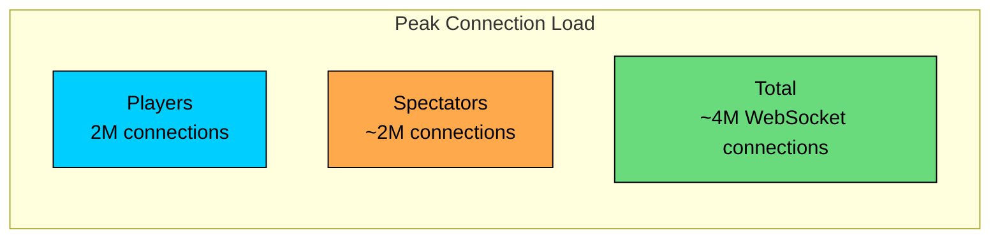

Four million simultaneous WebSocket connections is a substantial number. We will need multiple WebSocket gateway servers and careful connection management.

### Matchmaking Load

Not everyone playing is in an active game. About 10% of connected players are typically in the matchmaking queue at any moment, waiting for an opponent. With 2 million players connected:

We divide by 2 because each match removes two players from the queue. Creating over 3,000 matches per second requires efficient queue management and fast rating lookups.

### Storage Requirements

Each completed game needs to be stored for history and analysis. Let's estimate the size:

| Component | Size | Notes |
|-----------|------|-------|
| Game metadata | ~200 bytes | Players, result, timestamps, time control |
| Move history | ~500 bytes | 60 moves in algebraic notation (e.g., "e4 e5 Nf3 Nc6...") |
| Final position | ~100 bytes | FEN string for the ending position |
| **Total per game** | **~1 KB** | |

With 10 million games played daily (a reasonable estimate given our concurrent game count):

This is very manageable by modern standards. A single PostgreSQL instance can handle this for years, and object storage for long-term archival is cheap.

### Bandwidth

Move messages are small, around 100 bytes including the move itself, timestamps, and updated clock values. At 100,000 moves per second:

Even accounting for spectator broadcasts and protocol overhead, we are well within the capacity of modern network infrastructure. Bandwidth will not be our bottleneck.

---

# 3. Core APIs

With our requirements and scale understood, let's define the API contract. We need two types of APIs: REST endpoints for operations like finding a match or retrieving game history, and WebSocket connections for the real-time gameplay itself.

The distinction matters because these operations have fundamentally different characteristics. Finding a match is a one-time request that can tolerate a few hundred milliseconds of latency. But once in a game, every move needs to travel as quickly as possible, which is why we use persistent WebSocket connections for gameplay.

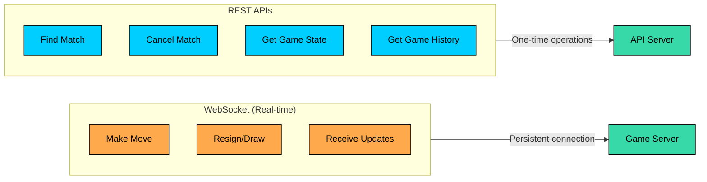

Let's walk through each endpoint.

### 3.1 Find Match

#### **Endpoint:** `POST /matchmaking/find`

This is where every game begins. When a player clicks "Play", the client calls this endpoint to enter the matchmaking queue. The server will find a suitable opponent and notify the player when a match is ready.

#### **Request Parameters:**

| Parameter | Type | Required | Description |
|-----------|------|----------|-------------|
| `time_control` | string | Yes | Time control in "base+increment" format (e.g., "5+3" for 5 minutes with 3-second increment) |
| `rated` | boolean | No | Whether the game affects ratings. Default: true |
| `color_preference` | enum | No | "white", "black", or "random". Default: "random" |

#### **Example Request:**

#### **Success Response (200 OK):**

The response includes a WebSocket URL for the client to connect to. Once connected, the client will receive a notification when a match is found.

#### **Error Responses:**

| Status Code | Meaning | When It Occurs |
|-------------|---------|----------------|
| `400 Bad Request` | Invalid input | Malformed time control (e.g., "5+abc") |
| `409 Conflict` | Already queued | Player is already in a game or matchmaking queue |
| `429 Too Many Requests` | Rate limited | Too many matchmaking attempts in a short period |

### 3.2 Cancel Matchmaking

#### **Endpoint:** `DELETE /matchmaking/{queue_id}`

Players sometimes change their mind or need to step away. This endpoint removes them from the queue before a match is found.

#### **Success Response (200 OK):**

### 3.3 Get Game State

#### **Endpoint:** `GET /games/{game_id}`

This endpoint serves two purposes: reconnection and spectating. If a player's connection drops mid-game, they need to fetch the current game state to resume. Spectators also use this to get the initial state before subscribing to live updates.

#### **Success Response (200 OK):**

The `fen` field contains the current board position in Forsyth-Edwards Notation, a standard way to represent chess positions. The `moves` array contains all moves played so far in UCI format (e.g., "e2e4" means pawn from e2 to e4).

### 3.4 Get Game History

#### **Endpoint:** `GET /users/{user_id}/games`

Players want to review their past games, analyze their mistakes, and track improvement over time. This endpoint returns a paginated list of completed games.

#### **Query Parameters:**

| Parameter | Type | Default | Description |
|-----------|------|---------|-------------|
| `limit` | integer | 20 | Maximum results to return |
| `offset` | integer | 0 | Number of results to skip (for pagination) |
| `result` | enum | all | Filter by "win", "loss", or "draw" |

#### **Success Response (200 OK):**

### 3.5 WebSocket: Real-time Gameplay

#### **Connection URL:** `wss://play.chess.com/ws/game/{game_id}`

This is where the actual game happens. Both players maintain a persistent WebSocket connection to the game server, enabling instant bidirectional communication. Let's look at the message types exchanged.

#### Client to Server Messages

Players send these messages to make moves and interact with the game:

**Make Move:** The most common message. The client sends the source and destination squares. The optional `promotion` field is used when a pawn reaches the back rank and must become another piece.

The `client_timestamp` helps with latency compensation, which we will discuss in the deep dive section.

**Resign:** When a player gives up.

**Offer Draw:** Proposes a draw to the opponent.

**Respond to Draw Offer:** Accept or decline.

#### Server to Client Messages

The server broadcasts game state updates to both players and any spectators:

**Move Confirmation:** Sent after the server validates and applies a move. Includes the updated position, clock times, and whose turn it is.

**Game Over:** Sent when the game ends, including the result and rating changes.

**Opponent Status:** Sent when the opponent disconnects or reconnects, so the player knows what is happening.

### 3.6 Complete Game Flow

Let's see how all these APIs work together in a complete game, from clicking "Play" to the final checkmate:

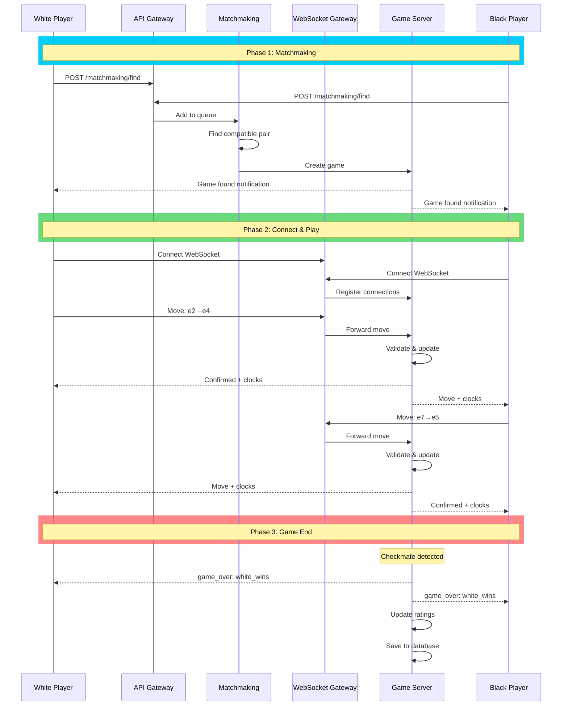

This sequence illustrates the three distinct phases of a game. Matchmaking is a brief period of waiting. The game itself is an intense exchange of real-time messages. And the ending involves cleanup, rating updates, and storage for future analysis.

---

# 4. High-Level Design

Now we get to the interesting part: designing the system architecture. Rather than overwhelming you with a complex diagram upfront, we will build the design incrementally, addressing one requirement at a time. This mirrors how you would approach the problem in an interview and makes it easier to understand why each component exists.

Our system needs to handle four core responsibilities:

1. **Matchmaking:** Find suitable opponents and create game sessions
2. **Real-time Gameplay:** Transmit moves instantly between players
3. **Game State Management:** Validate moves, track clocks, detect game endings
4. **Spectating:** Broadcast games to viewers without affecting players

The central challenge here is maintaining **consistency while achieving low latency**. In most distributed systems, you make trade-offs between these goals. But for chess, both are essential. If players see different board positions, the game breaks. If moves take seconds to transmit, bullet chess becomes unplayable. We need both.

Let's build up our architecture one component at a time.

## 4.1 Requirement 1: Matchmaking

When a player clicks "Play", they expect to be matched with an opponent of similar skill within a reasonable time. This is harder than it sounds. Match too quickly with anyone, and you get frustrating blowouts. Wait too long for the perfect match, and players leave. The matchmaking system must balance these competing goals.

### Components Needed

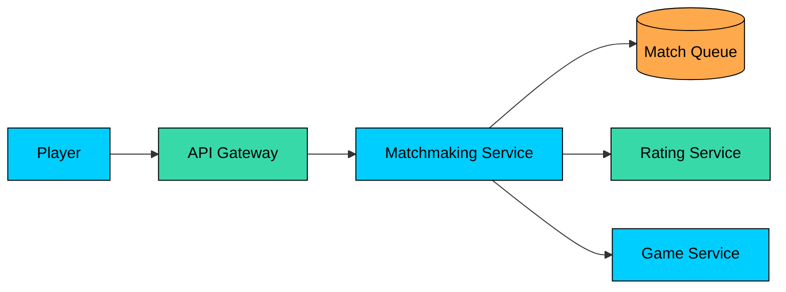

#### **Matchmaking Service**

This is the brain of the matching process. It maintains queues of players waiting for games, organized by time control (you do not want someone seeking a 1-minute bullet game matched with someone looking for a 30-minute rapid game). The service continuously scans these queues for compatible pairs based on rating proximity and preferences.

When it finds a good match, it removes both players from the queue, creates a new game session, and notifies both parties where to connect.

#### **Rating Service**

Matchmaking depends on knowing each player's skill level. The Rating Service stores and manages player ratings, tracking their current ELO/Glicko rating, rating history, and statistics. It gets consulted during matchmaking and updated after every game ends.

### The Matchmaking Flow

Here is what happens when a player seeks a game:

1. The player sends a `POST /matchmaking/find` request specifying their preferred time control
2. The **Matchmaking Service** looks up the player's current rating from the **Rating Service**
3. The player is added to the appropriate **Match Queue** (there are separate queues for each time control like 3+0, 5+3, 15+10)
4. The matchmaker continuously scans for compatible pairs:
   - Initially looks for players within a tight rating range (e.g., +/- 50 points)
   - Over time, the range expands to reduce wait times
   - Also considers preferences like color choice
5. When a match is found:
   - Both players are removed from the queue atomically
   - A new game session is created
   - Both players receive a WebSocket URL to join their game

The expanding rating window is key to the user experience. You would rather wait 30 seconds for a good match than 5 minutes for a perfect one, but you also do not want an 800-rated beginner facing a 2000-rated expert.

---

## 4.2 Requirement 2: Real-time Gameplay

Once two players are matched, the real challenge begins: they need to exchange moves in real-time. Traditional HTTP request/response is too slow for this. By the time you establish a connection, send a request, get a response, and close the connection, precious seconds have passed. In bullet chess, that is the difference between winning and losing on time.

This is where WebSockets come in. Unlike HTTP, a WebSocket connection stays open, allowing instant bidirectional communication. When a player makes a move, it travels through the open connection immediately without the overhead of establishing a new connection.

### Components Needed

#### **WebSocket Gateway**

This is the entry point for all real-time game traffic. It accepts WebSocket connections from players, authenticates them, and routes messages to the appropriate game server. The gateway also handles the messy reality of network connections: what happens when a connection drops" When a player switches from WiFi to cellular" The gateway manages these edge cases so the game servers can focus on chess logic.

#### **Game Server**

The Game Server is where the actual chess game lives. It maintains the game state in memory (the current position, move history, clock times), validates every incoming move against chess rules, manages the clocks, and detects when the game ends. When anything changes, it broadcasts the update to both players.

Each game server hosts many concurrent games. Since game state is relatively small (a few KB per game) and games are independent of each other, a single server can easily handle thousands of simultaneous games.

### The Move Flow

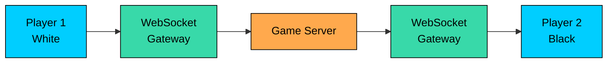

Let's trace what happens when White plays e4:

1. **Player clicks e4:** The client sends a message through the WebSocket: `{"type": "move", "from": "e2", "to": "e4"}`
2. **Gateway routes the message:** The WebSocket Gateway knows which Game Server hosts this particular game and forwards the message there
3. **Game Server validates and applies:** The server checks that it is indeed White's turn, that there is a pawn on e2, and that e4 is a legal destination. If valid, it updates the position, stops White's clock, starts Black's clock, and checks if this move ends the game
4. **Broadcast to both players:** The server sends the move confirmation to both players, including the updated clocks
5. **Black sees the move:** The opponent's board updates almost instantly

The entire round trip typically takes under 50ms on a good connection. That is fast enough that the game feels instantaneous.

---

## 4.3 Requirement 3: Game State Consistency

Here is a nightmare scenario: White thinks they just captured Black's queen. Black thinks the queen is still on the board. Who is right" Without consistency guarantees, neither player can trust what they see, and the game becomes meaningless.

This is why we use a **server-authoritative model**. The game server is the single source of truth for the game state. Clients are just displays, they show what the server tells them to show. If there is ever a discrepancy, the server wins.

### How It Works

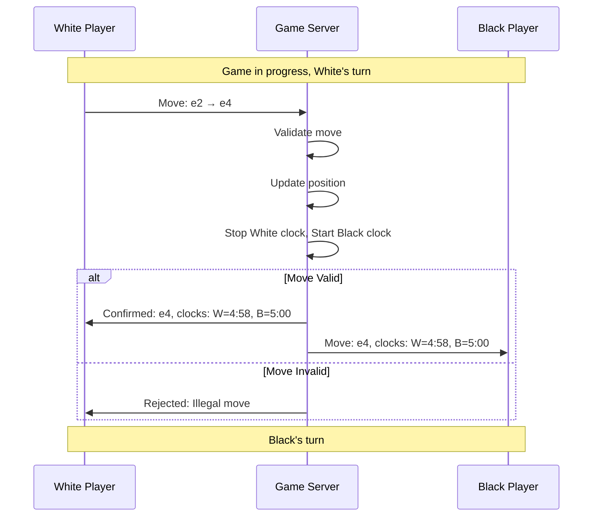

Every move follows this pattern. The player sends their move to the server. The server validates it (is it this player's turn" Is the move legal" Does it leave the king in check"). If valid, the server updates the canonical state and broadcasts to both players. If invalid, the server rejects the move and the player must try again.

This model prevents several types of problems:

- **Illegal moves** cannot sneak through because the server enforces the rules
- **Desynchronization** is impossible because both clients receive the same updates
- **Clock manipulation** is prevented because the server controls time

### Optimistic Updates (Optional Enhancement)

For an even snappier feel, the client can optimistically show the move before server confirmation. When you drag a piece, it appears to move instantly. 

Behind the scenes, the move is sent to the server for validation. If the server accepts it (which it almost always will for legal moves), nothing visible changes. If the server rejects it (you tried an illegal move or it was not your turn), the client reverts to the correct state.

This technique makes the game feel more responsive, especially over slower connections. The trade-off is slightly more complex client code.

### Handling Reconnection

Network connections drop. WiFi cuts out. Phones switch from cellular to WiFi. These things happen, and the system needs to handle them gracefully.

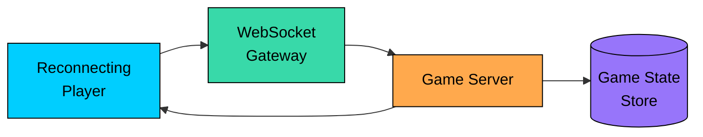

When a player's connection drops and they reconnect:

1. The client establishes a new WebSocket connection and identifies the game it was in
2. The **Game Server** retrieves the current game state (usually still in memory, backed by persistent storage)
3. The server sends a complete state snapshot: current position, all moves played, both clock times, whose turn it is
4. The client rebuilds its view from this snapshot and resumes play

From the player's perspective, the board just reappears where they left off. Their opponent may not even notice the brief disconnection.

---

## 4.4 Requirement 4: Spectating

When Magnus Carlsen plays a bullet game on Lichess, thousands of people want to watch. When a popular streamer goes live, their games attract massive audiences. Our system needs to handle this without affecting the players' experience.

The naive approach would be to have all spectators connect directly to the game server. But if 10,000 people are watching a single game, that is 10,000 WebSocket connections and 10,000 message broadcasts for every move. The game server would be overwhelmed, and more importantly, the two players who are actually playing might experience lag.

### The Solution: Spectator Service

We separate spectator traffic from player traffic entirely. Players connect to the Game Server. Spectators connect to dedicated Spectator Services that receive game updates through a pub/sub system.

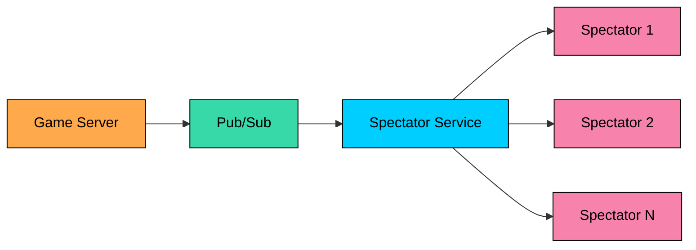

Here is how it works:

1. When a move is made, the **Game Server** publishes the update to a pub/sub channel for that game (using Redis Pub/Sub or Kafka)
2. **Spectator Service** instances subscribe to games they have viewers for
3. Each Spectator Service receives the update once and broadcasts it to all its connected spectators
4. Spectators see the move, typically with a small delay (2-5 seconds) to prevent cheating via spectator streams

This architecture scales horizontally. If a game has 50,000 spectators, we spin up more Spectator Service instances. The Game Server only publishes one message per move regardless of how many people are watching.

The delay is intentional and important. Without it, a friend watching the stream could tell the player what the opponent is about to do before they even make their move. A few seconds of delay makes this kind of cheating impractical.

---

## 4.5 Putting It All Together

Now that we have designed each component, let's step back and see how they all fit together. This is the architecture you would draw on a whiteboard in an interview:

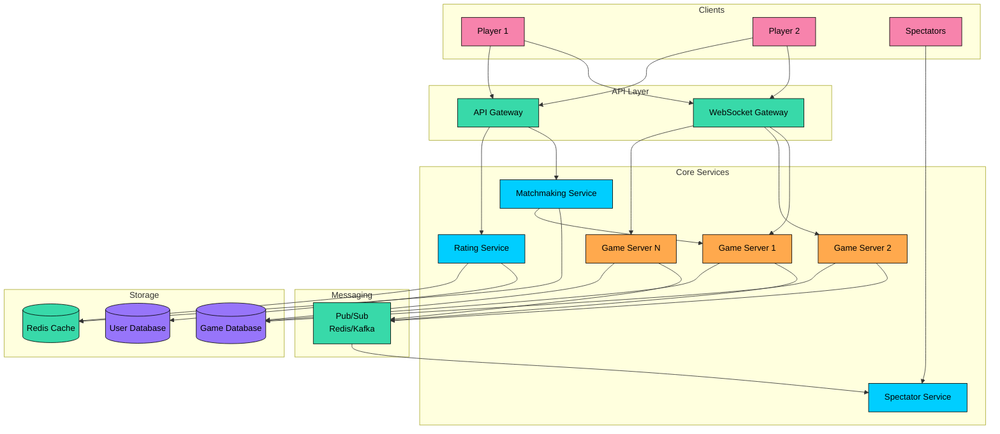

The architecture has a clear separation of concerns. REST traffic (matchmaking, game history, user profiles) flows through the API Gateway. Real-time game traffic flows through the WebSocket Gateway to Game Servers. Spectator traffic is isolated in its own path through the pub/sub system.

### Component Summary

| Component | Responsibility | Why It Exists |
|-----------|----------------|---------------|
| API Gateway | REST API handling, authentication, rate limiting | Entry point for non-real-time operations |
| WebSocket Gateway | Persistent connections for real-time gameplay | Manages the WebSocket lifecycle and routing |
| Matchmaking Service | Pairs players by rating and preferences | Keeps games competitive and wait times reasonable |
| Game Server | Validates moves, manages clocks, detects game endings | The authoritative source of game state |
| Rating Service | Calculates and stores player ratings | Makes matchmaking fair over time |
| Spectator Service | Broadcasts games to viewers | Scales spectator traffic independently |
| Pub/Sub (Redis/Kafka) | Decouples game servers from spectators | Prevents spectators from affecting gameplay |
| Game Database | Stores completed games for history | Enables game review and analysis |
| Redis Cache | Match queues, active game state, sessions | Low-latency access to hot data |

This architecture handles our requirements well. Matchmaking and gameplay are handled by specialized components. Spectators scale independently. The database only sees completed games, not the real-time traffic of moves.

---

# 5. Database Design

With the architecture in place, we need to decide how to store our data. Online chess has two fundamentally different data access patterns, and recognizing this distinction will guide our database choices.

## 5.1 Choosing the Right Databases

**Persistent data** (user accounts, ratings, completed games) needs to be durable and queryable. You want to look up a player's rating, find all games they played last month, or search for games featuring a specific opening. This data lives forever and needs reliable storage.

**Ephemeral data** (active game state, matchmaking queues, WebSocket sessions) needs to be fast but can be reconstructed if lost. When a game is in progress, you care about sub-millisecond access to the current position and clocks. If a server crashes, the game can be recovered from the last known state.

This suggests a **hybrid approach**:

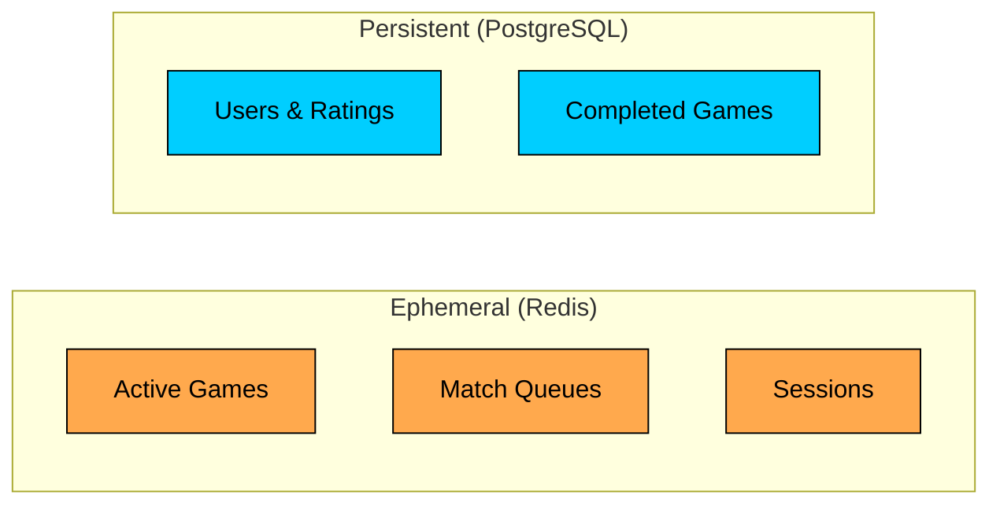

**PostgreSQL** handles user data, ratings, and completed games. It gives us ACID transactions (important for rating updates), flexible querying (find all games by a player), and mature operational tooling.

**Redis** handles everything that needs to be fast and ephemeral: active game state, matchmaking queues, and session data. Its in-memory nature provides the sub-millisecond latency we need for gameplay, and if a Redis node fails, we can reconstruct the state from persistent storage.

## 5.2 Database Schema

Let's look at the PostgreSQL schema for our persistent data. We have three main entities: users, ratings, and games.

### Users Table

The Users table is straightforward. It stores account information and authentication credentials.

| Field | Type | Description |
|-------|------|-------------|
| `user_id` | UUID | Primary key. UUIDs prevent enumeration attacks |
| `username` | VARCHAR(50) | Display name, must be unique |
| `email` | VARCHAR(255) | Used for login and notifications |
| `password_hash` | VARCHAR(255) | bcrypt hash, never store plain text |
| `created_at` | TIMESTAMP | Account creation time |
| `last_login` | TIMESTAMP | For activity tracking |
| `status` | VARCHAR(20) | "active", "banned", "deleted" |

### Ratings Table

Here is where it gets interesting. Players have different ratings for different time controls. A bullet specialist might be 2000 in 1-minute games but only 1600 in classical. The composite primary key of `(user_id, time_control)` reflects this.

| Field | Type | Description |
|-------|------|-------------|
| `user_id` | UUID | Foreign key to Users |
| `time_control` | VARCHAR(20) | "bullet", "blitz", "rapid", "classical" |
| `rating` | INTEGER | Current rating (typically 400-2800) |
| `rating_deviation` | INTEGER | Uncertainty in the rating (Glicko-2 uses this) |
| `games_played` | INTEGER | Total rated games in this time control |
| `peak_rating` | INTEGER | Personal best |
| `updated_at` | TIMESTAMP | Last time this rating changed |

The `rating` column is indexed for matchmaking. When looking for opponents within a rating range, this index makes the query fast.

### Games Table

Every completed game gets stored here. This table grows the fastest (10 million rows per day in our estimates) but each row is relatively small.

| Field | Type | Description |
|-------|------|-------------|
| `game_id` | UUID | Unique identifier |
| `white_user_id`, `black_user_id` | UUID | The two players |
| `time_control` | VARCHAR(20) | What time control was used |
| `rated` | BOOLEAN | Did this affect ratings" |
| `result` | VARCHAR(20) | "white_wins", "black_wins", "draw" |
| `termination` | VARCHAR(30) | How the game ended (checkmate, timeout, etc.) |
| `white_rating_before`, `black_rating_before` | INTEGER | Ratings at game start |
| `white_rating_change`, `black_rating_change` | INTEGER | How much each rating moved |
| `moves` | TEXT | Full move sequence in algebraic notation |
| `final_fen` | VARCHAR(100) | Final position |
| `opening_eco`, `opening_name` | VARCHAR | Opening classification |
| `started_at`, `ended_at` | TIMESTAMP | Game duration |

The key indexes here are on `white_user_id` and `black_user_id` (for "show me my games" queries) and on `started_at` (for "show me recent games" queries).

## 5.3 Redis Data Structures

Redis handles our real-time data using its native data structures:

### Active Games (Hash)

Each active game is stored as a Redis hash, allowing partial updates without rewriting the entire object.

### Match Queues (Sorted Set)

Players waiting for matches are stored in sorted sets, with their rating as the score. This makes range queries (find all players with rating 1400-1600) extremely efficient.

To find matches for a 1500-rated player with +/- 100 range:

This returns all players in the rating window in O(log N + M) time, where N is the queue size and M is the result count.

---

# 6. Design Deep Dive

The high-level architecture gives us a solid foundation, but system design interviews often go deeper. In this section, we will explore the most challenging aspects of our design: validating chess moves, managing time fairly, building an effective matchmaking system, implementing ratings, handling disconnections, and scaling for spectators.

These are the topics that separate a good answer from a great one.

## 6.1 Move Validation and Chess Engine

Every move a player attempts must be validated server-side before being accepted. This is not optional. Without server validation, a cheating client could send illegal moves, and there would be no way to maintain a fair game.

### What Needs to Be Validated"

Chess rules are more complex than they first appear. For each incoming move, the server must verify:

1. **Turn order:** Is it actually this player's turn"
2. **Piece ownership:** Is there a piece of the right color on the source square"
3. **Legal movement:** Can this piece type legally move in this pattern" (Knights move in L-shapes, bishops move diagonally, etc.)
4. **Path clearance:** Is the path clear" (Bishops, rooks, and queens cannot jump over pieces)
5. **King safety:** Does this move leave the player's own king in check"
6. **Special moves:** Is castling legal here" Is en passant available" Is pawn promotion being handled correctly"

```mermaid
flowchart TD
    Start[Receive Move]:::primary --> Turn{Correct turn"}
    Turn -->|No| Reject1[Reject: Not your turn]:::red
    Turn -->|Yes| Owner{Own piece on<br/>source square"}
    Owner -->|No| Reject2[Reject: Invalid piece]:::red
    Owner -->|Yes| Legal{Legal move for<br/>this piece type"}
    Legal -->|No| Reject3[Reject: Illegal move]:::red
    Legal -->|Yes| Check{King in check<br/>after move"}
    Check -->|Yes| Reject4[Reject: King in check]:::red
    Check -->|No| Special{Special move"}
    Special -->|Castling| Castle{Castling<br/>valid"}
    Special -->|En Passant| EP{En passant<br/>valid"}
    Special -->|Promotion| Promo{Promotion<br/>piece valid"}
    Special -->|Normal| Accept[Accept Move]:::green
    Castle -->|Yes| Accept
    Castle -->|No| Reject5[Reject: Cannot castle]:::red
    EP -->|Yes| Accept
    EP -->|No| Reject6[Reject: Invalid en passant]:::red
    Promo -->|Yes| Accept
    Promo -->|No| Reject7[Reject: Invalid promotion]:::red

    classDef primary fill:#00ceff,stroke:#000,color:#000
    classDef green fill:#69db7c,stroke:#000,color:#000
    classDef red fill:#ff8787,stroke:#000,color:#000
```

The flowchart shows the validation pipeline. Most moves pass quickly through the early checks. Illegal moves are rejected with a specific error message so the client knows what went wrong.

### Representing the Board: FEN Notation

The standard way to represent a chess position is **FEN (Forsyth-Edwards Notation)**. It is a single string that captures the complete state of the board:

This compact string encodes everything we need:

- **Piece positions:** All 64 squares, rank by rank (lowercase = black, uppercase = white, numbers = empty squares)
- **Turn:** Whose move it is (b = black in this example)
- **Castling rights:** Which castling moves are still possible (KQkq means both sides can castle both ways)
- **En passant:** If a pawn just moved two squares, this tracks where en passant is possible (e3 in this example)
- **Halfmove clock:** Moves since last pawn move or capture (for 50-move rule)
- **Fullmove number:** Which move number we are on

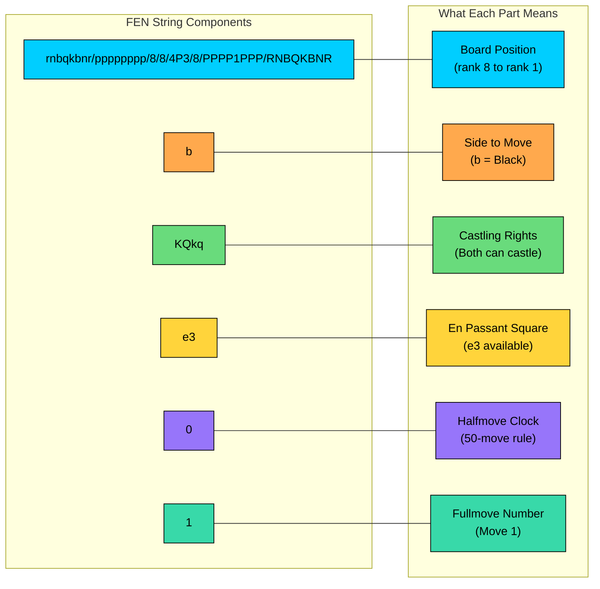

### Implementation Approaches

There are two ways to implement move validation: use an existing chess library, or build it yourself.

#### Approach 1: Use a Chess Library

This is the pragmatic choice for most teams. Battle-tested libraries exist for every major language:

- **Python:** `python-chess` (mature, well-documented)
- **JavaScript/TypeScript:** `chess.js` (popular, browser-compatible)
- **Rust:** `shakmaty` (high performance)
- **Java:** `chesslib` (solid implementation)

Here is how simple move validation becomes with a library:

The library handles all the edge cases: en passant, castling through check, stalemate detection, threefold repetition, the 50-move rule. You get correct behavior without implementing hundreds of rules.

**Trade-offs:** You take on an external dependency, and if you need extreme performance (millions of moves per second), you may need to optimize.

#### Approach 2: Custom Bitboard Implementation

For maximum performance, you can implement move generation using bitboards. A bitboard represents the board as a 64-bit integer where each bit corresponds to a square.

With bitboards, many operations become fast bitwise operations:

- Pawn pushes: shift by 8 bits
- Knight attacks: lookup table indexed by square
- Sliding pieces: magic bitboards for ray attacks

**Trade-offs:** Bitboards are fast but complex to implement correctly. Edge cases like castling rights, en passant legality, and underpromotion require careful handling.

### Which Should You Choose"

For an interview, mention that you would use a library in production. Implementing chess rules from scratch is a solved problem, and the edge cases (castling through check, en passant timing, insufficient material draws) are tricky enough that reinventing the wheel is rarely worth it.

That said, if the interviewer asks about performance optimization, knowing about bitboard representation shows depth of knowledge.

---

## 6.2 Chess Clock Management

In over-the-board chess, you hit a physical clock after making your move. The mechanism is simple: press your side, your clock stops, opponent's clock starts. Online, we need to replicate this with distributed systems, network latency, and no physical clock in sight.

Getting time management right is harder than it sounds. Consider this scenario: a player with 100ms network latency makes a move with 1 second left on their clock. By the time the move reaches the server, the server's view of their clock shows 0.9 seconds. Did they flag (run out of time)" Who decides" How do we keep it fair for players with different internet speeds"

### Understanding Time Controls

Before tackling the technical challenges, let's understand how chess time controls work. They are specified as `base+increment`:

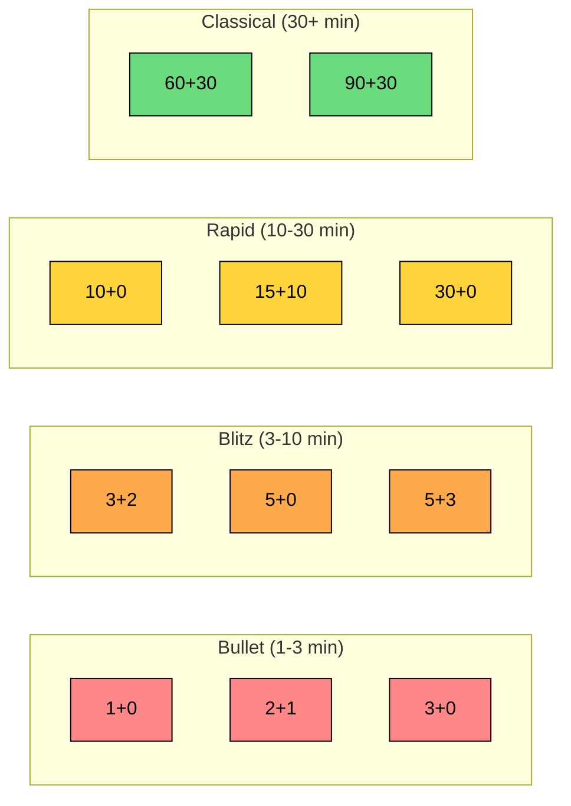

Common examples:

- **3+0:** 3 minutes total, no increment. Pure bullet chess where every fraction of a second counts.
- **5+3:** 5 minutes total, 3 seconds added after each move. The increment prevents pure "premove" races.
- **15+10:** 15 minutes with 10-second increment. Rapid chess with time to think.

The increment is crucial for fair play. Without it, games often come down to who can move faster, not who can play better. Adding a few seconds per move keeps the focus on chess quality.

### The Latency Problem

Here is where online chess gets tricky. Network latency varies between players, and it creates a fundamental fairness problem.

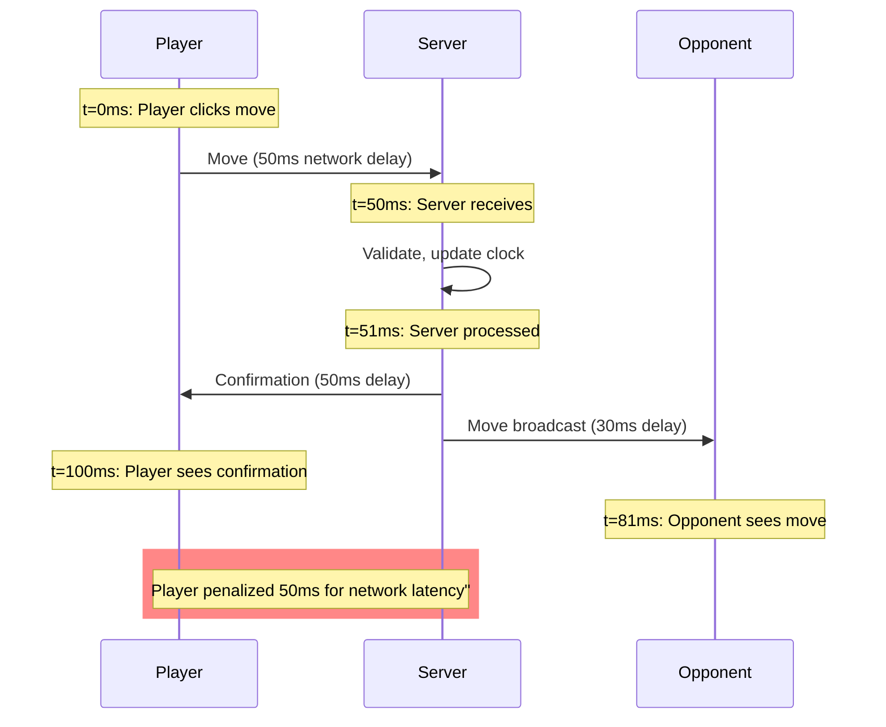

Look at what happens when a player makes a move. From the player's perspective, they clicked instantly. But by the time the move reaches the server, 50ms have passed. If we charge this 50ms to their clock, players with faster internet have a real competitive advantage.

This is unfair. A player in Mumbai playing against someone in the same city as the server should not lose on time just because of geography.

### Approaches to Fair Timing

There are several ways to handle this, each with trade-offs:

#### Approach 1: Pure Server Authority

The simplest approach: the server clock is always right. When a move arrives:

**The problem:** High-latency players are penalized. If your internet adds 100ms of delay, you effectively have 100ms less time per move than your opponent.

#### Approach 2: Client Timestamps with Validation

The client sends a local timestamp with each move. The server uses this to estimate when the player actually made the move:

This is fairer but opens the door to cheating. A malicious client could lie about timestamps to get extra time.

#### Approach 3: Lag Compensation

Track each player's average latency and use it to compensate:

The server estimates when the move was actually made by subtracting half the round-trip time. This is the most accurate approach and what most serious chess platforms use.

The downside is complexity: you need to measure latency continuously, handle latency spikes gracefully, and prevent manipulation.

### Keeping Clocks in Sync

Regardless of which timing approach we use, both clients need to display the same clock values. Here is how we keep them synchronized:

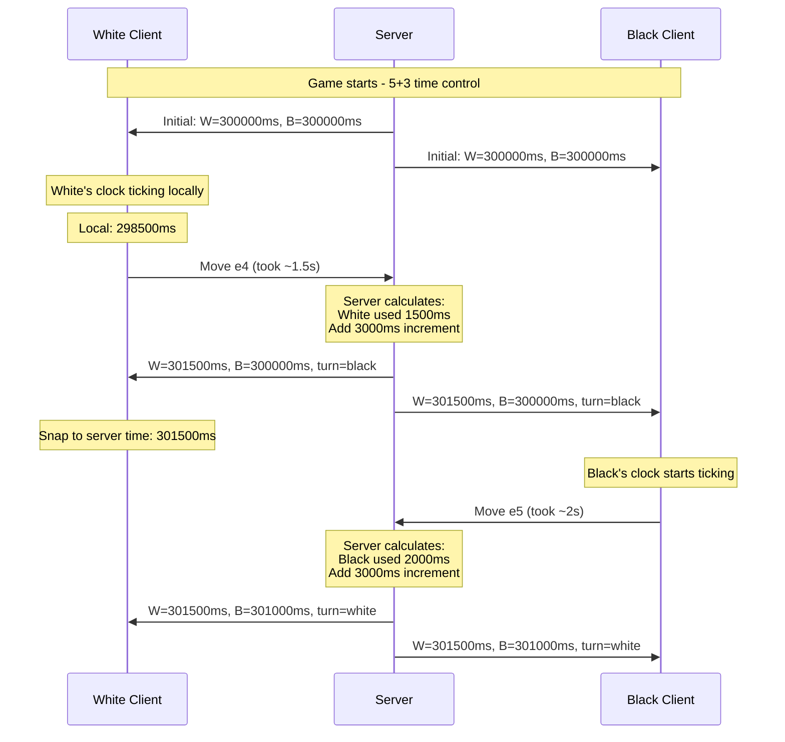

The key insight: **the server is authoritative, but clients do local countdown for smooth display**. Between server updates, the client counts down locally. When the server sends a clock update (with each move), the client snaps to the server's value. Usually the difference is small, and the snap is imperceptible.

If the difference is large (indicating network issues or clock drift), the client might show a brief adjustment. This is better than showing incorrect time.

### When Time Runs Out

The server detects timeout in two ways:

1. **Passive:** When a player tries to move but their clock has expired
2. **Active:** A periodic check (every 100ms) catches timeouts when no move is attempted

When a clock hits zero, the game ends. But there is one important edge case: if your opponent has insufficient material to checkmate (just a king, or king and bishop), timing out is a draw, not a loss. You cannot lose on time if your opponent cannot possibly checkmate you. The server needs to check for this condition.

---

## 6.3 Matchmaking Algorithm

Matchmaking is where user experience meets algorithmic design. A player clicks "Play" and expects to be in a game within seconds, against someone they have a reasonable chance of beating (or losing to). Get this wrong, and players leave frustrated.

The core tension is between **match quality** and **wait time**. A perfect match (two players with identical ratings) might take 5 minutes to find. A quick match might pair a 1000-rated player with a 1500. Neither extreme is acceptable.

### The Expanding Window Approach

The solution is an expanding rating window. Start narrow, and widen over time:

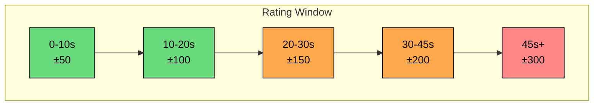

Consider a 1500-rated player searching for a game:

| Time Waiting | Rating Window | Who They Might Face |
|--------------|---------------|---------------------|
| 0-10 seconds | 1450-1550 | Very close match, ideal |
| 10-20 seconds | 1400-1600 | Good match, slight skill difference |
| 20-30 seconds | 1350-1650 | Acceptable |
| 30+ seconds | 1300-1700 | Getting desperate |
| 60+ seconds | 1200-1800 | Maximum range, cap here |

The window never expands beyond +/- 300 points. A 500-point gap (like 1500 vs 2000) creates a nearly unwinnable game for the lower-rated player. Better to wait than to play a lopsided match.

### Queue Data Structure

We need to efficiently find players within a rating range. Redis sorted sets are perfect for this:

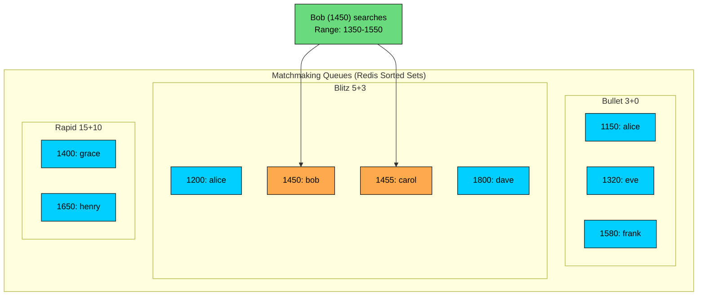

To find matches for a 1450-rated player with +/- 100 range:

This returns Bob and Carol as potential matches. The operation is O(log N + M) where N is the queue size and M is the number of results, fast even with thousands of players queued.

### The Matching Algorithm

Here is the core algorithm for finding a match:

The sorting criteria matter. We prioritize rating proximity first because match quality is more important than wait time. But when ratings are equal, we favor players who have waited longer.

### Handling Race Conditions

With thousands of players searching simultaneously across multiple matchmaking servers, two servers might try to match the same player at the same time. We need to handle this gracefully.

Redis provides atomic operations for this. We use WATCH to detect if another process modified our target players:

If the transaction fails (because another server already matched one of these players), we simply retry with different candidates. This is optimistic concurrency control in action.

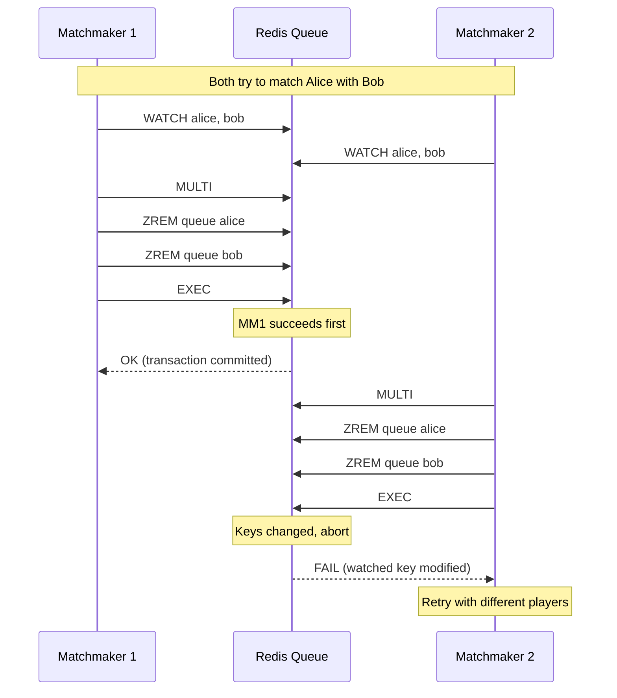

The diagram shows what happens when two matchmakers race. Only one wins, and the other gracefully retries. No player gets double-matched.

---

## 6.4 Rating System (ELO and Glicko)

Rating systems are the foundation of fair matchmaking. A player's rating should reflect their true skill: beat weaker opponents and your rating stays flat, beat stronger opponents and it rises, lose to weaker opponents and it falls.

The challenge is designing a system that:

- Accurately reflects skill differences
- Updates appropriately after each game
- Converges quickly for new players (so they reach their true rating fast)
- Handles the uncertainty of knowing someone's skill after only a few games

### The Classic: ELO

The ELO system, invented by Arpad Elo for chess, is elegant in its simplicity:

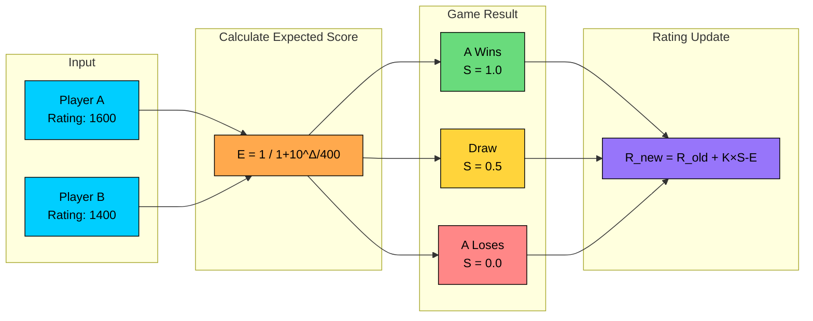

The system works in two steps:

**Step 1: Calculate Expected Score**

Before the game, we calculate the probability of each player winning based on rating difference:

The 400 is a scaling constant. A 400-point difference means the higher-rated player is expected to score 91% (win most games, rarely lose).

**Example:** Player A (1600) vs Player B (1400):

The higher-rated player is expected to win 76% of games against this opponent.

**Step 2: Update Ratings Based on Actual Result**

After the game, we compare the actual result to the expectation:

Where:

- K = How much ratings can change (typically 20-32)
- Actual_Score = 1 for win, 0.5 for draw, 0 for loss

**Example:** A (1600) beats B (1400) with K=32:

The higher-rated player gains less for an expected win. If B had won the upset, they would gain more points (+24.3) while A would lose more (-24.3).

### The Problem with ELO

ELO treats all ratings as equally certain, but that is not true in practice. Consider:

- A new player rated 1500 after 5 games
- A veteran rated 1500 after 5000 games

These are not the same. The veteran is definitely around 1500. The new player might be anywhere from 1200 to 1800, we just have not seen enough games yet.

### Glicko-2: Adding Uncertainty

Glicko-2 (used by Lichess and most modern platforms) tracks three values instead of one:

- **Rating (r):** The skill estimate, similar to ELO
- **Rating Deviation (RD):** How uncertain we are about this rating. High RD = less reliable
- **Volatility (σ):** How consistently the player performs

This has major practical benefits:

1. **New players converge faster:** With high RD, ratings can swing by 50-100 points per game. A 1800-strength player starting at 1200 reaches their true level in 10-15 games instead of 50+.
2. **Veterans have stable ratings:** With low RD, even an upset loss costs only a few points. Flukes do not wreck established ratings.
3. **Inactivity is handled:** If you do not play for months, your RD increases. The system acknowledges that your skill might have changed.

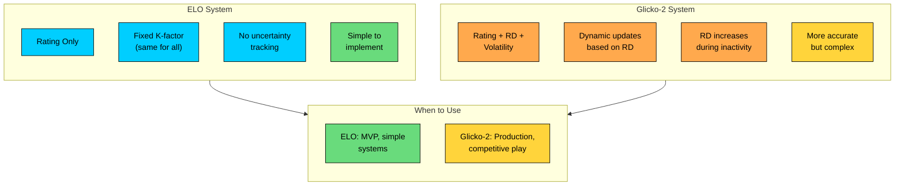

### Implementation Recommendations

| Scenario | Recommendation |
|----------|----------------|
| MVP/Simple system | ELO with K=32 |
| Production system | Glicko-2 with periodic RD increases |
| Separate pools | Different ratings per time control |
| New players | Start at 1200 with high RD, use provisional status |

### Provisional Ratings

New players should be marked "provisional" until they complete N games (typically 20-30). During this period:

- Rating changes are larger (higher K factor).
- Opponents gain/lose less rating for games against provisional players.
- Rating is hidden or marked with """ in displays.

---

## 6.5 Handling Disconnections

Networks are unreliable. Players lose internet, WiFi drops, phones switch between cellular and WiFi, browsers crash. Our system needs to handle these gracefully without ruining the game for either player.

The challenge is balancing fairness: we want to give disconnected players a chance to return, but we cannot leave their opponent waiting forever. And we need to prevent abuse, players intentionally disconnecting to avoid a loss.

```mermaid
stateDiagram-v2
    direction LR
    [*] --> Connected: Game starts
    Connected --> Disconnected: Connection lost
    Disconnected --> Connected: Reconnects in time
    Disconnected --> GameOver: Grace period expires
    Connected --> GameOver: Normal game end

    state Disconnected {
        direction TB
        [*] --> GracePeriod
        GracePeriod --> ClockPaused: Optional
        GracePeriod --> Waiting: Notify opponent
        Waiting --> [*]: Timeout
    }

    style Connected fill:#69db7c,stroke:#000,color:#000
    style Disconnected fill:#ffd43b,stroke:#000,color:#000
    style GameOver fill:#ff8787,stroke:#000,color:#000
```

### Detecting Disconnections

The server detects disconnections through:

- **WebSocket close event:** The cleanest signal. The browser tells us the connection is closing.
- **Heartbeat timeout:** Every 5 seconds, the client sends a ping. If we miss 3 consecutive pings (15 seconds), assume disconnection.
- **Clock expiration:** If a player's clock runs out and they have not moved, they are either disconnected or deliberately stalling.

### The Grace Period

When a player disconnects mid-game, we do not immediately end the game. Instead:

1. **Start a countdown** (typically 60 seconds for standard games, 30 seconds for bullet)
2. **Notify the opponent** so they know what is happening
3. **Optionally pause the disconnected player's clock** (policy decision, some platforms do not)

The opponent sees a message like "Your opponent has disconnected. They have 60 seconds to reconnect." This keeps them informed and prevents confusion.

### The Reconnection Flow

When the disconnected player returns:

```mermaid
sequenceDiagram
    participant W as White Player
    participant WS as WebSocket Gateway
    participant GS as Game Server
    participant B as Black Player

    Note over W,B: White disconnects (network issue)

    W--xWS: Connection lost
    GS->>B: opponent_status: disconnected
    Note over GS: Start 60s grace period

    rect rgb(255,215,59)
        Note over GS: Grace Period (60 seconds)
    end

    Note over W: Network restored after 30s

    W->>WS: Reconnect + game_id
    WS->>GS: Player reconnecting
    GS->>GS: Verify player belongs to game
    GS->>GS: Calculate adjusted clock time

    GS->>W: Full state snapshot:<br/>FEN, moves, clocks
    GS->>B: opponent_status: reconnected

    Note over W,B: Game resumes normally
```

The server sends a complete state snapshot so the client can rebuild the board position, clock times, and move history. From the player's perspective, the game just reappears where they left off.

### What If They Do Not Return"

If the grace period expires without reconnection, we need to end the game. There are several approaches:

| Approach | How It Works | Trade-offs |
|----------|--------------|------------|
| Automatic Loss | Disconnected player loses | Simple, but harsh for genuine network issues |
| Abort if Early | Before move 3, abort (no rating change). After that, disconnected player loses | Fairer for startup issues, prevents early-game abuse |
| Position-Based | Use engine evaluation: if disconnected player was winning, draw; if losing, they lose | Most fair, but complex to implement |

Most platforms use the "abort if early" approach. It handles the common case of a player disconnecting immediately (perhaps they realized they did not want to play) while still penalizing mid-game abandonments.

### Preventing Disconnection Abuse

Some players disconnect intentionally to avoid losing. The system needs to detect and discourage this:

1. **Pattern detection:** Track disconnection frequency and timing. A player who disconnects 80% of the time when losing is suspicious.
2. **Temporary bans:** Repeated disconnections result in matchmaking timeouts (15 minutes, then 1 hour, then longer).
3. **Rating counts normally:** A disconnection loss affects rating the same as a resignation. No gaming the system.

---

## 6.6 Spectator Scaling

When Magnus Carlsen plays online, 50,000 people might be watching. When a popular Twitch streamer plays, their audience follows along. Our system needs to broadcast games to massive audiences without affecting the actual players.

### Why This Is Tricky

The naive approach, connecting all spectators directly to the game server, does not work:

- 10,000 WebSocket connections overwhelm the game server
- Broadcasting moves to 10,000 clients takes CPU time away from serving the actual players
- A spike in spectators could cause the game server to lag or crash

The players' experience must be isolated from spectator traffic.

### The Fan-Out Architecture

```mermaid
flowchart LR
    GS[Game Server]:::orange --> PubSub[Redis Pub/Sub]:::teal
    PubSub --> SS1[Spectator Server 1]:::primary
    PubSub --> SS2[Spectator Server 2]:::primary
    PubSub --> SS3[Spectator Server N]:::primary
    SS1 --> Spec1[1000 spectators]:::rose
    SS2 --> Spec2[1000 spectators]:::rose
    SS3 --> Spec3[1000 spectators]:::rose

    classDef orange fill:#ffa94d,stroke:#000,color:#000
    classDef teal fill:#38d9a9,stroke:#000,color:#000
    classDef primary fill:#00ceff,stroke:#000,color:#000
    classDef rose fill:#f783ac,stroke:#000,color:#000
```

The architecture has three tiers:

1. **Game Server:** Hosts the actual game. When a move happens, it publishes a single message to Pub/Sub.
2. **Pub/Sub (Redis):** Receives one message and fans it out to all subscribing Spectator Servers.
3. **Spectator Servers:** Each handles up to 5,000 spectator connections. They receive moves from Pub/Sub and broadcast to their connected spectators.

The key insight: the Game Server sends one message per move, regardless of spectator count. The fan-out happens in the Pub/Sub and Spectator Server layers, which scale horizontally.

### The Spectator Delay

There is a deliberate delay (typically 3-5 seconds for casual games, 15 minutes for tournaments) between when a move happens and when spectators see it.

Why" Without the delay, a friend could watch the stream and tell the player what move is coming. With a delay, this kind of cheating becomes impractical.

The Spectator Server buffers moves and releases them after the configured delay.

### Scaling to World Championship Levels

For events with millions of viewers (World Chess Championship, Magnus Carlsen playing a marathon), even our fan-out architecture might not be enough. This is where CDN architecture comes in:

```mermaid
flowchart LR
    GS[Game Server]:::orange --> Origin[Origin Server]:::primary
    Origin --> Edge1[CDN Edge<br/>US-East]:::teal
    Origin --> Edge2[CDN Edge<br/>EU-West]:::teal
    Origin --> Edge3[CDN Edge<br/>Asia]:::teal

    Edge1 --> V1[100K viewers]:::rose
    Edge2 --> V2[200K viewers]:::rose
    Edge3 --> V3[150K viewers]:::rose

    classDef orange fill:#ffa94d,stroke:#000,color:#000
    classDef primary fill:#00ceff,stroke:#000,color:#000
    classDef teal fill:#38d9a9,stroke:#000,color:#000
    classDef rose fill:#f783ac,stroke:#000,color:#000
```

Edge nodes in each geographic region handle the local spectator traffic:

1. Game Server publishes moves to an Origin Server
2. Origin pushes updates to CDN edge nodes around the world
3. Viewers connect to their nearest edge node
4. The CDN handles the massive fan-out at each edge location

This is the same architecture used for live video streaming. The difference is that chess moves are tiny (bytes instead of megabytes per second), so the bandwidth requirements are much lower.

---

# Conclusion

Designing an online chess platform combines many system design concepts: real-time communication, distributed state management, fair matchmaking, and scalable broadcasting. The core challenge is maintaining consistency and low latency simultaneously, both players must see the same board, and moves must feel instant.

The key architectural decisions are:

- **WebSocket connections** for real-time gameplay
- **Server-authoritative state** to ensure consistency
- **Separate spectator infrastructure** to protect player experience
- **Glicko-2 ratings** for fair, adaptive matchmaking
- **Lag compensation** for clock fairness across different network conditions

These patterns extend beyond chess to any real-time competitive game, from online poker to multiplayer video games.

---

# References

- [Lichess](https://github.com/lichess-org/lila) - Open-source chess platform with excellent documentation on their architecture choices
- [Chess Programming Wiki](https://www.chessprogramming.org/Main_Page) - Comprehensive resource on chess programming, including move generation and board representation
- [Glicko-2 Rating System](http://www.glicko.net/glicko/glicko2.pdf) - Mark Glickman's paper on the Glicko-2 rating system
- [WebSocket Protocol](https://datatracker.ietf.org/doc/html/rfc6455) - RFC 6455 specification for real-time bidirectional communication

---

# Quiz
