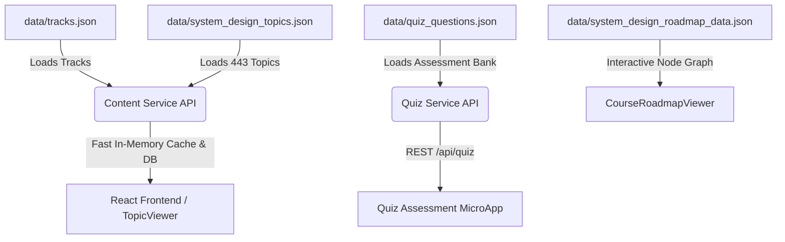

# 📦 ThreadSpeak Centralized JSON Data Catalog

This directory contains the single source of truth for all structured JSON datasets across ThreadSpeak:

---

## 📂 File Index & Structure

| File | Size | Purpose & Scope | Consumed By |
|:---|:---|:---|:---|
| **`tracks.json`** | ~2.7 KB | Master syllabus & track catalog (`core-java`, `spring-boot`, `system-design`, `dsa`). Defines track badges, gradients, and categories. | `content-service`, `frontend (Sidebar)` |
| **`system_design_topics.json`** | ~14 MB | Complete dataset of **443 System Design topics** (LLD, HLD, GoF patterns, SOLID, machine coding) with summaries, code, diagrams, ELI10, and mental models. | `content-service` (in-memory cache & PostgreSQL sync) |
| **`quiz_questions.json`** | ~5.8 KB | Bank of interactive multiple-choice quiz questions with code snippets, difficulty tiers, and answer explanations. | `quiz-service`, `QuizMicroApp.jsx` |
| **`system_design_roadmap_data.json`** | ~190 KB | Complete structural node-graph data for the interactive visual learning roadmap. | `CourseRoadmapViewer.jsx`, `frontend` |

---

## 🔄 Data Flow Architecture

---

## 🛠️ Validation & Formatting Rules
- All JSON files follow standard UTF-8 encoding.
- Indented with 2 spaces for human readability.
- Validated with strict schema keys: `id`, `trackId`, `title`, `category`, `summary`, `deepDive`, `codeSnippet`.
